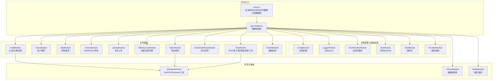
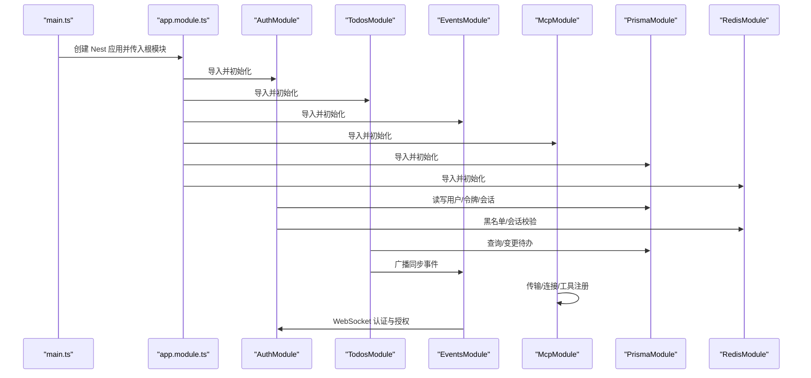
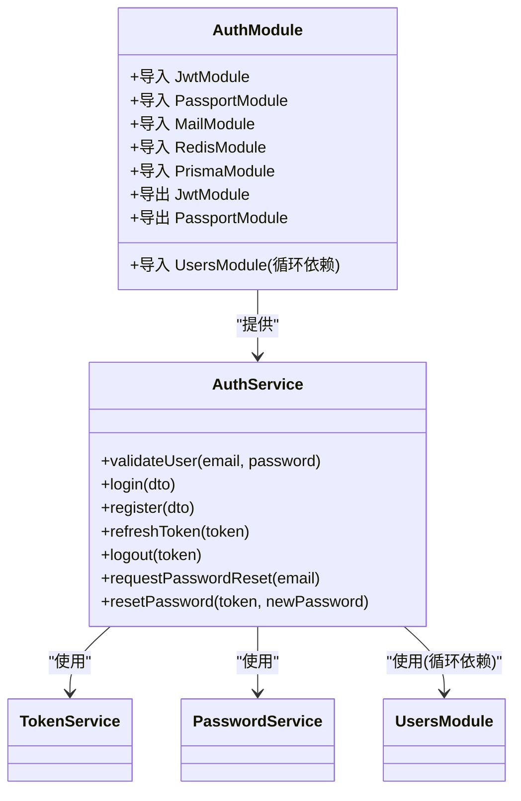
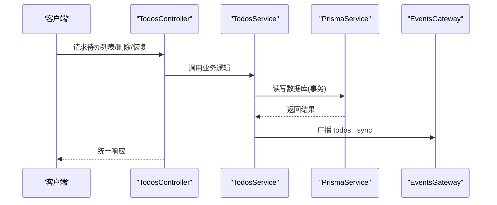
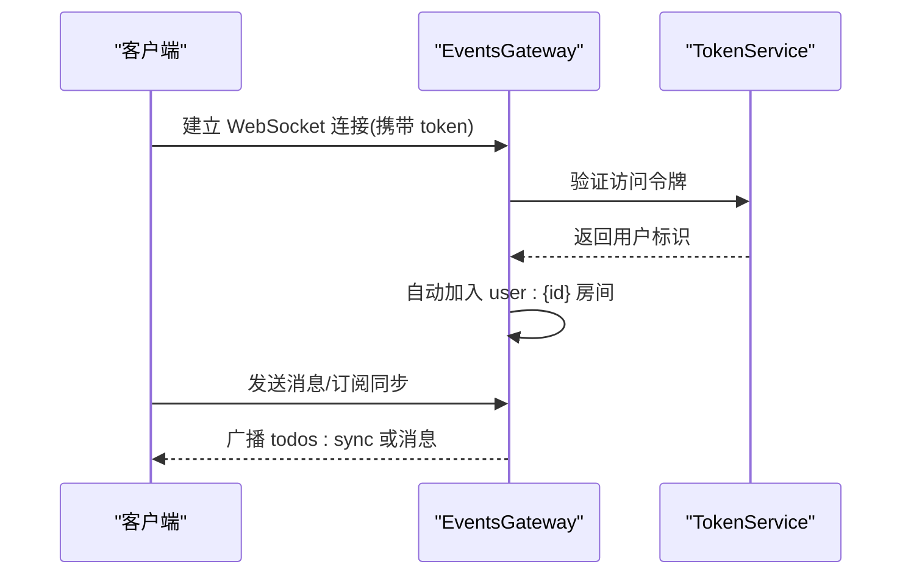
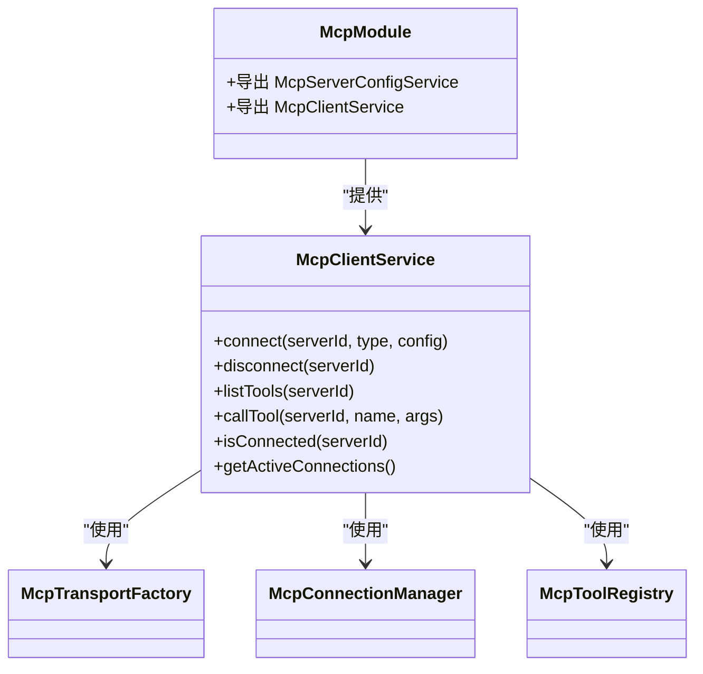
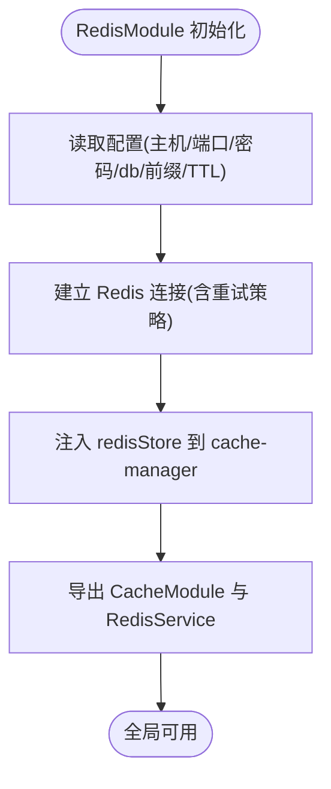
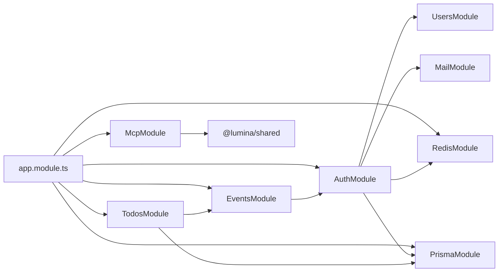

# 模块化设计

<cite>
**本文引用的文件**
- [apps/backend/src/app.module.ts](file://apps/backend/src/app.module.ts)
- [apps/backend/src/main.ts](file://apps/backend/src/main.ts)
- [apps/backend/nest-cli.json](file://apps/backend/nest-cli.json)
- [apps/backend/package.json](file://apps/backend/package.json)
- [packages/shared/src/index.ts](file://packages/shared/src/index.ts)
- [apps/backend/src/auth/auth.module.ts](file://apps/backend/src/auth/auth.module.ts)
- [apps/backend/src/todos/todos.module.ts](file://apps/backend/src/todos/todos.module.ts)
- [apps/backend/src/mcp/mcp.module.ts](file://apps/backend/src/mcp/mcp.module.ts)
- [apps/backend/src/events/events.module.ts](file://apps/backend/src/events/events.module.ts)
- [apps/backend/src/redis/redis.module.ts](file://apps/backend/src/redis/redis.module.ts)
- [apps/backend/src/prisma/prisma.module.ts](file://apps/backend/src/prisma/prisma.module.ts)
- [apps/backend/src/auth/auth.service.ts](file://apps/backend/src/auth/auth.service.ts)
- [apps/backend/src/todos/todos.service.ts](file://apps/backend/src/todos/todos.service.ts)
- [apps/backend/src/mcp/mcp-client.service.ts](file://apps/backend/src/mcp/mcp-client.service.ts)
- [apps/backend/src/events/events.gateway.ts](file://apps/backend/src/events/events.gateway.ts)
</cite>

## 目录
1. [引言](#引言)
2. [项目结构](#项目结构)
3. [核心组件](#核心组件)
4. [架构总览](#架构总览)
5. [详细组件分析](#详细组件分析)
6. [依赖分析](#依赖分析)
7. [性能考虑](#性能考虑)
8. [故障排查指南](#故障排查指南)
9. [结论](#结论)
10. [附录](#附录)

## 引言
本文件面向 Lumina Todo 项目的后端（NestJS）模块化设计，系统性阐述模块系统的设计原理、职责划分、依赖注入机制、核心业务模块组织、模块间解耦策略与接口设计原则，并给出模块依赖图与交互流程图。同时总结共享模块与业务模块的区别与使用场景，以及模块扩展的最佳实践与注意事项。

## 项目结构
后端采用多模块架构，根模块负责装配全局配置与业务模块；各业务模块按功能边界拆分，如认证、待办事项、MCP 协议、实时通信、缓存、数据库、邮件、定时任务、技能来源等。共享包提供跨模块的 Zod Schema、DTO 与工具函数，保证数据契约一致性与复用。

图表来源
- [apps/backend/src/app.module.ts:27-161](file://apps/backend/src/app.module.ts#L27-L161)
- [apps/backend/src/main.ts:34-187](file://apps/backend/src/main.ts#L34-L187)
- [apps/backend/src/prisma/prisma.module.ts:1-10](file://apps/backend/src/prisma/prisma.module.ts#L1-L10)
- [apps/backend/src/redis/redis.module.ts:26-82](file://apps/backend/src/redis/redis.module.ts#L26-L82)
- [packages/shared/src/index.ts:10-22](file://packages/shared/src/index.ts#L10-L22)

章节来源
- [apps/backend/src/app.module.ts:27-161](file://apps/backend/src/app.module.ts#L27-L161)
- [apps/backend/src/main.ts:34-187](file://apps/backend/src/main.ts#L34-L187)
- [apps/backend/nest-cli.json:1-11](file://apps/backend/nest-cli.json#L1-L11)
- [apps/backend/package.json:30-86](file://apps/backend/package.json#L30-L86)

## 核心组件
- 根模块与启动流程
  - 根模块集中导入全局配置、日志、事件、队列、国际化、速率限制、数据库、缓存、健康检查、认证、用户、邮件、WebSocket、文件上传、技能来源、待办、定时任务、MCP 等模块。
  - 启动入口在应用工厂中完成 CORS、安全头、压缩、静态资源、CSRF 校验、全局管道/过滤器/拦截器、Swagger 文档、优雅退出钩子等配置。
- 全局守卫与速率限制
  - 通过全局守卫统一限流策略，保障接口安全与稳定性。
- 共享模块与业务模块
  - 共享模块（如 PrismaModule、RedisModule、@lumina/shared）提供跨模块可复用能力与数据契约；业务模块围绕具体领域职责进行封装，通过 exports 对外暴露必要服务或模块。

章节来源
- [apps/backend/src/app.module.ts:27-161](file://apps/backend/src/app.module.ts#L27-L161)
- [apps/backend/src/main.ts:34-187](file://apps/backend/src/main.ts#L34-L187)
- [apps/backend/src/prisma/prisma.module.ts:1-10](file://apps/backend/src/prisma/prisma.module.ts#L1-L10)
- [apps/backend/src/redis/redis.module.ts:26-82](file://apps/backend/src/redis/redis.module.ts#L26-L82)
- [packages/shared/src/index.ts:10-22](file://packages/shared/src/index.ts#L10-L22)

## 架构总览
下图展示模块装配与运行时交互的关键路径：应用启动 -> 根模块装配 -> 业务模块加载 -> 服务间协作 -> 实时通信与外部协议（MCP）。

图表来源
- [apps/backend/src/main.ts:34-187](file://apps/backend/src/main.ts#L34-L187)
- [apps/backend/src/app.module.ts:27-161](file://apps/backend/src/app.module.ts#L27-L161)
- [apps/backend/src/auth/auth.module.ts:19-39](file://apps/backend/src/auth/auth.module.ts#L19-L39)
- [apps/backend/src/todos/todos.module.ts:8-14](file://apps/backend/src/todos/todos.module.ts#L8-L14)
- [apps/backend/src/events/events.module.ts:9-14](file://apps/backend/src/events/events.module.ts#L9-L14)
- [apps/backend/src/mcp/mcp.module.ts:13-24](file://apps/backend/src/mcp/mcp.module.ts#L13-L24)
- [apps/backend/src/prisma/prisma.module.ts:1-10](file://apps/backend/src/prisma/prisma.module.ts#L1-L10)
- [apps/backend/src/redis/redis.module.ts:26-82](file://apps/backend/src/redis/redis.module.ts#L26-L82)

## 详细组件分析

### 认证模块（AuthModule）
- 职责
  - 统一处理登录、注册、令牌刷新、登出、密码重置等。
  - 依赖用户服务、令牌服务、密码服务、邮件服务、Redis 缓存、数据库。
- 设计要点
  - 使用 JWT 与 Passport 策略，导出 JwtModule 与 PassportModule 以供其他模块复用。
  - 通过 TokenService 维护访问/刷新令牌与黑名单；通过 PasswordService 处理密码哈希与重置。
- 依赖关系
  - 内部依赖 UsersModule（使用 forwardRef 解决循环依赖）。
  - 外部依赖 MailModule、RedisModule、PrismaModule。

图表来源
- [apps/backend/src/auth/auth.module.ts:19-39](file://apps/backend/src/auth/auth.module.ts#L19-L39)
- [apps/backend/src/auth/auth.service.ts:12-127](file://apps/backend/src/auth/auth.service.ts#L12-L127)

章节来源
- [apps/backend/src/auth/auth.module.ts:19-39](file://apps/backend/src/auth/auth.module.ts#L19-L39)
- [apps/backend/src/auth/auth.service.ts:12-127](file://apps/backend/src/auth/auth.service.ts#L12-L127)

### 待办事项模块（TodosModule）
- 职责
  - 提供待办事项的查询、回收站管理、永久删除、清空回收站等核心能力。
- 设计要点
  - 通过 PrismaService 访问数据库；通过 EventsGateway 广播同步事件，触发前端多端同步。
  - 使用事务保证墓碑记录与删除的一致性。
- 依赖关系
  - 依赖 PrismaModule、EventsModule。

图表来源
- [apps/backend/src/todos/todos.module.ts:8-14](file://apps/backend/src/todos/todos.module.ts#L8-L14)
- [apps/backend/src/todos/todos.service.ts:26-146](file://apps/backend/src/todos/todos.service.ts#L26-L146)
- [apps/backend/src/events/events.gateway.ts:177-200](file://apps/backend/src/events/events.gateway.ts#L177-L200)

章节来源
- [apps/backend/src/todos/todos.module.ts:8-14](file://apps/backend/src/todos/todos.module.ts#L8-L14)
- [apps/backend/src/todos/todos.service.ts:26-146](file://apps/backend/src/todos/todos.service.ts#L26-L146)

### 实时通信模块（EventsModule + EventsGateway）
- 职责
  - 提供基于 Socket.IO 的 WebSocket 网关，支持认证、房间隔离、消息广播与同步通知。
- 设计要点
  - 在网关初始化阶段挂载认证中间件，校验访问令牌并拒绝无效会话。
  - 广播同步通知时采用后端防抖（500ms），避免频繁广播导致的性能问题。
- 依赖关系
  - 依赖 AuthModule（令牌验证）。

图表来源
- [apps/backend/src/events/events.module.ts:9-14](file://apps/backend/src/events/events.module.ts#L9-L14)
- [apps/backend/src/events/events.gateway.ts:57-200](file://apps/backend/src/events/events.gateway.ts#L57-L200)

章节来源
- [apps/backend/src/events/events.module.ts:9-14](file://apps/backend/src/events/events.module.ts#L9-L14)
- [apps/backend/src/events/events.gateway.ts:57-200](file://apps/backend/src/events/events.gateway.ts#L57-L200)

### MCP 协议模块（McpModule）
- 职责
  - 封装 MCP 客户端，负责传输层抽象、连接管理、工具注册与远程工具调用。
- 设计要点
  - 通过 TransportFactory 创建不同传输（HTTP/STDIO），ConnectionManager 维护连接生命周期，ToolRegistry 缓存与刷新工具清单。
  - McpClientService 作为门面，统一对外提供连接、断开、列举工具、调用工具等能力。
- 依赖关系
  - 依赖 @lumina/shared 的 MCP Schema 与 DTO。

图表来源
- [apps/backend/src/mcp/mcp.module.ts:13-24](file://apps/backend/src/mcp/mcp.module.ts#L13-L24)
- [apps/backend/src/mcp/mcp-client.service.ts:17-124](file://apps/backend/src/mcp/mcp-client.service.ts#L17-L124)

章节来源
- [apps/backend/src/mcp/mcp.module.ts:13-24](file://apps/backend/src/mcp/mcp.module.ts#L13-L24)
- [apps/backend/src/mcp/mcp-client.service.ts:17-124](file://apps/backend/src/mcp/mcp-client.service.ts#L17-L124)

### 缓存模块（RedisModule）
- 职责
  - 提供全局 Redis 缓存能力，支持连接配置、TTL、键前缀、重试策略与 ready 检查。
- 设计要点
  - 使用 @Global() 使缓存能力全局可用；通过 redisStore 注入 cache-manager，便于在任意模块使用缓存装饰器与服务。

图表来源
- [apps/backend/src/redis/redis.module.ts:26-82](file://apps/backend/src/redis/redis.module.ts#L26-L82)

章节来源
- [apps/backend/src/redis/redis.module.ts:26-82](file://apps/backend/src/redis/redis.module.ts#L26-L82)

### 数据库模块（PrismaModule）
- 职责
  - 提供全局 PrismaService，封装数据库访问。
- 设计要点
  - 使用 @Global() 保证全局单例；仅导出服务，避免污染全局命名空间。

章节来源
- [apps/backend/src/prisma/prisma.module.ts:1-10](file://apps/backend/src/prisma/prisma.module.ts#L1-L10)

## 依赖分析
- 模块耦合与内聚
  - 根模块承担“装配者”角色，业务模块保持高内聚、低耦合；通过 exports 显式暴露能力，避免隐式依赖。
  - 认证模块对用户、令牌、密码、邮件、缓存、数据库存在强关联，但通过服务边界清晰分离职责。
- 直接与间接依赖
  - TodosModule 直接依赖 PrismaModule 与 EventsModule；EventsModule 间接依赖 AuthModule（通过认证中间件）。
  - McpModule 依赖共享包的 Schema 与 DTO，确保前后端一致的数据契约。
- 外部依赖与集成点
  - Swagger、Helmet、CSRF、XSS 清理、Gzip 压缩、静态资源、Socket.IO、BullMQ、i18n、Prisma 等均在根模块或启动入口集中配置。

图表来源
- [apps/backend/src/app.module.ts:27-161](file://apps/backend/src/app.module.ts#L27-L161)
- [apps/backend/src/auth/auth.module.ts:19-39](file://apps/backend/src/auth/auth.module.ts#L19-L39)
- [apps/backend/src/todos/todos.module.ts:8-14](file://apps/backend/src/todos/todos.module.ts#L8-L14)
- [apps/backend/src/events/events.module.ts:9-14](file://apps/backend/src/events/events.module.ts#L9-L14)
- [apps/backend/src/mcp/mcp.module.ts:13-24](file://apps/backend/src/mcp/mcp.module.ts#L13-L24)
- [packages/shared/src/index.ts:10-22](file://packages/shared/src/index.ts#L10-L22)

章节来源
- [apps/backend/src/app.module.ts:27-161](file://apps/backend/src/app.module.ts#L27-L161)

## 性能考虑
- 广播防抖
  - 实时同步采用 500ms 防抖，降低频繁广播带来的网络与 CPU 压力。
- 缓存与连接池
  - RedisModule 提供连接重试与 ready 检查，避免瞬时故障影响整体可用性。
- 队列与异步任务
  - BullMQ 默认移除已完成任务，减少存储压力；指数退避策略降低重试风暴风险。
- 数据库事务
  - 删除与墓碑记录使用事务，确保一致性与可恢复性。
- 传输与工具缓存
  - MCP 工具注册表在连接成功后预热，减少后续调用的查询成本。

章节来源
- [apps/backend/src/events/events.gateway.ts:177-200](file://apps/backend/src/events/events.gateway.ts#L177-L200)
- [apps/backend/src/redis/redis.module.ts:56-64](file://apps/backend/src/redis/redis.module.ts#L56-L64)
- [apps/backend/src/mcp/mcp-client.service.ts:41-47](file://apps/backend/src/mcp/mcp-client.service.ts#L41-L47)
- [apps/backend/src/todos/todos.service.ts:96-106](file://apps/backend/src/todos/todos.service.ts#L96-L106)

## 故障排查指南
- 认证失败
  - 现象：WebSocket 连接被拒绝或返回 unauthorized。
  - 排查：确认握手时携带有效 token，且未被黑名单拦截；检查会话是否失效。
- 登录/刷新失败
  - 现象：登录或刷新令牌时报错。
  - 排查：核对 JWT 密钥与过期时间配置；检查 Redis 黑名单与会话失效状态。
- 待办同步不生效
  - 现象：本地修改后其他设备未同步。
  - 排查：确认广播定时器是否触发；检查用户房间是否正确加入；验证事件名称与负载。
- MCP 工具调用异常
  - 现象：调用工具报“未连接/工具不存在”。
  - 排查：确认已建立连接并完成工具注册；检查工具名拼写与参数结构。

章节来源
- [apps/backend/src/events/events.gateway.ts:86-116](file://apps/backend/src/events/events.gateway.ts#L86-L116)
- [apps/backend/src/auth/auth.service.ts:59-101](file://apps/backend/src/auth/auth.service.ts#L59-L101)
- [apps/backend/src/todos/todos.service.ts:82-84](file://apps/backend/src/todos/todos.service.ts#L82-L84)
- [apps/backend/src/mcp/mcp-client.service.ts:60-108](file://apps/backend/src/mcp/mcp-client.service.ts#L60-L108)

## 结论
本项目通过根模块集中装配、业务模块边界清晰、共享包统一契约的方式，实现了高内聚、低耦合的模块化架构。认证、待办、MCP、实时通信等核心模块职责明确，配合全局配置、日志、队列、国际化与速率限制，形成稳定可扩展的后端体系。建议在新增模块时遵循“显式导出、最小依赖、服务边界清晰”的原则，并优先利用共享包与基础设施模块，以降低重复造轮子的成本。

## 附录
- 模块扩展最佳实践
  - 新增模块时先定义 DTO 与 Schema（复用共享包），再编写服务与控制器，最后在根模块导入并按需导出。
  - 严格控制模块间依赖方向，避免循环依赖；必要时使用 forwardRef。
  - 对外仅导出必要的服务或模块，内部细节尽量私有化。
  - 为关键流程补充单元测试与 E2E 测试，确保变更不影响现有功能。
- 注意事项
  - 令牌与会话状态需与缓存/黑名单策略协同，避免并发场景下的状态不一致。
  - 实时广播需结合防抖与幂等设计，避免重复消息与资源浪费。
  - MCP 工具调用需做好超时与重试策略，确保用户体验与系统稳定性。