# AI助手系统

<cite>
**本文档引用的文件**
- [apps/frontend/src/features/ai/services/aiService.ts](file://apps/frontend/src/features/ai/services/aiService.ts)
- [apps/frontend/src/features/ai/services/core.ts](file://apps/frontend/src/features/ai/services/core.ts)
- [apps/frontend/src/features/ai/services/types.ts](file://apps/frontend/src/features/ai/services/types.ts)
- [apps/frontend/src/features/ai/services/utils.ts](file://apps/frontend/src/features/ai/services/utils.ts)
- [apps/frontend/src/features/ai/services/aiSyncService.ts](file://apps/frontend/src/features/ai/services/aiSyncService.ts)
- [apps/frontend/src/features/ai/services/translation.ts](file://apps/frontend/src/features/ai/services/translation.ts)
- [apps/frontend/src/features/ai/composables/useAIConfig.ts](file://apps/frontend/src/features/ai/composables/useAIConfig.ts)
- [apps/frontend/src/features/ai/composables/useChat.ts](file://apps/frontend/src/features/ai/composables/useChat.ts)
- [apps/frontend/src/features/ai/composables/useChatActions.ts](file://apps/frontend/src/features/ai/composables/useChatActions.ts)
- [apps/frontend/src/features/ai/composables/useChatActions.contextCompression.ts](file://apps/frontend/src/features/ai/composables/useChatActions.contextCompression.ts)
- [apps/frontend/src/features/ai/composables/useChatActions.toolCalls.ts](file://apps/frontend/src/features/ai/composables/useChatActions.toolCalls.ts)
- [apps/frontend/src/features/ai/composables/useChatActions.runtime.ts](file://apps/frontend/src/features/ai/composables/useChatActions.runtime.ts)
- [apps/frontend/src/features/ai/composables/useChatActions.stream.ts](file://apps/frontend/src/features/ai/composables/useChatActions.stream.ts)
- [apps/frontend/src/features/ai/composables/useAiAssistantModes.ts](file://apps/frontend/src/features/ai/composables/useAiAssistantModes.ts)
- [apps/frontend/src/features/ai/composables/useAiModeItems.ts](file://apps/frontend/src/features/ai/composables/useAiModeItems.ts)
- [apps/frontend/src/features/mcp/api/mcp.ts](file://apps/frontend/src/features/mcp/api/mcp.ts)
- [apps/frontend/src/features/ai/components/AiAssistantDrawer.vue](file://apps/frontend/src/features/ai/components/AiAssistantDrawer.vue)
- [apps/frontend/src/features/ai/components/AiAssistantInput.vue](file://apps/frontend/src/features/ai/components/AiAssistantInput.vue)
- [apps/frontend/src/features/ai/components/ChatMessageList.vue](file://apps/frontend/src/features/ai/components/ChatMessageList.vue)
- [apps/frontend/src/features/ai/components/TranslationPanel.vue](file://apps/frontend/src/features/ai/components/TranslationPanel.vue)
- [apps/frontend/src/features/ai/components/NovelCharacterCardPanel.vue](file://apps/frontend/src/features/ai/components/NovelCharacterCardPanel.vue)
- [apps/frontend/src/features/ai/components/NovelGenreSelector.vue](file://apps/frontend/src/features/ai/components/NovelGenreSelector.vue)
- [apps/frontend/src/features/ai/components/NovelWorldviewPanel.vue](file://apps/frontend/src/features/ai/components/NovelWorldviewPanel.vue)
- [apps/frontend/src/features/ai/components/ChatMessage.vue](file://apps/frontend/src/features/ai/components/ChatMessage.vue)
- [apps/frontend/src/features/ai/components/ChatMessageThinking.vue](file://apps/frontend/src/features/ai/components/ChatMessageThinking.vue)
- [apps/frontend/src/features/ai/components/AiAssistantQuickModesMenu.vue](file://apps/frontend/src/features/ai/components/AiAssistantQuickModesMenu.vue)
- [apps/frontend/src/features/ai/components/AgentWorkspaceSelector.vue](file://apps/frontend/src/features/ai/components/AgentWorkspaceSelector.vue)
- [apps/frontend/src/features/ai/components/AISettingsParameterSection.vue](file://apps/frontend/src/features/ai/components/AISettingsParameterSection.vue)
- [apps/frontend/src/features/ai/components/AiAssistantThinkingMenu.vue](file://apps/frontend/src/features/ai/components/AiAssistantThinkingMenu.vue)
- [apps/frontend/src/features/ai/composables/useChatState.ts](file://apps/frontend/src/features/ai/composables/useChatState.ts)
- [apps/backend/src/ai-sync/ai-sync.module.ts](file://apps/backend/src/ai-sync/ai-sync.module.ts)
- [apps/backend/src/ai-sync/ai-sync.controller.ts](file://apps/backend/src/ai-sync/ai-sync.controller.ts)
- [apps/backend/src/ai-sync/ai-memory.service.ts](file://apps/backend/src/ai-sync/ai-memory.service.ts)
- [apps/backend/src/ai-sync/ai-skill.service.ts](file://apps/backend/src/ai-sync/ai-skill.service.ts)
- [apps/backend/src/ai-sync/ai-preset.service.ts](file://apps/backend/src/ai-sync/ai-preset.service.ts)
- [apps/backend/src/agent/session-file/session-file.module.ts](file://apps/backend/src/agent/session-file/session-file.module.ts)
- [apps/backend/src/agent/session-file/session-file.controller.ts](file://apps/backend/src/agent/session-file/session-file.controller.ts)
- [apps/backend/src/agent/session-file/session-file.registry.ts](file://apps/backend/src/agent/session-file/session-file.registry.ts)
- [packages/shared/src/schemas/ai-sync.schema.ts](file://packages/shared/src/schemas/ai-sync.schema.ts)
- [apps/frontend/src/features/ai/services/utils/systemPrompts.ts](file://apps/frontend/src/features/ai/services/utils/systemPrompts.ts)
- [apps/frontend/src/features/ai/composables/useAIConfig/types.ts](file://apps/frontend/src/features/ai/composables/useAIConfig/types.ts)
- [apps/frontend/src/features/ai/composables/useChatActions.agentTools.ts](file://apps/frontend/src/features/ai/composables/useChatActions.agentTools.ts)
- [packages/shared/src/agent/agent-tool.schema.ts](file://packages/shared/src/agent/agent-tool.schema.ts)
- [packages/shared/src/agent/agent-tool.types.ts](file://packages/shared/src/agent/agent-tool.types.ts)
</cite>

## 更新摘要

**所做更改**

- 多级思维模式升级：从二元开关升级为off/auto/high/xhigh四个级别
- 代理工作空间系统：新增Agent工作区选择器和会话文件管理
- 增强的推理内容显示：支持reasoning_details和thinkingContent的智能优先级处理
- 会话文件管理：后端提供会话文件注册、查询和删除功能
- Agent工具系统：完整的本地文件操作工具链，支持文件读写、编辑、查找等
- 增强的系统提示注入：支持Agent工具能力注入和工作区路径提示
- 翻译模式支持：新增翻译模式的完整集成和配置管理
- 小说写作助手增强：新增角色管理、世界观构建、类型选择等组件

## 目录

1. [简介](#简介)
2. [项目结构](#项目结构)
3. [核心组件](#核心组件)
4. [架构总览](#架构总览)
5. [详细组件分析](#详细组件分析)
6. [AI数据同步系统](#ai数据同步系统)
7. [AI翻译系统](#ai翻译系统)
8. [小说写作助手系统](#小说写作助手系统)
9. [代理工作空间系统](#代理工作空间系统)
10. [依赖关系分析](#依赖关系分析)
11. [性能考量](#性能考量)
12. [故障排查指南](#故障排查指南)
13. [结论](#结论)
14. [附录](#附录)

## 简介

本文件面向Lumina Todo的AI助手系统，提供从架构设计、对话管理、上下文记忆到前端交互与工具调用的完整技术文档。重点覆盖：

- AI Service实现原理与流式响应处理
- 多级思维模式配置系统（off/auto/high/xhigh四个级别）
- 代理工作空间系统与会话文件管理
- 预设配置系统与参数管理
- 上下文压缩算法与记忆管理策略
- 与MCP工具系统的集成方式
- 前端组件的交互设计、状态管理与实时对话处理
- 增强的推理内容显示功能
- Agent工具系统的完整实现
- 翻译模式支持与小说写作助手增强

## 项目结构

AI助手系统主要由前端Vue组合式函数与组件、AI服务层、MCP工具接口、AI数据同步服务、AI翻译服务和**代理工作空间系统**五部分构成，采用模块化与可插拔的设计，便于扩展与维护。

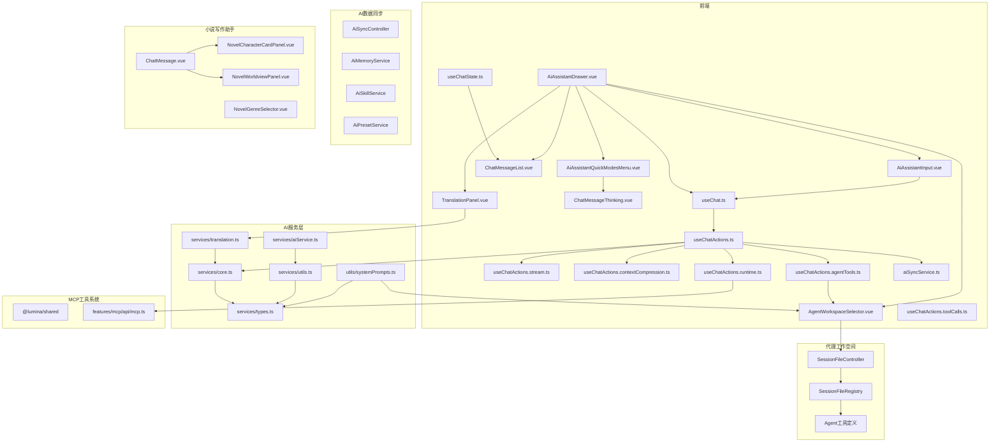

**图表来源**

- [apps/frontend/src/features/ai/components/AiAssistantDrawer.vue:1-475](file://apps/frontend/src/features/ai/components/AiAssistantDrawer.vue#L1-L475)
- [apps/frontend/src/features/ai/components/AiAssistantInput.vue:1-345](file://apps/frontend/src/features/ai/components/AiAssistantInput.vue#L1-L345)
- [apps/frontend/src/features/ai/components/ChatMessageList.vue:1-492](file://apps/frontend/src/features/ai/components/ChatMessageList.vue#L1-L492)
- [apps/frontend/src/features/ai/components/TranslationPanel.vue:1-278](file://apps/frontend/src/features/ai/components/TranslationPanel.vue#L1-L278)
- [apps/frontend/src/features/ai/components/AiAssistantQuickModesMenu.vue:1-158](file://apps/frontend/src/features/ai/components/AiAssistantQuickModesMenu.vue#L1-L158)
- [apps/frontend/src/features/ai/components/ChatMessageThinking.vue:1-303](file://apps/frontend/src/features/ai/components/ChatMessageThinking.vue#L1-L303)
- [apps/frontend/src/features/ai/components/AgentWorkspaceSelector.vue:1-405](file://apps/frontend/src/features/ai/components/AgentWorkspaceSelector.vue#L1-L405)
- [apps/frontend/src/features/ai/composables/useChatState.ts:1-149](file://apps/frontend/src/features/ai/composables/useChatState.ts#L1-L149)
- [apps/frontend/src/features/ai/composables/useChat.ts:1-136](file://apps/frontend/src/features/ai/composables/useChat.ts#L1-L136)
- [apps/frontend/src/features/ai/composables/useChatActions.ts:1-544](file://apps/frontend/src/features/ai/composables/useChatActions.ts#L1-L544)
- [apps/frontend/src/features/ai/composables/useChatActions.stream.ts:1-411](file://apps/frontend/src/features/ai/composables/useChatActions.stream.ts#L1-L411)
- [apps/frontend/src/features/ai/composables/useChatActions.contextCompression.ts:1-263](file://apps/frontend/src/features/ai/composables/useChatActions.contextCompression.ts#L1-L263)
- [apps/frontend/src/features/ai/composables/useChatActions.toolCalls.ts:1-172](file://apps/frontend/src/features/ai/composables/useChatActions.toolCalls.ts#L1-L172)
- [apps/frontend/src/features/ai/composables/useChatActions.runtime.ts:1-100](file://apps/frontend/src/features/ai/composables/useChatActions.runtime.ts#L1-L100)
- [apps/frontend/src/features/ai/composables/useChatActions.agentTools.ts:1-403](file://apps/frontend/src/features/ai/composables/useChatActions.agentTools.ts#L1-L403)
- [apps/frontend/src/features/mcp/api/mcp.ts:1-108](file://apps/frontend/src/features/mcp/api/mcp.ts#L1-L108)
- [apps/frontend/src/features/ai/services/aiSyncService.ts:1-41](file://apps/frontend/src/features/ai/services/aiSyncService.ts#L1-L41)
- [apps/frontend/src/features/ai/services/utils/systemPrompts.ts:459-483](file://apps/frontend/src/features/ai/services/utils/systemPrompts.ts#L459-L483)
- [apps/backend/src/ai-sync/ai-sync.controller.ts:1-84](file://apps/backend/src/ai-sync/ai-sync.controller.ts#L1-L84)
- [apps/backend/src/agent/session-file/session-file.controller.ts:1-125](file://apps/backend/src/agent/session-file/session-file.controller.ts#L1-L125)
- [apps/backend/src/agent/session-file/session-file.registry.ts:55-166](file://apps/backend/src/agent/session-file/session-file.registry.ts#L55-L166)
- [apps/frontend/src/features/ai/components/NovelCharacterCardPanel.vue:1-130](file://apps/frontend/src/features/ai/components/NovelCharacterCardPanel.vue#L1-L130)
- [apps/frontend/src/features/ai/components/NovelGenreSelector.vue:1-56](file://apps/frontend/src/features/ai/components/NovelGenreSelector.vue#L1-L56)
- [apps/frontend/src/features/ai/components/NovelWorldviewPanel.vue:1-78](file://apps/frontend/src/features/ai/components/NovelWorldviewPanel.vue#L1-L78)
- [apps/frontend/src/features/ai/components/ChatMessage.vue:390-449](file://apps/frontend/src/features/ai/components/ChatMessage.vue#L390-L449)

**章节来源**

- [apps/frontend/src/features/ai/services/aiService.ts:1-6](file://apps/frontend/src/features/ai/services/aiService.ts#L1-L6)
- [apps/frontend/src/features/ai/services/core.ts:1-445](file://apps/frontend/src/features/ai/services/core.ts#L1-L445)
- [apps/frontend/src/features/ai/services/types.ts:1-292](file://apps/frontend/src/features/ai/services/types.ts#L1-L292)
- [apps/frontend/src/features/ai/services/utils.ts:1-10](file://apps/frontend/src/features/ai/services/utils.ts#L1-L10)
- [apps/frontend/src/features/ai/composables/useAIConfig.ts:1-800](file://apps/frontend/src/features/ai/composables/useAIConfig.ts#L1-L800)
- [apps/frontend/src/features/ai/composables/useChat.ts:1-136](file://apps/frontend/src/features/ai/composables/useChat.ts#L1-L136)
- [apps/frontend/src/features/ai/composables/useChatActions.ts:1-544](file://apps/frontend/src/features/ai/composables/useChatActions.ts#L1-L544)
- [apps/frontend/src/features/ai/composables/useChatActions.stream.ts:1-411](file://apps/frontend/src/features/ai/composables/useChatActions.stream.ts#L1-L411)
- [apps/frontend/src/features/ai/composables/useChatActions.contextCompression.ts:1-263](file://apps/frontend/src/features/ai/composables/useChatActions.contextCompression.ts#L1-L263)
- [apps/frontend/src/features/ai/composables/useChatActions.toolCalls.ts:1-172](file://apps/frontend/src/features/ai/composables/useChatActions.toolCalls.ts#L1-L172)
- [apps/frontend/src/features/ai/composables/useChatActions.runtime.ts:1-100](file://apps/frontend/src/features/ai/composables/useChatActions.runtime.ts#L1-L100)
- [apps/frontend/src/features/mcp/api/mcp.ts:1-108](file://apps/frontend/src/features/mcp/api/mcp.ts#L1-L108)
- [apps/frontend/src/features/ai/components/AiAssistantDrawer.vue:1-475](file://apps/frontend/src/features/ai/components/AiAssistantDrawer.vue#L1-L475)
- [apps/frontend/src/features/ai/components/AiAssistantInput.vue:1-345](file://apps/frontend/src/features/ai/components/AiAssistantInput.vue#L1-L345)
- [apps/frontend/src/features/ai/components/ChatMessageList.vue:1-492](file://apps/frontend/src/features/ai/components/ChatMessageList.vue#L1-L492)
- [apps/frontend/src/features/ai/composables/useChatState.ts:1-149](file://apps/frontend/src/features/ai/composables/useChatState.ts#L1-L149)
- [apps/frontend/src/features/ai/services/aiSyncService.ts:1-41](file://apps/frontend/src/features/ai/services/aiSyncService.ts#L1-L41)
- [apps/frontend/src/features/ai/services/translation.ts:1-54](file://apps/frontend/src/features/ai/services/translation.ts#L1-L54)
- [apps/frontend/src/features/ai/composables/useAiModeItems.ts:1-63](file://apps/frontend/src/features/ai/composables/useAiModeItems.ts#L1-L63)
- [apps/frontend/src/features/ai/composables/useAiAssistantModes.ts:1-145](file://apps/frontend/src/features/ai/composables/useAiAssistantModes.ts#L1-L145)
- [apps/frontend/src/features/ai/components/TranslationPanel.vue:1-278](file://apps/frontend/src/features/ai/components/TranslationPanel.vue#L1-L278)
- [apps/frontend/src/features/ai/components/AiAssistantQuickModesMenu.vue:1-158](file://apps/frontend/src/features/ai/components/AiAssistantQuickModesMenu.vue#L1-L158)
- [apps/frontend/src/features/ai/components/ChatMessageThinking.vue:1-303](file://apps/frontend/src/features/ai/components/ChatMessageThinking.vue#L1-L303)
- [apps/frontend/src/features/ai/services/utils/systemPrompts.ts:459-483](file://apps/frontend/src/features/ai/services/utils/systemPrompts.ts#L459-L483)
- [apps/backend/src/ai-sync/ai-sync.controller.ts:1-84](file://apps/backend/src/ai-sync/ai-sync.controller.ts#L1-L84)
- [apps/backend/src/agent/session-file/session-file.controller.ts:1-125](file://apps/backend/src/agent/session-file/session-file.controller.ts#L1-L125)
- [apps/backend/src/agent/session-file/session-file.registry.ts:55-166](file://apps/backend/src/agent/session-file/session-file.registry.ts#L55-L166)
- [apps/frontend/src/features/ai/components/NovelCharacterCardPanel.vue:1-130](file://apps/frontend/src/features/ai/components/NovelCharacterCardPanel.vue#L1-L130)
- [apps/frontend/src/features/ai/components/NovelGenreSelector.vue:1-56](file://apps/frontend/src/features/ai/components/NovelGenreSelector.vue#L1-L56)
- [apps/frontend/src/features/ai/components/NovelWorldviewPanel.vue:1-78](file://apps/frontend/src/features/ai/components/NovelWorldviewPanel.vue#L1-L78)
- [apps/frontend/src/features/ai/components/ChatMessage.vue:390-449](file://apps/frontend/src/features/ai/components/ChatMessage.vue#L390-L449)

## 核心组件

- AI服务核心（core.ts）
  - 实现流式与非流式请求、SSE解析、工具调用聚合、推理内容抽取、请求中断与信号管理。
- 类型系统（types.ts）
  - 定义消息、工具、推理细节、技能、结构化块等核心类型，支撑前后端一致的数据契约。
- **新增** 多级思维模式配置
  - ThinkingMode和ReasoningEffort类型升级为'off' | 'auto' | 'high' | 'xhigh'
  - 支持精细化的推理控制和思维深度调节
  - AISettingsParameterSection和AiAssistantThinkingMenu提供可视化配置界面
- **新增** 代理工作空间系统
  - AgentWorkspaceSelector组件提供工作区选择和权限管理模式
  - 支持自动、询问、只读三种权限模式
  - 与后端SessionFileController配合实现文件管理
- **新增** 会话文件管理
  - SessionFileController提供文件注册、查询、删除API
  - SessionFileRegistry实现文件索引和持久化存储
  - 支持按会话ID管理文件关联关系
- **新增** Agent工具系统
  - 完整的本地文件操作工具链：READ_FILE、WRITE_FILE、EDIT_FILE、LS、GREP、FIND、MKDIR、BASH、STAGE_FILES
  - 支持文件读取、写入、编辑、目录操作、搜索、创建目录、命令执行、文件交付
  - 与AgentWorkspaceSelector集成，限定操作范围在指定工作区内
- **新增** 增强的推理内容显示
  - ChatMessageThinking组件支持reasoning_details优先显示策略
  - thinkingContent作为备选显示方案
  - 智能折叠和展开逻辑，优化用户体验
- **新增** 系统提示注入增强
  - buildAgentSystemPrompt函数生成Agent工具使用规范
  - 支持工作区路径提示、工具纪律、文件交付、失败处理、操作安全等指导原则
  - 与injectSystemPrompts集成，实现完整的Agent能力注入
- **新增** 翻译模式支持
  - 新增translation模式类型和相关配置
  - TranslationPanel提供独立的翻译界面
  - 支持智能语言检测和实时翻译功能
- **新增** 小说写作助手增强
  - NovelCharacterCardPanel、NovelWorldviewPanel、NovelGenreSelector组件
  - 支持角色管理、世界观构建、类型选择等创作功能

**章节来源**

- [apps/frontend/src/features/ai/services/core.ts:1-445](file://apps/frontend/src/features/ai/services/core.ts#L1-L445)
- [apps/frontend/src/features/ai/services/types.ts:276-292](file://apps/frontend/src/features/ai/services/types.ts#L276-L292)
- [apps/frontend/src/features/ai/composables/useAIConfig/types.ts:1-95](file://apps/frontend/src/features/ai/composables/useAIConfig/types.ts#L1-L95)
- [apps/frontend/src/features/ai/components/AISettingsParameterSection.vue:118-154](file://apps/frontend/src/features/ai/components/AISettingsParameterSection.vue#L118-L154)
- [apps/frontend/src/features/ai/components/AiAssistantThinkingMenu.vue:28-51](file://apps/frontend/src/features/ai/components/AiAssistantThinkingMenu.vue#L28-L51)
- [apps/frontend/src/features/ai/components/AgentWorkspaceSelector.vue:1-405](file://apps/frontend/src/features/ai/components/AgentWorkspaceSelector.vue#L1-L405)
- [apps/backend/src/agent/session-file/session-file.controller.ts:1-125](file://apps/backend/src/agent/session-file/session-file.controller.ts#L1-L125)
- [apps/backend/src/agent/session-file/session-file.registry.ts:55-166](file://apps/backend/src/agent/session-file/session-file.registry.ts#L55-L166)
- [apps/frontend/src/features/ai/composables/useChatActions.agentTools.ts:9-166](file://apps/frontend/src/features/ai/composables/useChatActions.agentTools.ts#L9-L166)
- [apps/frontend/src/features/ai/components/ChatMessageThinking.vue:56-63](file://apps/frontend/src/features/ai/components/ChatMessageThinking.vue#L56-L63)
- [apps/frontend/src/features/ai/services/utils/systemPrompts.ts:485-553](file://apps/frontend/src/features/ai/services/utils/systemPrompts.ts#L485-L553)
- [apps/frontend/src/features/ai/components/TranslationPanel.vue:1-278](file://apps/frontend/src/features/ai/components/TranslationPanel.vue#L1-L278)
- [apps/frontend/src/features/ai/components/NovelCharacterCardPanel.vue:1-130](file://apps/frontend/src/features/ai/components/NovelCharacterCardPanel.vue#L1-L130)
- [apps/frontend/src/features/ai/components/NovelWorldviewPanel.vue:1-78](file://apps/frontend/src/features/ai/components/NovelWorldviewPanel.vue#L1-L78)
- [apps/frontend/src/features/ai/components/NovelGenreSelector.vue:1-56](file://apps/frontend/src/features/ai/components/NovelGenreSelector.vue#L1-L56)

## 架构总览

AI助手系统采用"前端组合式函数 + AI服务层 + MCP工具系统 + AI数据同步 + 代理工作空间系统 + AI翻译服务"的分层架构。前端负责交互与状态，AI服务层负责与大模型通信与工具编排，MCP提供外部工具能力，**AI数据同步模块提供服务器端持久化**，**代理工作空间系统提供本地文件操作能力**，**AI翻译服务提供独立的语言处理能力**。**新增的多级思维模式**通过ThinkingMode和ReasoningEffort配置实现精细化控制，**增强的推理内容显示**通过reasoning_details优先策略优化用户体验。

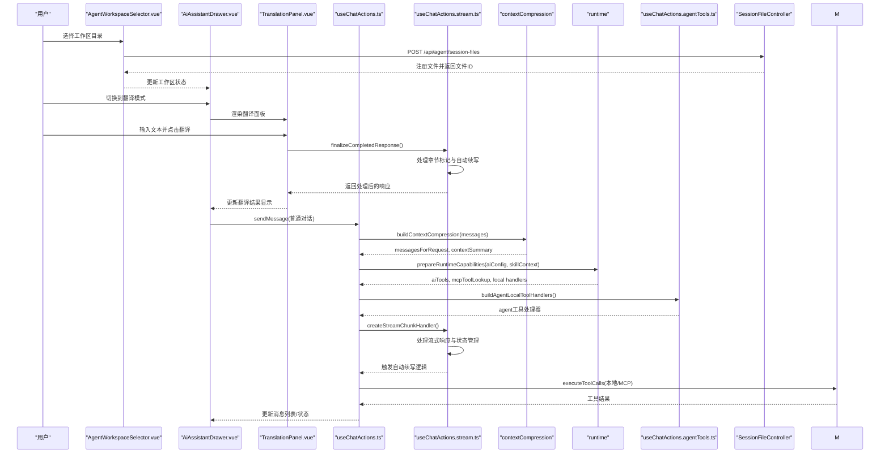

**图表来源**

- [apps/frontend/src/features/ai/components/AgentWorkspaceSelector.vue:69-156](file://apps/frontend/src/features/ai/components/AgentWorkspaceSelector.vue#L69-L156)
- [apps/backend/src/agent/session-file/session-file.controller.ts:22-80](file://apps/backend/src/agent/session-file/session-file.controller.ts#L22-L80)
- [apps/frontend/src/features/ai/components/AiAssistantQuickModesMenu.vue:79-87](file://apps/frontend/src/features/ai/components/AiAssistantQuickModesMenu.vue#L79-L87)
- [apps/frontend/src/features/ai/components/TranslationPanel.vue:69-85](file://apps/frontend/src/features/ai/components/TranslationPanel.vue#L69-L85)
- [apps/frontend/src/features/ai/composables/useChatActions.stream.ts:128-312](file://apps/frontend/src/features/ai/composables/useChatActions.stream.ts#L128-L312)
- [apps/frontend/src/features/ai/composables/useChatActions.ts:333-408](file://apps/frontend/src/features/ai/composables/useChatActions.ts#L333-L408)
- [apps/frontend/src/features/ai/composables/useChatActions.contextCompression.ts:1-263](file://apps/frontend/src/features/ai/composables/useChatActions.contextCompression.ts#L1-L263)
- [apps/frontend/src/features/ai/composables/useChatActions.runtime.ts:1-100](file://apps/frontend/src/features/ai/composables/useChatActions.runtime.ts#L1-L100)
- [apps/frontend/src/features/ai/composables/useChatActions.agentTools.ts:197-200](file://apps/frontend/src/features/ai/composables/useChatActions.agentTools.ts#L197-L200)
- [apps/frontend/src/features/mcp/api/mcp.ts:1-108](file://apps/frontend/src/features/mcp/api/mcp.ts#L1-L108)

## 详细组件分析

### 多级思维模式系统

#### 思维模式配置升级

**新增** 多级思维模式系统，从简单的二元开关升级为off/auto/high/xhigh四个级别，提供更精细的推理控制。

- **类型定义增强**
  - ThinkingMode: 'off' | 'auto' | 'high' | 'xhigh'
  - ReasoningEffort: 'off' | 'auto' | 'high' | 'xhigh'
  - 支持四种不同的推理强度级别
  - off: 关闭推理输出
  - auto: 自动推理，根据内容复杂度决定
  - high: 高强度推理，适用于复杂问题
  - xhigh: 超高强度推理，适用于深度分析

- **配置界面**
  - AISettingsParameterSection提供四个级别的可视化选择
  - AiAssistantThinkingMenu提供下拉菜单形式的思维模式切换
  - 每个级别都有对应的标签和描述信息

- **行为差异**
  - off: 不产生推理内容，专注于直接回答
  - auto: 根据问题复杂度自动决定是否产生推理
  - high: 产生详细的推理过程，适合需要解释的场景
  - xhigh: 产生最详细的推理过程，适合深度分析和学习

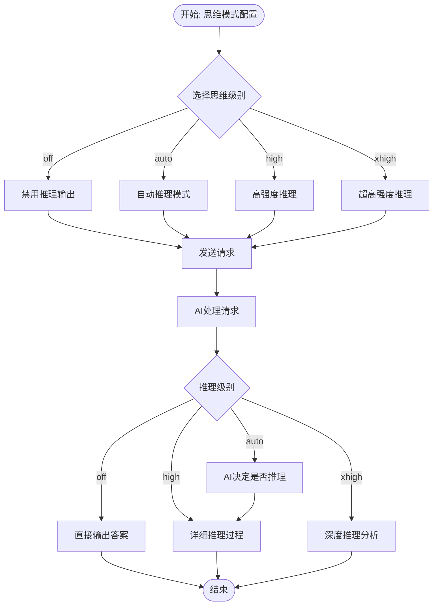

**图表来源**

- [apps/frontend/src/features/ai/composables/useAIConfig/types.ts:1-4](file://apps/frontend/src/features/ai/composables/useAIConfig/types.ts#L1-L4)
- [apps/frontend/src/features/ai/components/AISettingsParameterSection.vue:124-153](file://apps/frontend/src/features/ai/components/AISettingsParameterSection.vue#L124-L153)
- [apps/frontend/src/features/ai/components/AiAssistantThinkingMenu.vue:28-48](file://apps/frontend/src/features/ai/components/AiAssistantThinkingMenu.vue#L28-L48)

#### 思维模式配置管理

**新增** useAIConfig模块对多级思维模式的支持，包括配置加载、验证和持久化。

- **配置验证**
  - normalizeThinkingLevel函数确保思维级别在有效范围内
  - 支持大小写不敏感的输入
  - 默认值为'auto'

- **预设支持**
  - AIPreset接口支持thinkingEffort字段
  - 支持在预设中保存特定的思维模式配置
  - 预设应用时自动验证思维级别

- **持久化机制**
  - 使用localStorage存储思维模式配置
  - 支持配置的导入导出功能
  - 配置迁移时自动处理级别转换

**章节来源**

- [apps/frontend/src/features/ai/composables/useAIConfig/types.ts:1-4](file://apps/frontend/src/features/ai/composables/useAIConfig/types.ts#L1-L4)
- [apps/frontend/src/features/ai/composables/useAIConfig/index.ts:90-101](file://apps/frontend/src/features/ai/composables/useAIConfig/index.ts#L90-L101)
- [apps/frontend/src/features/ai/components/AISettingsParameterSection.vue:118-154](file://apps/frontend/src/features/ai/components/AISettingsParameterSection.vue#L118-L154)
- [apps/frontend/src/features/ai/components/AiAssistantThinkingMenu.vue:14-51](file://apps/frontend/src/features/ai/components/AiAssistantThinkingMenu.vue#L14-L51)

### 代理工作空间系统

#### 工作区选择器组件

**新增** AgentWorkspaceSelector组件，提供完整的代理工作区管理功能。

- **工作区管理**
  - 支持添加、删除、选择工作区
  - 通过HTTP API与后端交互
  - 支持本地目录选择和远程工作区管理

- **权限模式**
  - 自动模式：自动执行操作，无需用户确认
  - 询问模式：关键操作前询问用户确认
  - 只读模式：仅允许文件读取，禁止修改操作

- **状态管理**
  - 支持工作区加载状态显示
  - 自动检测Sidecar服务可用性
  - 工作区选择状态的持久化

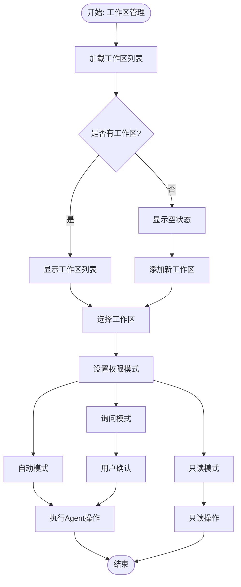

**图表来源**

- [apps/frontend/src/features/ai/components/AgentWorkspaceSelector.vue:69-156](file://apps/frontend/src/features/ai/components/AgentWorkspaceSelector.vue#L69-L156)
- [apps/frontend/src/features/ai/components/AgentWorkspaceSelector.vue:242-254](file://apps/frontend/src/features/ai/components/AgentWorkspaceSelector.vue#L242-L254)

#### 会话文件管理

**新增** 后端SessionFileController和SessionFileRegistry，提供会话级别的文件管理能力。

- **文件注册**
  - 支持批量文件注册到指定会话
  - 自动生成文件ID和元数据
  - 支持文件标签和描述

- **会话关联**
  - 按会话ID组织文件关联关系
  - 支持文件查询和删除
  - 维护文件创建时间和排序

- **持久化存储**
  - 使用JSON文件存储文件索引
  - 支持数据恢复和迁移
  - 提供统计信息和健康检查

- **API接口**
  - POST /api/agent/session-files：注册文件
  - GET /api/agent/session-files：查询会话文件
  - DELETE /api/agent/session-files/:id：删除文件

**章节来源**

- [apps/frontend/src/features/ai/components/AgentWorkspaceSelector.vue:1-405](file://apps/frontend/src/features/ai/components/AgentWorkspaceSelector.vue#L1-L405)
- [apps/backend/src/agent/session-file/session-file.controller.ts:1-125](file://apps/backend/src/agent/session-file/session-file.controller.ts#L1-L125)
- [apps/backend/src/agent/session-file/session-file.registry.ts:55-166](file://apps/backend/src/agent/session-file/session-file.registry.ts#L55-L166)

### Agent工具系统

#### 工具定义与实现

**新增** 完整的Agent工具系统，提供本地文件操作能力。

- **工具类型**
  - 文件读取：READ_FILE（支持行范围选择）
  - 文件写入：WRITE_FILE（创建或覆盖文件）
  - 文件编辑：EDIT_FILE（精确字符串替换）
  - 目录操作：LS、MKDIR
  - 文件搜索：FIND、GREP
  - 命令执行：BASH（带超时控制）
  - 文件交付：STAGE_FILES（注册到会话）

- **参数验证**
  - 每个工具都有严格的参数验证
  - 必需参数强制检查
  - 类型和格式验证

- **本地处理器**
  - buildAgentLocalToolHandlers函数构建本地工具处理器
  - 支持文件系统操作和命令执行
  - 错误处理和结果格式化

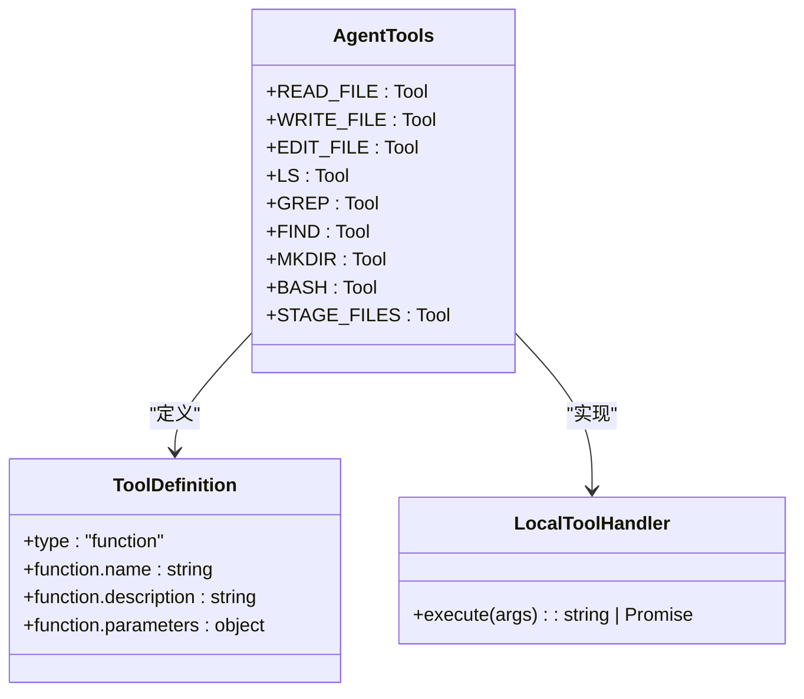

**图表来源**

- [apps/frontend/src/features/ai/composables/useChatActions.agentTools.ts:9-166](file://apps/frontend/src/features/ai/composables/useChatActions.agentTools.ts#L9-L166)
- [apps/frontend/src/features/ai/composables/useChatActions.agentTools.ts:197-200](file://apps/frontend/src/features/ai/composables/useChatActions.agentTools.ts#L197-L200)
- [packages/shared/src/agent/agent-tool.schema.ts:82-95](file://packages/shared/src/agent/agent-tool.schema.ts#L82-L95)
- [packages/shared/src/agent/agent-tool.types.ts:26-39](file://packages/shared/src/agent/agent-tool.types.ts#L26-L39)

#### 工具使用纪律

**新增** Agent工具使用纪律和安全指导原则。

- **工具使用纪律**
  - 优先使用成本最低、干扰最小的工具
  - 避免在简单场景下使用重型工具
  - 优先使用agent\_系列工具进行本地文件操作

- **文件交付规范**
  - 创建或找到文件时使用agent_stage_files注册
  - 仅传递真实存在的本机绝对路径
  - 不要在文本中仅写文件路径

- **失败处理策略**
  - 方案失败时先诊断原因再换方向
  - 读取错误信息、检查假设、尝试针对性修复
  - 不要盲目重复相同动作

- **操作安全原则**
  - 执行前考虑可逆性和影响范围
  - 本地可撤销操作可直接执行
  - 对难以撤销或影响外部系统操作需用户确认

**章节来源**

- [apps/frontend/src/features/ai/services/utils/systemPrompts.ts:500-553](file://apps/frontend/src/features/ai/services/utils/systemPrompts.ts#L500-L553)
- [apps/frontend/src/features/ai/composables/useChatActions.agentTools.ts:176-185](file://apps/frontend/src/features/ai/composables/useChatActions.agentTools.ts#L176-L185)

### 增强的推理内容显示系统

#### 推理内容优先级处理

**新增** ChatMessageThinking组件的推理内容智能优先级处理，优化用户体验。

- **优先级策略**
  - reasoning_details > thinkingContent > reasoning_content
  - reasoning_details：结构化的推理内容，优先显示
  - thinkingContent：传统的思考过程内容，作为备选
  - reasoning_content：内部传输用，不直接显示给用户

- **智能折叠逻辑**
  - AI开始输出正文内容：立即折叠思考区域
  - 只有思考内容且流式结束：3秒延迟后自动折叠
  - 思考内容稳定（非流式状态）：保持展开状态
  - 用户交互：点击标题或按钮手动切换展开/折叠

- **动画效果**
  - 流式状态：闪烁效果提示思考进行中
  - 展开/折叠：平滑的过渡动画
  - 移动端适配：简化动画效果，提升性能

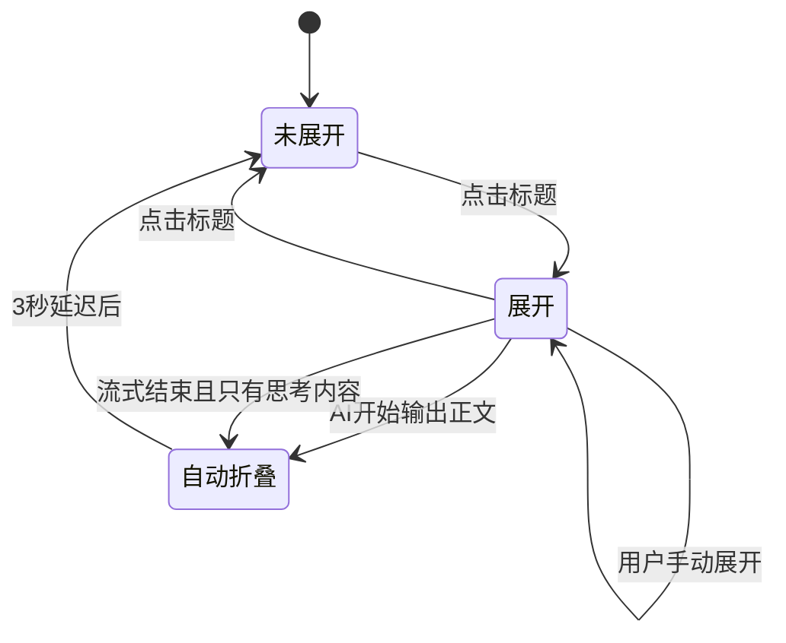

**图表来源**

- [apps/frontend/src/features/ai/components/ChatMessageThinking.vue:65-100](file://apps/frontend/src/features/ai/components/ChatMessageThinking.vue#L65-L100)
- [apps/frontend/src/features/ai/components/ChatMessageThinking.vue:114-197](file://apps/frontend/src/features/ai/components/ChatMessageThinking.vue#L114-L197)

#### 系统提示注入增强

**新增** buildAgentSystemPrompt函数，为Agent工具系统提供完整的使用指导。

- **工作区路径提示**
  - 明确指定工作目录和绝对路径要求
  - 限制文件操作范围在指定工作区内

- **工具使用纪律**
  - 详细的工具选择和使用原则
  - 成本效益和干扰最小化原则
  - 本地文件操作优先策略

- **文件交付规范**
  - 文件注册和交付流程
  - 绝对路径和文件路径的区别
  - 平台无关的展示处理

- **失败处理和操作安全**
  - 失败时的诊断和修复策略
  - 可逆性和影响范围的考虑
  - 用户确认机制的重要性

**章节来源**

- [apps/frontend/src/features/ai/components/ChatMessageThinking.vue:56-63](file://apps/frontend/src/features/ai/components/ChatMessageThinking.vue#L56-L63)
- [apps/frontend/src/features/ai/components/ChatMessageThinking.vue:65-100](file://apps/frontend/src/features/ai/components/ChatMessageThinking.vue#L65-L100)
- [apps/frontend/src/features/ai/components/ChatMessageThinking.vue:114-197](file://apps/frontend/src/features/ai/components/ChatMessageThinking.vue#L114-L197)
- [apps/frontend/src/features/ai/services/utils/systemPrompts.ts:485-553](file://apps/frontend/src/features/ai/services/utils/systemPrompts.ts#L485-L553)

### AI翻译系统

#### 翻译面板组件（TranslationPanel.vue）

- **智能语言检测**
  - 使用正则表达式检测中文字符，自动判断目标语言（中文↔英文）
  - 支持Unicode范围[\u4e00-\u9fff]的中文字符识别
- **实时翻译功能**
  - 支持双栏布局，左侧输入区，右侧输出区
  - 拖拽调整面板宽度，移动端自适应布局
  - 实时状态反馈，包括加载状态、错误状态和空状态
- **历史持久化**
  - 使用localStorage存储翻译历史，防抖保存（500ms）
  - 支持输入文本和翻译结果的双向持久化
- **交互功能**
  - 支持键盘快捷键（Cmd/Ctrl+Enter触发翻译）
  - 剪贴板复制功能，带成功状态反馈
  - 响应式设计，支持桌面端和移动端

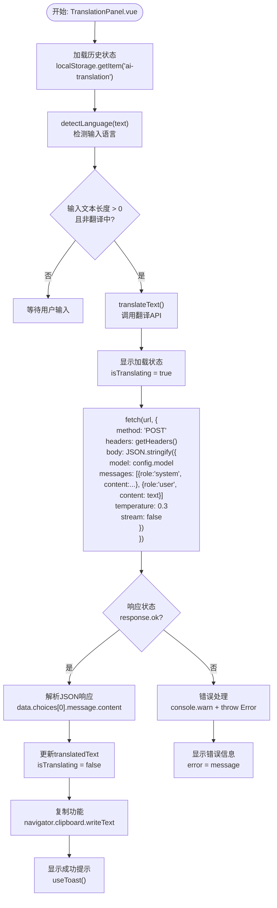

**图表来源**

- [apps/frontend/src/features/ai/components/TranslationPanel.vue:69-102](file://apps/frontend/src/features/ai/components/TranslationPanel.vue#L69-L102)
- [apps/frontend/src/features/ai/services/translation.ts:8-53](file://apps/frontend/src/features/ai/services/translation.ts#L8-L53)

#### 翻译服务（translation.ts）

- **语言检测函数**
  - `detectLanguage(text: string): 'zh' | 'non-zh'`
  - 使用正则表达式判断文本是否包含中文字符
- **翻译API调用**
  - `translateText(text: string, targetLang: 'zh' | 'en', config: AIConfig, signal?: AbortSignal): Promise<string>`
  - 构建OpenAI兼容的API请求
  - 设置系统提示词："你是一个专业的翻译员，将以下文本翻译为目标语言，保持原文格式、语调和风格，只输出翻译结果，不要解释"
  - 使用温度0.3确保翻译的稳定性和一致性
  - 支持AbortSignal用于请求取消
- **错误处理**
  - 检查响应状态码，非OK状态抛出错误
  - 从OpenAI兼容格式中提取错误信息，避免泄露原始响应体
  - 记录详细的错误日志，包括状态码和响应体

**章节来源**

- [apps/frontend/src/features/ai/components/TranslationPanel.vue:1-278](file://apps/frontend/src/features/ai/components/TranslationPanel.vue#L1-L278)
- [apps/frontend/src/features/ai/services/translation.ts:1-54](file://apps/frontend/src/features/ai/services/translation.ts#L1-L54)

### 统一模式管理API

#### 模式管理组合式API（useAiModeItems.ts）

- **模式ID定义**
  - `AiModeId = 'todo' | 'teaching' | 'draw' | 'discuss' | 'novel' | 'translation'`
  - 定义所有支持的AI模式类型，包括新增的翻译模式
- **统一排序规则**
  - `AI_MODE_ORDER: readonly AiModeId[] = ['todo', 'teaching', 'draw', 'discuss', 'novel', 'translation']`
  - 确保所有模式菜单入口的渲染顺序一致
  - 主线模式优先（待办助手），垂直模式置底（小说模式）
- **模式描述符**
  - `AiModeDescriptor`接口：包含id、title、active状态和toggle函数
  - 支持响应式追踪和动态状态管理
- **输入映射**
  - `AiModeInputs`：以getter形式传入，保证响应式追踪
  - 自动过滤未提供的模式ID，便于不同入口按需裁剪

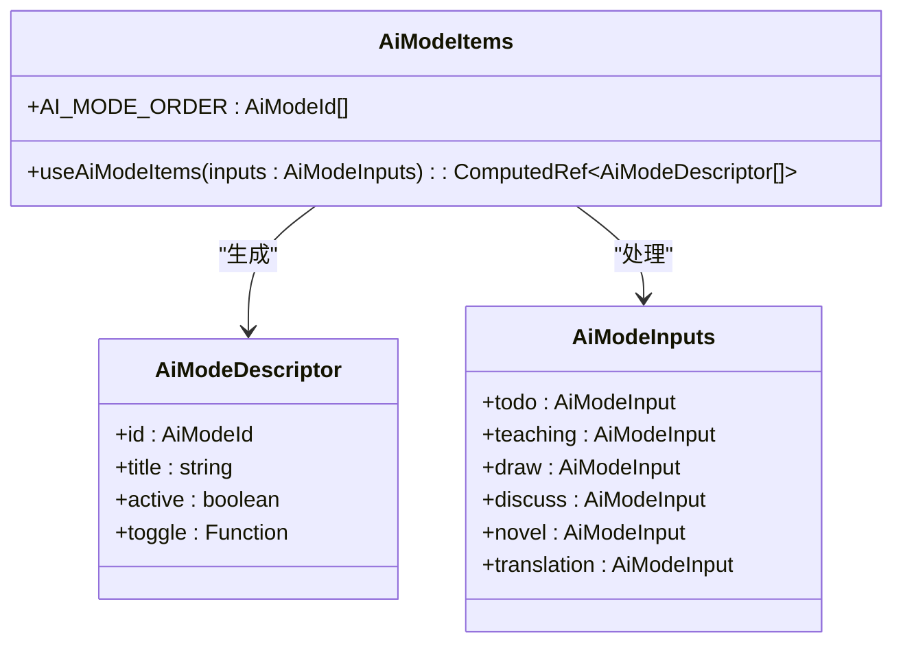

**图表来源**

- [apps/frontend/src/features/ai/composables/useAiModeItems.ts:11-62](file://apps/frontend/src/features/ai/composables/useAiModeItems.ts#L11-L62)

**章节来源**

- [apps/frontend/src/features/ai/composables/useAiModeItems.ts:1-63](file://apps/frontend/src/features/ai/composables/useAiModeItems.ts#L1-L63)

### AI助手模式管理增强

#### 模式切换增强（useAiAssistantModes.ts）

- **翻译模式集成**
  - 新增`isTranslationEnabled`计算属性，基于`assistantMode === 'translation'`
  - `toggleTranslationMode()`实现翻译模式的切换逻辑
  - 切换时自动禁用其他模式（待办助手、讨论模式、图像生成）
- **模式互斥机制**
  - 翻译模式与其他模式互斥，确保同一时间只能激活一个模式
  - 切换到翻译模式时清除其他模式配置
  - 退出翻译模式时恢复之前的配置状态
- **代理模式支持**
  - 新增agentMode配置项，支持代理工作空间模式
  - 集成工作区选择和权限管理模式

**章节来源**

- [apps/frontend/src/features/ai/composables/useAiAssistantModes.ts:44-54](file://apps/frontend/src/features/ai/composables/useAiAssistantModes.ts#L44-L54)
- [apps/frontend/src/features/ai/composables/useAiAssistantModes.ts:123-143](file://apps/frontend/src/features/ai/composables/useAiAssistantModes.ts#L123-L143)

### AI服务核心（流式与非流式）

- 流式请求
  - 构建请求体（模型、温度、top_p、工具、推理参数），通过fetch建立SSE连接，按行解析data行，累计工具调用，分别触发内容、思考、推理回调。
  - 支持AbortSignal中断，异常处理与[DONE]收尾。
- 非流式请求
  - 构建非流式请求体，解析choices[0].message中的content与reasoning_details，返回文本与推理摘要。
- 工具调用聚合
  - 在流式过程中累积tool_calls，最终一次性触发工具回调，便于后续执行。

```mermaid
flowchart TD
Start(["开始: getAIStreamResponse"]) --> Build["构建请求体<br/>注入系统提示/技能/上下文"]
Build --> Fetch["发起SSE请求"]
Fetch --> Read["读取响应流"]
Read --> Parse{"解析行数据"}
Parse --> |JSON块| Delta["提取 choices.delta<br/>content/thinking/reasoning/tool_calls"]
Delta --> Callbacks["触发回调:<br/>内容/思考/推理/工具调用"]
Parse --> |[DONE]| Done["触发[DONE]并补发未完成工具调用"]
Parse --> |空行/无效| Skip["跳过"]
Callbacks --> Read
Done --> End(["结束"])
Skip --> Read
```

**图表来源**

- [apps/frontend/src/features/ai/services/core.ts:115-340](file://apps/frontend/src/features/ai/services/core.ts#L115-L340)

**章节来源**

- [apps/frontend/src/features/ai/services/core.ts:115-340](file://apps/frontend/src/features/ai/services/core.ts#L115-L340)

### 配置与预设系统

- AIConfig
  - 包含基础参数（baseUrl、apiKey、model、temperature）、系统提示、思维模式与努力等级、讨论模式、图像生动生成功能开关、MCP开关、上下文压缩开关与阈值、技能ID集合等。
- **扩展** 小说创作配置
  - 新增novelGenre、novelTone、novelProtagonistHint等小说创作相关参数。
- **扩展** 翻译模式配置
  - 新增assistantMode支持'translation'类型
  - 翻译模式与其他模式互斥，确保单一模式激活
- **扩展** 代理模式配置
  - 新增agentMode、agentWorkspaceId、agentWorkspacePath等代理工作空间相关参数
  - 支持代理工具的启用和工作区管理
- 预设（AIPreset）
  - 保存常用配置快照，支持与当前配置比对与自动匹配。
- 存储与同步
  - 使用localStorage持久化；思维模式双向绑定；默认配置与归一化逻辑保证一致性。

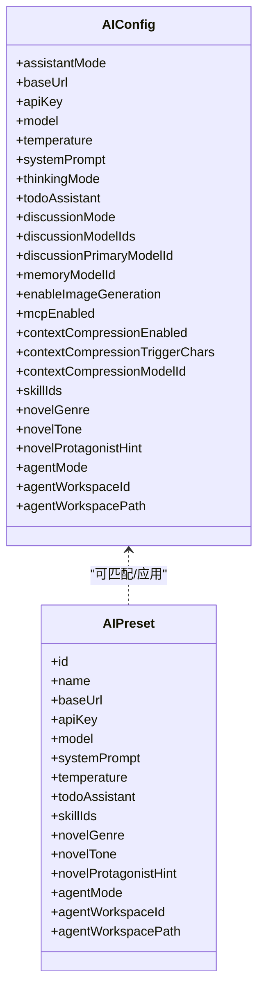

**图表来源**

- [apps/frontend/src/features/ai/composables/useAIConfig.ts:18-51](file://apps/frontend/src/features/ai/composables/useAIConfig.ts#L18-L51)
- [apps/frontend/src/features/ai/composables/useAIConfig/types.ts:15-41](file://apps/frontend/src/features/ai/composables/useAIConfig/types.ts#L15-L41)

**章节来源**

- [apps/frontend/src/features/ai/composables/useAIConfig.ts:601-800](file://apps/frontend/src/features/ai/composables/useAIConfig.ts#L601-L800)
- [apps/frontend/src/features/ai/composables/useAIConfig/types.ts:1-95](file://apps/frontend/src/features/ai/composables/useAIConfig/types.ts#L1-L95)

### 对话管理与状态

- useChatState
  - 维护当前会话消息、流式响应内容、思考与推理详情、讨论步骤、待办建议、生成状态、错误与重试次数，并提供重置与清理方法。
  - **新增** 小说相关状态管理，包括novelBatchRemaining全局状态。
  - **新增** 代理工作区状态管理，跟踪工作区选择和权限模式。
- useChat
  - 计算实时消息视图，合并流式响应与结构化块（教学/待办/小说/翻译），避免流式结束瞬间的重复消息。
- useChatActions
  - 发送消息、生成图片、停止生成、清理历史、重试机制、上下文压缩、工具调用执行、MCP集成与本地工具处理。
  - **新增** novel模式自动续写逻辑，在消息发送完成后检查剩余章节并自动继续。
  - **新增** Agent工具处理器构建，在代理模式下启用本地文件操作能力。

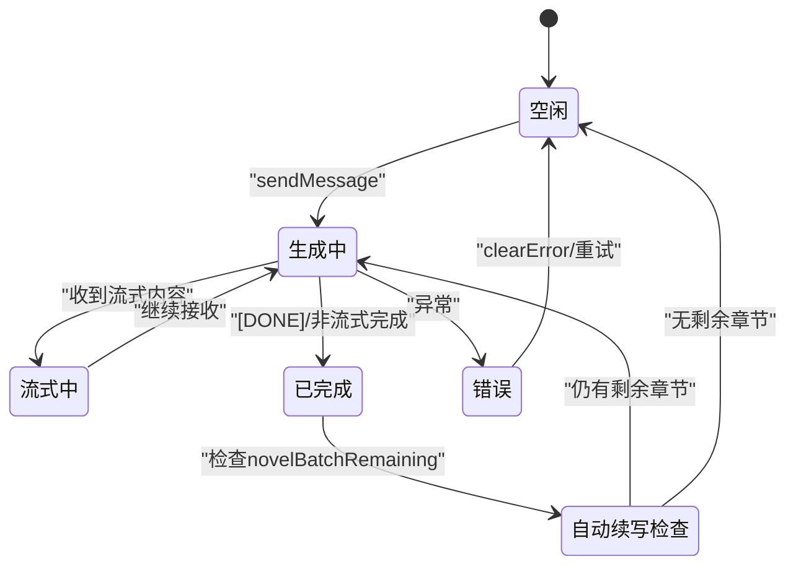

**图表来源**

- [apps/frontend/src/features/ai/composables/useChatState.ts:14-78](file://apps/frontend/src/features/ai/composables/useChatState.ts#L14-L78)
- [apps/frontend/src/features/ai/composables/useChatActions.ts:333-408](file://apps/frontend/src/features/ai/composables/useChatActions.ts#L333-L408)
- [apps/frontend/src/features/ai/composables/useChatActions.stream.ts:153-160](file://apps/frontend/src/features/ai/composables/useChatActions.stream.ts#L153-L160)

**章节来源**

- [apps/frontend/src/features/ai/composables/useChatState.ts:1-149](file://apps/frontend/src/features/ai/composables/useChatState.ts#L1-L149)
- [apps/frontend/src/features/ai/composables/useChat.ts:1-136](file://apps/frontend/src/features/ai/composables/useChat.ts#L1-L136)
- [apps/frontend/src/features/ai/composables/useChatActions.ts:1-544](file://apps/frontend/src/features/ai/composables/useChatActions.ts#L1-L544)

### 上下文压缩算法

- 触发条件
  - 当会话未有摘要且历史长度超过阈值，或摘要存在但未总结片段超过阈值时触发。
- 截断策略
  - 基于字符预算从尾部向前累加，保留最近片段；对文档内容进行截断。
- 增量摘要
  - 使用独立模型（可选预设）对新增片段与现有摘要进行增量压缩，限制要点数量与长度。
- 并发与缓存
  - 会话级任务去重与缓存，避免重复压缩；压缩完成后更新会话摘要。

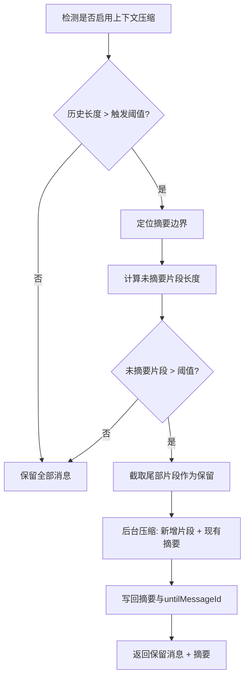

**图表来源**

- [apps/frontend/src/features/ai/composables/useChatActions.contextCompression.ts:150-259](file://apps/frontend/src/features/ai/composables/useChatActions.contextCompression.ts#L150-L259)

**章节来源**

- [apps/frontend/src/features/ai/composables/useChatActions.contextCompression.ts:1-263](file://apps/frontend/src/features/ai/composables/useChatActions.contextCompression.ts#L1-L263)

### 工具调用机制

- 参数解析
  - 将工具参数字符串解析为JSON对象，非法参数返回错误消息。
- 本地工具
  - 注册本地处理器，异步执行并注入工具消息。
- MCP工具
  - 通过mcpApi.callTool调用远端工具，注入工具消息。
- 结果截断
  - 对过长结果进行截断，避免影响上下文。

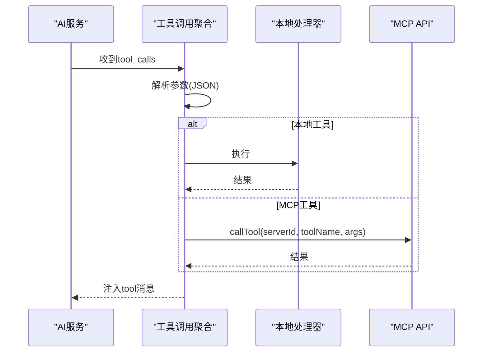

**图表来源**

- [apps/frontend/src/features/ai/composables/useChatActions.toolCalls.ts:30-172](file://apps/frontend/src/features/ai/composables/useChatActions.toolCalls.ts#L30-L172)
- [apps/frontend/src/features/mcp/api/mcp.ts:70-84](file://apps/frontend/src/features/mcp/api/mcp.ts#L70-L84)

**章节来源**

- [apps/frontend/src/features/ai/composables/useChatActions.toolCalls.ts:1-172](file://apps/frontend/src/features/ai/composables/useChatActions.toolCalls.ts#L1-L172)
- [apps/frontend/src/features/mcp/api/mcp.ts:1-108](file://apps/frontend/src/features/mcp/api/mcp.ts#L1-L108)

### MCP工具系统集成

- 能力发现与构建
  - 通过mcpApi.getAllTools获取可用工具，转换为AI工具清单；结合技能运行时构建本地工具处理器。
- 运行时可用性
  - 评估技能运行时（HTTP/MCP）可用性，过滤不可用工具，仅在授权条件下启用。
- 工具调用
  - 优先本地处理，否则转发至MCP服务器执行。

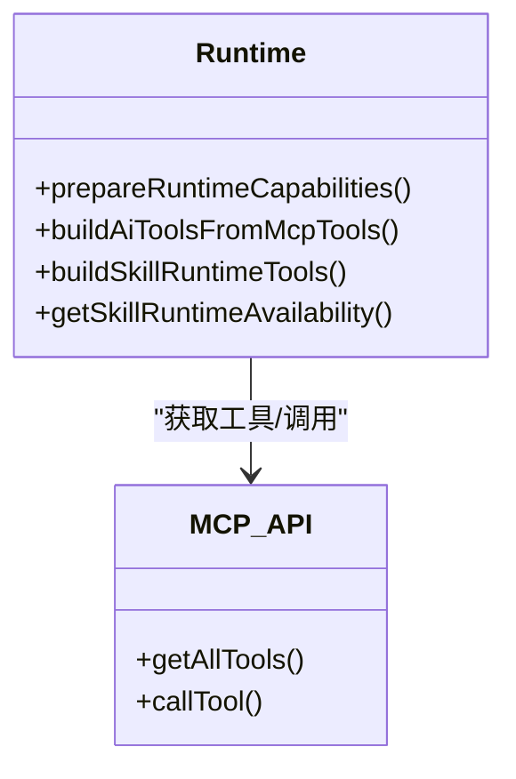

**图表来源**

- [apps/frontend/src/features/ai/composables/useChatActions.runtime.ts:27-99](file://apps/frontend/src/features/ai/composables/useChatActions.runtime.ts#L27-L99)
- [apps/frontend/src/features/mcp/api/mcp.ts:103-107](file://apps/frontend/src/features/mcp/api/mcp.ts#L103-L107)

**章节来源**

- [apps/frontend/src/features/ai/composables/useChatActions.runtime.ts:1-100](file://apps/frontend/src/features/ai/composables/useChatActions.runtime.ts#L1-L100)
- [apps/frontend/src/features/mcp/api/mcp.ts:1-108](file://apps/frontend/src/features/mcp/api/mcp.ts#L1-L108)

### 前端交互与实时处理

- 抽屉式布局与面板
  - AiAssistantDrawer集中管理设置、历史、预设、讨论模式等，支持最大化与侧边栏尺寸调整。
  - **新增** 翻译模式面板与配置选项，支持独立的翻译界面。
  - **新增** 快速模式菜单，提供统一的胶囊设计入口。
  - **新增** 代理工作区选择器，支持工作区管理和权限模式切换。
- 输入增强
  - AiAssistantInput支持斜杠命令（待办/教学/绘图/讨论模式切换、翻译模式）、粘贴、文件上传、自适应高度与移动端优化。
- 消息列表
  - ChatMessageList实现智能滚动、会话切换动画、可见窗口渲染与"返回底部"按钮，提升长对话体验。
  - **增强** 支持小说相关结构化块显示。
- 教学与待办结构化块
  - useChat在消息视图中解析并展示教学测验、评估与待办变更建议，支持交互式提交与批处理。
  - **新增** 翻译模式下的特殊处理逻辑。
- **新增** 小说消息组件
  - 支持角色卡面板、世界观面板、章节元数据的显示
  - 提供继续按钮，支持手动触发下一章生成
- **新增** 增强的推理内容显示
  - ChatMessageThinking组件支持推理内容的智能显示和管理
  - 优化推理内容的优先级处理和用户体验
- **新增** 代理工作区集成
  - AgentWorkspaceSelector与系统提示注入集成
  - 支持工作区路径的动态更新和权限模式切换

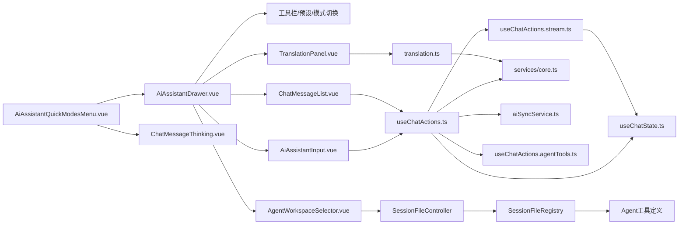

**图表来源**

- [apps/frontend/src/features/ai/components/AiAssistantQuickModesMenu.vue:79-87](file://apps/frontend/src/features/ai/components/AiAssistantQuickModesMenu.vue#L79-L87)
- [apps/frontend/src/features/ai/components/AiAssistantDrawer.vue:274-275](file://apps/frontend/src/features/ai/components/AiAssistantDrawer.vue#L274-L275)
- [apps/frontend/src/features/ai/components/AiAssistantInput.vue:70-79](file://apps/frontend/src/features/ai/components/AiAssistantInput.vue#L70-L79)
- [apps/frontend/src/features/ai/components/ChatMessageList.vue:1-492](file://apps/frontend/src/features/ai/components/ChatMessageList.vue#L1-L492)
- [apps/frontend/src/features/ai/components/TranslationPanel.vue:1-278](file://apps/frontend/src/features/ai/components/TranslationPanel.vue#L1-L278)
- [apps/frontend/src/features/ai/components/ChatMessageThinking.vue:1-303](file://apps/frontend/src/features/ai/components/ChatMessageThinking.vue#L1-L303)
- [apps/frontend/src/features/ai/components/AgentWorkspaceSelector.vue:1-405](file://apps/frontend/src/features/ai/components/AgentWorkspaceSelector.vue#L1-L405)
- [apps/frontend/src/features/ai/composables/useChatActions.ts:1-544](file://apps/frontend/src/features/ai/composables/useChatActions.ts#L1-L544)
- [apps/frontend/src/features/ai/composables/useChatState.ts:1-149](file://apps/frontend/src/features/ai/composables/useChatState.ts#L1-L149)
- [apps/frontend/src/features/ai/composables/useChatActions.stream.ts:1-411](file://apps/frontend/src/features/ai/composables/useChatActions.stream.ts#L1-L411)
- [apps/frontend/src/features/ai/services/core.ts:1-445](file://apps/frontend/src/features/ai/services/core.ts#L1-L445)
- [apps/frontend/src/features/ai/services/aiSyncService.ts:1-41](file://apps/frontend/src/features/ai/services/aiSyncService.ts#L1-L41)
- [apps/frontend/src/features/ai/services/translation.ts:1-54](file://apps/frontend/src/features/ai/services/translation.ts#L1-L54)
- [apps/backend/src/agent/session-file/session-file.controller.ts:1-125](file://apps/backend/src/agent/session-file/session-file.controller.ts#L1-L125)
- [apps/backend/src/agent/session-file/session-file.registry.ts:55-166](file://apps/backend/src/agent/session-file/session-file.registry.ts#L55-L166)

**章节来源**

- [apps/frontend/src/features/ai/components/AiAssistantDrawer.vue:1-475](file://apps/frontend/src/features/ai/components/AiAssistantDrawer.vue#L1-L475)
- [apps/frontend/src/features/ai/components/AiAssistantInput.vue:1-345](file://apps/frontend/src/features/ai/components/AiAssistantInput.vue#L1-L345)
- [apps/frontend/src/features/ai/components/ChatMessageList.vue:1-492](file://apps/frontend/src/features/ai/components/ChatMessageList.vue#L1-L492)
- [apps/frontend/src/features/ai/components/ChatMessage.vue:390-449](file://apps/frontend/src/features/ai/components/ChatMessage.vue#L390-L449)
- [apps/frontend/src/features/ai/components/ChatMessageThinking.vue:1-303](file://apps/frontend/src/features/ai/components/ChatMessageThinking.vue#L1-L303)
- [apps/frontend/src/features/ai/components/AgentWorkspaceSelector.vue:1-405](file://apps/frontend/src/features/ai/components/AgentWorkspaceSelector.vue#L1-L405)
- [apps/frontend/src/features/ai/components/AiAssistantQuickModesMenu.vue:1-158](file://apps/frontend/src/features/ai/components/AiAssistantQuickModesMenu.vue#L1-L158)

## AI数据同步系统

### 系统概述

AI数据同步系统提供服务器端持久化能力，支持记忆、技能、预设三种数据类型的同步。采用"server-as-truth"策略，加载时优先使用API数据，失败时回退到本地存储。

### 核心组件

#### 后端服务层

- **AiSyncController** (`ai-sync.controller.ts`)
  - 提供RESTful API接口：`GET /ai/memories`, `PUT /ai/memories`, `GET /ai/skills`, `PUT /ai/skills`, `GET /ai/presets`, `PUT /ai/presets`
  - 使用JWT认证保护接口，支持Zod验证管道
- **AiMemoryService** (`ai-memory.service.ts`)
  - 每个用户仅一条记录，整存整取
  - 默认内存数据：空数组、禁用状态、阈值30
- **AiSkillService** (`ai-skill.service.ts`)
  - 全量替换策略：每次PUT先删除后批量写入
  - 使用数据库事务保证原子性
- **AiPresetService** (`ai-preset.service.ts`)
  - 全量替换策略：每次PUT先删除后批量写入
  - 安全检查：拒绝包含apiKey字段的预设数据

#### 前端同步服务

- **aiSyncService.ts**
  - HTTP客户端封装，提供安全的GET/PUT方法
  - API优先策略：优先从服务器获取，失败时静默回退到本地存储
  - 错误处理：写入失败静默，下次加载时自动恢复

#### 共享类型定义

- **AIMemoryDataSchema** (`ai-sync.schema.ts`)
  - memories: 最多100条，每条最多200字符的字符串数组
  - enabled: 布尔值
  - threshold: 10-100的整数
- **AISkillSyncSchema** (`ai-sync.schema.ts`)
  - id, name, prompt必需，其他字段可选
  - runtime字段不参与同步（包含API密钥）
- **AIPresetSyncSchema** (`ai-sync.schema.ts`)
  - baseUrl必须是有效URL
  - apiKey字段不参与同步
  - 支持novelGenre、novelTone、novelProtagonistHint等小说相关字段
  - 支持agentMode、agentWorkspaceId、agentWorkspacePath等代理相关字段

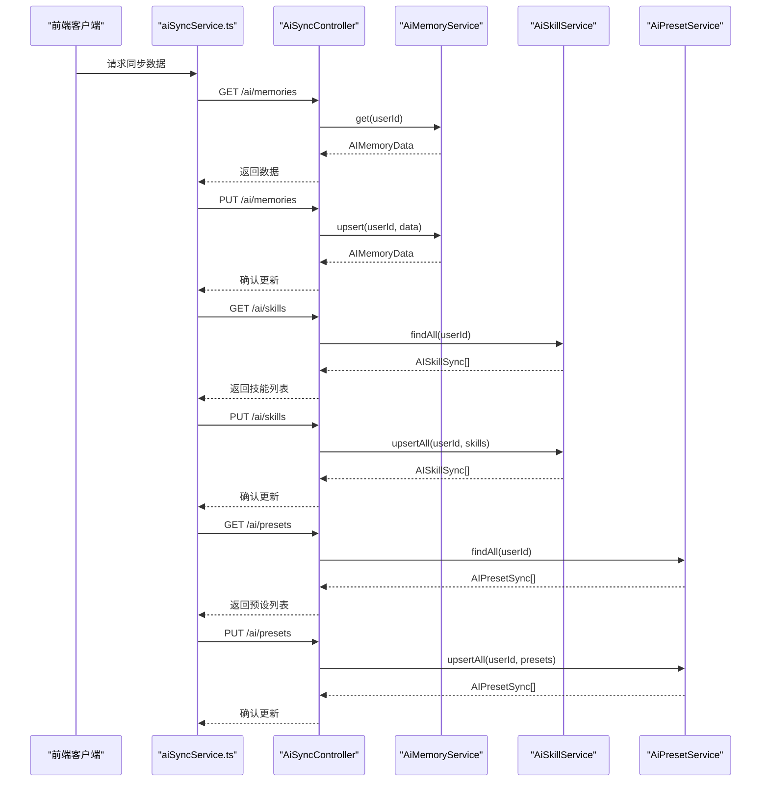

**图表来源**

- [apps/frontend/src/features/ai/services/aiSyncService.ts:1-41](file://apps/frontend/src/features/ai/services/aiSyncService.ts#L1-L41)
- [apps/backend/src/ai-sync/ai-sync.controller.ts:1-84](file://apps/backend/src/ai-sync/ai-sync.controller.ts#L1-L84)
- [apps/backend/src/ai-sync/ai-memory.service.ts:1-64](file://apps/backend/src/ai-sync/ai-memory.service.ts#L1-L64)
- [apps/backend/src/ai-sync/ai-skill.service.ts:1-49](file://apps/backend/src/ai-sync/ai-skill.service.ts#L1-L49)
- [apps/backend/src/ai-sync/ai-preset.service.ts:1-55](file://apps/backend/src/ai-sync/ai-preset.service.ts#L1-L55)

**章节来源**

- [apps/backend/src/ai-sync/ai-sync.module.ts:1-16](file://apps/backend/src/ai-sync/ai-sync.module.ts#L1-L16)
- [apps/backend/src/ai-sync/ai-sync.controller.ts:1-84](file://apps/backend/src/ai-sync/ai-sync.controller.ts#L1-L84)
- [apps/backend/src/ai-sync/ai-memory.service.ts:1-64](file://apps/backend/src/ai-sync/ai-memory.service.ts#L1-L64)
- [apps/backend/src/ai-sync/ai-skill.service.ts:1-49](file://apps/backend/src/ai-sync/ai-skill.service.ts#L1-L49)
- [apps/backend/src/ai-sync/ai-preset.service.ts:1-55](file://apps/backend/src/ai-sync/ai-preset.service.ts#L1-L55)
- [apps/frontend/src/features/ai/services/aiSyncService.ts:1-41](file://apps/frontend/src/features/ai/services/aiSyncService.ts#L1-L41)
- [packages/shared/src/schemas/ai-sync.schema.ts:1-66](file://packages/shared/src/schemas/ai-sync.schema.ts#L1-L66)

## AI翻译系统

### 系统概述

AI翻译系统提供独立的语言处理能力，支持智能语言检测、实时翻译、历史持久化等功能。通过专门的翻译面板和翻译服务，为用户提供便捷的多语言交流体验。

### 核心组件

#### 翻译面板组件

- **TranslationPanel.vue**
  - 独立的翻译界面，支持双栏布局和拖拽调整
  - 智能语言检测，自动判断目标语言
  - 历史持久化，防抖保存翻译记录
  - 实时状态反馈，包括加载、错误和空状态
  - 响应式设计，支持桌面端和移动端

#### 翻译服务

- **translation.ts**
  - `detectLanguage(text: string): 'zh' | 'non-zh'`
    - 使用正则表达式检测中文字符
    - 返回'zh'或'non-zh'标识
  - `translateText(text: string, targetLang: 'zh' | 'en', config: AIConfig, signal?: AbortSignal): Promise<string>`
    - 调用AI API进行翻译
    - 设置专业翻译系统提示词
    - 温度0.3确保翻译稳定性
    - 支持请求取消和错误处理

#### 模式集成

- **useAiModeItems.ts**
  - 新增翻译模式支持，统一模式管理
  - 确保翻译模式在所有菜单中的正确排序
  - 支持响应式状态管理和动态切换

#### 配置扩展

- **useAIConfig/types.ts**
  - 新增AssistantMode支持'translation'
  - 翻译模式与其他模式互斥机制
  - 支持翻译模式的状态持久化

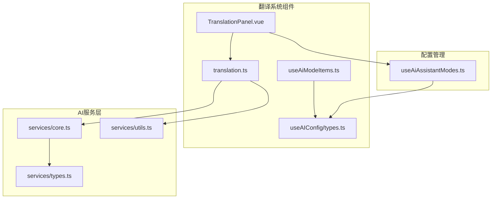

**图表来源**

- [apps/frontend/src/features/ai/components/TranslationPanel.vue:1-278](file://apps/frontend/src/features/ai/components/TranslationPanel.vue#L1-L278)
- [apps/frontend/src/features/ai/services/translation.ts:1-54](file://apps/frontend/src/features/ai/services/translation.ts#L1-L54)
- [apps/frontend/src/features/ai/composables/useAiModeItems.ts:1-63](file://apps/frontend/src/features/ai/composables/useAiModeItems.ts#L1-L63)
- [apps/frontend/src/features/ai/composables/useAIConfig/types.ts:1-37](file://apps/frontend/src/features/ai/composables/useAIConfig/types.ts#L1-L37)
- [apps/frontend/src/features/ai/composables/useAiAssistantModes.ts:44-54](file://apps/frontend/src/features/ai/composables/useAiAssistantModes.ts#L44-L54)
- [apps/frontend/src/features/ai/services/core.ts:1-445](file://apps/frontend/src/features/ai/services/core.ts#L1-L445)
- [apps/frontend/src/features/ai/services/types.ts:1-292](file://apps/frontend/src/features/ai/services/types.ts#L1-L292)
- [apps/frontend/src/features/ai/services/utils.ts:1-10](file://apps/frontend/src/features/ai/services/utils.ts#L1-L10)

**章节来源**

- [apps/frontend/src/features/ai/components/TranslationPanel.vue:1-278](file://apps/frontend/src/features/ai/components/TranslationPanel.vue#L1-L278)
- [apps/frontend/src/features/ai/services/translation.ts:1-54](file://apps/frontend/src/features/ai/services/translation.ts#L1-L54)
- [apps/frontend/src/features/ai/composables/useAiModeItems.ts:1-63](file://apps/frontend/src/features/ai/composables/useAiModeItems.ts#L1-L63)
- [apps/frontend/src/features/ai/composables/useAIConfig/types.ts:1-95](file://apps/frontend/src/features/ai/composables/useAIConfig/types.ts#L1-L95)
- [apps/frontend/src/features/ai/composables/useAiAssistantModes.ts:1-145](file://apps/frontend/src/features/ai/composables/useAiAssistantModes.ts#L1-L145)

## 小说写作助手系统

### 系统概述

小说写作助手系统提供完整的创作辅助功能，包括角色管理、世界观构建、类型选择等。通过专门的组件面板和配置选项，帮助用户进行沉浸式的小说创作。

### 核心组件

#### 小说助手模式管理

- **useAiAssistantModes.ts** (`useAiAssistantModes.ts`)
  - 新增小说模式切换功能
  - 支持novelGenre、novelTone、novelProtagonistHint等配置项
  - 切换时自动禁用其他模式（待办助手、讨论模式、图像生成）

#### 角色管理系统

- **NovelCharacterCardPanel.vue** (`NovelCharacterCardPanel.vue`)
  - 展示小说角色卡片，支持展开/折叠查看详情
  - 支持四种角色类型：主角、二号角色、反派、配角
  - 可配置性格特征、动机、背景故事
  - 响应式网格布局，支持多角色展示

#### 世界观构建系统

- **NovelWorldviewPanel.vue** (`NovelWorldviewPanel.vue`)
  - 展示小说世界观设置，支持多种分类
  - 地理环境、文化体系、魔法系统、科技水平、政治制度、历史背景
  - 每个设置包含名称和详细描述
  - 图标化展示，提升视觉体验

#### 类型选择器

- **NovelGenreSelector.vue** (`NovelGenreSelector.vue`)
  - 支持八种小说类型：奇幻、科幻、浪漫、悬疑、武侠、文学、恐怖、赛博朋克
  - 每种类型配有专属图标和标签
  - 支持单选操作，高亮显示当前选择

#### 小说相关类型定义

- **AssistantMode扩展** (`types.ts`)
  - 新增'novel'模式类型
  - 支持小说创作场景的专业提示词和工作流程
- **Novel相关类型** (`types.ts`)
  - NovelGenre枚举：支持八种小说类型
  - NovelCharacterRole：角色类型枚举
  - NovelWorldviewCategory：世界观分类枚举
  - NovelCharacterCard、NovelWorldviewSetting、NovelChapterMeta结构定义

#### **新增** 小说消息组件增强

- **ChatMessage.vue** (`ChatMessage.vue`)
  - 支持角色卡面板和世界观面板的显示
  - 提供继续按钮，支持手动触发下一章生成
  - 支持章节元数据的展示

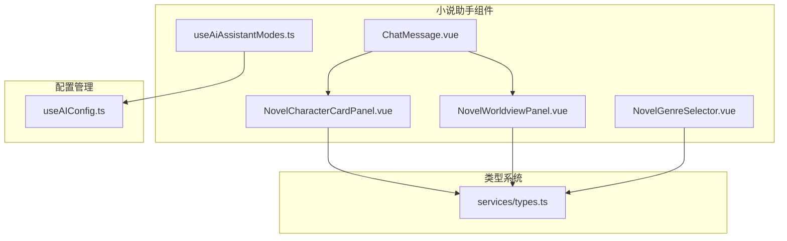

**图表来源**

- [apps/frontend/src/features/ai/composables/useAiAssistantModes.ts:1-145](file://apps/frontend/src/features/ai/composables/useAiAssistantModes.ts#L1-L145)
- [apps/frontend/src/features/ai/components/NovelCharacterCardPanel.vue:1-130](file://apps/frontend/src/features/ai/components/NovelCharacterCardPanel.vue#L1-L130)
- [apps/frontend/src/features/ai/components/NovelWorldviewPanel.vue:1-78](file://apps/frontend/src/features/ai/components/NovelWorldviewPanel.vue#L1-L78)
- [apps/frontend/src/features/ai/components/NovelGenreSelector.vue:1-56](file://apps/frontend/src/features/ai/components/NovelGenreSelector.vue#L1-L56)
- [apps/frontend/src/features/ai/services/types.ts:133-174](file://apps/frontend/src/features/ai/services/types.ts#L133-L174)
- [apps/frontend/src/features/ai/components/ChatMessage.vue:390-449](file://apps/frontend/src/features/ai/components/ChatMessage.vue#L390-L449)

**章节来源**

- [apps/frontend/src/features/ai/composables/useAiAssistantModes.ts:1-145](file://apps/frontend/src/features/ai/composables/useAiAssistantModes.ts#L1-L145)
- [apps/frontend/src/features/ai/components/NovelCharacterCardPanel.vue:1-130](file://apps/frontend/src/features/ai/components/NovelCharacterCardPanel.vue#L1-L130)
- [apps/frontend/src/features/ai/components/NovelWorldviewPanel.vue:1-78](file://apps/frontend/src/features/ai/components/NovelWorldviewPanel.vue#L1-L78)
- [apps/frontend/src/features/ai/components/NovelGenreSelector.vue:1-56](file://apps/frontend/src/features/ai/components/NovelGenreSelector.vue#L1-L56)
- [apps/frontend/src/features/ai/services/types.ts:133-174](file://apps/frontend/src/features/ai/services/types.ts#L133-L174)
- [apps/frontend/src/features/ai/components/ChatMessage.vue:390-449](file://apps/frontend/src/features/ai/components/ChatMessage.vue#L390-L449)

## 代理工作空间系统

### 系统概述

代理工作空间系统为AI助手提供本地文件操作能力，支持在受控的工作区内执行文件操作、命令执行和文件交付。通过AgentWorkspaceSelector组件和SessionFileController后端服务，实现完整的文件管理生命周期。

### 核心组件

#### 工作区选择器

- **AgentWorkspaceSelector.vue**
  - 提供工作区选择界面，支持添加、删除、选择工作区
  - 支持三种权限模式：自动、询问、只读
  - 与后端API交互，管理工作区状态
  - 支持本地目录选择和远程工作区管理

#### 会话文件管理

- **SessionFileController** (`session-file.controller.ts`)
  - 提供RESTful API接口：`POST /api/agent/session-files`、`GET /api/agent/session-files`、`DELETE /api/agent/session-files/:id`
  - 支持文件注册、查询、删除操作
  - 验证文件存在性和会话ID有效性
  - 返回标准化的API响应格式

- **SessionFileRegistry** (`session-file.registry.ts`)
  - 内存中的文件索引和持久化存储
  - 支持按会话ID查询文件列表
  - 文件注册、删除和统计功能
  - JSON文件持久化，支持数据恢复

#### Agent工具系统

- **Agent工具定义** (`useChatActions.agentTools.ts`)
  - 完整的本地文件操作工具链：READ_FILE、WRITE_FILE、EDIT_FILE、LS、GREP、FIND、MKDIR、BASH、STAGE_FILES
  - 支持文件读取、写入、编辑、目录操作、搜索、创建目录、命令执行、文件交付
  - 与工作区路径绑定，限制操作范围
  - 参数验证和错误处理

#### 系统提示注入

- **buildAgentSystemPrompt** (`systemPrompts.ts`)
  - 生成Agent工具使用规范和安全指导
  - 包含工作区路径提示、工具纪律、文件交付、失败处理、操作安全等原则
  - 与injectSystemPrompts集成，实现完整的Agent能力注入

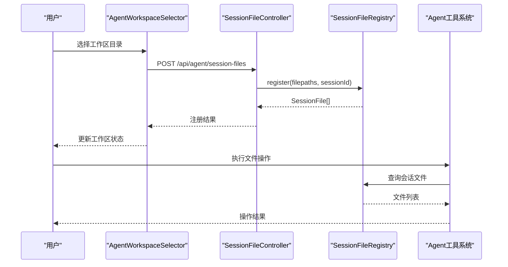

**图表来源**

- [apps/frontend/src/features/ai/components/AgentWorkspaceSelector.vue:69-156](file://apps/frontend/src/features/ai/components/AgentWorkspaceSelector.vue#L69-L156)
- [apps/backend/src/agent/session-file/session-file.controller.ts:22-80](file://apps/backend/src/agent/session-file/session-file.controller.ts#L22-L80)
- [apps/backend/src/agent/session-file/session-file.registry.ts:107-133](file://apps/backend/src/agent/session-file/session-file.registry.ts#L107-L133)
- [apps/frontend/src/features/ai/composables/useChatActions.agentTools.ts:9-166](file://apps/frontend/src/features/ai/composables/useChatActions.agentTools.ts#L9-L166)

**章节来源**

- [apps/frontend/src/features/ai/components/AgentWorkspaceSelector.vue:1-405](file://apps/frontend/src/features/ai/components/AgentWorkspaceSelector.vue#L1-L405)
- [apps/backend/src/agent/session-file/session-file.controller.ts:1-125](file://apps/backend/src/agent/session-file/session-file.controller.ts#L1-L125)
- [apps/backend/src/agent/session-file/session-file.registry.ts:55-166](file://apps/backend/src/agent/session-file/session-file.registry.ts#L55-L166)
- [apps/frontend/src/features/ai/composables/useChatActions.agentTools.ts:1-403](file://apps/frontend/src/features/ai/composables/useChatActions.agentTools.ts#L1-L403)
- [apps/frontend/src/features/ai/services/utils/systemPrompts.ts:485-553](file://apps/frontend/src/features/ai/services/utils/systemPrompts.ts#L485-L553)

## 依赖关系分析

- 组件耦合
  - AiAssistantDrawer聚合useChat与useAIConfig，形成UI与业务逻辑的桥接；useChatActions依赖useChatState、useChatHistory、useChatMemory与runtime工具集。
  - **新增** aiSyncService与后端同步模块紧密集成。
  - **新增** TranslationPanel与translation服务深度集成。
  - **新增** AiAssistantQuickModesMenu提供统一的快速模式入口。
  - **新增** ChatMessageThinking组件处理推理内容显示。
  - **新增** systemPrompts.ts提供增强的序列化逻辑和Agent工具注入。
  - **新增** AgentWorkspaceSelector与SessionFileController后端服务集成。
  - **新增** useChatActions.agentTools提供完整的Agent工具处理器。
- 外部依赖
  - MCP API封装@lumina/shared与HTTP客户端，提供工具枚举与调用；AI服务依赖浏览器fetch与SSE Reader。
  - **新增** 后端使用Prisma ORM进行数据持久化。
  - **新增** 代理工作空间系统依赖Sidecar服务进行本地文件操作。
- 循环依赖
  - 通过组合式函数与模块化导入避免循环依赖；工具调用在useChatActions中集中处理，降低跨模块耦合。
  - **新增** useAiModeItems提供统一的模式管理，避免各组件间的模式状态不一致。
  - **新增** useChatState提供全局状态管理，支持novel模式的自动续写功能。
  - **新增** reasoning_content字段支持推理内容的完整显示。
  - **新增** 多级思维模式配置支持精细化的推理控制。
  - **新增** 翻译模式集成支持模式间的互斥切换。
  - **新增** Agent工具系统提供完整的本地文件操作能力。

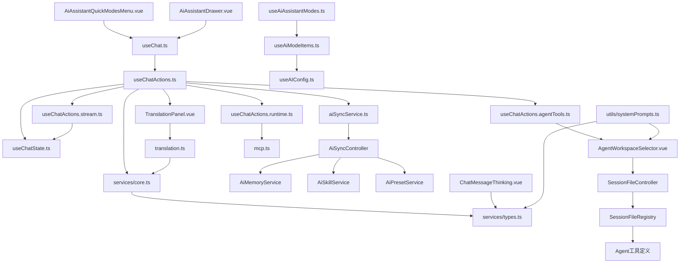

**图表来源**

- [apps/frontend/src/features/ai/components/AiAssistantQuickModesMenu.vue:1-158](file://apps/frontend/src/features/ai/components/AiAssistantQuickModesMenu.vue#L1-L158)
- [apps/frontend/src/features/ai/components/AiAssistantDrawer.vue:1-475](file://apps/frontend/src/features/ai/components/AiAssistantDrawer.vue#L1-L475)
- [apps/frontend/src/features/ai/composables/useChat.ts:1-136](file://apps/frontend/src/features/ai/composables/useChat.ts#L1-L136)
- [apps/frontend/src/features/ai/composables/useChatActions.ts:1-544](file://apps/frontend/src/features/ai/composables/useChatActions.ts#L1-L544)
- [apps/frontend/src/features/ai/composables/useChatActions.stream.ts:1-411](file://apps/frontend/src/features/ai/composables/useChatActions.stream.ts#L1-L411)
- [apps/frontend/src/features/ai/composables/useChatState.ts:1-149](file://apps/frontend/src/features/ai/composables/useChatState.ts#L1-L149)
- [apps/frontend/src/features/ai/composables/useChatActions.runtime.ts:1-100](file://apps/frontend/src/features/ai/composables/useChatActions.runtime.ts#L1-L100)
- [apps/frontend/src/features/mcp/api/mcp.ts:1-108](file://apps/frontend/src/features/mcp/api/mcp.ts#L1-L108)
- [apps/frontend/src/features/ai/services/core.ts:1-445](file://apps/frontend/src/features/ai/services/core.ts#L1-L445)
- [apps/frontend/src/features/ai/services/types.ts:1-292](file://apps/frontend/src/features/ai/services/types.ts#L1-L292)
- [apps/frontend/src/features/ai/services/aiSyncService.ts:1-41](file://apps/frontend/src/features/ai/services/aiSyncService.ts#L1-L41)
- [apps/frontend/src/features/ai/services/translation.ts:1-54](file://apps/frontend/src/features/ai/services/translation.ts#L1-L54)
- [apps/frontend/src/features/ai/composables/useAiModeItems.ts:1-63](file://apps/frontend/src/features/ai/composables/useAiModeItems.ts#L1-L63)
- [apps/frontend/src/features/ai/composables/useAiAssistantModes.ts:1-145](file://apps/frontend/src/features/ai/composables/useAiAssistantModes.ts#L1-L145)
- [apps/frontend/src/features/ai/components/ChatMessageThinking.vue:1-303](file://apps/frontend/src/features/ai/components/ChatMessageThinking.vue#L1-L303)
- [apps/frontend/src/features/ai/services/utils/systemPrompts.ts:485-553](file://apps/frontend/src/features/ai/services/utils/systemPrompts.ts#L485-L553)
- [apps/backend/src/ai-sync/ai-sync.controller.ts:1-84](file://apps/backend/src/ai-sync/ai-sync.controller.ts#L1-L84)
- [apps/backend/src/agent/session-file/session-file.controller.ts:1-125](file://apps/backend/src/agent/session-file/session-file.controller.ts#L1-L125)
- [apps/backend/src/agent/session-file/session-file.registry.ts:55-166](file://apps/backend/src/agent/session-file/session-file.registry.ts#L55-L166)

**章节来源**

- [apps/frontend/src/features/ai/composables/useChatActions.ts:1-544](file://apps/frontend/src/features/ai/composables/useChatActions.ts#L1-L544)
- [apps/frontend/src/features/mcp/api/mcp.ts:1-108](file://apps/frontend/src/features/mcp/api/mcp.ts#L1-L108)
- [apps/frontend/src/features/ai/services/core.ts:1-445](file://apps/frontend/src/features/ai/services/core.ts#L1-L445)
- [apps/frontend/src/features/ai/services/aiSyncService.ts:1-41](file://apps/frontend/src/features/ai/services/aiSyncService.ts#L1-L41)
- [apps/frontend/src/features/ai/services/translation.ts:1-54](file://apps/frontend/src/features/ai/services/translation.ts#L1-L54)
- [apps/frontend/src/features/ai/composables/useAiModeItems.ts:1-63](file://apps/frontend/src/features/ai/composables/useAiModeItems.ts#L1-L63)
- [apps/frontend/src/features/ai/composables/useAiAssistantModes.ts:1-145](file://apps/frontend/src/features/ai/composables/useAiAssistantModes.ts#L1-L145)
- [apps/frontend/src/features/ai/composables/useChatActions.stream.ts:1-411](file://apps/frontend/src/features/ai/composables/useChatActions.stream.ts#L1-L411)
- [apps/frontend/src/features/ai/composables/useChatState.ts:1-149](file://apps/frontend/src/features/ai/composables/useChatState.ts#L1-L149)
- [apps/frontend/src/features/ai/components/ChatMessageThinking.vue:1-303](file://apps/frontend/src/features/ai/components/ChatMessageThinking.vue#L1-L303)
- [apps/frontend/src/features/ai/services/utils/systemPrompts.ts:485-553](file://apps/frontend/src/features/ai/services/utils/systemPrompts.ts#L485-L553)
- [apps/backend/src/ai-sync/ai-sync.controller.ts:1-84](file://apps/backend/src/ai-sync/ai-sync.controller.ts#L1-L84)
- [apps/backend/src/agent/session-file/session-file.controller.ts:1-125](file://apps/backend/src/agent/session-file/session-file.controller.ts#L1-L125)
- [apps/backend/src/agent/session-file/session-file.registry.ts:55-166](file://apps/backend/src/agent/session-file/session-file.registry.ts#L55-L166)

## 性能考量

- 流式渲染
  - 使用useSmartScroll与虚拟窗口渲染，减少DOM节点数量，提升长对话滚动性能。
- 上下文压缩
  - 基于字符预算截断与增量摘要，控制请求负载；后台压缩避免阻塞主线程。
- 工具调用
  - 工具结果截断与错误兜底，避免超长内容污染上下文；本地工具优先执行，降低网络延迟。
- 缓存与复用
  - 会话级压缩任务缓存与去重，避免重复计算；预设与配置持久化减少初始化成本。
- **新增** 多级思维模式优化
  - off级别完全跳过推理生成，减少API调用和处理开销
  - auto级别智能决策，平衡推理质量和性能
  - high/xhigh级别增加推理开销，但提供更丰富的思考过程
- **新增** 代理工作空间性能
  - 工作区路径限制避免不必要的文件扫描
  - 权限模式选择影响操作频率和复杂度
  - 文件注册采用异步处理，避免阻塞UI线程
- **新增** 推理内容显示优化
  - reasoning_details优先显示策略，减少不必要的内容处理
  - ChatMessageThinking组件的智能折叠逻辑，避免频繁的DOM操作
  - 推理内容的序列化处理，确保传输效率
- **新增** 快速模式菜单性能
  - 统一胶囊设计减少复杂的布局计算
  - hover延迟机制避免频繁的菜单显示/隐藏操作
  - 响应式设计适配不同设备的性能需求
- **新增** 增强的流式传输处理
  - novel模式自动续写逻辑优化，减少不必要的状态切换
  - 章节标记统计采用高效正则表达式，避免性能瓶颈
  - 保底扣减策略防止死循环，提升系统稳定性
- **新增** AI数据同步
  - API优先策略减少重复网络请求；失败静默回退避免影响用户体验。
  - 数据验证与安全检查防止恶意数据注入。
- **新增** 翻译系统优化
  - 防抖保存（500ms）避免频繁localStorage写入
  - 智能语言检测减少不必要的API调用
  - 响应式布局优化移动端体验
  - 错误处理与状态管理提升用户体验
- **新增** Agent工具系统性能
  - Sidecar服务的异步处理避免阻塞主进程
  - 工具参数的严格验证减少无效调用
  - 文件操作的批量处理提升效率

## 故障排查指南

- 流式中断
  - 检查AbortSignal是否被外部复用；确认[DONE]收尾与工具调用补发逻辑。
- 工具调用失败
  - 校验工具参数JSON合法性；检查本地处理器与MCP服务器可达性；查看工具返回内容长度截断日志。
- 上下文压缩异常
  - 确认摘要模型预设可用；检查摘要untilMessageId是否与当前会话一致；观察后台任务状态。
- **新增** 多级思维模式问题
  - 检查ThinkingMode和ReasoningEffort配置是否在有效范围内
  - 验证normalizeThinkingLevel函数的级别转换逻辑
  - 确认AISettingsParameterSection和AiAssistantThinkingMenu的界面更新
- **新增** 代理工作空间问题
  - 检查AgentWorkspaceSelector的Sidecar服务连接状态
  - 验证SessionFileController的API响应和错误处理
  - 确认SessionFileRegistry的文件索引和持久化状态
  - 检查Agent工具的参数验证和执行结果
- **新增** 推理内容显示问题
  - 检查reasoning_details和thinkingContent的优先级处理逻辑
  - 验证reasoning_content字段的序列化和传输边界处理
  - 确认ChatMessageThinking组件的自动折叠和展开逻辑
- **新增** 快速模式菜单问题
  - 检查AiAssistantQuickModesMenu组件的hover延迟和点击响应逻辑
  - 验证模式切换时的状态同步和UI更新
  - 确认移动端降级机制的正常工作
- **新增** 增强流式传输处理问题
  - 检查novelBatchRemaining状态是否正确更新
  - 验证章节标记正则表达式匹配是否正常
  - 确认自动续写逻辑的触发条件和状态保持机制
- **新增** AI数据同步问题
  - 检查JWT令牌有效性；确认API端点可达性；验证数据格式符合Zod schema要求。
  - 查看后端日志确认Prisma事务执行状态；检查安全检查是否阻止了包含敏感信息的预设。
- **新增** 翻译功能问题
  - 检查AI API配置（baseUrl、apiKey、model）；确认翻译API可用性
  - 验证语言检测逻辑，检查正则表达式是否正确识别中文字符
  - 查看localStorage权限和容量限制
  - 检查网络连接和API响应状态码
- **新增** Agent工具系统问题
  - 检查Sidecar服务的可用性和端口配置
  - 验证工具参数的Schema验证是否通过
  - 确认文件路径的有效性和权限设置
  - 查看工具执行的日志和错误信息
- 错误提示
  - 使用AiAssistantDrawer中的错误复制功能快速上报；结合useChatState.clearError重置状态。

**章节来源**

- [apps/frontend/src/features/ai/services/core.ts:328-339](file://apps/frontend/src/features/ai/services/core.ts#L328-L339)
- [apps/frontend/src/features/ai/composables/useChatActions.toolCalls.ts:140-172](file://apps/frontend/src/features/ai/composables/useChatActions.toolCalls.ts#L140-L172)
- [apps/frontend/src/features/ai/composables/useChatActions.contextCompression.ts:136-140](file://apps/frontend/src/features/ai/composables/useChatActions.contextCompression.ts#L136-L140)
- [apps/frontend/src/features/ai/composables/useChatActions.stream.ts:153-160](file://apps/frontend/src/features/ai/composables/useChatActions.stream.ts#L153-L160)
- [apps/frontend/src/features/ai/components/AiAssistantDrawer.vue:84-98](file://apps/frontend/src/features/ai/components/AiAssistantDrawer.vue#L84-L98)
- [apps/frontend/src/features/ai/components/ChatMessageThinking.vue:65-100](file://apps/frontend/src/features/ai/components/ChatMessageThinking.vue#L65-L100)
- [apps/frontend/src/features/ai/components/AiAssistantQuickModesMenu.vue:79-87](file://apps/frontend/src/features/ai/components/AiAssistantQuickModesMenu.vue#L79-L87)
- [apps/backend/src/ai-sync/ai-preset.service.ts:30-36](file://apps/backend/src/ai-sync/ai-preset.service.ts#L30-L36)
- [apps/frontend/src/features/ai/services/translation.ts:35-49](file://apps/frontend/src/features/ai/services/translation.ts#L35-L49)
- [apps/frontend/src/features/ai/components/TranslationPanel.vue:76-84](file://apps/frontend/src/features/ai/components/TranslationPanel.vue#L76-L84)
- [apps/frontend/src/features/ai/composables/useAIConfig/index.ts:90-101](file://apps/frontend/src/features/ai/composables/useAIConfig/index.ts#L90-L101)
- [apps/frontend/src/features/ai/components/AISettingsParameterSection.vue:124-153](file://apps/frontend/src/features/ai/components/AISettingsParameterSection.vue#L124-L153)
- [apps/frontend/src/features/ai/components/AiAssistantThinkingMenu.vue:28-48](file://apps/frontend/src/features/ai/components/AiAssistantThinkingMenu.vue#L28-L48)
- [apps/frontend/src/features/ai/components/AgentWorkspaceSelector.vue:69-156](file://apps/frontend/src/features/ai/components/AgentWorkspaceSelector.vue#L69-L156)
- [apps/backend/src/agent/session-file/session-file.controller.ts:22-80](file://apps/backend/src/agent/session-file/session-file.controller.ts#L22-L80)
- [apps/backend/src/agent/session-file/session-file.registry.ts:107-133](file://apps/backend/src/agent/session-file/session-file.registry.ts#L107-L133)
- [apps/frontend/src/features/ai/composables/useChatActions.agentTools.ts:176-185](file://apps/frontend/src/features/ai/composables/useChatActions.agentTools.ts#L176-L185)

## 结论

Lumina Todo的AI助手系统通过清晰的分层设计与模块化组合，实现了从对话编排、上下文压缩、工具调用到前端交互的完整闭环。**新增的多级思维模式**通过ThinkingMode和ReasoningEffort配置实现精细化控制，提供off/auto/high/xhigh四个级别的推理强度调节；**代理工作空间系统**通过AgentWorkspaceSelector和SessionFileController提供完整的本地文件操作能力，支持文件读写、编辑、查找等操作；**增强的推理内容显示**通过reasoning_details优先策略优化用户体验；**Agent工具系统**提供完整的本地文件操作工具链，支持9种不同的工具类型。其预设配置与运行时能力准备机制，使得系统具备良好的可扩展性与可维护性；流式渲染与智能滚动提升了用户体验；MCP工具集成进一步增强了系统能力边界。**翻译模式支持**为多语言交流提供了独立的功能模块；**小说写作助手增强**通过角色管理、世界观构建等组件提升了创作体验。建议在生产环境中持续关注多级思维模式的性能影响、代理工作空间的安全性和稳定性，确保推理内容的正确处理和高效传输，同时优化Agent工具的权限控制和错误处理机制。

## 附录

### API使用示例（集成要点）

- 发送消息（流式）
  - 调用路径：AiAssistantDrawer -> useChatActions.sendMessage -> services/core.getAIStreamResponse
  - 关键参数：messagesForRequest、thinkingMode、tools、contextSummary、skills、activeSkills、skillRuntimeAvailability
  - 回调：内容、思考、推理、工具调用
- 生成图片
  - 路径：AiAssistantInput -> useChatActions.generateImage -> services/core.getAIImageResponse
  - 注意：需开启图像生成功能开关
- 工具调用执行
  - 路径：useChatActions.executeToolCalls -> 本地处理器或mcpApi.callTool
  - 注意：参数JSON解析与结果截断
- 上下文压缩
  - 路径：useChatActions.contextCompression.buildContextCompression
  - 注意：阈值、摘要模型预设、会话边界
- **新增** 多级思维模式配置
  - 路径：AISettingsParameterSection -> useAIConfig.normalizeThinkingLevel
  - 注意：思维级别的验证和默认值处理
- **新增** 代理工作空间管理
  - 路径：AgentWorkspaceSelector -> SessionFileController.registerFiles
  - 注意：工作区路径验证和权限模式设置
- **新增** Agent工具执行
  - 路径：useChatActions.agentTools -> buildAgentLocalToolHandlers
  - 注意：工具参数验证和本地文件操作
- **新增** 增强推理内容显示
  - 路径：ChatMessageThinking -> reasoning_details优先显示策略
  - 注意：推理内容的优先级处理和智能折叠逻辑
- **新增** 翻译功能
  - 路径：TranslationPanel -> translation.detectLanguage/translateText -> services/core.getAIStreamResponse
  - 注意：智能语言检测、防抖保存、错误处理
- **新增** AI数据同步
  - 路径：aiSyncService -> AiSyncController -> AiMemoryService/AiSkillService/AiPresetService
  - 注意：API优先策略、安全检查、事务原子性
- **新增** 模式管理
  - 路径：useAiModeItems -> useAiAssistantModes -> AIConfig
  - 注意：统一排序、互斥切换、状态持久化
- **新增** 小说写作助手
  - 路径：useAiAssistantModes -> NovelCharacterCardPanel/NovelWorldviewPanel/NovelGenreSelector
  - 注意：角色管理、世界观构建、类型选择的集成

**章节来源**

- [apps/frontend/src/features/ai/components/AiAssistantDrawer.vue:66-80](file://apps/frontend/src/features/ai/components/AiAssistantDrawer.vue#L66-L80)
- [apps/frontend/src/features/ai/composables/useChatActions.ts:333-408](file://apps/frontend/src/features/ai/composables/useChatActions.ts#L333-L408)
- [apps/frontend/src/features/ai/composables/useChatActions.stream.ts:128-312](file://apps/frontend/src/features/ai/composables/useChatActions.stream.ts#L128-L312)
- [apps/frontend/src/features/ai/services/core.ts:115-340](file://apps/frontend/src/features/ai/services/core.ts#L115-L340)
- [apps/frontend/src/features/ai/composables/useChatActions.toolCalls.ts:30-172](file://apps/frontend/src/features/ai/composables/useChatActions.toolCalls.ts#L30-L172)
- [apps/frontend/src/features/ai/composables/useChatActions.contextCompression.ts:150-259](file://apps/frontend/src/features/ai/composables/useChatActions.contextCompression.ts#L150-L259)
- [apps/frontend/src/features/ai/components/ChatMessageThinking.vue:56-63](file://apps/frontend/src/features/ai/components/ChatMessageThinking.vue#L56-L63)
- [apps/frontend/src/features/ai/components/AISettingsParameterSection.vue:118-154](file://apps/frontend/src/features/ai/components/AISettingsParameterSection.vue#L118-L154)
- [apps/frontend/src/features/ai/components/AiAssistantThinkingMenu.vue:28-51](file://apps/frontend/src/features/ai/components/AiAssistantThinkingMenu.vue#L28-L51)
- [apps/frontend/src/features/ai/components/AgentWorkspaceSelector.vue:69-156](file://apps/frontend/src/features/ai/components/AgentWorkspaceSelector.vue#L69-L156)
- [apps/backend/src/agent/session-file/session-file.controller.ts:22-80](file://apps/backend/src/agent/session-file/session-file.controller.ts#L22-L80)
- [apps/frontend/src/features/ai/composables/useChatActions.agentTools.ts:197-200](file://apps/frontend/src/features/ai/composables/useChatActions.agentTools.ts#L197-L200)
- [apps/frontend/src/features/ai/services/aiSyncService.ts:1-41](file://apps/frontend/src/features/ai/services/aiSyncService.ts#L1-L41)
- [apps/backend/src/ai-sync/ai-sync.controller.ts:1-84](file://apps/backend/src/ai-sync/ai-sync.controller.ts#L1-L84)
- [apps/frontend/src/features/ai/services/translation.ts:8-53](file://apps/frontend/src/features/ai/services/translation.ts#L8-L53)
- [apps/frontend/src/features/ai/composables/useAiModeItems.ts:48-62](file://apps/frontend/src/features/ai/composables/useAiModeItems.ts#L48-L62)
- [apps/frontend/src/features/ai/composables/useAiAssistantModes.ts:46-54](file://apps/frontend/src/features/ai/composables/useAiAssistantModes.ts#L46-L54)
- [apps/frontend/src/features/ai/components/NovelCharacterCardPanel.vue:1-130](file://apps/frontend/src/features/ai/components/NovelCharacterCardPanel.vue#L1-L130)
- [apps/frontend/src/features/ai/components/NovelWorldviewPanel.vue:1-78](file://apps/frontend/src/features/ai/components/NovelWorldviewPanel.vue#L1-L78)
- [apps/frontend/src/features/ai/components/NovelGenreSelector.vue:1-56](file://apps/frontend/src/features/ai/components/NovelGenreSelector.vue#L1-L56)
