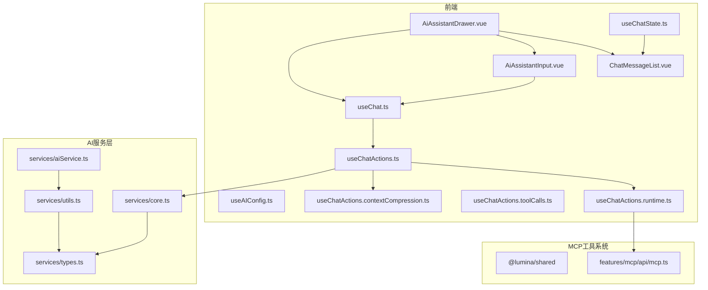
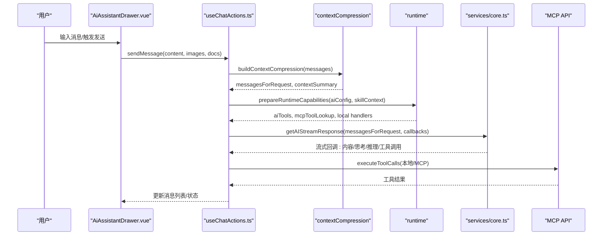
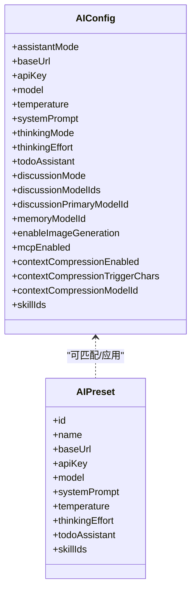
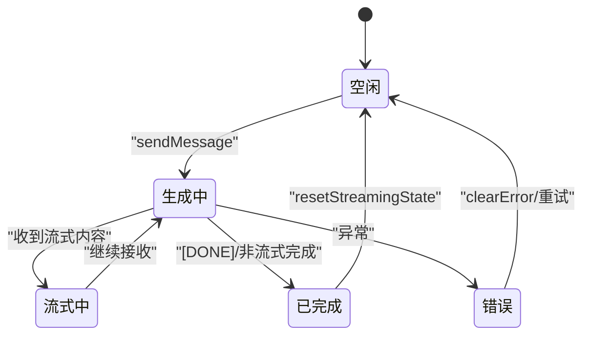
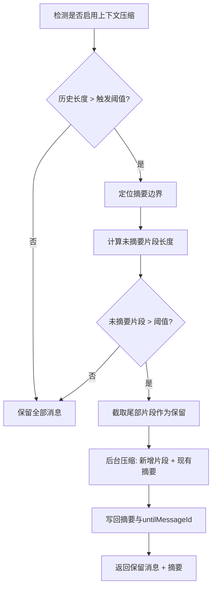
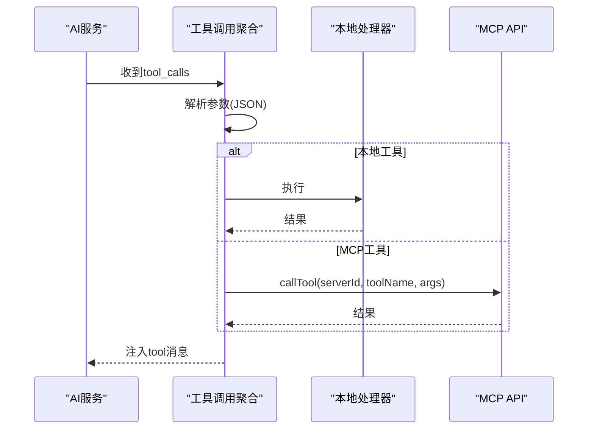
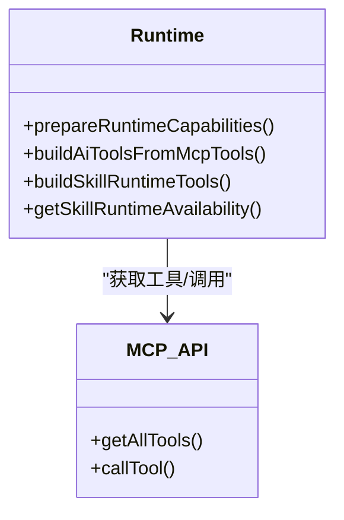
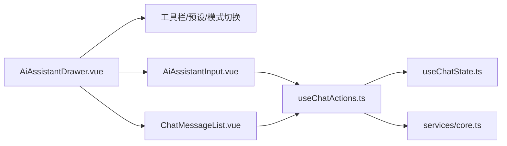
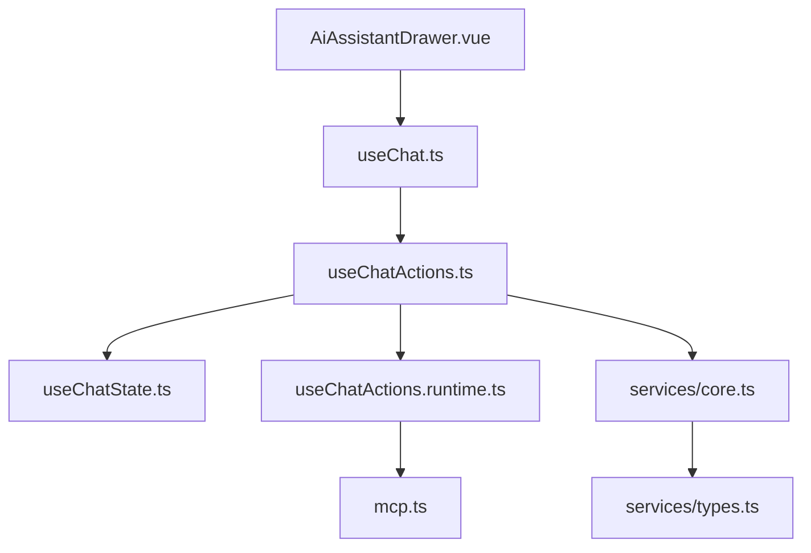

# AI助手系统

<cite>
**本文档引用的文件**
- [apps/frontend/src/features/ai/services/aiService.ts](file://apps/frontend/src/features/ai/services/aiService.ts)
- [apps/frontend/src/features/ai/services/core.ts](file://apps/frontend/src/features/ai/services/core.ts)
- [apps/frontend/src/features/ai/services/types.ts](file://apps/frontend/src/features/ai/services/types.ts)
- [apps/frontend/src/features/ai/services/utils.ts](file://apps/frontend/src/features/ai/services/utils.ts)
- [apps/frontend/src/features/ai/composables/useAIConfig.ts](file://apps/frontend/src/features/ai/composables/useAIConfig.ts)
- [apps/frontend/src/features/ai/composables/useChat.ts](file://apps/frontend/src/features/ai/composables/useChat.ts)
- [apps/frontend/src/features/ai/composables/useChatActions.ts](file://apps/frontend/src/features/ai/composables/useChatActions.ts)
- [apps/frontend/src/features/ai/composables/useChatActions.contextCompression.ts](file://apps/frontend/src/features/ai/composables/useChatActions.contextCompression.ts)
- [apps/frontend/src/features/ai/composables/useChatActions.toolCalls.ts](file://apps/frontend/src/features/ai/composables/useChatActions.toolCalls.ts)
- [apps/frontend/src/features/ai/composables/useChatActions.runtime.ts](file://apps/frontend/src/features/ai/composables/useChatActions.runtime.ts)
- [apps/frontend/src/features/mcp/api/mcp.ts](file://apps/frontend/src/features/mcp/api/mcp.ts)
- [apps/frontend/src/features/ai/components/AiAssistantDrawer.vue](file://apps/frontend/src/features/ai/components/AiAssistantDrawer.vue)
- [apps/frontend/src/features/ai/components/AiAssistantInput.vue](file://apps/frontend/src/features/ai/components/AiAssistantInput.vue)
- [apps/frontend/src/features/ai/components/ChatMessageList.vue](file://apps/frontend/src/features/ai/components/ChatMessageList.vue)
- [apps/frontend/src/features/ai/composables/useChatState.ts](file://apps/frontend/src/features/ai/composables/useChatState.ts)
</cite>

## 目录
1. [简介](#简介)
2. [项目结构](#项目结构)
3. [核心组件](#核心组件)
4. [架构总览](#架构总览)
5. [详细组件分析](#详细组件分析)
6. [依赖关系分析](#依赖关系分析)
7. [性能考量](#性能考量)
8. [故障排查指南](#故障排查指南)
9. [结论](#结论)
10. [附录](#附录)

## 简介
本文件面向Lumina Todo的AI助手系统，提供从架构设计、对话管理、上下文记忆到前端交互与工具调用的完整技术文档。重点覆盖：
- AI Service实现原理与流式响应处理
- 预设配置系统与参数管理
- 上下文压缩算法与记忆管理策略
- 与MCP工具系统的集成方式
- 前端组件的交互设计、状态管理与实时对话处理
- API使用示例与最佳实践

## 项目结构
AI助手系统主要由前端Vue组合式函数与组件、AI服务层、MCP工具接口三部分构成，采用模块化与可插拔的设计，便于扩展与维护。



**图表来源**
- [apps/frontend/src/features/ai/components/AiAssistantDrawer.vue:1-393](file://apps/frontend/src/features/ai/components/AiAssistantDrawer.vue#L1-L393)
- [apps/frontend/src/features/ai/components/AiAssistantInput.vue:1-329](file://apps/frontend/src/features/ai/components/AiAssistantInput.vue#L1-L329)
- [apps/frontend/src/features/ai/components/ChatMessageList.vue:1-492](file://apps/frontend/src/features/ai/components/ChatMessageList.vue#L1-L492)
- [apps/frontend/src/features/ai/composables/useChatState.ts:1-144](file://apps/frontend/src/features/ai/composables/useChatState.ts#L1-L144)
- [apps/frontend/src/features/ai/composables/useChat.ts:1-136](file://apps/frontend/src/features/ai/composables/useChat.ts#L1-L136)
- [apps/frontend/src/features/ai/composables/useChatActions.ts:1-480](file://apps/frontend/src/features/ai/composables/useChatActions.ts#L1-L480)
- [apps/frontend/src/features/ai/composables/useChatActions.contextCompression.ts:1-263](file://apps/frontend/src/features/ai/composables/useChatActions.contextCompression.ts#L1-L263)
- [apps/frontend/src/features/ai/composables/useChatActions.toolCalls.ts:1-172](file://apps/frontend/src/features/ai/composables/useChatActions.toolCalls.ts#L1-L172)
- [apps/frontend/src/features/ai/composables/useChatActions.runtime.ts:1-100](file://apps/frontend/src/features/ai/composables/useChatActions.runtime.ts#L1-L100)
- [apps/frontend/src/features/ai/services/core.ts:1-445](file://apps/frontend/src/features/ai/services/core.ts#L1-L445)
- [apps/frontend/src/features/ai/services/types.ts:1-232](file://apps/frontend/src/features/ai/services/types.ts#L1-L232)
- [apps/frontend/src/features/ai/services/utils.ts:1-10](file://apps/frontend/src/features/ai/services/utils.ts#L1-L10)
- [apps/frontend/src/features/mcp/api/mcp.ts:1-108](file://apps/frontend/src/features/mcp/api/mcp.ts#L1-L108)

**章节来源**
- [apps/frontend/src/features/ai/services/aiService.ts:1-6](file://apps/frontend/src/features/ai/services/aiService.ts#L1-L6)
- [apps/frontend/src/features/ai/services/core.ts:1-445](file://apps/frontend/src/features/ai/services/core.ts#L1-L445)
- [apps/frontend/src/features/ai/services/types.ts:1-232](file://apps/frontend/src/features/ai/services/types.ts#L1-L232)
- [apps/frontend/src/features/ai/services/utils.ts:1-10](file://apps/frontend/src/features/ai/services/utils.ts#L1-L10)
- [apps/frontend/src/features/ai/composables/useAIConfig.ts:1-800](file://apps/frontend/src/features/ai/composables/useAIConfig.ts#L1-L800)
- [apps/frontend/src/features/ai/composables/useChat.ts:1-136](file://apps/frontend/src/features/ai/composables/useChat.ts#L1-L136)
- [apps/frontend/src/features/ai/composables/useChatActions.ts:1-480](file://apps/frontend/src/features/ai/composables/useChatActions.ts#L1-L480)
- [apps/frontend/src/features/ai/composables/useChatActions.contextCompression.ts:1-263](file://apps/frontend/src/features/ai/composables/useChatActions.contextCompression.ts#L1-L263)
- [apps/frontend/src/features/ai/composables/useChatActions.toolCalls.ts:1-172](file://apps/frontend/src/features/ai/composables/useChatActions.toolCalls.ts#L1-L172)
- [apps/frontend/src/features/ai/composables/useChatActions.runtime.ts:1-100](file://apps/frontend/src/features/ai/composables/useChatActions.runtime.ts#L1-L100)
- [apps/frontend/src/features/mcp/api/mcp.ts:1-108](file://apps/frontend/src/features/mcp/api/mcp.ts#L1-L108)
- [apps/frontend/src/features/ai/components/AiAssistantDrawer.vue:1-393](file://apps/frontend/src/features/ai/components/AiAssistantDrawer.vue#L1-L393)
- [apps/frontend/src/features/ai/components/AiAssistantInput.vue:1-329](file://apps/frontend/src/features/ai/components/AiAssistantInput.vue#L1-L329)
- [apps/frontend/src/features/ai/components/ChatMessageList.vue:1-492](file://apps/frontend/src/features/ai/components/ChatMessageList.vue#L1-L492)
- [apps/frontend/src/features/ai/composables/useChatState.ts:1-144](file://apps/frontend/src/features/ai/composables/useChatState.ts#L1-L144)

## 核心组件
- AI服务核心（core.ts）
  - 实现流式与非流式请求、SSE解析、工具调用聚合、推理内容抽取、请求中断与信号管理。
- 类型系统（types.ts）
  - 定义消息、工具、推理细节、技能、结构化块等核心类型，支撑前后端一致的数据契约。
- 配置与预设（useAIConfig.ts）
  - 统一管理AI参数、思考模式、讨论模式、上下文压缩开关与阈值、技能集合与运行时可用性。
- 对话编排（useChat.ts, useChatState.ts）
  - 聚合状态与动作，计算实时消息视图，支持流式渲染与教学/待办结构化块。
- 动作与流程（useChatActions.ts）
  - 发送消息、生成图片、停止生成、重试机制、上下文压缩、工具调用执行、MCP集成。
- 上下文压缩（useChatActions.contextCompression.ts）
  - 基于字符预算的尾部截取与增量摘要，保障长对话上下文可控。
- 工具调用（useChatActions.toolCalls.ts）
  - 解析工具参数、本地工具与MCP工具执行、结果注入消息流。
- 运行时能力准备（useChatActions.runtime.ts）
  - 从MCP与技能库构建AI工具清单，评估运行时可用性，注入提示词。
- MCP API（mcp.ts）
  - 封装服务器管理、工具枚举与调用，提供超时与错误兜底。
- 前端组件（AiAssistantDrawer.vue, AiAssistantInput.vue, ChatMessageList.vue）
  - 抽屉式交互、输入增强（斜杠命令、粘贴、附件）、消息列表与智能滚动。

**章节来源**
- [apps/frontend/src/features/ai/services/core.ts:1-445](file://apps/frontend/src/features/ai/services/core.ts#L1-L445)
- [apps/frontend/src/features/ai/services/types.ts:1-232](file://apps/frontend/src/features/ai/services/types.ts#L1-L232)
- [apps/frontend/src/features/ai/composables/useAIConfig.ts:1-800](file://apps/frontend/src/features/ai/composables/useAIConfig.ts#L1-L800)
- [apps/frontend/src/features/ai/composables/useChat.ts:1-136](file://apps/frontend/src/features/ai/composables/useChat.ts#L1-L136)
- [apps/frontend/src/features/ai/composables/useChatState.ts:1-144](file://apps/frontend/src/features/ai/composables/useChatState.ts#L1-L144)
- [apps/frontend/src/features/ai/composables/useChatActions.ts:1-480](file://apps/frontend/src/features/ai/composables/useChatActions.ts#L1-L480)
- [apps/frontend/src/features/ai/composables/useChatActions.contextCompression.ts:1-263](file://apps/frontend/src/features/ai/composables/useChatActions.contextCompression.ts#L1-L263)
- [apps/frontend/src/features/ai/composables/useChatActions.toolCalls.ts:1-172](file://apps/frontend/src/features/ai/composables/useChatActions.toolCalls.ts#L1-L172)
- [apps/frontend/src/features/ai/composables/useChatActions.runtime.ts:1-100](file://apps/frontend/src/features/ai/composables/useChatActions.runtime.ts#L1-L100)
- [apps/frontend/src/features/mcp/api/mcp.ts:1-108](file://apps/frontend/src/features/mcp/api/mcp.ts#L1-L108)
- [apps/frontend/src/features/ai/components/AiAssistantDrawer.vue:1-393](file://apps/frontend/src/features/ai/components/AiAssistantDrawer.vue#L1-L393)
- [apps/frontend/src/features/ai/components/AiAssistantInput.vue:1-329](file://apps/frontend/src/features/ai/components/AiAssistantInput.vue#L1-L329)
- [apps/frontend/src/features/ai/components/ChatMessageList.vue:1-492](file://apps/frontend/src/features/ai/components/ChatMessageList.vue#L1-L492)

## 架构总览
AI助手系统采用“前端组合式函数 + AI服务层 + MCP工具系统”的分层架构。前端负责交互与状态，AI服务层负责与大模型通信与工具编排，MCP提供外部工具能力。



**图表来源**
- [apps/frontend/src/features/ai/components/AiAssistantDrawer.vue:1-393](file://apps/frontend/src/features/ai/components/AiAssistantDrawer.vue#L1-L393)
- [apps/frontend/src/features/ai/composables/useChatActions.ts:1-480](file://apps/frontend/src/features/ai/composables/useChatActions.ts#L1-L480)
- [apps/frontend/src/features/ai/composables/useChatActions.contextCompression.ts:1-263](file://apps/frontend/src/features/ai/composables/useChatActions.contextCompression.ts#L1-L263)
- [apps/frontend/src/features/ai/composables/useChatActions.runtime.ts:1-100](file://apps/frontend/src/features/ai/composables/useChatActions.runtime.ts#L1-L100)
- [apps/frontend/src/features/ai/services/core.ts:1-445](file://apps/frontend/src/features/ai/services/core.ts#L1-L445)
- [apps/frontend/src/features/mcp/api/mcp.ts:1-108](file://apps/frontend/src/features/mcp/api/mcp.ts#L1-L108)

## 详细组件分析

### AI服务核心（流式与非流式）
- 流式请求
  - 构建请求体（模型、温度、top_p、工具、推理参数），通过fetch建立SSE连接，按行解析data行，累计工具调用，分别触发内容、思考、推理回调。
  - 支持AbortSignal中断，异常处理与[DONE]收尾。
- 非流式请求
  - 构建非流式请求体，解析choices[0].message中的content与reasoning_details，返回文本与推理摘要。
- 工具调用聚合
  - 在流式过程中累积tool_calls，最终一次性触发工具回调，便于后续执行。

```mermaid
flowchart TD
Start(["开始: getAIStreamResponse"]) --> Build["构建请求体<br/>注入系统提示/技能/上下文"]
Build --> Fetch["发起SSE请求"]
Fetch --> Read["读取响应流"]
Read --> Parse{"解析行数据"}
Parse --> |JSON块| Delta["提取 choices.delta<br/>content/thinking/reasoning/tool_calls"]
Delta --> Callbacks["触发回调:<br/>内容/思考/推理/工具调用"]
Parse --> |[DONE]| Done["触发[DONE]并补发未完成工具调用"]
Parse --> |空行/无效| Skip["跳过"]
Callbacks --> Read
Done --> End(["结束"])
Skip --> Read
```

**图表来源**
- [apps/frontend/src/features/ai/services/core.ts:115-340](file://apps/frontend/src/features/ai/services/core.ts#L115-L340)

**章节来源**
- [apps/frontend/src/features/ai/services/core.ts:115-340](file://apps/frontend/src/features/ai/services/core.ts#L115-L340)

### 配置与预设系统
- AIConfig
  - 包含基础参数（baseUrl、apiKey、model、temperature）、系统提示、思考模式与努力等级、讨论模式、图像生成功能开关、MCP开关、上下文压缩开关与阈值、技能ID集合等。
- 预设（AIPreset）
  - 保存常用配置快照，支持与当前配置比对与自动匹配。
- 存储与同步
  - 使用localStorage持久化；思考模式双向绑定；默认配置与归一化逻辑保证一致性。



**图表来源**
- [apps/frontend/src/features/ai/composables/useAIConfig.ts:18-51](file://apps/frontend/src/features/ai/composables/useAIConfig.ts#L18-L51)

**章节来源**
- [apps/frontend/src/features/ai/composables/useAIConfig.ts:601-800](file://apps/frontend/src/features/ai/composables/useAIConfig.ts#L601-L800)

### 对话管理与状态
- useChatState
  - 维护当前会话消息、流式响应内容、思考与推理详情、讨论步骤、待办建议、生成状态、错误与重试次数，并提供重置与清理方法。
- useChat
  - 计算实时消息视图，合并流式响应与结构化块（教学/待办），避免流式结束瞬间的重复消息。
- useChatActions
  - 发送消息、生成图片、停止生成、清理历史、重试机制、上下文压缩、工具调用执行、MCP集成与本地工具处理。



**图表来源**
- [apps/frontend/src/features/ai/composables/useChatState.ts:14-78](file://apps/frontend/src/features/ai/composables/useChatState.ts#L14-L78)
- [apps/frontend/src/features/ai/composables/useChatActions.ts:134-360](file://apps/frontend/src/features/ai/composables/useChatActions.ts#L134-L360)

**章节来源**
- [apps/frontend/src/features/ai/composables/useChatState.ts:1-144](file://apps/frontend/src/features/ai/composables/useChatState.ts#L1-L144)
- [apps/frontend/src/features/ai/composables/useChat.ts:1-136](file://apps/frontend/src/features/ai/composables/useChat.ts#L1-L136)
- [apps/frontend/src/features/ai/composables/useChatActions.ts:1-480](file://apps/frontend/src/features/ai/composables/useChatActions.ts#L1-L480)

### 上下文压缩算法
- 触发条件
  - 当会话未有摘要且历史长度超过阈值，或摘要存在但未总结片段超过阈值时触发。
- 截断策略
  - 基于字符预算从尾部向前累加，保留最近片段；对文档内容进行截断。
- 增量摘要
  - 使用独立模型（可选预设）对新增片段与现有摘要进行增量压缩，限制要点数量与长度。
- 并发与缓存
  - 会话级任务去重与缓存，避免重复压缩；压缩完成后更新会话摘要。



**图表来源**
- [apps/frontend/src/features/ai/composables/useChatActions.contextCompression.ts:150-259](file://apps/frontend/src/features/ai/composables/useChatActions.contextCompression.ts#L150-L259)

**章节来源**
- [apps/frontend/src/features/ai/composables/useChatActions.contextCompression.ts:1-263](file://apps/frontend/src/features/ai/composables/useChatActions.contextCompression.ts#L1-L263)

### 工具调用机制
- 参数解析
  - 将工具参数字符串解析为JSON对象，非法参数返回错误消息。
- 本地工具
  - 注册本地处理器，异步执行并注入工具消息。
- MCP工具
  - 通过mcpApi.callTool调用远端工具，注入工具消息。
- 结果截断
  - 对过长结果进行截断，避免影响上下文。



**图表来源**
- [apps/frontend/src/features/ai/composables/useChatActions.toolCalls.ts:30-172](file://apps/frontend/src/features/ai/composables/useChatActions.toolCalls.ts#L30-L172)
- [apps/frontend/src/features/mcp/api/mcp.ts:70-84](file://apps/frontend/src/features/mcp/api/mcp.ts#L70-L84)

**章节来源**
- [apps/frontend/src/features/ai/composables/useChatActions.toolCalls.ts:1-172](file://apps/frontend/src/features/ai/composables/useChatActions.toolCalls.ts#L1-L172)
- [apps/frontend/src/features/mcp/api/mcp.ts:1-108](file://apps/frontend/src/features/mcp/api/mcp.ts#L1-L108)

### MCP工具系统集成
- 能力发现与构建
  - 通过mcpApi.getAllTools获取可用工具，转换为AI工具清单；结合技能运行时构建本地工具处理器。
- 运行时可用性
  - 评估技能运行时（HTTP/MCP）可用性，过滤不可用工具，仅在授权条件下启用。
- 工具调用
  - 优先本地处理，否则转发至MCP服务器执行。



**图表来源**
- [apps/frontend/src/features/ai/composables/useChatActions.runtime.ts:27-99](file://apps/frontend/src/features/ai/composables/useChatActions.runtime.ts#L27-L99)
- [apps/frontend/src/features/mcp/api/mcp.ts:103-107](file://apps/frontend/src/features/mcp/api/mcp.ts#L103-L107)

**章节来源**
- [apps/frontend/src/features/ai/composables/useChatActions.runtime.ts:1-100](file://apps/frontend/src/features/ai/composables/useChatActions.runtime.ts#L1-L100)
- [apps/frontend/src/features/mcp/api/mcp.ts:1-108](file://apps/frontend/src/features/mcp/api/mcp.ts#L1-L108)

### 前端交互与实时处理
- 抽屉式布局与面板
  - AiAssistantDrawer集中管理设置、历史、预设、讨论模式等，支持最大化与侧边栏尺寸调整。
- 输入增强
  - AiAssistantInput支持斜杠命令（待办/教学/绘图/讨论模式切换）、粘贴、文件上传、自适应高度与移动端优化。
- 消息列表
  - ChatMessageList实现智能滚动、会话切换动画、可见窗口渲染与“返回底部”按钮，提升长对话体验。
- 教学与待办结构化块
  - useChat在消息视图中解析并展示教学测验、评估与待办变更建议，支持交互式提交与批处理。



**图表来源**
- [apps/frontend/src/features/ai/components/AiAssistantDrawer.vue:1-393](file://apps/frontend/src/features/ai/components/AiAssistantDrawer.vue#L1-L393)
- [apps/frontend/src/features/ai/components/AiAssistantInput.vue:1-329](file://apps/frontend/src/features/ai/components/AiAssistantInput.vue#L1-L329)
- [apps/frontend/src/features/ai/components/ChatMessageList.vue:1-492](file://apps/frontend/src/features/ai/components/ChatMessageList.vue#L1-L492)
- [apps/frontend/src/features/ai/composables/useChatActions.ts:1-480](file://apps/frontend/src/features/ai/composables/useChatActions.ts#L1-L480)
- [apps/frontend/src/features/ai/composables/useChatState.ts:1-144](file://apps/frontend/src/features/ai/composables/useChatState.ts#L1-L144)
- [apps/frontend/src/features/ai/services/core.ts:1-445](file://apps/frontend/src/features/ai/services/core.ts#L1-L445)

**章节来源**
- [apps/frontend/src/features/ai/components/AiAssistantDrawer.vue:1-393](file://apps/frontend/src/features/ai/components/AiAssistantDrawer.vue#L1-L393)
- [apps/frontend/src/features/ai/components/AiAssistantInput.vue:1-329](file://apps/frontend/src/features/ai/components/AiAssistantInput.vue#L1-L329)
- [apps/frontend/src/features/ai/components/ChatMessageList.vue:1-492](file://apps/frontend/src/features/ai/components/ChatMessageList.vue#L1-L492)

## 依赖关系分析
- 组件耦合
  - AiAssistantDrawer聚合useChat与useAIConfig，形成UI与业务逻辑的桥接；useChatActions依赖useChatState、useChatHistory、useChatMemory与runtime工具集。
- 外部依赖
  - MCP API封装@lumina/shared与HTTP客户端，提供工具枚举与调用；AI服务依赖浏览器fetch与SSE Reader。
- 循环依赖
  - 通过组合式函数与模块化导入避免循环依赖；工具调用在useChatActions中集中处理，降低跨模块耦合。



**图表来源**
- [apps/frontend/src/features/ai/components/AiAssistantDrawer.vue:1-393](file://apps/frontend/src/features/ai/components/AiAssistantDrawer.vue#L1-L393)
- [apps/frontend/src/features/ai/composables/useChat.ts:1-136](file://apps/frontend/src/features/ai/composables/useChat.ts#L1-L136)
- [apps/frontend/src/features/ai/composables/useChatActions.ts:1-480](file://apps/frontend/src/features/ai/composables/useChatActions.ts#L1-L480)
- [apps/frontend/src/features/ai/composables/useChatState.ts:1-144](file://apps/frontend/src/features/ai/composables/useChatState.ts#L1-L144)
- [apps/frontend/src/features/ai/composables/useChatActions.runtime.ts:1-100](file://apps/frontend/src/features/ai/composables/useChatActions.runtime.ts#L1-L100)
- [apps/frontend/src/features/mcp/api/mcp.ts:1-108](file://apps/frontend/src/features/mcp/api/mcp.ts#L1-L108)
- [apps/frontend/src/features/ai/services/core.ts:1-445](file://apps/frontend/src/features/ai/services/core.ts#L1-L445)
- [apps/frontend/src/features/ai/services/types.ts:1-232](file://apps/frontend/src/features/ai/services/types.ts#L1-L232)

**章节来源**
- [apps/frontend/src/features/ai/composables/useChatActions.ts:1-480](file://apps/frontend/src/features/ai/composables/useChatActions.ts#L1-L480)
- [apps/frontend/src/features/mcp/api/mcp.ts:1-108](file://apps/frontend/src/features/mcp/api/mcp.ts#L1-L108)
- [apps/frontend/src/features/ai/services/core.ts:1-445](file://apps/frontend/src/features/ai/services/core.ts#L1-L445)

## 性能考量
- 流式渲染
  - 使用useSmartScroll与虚拟窗口渲染，减少DOM节点数量，提升长对话滚动性能。
- 上下文压缩
  - 基于字符预算截断与增量摘要，控制请求负载；后台压缩避免阻塞主线程。
- 工具调用
  - 工具结果截断与错误兜底，避免超长内容污染上下文；本地工具优先执行，降低网络延迟。
- 缓存与复用
  - 会话级压缩任务缓存与去重，避免重复计算；预设与配置持久化减少初始化成本。

## 故障排查指南
- 流式中断
  - 检查AbortSignal是否被外部复用；确认[DONE]收尾与工具调用补发逻辑。
- 工具调用失败
  - 校验工具参数JSON合法性；检查本地处理器与MCP服务器可达性；查看工具返回内容长度截断日志。
- 上下文压缩异常
  - 确认摘要模型预设可用；检查摘要untilMessageId是否与当前会话一致；观察后台任务状态。
- 错误提示
  - 使用AiAssistantDrawer中的错误复制功能快速上报；结合useChatState.clearError重置状态。

**章节来源**
- [apps/frontend/src/features/ai/services/core.ts:328-339](file://apps/frontend/src/features/ai/services/core.ts#L328-L339)
- [apps/frontend/src/features/ai/composables/useChatActions.toolCalls.ts:140-172](file://apps/frontend/src/features/ai/composables/useChatActions.toolCalls.ts#L140-L172)
- [apps/frontend/src/features/ai/composables/useChatActions.contextCompression.ts:136-140](file://apps/frontend/src/features/ai/composables/useChatActions.contextCompression.ts#L136-L140)
- [apps/frontend/src/features/ai/components/AiAssistantDrawer.vue:84-98](file://apps/frontend/src/features/ai/components/AiAssistantDrawer.vue#L84-L98)

## 结论
Lumina Todo的AI助手系统通过清晰的分层设计与模块化组合，实现了从对话编排、上下文压缩、工具调用到前端交互的完整闭环。其预设配置与运行时能力准备机制，使得系统具备良好的可扩展性与可维护性；流式渲染与智能滚动提升了用户体验；MCP工具集成进一步增强了系统能力边界。建议在生产环境中持续关注上下文压缩阈值与工具调用超时策略，确保稳定性与性能平衡。

## 附录

### API使用示例（集成要点）
- 发送消息（流式）
  - 调用路径：AiAssistantDrawer -> useChatActions.sendMessage -> services/core.getAIStreamResponse
  - 关键参数：messagesForRequest、thinkingMode、tools、contextSummary、skills、activeSkills、skillRuntimeAvailability
  - 回调：内容、思考、推理、工具调用
- 生成图片
  - 路径：AiAssistantInput -> useChatActions.generateImage -> services/core.getAIImageResponse
  - 注意：需开启图像生成功能开关
- 工具调用执行
  - 路径：useChatActions.executeToolCalls -> 本地处理器或mcpApi.callTool
  - 注意：参数JSON解析与结果截断
- 上下文压缩
  - 路径：useChatActions.contextCompression.buildContextCompression
  - 注意：阈值、摘要模型预设、会话边界

**章节来源**
- [apps/frontend/src/features/ai/components/AiAssistantDrawer.vue:66-80](file://apps/frontend/src/features/ai/components/AiAssistantDrawer.vue#L66-L80)
- [apps/frontend/src/features/ai/composables/useChatActions.ts:134-360](file://apps/frontend/src/features/ai/composables/useChatActions.ts#L134-L360)
- [apps/frontend/src/features/ai/services/core.ts:115-340](file://apps/frontend/src/features/ai/services/core.ts#L115-L340)
- [apps/frontend/src/features/ai/composables/useChatActions.toolCalls.ts:30-172](file://apps/frontend/src/features/ai/composables/useChatActions.toolCalls.ts#L30-L172)
- [apps/frontend/src/features/ai/composables/useChatActions.contextCompression.ts:150-259](file://apps/frontend/src/features/ai/composables/useChatActions.contextCompression.ts#L150-L259)