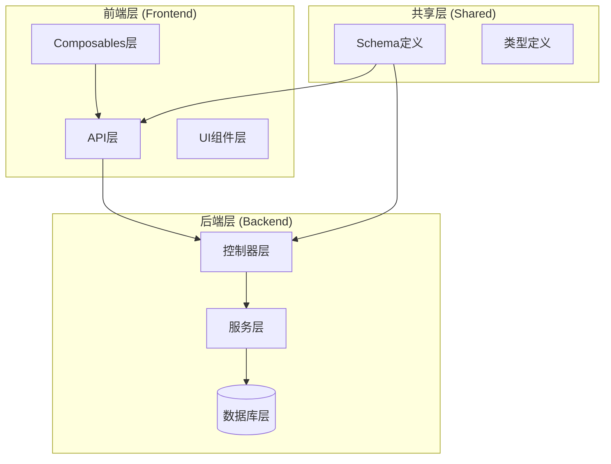
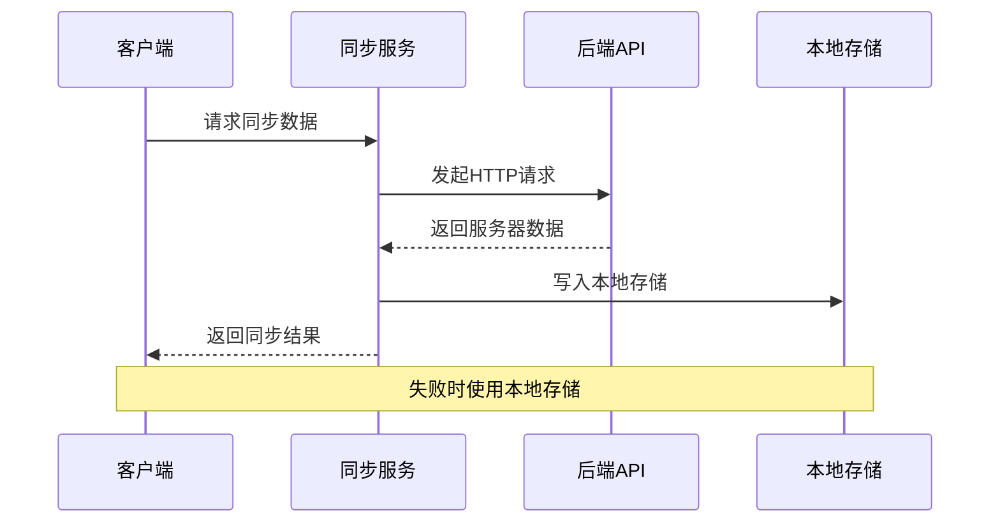
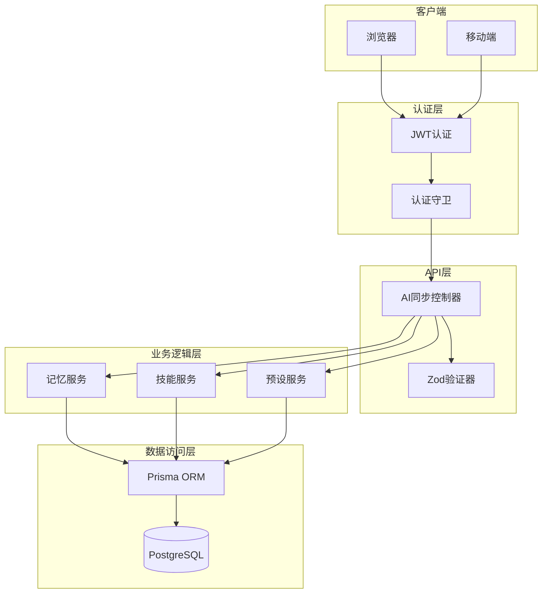
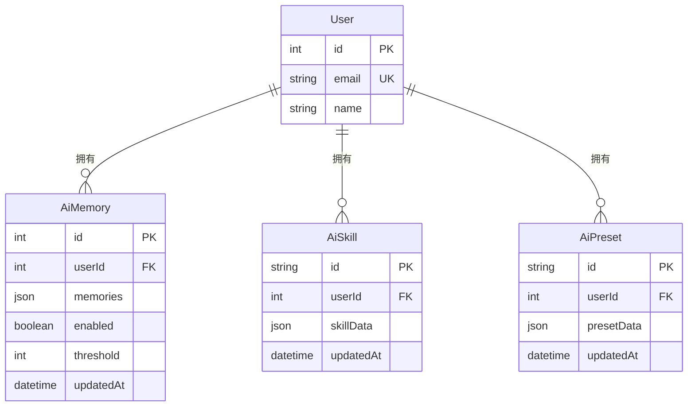
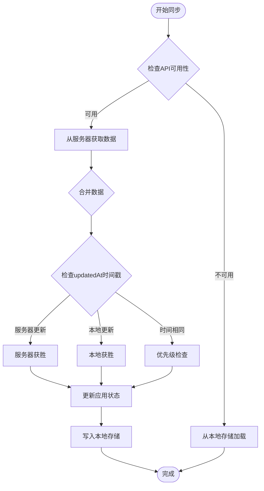
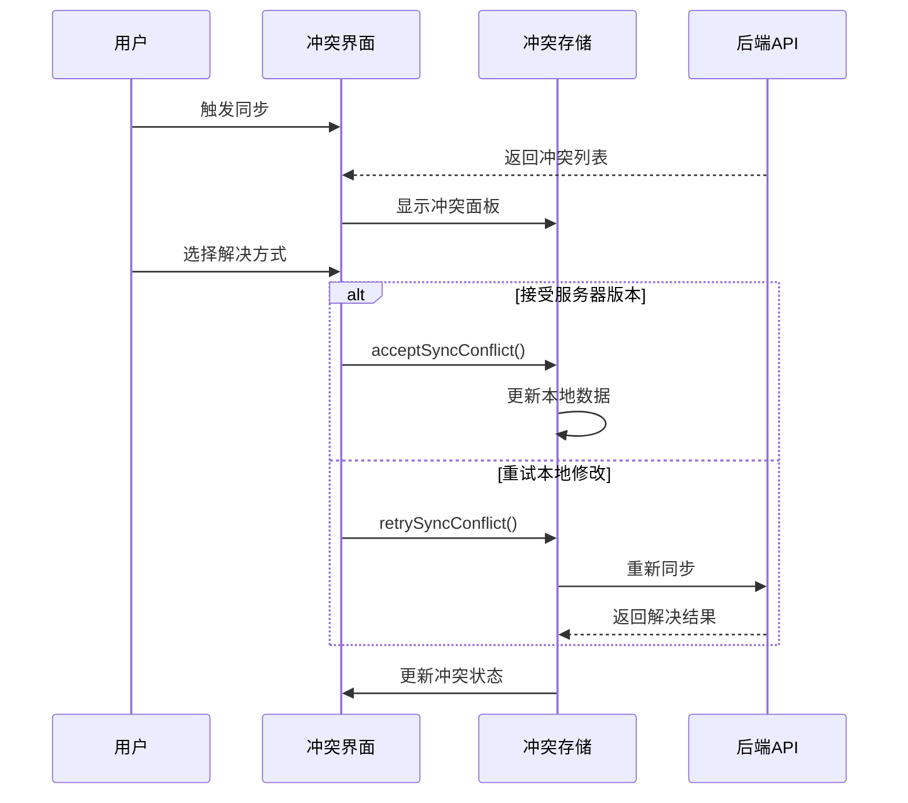
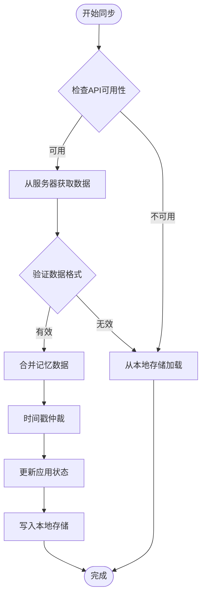
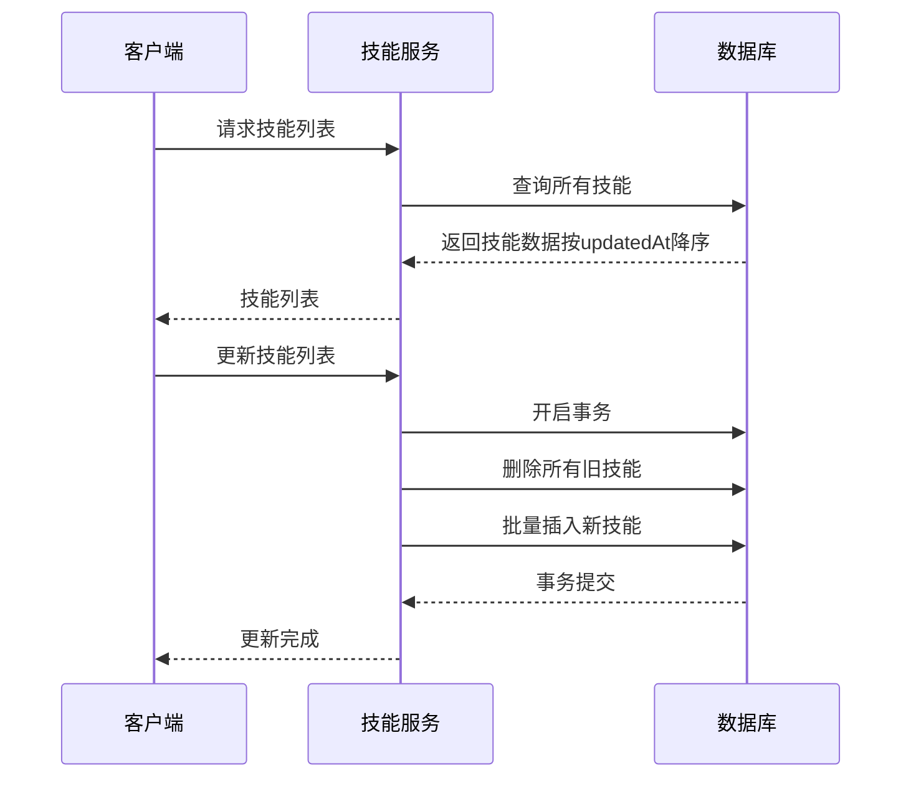
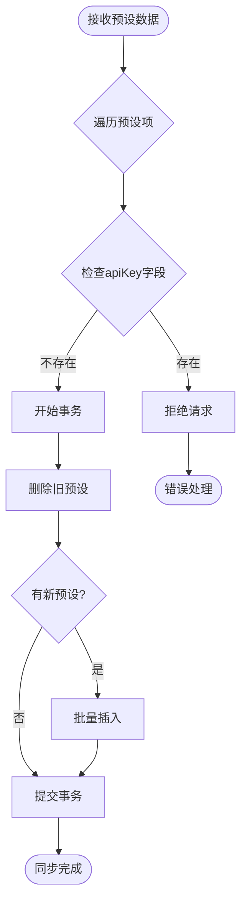
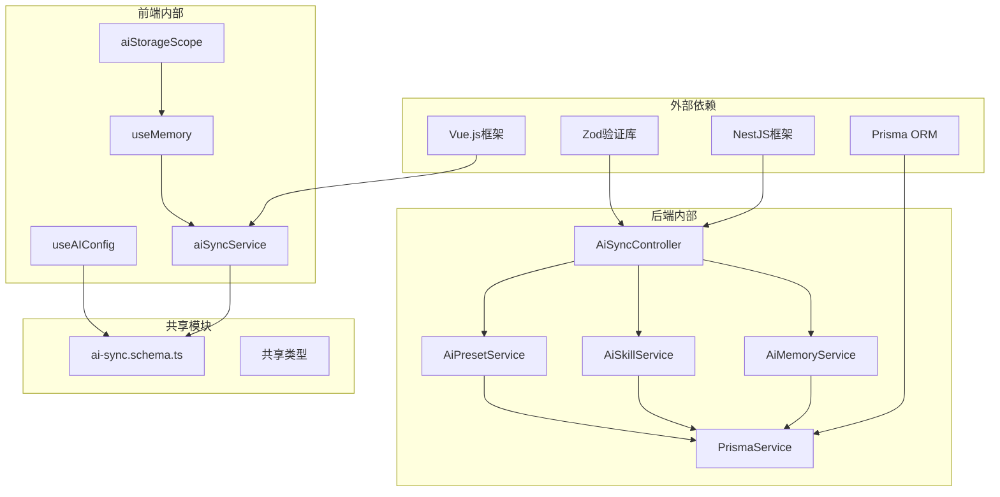

# AI数据同步系统

<cite>
**本文档引用的文件**
- [apps/backend/src/ai-sync/ai-sync.module.ts](file://apps/backend/src/ai-sync/ai-sync.module.ts)
- [apps/backend/src/ai-sync/ai-sync.controller.ts](file://apps/backend/src/ai-sync/ai-sync.controller.ts)
- [apps/backend/src/ai-sync/ai-memory.service.ts](file://apps/backend/src/ai-sync/ai-memory.service.ts)
- [apps/backend/src/ai-sync/ai-skill.service.ts](file://apps/backend/src/ai-sync/ai-skill.service.ts)
- [apps/backend/src/ai-sync/ai-preset.service.ts](file://apps/backend/src/ai-sync/ai-preset.service.ts)
- [apps/backend/prisma/schema/ai-sync.prisma](file://apps/backend/prisma/schema/ai-sync.prisma)
- [packages/shared/src/schemas/ai-sync.schema.ts](file://packages/shared/src/schemas/ai-sync.schema.ts)
- [apps/frontend/src/features/ai/services/aiSyncService.ts](file://apps/frontend/src/features/ai/services/aiSyncService.ts)
- [apps/frontend/src/features/ai/composables/useMemory.ts](file://apps/frontend/src/features/ai/composables/useMemory.ts)
- [apps/frontend/src/features/ai/composables/useAIPresetManager.ts](file://apps/frontend/src/features/ai/composables/useAIPresetManager.ts)
</cite>

## 更新摘要
**所做更改**
- 新增版本控制功能章节，详细说明基于 updatedAt 时间戳的冲突解决机制
- 更新数据模型设计，增加 updatedAt 字段的详细说明
- 新增冲突检测和仲裁策略章节，解释 VERSION_CONFLICT 冲突处理
- 更新前端同步策略，说明基于时间戳的合并算法
- 新增安全机制章节，说明版本控制对数据安全的增强作用

## 目录
1. [简介](#简介)
2. [项目结构](#项目结构)
3. [核心组件](#核心组件)
4. [架构概览](#架构概览)
5. [版本控制与冲突解决](#版本控制与冲突解决)
6. [详细组件分析](#详细组件分析)
7. [依赖关系分析](#依赖关系分析)
8. [性能考虑](#性能考虑)
9. [故障排除指南](#故障排除指南)
10. [结论](#结论)

## 简介

AI数据同步系统是一个基于NestJS和Vue.js构建的全栈应用，专门设计用于在用户设备间同步AI助手相关的配置数据。该系统实现了"服务器为真相"的同步策略，确保服务端数据作为权威来源，同时提供本地存储作为降级方案。

**更新** 系统现已新增版本控制功能，通过 updatedAt 时间戳实现精确的冲突检测和仲裁，支持本地和远程数据的智能合并。

系统主要同步三类AI数据：
- **记忆数据（Memories）**：用户AI助手的长期记忆内容
- **技能数据（Skills）**：AI助手的功能技能配置
- **预设数据（Presets）**：AI模型配置模板

该系统通过严格的隐私保护机制，确保敏感信息（如API密钥）不会被同步到服务器。

## 项目结构

AI数据同步系统采用分层架构设计，主要分为三个层次：

**图表来源**
- [apps/backend/src/ai-sync/ai-sync.module.ts:1-17](file://apps/backend/src/ai-sync/ai-sync.module.ts#L1-L17)
- [apps/frontend/src/features/ai/services/aiSyncService.ts:1-105](file://apps/frontend/src/features/ai/services/aiSyncService.ts#L1-L105)

**章节来源**
- [apps/backend/src/ai-sync/ai-sync.module.ts:1-17](file://apps/backend/src/ai-sync/ai-sync.module.ts#L1-L17)
- [apps/frontend/src/features/ai/services/aiSyncService.ts:1-105](file://apps/frontend/src/features/ai/services/aiSyncService.ts#L1-L105)

## 核心组件

### 后端核心组件

系统的核心由以下三个主要服务组成：

#### AI同步模块 (AiSyncModule)
负责注册和导出所有AI同步相关的服务组件，提供统一的依赖注入入口。

#### AI记忆服务 (AiMemoryService)
- **职责**：管理用户的AI记忆数据
- **数据特点**：每个用户仅有一条记录，支持整存整取操作
- **默认配置**：禁用状态、30的阈值设置
- **版本控制**：自动跟踪 updatedAt 时间戳

#### AI技能服务 (AiSkillService)
- **职责**：管理AI助手的技能配置
- **同步策略**：全量替换，先删除后批量创建
- **事务保证**：使用数据库事务确保原子性
- **版本控制**：按 updatedAt 降序排列，支持时间戳仲裁

#### AI预设服务 (AiPresetService)
- **职责**：管理AI模型配置模板
- **安全检查**：拒绝包含API密钥的预设数据
- **全量替换**：提供安全的数据同步机制
- **版本控制**：按 updatedAt 降序排列

**章节来源**
- [apps/backend/src/ai-sync/ai-sync.module.ts:1-17](file://apps/backend/src/ai-sync/ai-sync.module.ts#L1-L17)
- [apps/backend/src/ai-sync/ai-memory.service.ts:1-67](file://apps/backend/src/ai-sync/ai-memory.service.ts#L1-L67)
- [apps/backend/src/ai-sync/ai-skill.service.ts:1-50](file://apps/backend/src/ai-sync/ai-skill.service.ts#L1-L50)
- [apps/backend/src/ai-sync/ai-preset.service.ts:1-58](file://apps/backend/src/ai-sync/ai-preset.service.ts#L1-L58)

### 前端核心组件

#### AI同步服务 (aiSyncService)
实现"服务器为真相"的同步策略，提供HTTP接口封装：

**图表来源**
- [apps/frontend/src/features/ai/services/aiSyncService.ts:47-56](file://apps/frontend/src/features/ai/services/aiSyncService.ts#L47-L56)
- [apps/frontend/src/features/ai/services/aiSyncService.ts:64-78](file://apps/frontend/src/features/ai/services/aiSyncService.ts#L64-L78)

#### 记忆管理组合式函数 (useMemory)
负责AI记忆的完整生命周期管理：

- **数据规范化**：确保记忆内容格式正确
- **自动压缩**：根据阈值自动触发记忆压缩
- **去重处理**：防止重复记忆存储
- **双写机制**：同时更新服务器和本地存储
- **版本仲裁**：基于 updatedAt 时间戳进行冲突解决

**章节来源**
- [apps/frontend/src/features/ai/services/aiSyncService.ts:1-105](file://apps/frontend/src/features/ai/services/aiSyncService.ts#L1-L105)
- [apps/frontend/src/features/ai/composables/useMemory.ts:1-495](file://apps/frontend/src/features/ai/composables/useMemory.ts#L1-L495)

## 架构概览

系统采用RESTful API设计，遵循HTTP标准和JWT认证机制：

**图表来源**
- [apps/backend/src/ai-sync/ai-sync.controller.ts:1-84](file://apps/backend/src/ai-sync/ai-sync.controller.ts#L1-L84)
- [apps/backend/src/ai-sync/ai-memory.service.ts:1-67](file://apps/backend/src/ai-sync/ai-memory.service.ts#L1-L67)
- [apps/backend/src/ai-sync/ai-skill.service.ts:1-50](file://apps/backend/src/ai-sync/ai-skill.service.ts#L1-L50)
- [apps/backend/src/ai-sync/ai-preset.service.ts:1-58](file://apps/backend/src/ai-sync/ai-preset.service.ts#L1-L58)

## 版本控制与冲突解决

**新增** 系统现已实现基于 updatedAt 时间戳的版本控制系统，提供精确的冲突检测和仲裁机制。

### 版本控制机制

系统通过数据库的 @updatedAt 字段自动跟踪每条记录的最后修改时间，确保冲突检测的准确性：

**图表来源**
- [apps/backend/prisma/schema/ai-sync.prisma:5-39](file://apps/backend/prisma/schema/ai-sync.prisma#L5-L39)

### 冲突检测策略

系统实现了三种类型的冲突检测，基于 updatedAt 时间戳进行仲裁：

#### 版本冲突 (VERSION_CONFLICT)
当本地记录的 updatedAt 与服务器记录不一致时触发：
- 服务器端严格比较客户端版本号
- 如果版本不匹配，返回 VERSION_CONFLICT 冲突
- 前端提供接受服务器版本或重试本地修改的选择

#### 拥有者冲突 (OWNER_MISMATCH)
当记录属于其他用户时触发：
- 服务器端验证记录的所有权
- 返回 OWNER_MISMATCH 冲突
- 前端自动清理冲突记录

#### 删除标记冲突 (TOMBSTONED)
当记录已被删除时触发：
- 服务器端检测删除状态
- 返回 TOMBSTONED 冲突
- 前端同步删除本地记录

### 前端合并策略

前端实现了基于时间戳的智能合并算法：

**图表来源**
- [apps/frontend/src/features/ai/services/aiSyncService.ts:380-413](file://apps/frontend/src/features/ai/services/aiSyncService.ts#L380-L413)
- [apps/frontend/src/features/ai/composables/useMemory.ts:388-393](file://apps/frontend/src/features/ai/composables/useMemory.ts#L388-L393)

### 冲突解决流程

系统提供了完整的冲突解决界面和操作流程：

**图表来源**
- [apps/frontend/src/features/todo/stores/todo.cloud.conflicts.ts:33-83](file://apps/frontend/src/features/todo/stores/todo.cloud.conflicts.ts#L33-L83)

**章节来源**
- [apps/backend/prisma/schema/ai-sync.prisma:1-39](file://apps/backend/prisma/schema/ai-sync.prisma#L1-L39)
- [packages/shared/src/schemas/ai-sync.schema.ts:1-71](file://packages/shared/src/schemas/ai-sync.schema.ts#L1-L71)
- [apps/frontend/src/features/ai/services/aiSyncService.ts:380-413](file://apps/frontend/src/features/ai/services/aiSyncService.ts#L380-L413)
- [apps/frontend/src/features/ai/composables/useMemory.ts:388-393](file://apps/frontend/src/features/ai/composables/useMemory.ts#L388-L393)

## 详细组件分析

### 数据模型设计

系统使用Prisma ORM定义了三个核心数据模型，每个模型都针对特定的AI数据类型进行了优化：

**图表来源**
- [apps/backend/prisma/schema/ai-sync.prisma:5-39](file://apps/backend/prisma/schema/ai-sync.prisma#L5-L39)

#### 记忆数据模型 (AiMemory)
- **存储格式**：JSON数组，存储字符串形式的记忆内容
- **约束条件**：最多100条记忆，每条最多200字符
- **默认值**：启用状态为true，阈值为30
- **版本控制**：自动跟踪 updatedAt 时间戳

#### 技能数据模型 (AiSkill)
- **存储格式**：完整技能对象的JSON表示
- **字段过滤**：不包含runtime相关的运行时秘密信息
- **索引优化**：对userId建立索引以提高查询性能
- **排序机制**：按 updatedAt 降序排列

#### 预设数据模型 (AiPreset)
- **存储格式**：预设配置的骨架JSON
- **安全过滤**：明确排除apiKey字段
- **枚举类型**：支持多种小说类型选项
- **排序机制**：按 updatedAt 降序排列

**章节来源**
- [apps/backend/prisma/schema/ai-sync.prisma:1-39](file://apps/backend/prisma/schema/ai-sync.prisma#L1-L39)

### 同步策略实现

系统实现了三种不同的同步策略，针对不同类型的数据特性：

#### 记忆数据同步流程

**图表来源**
- [apps/frontend/src/features/ai/services/aiSyncService.ts:380-413](file://apps/frontend/src/features/ai/services/aiSyncService.ts#L380-L413)
- [apps/frontend/src/features/ai/composables/useMemory.ts:363-373](file://apps/frontend/src/features/ai/composables/useMemory.ts#L363-L373)

#### 技能数据同步流程

技能数据采用全量替换策略，确保数据一致性：

**图表来源**
- [apps/backend/src/ai-sync/ai-skill.service.ts:16-27](file://apps/backend/src/ai-sync/ai-skill.service.ts#L16-L27)

#### 预设数据同步流程

预设数据同步包含严格的安全检查机制：

**图表来源**
- [apps/backend/src/ai-sync/ai-preset.service.ts:33-56](file://apps/backend/src/ai-sync/ai-preset.service.ts#L33-L56)

**章节来源**
- [apps/frontend/src/features/ai/services/aiSyncService.ts:1-105](file://apps/frontend/src/features/ai/services/aiSyncService.ts#L1-L105)
- [apps/backend/src/ai-sync/ai-skill.service.ts:1-50](file://apps/backend/src/ai-sync/ai-skill.service.ts#L1-L50)
- [apps/backend/src/ai-sync/ai-preset.service.ts:1-58](file://apps/backend/src/ai-sync/ai-preset.service.ts#L1-L58)

### 安全机制设计

系统实施了多层次的安全保护机制：

#### 数据过滤策略
- **技能数据**：自动剥离runtime相关字段
- **预设数据**：严格禁止apiKey字段传输
- **记忆数据**：仅同步非敏感的字符串内容

#### 认证授权机制
- **JWT认证**：所有API端点都需要有效的JWT令牌
- **守卫机制**：使用JwtAuthGuard确保请求合法性
- **装饰器应用**：通过@ApiBearerAuth装饰器标识认证需求

#### 错误处理策略
- **API降级**：网络异常时自动回退到本地存储
- **静默失败**：写入失败时不中断用户体验
- **数据验证**：使用Zod进行严格的输入验证

#### 版本控制增强安全
- **时间戳仲裁**：精确的冲突检测机制
- **版本跟踪**：防止客户端时钟漂移影响
- **原子性保证**：数据库事务确保数据一致性

**章节来源**
- [apps/backend/src/ai-sync/ai-sync.controller.ts:1-84](file://apps/backend/src/ai-sync/ai-sync.controller.ts#L1-L84)
- [packages/shared/src/schemas/ai-sync.schema.ts:1-71](file://packages/shared/src/schemas/ai-sync.schema.ts#L1-L71)

## 依赖关系分析

系统各组件之间的依赖关系清晰明确，遵循依赖倒置原则：

**图表来源**
- [apps/backend/src/ai-sync/ai-sync.controller.ts:1-84](file://apps/backend/src/ai-sync/ai-sync.controller.ts#L1-L84)
- [apps/frontend/src/features/ai/services/aiSyncService.ts:1-105](file://apps/frontend/src/features/ai/services/aiSyncService.ts#L1-L105)

**章节来源**
- [apps/backend/src/ai-sync/ai-sync.controller.ts:1-84](file://apps/backend/src/ai-sync/ai-sync.controller.ts#L1-L84)
- [apps/frontend/src/features/ai/services/aiSyncService.ts:1-105](file://apps/frontend/src/features/ai/services/aiSyncService.ts#L1-L105)

## 性能考虑

### 数据库优化
- **索引策略**：在userId字段上建立索引以优化查询性能
- **事务处理**：使用数据库事务确保数据一致性
- **批量操作**：采用批量插入减少数据库往返次数
- **时间戳索引**：updatedAt 字段支持高效的排序和查询

### 缓存策略
- **本地存储**：使用localStorage作为降级缓存
- **双写机制**：同时更新服务器和本地存储
- **事件监听**：监听存储变化实现实时同步

### 网络优化
- **错误重试**：网络异常时自动重试机制
- **超时控制**：合理的请求超时设置
- **数据压缩**：传输前进行必要的数据压缩

### 版本控制性能
- **时间戳比较**：O(1)时间复杂度的冲突检测
- **降序排列**：优化的查询性能
- **原子操作**：减少并发冲突的可能性

## 故障排除指南

### 常见问题及解决方案

#### 同步失败问题
**症状**：数据无法从服务器同步
**可能原因**：
- 网络连接异常
- JWT令牌过期
- 服务器端数据验证失败

**解决步骤**：
1. 检查网络连接状态
2. 验证JWT令牌有效性
3. 查看服务器端日志
4. 确认数据格式符合Schema要求

#### 数据丢失问题
**症状**：用户数据在切换设备后丢失
**可能原因**：
- 本地存储空间不足
- 浏览器隐私设置阻止存储
- 同步流程中的异常

**解决步骤**：
1. 检查浏览器存储权限
2. 清理浏览器缓存
3. 验证服务器端数据完整性
4. 重新登录账户

#### 性能问题
**症状**：同步响应缓慢
**可能原因**：
- 数据量过大
- 网络延迟高
- 数据库查询性能问题

**解决步骤**：
1. 分析数据大小和数量
2. 优化网络连接
3. 检查数据库索引
4. 实施分页加载策略

#### 冲突解决问题
**症状**：版本冲突无法解决
**可能原因**：
- 客户端时钟不同步
- 服务器时间戳异常
- 冲突解决逻辑错误

**解决步骤**：
1. 检查系统时间和时区设置
2. 验证服务器时间同步
3. 查看冲突日志和错误信息
4. 手动执行冲突解决操作

**章节来源**
- [apps/frontend/src/features/ai/services/aiSyncService.ts:24-39](file://apps/frontend/src/features/ai/services/aiSyncService.ts#L24-L39)
- [apps/backend/src/ai-sync/ai-preset.service.ts:34-39](file://apps/backend/src/ai-sync/ai-preset.service.ts#L34-L39)

## 结论

AI数据同步系统通过精心设计的架构和严格的安全机制，成功实现了跨设备的AI助手数据同步功能。系统的主要优势包括：

### 技术优势
- **架构清晰**：分层设计便于维护和扩展
- **安全可靠**：多层安全防护确保数据安全
- **性能优秀**：优化的数据库设计和缓存策略
- **用户体验**：智能的降级机制保证服务连续性
- **版本控制**：精确的冲突检测和仲裁机制

### 设计亮点
- **服务器为真相**：确保数据一致性
- **隐私保护**：敏感信息严格隔离
- **容错机制**：完善的错误处理和降级策略
- **标准化接口**：清晰的API设计和类型定义
- **智能合并**：基于时间戳的冲突解决算法

### 应用价值
该系统为AI助手应用提供了可靠的跨设备数据同步能力，支持用户在不同设备间无缝使用AI功能，同时确保用户隐私和数据安全。通过模块化的架构设计，系统具备良好的可扩展性和维护性，能够适应未来功能扩展和技术演进的需求。

**更新** 新增的版本控制功能进一步增强了系统的可靠性，通过精确的时间戳仲裁机制，有效解决了多设备并发修改导致的数据冲突问题，为用户提供了更加稳定和一致的使用体验。