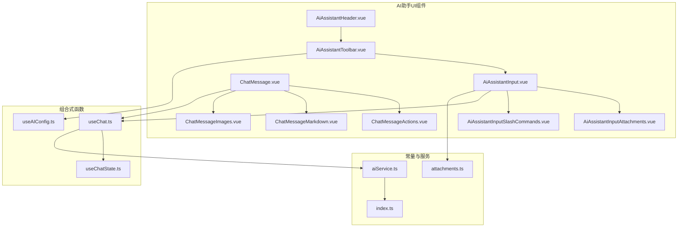
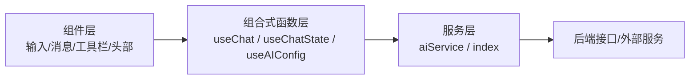
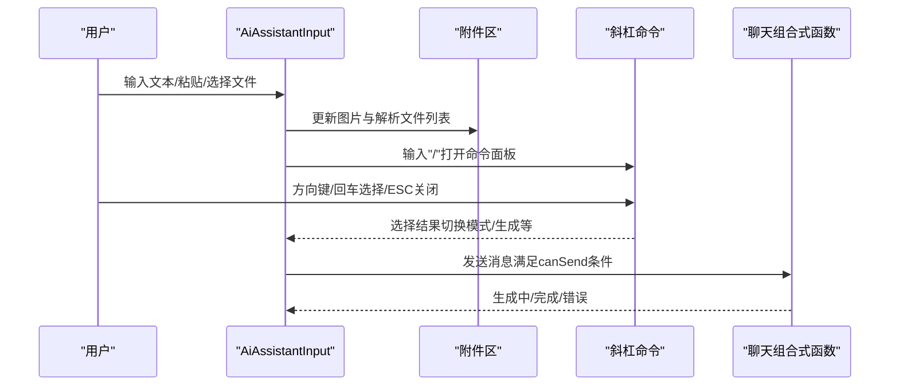
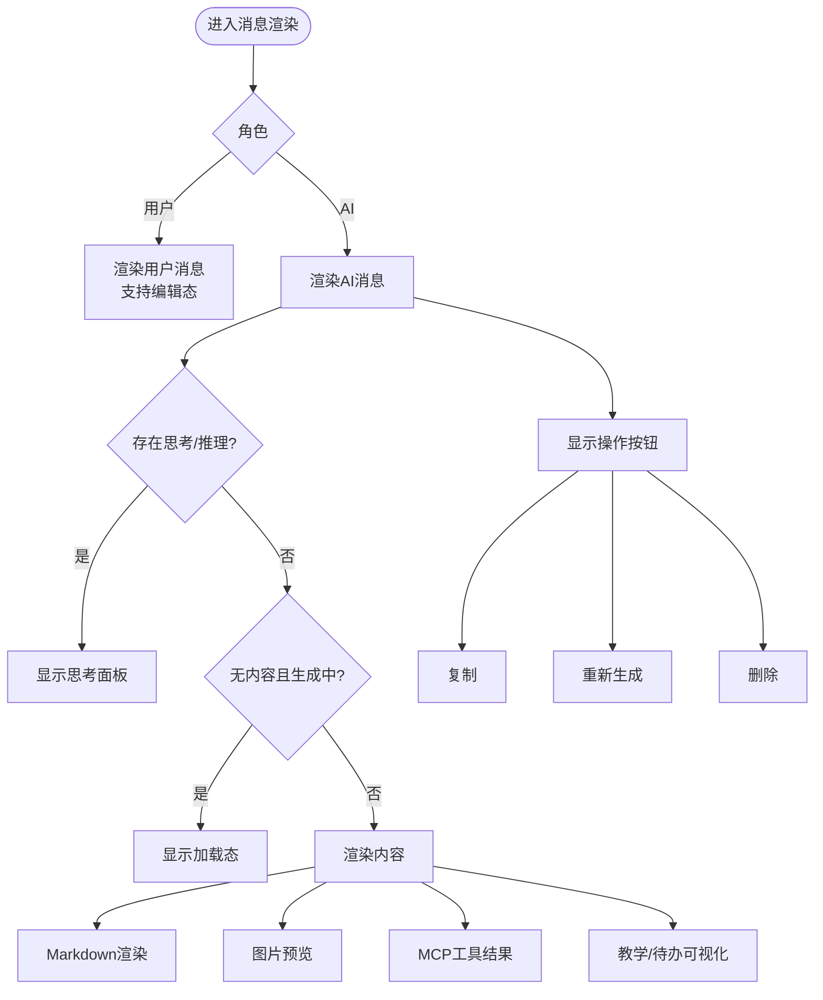
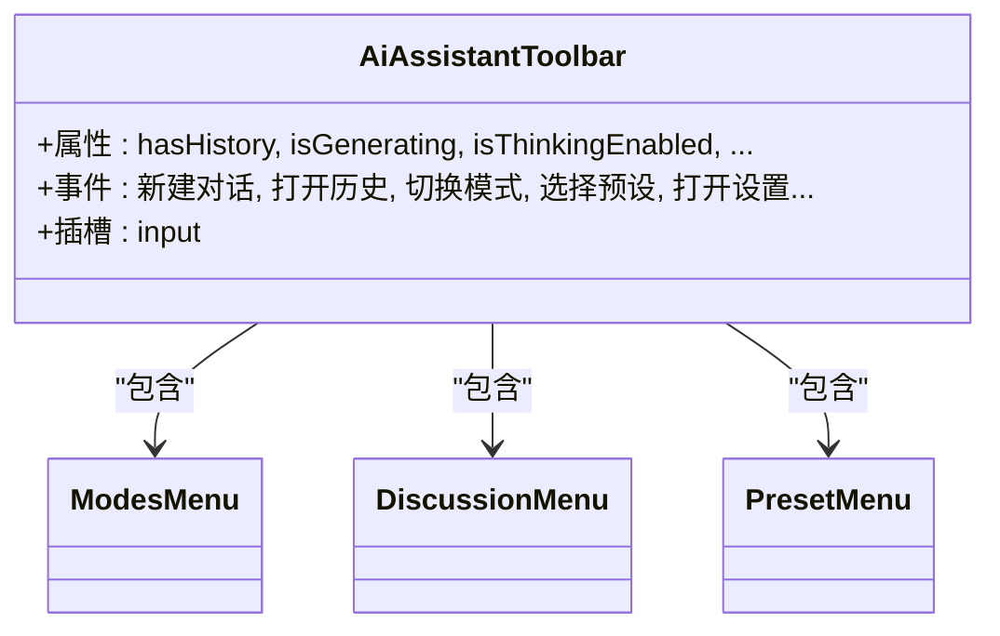
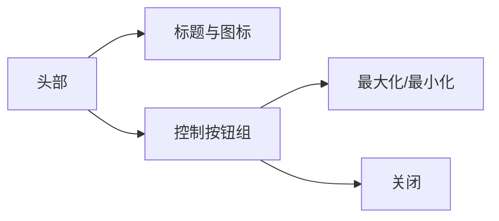
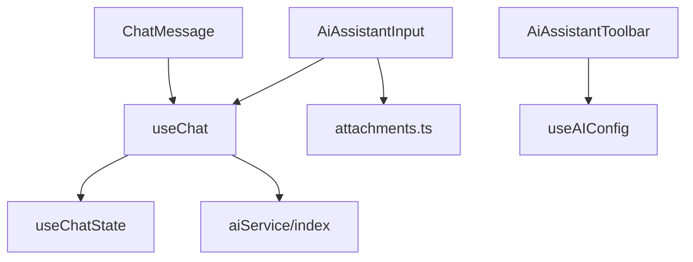

# UI组件

<cite>
**本文档引用的文件**
- [AiAssistantInput.vue](file://apps/frontend/src/features/ai/components/AiAssistantInput.vue)
- [AiAssistantInputAttachments.vue](file://apps/frontend/src/features/ai/components/AiAssistantInputAttachments.vue)
- [AiAssistantInputSlashCommands.vue](file://apps/frontend/src/features/ai/components/AiAssistantInputSlashCommands.vue)
- [ChatMessage.vue](file://apps/frontend/src/features/ai/components/ChatMessage.vue)
- [ChatMessageActions.vue](file://apps/frontend/src/features/ai/components/ChatMessageActions.vue)
- [ChatMessageMarkdown.vue](file://apps/frontend/src/features/ai/components/ChatMessageMarkdown.vue)
- [ChatMessageImages.vue](file://apps/frontend/src/features/ai/components/ChatMessageImages.vue)
- [AiAssistantToolbar.vue](file://apps/frontend/src/features/ai/components/AiAssistantToolbar.vue)
- [AiAssistantHeader.vue](file://apps/frontend/src/features/ai/components/AiAssistantHeader.vue)
- [useChat.ts](file://apps/frontend/src/features/ai/composables/useChat.ts)
- [useChatState.ts](file://apps/frontend/src/features/ai/composables/useChatState.ts)
- [useAIConfig.ts](file://apps/frontend/src/features/ai/composables/useAIConfig.ts)
- [attachments.ts](file://apps/frontend/src/features/ai/constants/attachments.ts)
- [aiService.ts](file://apps/frontend/src/features/ai/services/aiService.ts)
- [index.ts](file://apps/frontend/src/features/ai/services/index.ts)
</cite>

## 目录
1. [简介](#简介)
2. [项目结构](#项目结构)
3. [核心组件](#核心组件)
4. [架构总览](#架构总览)
5. [组件详解](#组件详解)
6. [依赖关系分析](#依赖关系分析)
7. [性能考量](#性能考量)
8. [故障排查指南](#故障排查指南)
9. [结论](#结论)
10. [附录](#附录)

## 简介
本文件面向AI助手的UI组件系统，聚焦以下目标：
- 深入介绍各组件的设计理念、交互模式与状态管理
- 重点阐述 AiAssistantInput 的多模态输入、文件上传处理与快捷键绑定
- 解释 ChatMessage 的消息渲染、富文本显示与交互操作
- 覆盖工具栏组件的功能按钮、状态指示与用户反馈机制
- 说明头部组件的标题显示、最大化控制与关闭操作
- 提供可定制样式、扩展能力与特殊场景处理建议
- 包含响应式设计、无障碍访问与性能优化建议

## 项目结构
AI助手UI组件位于前端应用的特性目录下，围绕“聊天”“输入”“工具栏”“头部”等模块组织，配合组合式函数与服务层实现状态管理与业务逻辑。

图表来源
- [AiAssistantHeader.vue:1-68](file://apps/frontend/src/features/ai/components/AiAssistantHeader.vue#L1-L68)
- [AiAssistantToolbar.vue:1-342](file://apps/frontend/src/features/ai/components/AiAssistantToolbar.vue#L1-L342)
- [AiAssistantInput.vue:1-329](file://apps/frontend/src/features/ai/components/AiAssistantInput.vue#L1-L329)
- [AiAssistantInputAttachments.vue:1-72](file://apps/frontend/src/features/ai/components/AiAssistantInputAttachments.vue#L1-L72)
- [AiAssistantInputSlashCommands.vue:1-74](file://apps/frontend/src/features/ai/components/AiAssistantInputSlashCommands.vue#L1-L74)
- [ChatMessage.vue:1-411](file://apps/frontend/src/features/ai/components/ChatMessage.vue#L1-L411)
- [ChatMessageActions.vue:1-85](file://apps/frontend/src/features/ai/components/ChatMessageActions.vue#L1-L85)
- [ChatMessageMarkdown.vue:1-62](file://apps/frontend/src/features/ai/components/ChatMessageMarkdown.vue#L1-L62)
- [ChatMessageImages.vue:1-47](file://apps/frontend/src/features/ai/components/ChatMessageImages.vue#L1-L47)
- [useChat.ts:1-136](file://apps/frontend/src/features/ai/composables/useChat.ts#L1-L136)
- [useChatState.ts:1-144](file://apps/frontend/src/features/ai/composables/useChatState.ts#L1-L144)
- [useAIConfig.ts:1-800](file://apps/frontend/src/features/ai/composables/useAIConfig.ts#L1-L800)
- [attachments.ts:1-69](file://apps/frontend/src/features/ai/constants/attachments.ts#L1-L69)
- [aiService.ts:1-6](file://apps/frontend/src/features/ai/services/aiService.ts#L1-L6)
- [index.ts:1-9](file://apps/frontend/src/features/ai/services/index.ts#L1-L9)

章节来源
- [AiAssistantHeader.vue:1-68](file://apps/frontend/src/features/ai/components/AiAssistantHeader.vue#L1-L68)
- [AiAssistantToolbar.vue:1-342](file://apps/frontend/src/features/ai/components/AiAssistantToolbar.vue#L1-L342)
- [AiAssistantInput.vue:1-329](file://apps/frontend/src/features/ai/components/AiAssistantInput.vue#L1-L329)
- [ChatMessage.vue:1-411](file://apps/frontend/src/features/ai/components/ChatMessage.vue#L1-L411)
- [useChat.ts:1-136](file://apps/frontend/src/features/ai/composables/useChat.ts#L1-L136)
- [useChatState.ts:1-144](file://apps/frontend/src/features/ai/composables/useChatState.ts#L1-L144)
- [useAIConfig.ts:1-800](file://apps/frontend/src/features/ai/composables/useAIConfig.ts#L1-L800)
- [attachments.ts:1-69](file://apps/frontend/src/features/ai/constants/attachments.ts#L1-L69)
- [aiService.ts:1-6](file://apps/frontend/src/features/ai/services/aiService.ts#L1-L6)
- [index.ts:1-9](file://apps/frontend/src/features/ai/services/index.ts#L1-L9)

## 核心组件
- 输入组件：AiAssistantInput 负责多模态输入、快捷命令面板、文件附件、自动高度与发送控制
- 消息组件：ChatMessage 负责消息气泡、富文本渲染、思考/加载态、工具结果、教学/待办可视化等
- 工具栏组件：AiAssistantToolbar 负责模式切换、讨论菜单、预设选择、设置入口与快捷反馈
- 头部组件：AiAssistantHeader 负责标题、最大化/最小化与关闭操作
- 附件子组件：AiAssistantInputAttachments 展示图片与解析文件列表
- 快捷命令子组件：AiAssistantInputSlashCommands 提供斜杠命令面板
- 消息操作子组件：ChatMessageActions 提供复制、重新生成、删除等操作
- 富文本子组件：ChatMessageMarkdown 负责Markdown渲染与交互注入
- 图片子组件：ChatMessageImages 负责图片预览与点击放大

章节来源
- [AiAssistantInput.vue:1-329](file://apps/frontend/src/features/ai/components/AiAssistantInput.vue#L1-L329)
- [ChatMessage.vue:1-411](file://apps/frontend/src/features/ai/components/ChatMessage.vue#L1-L411)
- [AiAssistantToolbar.vue:1-342](file://apps/frontend/src/features/ai/components/AiAssistantToolbar.vue#L1-L342)
- [AiAssistantHeader.vue:1-68](file://apps/frontend/src/features/ai/components/AiAssistantHeader.vue#L1-L68)
- [AiAssistantInputAttachments.vue:1-72](file://apps/frontend/src/features/ai/components/AiAssistantInputAttachments.vue#L1-L72)
- [AiAssistantInputSlashCommands.vue:1-74](file://apps/frontend/src/features/ai/components/AiAssistantInputSlashCommands.vue#L1-L74)
- [ChatMessageActions.vue:1-85](file://apps/frontend/src/features/ai/components/ChatMessageActions.vue#L1-L85)
- [ChatMessageMarkdown.vue:1-62](file://apps/frontend/src/features/ai/components/ChatMessageMarkdown.vue#L1-L62)
- [ChatMessageImages.vue:1-47](file://apps/frontend/src/features/ai/components/ChatMessageImages.vue#L1-L47)

## 架构总览
AI助手UI采用“组件-组合式函数-服务层”的分层架构：
- 组件层：负责视图与交互
- 组合式函数层：useChat/useChatState/useAIConfig 管理状态与动作
- 服务层：aiService/index 提供统一入口与工具方法

图表来源
- [useChat.ts:1-136](file://apps/frontend/src/features/ai/composables/useChat.ts#L1-L136)
- [useChatState.ts:1-144](file://apps/frontend/src/features/ai/composables/useChatState.ts#L1-L144)
- [useAIConfig.ts:1-800](file://apps/frontend/src/features/ai/composables/useAIConfig.ts#L1-L800)
- [aiService.ts:1-6](file://apps/frontend/src/features/ai/services/aiService.ts#L1-L6)
- [index.ts:1-9](file://apps/frontend/src/features/ai/services/index.ts#L1-L9)

## 组件详解

### AiAssistantInput 输入组件
设计理念
- 多模态输入：支持文本、图片、文档等附件；通过附件区与快捷命令提升输入效率
- 自适应高度：根据内容动态调整textarea高度，移动端与桌面端差异化适配
- 快捷命令：斜杠“/”触发命令面板，支持上下导航、回车选择与ESC关闭
- 文件上传：受控于最大附件数量与类型限制，支持粘贴、点击触发与拖拽扩展

交互与状态
- 输入值 modelValue 双向绑定，发送按钮根据“是否有内容/图片/已完成解析文件”启用
- 生成中禁用发送，避免并发请求
- 附件区展示图片缩略图与解析文件状态（解析中/错误/完成），支持移除
- 快捷命令面板根据当前模式状态高亮激活项

快捷键绑定
- “/” 触发命令面板，支持方向键上下移动、回车选择、ESC关闭、退格在起始位置关闭
- Enter 发送（移动端禁用，Shift+Enter 插入换行）

文件上传处理
- 接受类型由常量定义，限制单文件大小与总附件数
- 支持解析中的文件状态展示与错误提示
- 通过事件向上抛出文件变更与粘贴事件

图表来源
- [AiAssistantInput.vue:1-329](file://apps/frontend/src/features/ai/components/AiAssistantInput.vue#L1-L329)
- [AiAssistantInputAttachments.vue:1-72](file://apps/frontend/src/features/ai/components/AiAssistantInputAttachments.vue#L1-L72)
- [AiAssistantInputSlashCommands.vue:1-74](file://apps/frontend/src/features/ai/components/AiAssistantInputSlashCommands.vue#L1-L74)
- [useChat.ts:1-136](file://apps/frontend/src/features/ai/composables/useChat.ts#L1-L136)

章节来源
- [AiAssistantInput.vue:1-329](file://apps/frontend/src/features/ai/components/AiAssistantInput.vue#L1-L329)
- [AiAssistantInputAttachments.vue:1-72](file://apps/frontend/src/features/ai/components/AiAssistantInputAttachments.vue#L1-L72)
- [AiAssistantInputSlashCommands.vue:1-74](file://apps/frontend/src/features/ai/components/AiAssistantInputSlashCommands.vue#L1-L74)
- [attachments.ts:1-69](file://apps/frontend/src/features/ai/constants/attachments.ts#L1-L69)

### ChatMessage 消息组件
设计理念
- 消息气泡：区分用户与AI，支持编辑态、思考态、加载态与内容态
- 富文本渲染：Markdown渲染与代码交互注入，支持选中提问与转移
- 多媒体支持：图片预览与点击放大，支持生成中图片的加载态
- 教学与待办：教学测验面板、学习评估、待办可视化骨架屏
- 工具结果：MCP工具结果的合并与展示

交互与状态
- 用户消息支持编辑（保存/取消），AI消息支持复制、重新生成、删除
- 思考态/加载态与内容态互斥切换，生成中显示辅助面板
- 结构化块警告与待办/测验生成骨架屏提示
- 图片预览通过组合式函数管理预览URL与开关

图表来源
- [ChatMessage.vue:1-411](file://apps/frontend/src/features/ai/components/ChatMessage.vue#L1-L411)
- [ChatMessageMarkdown.vue:1-62](file://apps/frontend/src/features/ai/components/ChatMessageMarkdown.vue#L1-L62)
- [ChatMessageImages.vue:1-47](file://apps/frontend/src/features/ai/components/ChatMessageImages.vue#L1-L47)
- [ChatMessageActions.vue:1-85](file://apps/frontend/src/features/ai/components/ChatMessageActions.vue#L1-L85)
- [useChat.ts:1-136](file://apps/frontend/src/features/ai/composables/useChat.ts#L1-L136)

章节来源
- [ChatMessage.vue:1-411](file://apps/frontend/src/features/ai/components/ChatMessage.vue#L1-L411)
- [ChatMessageMarkdown.vue:1-62](file://apps/frontend/src/features/ai/components/ChatMessageMarkdown.vue#L1-L62)
- [ChatMessageImages.vue:1-47](file://apps/frontend/src/features/ai/components/ChatMessageImages.vue#L1-L47)
- [ChatMessageActions.vue:1-85](file://apps/frontend/src/features/ai/components/ChatMessageActions.vue#L1-L85)
- [useChat.ts:1-136](file://apps/frontend/src/features/ai/composables/useChat.ts#L1-L136)

### 工具栏组件
功能与状态
- 快捷操作：新建对话、历史记录、文件上传、停止生成/上一回话
- 模式开关：思考模式、教学模式、待办助手、图像生成功能
- 讨论菜单：主/辅模型选择、讨论开关
- 预设管理：当前预设名称、预设列表、打开预设设置
- 设置入口：打开设置页的不同标签
- 用户反馈：按钮禁用态、激活态高亮、容器级滚动遮罩与动画

响应式与无障碍
- 容器查询与滚动遮罩，移动端隐藏文字仅保留图标
- 按钮hover/active状态与键盘可达性

图表来源
- [AiAssistantToolbar.vue:1-342](file://apps/frontend/src/features/ai/components/AiAssistantToolbar.vue#L1-L342)

章节来源
- [AiAssistantToolbar.vue:1-342](file://apps/frontend/src/features/ai/components/AiAssistantToolbar.vue#L1-L342)
- [useAIConfig.ts:1-800](file://apps/frontend/src/features/ai/composables/useAIConfig.ts#L1-L800)

### 头部组件
功能与状态
- 标题显示：品牌标识与标题文案
- 控制按钮：最大化/最小化（非移动端）、关闭
- 平台适配：桌面端（Wails）支持拖拽与系统样式，移动端隐藏最大化按钮

图表来源
- [AiAssistantHeader.vue:1-68](file://apps/frontend/src/features/ai/components/AiAssistantHeader.vue#L1-L68)

章节来源
- [AiAssistantHeader.vue:1-68](file://apps/frontend/src/features/ai/components/AiAssistantHeader.vue#L1-L68)

## 依赖关系分析
- 组件间依赖
  - AiAssistantInput 依赖附件与斜杠命令子组件，并与 useChat 协同
  - ChatMessage 依赖 Markdown、图片、操作等子组件，并与 useChat 协同
  - 工具栏依赖模式/讨论/预设菜单子组件，并与 useAIConfig 协同
- 组合式函数依赖
  - useChat 聚合 useChatState 与 useChatActions，连接 aiService
  - useChatState 管理会话与流式状态
  - useAIConfig 管理配置、预设与思考模式
- 常量与服务
  - attachments.ts 定义上传接受类型与限制
  - aiService/index 提供统一服务入口

图表来源
- [AiAssistantInput.vue:1-329](file://apps/frontend/src/features/ai/components/AiAssistantInput.vue#L1-L329)
- [ChatMessage.vue:1-411](file://apps/frontend/src/features/ai/components/ChatMessage.vue#L1-L411)
- [AiAssistantToolbar.vue:1-342](file://apps/frontend/src/features/ai/components/AiAssistantToolbar.vue#L1-L342)
- [useChat.ts:1-136](file://apps/frontend/src/features/ai/composables/useChat.ts#L1-L136)
- [useChatState.ts:1-144](file://apps/frontend/src/features/ai/composables/useChatState.ts#L1-L144)
- [useAIConfig.ts:1-800](file://apps/frontend/src/features/ai/composables/useAIConfig.ts#L1-L800)
- [attachments.ts:1-69](file://apps/frontend/src/features/ai/constants/attachments.ts#L1-L69)
- [aiService.ts:1-6](file://apps/frontend/src/features/ai/services/aiService.ts#L1-L6)
- [index.ts:1-9](file://apps/frontend/src/features/ai/services/index.ts#L1-L9)

章节来源
- [useChat.ts:1-136](file://apps/frontend/src/features/ai/composables/useChat.ts#L1-L136)
- [useChatState.ts:1-144](file://apps/frontend/src/features/ai/composables/useChatState.ts#L1-L144)
- [useAIConfig.ts:1-800](file://apps/frontend/src/features/ai/composables/useAIConfig.ts#L1-L800)
- [attachments.ts:1-69](file://apps/frontend/src/features/ai/constants/attachments.ts#L1-L69)
- [aiService.ts:1-6](file://apps/frontend/src/features/ai/services/aiService.ts#L1-L6)
- [index.ts:1-9](file://apps/frontend/src/features/ai/services/index.ts#L1-L9)

## 性能考量
- 渲染优化
  - ChatMessage 使用过渡与条件渲染减少不必要的DOM更新
  - Markdown渲染按需注入，避免在流式过程中频繁重排
- 交互优化
  - 输入组件使用ResizeObserver与requestAnimationFrame稳定高度计算
  - 工具栏容器查询与滚动遮罩减少布局抖动
- 状态管理
  - useChatState集中管理流式状态，避免跨组件重复计算
  - useChat聚合消息列表与流式解析，减少重复订阅
- 上传与解析
  - 严格限制文件大小与总数，避免内存压力
  - 解析状态（解析中/错误/完成）即时反馈，降低等待焦虑

[本节为通用指导，无需列出具体文件来源]

## 故障排查指南
- 输入组件无法发送
  - 检查生成中状态与canSend条件（文本/图片/解析完成文件）
  - 确认移动端Enter行为被禁用
- 附件无法上传
  - 检查文件类型与大小限制
  - 确认总附件数未超过上限
- 快捷命令不显示
  - 确认输入框为空且输入“/”
  - 检查命令面板点击外部关闭逻辑
- 消息操作无效
  - 确认消息非生成中且非工具结果
  - 检查剪贴板权限与浏览器兼容性
- 工具栏按钮禁用
  - 检查生成中状态与历史记录可用性
  - 确认附件数量达到上限

章节来源
- [AiAssistantInput.vue:1-329](file://apps/frontend/src/features/ai/components/AiAssistantInput.vue#L1-L329)
- [attachments.ts:1-69](file://apps/frontend/src/features/ai/constants/attachments.ts#L1-L69)
- [ChatMessageActions.vue:1-85](file://apps/frontend/src/features/ai/components/ChatMessageActions.vue#L1-L85)
- [AiAssistantToolbar.vue:1-342](file://apps/frontend/src/features/ai/components/AiAssistantToolbar.vue#L1-L342)

## 结论
该UI组件系统通过清晰的分层与组合式函数实现了输入、消息、工具栏与头部的解耦协作。AiAssistantInput提供多模态输入与快捷命令，ChatMessage实现丰富的消息渲染与交互，工具栏与头部提供一致的控制与反馈。结合状态管理与服务层抽象，系统具备良好的可扩展性与可维护性。

[本节为总结性内容，无需列出具体文件来源]

## 附录

### 使用示例与最佳实践
- 自定义样式
  - 通过CSS变量覆盖主题色与边框色，保持与整体风格一致
  - 使用容器查询与滚动遮罩适配不同宽度
- 扩展功能
  - 在AiAssistantInput中新增事件回调以接入新功能（如语音输入）
  - 在ChatMessage中扩展子组件以支持新的内容类型（如视频/音频）
- 特殊场景
  - 低带宽环境：限制附件大小与数量，优先显示文本内容
  - 无障碍访问：为按钮添加title与aria-label，保证键盘可达性
- 响应式设计
  - 移动端优先：紧凑间距与图标化按钮，隐藏冗余文字
  - 桌面端增强：展开输入区与工具栏，提供完整功能
- 性能优化
  - 避免在流式渲染中进行昂贵的DOM操作
  - 合理使用懒加载与骨架屏，提升感知性能

[本节为通用指导，无需列出具体文件来源]