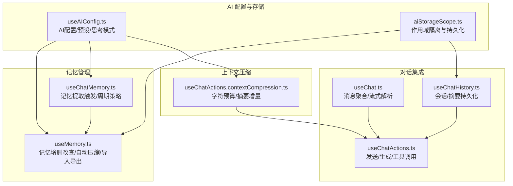
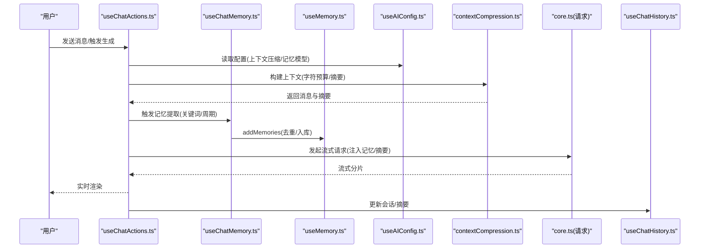
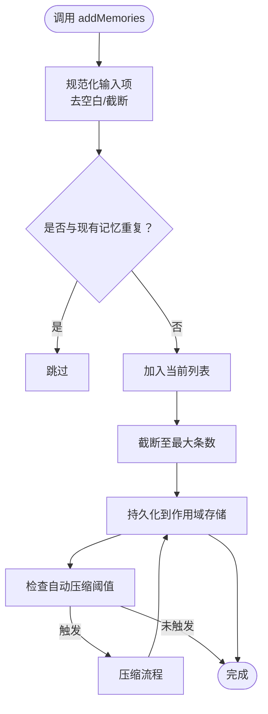
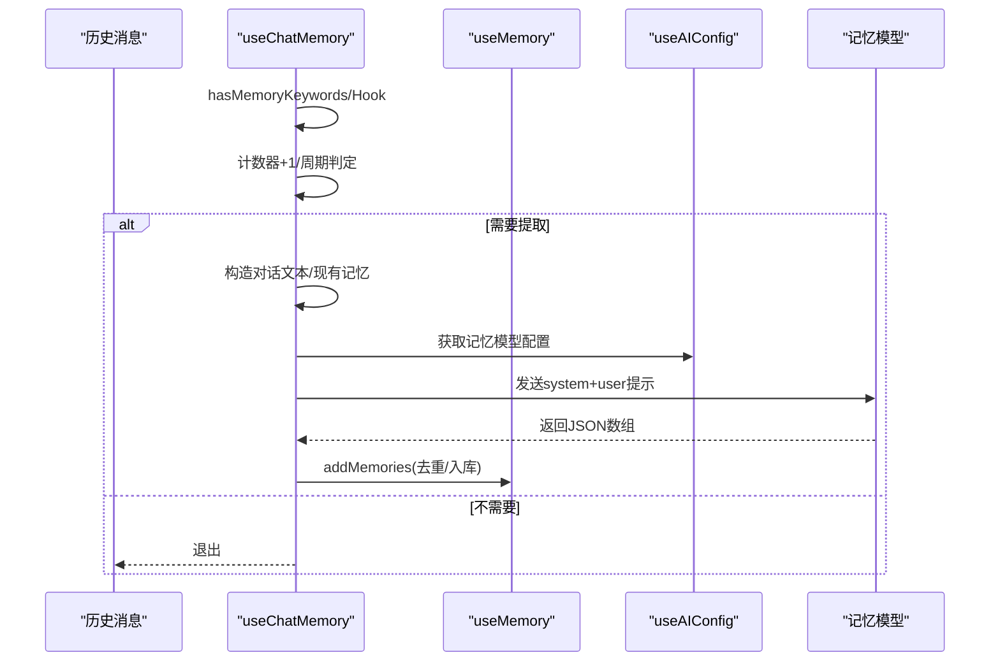
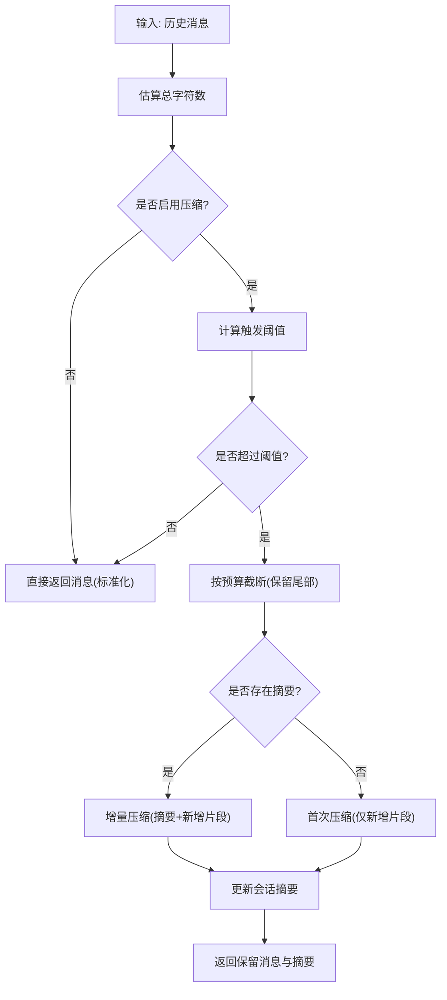
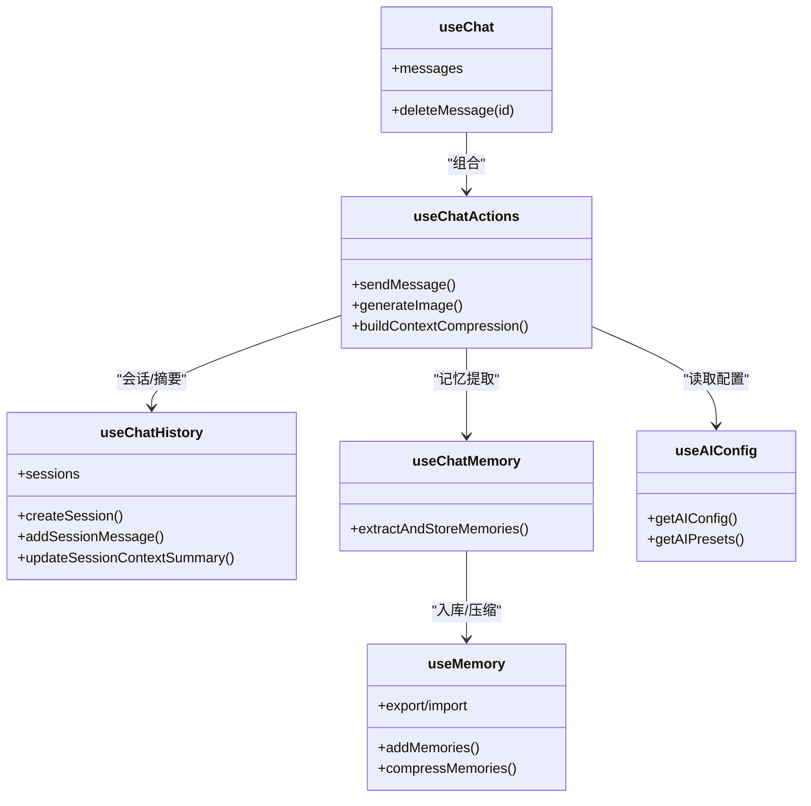
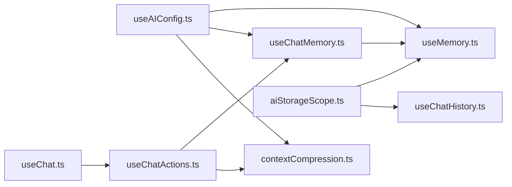

# 上下文记忆

<cite>
**本文档引用的文件**
- [useChatMemory.ts](file://apps/frontend/src/features/ai/composables/useChatMemory.ts)
- [useMemory.ts](file://apps/frontend/src/features/ai/composables/useMemory.ts)
- [useChatActions.contextCompression.ts](file://apps/frontend/src/features/ai/composables/useChatActions.contextCompression.ts)
- [useAIConfig.ts](file://apps/frontend/src/features/ai/composables/useAIConfig.ts)
- [aiStorageScope.ts](file://apps/frontend/src/features/ai/composables/aiStorageScope.ts)
- [ai.ts](file://apps/frontend/src/i18n/locales/zh-CN/ai.ts)
- [core.ts](file://apps/frontend/src/features/ai/services/core.ts)
- [useChat.ts](file://apps/frontend/src/features/ai/composables/useChat.ts)
- [useChatActions.ts](file://apps/frontend/src/features/ai/composables/useChatActions.ts)
- [useChatHistory.ts](file://apps/frontend/src/features/ai/composables/useChatHistory.ts)
</cite>

## 目录
1. [简介](#简介)
2. [项目结构](#项目结构)
3. [核心组件](#核心组件)
4. [架构总览](#架构总览)
5. [详细组件分析](#详细组件分析)
6. [依赖分析](#依赖分析)
7. [性能考量](#性能考量)
8. [故障排查指南](#故障排查指南)
9. [结论](#结论)
10. [附录](#附录)

## 简介
本文件面向AI助手的上下文记忆系统，系统性阐述以下方面：
- 上下文压缩算法：基于字符预算的滑动窗口截断与摘要增量更新，兼顾长对话的保真与成本控制。
- 记忆存储机制：前端本地持久化、作用域隔离、容量与字符限制、自动压缩阈值。
- 记忆检索策略：记忆提取与压缩的触发条件、相似性去重、与对话上下文的融合注入。
- 组合式函数 useChatMemory 与 useMemory 的实现原理：记忆片段管理、权重计算（阈值）、过期策略（自动压缩）。
- 记忆的增删改查、批量处理与内存优化策略。
- 与AI对话的集成：上下文注入、历史回顾、个性化定制。
- API使用示例：配置记忆参数、处理大段上下文、优化查询性能。
- 隐私保护与数据安全：作用域隔离、安全边界提示、最小化存储。

## 项目结构
本系统位于前端应用的AI特性模块中，围绕“记忆”和“上下文压缩”两条主线，配合配置中心与存储作用域，形成可扩展的记忆与上下文管理能力。

**图表来源**
- [useAIConfig.ts:18-38](file://apps/frontend/src/features/ai/composables/useAIConfig.ts#L18-L38)
- [aiStorageScope.ts:45-55](file://apps/frontend/src/features/ai/composables/aiStorageScope.ts#L45-L55)
- [useMemory.ts:116-378](file://apps/frontend/src/features/ai/composables/useMemory.ts#L116-L378)
- [useChatMemory.ts:20-147](file://apps/frontend/src/features/ai/composables/useChatMemory.ts#L20-L147)
- [useChatActions.contextCompression.ts:142-262](file://apps/frontend/src/features/ai/composables/useChatActions.contextCompression.ts#L142-L262)
- [useChat.ts:21-135](file://apps/frontend/src/features/ai/composables/useChat.ts#L21-L135)
- [useChatActions.ts:29-200](file://apps/frontend/src/features/ai/composables/useChatActions.ts#L29-L200)
- [useChatHistory.ts:13-25](file://apps/frontend/src/features/ai/composables/useChatHistory.ts#L13-L25)

**章节来源**
- [useAIConfig.ts:18-38](file://apps/frontend/src/features/ai/composables/useAIConfig.ts#L18-L38)
- [aiStorageScope.ts:45-55](file://apps/frontend/src/features/ai/composables/aiStorageScope.ts#L45-L55)
- [useMemory.ts:116-378](file://apps/frontend/src/features/ai/composables/useMemory.ts#L116-L378)
- [useChatMemory.ts:20-147](file://apps/frontend/src/features/ai/composables/useChatMemory.ts#L20-L147)
- [useChatActions.contextCompression.ts:142-262](file://apps/frontend/src/features/ai/composables/useChatActions.contextCompression.ts#L142-L262)
- [useChat.ts:21-135](file://apps/frontend/src/features/ai/composables/useChat.ts#L21-L135)
- [useChatActions.ts:29-200](file://apps/frontend/src/features/ai/composables/useChatActions.ts#L29-L200)
- [useChatHistory.ts:13-25](file://apps/frontend/src/features/ai/composables/useChatHistory.ts#L13-L25)

## 核心组件
- useMemory：记忆的增删改查、自动压缩、导入导出、阈值控制、错误状态与压缩状态。
- useChatMemory：记忆提取触发策略（关键词+周期），与LLM交互抽取记忆片段并入库。
- useChatActions.contextCompression：上下文压缩构建器，按字符预算截断早期消息，增量生成摘要并注入请求。
- useAIConfig：AI配置与预设、思考模式、上下文压缩开关与阈值、记忆模型与压缩模型配置。
- aiStorageScope：基于用户作用域的本地存储键空间隔离与事件广播。
- useChat/useChatActions/useChatHistory：对话生命周期、消息聚合、流式解析、会话持久化与摘要更新。

**章节来源**
- [useMemory.ts:116-378](file://apps/frontend/src/features/ai/composables/useMemory.ts#L116-L378)
- [useChatMemory.ts:20-147](file://apps/frontend/src/features/ai/composables/useChatMemory.ts#L20-L147)
- [useChatActions.contextCompression.ts:142-262](file://apps/frontend/src/features/ai/composables/useChatActions.contextCompression.ts#L142-L262)
- [useAIConfig.ts:18-38](file://apps/frontend/src/features/ai/composables/useAIConfig.ts#L18-L38)
- [aiStorageScope.ts:45-55](file://apps/frontend/src/features/ai/composables/aiStorageScope.ts#L45-L55)
- [useChat.ts:21-135](file://apps/frontend/src/features/ai/composables/useChat.ts#L21-L135)
- [useChatActions.ts:29-200](file://apps/frontend/src/features/ai/composables/useChatActions.ts#L29-L200)
- [useChatHistory.ts:13-25](file://apps/frontend/src/features/ai/composables/useChatHistory.ts#L13-L25)

## 架构总览
系统通过“配置驱动 + 作用域隔离 + 组合式函数”的方式，将记忆与上下文压缩能力无缝嵌入对话流程。

**图表来源**
- [useChatActions.ts:134-200](file://apps/frontend/src/features/ai/composables/useChatActions.ts#L134-L200)
- [useChatMemory.ts:71-141](file://apps/frontend/src/features/ai/composables/useChatMemory.ts#L71-L141)
- [useMemory.ts:184-208](file://apps/frontend/src/features/ai/composables/useMemory.ts#L184-L208)
- [useAIConfig.ts:602-622](file://apps/frontend/src/features/ai/composables/useAIConfig.ts#L602-L622)
- [useChatActions.contextCompression.ts:150-259](file://apps/frontend/src/features/ai/composables/useChatActions.contextCompression.ts#L150-L259)
- [core.ts:115-200](file://apps/frontend/src/features/ai/services/core.ts#L115-L200)
- [useChatHistory.ts:164-198](file://apps/frontend/src/features/ai/composables/useChatHistory.ts#L164-L198)

## 详细组件分析

### 组件A：记忆管理 useMemory
- 存储与作用域
  - 使用作用域键空间隔离记忆数据，支持匿名与登录用户两种作用域。
  - 支持监听存储变化事件，实现跨标签页同步。
- 数据结构与容量
  - 最大记忆条数与单条最大字符数限制，超出部分截断与丢弃。
  - 自动压缩阈值，超过阈值触发压缩。
- 增删改查与批量处理
  - 去重：基于规范化与相似度匹配（大小写、空白、单词边界）。
  - 批量导入：支持合并或替换模式，自动去重与截断。
  - 导出：JSON格式。
- 压缩与过期策略
  - 压缩触发：条数≥阈值且未处于压缩中。
  - 压缩流程：构造系统提示与用户提示，调用记忆模型，解析JSON数组，规范化后截断至上限。
  - 错误处理：记录lastError并抛出，避免UI阻塞。
- 权重与阈值
  - 阈值范围与步进规范化，防止非法值影响体验。

**图表来源**
- [useMemory.ts:184-208](file://apps/frontend/src/features/ai/composables/useMemory.ts#L184-L208)
- [useMemory.ts:232-281](file://apps/frontend/src/features/ai/composables/useMemory.ts#L232-L281)
- [aiStorageScope.ts:50-88](file://apps/frontend/src/features/ai/composables/aiStorageScope.ts#L50-L88)

**章节来源**
- [useMemory.ts:116-378](file://apps/frontend/src/features/ai/composables/useMemory.ts#L116-L378)
- [aiStorageScope.ts:45-101](file://apps/frontend/src/features/ai/composables/aiStorageScope.ts#L45-L101)

### 组件B：记忆提取 useChatMemory
- 触发策略
  - 关键词触发：检测用户近期消息是否包含偏好/习惯等关键词。
  - 周期触发：消息计数器，达到阈值强制提取。
- 提取流程
  - 截取最近N条消息，构造对话文本与现有记忆列表。
  - 使用系统提示与用户提示，调用记忆模型抽取JSON数组。
  - 解析结果并去重后入库。
- 错误处理
  - 捕获异常并提示，记录lastError。

**图表来源**
- [useChatMemory.ts:34-86](file://apps/frontend/src/features/ai/composables/useChatMemory.ts#L34-L86)
- [useChatMemory.ts:115-141](file://apps/frontend/src/features/ai/composables/useChatMemory.ts#L115-L141)
- [useMemory.ts:184-208](file://apps/frontend/src/features/ai/composables/useMemory.ts#L184-L208)
- [useAIConfig.ts:119-134](file://apps/frontend/src/features/ai/composables/useAIConfig.ts#L119-L134)

**章节来源**
- [useChatMemory.ts:20-147](file://apps/frontend/src/features/ai/composables/useChatMemory.ts#L20-L147)
- [ai.ts:427-458](file://apps/frontend/src/i18n/locales/zh-CN/ai.ts#L427-L458)

### 组件C：上下文压缩 useChatActions.contextCompression
- 字符预算与截断
  - 估算每条消息大小（文本、文档、图片、工具调用），按阈值从尾部向前累加，找到保留起点。
- 摘要增量更新
  - 若存在已有摘要，将新增片段与摘要一起喂给压缩模型，生成新的摘要并更新会话。
  - 并发控制：同一会话仅允许一个压缩任务运行，避免竞态。
- 配置与回退
  - 可配置触发阈值；若会话不存在或摘要失效，回退为直接截断。
- 输出
  - 返回“用于请求的消息列表”和“上下文摘要”。

**图表来源**
- [useChatActions.contextCompression.ts:150-259](file://apps/frontend/src/features/ai/composables/useChatActions.contextCompression.ts#L150-L259)

**章节来源**
- [useChatActions.contextCompression.ts:142-262](file://apps/frontend/src/features/ai/composables/useChatActions.contextCompression.ts#L142-L262)
- [useAIConfig.ts:602-622](file://apps/frontend/src/features/ai/composables/useAIConfig.ts#L602-L622)

### 组件D：对话集成 useChat/useChatActions/useChatHistory
- useChat：聚合消息，处理流式响应的实时解析与展示，支持待办动作、教学问答等结构化块。
- useChatActions：发送消息、生成图片、工具调用、流式分片处理、上下文压缩构建、会话管理。
- useChatHistory：会话列表、当前会话、摘要持久化、标题与置顶管理、存储配额不足时的清理策略。

**图表来源**
- [useChat.ts:21-135](file://apps/frontend/src/features/ai/composables/useChat.ts#L21-L135)
- [useChatActions.ts:29-200](file://apps/frontend/src/features/ai/composables/useChatActions.ts#L29-L200)
- [useChatHistory.ts:13-25](file://apps/frontend/src/features/ai/composables/useChatHistory.ts#L13-L25)
- [useMemory.ts:116-378](file://apps/frontend/src/features/ai/composables/useMemory.ts#L116-L378)
- [useChatMemory.ts:20-147](file://apps/frontend/src/features/ai/composables/useChatMemory.ts#L20-L147)
- [useAIConfig.ts:624-628](file://apps/frontend/src/features/ai/composables/useAIConfig.ts#L624-L628)

**章节来源**
- [useChat.ts:21-135](file://apps/frontend/src/features/ai/composables/useChat.ts#L21-L135)
- [useChatActions.ts:29-200](file://apps/frontend/src/features/ai/composables/useChatActions.ts#L29-L200)
- [useChatHistory.ts:13-25](file://apps/frontend/src/features/ai/composables/useChatHistory.ts#L13-L25)

## 依赖分析
- 组合式函数耦合
  - useChatMemory 依赖 useMemory 与 useAIConfig 的记忆模型配置。
  - useChatActions 依赖 useChatMemory、useChatHistory、useAIConfig、useChatActions.contextCompression。
  - useChat 依赖 useChatState 与 useChatActions。
- 存储与作用域
  - useMemory 与 useChatHistory 共享 aiStorageScope 的键空间与事件广播，保证跨标签页一致。
- 配置驱动
  - 上下文压缩与记忆模型均通过 useAIConfig 的配置项控制，便于切换与灰度。

**图表来源**
- [useAIConfig.ts:624-628](file://apps/frontend/src/features/ai/composables/useAIConfig.ts#L624-L628)
- [useMemory.ts:116-134](file://apps/frontend/src/features/ai/composables/useMemory.ts#L116-L134)
- [useChatMemory.ts:23-29](file://apps/frontend/src/features/ai/composables/useChatMemory.ts#L23-L29)
- [useChatActions.contextCompression.ts:107-116](file://apps/frontend/src/features/ai/composables/useChatActions.contextCompression.ts#L107-L116)
- [aiStorageScope.ts:50-88](file://apps/frontend/src/features/ai/composables/aiStorageScope.ts#L50-L88)
- [useChatActions.ts:60-64](file://apps/frontend/src/features/ai/composables/useChatActions.ts#L60-L64)
- [useChat.ts:21-23](file://apps/frontend/src/features/ai/composables/useChat.ts#L21-L23)

**章节来源**
- [useAIConfig.ts:624-628](file://apps/frontend/src/features/ai/composables/useAIConfig.ts#L624-L628)
- [useChatActions.ts:60-64](file://apps/frontend/src/features/ai/composables/useChatActions.ts#L60-L64)

## 性能考量
- 上下文压缩
  - 字符预算估算与滑动窗口截断，避免超长上下文导致的延迟与成本上升。
  - 摘要增量更新减少重复信息，提升后续请求的保真度与稳定性。
- 记忆压缩
  - 自动阈值触发，避免记忆过多导致的解析与注入成本上升。
  - 压缩后截断上限，维持稳定容量。
- 存储与序列化
  - 会话存储时对消息内容进行截断与敏感字段过滤，降低存储压力。
  - 存储配额不足时的清理策略，优先删除最旧非置顶会话，保障核心数据。

[本节为通用指导，无需特定文件来源]

## 故障排查指南
- 记忆提取失败
  - 现象：弹出错误提示，lastError非空。
  - 排查：检查记忆模型配置是否正确，网络是否可达，返回内容是否为合法JSON数组。
- 记忆压缩失败
  - 现象：压缩流程抛错，lastError记录。
  - 排查：确认压缩模型可用、提示词符合预期、返回内容可解析。
- 上下文压缩不生效
  - 现象：长对话未被截断或摘要未更新。
  - 排查：确认上下文压缩开关与阈值配置，检查会话摘要是否被清理或失效。
- 存储异常
  - 现象：跨标签页不同步或数据丢失。
  - 排查：确认作用域键空间与事件广播正常，localStorage可用。

**章节来源**
- [useChatMemory.ts:135-141](file://apps/frontend/src/features/ai/composables/useChatMemory.ts#L135-L141)
- [useMemory.ts:274-281](file://apps/frontend/src/features/ai/composables/useMemory.ts#L274-L281)
- [useChatActions.contextCompression.ts:197-259](file://apps/frontend/src/features/ai/composables/useChatActions.contextCompression.ts#L197-L259)
- [aiStorageScope.ts:90-100](file://apps/frontend/src/features/ai/composables/aiStorageScope.ts#L90-L100)

## 结论
本系统通过“配置驱动 + 作用域隔离 + 组合式函数”的架构，实现了：
- 高效的上下文压缩与记忆管理；
- 稳健的触发与去重策略；
- 与对话流程的深度集成与可观测性；
- 面向生产的隐私与性能考量。

在实际使用中，建议：
- 合理设置上下文压缩阈值与记忆自动压缩阈值；
- 使用专用预设提升记忆与压缩质量；
- 在需要时手动触发压缩与导出备份。

[本节为总结，无需特定文件来源]

## 附录

### API使用示例（路径指引）
- 配置记忆参数
  - 记忆模型ID：在AI配置中设置 memoryModelId，useMemory 会据此构造模型选项。
  - 参考：[useMemory.ts:120-134](file://apps/frontend/src/features/ai/composables/useMemory.ts#L120-L134)、[useAIConfig.ts:615-615](file://apps/frontend/src/features/ai/composables/useAIConfig.ts#L615-L615)
- 处理大段上下文
  - 启用上下文压缩，设置触发阈值；系统将自动截断与摘要更新。
  - 参考：[useChatActions.contextCompression.ts:150-259](file://apps/frontend/src/features/ai/composables/useChatActions.contextCompression.ts#L150-L259)、[useAIConfig.ts:618-619](file://apps/frontend/src/features/ai/composables/useAIConfig.ts#L618-L619)
- 优化查询性能
  - 使用专用压缩模型与记忆模型，降低解析与注入成本。
  - 参考：[useAIConfig.ts:107-116](file://apps/frontend/src/features/ai/composables/useAIConfig.ts#L107-L116)、[useMemory.ts:120-134](file://apps/frontend/src/features/ai/composables/useMemory.ts#L120-L134)
- 记忆增删改查与批量处理
  - 手动添加/更新/删除/清空；导入支持合并或替换；导出JSON。
  - 参考：[useMemory.ts:184-297](file://apps/frontend/src/features/ai/composables/useMemory.ts#L184-L297)、[useMemory.ts:325-358](file://apps/frontend/src/features/ai/composables/useMemory.ts#L325-L358)
- 隐私保护与数据安全
  - 作用域隔离键空间、安全边界提示、最小化存储与截断。
  - 参考：[aiStorageScope.ts:50-88](file://apps/frontend/src/features/ai/composables/aiStorageScope.ts#L50-L88)、[ai.ts:242-245](file://apps/frontend/src/i18n/locales/zh-CN/ai.ts#L242-L245)

**章节来源**
- [useMemory.ts:120-134](file://apps/frontend/src/features/ai/composables/useMemory.ts#L120-L134)
- [useChatActions.contextCompression.ts:150-259](file://apps/frontend/src/features/ai/composables/useChatActions.contextCompression.ts#L150-L259)
- [useAIConfig.ts:615-619](file://apps/frontend/src/features/ai/composables/useAIConfig.ts#L615-L619)
- [aiStorageScope.ts:50-88](file://apps/frontend/src/features/ai/composables/aiStorageScope.ts#L50-L88)
- [ai.ts:242-245](file://apps/frontend/src/i18n/locales/zh-CN/ai.ts#L242-L245)