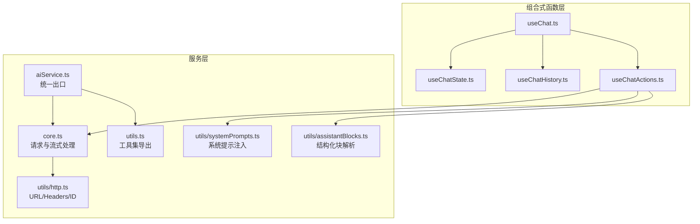
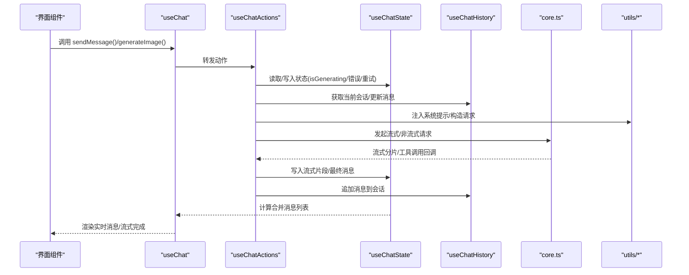
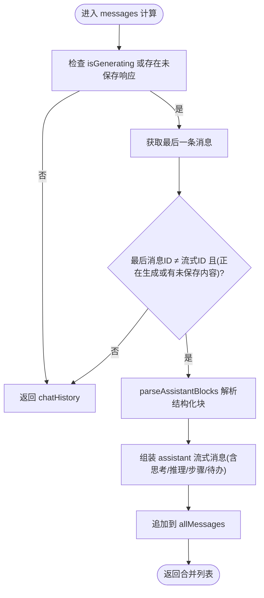
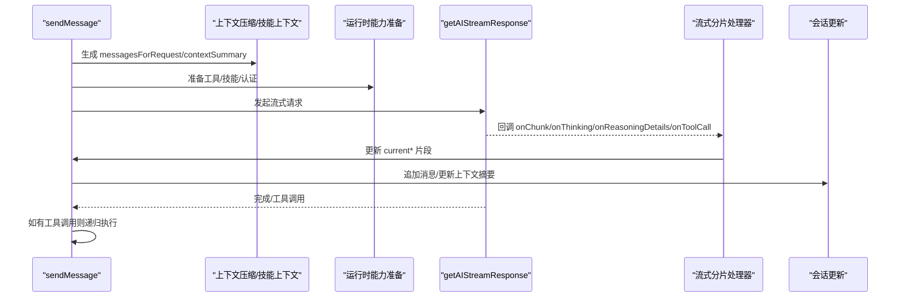
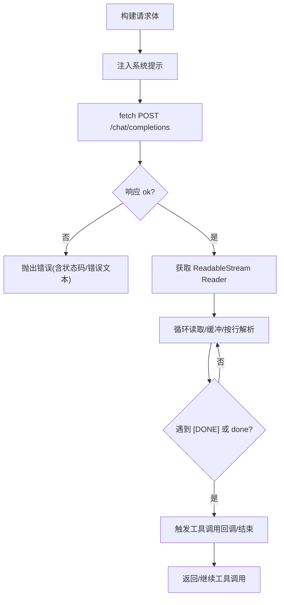
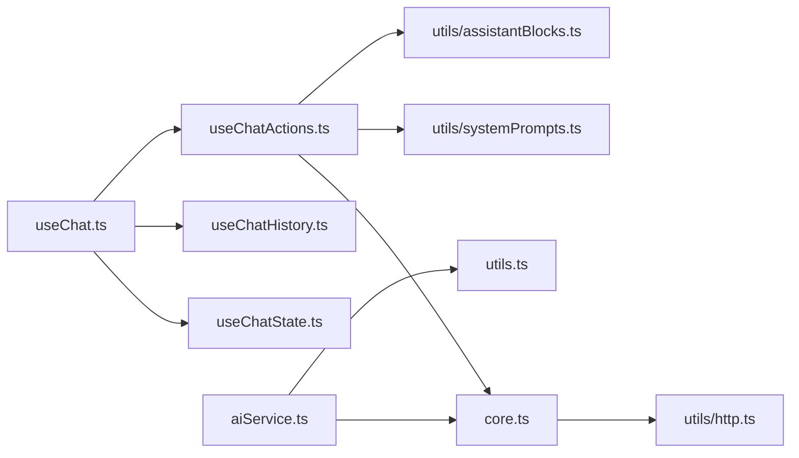

# 对话管理

<cite>
**本文引用的文件**
- [apps/frontend/src/features/ai/composables/useChat.ts](file://apps/frontend/src/features/ai/composables/useChat.ts)
- [apps/frontend/src/features/ai/composables/useChatState.ts](file://apps/frontend/src/features/ai/composables/useChatState.ts)
- [apps/frontend/src/features/ai/composables/useChatHistory.ts](file://apps/frontend/src/features/ai/composables/useChatHistory.ts)
- [apps/frontend/src/features/ai/composables/useChatActions.ts](file://apps/frontend/src/features/ai/composables/useChatActions.ts)
- [apps/frontend/src/features/ai/services/types.ts](file://apps/frontend/src/features/ai/services/types.ts)
- [apps/frontend/src/features/ai/services/core.ts](file://apps/frontend/src/features/ai/services/core.ts)
- [apps/frontend/src/features/ai/services/utils.ts](file://apps/frontend/src/features/ai/services/utils.ts)
- [apps/frontend/src/features/ai/services/utils/http.ts](file://apps/frontend/src/features/ai/services/utils/http.ts)
- [apps/frontend/src/features/ai/services/utils/assistantBlocks.ts](file://apps/frontend/src/features/ai/services/utils/assistantBlocks.ts)
- [apps/frontend/src/features/ai/services/utils/systemPrompts.ts](file://apps/frontend/src/features/ai/services/utils/systemPrompts.ts)
- [apps/frontend/src/features/ai/services/index.ts](file://apps/frontend/src/features/ai/services/index.ts)
</cite>

## 目录
1. [简介](#简介)
2. [项目结构](#项目结构)
3. [核心组件](#核心组件)
4. [架构总览](#架构总览)
5. [详细组件分析](#详细组件分析)
6. [依赖关系分析](#依赖关系分析)
7. [性能考虑](#性能考虑)
8. [故障排查指南](#故障排查指南)
9. [结论](#结论)
10. [附录](#附录)

## 简介
本文件面向AI助手的对话管理系统，围绕“useChat组合式函数”的实现原理展开，系统性阐述对话生命周期管理、消息状态跟踪、实时对话处理机制，并覆盖以下主题：
- 消息发送、接收、编辑、删除与重发
- 对话历史管理、会话切换与持久化
- 流式传输处理与多模态内容（文本、图片、结构化块）
- 与AI Service的集成方式（请求构建、响应解析、错误处理）
- 性能优化策略与最佳实践

## 项目结构
前端AI功能主要位于 apps/frontend/src/features/ai 下，采用“组合式函数 + 服务层”的分层设计：
- 组合式函数层：useChat、useChatState、useChatHistory、useChatActions
- 服务层：aiService（统一导出）、core（请求与流式处理）、utils（工具集）
- 类型定义：types（消息、请求选项、技能、工具等）

图表来源
- [apps/frontend/src/features/ai/composables/useChat.ts:1-136](file://apps/frontend/src/features/ai/composables/useChat.ts#L1-L136)
- [apps/frontend/src/features/ai/composables/useChatState.ts:1-144](file://apps/frontend/src/features/ai/composables/useChatState.ts#L1-L144)
- [apps/frontend/src/features/ai/composables/useChatHistory.ts:1-479](file://apps/frontend/src/features/ai/composables/useChatHistory.ts#L1-L479)
- [apps/frontend/src/features/ai/composables/useChatActions.ts:1-480](file://apps/frontend/src/features/ai/composables/useChatActions.ts#L1-L480)
- [apps/frontend/src/features/ai/services/aiService.ts:1-6](file://apps/frontend/src/features/ai/services/aiService.ts#L1-L6)
- [apps/frontend/src/features/ai/services/core.ts:1-445](file://apps/frontend/src/features/ai/services/core.ts#L1-L445)
- [apps/frontend/src/features/ai/services/utils.ts:1-10](file://apps/frontend/src/features/ai/services/utils.ts#L1-L10)
- [apps/frontend/src/features/ai/services/utils/http.ts:1-19](file://apps/frontend/src/features/ai/services/utils/http.ts#L1-L19)
- [apps/frontend/src/features/ai/services/utils/systemPrompts.ts:1-632](file://apps/frontend/src/features/ai/services/utils/systemPrompts.ts#L1-L632)
- [apps/frontend/src/features/ai/services/utils/assistantBlocks.ts:1-374](file://apps/frontend/src/features/ai/services/utils/assistantBlocks.ts#L1-L374)

章节来源
- [apps/frontend/src/features/ai/composables/useChat.ts:1-136](file://apps/frontend/src/features/ai/composables/useChat.ts#L1-L136)
- [apps/frontend/src/features/ai/composables/useChatState.ts:1-144](file://apps/frontend/src/features/ai/composables/useChatState.ts#L1-L144)
- [apps/frontend/src/features/ai/composables/useChatHistory.ts:1-479](file://apps/frontend/src/features/ai/composables/useChatHistory.ts#L1-L479)
- [apps/frontend/src/features/ai/composables/useChatActions.ts:1-480](file://apps/frontend/src/features/ai/composables/useChatActions.ts#L1-L480)
- [apps/frontend/src/features/ai/services/aiService.ts:1-6](file://apps/frontend/src/features/ai/services/aiService.ts#L1-L6)
- [apps/frontend/src/features/ai/services/core.ts:1-445](file://apps/frontend/src/features/ai/services/core.ts#L1-L445)
- [apps/frontend/src/features/ai/services/utils.ts:1-10](file://apps/frontend/src/features/ai/services/utils.ts#L1-L10)
- [apps/frontend/src/features/ai/services/utils/http.ts:1-19](file://apps/frontend/src/features/ai/services/utils/http.ts#L1-L19)
- [apps/frontend/src/features/ai/services/utils/systemPrompts.ts:1-632](file://apps/frontend/src/features/ai/services/utils/systemPrompts.ts#L1-L632)
- [apps/frontend/src/features/ai/services/utils/assistantBlocks.ts:1-374](file://apps/frontend/src/features/ai/services/utils/assistantBlocks.ts#L1-L374)

## 核心组件
- useChat：聊天功能聚合器，协调状态、动作与记忆提取，计算合并消息列表（含流式实时渲染）
- useChatState：全局聊天状态（历史、流式片段、生成/加载状态、错误、重试次数），并提供教学问答答案更新与快照读取
- useChatHistory：会话生命周期管理（创建、切换、更新、置顶、重命名、删除、清空），本地持久化与跨标签页同步
- useChatActions：消息发送、图片生成、停止生成、清空历史、删除/重发/编辑消息、手动添加消息对、工具调用与多模型讨论流式处理

章节来源
- [apps/frontend/src/features/ai/composables/useChat.ts:17-136](file://apps/frontend/src/features/ai/composables/useChat.ts#L17-L136)
- [apps/frontend/src/features/ai/composables/useChatState.ts:41-144](file://apps/frontend/src/features/ai/composables/useChatState.ts#L41-L144)
- [apps/frontend/src/features/ai/composables/useChatHistory.ts:274-479](file://apps/frontend/src/features/ai/composables/useChatHistory.ts#L274-L479)
- [apps/frontend/src/features/ai/composables/useChatActions.ts:29-480](file://apps/frontend/src/features/ai/composables/useChatActions.ts#L29-L480)

## 架构总览
对话管理由“状态层 + 动作层 + 服务层”构成，通过useChat聚合对外暴露统一接口。

图表来源
- [apps/frontend/src/features/ai/composables/useChat.ts:40-102](file://apps/frontend/src/features/ai/composables/useChat.ts#L40-L102)
- [apps/frontend/src/features/ai/composables/useChatActions.ts:134-360](file://apps/frontend/src/features/ai/composables/useChatActions.ts#L134-L360)
- [apps/frontend/src/features/ai/composables/useChatState.ts:44-70](file://apps/frontend/src/features/ai/composables/useChatState.ts#L44-L70)
- [apps/frontend/src/features/ai/composables/useChatHistory.ts:346-352](file://apps/frontend/src/features/ai/composables/useChatHistory.ts#L346-L352)
- [apps/frontend/src/features/ai/services/core.ts:115-339](file://apps/frontend/src/features/ai/services/core.ts#L115-L339)
- [apps/frontend/src/features/ai/services/utils/systemPrompts.ts:420-631](file://apps/frontend/src/features/ai/services/utils/systemPrompts.ts#L420-L631)

## 详细组件分析

### useChat：对话聚合器与消息合并
- 职责
  - 协调状态与动作
  - 计算合并消息列表，支持流式实时渲染与“流式完成后短暂窗口”的内容保留
  - 提供删除消息能力（AI消息联动删除其前一条用户消息）
- 关键点
  - 流式消息的占位ID与“未保存响应”条件判断，避免流式结束瞬间的重复
  - 实时解析结构化块（待办、教学测验、评估），并注入到消息对象
  - 将状态中的流式片段（正文、思考、推理、讨论步骤、待办建议）合并为一条“assistant”消息

图表来源
- [apps/frontend/src/features/ai/composables/useChat.ts:40-102](file://apps/frontend/src/features/ai/composables/useChat.ts#L40-L102)
- [apps/frontend/src/features/ai/services/utils/assistantBlocks.ts:308-374](file://apps/frontend/src/features/ai/services/utils/assistantBlocks.ts#L308-L374)

章节来源
- [apps/frontend/src/features/ai/composables/useChat.ts:17-136](file://apps/frontend/src/features/ai/composables/useChat.ts#L17-L136)

### useChatState：状态管理与教学问答
- 职责
  - 维护聊天历史、流式片段（正文、思考、推理、讨论步骤、待办）、生成/加载状态、错误、重试次数
  - 重置流式状态、清除错误
  - 教学模式下更新用户答题、快照读取
- 关键点
  - chatHistory 的 getter/setter 与当前会话绑定
  - 监听会话切换，自动重置流式状态并清除错误

章节来源
- [apps/frontend/src/features/ai/composables/useChatState.ts:41-144](file://apps/frontend/src/features/ai/composables/useChatState.ts#L41-L144)

### useChatHistory：会话生命周期与持久化
- 职责
  - 创建/切换/更新/置顶/重命名/删除/清空会话
  - 自动标题（基于首条用户消息）
  - 本地持久化（localStorage，带作用域与事件监听）
  - 存储配额不足时的清理策略
- 关键点
  - 会话排序：置顶优先、更新时间倒序
  - 当前/上次激活会话ID的保存与回退逻辑
  - 节流保存与 beforeunload 保障

章节来源
- [apps/frontend/src/features/ai/composables/useChatHistory.ts:274-479](file://apps/frontend/src/features/ai/composables/useChatHistory.ts#L274-L479)

### useChatActions：消息发送与实时处理
- 职责
  - 发送消息（文本/图片/文档）、生成图片、停止生成、清空历史、删除/重发/编辑消息、手动添加消息对
  - 流式处理：正文增量、思考内容、推理细节、讨论步骤
  - 工具调用与多模型讨论流式处理
  - 重试机制（最多3次）
- 关键流程
  - 构建上下文压缩（可选）与技能上下文
  - 准备运行时能力（工具/技能/认证）
  - 发起流式请求或多模型讨论流式请求
  - 工具调用后递归处理
  - 结束后写入会话并重置流式状态

图表来源
- [apps/frontend/src/features/ai/composables/useChatActions.ts:134-360](file://apps/frontend/src/features/ai/composables/useChatActions.ts#L134-L360)
- [apps/frontend/src/features/ai/services/core.ts:115-339](file://apps/frontend/src/features/ai/services/core.ts#L115-L339)

章节来源
- [apps/frontend/src/features/ai/composables/useChatActions.ts:29-480](file://apps/frontend/src/features/ai/composables/useChatActions.ts#L29-L480)

### AI Service集成：请求构建、响应解析与错误处理
- 请求构建
  - URL/Headers：统一构建 /chat/completions，Authorization: Bearer
  - 系统提示注入：根据模式（教学/记忆/上下文摘要/技能/工具）拼装系统块
  - 请求体：模型、温度、top_p、stream=true、工具与工具选择、推理参数（不同平台兼容）
- 响应解析
  - 流式：逐行解析SSE，提取 choices[0].delta.content 与 tool_calls
  - 非流式：一次性返回 content 与推理字段
  - 结构化块：解析 TODO_ACTIONS/TEACHING_* 等标记块，标准化为消息属性
- 错误处理
  - 中断请求：AbortController，支持外部信号
  - 流中断：抛出 AbortError 并通知 UI
  - 业务错误：翻译并上报

图表来源
- [apps/frontend/src/features/ai/services/core.ts:115-339](file://apps/frontend/src/features/ai/services/core.ts#L115-L339)
- [apps/frontend/src/features/ai/services/utils/http.ts:3-14](file://apps/frontend/src/features/ai/services/utils/http.ts#L3-L14)
- [apps/frontend/src/features/ai/services/utils/systemPrompts.ts:420-631](file://apps/frontend/src/features/ai/services/utils/systemPrompts.ts#L420-L631)
- [apps/frontend/src/features/ai/services/utils/assistantBlocks.ts:308-374](file://apps/frontend/src/features/ai/services/utils/assistantBlocks.ts#L308-L374)

章节来源
- [apps/frontend/src/features/ai/services/core.ts:1-445](file://apps/frontend/src/features/ai/services/core.ts#L1-L445)
- [apps/frontend/src/features/ai/services/utils/http.ts:1-19](file://apps/frontend/src/features/ai/services/utils/http.ts#L1-L19)
- [apps/frontend/src/features/ai/services/utils/systemPrompts.ts:1-632](file://apps/frontend/src/features/ai/services/utils/systemPrompts.ts#L1-L632)
- [apps/frontend/src/features/ai/services/utils/assistantBlocks.ts:1-374](file://apps/frontend/src/features/ai/services/utils/assistantBlocks.ts#L1-L374)

### 多模态内容处理与结构化块
- 多模态
  - 文本与图片混合：将图片封装为 image_url 形式
  - 文档注入：限制总量与单文件长度，拼接为 [documents]/[/documents] 块
- 结构化块
  - TODO_ACTIONS、TEACHING_QUIZ、TEACHING_ASSESSMENT
  - 解析失败/不完整块的错误收集与“挂起块”追踪
  - 在合并消息时作为消息属性透传

章节来源
- [apps/frontend/src/features/ai/services/utils/systemPrompts.ts:548-628](file://apps/frontend/src/features/ai/services/utils/systemPrompts.ts#L548-L628)
- [apps/frontend/src/features/ai/services/utils/assistantBlocks.ts:308-374](file://apps/frontend/src/features/ai/services/utils/assistantBlocks.ts#L308-L374)
- [apps/frontend/src/features/ai/services/types.ts:170-232](file://apps/frontend/src/features/ai/services/types.ts#L170-L232)

## 依赖关系分析
- useChat 依赖 useChatState、useChatHistory、useChatActions
- useChatActions 依赖 core.ts（流式/非流式）、utils.systemPrompts（系统提示）、utils.assistantBlocks（结构化块）
- core.ts 依赖 utils.http（URL/Headers/ID）
- aiService.ts 统一导出 types/utils/core/features

图表来源
- [apps/frontend/src/features/ai/composables/useChat.ts:1-15](file://apps/frontend/src/features/ai/composables/useChat.ts#L1-L15)
- [apps/frontend/src/features/ai/composables/useChatActions.ts:1-22](file://apps/frontend/src/features/ai/composables/useChatActions.ts#L1-L22)
- [apps/frontend/src/features/ai/services/aiService.ts:1-6](file://apps/frontend/src/features/ai/services/aiService.ts#L1-L6)
- [apps/frontend/src/features/ai/services/core.ts:1-16](file://apps/frontend/src/features/ai/services/core.ts#L1-L16)
- [apps/frontend/src/features/ai/services/utils.ts:1-10](file://apps/frontend/src/features/ai/services/utils.ts#L1-L10)
- [apps/frontend/src/features/ai/services/utils/http.ts:1-19](file://apps/frontend/src/features/ai/services/utils/http.ts#L1-L19)
- [apps/frontend/src/features/ai/services/utils/systemPrompts.ts:1-18](file://apps/frontend/src/features/ai/services/utils/systemPrompts.ts#L1-L18)
- [apps/frontend/src/features/ai/services/utils/assistantBlocks.ts:1-12](file://apps/frontend/src/features/ai/services/utils/assistantBlocks.ts#L1-L12)

章节来源
- [apps/frontend/src/features/ai/composables/useChat.ts:1-15](file://apps/frontend/src/features/ai/composables/useChat.ts#L1-L15)
- [apps/frontend/src/features/ai/composables/useChatActions.ts:1-22](file://apps/frontend/src/features/ai/composables/useChatActions.ts#L1-L22)
- [apps/frontend/src/features/ai/services/aiService.ts:1-6](file://apps/frontend/src/features/ai/services/aiService.ts#L1-L6)
- [apps/frontend/src/features/ai/services/core.ts:1-16](file://apps/frontend/src/features/ai/services/core.ts#L1-L16)
- [apps/frontend/src/features/ai/services/utils.ts:1-10](file://apps/frontend/src/features/ai/services/utils.ts#L1-L10)
- [apps/frontend/src/features/ai/services/utils/http.ts:1-19](file://apps/frontend/src/features/ai/services/utils/http.ts#L1-L19)
- [apps/frontend/src/features/ai/services/utils/systemPrompts.ts:1-18](file://apps/frontend/src/features/ai/services/utils/systemPrompts.ts#L1-L18)
- [apps/frontend/src/features/ai/services/utils/assistantBlocks.ts:1-12](file://apps/frontend/src/features/ai/services/utils/assistantBlocks.ts#L1-L12)

## 性能考虑
- 流式渲染
  - 使用 computed 合并消息，避免频繁重渲染；仅在 isGenerating 或存在未保存响应时追加流式占位消息
  - 流式分片按行解析，减少大块字符串处理开销
- 请求与中断
  - 统一 AbortController，支持外部信号；中断后及时释放控制器
  - 非流式请求同样支持中断
- 存储与持久化
  - 会话保存节流（默认500ms），beforeunload 强制保存
  - 存储配额不足时按规则清理最旧非置顶会话
- 上下文压缩与技能
  - 上下文压缩与技能上下文在请求前构建，避免重复计算
  - 工具调用后递归处理，限制最大迭代次数，防止无限循环

[本节为通用指导，无需特定文件引用]

## 故障排查指南
- 流式中断
  - 现象：UI显示“已中断”或无响应
  - 排查：确认是否调用停止生成；检查 AbortController 是否被复用
  - 参考
    - [apps/frontend/src/features/ai/services/core.ts:432-437](file://apps/frontend/src/features/ai/services/core.ts#L432-L437)
- 无流输出
  - 现象：请求成功但无流式分片
  - 排查：确认服务端是否支持SSE；检查响应体是否以 data: 开头
  - 参考
    - [apps/frontend/src/features/ai/services/core.ts:208-214](file://apps/frontend/src/features/ai/services/core.ts#L208-L214)
- 结构化块解析失败
  - 现象：消息缺少待办/测验/评估或报错
  - 排查：检查标记块是否闭合；确认JSON格式与字段规范
  - 参考
    - [apps/frontend/src/features/ai/services/utils/assistantBlocks.ts:308-374](file://apps/frontend/src/features/ai/services/utils/assistantBlocks.ts#L308-L374)
- 图片生成不可用
  - 现象：提示不支持多模态或400错误
  - 排查：检查配置是否启用图片生成；确认模型支持图像输入
  - 参考
    - [apps/frontend/src/features/ai/composables/useChatActions.ts:69-129](file://apps/frontend/src/features/ai/composables/useChatActions.ts#L69-L129)
- 会话丢失或无法切换
  - 现象：刷新后会话为空或切换无效
  - 排查：检查本地存储键值；确认事件监听与回退逻辑
  - 参考
    - [apps/frontend/src/features/ai/composables/useChatHistory.ts:71-121](file://apps/frontend/src/features/ai/composables/useChatHistory.ts#L71-L121)

章节来源
- [apps/frontend/src/features/ai/services/core.ts:432-437](file://apps/frontend/src/features/ai/services/core.ts#L432-L437)
- [apps/frontend/src/features/ai/services/utils/assistantBlocks.ts:308-374](file://apps/frontend/src/features/ai/services/utils/assistantBlocks.ts#L308-L374)
- [apps/frontend/src/features/ai/composables/useChatActions.ts:69-129](file://apps/frontend/src/features/ai/composables/useChatActions.ts#L69-L129)
- [apps/frontend/src/features/ai/composables/useChatHistory.ts:71-121](file://apps/frontend/src/features/ai/composables/useChatHistory.ts#L71-L121)

## 结论
本对话管理系统通过useChat聚合状态与动作，结合useChatActions的流式处理与工具调用能力，实现了从消息发送、接收、编辑、删除到会话管理与持久化的完整闭环。AI Service层提供了统一的请求构建、响应解析与错误处理机制，支持多模态与结构化块，满足复杂场景下的实时交互需求。配合合理的性能优化与故障排查策略，可在保证用户体验的同时提升系统的稳定性与可维护性。

[本节为总结，无需特定文件引用]

## 附录
- 类型与消息结构参考
  - [apps/frontend/src/features/ai/services/types.ts:170-232](file://apps/frontend/src/features/ai/services/types.ts#L170-L232)
- 服务统一出口
  - [apps/frontend/src/features/ai/services/index.ts:1-9](file://apps/frontend/src/features/ai/services/index.ts#L1-L9)