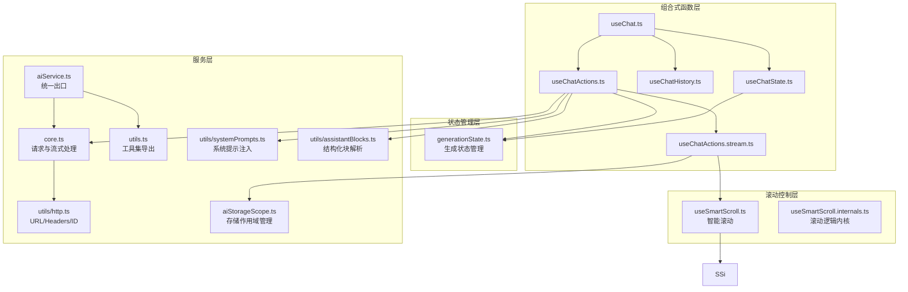
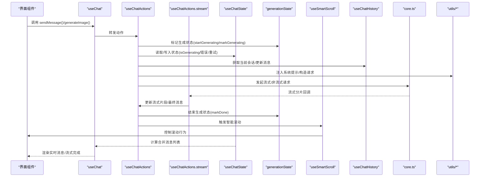
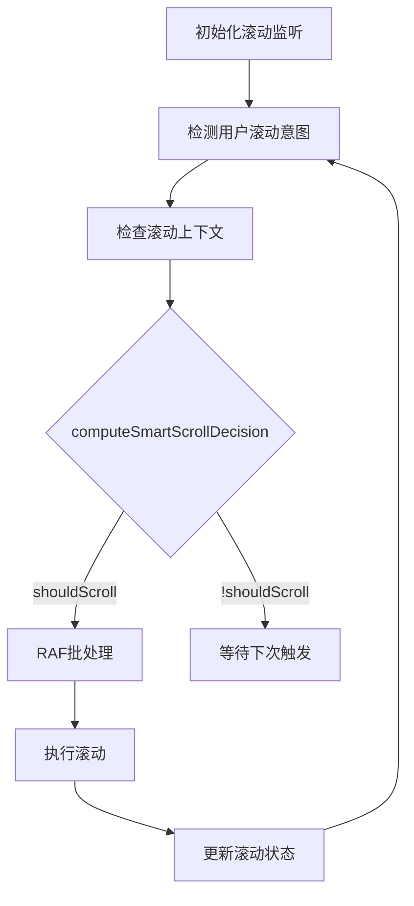
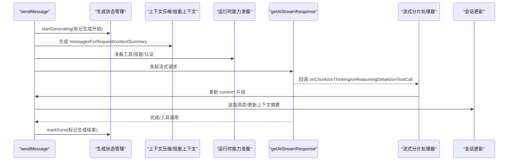
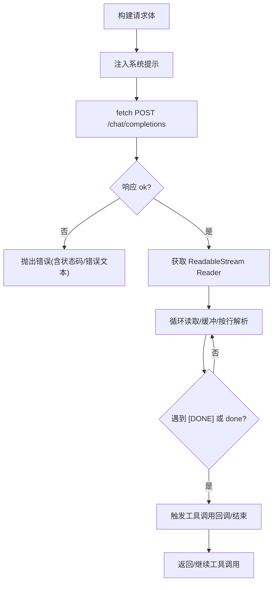
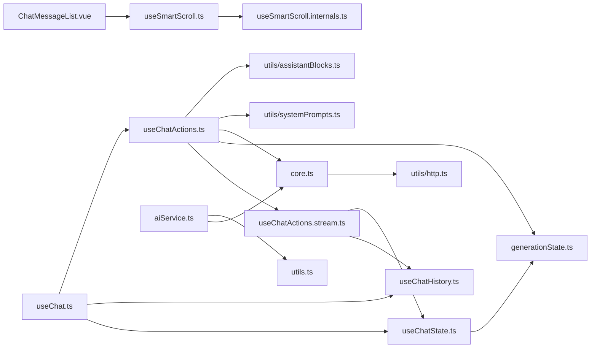

# 对话管理

<cite>
**本文引用的文件**
- [apps/frontend/src/features/ai/composables/useChat.ts](file://apps/frontend/src/features/ai/composables/useChat.ts)
- [apps/frontend/src/features/ai/composables/useChatState.ts](file://apps/frontend/src/features/ai/composables/useChatState.ts)
- [apps/frontend/src/features/ai/composables/useChatHistory.ts](file://apps/frontend/src/features/ai/composables/useChatHistory.ts)
- [apps/frontend/src/features/ai/composables/useChatActions.ts](file://apps/frontend/src/features/ai/composables/useChatActions.ts)
- [apps/frontend/src/features/ai/composables/useChatActions.stream.ts](file://apps/frontend/src/features/ai/composables/useChatActions.stream.ts)
- [apps/frontend/src/features/ai/stores/generationState.ts](file://apps/frontend/src/features/ai/stores/generationState.ts)
- [apps/frontend/src/composables/useSmartScroll.ts](file://apps/frontend/src/composables/useSmartScroll.ts)
- [apps/frontend/src/composables/useSmartScroll.internals.ts](file://apps/frontend/src/composables/useSmartScroll.internals.ts)
- [apps/frontend/src/features/ai/components/ChatMessageList.vue](file://apps/frontend/src/features/ai/components/ChatMessageList.vue)
- [apps/frontend/src/features/ai/services/types.ts](file://apps/frontend/src/features/ai/services/types.ts)
- [apps/frontend/src/features/ai/services/core.ts](file://apps/frontend/src/features/ai/services/core.ts)
- [apps/frontend/src/features/ai/services/utils.ts](file://apps/frontend/src/features/ai/services/utils.ts)
- [apps/frontend/src/features/ai/services/utils/http.ts](file://apps/frontend/src/features/ai/services/utils/http.ts)
- [apps/frontend/src/features/ai/services/utils/assistantBlocks.ts](file://apps/frontend/src/features/ai/services/utils/assistantBlocks.ts)
- [apps/frontend/src/features/ai/services/utils/systemPrompts.ts](file://apps/frontend/src/features/ai/services/utils/systemPrompts.ts)
- [apps/frontend/src/features/ai/services/index.ts](file://apps/frontend/src/features/ai/services/index.ts)
- [apps/frontend/src/features/ai/composables/aiStorageScope.ts](file://apps/frontend/src/features/ai/composables/aiStorageScope.ts)
- [apps/frontend/tests/features/ai/composables/useChatHistory.spec.ts](file://apps/frontend/tests/features/ai/composables/useChatHistory.spec.ts)
- [apps/frontend/tests/composables/useSmartScroll.spec.ts](file://apps/frontend/tests/composables/useSmartScroll.spec.ts)
- [apps/frontend/tests/features/ai/components/ChatMessageList.spec.ts](file://apps/frontend/tests/features/ai/components/ChatMessageList.spec.ts)
</cite>

## 更新摘要
**所做更改**
- 新增生成状态管理（generationState.ts）用于跟踪会话生成状态
- 增强智能滚动逻辑（useSmartScroll.ts）包含流式行为改进和高级滚动控制
- 优化流式响应处理与消息最终化机制
- 完善教学模式评估记录的持久化机制
- 增强小说模式自动补章功能的处理逻辑

## 目录
1. [简介](#简介)
2. [项目结构](#项目结构)
3. [核心组件](#核心组件)
4. [架构总览](#架构总览)
5. [详细组件分析](#详细组件分析)
6. [依赖关系分析](#依赖关系分析)
7. [性能考虑](#性能考虑)
8. [故障排查指南](#故障排查指南)
9. [结论](#结论)
10. [附录](#附录)

## 简介
本文件面向AI助手的对话管理系统，围绕"useChat组合式函数"的实现原理展开，系统性阐述对话生命周期管理、消息状态跟踪、实时对话处理机制，并覆盖以下主题：
- 消息发送、接收、编辑、删除与重发
- 对话历史管理、会话切换与持久化
- 流式传输处理与多模态内容（文本、图片、结构化块）
- 与AI Service的集成方式（请求构建、响应解析、错误处理）
- **新增** 生成状态管理与智能滚动增强功能
- 性能优化策略与最佳实践

**更新** 本次更新重点介绍了新增的生成状态管理（generationState.ts）和智能滚动增强功能（useSmartScroll.ts），包括增强的智能滚动逻辑、流式行为改进等。

## 项目结构
前端AI功能主要位于 apps/frontend/src/features/ai 下，采用"组合式函数 + 服务层"的分层设计：
- 组合式函数层：useChat、useChatState、useChatHistory、useChatActions、useChatActions.stream
- **新增** 状态管理：generationState（生成状态跟踪）
- **新增** 滚动控制：useSmartScroll（智能滚动逻辑）
- 服务层：aiService（统一导出）、core（请求与流式处理）、utils（工具集）
- 类型定义：types（消息、请求选项、技能、工具等）

**图表来源**
- [apps/frontend/src/features/ai/composables/useChat.ts:1-145](file://apps/frontend/src/features/ai/composables/useChat.ts#L1-L145)
- [apps/frontend/src/features/ai/composables/useChatState.ts:1-144](file://apps/frontend/src/features/ai/composables/useChatState.ts#L1-L144)
- [apps/frontend/src/features/ai/composables/useChatHistory.ts:1-504](file://apps/frontend/src/features/ai/composables/useChatHistory.ts#L1-L504)
- [apps/frontend/src/features/ai/composables/useChatActions.ts:1-611](file://apps/frontend/src/features/ai/composables/useChatActions.ts#L1-L611)
- [apps/frontend/src/features/ai/composables/useChatActions.stream.ts:1-409](file://apps/frontend/src/features/ai/composables/useChatActions.stream.ts#L1-L409)
- [apps/frontend/src/features/ai/stores/generationState.ts:1-30](file://apps/frontend/src/features/ai/stores/generationState.ts#L1-L30)
- [apps/frontend/src/composables/useSmartScroll.ts:1-477](file://apps/frontend/src/composables/useSmartScroll.ts#L1-L477)
- [apps/frontend/src/composables/useSmartScroll.internals.ts:1-109](file://apps/frontend/src/composables/useSmartScroll.internals.ts#L1-L109)

**章节来源**
- [apps/frontend/src/features/ai/composables/useChat.ts:1-145](file://apps/frontend/src/features/ai/composables/useChat.ts#L1-L145)
- [apps/frontend/src/features/ai/composables/useChatState.ts:1-144](file://apps/frontend/src/features/ai/composables/useChatState.ts#L1-L144)
- [apps/frontend/src/features/ai/composables/useChatHistory.ts:1-504](file://apps/frontend/src/features/ai/composables/useChatHistory.ts#L1-L504)
- [apps/frontend/src/features/ai/composables/useChatActions.ts:1-611](file://apps/frontend/src/features/ai/composables/useChatActions.ts#L1-L611)
- [apps/frontend/src/features/ai/composables/useChatActions.stream.ts:1-409](file://apps/frontend/src/features/ai/composables/useChatActions.stream.ts#L1-L409)
- [apps/frontend/src/features/ai/stores/generationState.ts:1-30](file://apps/frontend/src/features/ai/stores/generationState.ts#L1-L30)
- [apps/frontend/src/composables/useSmartScroll.ts:1-477](file://apps/frontend/src/composables/useSmartScroll.ts#L1-L477)
- [apps/frontend/src/composables/useSmartScroll.internals.ts:1-109](file://apps/frontend/src/composables/useSmartScroll.internals.ts#L1-L109)

## 核心组件
- useChat：聊天功能聚合器，协调状态、动作与记忆提取，计算合并消息列表（含流式实时渲染）
- useChatState：全局聊天状态（历史、流式片段、生成/加载状态、错误、重试次数），并提供教学问答答案更新与快照读取
- useChatHistory：会话生命周期管理（创建、切换、更新、置顶、重命名、删除、清空），本地持久化与跨标签页同步，支持原子会话重载
- useChatActions：消息发送、图片生成、停止生成、清空历史、删除/重发/编辑消息、手动添加消息对、工具调用与多模型讨论流式处理
- **新增** generationState：生成状态管理，跟踪当前正在生成中的会话ID集合，提供生成状态查询与管理
- **新增** useSmartScroll：智能滚动控制，提供高级滚动行为控制、流式更新优化、用户滚动意图检测
- useChatActions.stream：专门处理流式响应的分片处理器，包含完成响应的最终化处理和中止响应的处理逻辑

**更新** 新增了生成状态管理和智能滚动增强功能，显著提升了对话系统的状态跟踪和用户体验。

**章节来源**
- [apps/frontend/src/features/ai/composables/useChat.ts:24-145](file://apps/frontend/src/features/ai/composables/useChat.ts#L24-L145)
- [apps/frontend/src/features/ai/composables/useChatState.ts:41-144](file://apps/frontend/src/features/ai/composables/useChatState.ts#L41-L144)
- [apps/frontend/src/features/ai/composables/useChatHistory.ts:27-504](file://apps/frontend/src/features/ai/composables/useChatHistory.ts#L27-L504)
- [apps/frontend/src/features/ai/composables/useChatActions.ts:31-611](file://apps/frontend/src/features/ai/composables/useChatActions.ts#L31-L611)
- [apps/frontend/src/features/ai/stores/generationState.ts:6-30](file://apps/frontend/src/features/ai/stores/generationState.ts#L6-L30)
- [apps/frontend/src/composables/useSmartScroll.ts:33-477](file://apps/frontend/src/composables/useSmartScroll.ts#L33-L477)

## 架构总览
对话管理由"状态层 + 动作层 + 服务层 + 滚动控制层"构成，通过useChat聚合对外暴露统一接口。

**图表来源**
- [apps/frontend/src/features/ai/composables/useChat.ts:24-145](file://apps/frontend/src/features/ai/composables/useChat.ts#L24-L145)
- [apps/frontend/src/features/ai/composables/useChatActions.ts:271-287](file://apps/frontend/src/features/ai/composables/useChatActions.ts#L271-L287)
- [apps/frontend/src/features/ai/composables/useChatActions.stream.ts:340-409](file://apps/frontend/src/features/ai/composables/useChatActions.stream.ts#L340-L409)
- [apps/frontend/src/features/ai/composables/useChatState.ts:107-109](file://apps/frontend/src/features/ai/composables/useChatState.ts#L107-L109)
- [apps/frontend/src/features/ai/stores/generationState.ts:7-17](file://apps/frontend/src/features/ai/stores/generationState.ts#L7-L17)
- [apps/frontend/src/composables/useSmartScroll.ts:412-418](file://apps/frontend/src/composables/useSmartScroll.ts#L412-L418)

## 详细组件分析

### useChat：对话聚合器与消息合并
- 职责
  - 协调状态与动作
  - 计算合并消息列表，支持流式实时渲染与"流式完成后短暂窗口"的内容保留
  - 提供删除消息能力（AI消息联动删除其前一条用户消息）
- 关键点
  - 流式消息的占位ID与"未保存响应"条件判断，避免流式结束瞬间的重复
  - 实时解析结构化块（待办、教学测验、评估），并注入到消息对象
  - 将状态中的流式片段（正文、思考、推理、讨论步骤、待办建议）合并为一条"assistant"消息

**图表来源**
- [apps/frontend/src/features/ai/composables/useChat.ts:43-112](file://apps/frontend/src/features/ai/composables/useChat.ts#L43-L112)
- [apps/frontend/src/features/ai/services/utils/assistantBlocks.ts:308-374](file://apps/frontend/src/features/ai/services/utils/assistantBlocks.ts#L308-L374)

**章节来源**
- [apps/frontend/src/features/ai/composables/useChat.ts:24-145](file://apps/frontend/src/features/ai/composables/useChat.ts#L24-L145)

### useChatState：状态管理与教学问答
- 职责
  - 维护聊天历史、流式片段（正文、思考、推理、讨论步骤、待办）、生成/加载状态、错误、重试次数
  - 重置流式状态、清除错误
  - 教学模式下更新用户答题、快照读取
  - **新增** 与生成状态管理集成，提供isGenerating计算属性
- 关键点
  - chatHistory 的 getter/setter 与当前会话绑定
  - 监听会话切换，自动重置流式状态并清除错误
  - **新增** 通过activeIds集合跟踪当前生成中的会话ID

**章节来源**
- [apps/frontend/src/features/ai/composables/useChatState.ts:41-144](file://apps/frontend/src/features/ai/composables/useChatState.ts#L41-L144)

### generationState：生成状态管理
- **新增** 生成状态管理store，用于跟踪当前正在生成中的会话ID集合
- 职责
  - 维护activeIds Set，存储当前正在生成的会话ID
  - 提供startGenerating、stopGenerating、isSessionGenerating方法
  - 为useChatState提供isGenerating计算属性的数据源
- 关键点
  - 使用Vue响应式ref包装Set，确保状态变化可追踪
  - 提供幂等的添加/删除操作，避免重复状态
  - 支持会话级别的生成状态查询

**章节来源**
- [apps/frontend/src/features/ai/stores/generationState.ts:1-30](file://apps/frontend/src/features/ai/stores/generationState.ts#L1-L30)

### useSmartScroll：智能滚动控制
- **新增** 智能滚动控制composable，提供高级滚动行为控制
- 职责
  - 管理滚动容器的状态（isSticking、isAutoScrollEnabled、isUserScrolledUp、isScrollable）
  - 检测用户滚动意图，避免误判流式渲染造成的滚动
  - 提供流式更新优化的滚动策略
  - 支持会话切换时的安全滚动控制
- 关键特性
  - **流式行为改进**：支持streamingInstant选项，流式更新时使用瞬时滚动
  - **用户滚动意图检测**：通过accumulatedUserUpwardDelta和USER_SCROLL_INTENT_WINDOW_MS避免误判
  - **智能滚动决策**：computeSmartScrollDecision根据上下文决定滚动行为
  - **RAF批处理**：createRafBatcher和createRafThrottle优化滚动性能
  - **会话切换保护**：切换会话时禁用自动滚动，避免滚动到旧会话内容

**图表来源**
- [apps/frontend/src/composables/useSmartScroll.ts:225-265](file://apps/frontend/src/composables/useSmartScroll.ts#L225-L265)
- [apps/frontend/src/composables/useSmartScroll.internals.ts:28-64](file://apps/frontend/src/composables/useSmartScroll.internals.ts#L28-L64)

**章节来源**
- [apps/frontend/src/composables/useSmartScroll.ts:33-477](file://apps/frontend/src/composables/useSmartScroll.ts#L33-L477)
- [apps/frontend/src/composables/useSmartScroll.internals.ts:1-109](file://apps/frontend/src/composables/useSmartScroll.internals.ts#L1-L109)

### useChatHistory：会话生命周期与持久化
- 职责
  - 创建/切换/更新/置顶/重命名/删除/清空会话
  - 自动标题（基于首条用户消息）
  - 本地持久化（localStorage，带作用域与事件监听）
  - 存储配额不足时的清理策略
  - **新增** 原子会话重载能力，确保会话切换过程中的数据完整性
- 关键点
  - 会话排序：置顶优先、更新时间倒序
  - 当前/上次激活会话ID的保存与回退逻辑
  - 节流保存与 beforeunload 保障
  - **新增** 原子赋值机制：先计算新值，再一次性赋值给全局状态，避免中间空状态导致的UI问题

**更新** 新增了原子会话重载能力，通过先计算新值再原子赋值的方式，确保在会话重载过程中不会出现中间空状态，从而避免UI闪烁和消息丢失问题。

**章节来源**
- [apps/frontend/src/features/ai/composables/useChatHistory.ts:27-504](file://apps/frontend/src/features/ai/composables/useChatHistory.ts#L27-L504)

### useChatActions：消息发送与实时处理
- 职责
  - 发送消息（文本/图片/文档）、生成图片、停止生成、清空历史、删除/重发/编辑消息、手动添加消息对
  - 流式处理：正文增量、思考内容、推理细节、讨论步骤
  - 工具调用与多模型讨论流式处理
  - 重试机制（最多3次）
  - **新增** 使用生成状态管理跟踪会话生成状态
- 关键流程
  - 构建上下文压缩（可选）与技能上下文
  - 准备运行时能力（工具/技能/认证）
  - 发起流式请求或多模型讨论流式请求
  - 工具调用后递归处理
  - 结束后写入会话并重置流式状态

**图表来源**
- [apps/frontend/src/features/ai/composables/useChatActions.ts:250-251](file://apps/frontend/src/features/ai/composables/useChatActions.ts#L250-L251)
- [apps/frontend/src/features/ai/composables/useChatActions.ts:286-287](file://apps/frontend/src/features/ai/composables/useChatActions.ts#L286-L287)
- [apps/frontend/src/features/ai/composables/useChatActions.ts:490-494](file://apps/frontend/src/features/ai/composables/useChatActions.ts#L490-L494)

**章节来源**
- [apps/frontend/src/features/ai/composables/useChatActions.ts:31-611](file://apps/frontend/src/features/ai/composables/useChatActions.ts#L31-L611)

### useChatActions.stream：流式响应处理与消息最终化
- 职责
  - **新增** 专门处理流式响应的分片处理器
  - 完成响应的最终化处理（buildCompletedAssistantMessage）
  - 中止响应的处理（buildAbortedAssistantMessage）
  - 结构化块解析与错误收集
- 关键流程
  - createStreamChunkHandler：创建流式分片处理器
  - finalizeCompletedResponse：处理流式响应完成后的最终化
  - finalizeAbortedResponse：处理流式响应中止的情况
  - normalizeTodoActions：标准化待办事项操作

**更新** 新增了专门的流式响应处理模块，将流式响应的处理逻辑集中管理，提升了代码的可维护性和一致性。

**章节来源**
- [apps/frontend/src/features/ai/composables/useChatActions.stream.ts:1-409](file://apps/frontend/src/features/ai/composables/useChatActions.stream.ts#L1-L409)

### AI Service集成：请求构建、响应解析与错误处理
- 请求构建
  - URL/Headers：统一构建 /chat/completions，Authorization: Bearer
  - 系统提示注入：根据模式（教学/记忆/上下文摘要/技能/工具）拼装系统块
  - 请求体：模型、温度、top_p、stream=true、工具与工具选择、推理参数（不同平台兼容）
- 响应解析
  - 流式：逐行解析SSE，提取 choices[0].delta.content 与 tool_calls
  - 非流式：一次性返回 content 与推理字段
  - 结构化块：解析 TODO_ACTIONS/TEACHING_* 等标记块，标准化为消息属性
- 错误处理
  - 中断请求：AbortController，支持外部信号
  - 流中断：抛出 AbortError 并通知 UI
  - 业务错误：翻译并上报

**图表来源**
- [apps/frontend/src/features/ai/services/core.ts:115-339](file://apps/frontend/src/features/ai/services/core.ts#L115-L339)
- [apps/frontend/src/features/ai/services/utils/http.ts:3-14](file://apps/frontend/src/features/ai/services/utils/http.ts#L3-L14)
- [apps/frontend/src/features/ai/services/utils/systemPrompts.ts:420-631](file://apps/frontend/src/features/ai/services/utils/systemPrompts.ts#L420-L631)
- [apps/frontend/src/features/ai/services/utils/assistantBlocks.ts:308-374](file://apps/frontend/src/features/ai/services/utils/assistantBlocks.ts#L308-L374)

**章节来源**
- [apps/frontend/src/features/ai/services/core.ts:1-445](file://apps/frontend/src/features/ai/services/core.ts#L1-L445)
- [apps/frontend/src/features/ai/services/utils/http.ts:1-19](file://apps/frontend/src/features/ai/services/utils/http.ts#L1-L19)
- [apps/frontend/src/features/ai/services/utils/systemPrompts.ts:1-632](file://apps/frontend/src/features/ai/services/utils/systemPrompts.ts#L1-L632)
- [apps/frontend/src/features/ai/services/utils/assistantBlocks.ts:1-374](file://apps/frontend/src/features/ai/services/utils/assistantBlocks.ts#L1-L374)

### 多模态内容处理与结构化块
- 多模态
  - 文本与图片混合：将图片封装为 image_url 形式
  - 文档注入：限制总量与单文件长度，拼接为 [documents]/[/documents] 块
- 结构化块
  - TODO_ACTIONS、TEACHING_QUIZ、TEACHING_ASSESSMENT
  - 解析失败/不完整块的错误收集与"挂起块"追踪
  - 在合并消息时作为消息属性透传

**章节来源**
- [apps/frontend/src/features/ai/services/utils/systemPrompts.ts:548-628](file://apps/frontend/src/features/ai/services/utils/systemPrompts.ts#L548-L628)
- [apps/frontend/src/features/ai/services/utils/assistantBlocks.ts:308-374](file://apps/frontend/src/features/ai/services/utils/assistantBlocks.ts#L308-L374)
- [apps/frontend/src/features/ai/services/types.ts:170-232](file://apps/frontend/src/features/ai/services/types.ts#L170-L232)

### ChatMessageList：智能滚动集成
- **新增** 集成useSmartScroll，提供智能滚动控制
- 职责
  - 监听会话ID变化，处理会话切换时的安全滚动
  - 监听消息变化，触发智能滚动决策
  - 监听流式消息内容变化，优化流式更新滚动
  - 提供返回底部按钮的显示控制
- 关键特性
  - **会话切换保护**：切换时禁用自动滚动，避免滚动到旧会话内容
  - **流式更新优化**：使用streamingScroll处理高频流式更新
  - **智能滚动决策**：根据消息类型和上下文决定滚动行为
  - **用户意图检测**：避免用户向上滚动时的自动滚动干扰

**章节来源**
- [apps/frontend/src/features/ai/components/ChatMessageList.vue:84-281](file://apps/frontend/src/features/ai/components/ChatMessageList.vue#L84-L281)

## 依赖关系分析
- useChat 依赖 useChatState、useChatHistory、useChatActions
- useChatActions 依赖 useChatActions.stream（流式处理）、useChatHistory（会话管理）、generationState（生成状态）、core.ts（流式/非流式）、utils.systemPrompts（系统提示）、utils.assistantBlocks（结构化块）
- useChatState 依赖 generationState（生成状态）
- useChatActions.stream 依赖 useChatHistory（AddSessionMessageFn）、useChatState（流式状态管理）
- **新增** ChatMessageList 依赖 useSmartScroll（智能滚动）
- useSmartScroll 依赖 useSmartScroll.internals（滚动逻辑内核）
- core.ts 依赖 utils.http（URL/Headers/ID）
- aiService.ts 统一导出 types/utils/core/features

**图表来源**
- [apps/frontend/src/features/ai/composables/useChat.ts:1-23](file://apps/frontend/src/features/ai/composables/useChat.ts#L1-L23)
- [apps/frontend/src/features/ai/composables/useChatActions.ts:1-25](file://apps/frontend/src/features/ai/composables/useChatActions.ts#L1-L25)
- [apps/frontend/src/features/ai/composables/useChatActions.stream.ts:1-17](file://apps/frontend/src/features/ai/composables/useChatActions.stream.ts#L1-L17)
- [apps/frontend/src/features/ai/stores/generationState.ts:1-30](file://apps/frontend/src/features/ai/stores/generationState.ts#L1-L30)
- [apps/frontend/src/features/ai/components/ChatMessageList.vue:84-98](file://apps/frontend/src/features/ai/components/ChatMessageList.vue#L84-L98)
- [apps/frontend/src/composables/useSmartScroll.ts:1-12](file://apps/frontend/src/composables/useSmartScroll.ts#L1-L12)
- [apps/frontend/src/composables/useSmartScroll.internals.ts:1-12](file://apps/frontend/src/composables/useSmartScroll.internals.ts#L1-L12)

**章节来源**
- [apps/frontend/src/features/ai/composables/useChat.ts:1-23](file://apps/frontend/src/features/ai/composables/useChat.ts#L1-L23)
- [apps/frontend/src/features/ai/composables/useChatActions.ts:1-25](file://apps/frontend/src/features/ai/composables/useChatActions.ts#L1-L25)
- [apps/frontend/src/features/ai/composables/useChatActions.stream.ts:1-17](file://apps/frontend/src/features/ai/composables/useChatActions.stream.ts#L1-L17)
- [apps/frontend/src/features/ai/stores/generationState.ts:1-30](file://apps/frontend/src/features/ai/stores/generationState.ts#L1-L30)
- [apps/frontend/src/features/ai/components/ChatMessageList.vue:84-98](file://apps/frontend/src/features/ai/components/ChatMessageList.vue#L84-L98)
- [apps/frontend/src/composables/useSmartScroll.ts:1-12](file://apps/frontend/src/composables/useSmartScroll.ts#L1-L12)
- [apps/frontend/src/composables/useSmartScroll.internals.ts:1-12](file://apps/frontend/src/composables/useSmartScroll.internals.ts#L1-L12)

## 性能考虑
- 流式渲染
  - 使用 computed 合并消息，避免频繁重渲染；仅在 isGenerating 或存在未保存响应时追加流式占位消息
  - 流式分片按行解析，减少大块字符串处理开销
  - **新增** 原子会话重载避免中间状态导致的重复渲染
  - **新增** useSmartScroll的RAF批处理优化滚动性能
- 请求与中断
  - 统一 AbortController，支持外部信号；中断后及时释放控制器
  - 非流式请求同样支持中断
- 存储与持久化
  - 会话保存节流（默认500ms），beforeunload 强制保存
  - 存储配额不足时按规则清理最旧非置顶会话
  - **新增** 原子赋值机制减少存储冲突和数据不一致
- 上下文压缩与技能
  - 上下文压缩与技能上下文在请求前构建，避免重复计算
  - 工具调用后递归处理，限制最大迭代次数，防止无限循环
- **新增** 生成状态管理
  - 使用Set数据结构高效跟踪会话生成状态
  - Vue响应式包装确保状态变化可追踪
  - 避免重复状态添加，提供幂等操作

**更新** 新增了生成状态管理和智能滚动增强功能的性能优化策略。

## 故障排查指南
- 流式中断
  - 现象：UI显示"已中断"或无响应
  - 排查：确认是否调用停止生成；检查 AbortController 是否被复用
  - 参考
    - [apps/frontend/src/features/ai/services/core.ts:432-437](file://apps/frontend/src/features/ai/services/core.ts#L432-L437)
- 无流输出
  - 现象：请求成功但无流式分片
  - 排查：确认服务端是否支持SSE；检查响应体是否以 data: 开头
  - 参考
    - [apps/frontend/src/features/ai/services/core.ts:208-214](file://apps/frontend/src/features/ai/services/core.ts#L208-L214)
- 结构化块解析失败
  - 现象：消息缺少待办/测验/评估或报错
  - 排查：检查标记块是否闭合；确认JSON格式与字段规范
  - 参考
    - [apps/frontend/src/features/ai/services/utils/assistantBlocks.ts:308-374](file://apps/frontend/src/features/ai/services/utils/assistantBlocks.ts#L308-L374)
- 图片生成不可用
  - 现象：提示不支持多模态或400错误
  - 排查：检查配置是否启用图片生成；确认模型支持图像输入
  - 参考
    - [apps/frontend/src/features/ai/composables/useChatActions.ts:135-200](file://apps/frontend/src/features/ai/composables/useChatActions.ts#L135-L200)
- 会话丢失或无法切换
  - 现象：刷新后会话为空或切换无效
  - 排查：检查本地存储键值；确认事件监听与回退逻辑
  - **新增** 检查原子会话重载是否正常工作
  - 参考
    - [apps/frontend/src/features/ai/composables/useChatHistory.ts:78-135](file://apps/frontend/src/features/ai/composables/useChatHistory.ts#L78-L135)
    - [apps/frontend/tests/features/ai/composables/useChatHistory.spec.ts:230-248](file://apps/frontend/tests/features/ai/composables/useChatHistory.spec.ts#L230-L248)
- **新增** 生成状态异常
  - 现象：isGenerating状态不正确，消息持续显示为生成中
  - 排查：检查generationState的startGenerating和markDone调用是否匹配
  - 参考
    - [apps/frontend/src/features/ai/stores/generationState.ts:7-17](file://apps/frontend/src/features/ai/stores/generationState.ts#L7-L17)
- **新增** 智能滚动问题
  - 现象：滚动行为异常，自动滚动被错误中断
  - 排查：检查useSmartScroll的userScrollSensitivity配置；确认流式更新时的滚动策略
  - 参考
    - [apps/frontend/src/composables/useSmartScroll.ts:225-265](file://apps/frontend/src/composables/useSmartScroll.ts#L225-L265)
    - [apps/frontend/tests/composables/useSmartScroll.spec.ts:190-213](file://apps/frontend/tests/composables/useSmartScroll.spec.ts#L190-L213)

**更新** 新增了生成状态管理和智能滚动相关的故障排查指南。

**章节来源**
- [apps/frontend/src/features/ai/services/core.ts:432-437](file://apps/frontend/src/features/ai/services/core.ts#L432-L437)
- [apps/frontend/src/features/ai/services/utils/assistantBlocks.ts:308-374](file://apps/frontend/src/features/ai/services/utils/assistantBlocks.ts#L308-L374)
- [apps/frontend/src/features/ai/composables/useChatActions.ts:135-200](file://apps/frontend/src/features/ai/composables/useChatActions.ts#L135-L200)
- [apps/frontend/src/features/ai/composables/useChatHistory.ts:78-135](file://apps/frontend/src/features/ai/composables/useChatHistory.ts#L78-L135)
- [apps/frontend/tests/features/ai/composables/useChatHistory.spec.ts:230-248](file://apps/frontend/tests/features/ai/composables/useChatHistory.spec.ts#L230-L248)
- [apps/frontend/src/features/ai/stores/generationState.ts:7-17](file://apps/frontend/src/features/ai/stores/generationState.ts#L7-L17)
- [apps/frontend/src/composables/useSmartScroll.ts:225-265](file://apps/frontend/src/composables/useSmartScroll.ts#L225-L265)
- [apps/frontend/tests/composables/useSmartScroll.spec.ts:190-213](file://apps/frontend/tests/composables/useSmartScroll.spec.ts#L190-L213)

## 结论
本对话管理系统通过useChat聚合状态与动作，结合useChatActions的流式处理与工具调用能力，实现了从消息发送、接收、编辑、删除到会话管理与持久化的完整闭环。AI Service层提供了统一的请求构建、响应解析与错误处理机制，支持多模态与结构化块，满足复杂场景下的实时交互需求。

**更新** 本次重构新增的生成状态管理（generationState.ts）和智能滚动增强功能（useSmartScroll.ts），显著提升了系统的状态跟踪能力、用户体验和性能表现。通过useSmartScroll的智能滚动决策和用户意图检测，有效避免了流式渲染过程中的滚动干扰；通过generationState的精确状态管理，确保了会话生成状态的准确跟踪。这些增强功能配合合理的性能优化与故障排查策略，使系统在保证用户体验的同时具备更强的稳定性和可维护性。

## 附录
- 类型与消息结构参考
  - [apps/frontend/src/features/ai/services/types.ts:170-232](file://apps/frontend/src/features/ai/services/types.ts#L170-L232)
- 服务统一出口
  - [apps/frontend/src/features/ai/services/index.ts:1-9](file://apps/frontend/src/features/ai/services/index.ts#L1-L9)
- 存储作用域管理
  - [apps/frontend/src/features/ai/composables/aiStorageScope.ts:1-101](file://apps/frontend/src/features/ai/composables/aiStorageScope.ts#L1-L101)
- 智能滚动测试
  - [apps/frontend/tests/composables/useSmartScroll.spec.ts:1-362](file://apps/frontend/tests/composables/useSmartScroll.spec.ts#L1-L362)
- 消息列表滚动测试
  - [apps/frontend/tests/features/ai/components/ChatMessageList.spec.ts:88-162](file://apps/frontend/tests/features/ai/components/ChatMessageList.spec.ts#L88-L162)