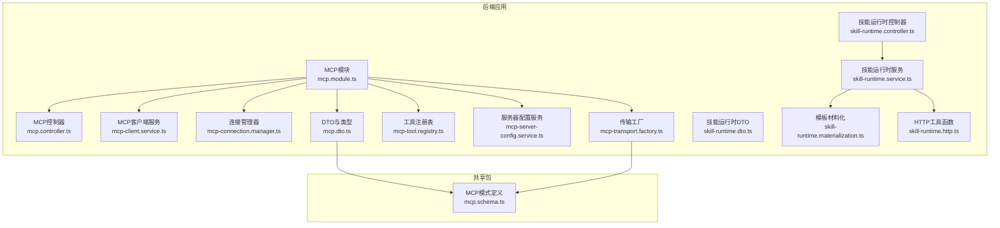
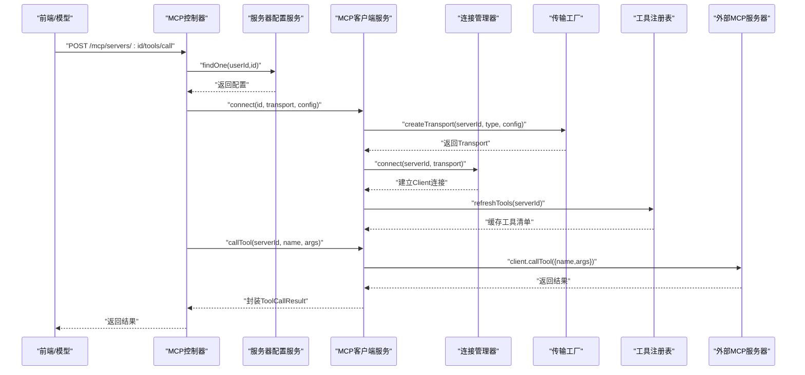
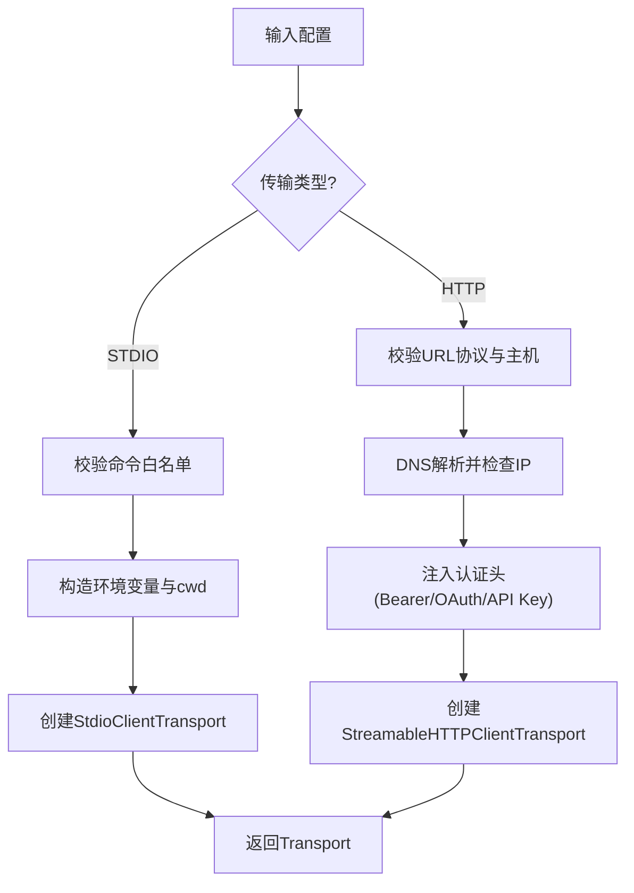
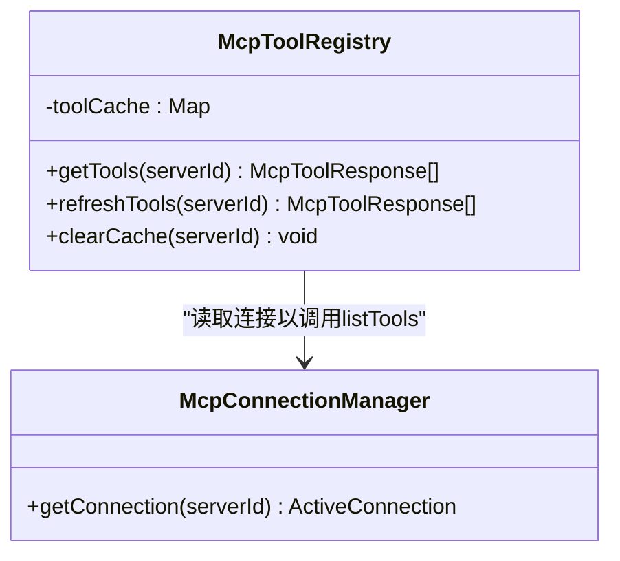
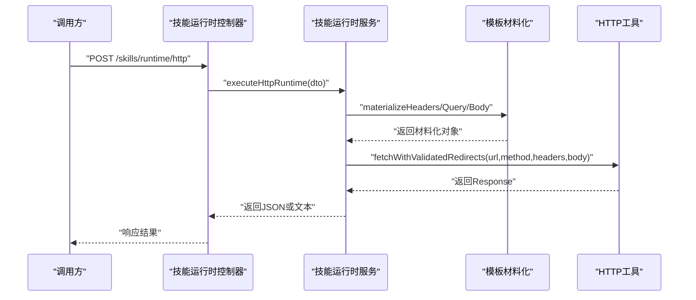
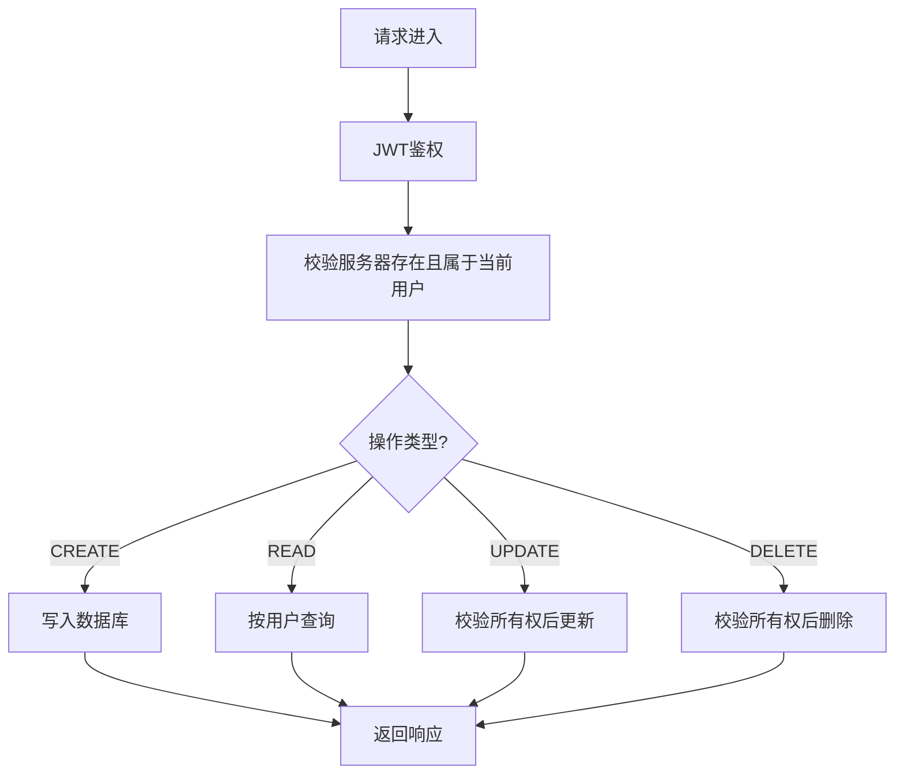
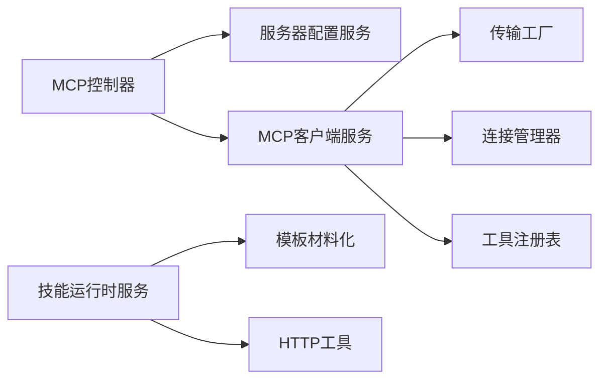

# 工具集成

<cite>
**本文引用的文件**
- [apps/backend/src/mcp/mcp.module.ts](file://apps/backend/src/mcp/mcp.module.ts)
- [apps/backend/src/mcp/mcp.controller.ts](file://apps/backend/src/mcp/mcp.controller.ts)
- [apps/backend/src/mcp/mcp-client.service.ts](file://apps/backend/src/mcp/mcp-client.service.ts)
- [apps/backend/src/mcp/core/mcp-connection.manager.ts](file://apps/backend/src/mcp/core/mcp-connection.manager.ts)
- [apps/backend/src/mcp/core/mcp-transport.factory.ts](file://apps/backend/src/mcp/core/mcp-transport.factory.ts)
- [apps/backend/src/mcp/core/mcp-tool.registry.ts](file://apps/backend/src/mcp/core/mcp-tool.registry.ts)
- [apps/backend/src/mcp/mcp-server-config.service.ts](file://apps/backend/src/mcp/mcp-server-config.service.ts)
- [apps/backend/src/mcp/mcp.dto.ts](file://apps/backend/src/mcp/mcp.dto.ts)
- [packages/shared/src/schemas/mcp.schema.ts](file://packages/shared/src/schemas/mcp.schema.ts)
- [apps/backend/src/skill-sources/skill-runtime.service.ts](file://apps/backend/src/skill-sources/skill-runtime.service.ts)
- [apps/backend/src/skill-sources/skill-runtime.controller.ts](file://apps/backend/src/skill-sources/skill-runtime.controller.ts)
- [apps/backend/src/skill-sources/skill-runtime.dto.ts](file://apps/backend/src/skill-sources/skill-runtime.dto.ts)
- [apps/backend/src/skill-sources/skill-runtime.materialization.ts](file://apps/backend/src/skill-sources/skill-runtime.materialization.ts)
- [apps/backend/src/skill-sources/skill-runtime.http.ts](file://apps/backend/src/skill-sources/skill-runtime.http.ts)
- [apps/backend/src/common/throttling/throttling.constants.ts](file://apps/backend/src/common/throttling/throttling.constants.ts)
</cite>

## 目录
1. [简介](#简介)
2. [项目结构](#项目结构)
3. [核心组件](#核心组件)
4. [架构总览](#架构总览)
5. [详细组件分析](#详细组件分析)
6. [依赖关系分析](#依赖关系分析)
7. [性能考量](#性能考量)
8. [故障排查指南](#故障排查指南)
9. [结论](#结论)
10. [附录](#附录)

## 简介
本文件面向AI助手的工具集成功能，系统性阐述MCP（Model Context Protocol）工具调用机制、技能运行时系统、工具发现与管理流程。内容覆盖工具调用生命周期、参数传递与结果处理、错误恢复策略；同时说明内置工具与第三方工具的集成方式（HTTP API调用、本地工具执行、异步任务处理），并给出技能系统的架构设计（技能注册、权限控制、资源管理）。文末提供工具开发示例与最佳实践，以及性能监控、安全防护与故障排查策略。

## 项目结构
后端采用NestJS模块化组织，MCP相关能力集中在mcp子模块，技能运行时能力集中在skill-sources子模块。共享模式定义位于packages/shared，前后端复用一致的Schema与类型约束。

图表来源
- [apps/backend/src/mcp/mcp.module.ts:1-25](file://apps/backend/src/mcp/mcp.module.ts#L1-L25)
- [apps/backend/src/mcp/mcp.controller.ts:1-209](file://apps/backend/src/mcp/mcp.controller.ts#L1-L209)
- [apps/backend/src/mcp/mcp-client.service.ts:1-124](file://apps/backend/src/mcp/mcp-client.service.ts#L1-L124)
- [apps/backend/src/mcp/core/mcp-connection.manager.ts:1-101](file://apps/backend/src/mcp/core/mcp-connection.manager.ts#L1-L101)
- [apps/backend/src/mcp/core/mcp-transport.factory.ts:1-220](file://apps/backend/src/mcp/core/mcp-transport.factory.ts#L1-L220)
- [apps/backend/src/mcp/core/mcp-tool.registry.ts:1-48](file://apps/backend/src/mcp/core/mcp-tool.registry.ts#L1-L48)
- [apps/backend/src/mcp/mcp-server-config.service.ts:1-156](file://apps/backend/src/mcp/mcp-server-config.service.ts#L1-L156)
- [apps/backend/src/mcp/mcp.dto.ts:1-59](file://apps/backend/src/mcp/mcp.dto.ts#L1-L59)
- [packages/shared/src/schemas/mcp.schema.ts:1-220](file://packages/shared/src/schemas/mcp.schema.ts#L1-L220)
- [apps/backend/src/skill-sources/skill-runtime.controller.ts:1-23](file://apps/backend/src/skill-sources/skill-runtime.controller.ts#L1-L23)
- [apps/backend/src/skill-sources/skill-runtime.service.ts:1-97](file://apps/backend/src/skill-sources/skill-runtime.service.ts#L1-L97)
- [apps/backend/src/skill-sources/skill-runtime.dto.ts:1-98](file://apps/backend/src/skill-sources/skill-runtime.dto.ts#L1-L98)
- [apps/backend/src/skill-sources/skill-runtime.materialization.ts:1-183](file://apps/backend/src/skill-sources/skill-runtime.materialization.ts#L1-L183)
- [apps/backend/src/skill-sources/skill-runtime.http.ts:1-123](file://apps/backend/src/skill-sources/skill-runtime.http.ts#L1-L123)

章节来源
- [apps/backend/src/mcp/mcp.module.ts:1-25](file://apps/backend/src/mcp/mcp.module.ts#L1-L25)
- [apps/backend/src/mcp/mcp.controller.ts:1-209](file://apps/backend/src/mcp/mcp.controller.ts#L1-L209)
- [apps/backend/src/mcp/mcp-client.service.ts:1-124](file://apps/backend/src/mcp/mcp-client.service.ts#L1-L124)
- [apps/backend/src/mcp/core/mcp-connection.manager.ts:1-101](file://apps/backend/src/mcp/core/mcp-connection.manager.ts#L1-L101)
- [apps/backend/src/mcp/core/mcp-transport.factory.ts:1-220](file://apps/backend/src/mcp/core/mcp-transport.factory.ts#L1-L220)
- [apps/backend/src/mcp/core/mcp-tool.registry.ts:1-48](file://apps/backend/src/mcp/core/mcp-tool.registry.ts#L1-L48)
- [apps/backend/src/mcp/mcp-server-config.service.ts:1-156](file://apps/backend/src/mcp/mcp-server-config.service.ts#L1-L156)
- [apps/backend/src/mcp/mcp.dto.ts:1-59](file://apps/backend/src/mcp/mcp.dto.ts#L1-L59)
- [packages/shared/src/schemas/mcp.schema.ts:1-220](file://packages/shared/src/schemas/mcp.schema.ts#L1-L220)
- [apps/backend/src/skill-sources/skill-runtime.controller.ts:1-23](file://apps/backend/src/skill-sources/skill-runtime.controller.ts#L1-L23)
- [apps/backend/src/skill-sources/skill-runtime.service.ts:1-97](file://apps/backend/src/skill-sources/skill-runtime.service.ts#L1-L97)
- [apps/backend/src/skill-sources/skill-runtime.dto.ts:1-98](file://apps/backend/src/skill-sources/skill-runtime.dto.ts#L1-L98)
- [apps/backend/src/skill-sources/skill-runtime.materialization.ts:1-183](file://apps/backend/src/skill-sources/skill-runtime.materialization.ts#L1-L183)
- [apps/backend/src/skill-sources/skill-runtime.http.ts:1-123](file://apps/backend/src/skill-sources/skill-runtime.http.ts#L1-L123)

## 核心组件
- MCP模块：聚合控制器、客户端服务、传输工厂、连接管理器、工具注册表，统一暴露配置与调用能力。
- MCP控制器：提供服务器配置CRUD、连接/断开、工具发现与调用等REST接口，并施加JWT鉴权与节流保护。
- MCP客户端服务：门面层，封装连接、工具列表获取、工具调用与连接状态查询。
- 连接管理器：维护活跃连接，负责Client实例创建、连接建立/关闭、事件监听与清理。
- 传输工厂：根据配置创建STDIO或HTTP传输，内置安全检查（主机名/IP白名单、协议限制、命令白名单）。
- 工具注册表：缓存工具清单，支持刷新与清理，避免重复RPC调用。
- 服务器配置服务：基于Prisma的用户级MCP服务器配置CRUD与权限校验。
- 技能运行时：对HTTP技能进行请求模板化、参数绑定、安全校验与重定向处理，统一超时控制与错误映射。

章节来源
- [apps/backend/src/mcp/mcp.module.ts:1-25](file://apps/backend/src/mcp/mcp.module.ts#L1-L25)
- [apps/backend/src/mcp/mcp.controller.ts:1-209](file://apps/backend/src/mcp/mcp.controller.ts#L1-L209)
- [apps/backend/src/mcp/mcp-client.service.ts:1-124](file://apps/backend/src/mcp/mcp-client.service.ts#L1-L124)
- [apps/backend/src/mcp/core/mcp-connection.manager.ts:1-101](file://apps/backend/src/mcp/core/mcp-connection.manager.ts#L1-L101)
- [apps/backend/src/mcp/core/mcp-transport.factory.ts:1-220](file://apps/backend/src/mcp/core/mcp-transport.factory.ts#L1-L220)
- [apps/backend/src/mcp/core/mcp-tool.registry.ts:1-48](file://apps/backend/src/mcp/core/mcp-tool.registry.ts#L1-L48)
- [apps/backend/src/mcp/mcp-server-config.service.ts:1-156](file://apps/backend/src/mcp/mcp-server-config.service.ts#L1-L156)
- [apps/backend/src/skill-sources/skill-runtime.controller.ts:1-23](file://apps/backend/src/skill-sources/skill-runtime.controller.ts#L1-L23)
- [apps/backend/src/skill-sources/skill-runtime.service.ts:1-97](file://apps/backend/src/skill-sources/skill-runtime.service.ts#L1-L97)

## 架构总览
下图展示MCP工具调用从API入口到外部工具的完整链路，以及技能运行时的HTTP执行路径。

图表来源
- [apps/backend/src/mcp/mcp.controller.ts:187-208](file://apps/backend/src/mcp/mcp.controller.ts#L187-L208)
- [apps/backend/src/mcp/mcp-client.service.ts:30-108](file://apps/backend/src/mcp/mcp-client.service.ts#L30-L108)
- [apps/backend/src/mcp/core/mcp-connection.manager.ts:23-73](file://apps/backend/src/mcp/core/mcp-connection.manager.ts#L23-L73)
- [apps/backend/src/mcp/core/mcp-transport.factory.ts:112-126](file://apps/backend/src/mcp/core/mcp-transport.factory.ts#L112-L126)
- [apps/backend/src/mcp/core/mcp-tool.registry.ts:20-42](file://apps/backend/src/mcp/core/mcp-tool.registry.ts#L20-L42)
- [apps/backend/src/mcp/mcp-server-config.service.ts:50-60](file://apps/backend/src/mcp/mcp-server-config.service.ts#L50-L60)

## 详细组件分析

### MCP工具调用生命周期
- 权限与节流：所有MCP相关接口均使用JWT守卫与节流配置，防止滥用。
- 连接策略：按需懒连接；若未连接则在工具发现与调用前自动建立连接。
- 工具发现：遍历用户启用的服务器，拉取工具清单并注入serverId便于前端/模型识别归属。
- 工具调用：校验工具存在性，发起RPC调用，记录日志并封装结果。

图表来源
- [apps/backend/src/mcp/mcp.controller.ts:112-136](file://apps/backend/src/mcp/mcp.controller.ts#L112-L136)
- [apps/backend/src/mcp/mcp.controller.ts:187-208](file://apps/backend/src/mcp/mcp.controller.ts#L187-L208)
- [apps/backend/src/mcp/mcp-client.service.ts:60-108](file://apps/backend/src/mcp/mcp-client.service.ts#L60-L108)
- [apps/backend/src/mcp/core/mcp-tool.registry.ts:12-42](file://apps/backend/src/mcp/core/mcp-tool.registry.ts#L12-L42)

章节来源
- [apps/backend/src/mcp/mcp.controller.ts:112-136](file://apps/backend/src/mcp/mcp.controller.ts#L112-L136)
- [apps/backend/src/mcp/mcp.controller.ts:187-208](file://apps/backend/src/mcp/mcp.controller.ts#L187-L208)
- [apps/backend/src/mcp/mcp-client.service.ts:60-108](file://apps/backend/src/mcp/mcp-client.service.ts#L60-L108)
- [apps/backend/src/mcp/core/mcp-tool.registry.ts:12-42](file://apps/backend/src/mcp/core/mcp-tool.registry.ts#L12-L42)

### 传输工厂与安全策略
- STDIO传输：支持命令白名单、环境变量透传、工作目录与stderr捕获；生产环境需显式允许命令。
- HTTP传输：仅允许http/https，禁止localhost与内网地址解析；支持Bearer/OAuth/API Key认证头注入；严格限制重定向次数与方法转换。
- 安全边界：禁止私有/回环IP与特定域名后缀；DNS解析失败或解析到黑名单IP直接拒绝。

图表来源
- [apps/backend/src/mcp/core/mcp-transport.factory.ts:112-126](file://apps/backend/src/mcp/core/mcp-transport.factory.ts#L112-L126)
- [apps/backend/src/mcp/core/mcp-transport.factory.ts:128-188](file://apps/backend/src/mcp/core/mcp-transport.factory.ts#L128-L188)
- [apps/backend/src/mcp/core/mcp-transport.factory.ts:190-218](file://apps/backend/src/mcp/core/mcp-transport.factory.ts#L190-L218)
- [apps/backend/src/skill-sources/skill-runtime.http.ts:50-69](file://apps/backend/src/skill-sources/skill-runtime.http.ts#L50-L69)
- [apps/backend/src/skill-sources/skill-runtime.http.ts:75-122](file://apps/backend/src/skill-sources/skill-runtime.http.ts#L75-L122)

章节来源
- [apps/backend/src/mcp/core/mcp-transport.factory.ts:1-220](file://apps/backend/src/mcp/core/mcp-transport.factory.ts#L1-L220)
- [apps/backend/src/skill-sources/skill-runtime.http.ts:1-123](file://apps/backend/src/skill-sources/skill-runtime.http.ts#L1-L123)

### 工具注册与缓存
- 缓存策略：以serverId为键缓存工具清单，首次访问或刷新时调用远端listTools并持久化。
- 清理策略：断开连接或手动清理时删除缓存，避免脏数据。
- 错误处理：刷新失败时返回上次缓存或空数组，保证稳定性。

图表来源
- [apps/backend/src/mcp/core/mcp-tool.registry.ts:1-48](file://apps/backend/src/mcp/core/mcp-tool.registry.ts#L1-L48)
- [apps/backend/src/mcp/core/mcp-connection.manager.ts:89-95](file://apps/backend/src/mcp/core/mcp-connection.manager.ts#L89-L95)

章节来源
- [apps/backend/src/mcp/core/mcp-tool.registry.ts:1-48](file://apps/backend/src/mcp/core/mcp-tool.registry.ts#L1-L48)

### 技能运行时系统
- 模板与绑定：支持在headers/query/body中使用$source(arg/secret)进行参数绑定，可设置默认值、前缀/后缀拼接。
- 材料化：递归解析模板，按上下文替换为最终标量或对象；严格校验输出类型。
- HTTP执行：统一超时控制、安全URL校验、最多5次重定向、自动方法降级（303/301+POST→GET）。
- 错误映射：BadGateway/BadRequest异常保留原语义，其他异常统一封装为技能运行时失败。

图表来源
- [apps/backend/src/skill-sources/skill-runtime.controller.ts:16-21](file://apps/backend/src/skill-sources/skill-runtime.controller.ts#L16-L21)
- [apps/backend/src/skill-sources/skill-runtime.service.ts:14-95](file://apps/backend/src/skill-sources/skill-runtime.service.ts#L14-L95)
- [apps/backend/src/skill-sources/skill-runtime.materialization.ts:134-175](file://apps/backend/src/skill-sources/skill-runtime.materialization.ts#L134-L175)
- [apps/backend/src/skill-sources/skill-runtime.http.ts:75-122](file://apps/backend/src/skill-sources/skill-runtime.http.ts#L75-L122)

章节来源
- [apps/backend/src/skill-sources/skill-runtime.controller.ts:1-23](file://apps/backend/src/skill-sources/skill-runtime.controller.ts#L1-L23)
- [apps/backend/src/skill-sources/skill-runtime.service.ts:1-97](file://apps/backend/src/skill-sources/skill-runtime.service.ts#L1-L97)
- [apps/backend/src/skill-sources/skill-runtime.dto.ts:1-98](file://apps/backend/src/skill-sources/skill-runtime.dto.ts#L1-L98)
- [apps/backend/src/skill-sources/skill-runtime.materialization.ts:1-183](file://apps/backend/src/skill-sources/skill-runtime.materialization.ts#L1-L183)
- [apps/backend/src/skill-sources/skill-runtime.http.ts:1-123](file://apps/backend/src/skill-sources/skill-runtime.http.ts#L1-L123)

### 服务器配置与权限控制
- 用户隔离：所有CRUD操作均校验userId，防止越权访问。
- 启用过滤：工具发现仅针对enabled=true的服务器。
- DTO约束：前后端共享Schema，确保传输一致性与安全性。

图表来源
- [apps/backend/src/mcp/mcp-server-config.service.ts:18-33](file://apps/backend/src/mcp/mcp-server-config.service.ts#L18-L33)
- [apps/backend/src/mcp/mcp-server-config.service.ts:49-60](file://apps/backend/src/mcp/mcp-server-config.service.ts#L49-L60)
- [apps/backend/src/mcp/mcp-server-config.service.ts:65-83](file://apps/backend/src/mcp/mcp-server-config.service.ts#L65-L83)
- [apps/backend/src/mcp/mcp-server-config.service.ts:88-96](file://apps/backend/src/mcp/mcp-server-config.service.ts#L88-L96)
- [apps/backend/src/mcp/mcp-server-config.service.ts:102-109](file://apps/backend/src/mcp/mcp-server-config.service.ts#L102-L109)

章节来源
- [apps/backend/src/mcp/mcp-server-config.service.ts:1-156](file://apps/backend/src/mcp/mcp-server-config.service.ts#L1-L156)
- [packages/shared/src/schemas/mcp.schema.ts:123-173](file://packages/shared/src/schemas/mcp.schema.ts#L123-L173)

## 依赖关系分析
- 控制器依赖配置服务与客户端服务，实现业务编排。
- 客户端服务依赖传输工厂、连接管理器与工具注册表，形成清晰的分层。
- 传输工厂与HTTP工具共同保障网络层安全。
- 技能运行时服务依赖材料化与HTTP工具，完成模板到实际请求的转换。

图表来源
- [apps/backend/src/mcp/mcp.controller.ts:43-46](file://apps/backend/src/mcp/mcp.controller.ts#L43-L46)
- [apps/backend/src/mcp/mcp-client.service.ts:21-28](file://apps/backend/src/mcp/mcp-client.service.ts#L21-L28)
- [apps/backend/src/skill-sources/skill-runtime.service.ts:1-12](file://apps/backend/src/skill-sources/skill-runtime.service.ts#L1-L12)

章节来源
- [apps/backend/src/mcp/mcp.controller.ts:1-209](file://apps/backend/src/mcp/mcp.controller.ts#L1-L209)
- [apps/backend/src/mcp/mcp-client.service.ts:1-124](file://apps/backend/src/mcp/mcp-client.service.ts#L1-L124)
- [apps/backend/src/skill-sources/skill-runtime.service.ts:1-97](file://apps/backend/src/skill-sources/skill-runtime.service.ts#L1-L97)

## 性能考量
- 连接复用：连接管理器维护活跃连接，避免频繁重建。
- 工具缓存：工具注册表缓存工具清单，减少RPC调用频次。
- 懒加载：工具发现与调用前按需连接，降低启动成本。
- 节流保护：对连接、工具发现与调用设置阈值，防止突发流量。
- 超时控制：技能运行时默认超时与最大重定向限制，避免长时间阻塞。

章节来源
- [apps/backend/src/mcp/core/mcp-tool.registry.ts:12-18](file://apps/backend/src/mcp/core/mcp-tool.registry.ts#L12-L18)
- [apps/backend/src/mcp/core/mcp-connection.manager.ts:23-73](file://apps/backend/src/mcp/core/mcp-connection.manager.ts#L23-L73)
- [apps/backend/src/skill-sources/skill-runtime.service.ts:10-10](file://apps/backend/src/skill-sources/skill-runtime.service.ts#L10-L10)
- [apps/backend/src/common/throttling/throttling.constants.ts:1-200](file://apps/backend/src/common/throttling/throttling.constants.ts#L1-L200)

## 故障排查指南
- 连接失败
  - 检查传输配置与安全策略（STDIO命令白名单、HTTP协议与主机限制）。
  - 查看stderr日志与onclose/onerror事件，确认进程退出原因。
- 工具不可用
  - 确认服务器已启用且已连接；必要时触发一次工具刷新。
  - 核对工具名称大小写与参数schema。
- 超时与重定向
  - 技能运行时默认超时，适当增大timeoutMs。
  - 检查重定向链路与方法降级（303/301+POST→GET）。
- 权限与鉴权
  - 确保JWT有效且服务器配置属于当前用户。
  - 检查节流阈值，避免被限流拦截。

章节来源
- [apps/backend/src/mcp/core/mcp-transport.factory.ts:91-110](file://apps/backend/src/mcp/core/mcp-transport.factory.ts#L91-L110)
- [apps/backend/src/mcp/core/mcp-connection.manager.ts:44-58](file://apps/backend/src/mcp/core/mcp-connection.manager.ts#L44-L58)
- [apps/backend/src/mcp/mcp-client.service.ts:74-108](file://apps/backend/src/mcp/mcp-client.service.ts#L74-L108)
- [apps/backend/src/skill-sources/skill-runtime.http.ts:75-122](file://apps/backend/src/skill-sources/skill-runtime.http.ts#L75-L122)
- [apps/backend/src/mcp/mcp-server-config.service.ts:114-127](file://apps/backend/src/mcp/mcp-server-config.service.ts#L114-L127)

## 结论
本系统通过模块化的MCP与技能运行时能力，提供了安全、可控、高性能的工具集成方案。MCP侧以传输工厂与连接管理器为核心，结合工具注册表缓存与懒连接策略，实现稳定的外部工具调用；技能运行时以模板化与安全HTTP校验为基础，支撑复杂参数与多源数据的统一执行。配合JWT鉴权与节流策略，满足生产环境的安全与可靠性要求。

## 附录

### 工具开发示例（步骤指引）
- 配置MCP服务器
  - 选择STDIO或HTTP传输，填写对应配置；启用开关控制是否参与工具发现。
  - 参考：[MCP服务器配置Schema:123-173](file://packages/shared/src/schemas/mcp.schema.ts#L123-L173)
- 发现与调用工具
  - 使用“获取所有工具”接口自动发现已启用服务器的工具；或按服务器ID查询工具。
  - 调用工具时提供工具名与参数，SDK会自动校验工具存在性并发起RPC。
  - 参考：[MCP控制器工具接口:112-136](file://apps/backend/src/mcp/mcp.controller.ts#L112-L136), [MCP客户端调用:70-108](file://apps/backend/src/mcp/mcp-client.service.ts#L70-L108)
- 自定义HTTP技能
  - 在runtime中定义HTTP请求模板，使用$source绑定参数与密钥，设置headers/query/body与超时。
  - 参考：[技能运行时DTO:62-91](file://apps/backend/src/skill-sources/skill-runtime.dto.ts#L62-L91), [模板材料化:134-175](file://apps/backend/src/skill-sources/skill-runtime.materialization.ts#L134-L175), [HTTP执行:75-122](file://apps/backend/src/skill-sources/skill-runtime.http.ts#L75-L122)
- 安全与合规
  - STDIO命令需白名单；HTTP仅允许公网地址；禁止私有/回环网络访问。
  - 参考：[传输工厂安全策略:91-110](file://apps/backend/src/mcp/core/mcp-transport.factory.ts#L91-L110), [技能运行时HTTP校验:50-69](file://apps/backend/src/skill-sources/skill-runtime.http.ts#L50-L69)

章节来源
- [packages/shared/src/schemas/mcp.schema.ts:123-173](file://packages/shared/src/schemas/mcp.schema.ts#L123-L173)
- [apps/backend/src/mcp/mcp.controller.ts:112-136](file://apps/backend/src/mcp/mcp.controller.ts#L112-L136)
- [apps/backend/src/mcp/mcp-client.service.ts:70-108](file://apps/backend/src/mcp/mcp-client.service.ts#L70-L108)
- [apps/backend/src/skill-sources/skill-runtime.dto.ts:62-91](file://apps/backend/src/skill-sources/skill-runtime.dto.ts#L62-L91)
- [apps/backend/src/skill-sources/skill-runtime.materialization.ts:134-175](file://apps/backend/src/skill-sources/skill-runtime.materialization.ts#L134-L175)
- [apps/backend/src/skill-sources/skill-runtime.http.ts:50-69](file://apps/backend/src/skill-sources/skill-runtime.http.ts#L50-L69)
- [apps/backend/src/mcp/core/mcp-transport.factory.ts:91-110](file://apps/backend/src/mcp/core/mcp-transport.factory.ts#L91-L110)