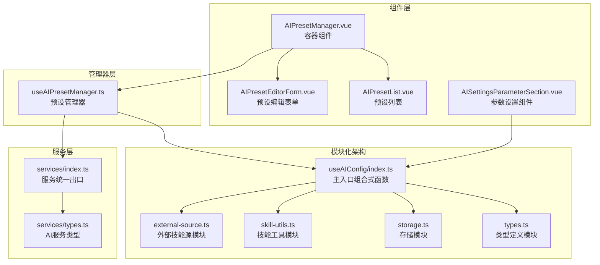
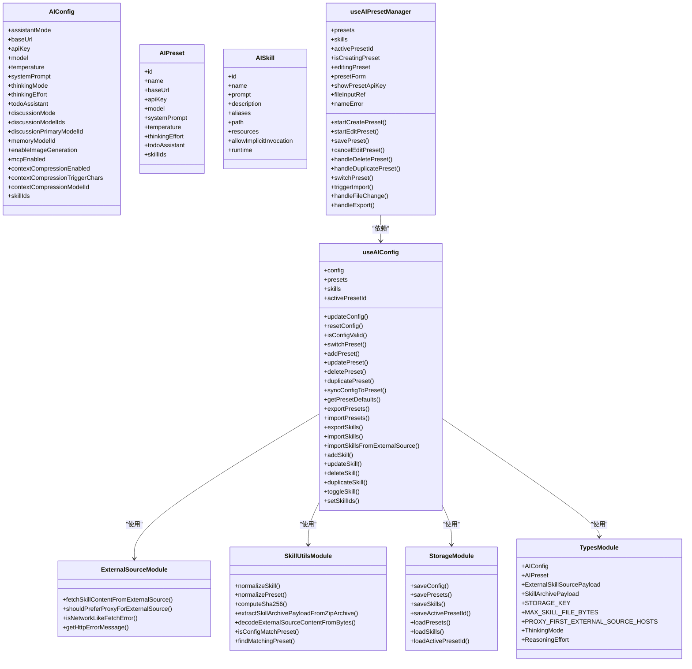
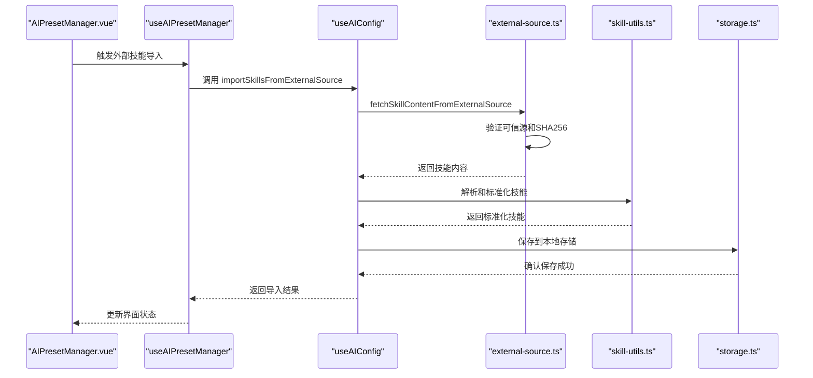
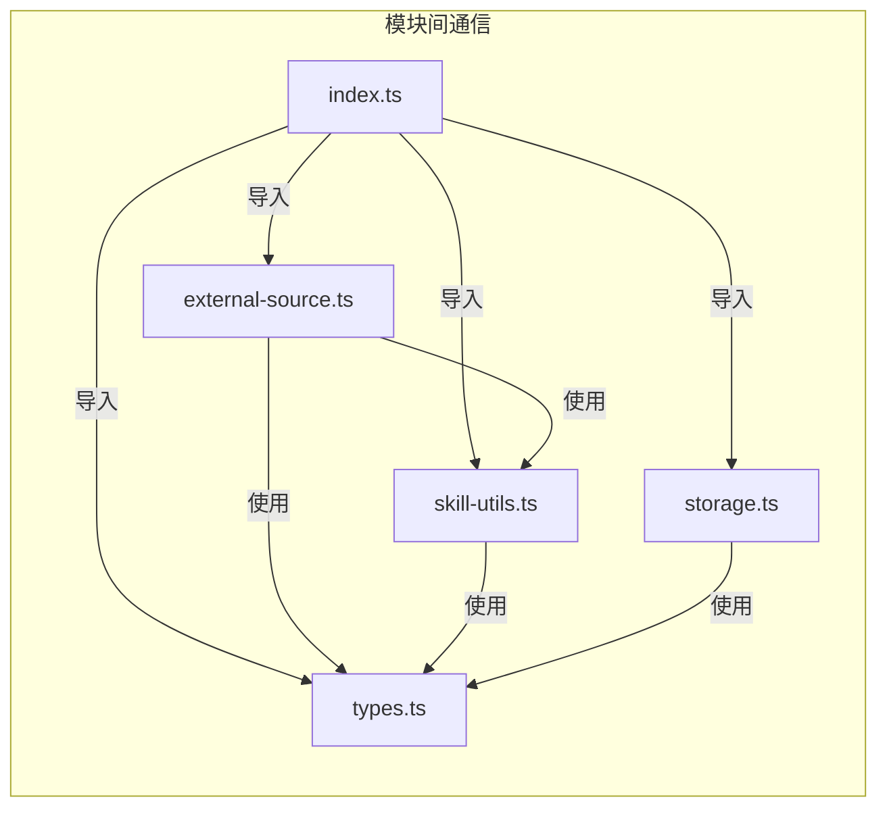
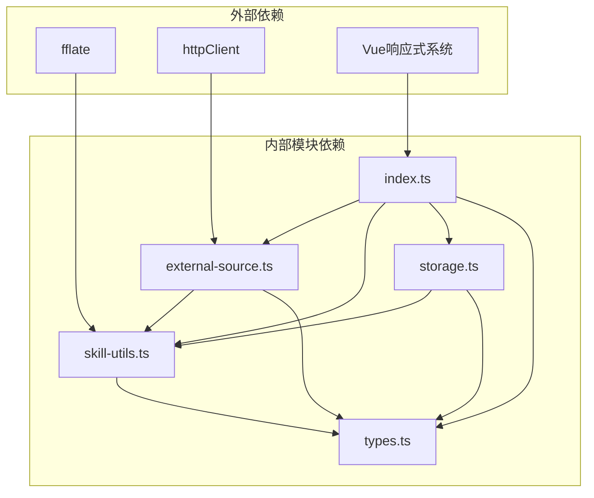

# 预设配置

<cite>
**本文引用的文件**
- [index.ts](file://apps/frontend/src/features/ai/composables/useAIConfig/index.ts)
- [external-source.ts](file://apps/frontend/src/features/ai/composables/useAIConfig/external-source.ts)
- [skill-utils.ts](file://apps/frontend/src/features/ai/composables/useAIConfig/skill-utils.ts)
- [storage.ts](file://apps/frontend/src/features/ai/composables/useAIConfig/storage.ts)
- [types.ts](file://apps/frontend/src/features/ai/composables/useAIConfig/types.ts)
- [useAIPresetManager.ts](file://apps/frontend/src/features/ai/composables/useAIPresetManager.ts)
- [AIPresetManager.vue](file://apps/frontend/src/features/ai/components/AIPresetManager.vue)
- [AIPresetEditorForm.vue](file://apps/frontend/src/features/ai/components/AIPresetEditorForm.vue)
- [AIPresetList.vue](file://apps/frontend/src/features/ai/components/AIPresetList.vue)
- [AISettingsParameterSection.vue](file://apps/frontend/src/features/ai/components/AISettingsParameterSection.vue)
- [types.ts](file://apps/frontend/src/features/ai/services/types.ts)
- [index.ts](file://apps/frontend/src/features/ai/services/index.ts)
- [useAIConfig.spec.ts](file://apps/frontend/tests/features/ai/composables/useAIConfig.spec.ts)
- [AIPresetEditorForm.spec.ts](file://apps/frontend/tests/features/ai/components/AIPresetEditorForm.spec.ts)
</cite>

## 更新摘要
**所做更改**
- 新增推理强度类型定义和 thinkingEffort 字段支持
- 增强预设管理功能，包含智能预设比较算法
- 完善推理强度的标准化处理和 UI 控件
- 优化预设同步和冲突解决机制
- 增强配置匹配算法，支持更精确的状态同步

## 目录
1. [简介](#简介)
2. [项目结构](#项目结构)
3. [核心组件](#核心组件)
4. [架构总览](#架构总览)
5. [详细组件分析](#详细组件分析)
6. [推理强度系统](#推理强度系统)
7. [智能预设比较](#智能预设比较)
8. [模块化架构详解](#模块化架构详解)
9. [依赖分析](#依赖分析)
10. [性能考量](#性能考量)
11. [故障排查指南](#故障排查指南)
12. [结论](#结论)
13. [附录](#附录)

## 简介
本文档全面介绍重构后的AI助手预设配置系统。系统已从单一useAIConfig组件重构为模块化架构，通过external-source.ts、skill-utils.ts、storage.ts、types.ts等核心模块，提供了更强大的外部技能源集成、技能管理和存储系统。新架构支持更灵活的配置管理、增强的安全验证、优化的性能表现和完善的错误处理机制。

**更新重点**：本次更新引入了推理强度类型定义（ReasoningEffort）和thinkingEffort字段，增强了预设管理的智能化程度，实现了更精确的配置匹配和同步机制。

## 项目结构
重构后的预设配置系统采用完全模块化的架构设计，将原本集中在单一组件中的功能分解为独立的模块：

- **模块化组合式函数层**：useAIConfig/index.ts作为主入口，整合各个功能模块
- **外部技能源模块**：external-source.ts专门处理外部技能内容获取和验证
- **技能工具模块**：skill-utils.ts提供技能标准化、编码解码、SHA256校验等工具函数
- **存储模块**：storage.ts负责配置的持久化存储和加载
- **类型定义模块**：types.ts统一管理所有类型定义和配置常量
- **管理器层**：useAIPresetManager.ts提供用户界面交互和状态管理
- **组件层**：AIPresetManager.vue、AIPresetEditorForm.vue、AIPresetList.vue提供完整的UI界面
- **设置组件层**：AISettingsParameterSection.vue提供推理强度设置界面



**图表来源**
- [index.ts:1-915](file://apps/frontend/src/features/ai/composables/useAIConfig/index.ts#L1-L915)
- [external-source.ts:1-225](file://apps/frontend/src/features/ai/composables/useAIConfig/external-source.ts#L1-L225)
- [skill-utils.ts:1-500](file://apps/frontend/src/features/ai/composables/useAIConfig/skill-utils.ts#L1-L500)
- [storage.ts:1-84](file://apps/frontend/src/features/ai/composables/useAIConfig/storage.ts#L1-L84)
- [types.ts:1-95](file://apps/frontend/src/features/ai/composables/useAIConfig/types.ts#L1-L95)

**章节来源**
- [index.ts:1-915](file://apps/frontend/src/features/ai/composables/useAIConfig/index.ts#L1-L915)
- [external-source.ts:1-225](file://apps/frontend/src/features/ai/composables/useAIConfig/external-source.ts#L1-L225)
- [skill-utils.ts:1-500](file://apps/frontend/src/features/ai/composables/useAIConfig/skill-utils.ts#L1-L500)
- [storage.ts:1-84](file://apps/frontend/src/features/ai/composables/useAIConfig/storage.ts#L1-L84)
- [types.ts:1-95](file://apps/frontend/src/features/ai/composables/useAIConfig/types.ts#L1-L95)

## 核心组件
重构后的系统包含以下核心组件：

- **useAIConfig/index.ts**：主入口组合式函数，整合所有功能模块，提供完整的AI配置管理能力
- **external-source.ts**：专门处理外部技能内容获取，支持代理回退、SHA256校验、ZIP解包等功能
- **skill-utils.ts**：提供技能标准化、编码解码、内容类型检测、错误处理等核心工具函数
- **storage.ts**：负责配置的持久化存储，包括配置、预设、技能和激活预设ID的存储
- **types.ts**：统一管理所有类型定义、存储键名、大小限制和外部源配置常量
- **useAIPresetManager.ts**：预设管理器，负责UI表单状态、校验、增删改查、导入导出
- **AIPresetManager.vue**：容器组件，协调编辑与列表视图，绑定事件与状态
- **AIPresetEditorForm.vue**：预设编辑表单，支持API地址、模型、系统提示词、温度、技能启用等字段
- **AIPresetList.vue**：预设列表展示与操作入口
- **AISettingsParameterSection.vue**：参数设置组件，提供推理强度设置界面

**章节来源**
- [index.ts:197-915](file://apps/frontend/src/features/ai/composables/useAIConfig/index.ts#L197-L915)
- [external-source.ts:100-225](file://apps/frontend/src/features/ai/composables/useAIConfig/external-source.ts#L100-L225)
- [skill-utils.ts:1-500](file://apps/frontend/src/features/ai/composables/useAIConfig/skill-utils.ts#L1-L500)
- [storage.ts:1-84](file://apps/frontend/src/features/ai/composables/useAIConfig/storage.ts#L1-L84)
- [types.ts:1-95](file://apps/frontend/src/features/ai/composables/useAIConfig/types.ts#L1-L95)

## 架构总览
重构后的架构采用分层模块化设计，通过清晰的职责分离实现了更好的可维护性和扩展性：



**图表来源**
- [index.ts:197-915](file://apps/frontend/src/features/ai/composables/useAIConfig/index.ts#L197-L915)
- [external-source.ts:100-225](file://apps/frontend/src/features/ai/composables/useAIConfig/external-source.ts#L100-L225)
- [skill-utils.ts:297-500](file://apps/frontend/src/features/ai/composables/useAIConfig/skill-utils.ts#L297-L500)
- [storage.ts:1-84](file://apps/frontend/src/features/ai/composables/useAIConfig/storage.ts#L1-L84)
- [types.ts:1-95](file://apps/frontend/src/features/ai/composables/useAIConfig/types.ts#L1-L95)

**章节来源**
- [index.ts:197-915](file://apps/frontend/src/features/ai/composables/useAIConfig/index.ts#L197-L915)

## 详细组件分析

### useAIConfig：模块化配置管理核心
重构后的useAIConfig采用模块化设计，将功能分解为独立的模块：

- **模块导入与组合**
  - 导入各个功能模块：skill-utils.ts、external-source.ts、storage.ts、types.ts
  - 统一管理所有依赖关系和类型定义
- **状态管理优化**
  - 使用shallowRef管理skills状态，提升性能
  - 改进的watcher配置，减少不必要的重新渲染
- **核心功能增强**
  - 增强的外部技能导入功能，支持多种格式和验证
  - 改进的配置匹配算法，支持更精确的状态同步
  - 优化的错误处理和日志记录机制



**图表来源**
- [index.ts:619-636](file://apps/frontend/src/features/ai/composables/useAIConfig/index.ts#L619-L636)
- [external-source.ts:104-225](file://apps/frontend/src/features/ai/composables/useAIConfig/external-source.ts#L104-L225)
- [skill-utils.ts:370-426](file://apps/frontend/src/features/ai/composables/useAIConfig/skill-utils.ts#L370-L426)
- [storage.ts:8-38](file://apps/frontend/src/features/ai/composables/useAIConfig/storage.ts#L8-L38)

**章节来源**
- [index.ts:197-915](file://apps/frontend/src/features/ai/composables/useAIConfig/index.ts#L197-L915)

### 外部技能源模块：增强的内容获取系统
external-source.ts专门处理外部技能内容的获取和验证：

- **多源获取策略**
  - 支持直接HTTP请求和代理回退机制
  - 智能主机优先级判断，对特定域名优先使用代理
- **安全验证机制**
  - SHA256完整性校验，确保内容未被篡改
  - 可信源URL验证，防止恶意内容注入
  - 内容类型检测，防止HTML内容误判
- **错误处理优化**
  - 网络错误智能识别和分类
  - 详细的错误信息聚合和报告
  - 超时控制和资源清理机制

**章节来源**
- [external-source.ts:100-225](file://apps/frontend/src/features/ai/composables/useAIConfig/external-source.ts#L100-L225)

### 技能工具模块：核心工具函数库
skill-utils.ts提供完整的技能处理工具集：

- **编码解码工具**
  - UTF-8编码解码支持
  - Base64解码兼容多种运行时环境
  - 字节数组处理和合并工具
- **内容处理功能**
  - ZIP归档提取和验证
  - 技能清单解析和标准化
  - 内容类型检测和大小限制
- **验证和转换工具**
  - ID列表标准化处理
  - 技能别名和资源规范化
  - 配置与预设匹配算法

**章节来源**
- [skill-utils.ts:1-500](file://apps/frontend/src/features/ai/composables/useAIConfig/skill-utils.ts#L1-L500)

### 存储模块：优化的持久化系统
storage.ts提供高效的本地存储解决方案：

- **存储分离策略**
  - 配置、预设、技能分别存储，避免相互影响
  - 激活预设ID独立存储，支持快速访问
  - 自动数据标准化和验证
- **错误处理机制**
  - 完善的异常捕获和日志记录
  - 数据恢复和降级策略
  - 存储空间监控和清理

**章节来源**
- [storage.ts:1-84](file://apps/frontend/src/features/ai/composables/useAIConfig/storage.ts#L1-L84)

### 类型定义模块：统一的类型管理
types.ts集中管理所有类型定义和配置常量：

- **类型定义**
  - AIConfig和AIPreset接口定义
  - 外部技能源载荷类型
  - 技能归档载荷类型
  - **新增**：ThinkingMode和ReasoningEffort类型定义
- **配置常量**
  - 存储键名定义
  - 文件大小限制常量
  - 外部源配置参数
- **主机白名单**
  - 代理优先级主机列表
  - 可信源验证规则

**章节来源**
- [types.ts:1-95](file://apps/frontend/src/features/ai/composables/useAIConfig/types.ts#L1-L95)

## 推理强度系统

### 类型定义
系统引入了完整的推理强度类型定义，支持四种推理强度级别：

- **ThinkingMode**：AI思考级别，支持 'off' | 'auto' | 'high' | 'xhigh'
- **ReasoningEffort**：推理强度，与ThinkingMode共享相同类型定义
- **标准化处理**：通过normalizeReasoningEffort函数统一处理推理强度值

### 配置支持
推理强度在AI配置中得到完整支持：

- **默认值**：配置默认值为 'auto'
- **加载处理**：从本地存储加载时进行标准化处理
- **切换功能**：支持在预设之间切换推理强度
- **同步机制**：配置变更时自动同步推理强度设置

### UI集成
推理强度设置在多个界面中得到集成：

- **预设编辑表单**：AIPresetEditorForm.vue提供推理强度选择界面
- **设置参数界面**：AISettingsParameterSection.vue提供参数设置界面
- **实时显示**：当前推理强度在界面中实时显示

```mermaid
graph LR
subgraph "推理强度系统"
TM["ThinkingMode<br/>off | auto | high | xhigh"]
RE["ReasoningEffort<br/>off | auto | high | xhigh"]
NTL["normalizeThinkingLevel<br/>标准化函数"]
NRE["normalizeReasoningEffort<br/>推理强度标准化"]
CFG["AIConfig<br/>包含thinkingEffort字段"]
PRE["AIPreset<br/>包含thinkingEffort字段"]
END
TM --> NTL
RE --> NRE
NTL --> CFG
NRE --> PRE
```

**图表来源**
- [types.ts:1-4](file://apps/frontend/src/features/ai/composables/useAIConfig/types.ts#L1-L4)
- [index.ts:92-99](file://apps/frontend/src/features/ai/composables/useAIConfig/index.ts#L92-L99)
- [index.ts:61-88](file://apps/frontend/src/features/ai/composables/useAIConfig/index.ts#L61-L88)

**章节来源**
- [types.ts:1-4](file://apps/frontend/src/features/ai/composables/useAIConfig/types.ts#L1-L4)
- [index.ts:92-99](file://apps/frontend/src/features/ai/composables/useAIConfig/index.ts#L92-L99)
- [index.ts:61-88](file://apps/frontend/src/features/ai/composables/useAIConfig/index.ts#L61-L88)

## 智能预设比较

### 匹配算法
系统实现了智能预设比较算法，支持更精确的配置匹配：

- **技能集合匹配**：将技能ID数组排序后进行精确匹配
- **推理强度处理**：默认推理强度为 'auto'，支持空值处理
- **精度控制**：温度参数使用0.001的精度阈值进行比较
- **完整匹配**：除推理强度外，其他所有配置参数都需要精确匹配

### 算法实现
智能匹配算法的核心实现：

```typescript
export function isConfigMatchPreset(cfg: AIConfig, preset: AIPreset): boolean {
  const presetSkillIds = normalizeIdList(preset.skillIds).slice().sort()
  const configSkillIds = normalizeIdList(cfg.skillIds).slice().sort()
  const isSkillSetMatched =
    presetSkillIds.length === configSkillIds.length &&
    presetSkillIds.every((id, index) => id === configSkillIds[index])

  return (
    preset.baseUrl === cfg.baseUrl &&
    preset.apiKey === cfg.apiKey &&
    preset.model === cfg.model &&
    preset.systemPrompt === cfg.systemPrompt &&
    Math.abs(preset.temperature - cfg.temperature) < 0.001 &&
    (preset.thinkingEffort || 'auto') === cfg.thinkingEffort &&
    isSkillSetMatched
  )
}
```

### 预设激活
基于智能匹配的预设激活机制：

- **自动匹配**：配置变更时自动寻找最匹配的预设
- **保持激活**：如果当前激活的预设仍然匹配，则保持不变
- **精确同步**：匹配到的预设会精确同步到配置中

**章节来源**
- [skill-utils.ts:478-499](file://apps/frontend/src/features/ai/composables/useAIConfig/skill-utils.ts#L478-L499)
- [index.ts:196-213](file://apps/frontend/src/features/ai/composables/useAIConfig/index.ts#L196-L213)

## 模块化架构详解

### 模块职责分离
重构后的架构实现了明确的职责分离：

- **index.ts模块**：负责整体协调和功能组合
- **external-source.ts模块**：专注外部内容获取和安全验证
- **skill-utils.ts模块**：提供技能处理的核心工具函数
- **storage.ts模块**：处理数据持久化和加载
- **types.ts模块**：统一类型定义和配置常量

### 模块间通信机制
各模块通过明确定义的接口进行通信：



**图表来源**
- [index.ts:11-30](file://apps/frontend/src/features/ai/composables/useAIConfig/index.ts#L11-L30)
- [external-source.ts:1-25](file://apps/frontend/src/features/ai/composables/useAIConfig/external-source.ts#L1-L25)
- [skill-utils.ts:1-10](file://apps/frontend/src/features/ai/composables/useAIConfig/skill-utils.ts#L1-L10)
- [storage.ts:1-4](file://apps/frontend/src/features/ai/composables/useAIConfig/storage.ts#L1-L4)
- [types.ts:1-10](file://apps/frontend/src/features/ai/composables/useAIConfig/types.ts#L1-L10)

### 错误处理和安全机制
新架构增强了错误处理和安全验证：

- **多层验证**：URL验证、内容类型验证、SHA256校验
- **错误聚合**：详细的错误信息收集和报告
- **资源限制**：文件大小限制和内存使用控制
- **超时管理**：网络请求超时和资源清理

**章节来源**
- [external-source.ts:127-225](file://apps/frontend/src/features/ai/composables/useAIConfig/external-source.ts#L127-L225)
- [skill-utils.ts:79-83](file://apps/frontend/src/features/ai/composables/useAIConfig/skill-utils.ts#L79-L83)

## 依赖分析
重构后的依赖关系更加清晰和模块化：

- **内部模块依赖**
  - index.ts依赖所有其他模块，形成中心协调点
  - external-source.ts依赖skill-utils.ts进行内容处理
  - storage.ts依赖skill-utils.ts进行数据标准化
  - 所有模块都依赖types.ts进行类型定义
- **外部依赖**
  - fflate库用于ZIP解压功能
  - httpClient用于代理请求
  - Vue响应式系统用于状态管理
- **循环依赖避免**
  - 通过模块化设计避免了循环导入问题
  - 明确的导入顺序和依赖关系



**图表来源**
- [index.ts:11-30](file://apps/frontend/src/features/ai/composables/useAIConfig/index.ts#L11-L30)
- [external-source.ts:1-25](file://apps/frontend/src/features/ai/composables/useAIConfig/external-source.ts#L1-L25)
- [skill-utils.ts:1-10](file://apps/frontend/src/features/ai/composables/useAIConfig/skill-utils.ts#L1-L10)
- [storage.ts:1-4](file://apps/frontend/src/features/ai/composables/useAIConfig/storage.ts#L1-L4)

**章节来源**
- [index.ts:11-30](file://apps/frontend/src/features/ai/composables/useAIConfig/index.ts#L11-L30)

## 性能考量
重构后的架构在性能方面有显著改进：

- **模块化加载**
  - 按需加载各个功能模块，减少初始加载时间
  - 懒加载策略避免不必要的计算开销
- **状态管理优化**
  - 使用shallowRef管理技能状态，提升响应性能
  - 优化的watcher配置，减少不必要的重新渲染
- **内存使用控制**
  - 文件大小限制防止内存溢出
  - 资源清理和超时控制机制
- **缓存策略**
  - 本地存储缓存常用配置
  - 避免重复的网络请求和计算

## 故障排查指南
重构后的系统提供了更完善的故障排查机制：

- **外部技能导入失败**
  - 检查可信源验证和SHA256校验
  - 查看详细的错误信息聚合
  - 验证网络连接和代理配置
- **ZIP归档处理错误**
  - 检查文件大小限制和内容类型
  - 验证ZIP文件完整性和结构
  - 查看解压过程中的错误日志
- **存储操作异常**
  - 检查localStorage可用性和容量
  - 验证数据序列化和反序列化
  - 查看存储权限和浏览器兼容性
- **配置同步问题**
  - 检查配置匹配算法和ID标准化
  - 验证预设和配置的一致性
  - 查看状态变更的日志记录
- **推理强度处理问题**
  - 检查推理强度类型的标准化处理
  - 验证推理强度值的有效性
  - 查看推理强度在UI中的显示状态

**章节来源**
- [external-source.ts:193-225](file://apps/frontend/src/features/ai/composables/useAIConfig/external-source.ts#L193-L225)
- [skill-utils.ts:107-171](file://apps/frontend/src/features/ai/composables/useAIConfig/skill-utils.ts#L107-L171)
- [storage.ts:8-38](file://apps/frontend/src/features/ai/composables/useAIConfig/storage.ts#L8-L38)

## 结论
重构后的AI预设配置系统通过模块化架构实现了更好的可维护性、扩展性和安全性。新的架构设计不仅提升了系统的性能表现，还增强了对外部技能源的支持能力和错误处理机制。模块间的清晰职责分离使得系统更容易理解和维护，同时为未来的功能扩展奠定了坚实的基础。

**更新亮点**：本次更新引入的推理强度系统和智能预设比较功能，显著提升了配置管理的智能化程度，为用户提供更精确、更便捷的AI助手配置体验。

## 附录

### 配置示例与最佳实践
重构后的系统支持更灵活的配置管理：

- **对话风格配置**
  - 通过预设系统管理不同的对话风格
  - 支持技能组合和参数调整
  - 提供默认配置和自定义模板
- **推理强度配置**
  - 通过thinkingEffort字段控制推理强度
  - 支持四种推理强度级别：off、auto、high、xhigh
  - 在预设中单独配置推理强度
- **外部技能集成**
  - 支持多种外部技能源的导入
  - 完整的安全验证和完整性检查
  - 灵活的技能启用和禁用管理
- **性能优化建议**
  - 合理使用技能组合，避免过多依赖
  - 定期清理不需要的预设和技能
  - 监控存储使用情况和性能指标
- **安全最佳实践**
  - 仅导入可信来源的技能
  - 定期验证技能的SHA256完整性
  - 谨慎启用可能影响安全性的技能
- **智能预设管理**
  - 利用智能匹配算法自动找到最佳预设
  - 支持预设之间的精确同步
  - 提供预设冲突的自动解决机制