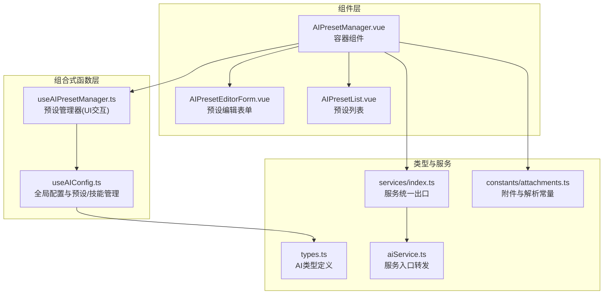
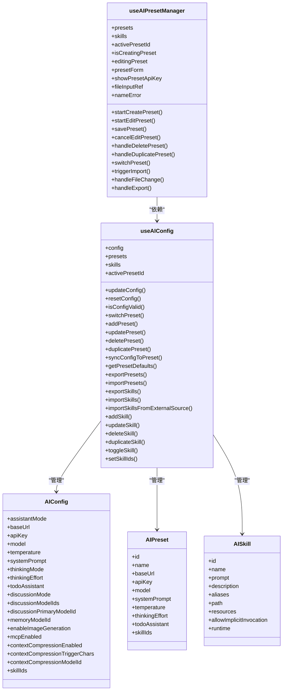
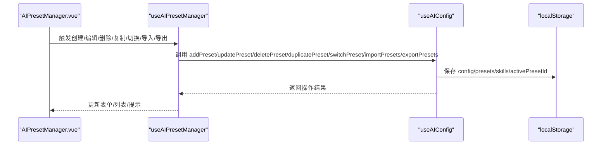
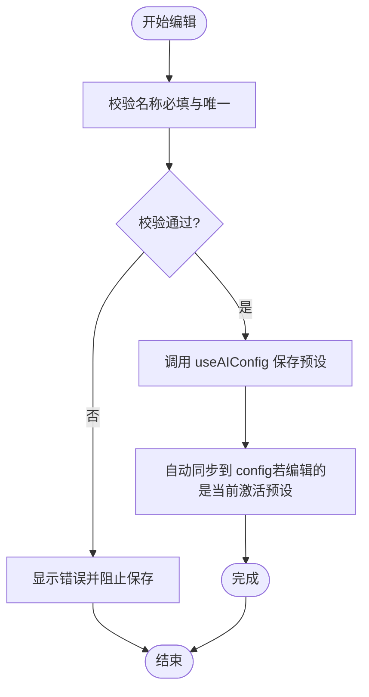
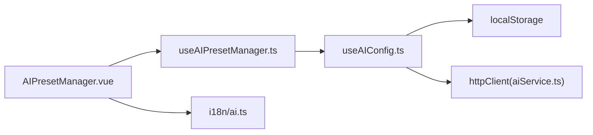

# 预设配置

<cite>
**本文引用的文件**
- [useAIConfig.ts](file://apps/frontend/src/features/ai/composables/useAIConfig.ts)
- [useAIPresetManager.ts](file://apps/frontend/src/features/ai/composables/useAIPresetManager.ts)
- [AIPresetManager.vue](file://apps/frontend/src/features/ai/components/AIPresetManager.vue)
- [AIPresetEditorForm.vue](file://apps/frontend/src/features/ai/components/AIPresetEditorForm.vue)
- [AIPresetList.vue](file://apps/frontend/src/features/ai/components/AIPresetList.vue)
- [types.ts](file://apps/frontend/src/features/ai/services/types.ts)
- [aiService.ts](file://apps/frontend/src/features/ai/services/aiService.ts)
- [index.ts](file://apps/frontend/src/features/ai/services/index.ts)
- [attachments.ts](file://apps/frontend/src/features/ai/constants/attachments.ts)
- [ai.ts](file://apps/frontend/src/i18n/locales/zh-CN/ai.ts)
</cite>

## 目录
1. [简介](#简介)
2. [项目结构](#项目结构)
3. [核心组件](#核心组件)
4. [架构总览](#架构总览)
5. [详细组件分析](#详细组件分析)
6. [依赖分析](#依赖分析)
7. [性能考量](#性能考量)
8. [故障排查指南](#故障排查指南)
9. [结论](#结论)
10. [附录](#附录)

## 简介
本文件面向 AI 助手的“预设配置系统”，系统性阐述 AI 配置架构、预设管理机制与参数模板体系，重点解析 useAIConfig 与 useAIPresetManager 组合式函数的实现原理，覆盖配置加载、保存、切换、编辑、创建、复制、删除、导入导出等全链路流程。文档还解释不同 AI 模型参数差异、默认配置策略、个性化定制选项，并提供配置验证、版本管理与兼容性处理机制说明，辅以可视化图示帮助读者快速理解系统运作。

## 项目结构
预设配置系统位于前端应用的 AI 功能域内，采用“组合式函数 + 组件”的分层设计：
- 组合式函数层：useAIConfig 提供全局 AI 配置与预设/技能的持久化与同步；useAIPresetManager 提供预设管理 UI 交互与批量操作。
- 组件层：AIPresetManager.vue 作为容器组件协调编辑与列表视图；AIPresetEditorForm.vue 负责预设表单编辑；AIPresetList.vue 展示与操作预设集合。
- 类型与服务层：types.ts 定义 AI 相关类型；services/index.ts 统一导出服务；aiService.ts 作为服务入口转发至拆分子模块。

**图表来源**
- [useAIConfig.ts:1-1509](file://apps/frontend/src/features/ai/composables/useAIConfig.ts#L1-L1509)
- [useAIPresetManager.ts:1-221](file://apps/frontend/src/features/ai/composables/useAIPresetManager.ts#L1-L221)
- [AIPresetManager.vue:1-78](file://apps/frontend/src/features/ai/components/AIPresetManager.vue#L1-L78)
- [AIPresetEditorForm.vue:1-253](file://apps/frontend/src/features/ai/components/AIPresetEditorForm.vue#L1-L253)
- [AIPresetList.vue:1-143](file://apps/frontend/src/features/ai/components/AIPresetList.vue#L1-L143)
- [types.ts:1-232](file://apps/frontend/src/features/ai/services/types.ts#L1-L232)
- [index.ts:1-9](file://apps/frontend/src/features/ai/services/index.ts#L1-L9)
- [aiService.ts:1-6](file://apps/frontend/src/features/ai/services/aiService.ts#L1-L6)
- [attachments.ts:1-69](file://apps/frontend/src/features/ai/constants/attachments.ts#L1-L69)

**章节来源**
- [useAIConfig.ts:1-1509](file://apps/frontend/src/features/ai/composables/useAIConfig.ts#L1-L1509)
- [useAIPresetManager.ts:1-221](file://apps/frontend/src/features/ai/composables/useAIPresetManager.ts#L1-L221)
- [AIPresetManager.vue:1-78](file://apps/frontend/src/features/ai/components/AIPresetManager.vue#L1-L78)
- [AIPresetEditorForm.vue:1-253](file://apps/frontend/src/features/ai/components/AIPresetEditorForm.vue#L1-L253)
- [AIPresetList.vue:1-143](file://apps/frontend/src/features/ai/components/AIPresetList.vue#L1-L143)
- [types.ts:1-232](file://apps/frontend/src/features/ai/services/types.ts#L1-L232)
- [index.ts:1-9](file://apps/frontend/src/features/ai/services/index.ts#L1-L9)
- [aiService.ts:1-6](file://apps/frontend/src/features/ai/services/aiService.ts#L1-L6)
- [attachments.ts:1-69](file://apps/frontend/src/features/ai/constants/attachments.ts#L1-L69)

## 核心组件
- useAIConfig：全局单例状态管理，封装 AIConfig 与 AIPreset 的加载、保存、匹配、切换、导入导出、技能管理等能力，内置默认配置与持久化策略。
- useAIPresetManager：预设管理器，负责 UI 表单状态、校验、增删改查、导入导出、与 useAIConfig 的桥接。
- AIPresetManager.vue：容器组件，协调编辑与列表视图，绑定事件与状态。
- AIPresetEditorForm.vue：预设编辑表单，支持 API 地址、模型、系统提示词、温度、技能启用等字段。
- AIPresetList.vue：预设列表展示与操作入口（创建、导入、导出、选择、编辑、复制、删除）。
- 类型与服务：types.ts 定义 AI 请求参数、消息结构、技能运行时等类型；services/index.ts 统一导出；aiService.ts 作为入口转发。

**章节来源**
- [useAIConfig.ts:18-51](file://apps/frontend/src/features/ai/composables/useAIConfig.ts#L18-L51)
- [useAIPresetManager.ts:8-46](file://apps/frontend/src/features/ai/composables/useAIPresetManager.ts#L8-L46)
- [AIPresetManager.vue:1-78](file://apps/frontend/src/features/ai/components/AIPresetManager.vue#L1-L78)
- [AIPresetEditorForm.vue:1-253](file://apps/frontend/src/features/ai/components/AIPresetEditorForm.vue#L1-L253)
- [AIPresetList.vue:1-143](file://apps/frontend/src/features/ai/components/AIPresetList.vue#L1-L143)
- [types.ts:192-232](file://apps/frontend/src/features/ai/services/types.ts#L192-L232)

## 架构总览
预设配置系统围绕“配置-预设-技能”三层结构构建，通过 localStorage 持久化，配合 Vue 响应式系统实现自动保存与联动更新。

**图表来源**
- [useAIConfig.ts:18-51](file://apps/frontend/src/features/ai/composables/useAIConfig.ts#L18-L51)
- [useAIConfig.ts:859-1490](file://apps/frontend/src/features/ai/composables/useAIConfig.ts#L859-L1490)
- [useAIPresetManager.ts:10-46](file://apps/frontend/src/features/ai/composables/useAIPresetManager.ts#L10-L46)

**章节来源**
- [useAIConfig.ts:18-51](file://apps/frontend/src/features/ai/composables/useAIConfig.ts#L18-L51)
- [useAIConfig.ts:859-1490](file://apps/frontend/src/features/ai/composables/useAIConfig.ts#L859-L1490)
- [useAIPresetManager.ts:10-46](file://apps/frontend/src/features/ai/composables/useAIPresetManager.ts#L10-L46)

## 详细组件分析

### useAIConfig：全局配置与预设/技能管理
- 状态与持久化
  - 全局 ref 状态：config、presets、skills、activePresetId，分别对应当前配置、预设列表、技能列表与当前激活预设 ID。
  - 持久化键：STORAGE_KEY、PRESETS_STORAGE_KEY、ACTIVE_PRESET_KEY、SKILLS_STORAGE_KEY、AI_THINKING_MODE_STORAGE_KEY。
  - 自动保存：通过 watch 深度监听 config、presets、skills、activePresetId 并写入 localStorage。
- 默认配置
  - DEFAULT_CONFIG 提供默认值，包括模型、温度、系统提示词、上下文压缩、MCP、技能等字段。
- 预设匹配与切换
  - isConfigMatchPreset：比较 baseUrl、apiKey、model、systemPrompt、temperature、thinkingEffort、skillIds 集合，判断配置与预设是否一致。
  - switchPreset：将当前激活预设同步到 config，并过滤掉不存在的技能 ID。
- 预设 CRUD 与导入导出
  - addPreset/updatePreset/deletePreset/duplicatePreset/syncConfigToPreset/getPresetDefaults/exportPresets/importPresets。
  - importPresets 支持 merge/replace 模式，生成新 ID 避免冲突。
- 技能管理
  - addSkill/updateSkill/deleteSkill/duplicateSkill/toggleSkill/setSkillIds。
  - importSkills 支持 JSON 数组/对象/嵌套 skills 字段与 SKILL.md 文本解析，去重与合法性校验。
  - importSkillsFromExternalSource：支持可信来源、代理抓取、ZIP 解包、SHA256 校验与超时控制。
- 配置校验与有效性
  - isConfigValid：校验 baseUrl、apiKey、model 是否存在。

**图表来源**
- [useAIPresetManager.ts:10-46](file://apps/frontend/src/features/ai/composables/useAIPresetManager.ts#L10-L46)
- [useAIConfig.ts:859-1490](file://apps/frontend/src/features/ai/composables/useAIConfig.ts#L859-L1490)

**章节来源**
- [useAIConfig.ts:53-771](file://apps/frontend/src/features/ai/composables/useAIConfig.ts#L53-L771)
- [useAIConfig.ts:859-1490](file://apps/frontend/src/features/ai/composables/useAIConfig.ts#L859-L1490)

### useAIPresetManager：预设管理器（UI 交互）
- 表单与校验
  - presetForm：包含 name、baseUrl、apiKey、model、systemPrompt、temperature、thinkingEffort、todoAssistant、skillIds。
  - nameError：校验名称必填与重复。
- 事件与操作
  - startCreatePreset/startEditPreset/savePreset/cancelEditPreset/handleDeletePreset/handleDuplicatePreset/switchPreset/triggerImport/handleFileChange/handleExport。
  - 使用防抖更新（debounce）在编辑时自动保存。
- 与 useAIConfig 的桥接
  - 直接调用 useAIConfig 暴露的 CRUD 与导入导出方法。

**图表来源**
- [useAIPresetManager.ts:64-143](file://apps/frontend/src/features/ai/composables/useAIPresetManager.ts#L64-L143)
- [useAIPresetManager.ts:109-123](file://apps/frontend/src/features/ai/composables/useAIPresetManager.ts#L109-L123)

**章节来源**
- [useAIPresetManager.ts:10-221](file://apps/frontend/src/features/ai/composables/useAIPresetManager.ts#L10-L221)

### AIPresetManager.vue：容器组件
- 协调编辑与列表视图，暴露 isCreatingPreset/editingPreset/startCreatePreset/startEditPreset/savePreset/handleDeletePreset/cancelEditPreset。
- 内部隐藏文件输入框用于导入，绑定 handleFileChange 与 handleExport。

**章节来源**
- [AIPresetManager.vue:1-78](file://apps/frontend/src/features/ai/components/AIPresetManager.vue#L1-L78)

### AIPresetEditorForm.vue：预设编辑表单
- 字段：name、baseUrl、apiKey（可切换可见）、model、systemPrompt、temperature（滑块）、active skills（多选）。
- 交互：回退按钮、保存按钮、技能启用/禁用切换。
- 样式与提示：基于 i18n 的标签与提示文案。

**章节来源**
- [AIPresetEditorForm.vue:1-253](file://apps/frontend/src/features/ai/components/AIPresetEditorForm.vue#L1-L253)

### AIPresetList.vue：预设列表
- 操作：创建新预设、导入、导出、选择、编辑、复制、删除。
- 展示：名称、模型、温度、系统提示词摘要、是否为当前激活预设、是否启用待办助手等。

**章节来源**
- [AIPresetList.vue:1-143](file://apps/frontend/src/features/ai/components/AIPresetList.vue#L1-L143)

### 类型与服务：AI 类型与服务入口
- 类型定义：AIRequestOptions、ChatMessage、Tool、ToolCall、ToolResult、AISkill、AISkillRuntime 等。
- 服务入口：aiService.ts 作为转发，index.ts 统一导出 types/utils/core/features。

**章节来源**
- [types.ts:192-232](file://apps/frontend/src/features/ai/services/types.ts#L192-L232)
- [aiService.ts:1-6](file://apps/frontend/src/features/ai/services/aiService.ts#L1-L6)
- [index.ts:1-9](file://apps/frontend/src/features/ai/services/index.ts#L1-L9)

## 依赖分析
- 组件耦合
  - AIPresetManager.vue 依赖 useAIPresetManager，间接依赖 useAIConfig。
  - AIPresetEditorForm.vue 与 AIPresetList.vue 通过事件与 v-model 与容器组件交互。
- 外部依赖
  - localStorage：持久化存储配置、预设、技能、激活预设 ID、思考模式。
  - i18n：国际化文案（如 ai.ts）。
  - httpClient：外部技能源抓取（通过 aiService.ts 转发）。
- 潜在循环依赖
  - 组合式函数之间通过参数传递，未见直接循环导入。
- 兼容性与版本管理
  - 导入预设/技能时生成新 ID，避免冲突；导入技能时去重与合法性校验；外部来源支持 SHA256 校验与代理抓取。

**图表来源**
- [useAIPresetManager.ts:1-46](file://apps/frontend/src/features/ai/composables/useAIPresetManager.ts#L1-L46)
- [useAIConfig.ts:1-1509](file://apps/frontend/src/features/ai/composables/useAIConfig.ts#L1-L1509)
- [AIPresetManager.vue:1-78](file://apps/frontend/src/features/ai/components/AIPresetManager.vue#L1-L78)
- [ai.ts:1-480](file://apps/frontend/src/i18n/locales/zh-CN/ai.ts#L1-L480)

**章节来源**
- [useAIPresetManager.ts:1-221](file://apps/frontend/src/features/ai/composables/useAIPresetManager.ts#L1-L221)
- [useAIConfig.ts:1-1509](file://apps/frontend/src/features/ai/composables/useAIConfig.ts#L1-L1509)
- [AIPresetManager.vue:1-78](file://apps/frontend/src/features/ai/components/AIPresetManager.vue#L1-L78)
- [ai.ts:1-480](file://apps/frontend/src/i18n/locales/zh-CN/ai.ts#L1-L480)

## 性能考量
- 响应式与深监听
  - 通过 watch({ deep: true }) 对 config、presets、skills 进行自动保存，避免频繁写入可考虑节流/防抖策略。
- 预设匹配算法
  - isConfigMatchPreset 对 skillIds 进行排序比较，时间复杂度 O(n log n)，在预设较多时可考虑索引优化。
- 外部技能导入
  - ZIP 解包与 SHA256 计算为 CPU 密集操作，建议在后台线程或 Web Worker 中执行（当前实现为主线程）。
- 存储体积
  - 预设与技能 JSON 序列化较大时，建议分批导出/导入或压缩存储。

[本节为通用指导，不直接分析具体文件]

## 故障排查指南
- 预设导入失败
  - 检查 JSON 格式是否为数组；importPresets 会过滤非法项并抛出错误；确认 mode 参数（merge/replace）。
- 技能导入失败
  - 支持 JSON 数组/对象/嵌套 skills 字段与 SKILL.md 文本；importSkillsFromExternalSource 需要可信来源与可选 SHA256 校验。
- 外部来源抓取失败
  - 检查网络/跨域；若直连失败，系统会尝试代理抓取；查看错误聚合信息。
- 预设切换无效
  - 确认当前配置与预设是否匹配；若匹配则保持不变，避免相同配置无法切换的问题。
- 配置校验失败
  - isConfigValid 要求 baseUrl、apiKey、model 存在；检查表单必填字段。

**章节来源**
- [useAIConfig.ts:1049-1114](file://apps/frontend/src/features/ai/composables/useAIConfig.ts#L1049-L1114)
- [useAIConfig.ts:1211-1338](file://apps/frontend/src/features/ai/composables/useAIConfig.ts#L1211-L1338)
- [useAIConfig.ts:886-888](file://apps/frontend/src/features/ai/composables/useAIConfig.ts#L886-L888)

## 结论
本预设配置系统以 useAIConfig 为核心，结合 useAIPresetManager 与 UI 组件，实现了从配置到预设再到技能的完整生命周期管理。系统具备完善的导入导出、校验与兼容性处理机制，能够满足多模型参数差异与个性化定制需求。通过 localStorage 持久化与响应式联动，保证用户体验与数据一致性。

[本节为总结，不直接分析具体文件]

## 附录

### 配置示例与最佳实践
- 对话风格
  - 系统提示词 systemPrompt：用于定义角色与行为；可在不同预设中设置不同风格（如“严谨工程师”、“温和助手”）。
  - 温度 temperature：0~2 区间，越低越保守，越高越创造性；可按任务类型选择（如“代码审查”低，“创意写作”高）。
- 技术参数
  - baseUrl/model：指向不同模型提供商；apiKey 与模型需匹配。
  - thinkingEffort：思考强度（low/medium/high/max），影响推理深度与耗时。
- 输出格式
  - 结合技能与工具调用，通过 systemPrompt 与工具约束输出格式；必要时使用结构化块或 JSON 输出约定。
- 个性化定制
  - 启用/禁用技能（skillIds），按需临时启用特定技能；通过“保存为预设”快速复用。
- 版本与兼容
  - 导入预设/技能时生成新 ID，避免冲突；外部来源支持 SHA256 校验，保障完整性与可信度。

[本节为概念性说明，不直接分析具体文件]