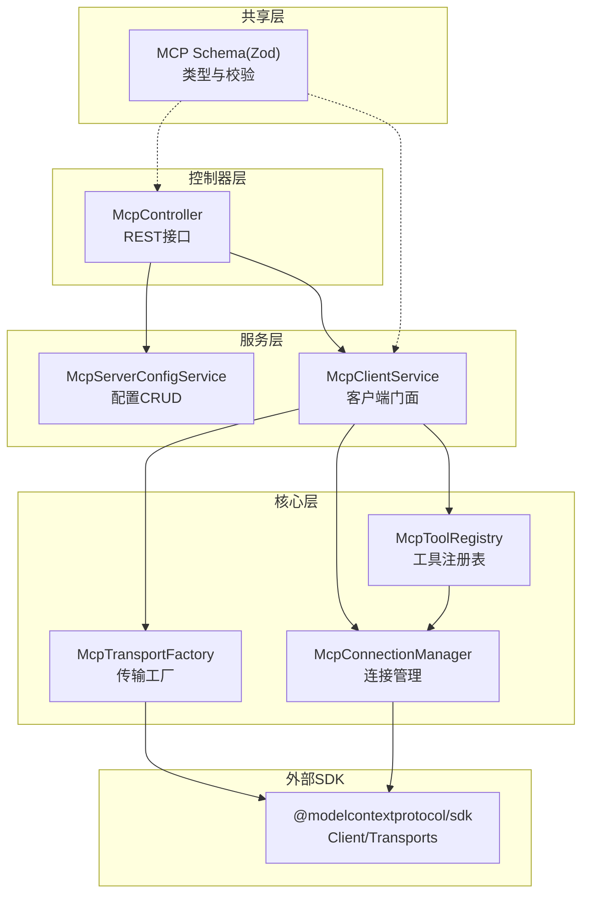
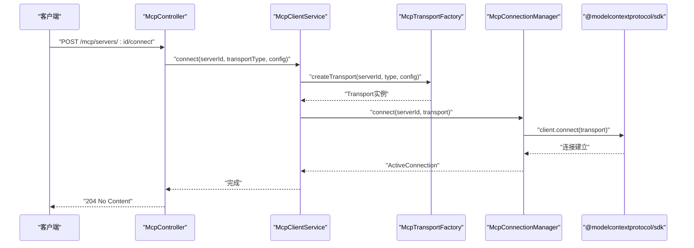
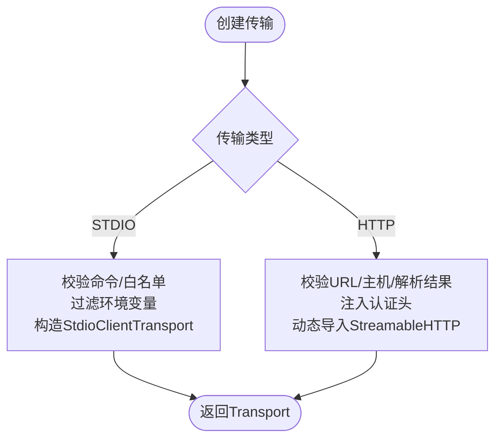
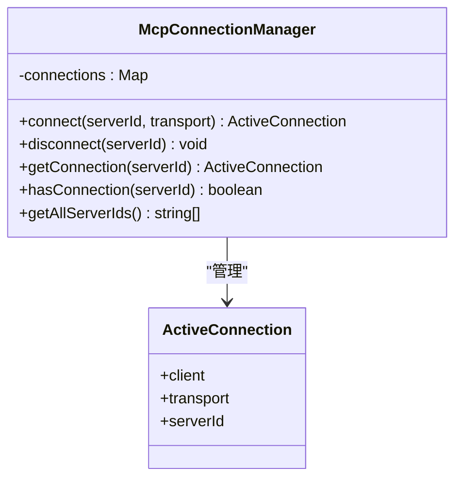
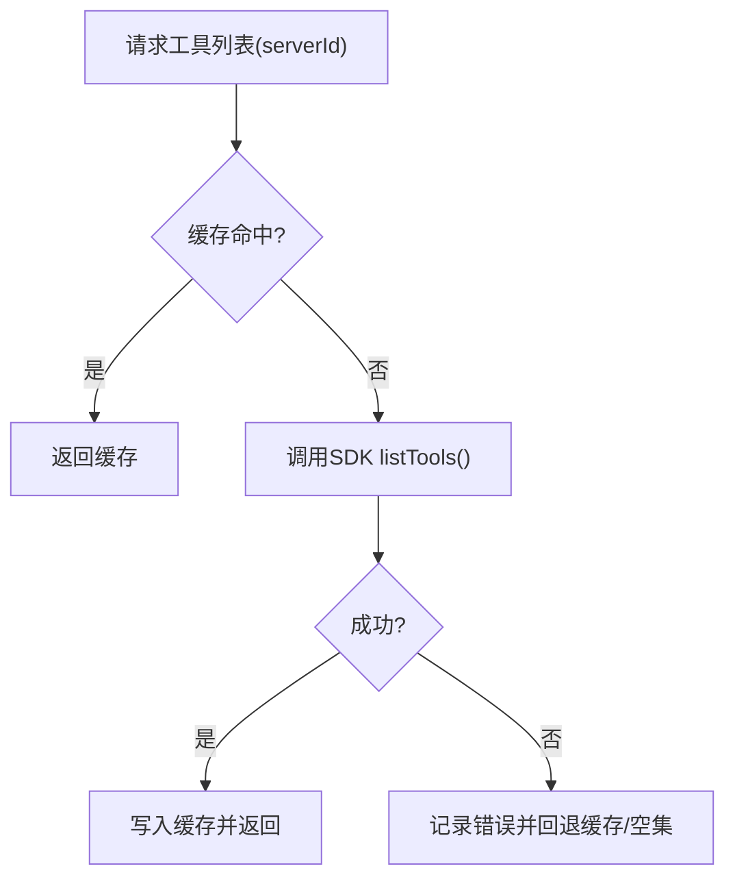
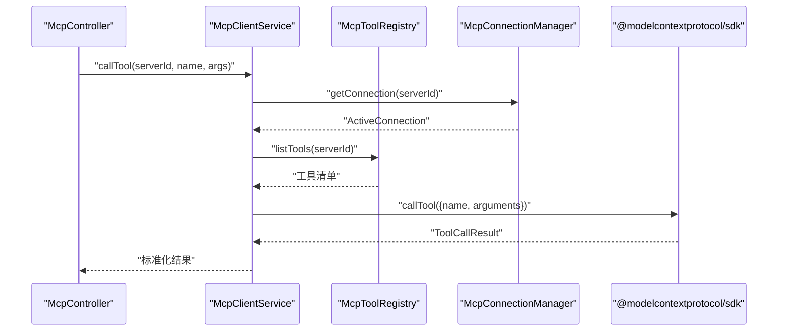
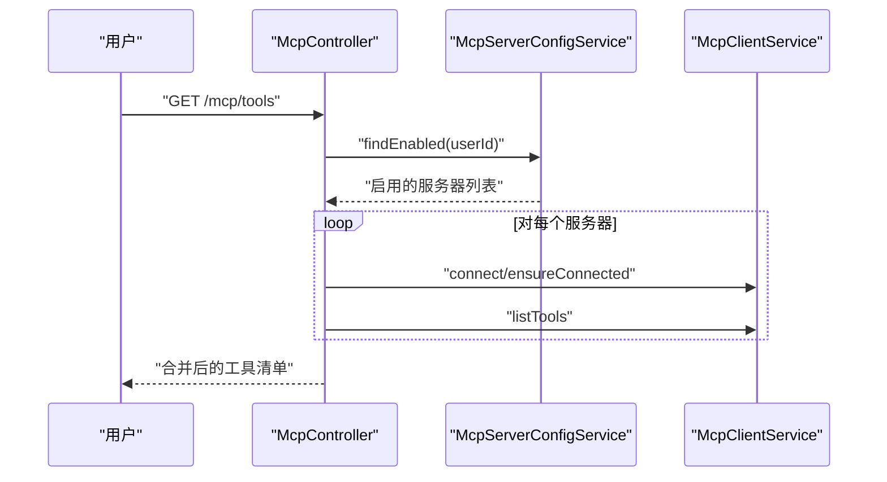
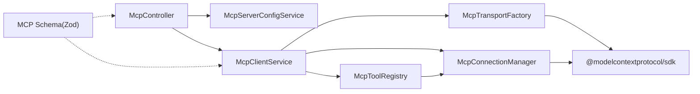

# MCP协议实现

<cite>
**本文引用的文件**
- [apps/backend/src/mcp/core/mcp-connection.manager.ts](file://apps/backend/src/mcp/core/mcp-connection.manager.ts)
- [apps/backend/src/mcp/core/mcp-tool.registry.ts](file://apps/backend/src/mcp/core/mcp-tool.registry.ts)
- [apps/backend/src/mcp/core/mcp-transport.factory.ts](file://apps/backend/src/mcp/core/mcp-transport.factory.ts)
- [apps/backend/src/mcp/mcp-client.service.ts](file://apps/backend/src/mcp/mcp-client.service.ts)
- [apps/backend/src/mcp/mcp-server-config.service.ts](file://apps/backend/src/mcp/mcp-server-config.service.ts)
- [apps/backend/src/mcp/mcp.dto.ts](file://apps/backend/src/mcp/mcp.dto.ts)
- [apps/backend/src/mcp/mcp.controller.ts](file://apps/backend/src/mcp/mcp.controller.ts)
- [apps/backend/src/mcp/mcp.module.ts](file://apps/backend/src/mcp/mcp.module.ts)
- [packages/shared/src/schemas/mcp.schema.ts](file://packages/shared/src/schemas/mcp.schema.ts)
- [apps/backend/tests/mcp/mcp-transport.factory.spec.ts](file://apps/backend/tests/mcp/mcp-transport.factory.spec.ts)
- [apps/backend/tests/mcp/mcp-client.service.spec.ts](file://apps/backend/tests/mcp/mcp-client.service.spec.ts)
- [apps/backend/src/common/throttling/throttling.constants.ts](file://apps/backend/src/common/throttling/throttling.constants.ts)
- [apps/backend/package.json](file://apps/backend/package.json)
</cite>

## 目录
1. [简介](#简介)
2. [项目结构](#项目结构)
3. [核心组件](#核心组件)
4. [架构总览](#架构总览)
5. [详细组件分析](#详细组件分析)
6. [依赖关系分析](#依赖关系分析)
7. [性能考虑](#性能考虑)
8. [故障排查指南](#故障排查指南)
9. [结论](#结论)
10. [附录](#附录)

## 简介
本文件面向MCP（Model Context Protocol）协议在本项目的实现，系统性阐述协议规范、连接管理、工具注册表设计与传输工厂实现。重点覆盖：
- 连接建立流程、心跳与断线重连机制现状与建议
- 工具注册表的数据结构、工具发现算法与生命周期管理
- 传输工厂对HTTP与STDIO两种传输方式的实现原理、差异与适用场景
- 协议消息格式、错误码定义、超时处理策略
- 性能优化建议与调试技巧

## 项目结构
MCP模块位于后端应用中，采用分层与职责分离的设计：
- 控制器层：暴露REST接口，负责鉴权、节流与参数校验
- 服务层：封装配置管理、客户端门面、连接管理、工具注册表
- 核心层：传输工厂、连接管理器、工具注册表
- 共享层：跨包的MCP模式定义与Zod校验Schema

图表来源
- [apps/backend/src/mcp/mcp.controller.ts:1-209](file://apps/backend/src/mcp/mcp.controller.ts#L1-209)
- [apps/backend/src/mcp/mcp-client.service.ts:1-124](file://apps/backend/src/mcp/mcp-client.service.ts#L1-124)
- [apps/backend/src/mcp/core/mcp-transport.factory.ts:1-220](file://apps/backend/src/mcp/core/mcp-transport.factory.ts#L1-220)
- [apps/backend/src/mcp/core/mcp-connection.manager.ts:1-101](file://apps/backend/src/mcp/core/mcp-connection.manager.ts#L1-101)
- [apps/backend/src/mcp/core/mcp-tool.registry.ts:1-48](file://apps/backend/src/mcp/core/mcp-tool.registry.ts#L1-48)
- [packages/shared/src/schemas/mcp.schema.ts:1-220](file://packages/shared/src/schemas/mcp.schema.ts#L1-220)

章节来源
- [apps/backend/src/mcp/mcp.module.ts:1-25](file://apps/backend/src/mcp/mcp.module.ts#L1-25)
- [apps/backend/src/mcp/mcp.controller.ts:1-209](file://apps/backend/src/mcp/mcp.controller.ts#L1-209)

## 核心组件
- 传输工厂：根据配置动态创建STDIO或HTTP传输，执行安全校验与环境变量过滤
- 连接管理器：维护serverId到Client与Transport的映射，负责连接/断开与资源清理
- 工具注册表：缓存工具清单，支持刷新与失效控制
- 客户端门面：统一入口，协调传输、连接与工具调用
- 配置服务：用户维度的MCP服务器配置CRUD与启用筛选
- 控制器：REST API入口，集成鉴权、节流与参数校验

章节来源
- [apps/backend/src/mcp/core/mcp-transport.factory.ts:1-220](file://apps/backend/src/mcp/core/mcp-transport.factory.ts#L1-220)
- [apps/backend/src/mcp/core/mcp-connection.manager.ts:1-101](file://apps/backend/src/mcp/core/mcp-connection.manager.ts#L1-101)
- [apps/backend/src/mcp/core/mcp-tool.registry.ts:1-48](file://apps/backend/src/mcp/core/mcp-tool.registry.ts#L1-48)
- [apps/backend/src/mcp/mcp-client.service.ts:1-124](file://apps/backend/src/mcp/mcp-client.service.ts#L1-124)
- [apps/backend/src/mcp/mcp-server-config.service.ts:1-156](file://apps/backend/src/mcp/mcp-server-config.service.ts#L1-156)
- [apps/backend/src/mcp/mcp.controller.ts:1-209](file://apps/backend/src/mcp/mcp.controller.ts#L1-209)

## 架构总览
下图展示从控制器到SDK的调用链路与职责边界。

图表来源
- [apps/backend/src/mcp/mcp.controller.ts:140-148](file://apps/backend/src/mcp/mcp.controller.ts#L140-148)
- [apps/backend/src/mcp/mcp-client.service.ts:30-47](file://apps/backend/src/mcp/mcp-client.service.ts#L30-47)
- [apps/backend/src/mcp/core/mcp-transport.factory.ts:112-126](file://apps/backend/src/mcp/core/mcp-transport.factory.ts#L112-126)
- [apps/backend/src/mcp/core/mcp-connection.manager.ts:23-73](file://apps/backend/src/mcp/core/mcp-connection.manager.ts#L23-73)

## 详细组件分析

### 传输工厂（HTTP与STDIO）
- 安全校验
  - HTTP：仅允许http/https；禁止localhost、.localhost、.local及私网地址解析
  - STDIO：生产环境默认禁用，除非显式开启并配置命令白名单
- 环境变量过滤：仅传递受控键集合（如PATH、HOME、LANG等），避免泄露敏感信息
- 认证头注入：支持Bearer/OAuth令牌与API Key注入
- 包名纠错：对特定包名进行自动修正，提升兼容性
- 动态导入：按需加载StreamableHTTP传输以减少冷启动成本

图表来源
- [apps/backend/src/mcp/core/mcp-transport.factory.ts:112-218](file://apps/backend/src/mcp/core/mcp-transport.factory.ts#L112-218)
- [packages/shared/src/schemas/mcp.schema.ts:63-118](file://packages/shared/src/schemas/mcp.schema.ts#L63-118)

章节来源
- [apps/backend/src/mcp/core/mcp-transport.factory.ts:1-220](file://apps/backend/src/mcp/core/mcp-transport.factory.ts#L1-220)
- [apps/backend/tests/mcp/mcp-transport.factory.spec.ts:1-128](file://apps/backend/tests/mcp/mcp-transport.factory.spec.ts#L1-128)
- [packages/shared/src/schemas/mcp.schema.ts:1-220](file://packages/shared/src/schemas/mcp.schema.ts#L1-220)

### 连接管理器
- 维护serverId到ActiveConnection的Map
- 连接建立：创建Client并connect，捕获STDIO stderr/onclose/onerror事件
- 断开：关闭client并清理缓存
- 查询：支持存在性检查与枚举

图表来源
- [apps/backend/src/mcp/core/mcp-connection.manager.ts:6-100](file://apps/backend/src/mcp/core/mcp-connection.manager.ts#L6-100)

章节来源
- [apps/backend/src/mcp/core/mcp-connection.manager.ts:1-101](file://apps/backend/src/mcp/core/mcp-connection.manager.ts#L1-101)

### 工具注册表
- 缓存策略：按serverId缓存工具清单，支持刷新与失效
- 刷新触发：连接成功后预热，或在调用前懒加载
- 错误回退：失败时返回空集或回退到已有缓存

图表来源
- [apps/backend/src/mcp/core/mcp-tool.registry.ts:12-42](file://apps/backend/src/mcp/core/mcp-tool.registry.ts#L12-42)

章节来源
- [apps/backend/src/mcp/core/mcp-tool.registry.ts:1-48](file://apps/backend/src/mcp/core/mcp-tool.registry.ts#L1-48)

### 客户端门面
- 统一入口：连接、断开、列出工具、调用工具
- 工具调用前置校验：确保已连接且工具存在
- 结果标准化：将SDK返回内容映射为统一结构

图表来源
- [apps/backend/src/mcp/mcp-client.service.ts:70-108](file://apps/backend/src/mcp/mcp-client.service.ts#L70-108)
- [apps/backend/src/mcp/core/mcp-tool.registry.ts:20-42](file://apps/backend/src/mcp/core/mcp-tool.registry.ts#L20-42)
- [apps/backend/src/mcp/core/mcp-connection.manager.ts:89-95](file://apps/backend/src/mcp/core/mcp-connection.manager.ts#L89-95)

章节来源
- [apps/backend/src/mcp/mcp-client.service.ts:1-124](file://apps/backend/src/mcp/mcp-client.service.ts#L1-124)

### 配置服务与控制器
- 配置服务：用户维度的MCP服务器配置CRUD，支持启用筛选
- 控制器：鉴权+节流，提供连接、断开、工具发现、工具调用等接口
- 节流策略：针对连接、工具发现与工具调用分别设置阈值

图表来源
- [apps/backend/src/mcp/mcp.controller.ts:110-136](file://apps/backend/src/mcp/mcp.controller.ts#L110-136)
- [apps/backend/src/mcp/mcp-server-config.service.ts:98-109](file://apps/backend/src/mcp/mcp-server-config.service.ts#L98-109)

章节来源
- [apps/backend/src/mcp/mcp-server-config.service.ts:1-156](file://apps/backend/src/mcp/mcp-server-config.service.ts#L1-156)
- [apps/backend/src/mcp/mcp.controller.ts:1-209](file://apps/backend/src/mcp/mcp.controller.ts#L1-209)
- [apps/backend/src/common/throttling/throttling.constants.ts:144-160](file://apps/backend/src/common/throttling/throttling.constants.ts#L144-160)

## 依赖关系分析
- 外部SDK：使用官方MCP SDK进行传输与协议交互
- 内部模块：控制器依赖配置服务与客户端门面；客户端门面依赖传输工厂、连接管理器与工具注册表
- 共享Schema：前后端一致的类型与校验规则

图表来源
- [apps/backend/src/mcp/mcp.controller.ts:1-209](file://apps/backend/src/mcp/mcp.controller.ts#L1-209)
- [apps/backend/src/mcp/mcp-client.service.ts:1-124](file://apps/backend/src/mcp/mcp-client.service.ts#L1-124)
- [apps/backend/src/mcp/core/mcp-transport.factory.ts:1-220](file://apps/backend/src/mcp/core/mcp-transport.factory.ts#L1-220)
- [apps/backend/src/mcp/core/mcp-connection.manager.ts:1-101](file://apps/backend/src/mcp/core/mcp-connection.manager.ts#L1-101)
- [apps/backend/src/mcp/core/mcp-tool.registry.ts:1-48](file://apps/backend/src/mcp/core/mcp-tool.registry.ts#L1-48)
- [packages/shared/src/schemas/mcp.schema.ts:1-220](file://packages/shared/src/schemas/mcp.schema.ts#L1-220)

章节来源
- [apps/backend/src/mcp/mcp.module.ts:1-25](file://apps/backend/src/mcp/mcp.module.ts#L1-25)
- [apps/backend/package.json](file://apps/backend/package.json#L41)

## 性能考虑
- 传输选择
  - HTTP：适合远程服务，具备标准认证与代理支持；注意DNS解析与私网限制
  - STDIO：适合本地进程，需严格控制命令与环境变量，生产环境默认禁用
- 连接复用
  - 使用连接管理器集中管理，避免重复创建
  - 工具注册表缓存减少频繁查询
- 超时与节流
  - SDK层requestTimeout已在连接选项中设置
  - 控制器层对连接、工具发现与工具调用分别施加节流，防止滥用
- 并发与懒加载
  - 工具发现阶段对启用服务器逐个连接，可结合并发控制与失败隔离

章节来源
- [apps/backend/src/mcp/core/mcp-connection.manager.ts:29-39](file://apps/backend/src/mcp/core/mcp-connection.manager.ts#L29-39)
- [apps/backend/src/common/throttling/throttling.constants.ts:144-160](file://apps/backend/src/common/throttling/throttling.constants.ts#L144-160)

## 故障排查指南
- 连接失败
  - 检查传输类型与配置是否匹配
  - 查看STDIO stderr日志与onclose/onerror事件
  - 确认HTTP URL可解析且非私网地址
- 工具不可用
  - 确认已连接目标服务器
  - 检查工具注册表缓存是否有效
  - 核对工具名称大小写与输入Schema
- 安全限制
  - 生产环境STDIO需开启并配置白名单
  - HTTP仅允许公网URL，localhost与私网被阻断
- 调试技巧
  - 启用详细日志，关注连接建立、工具刷新与调用过程
  - 使用单元测试样例定位问题（参考测试文件）

章节来源
- [apps/backend/src/mcp/core/mcp-connection.manager.ts:44-58](file://apps/backend/src/mcp/core/mcp-connection.manager.ts#L44-58)
- [apps/backend/src/mcp/core/mcp-transport.factory.ts:91-110](file://apps/backend/src/mcp/core/mcp-transport.factory.ts#L91-110)
- [apps/backend/tests/mcp/mcp-transport.factory.spec.ts:94-126](file://apps/backend/tests/mcp/mcp-transport.factory.spec.ts#L94-126)
- [apps/backend/tests/mcp/mcp-client.service.spec.ts:118-131](file://apps/backend/tests/mcp/mcp-client.service.spec.ts#L118-131)

## 结论
本实现以清晰的分层与职责划分，提供了MCP协议在本项目中的完整接入路径：从控制器到客户端门面，再到传输工厂与连接管理器，最终通过SDK与远端MCP服务器交互。传输工厂在安全与可用性之间取得平衡，连接管理器与工具注册表保障了稳定性与性能。建议在生产环境中严格遵循STDIO白名单与HTTP私网限制，并结合节流策略与缓存机制进一步优化体验。

## 附录

### 协议消息格式与数据模型
- 服务器配置
  - 字段：id、name、description、transport、config、enabled、userId、createdAt、updatedAt
  - 校验：transport与config需匹配，且仅允许公网HTTP(S)地址
- 工具响应
  - 字段：name、description、inputSchema、serverId（注入）
- 工具调用结果
  - 字段：content（数组，元素含type/text/data/mimeType等）、isError

章节来源
- [packages/shared/src/schemas/mcp.schema.ts:183-220](file://packages/shared/src/schemas/mcp.schema.ts#L183-220)
- [apps/backend/src/mcp/mcp.dto.ts:37-53](file://apps/backend/src/mcp/mcp.dto.ts#L37-53)

### 错误码与异常
- 传输工厂
  - 不支持的协议/主机被阻断/解析失败
  - STDIO在生产环境未启用或命令未白名单
- 客户端门面
  - 未连接到指定服务器
  - 工具不存在
- 控制器
  - 权限不足/资源不存在（由通用守卫与服务抛出）

章节来源
- [apps/backend/src/mcp/core/mcp-transport.factory.ts:91-110](file://apps/backend/src/mcp/core/mcp-transport.factory.ts#L91-110)
- [apps/backend/src/mcp/mcp-client.service.ts:76-87](file://apps/backend/src/mcp/mcp-client.service.ts#L76-87)
- [apps/backend/src/mcp/mcp.controller.ts:104-107](file://apps/backend/src/mcp/mcp.controller.ts#L104-107)

### 超时与心跳
- 超时
  - 连接建立时设置requestTimeout（毫秒级）
- 心跳与断线重连
  - 当前实现未内置心跳与自动重连逻辑
  - 建议：在SDK支持的前提下，于连接管理器中增加心跳定时器与断线回调，实现指数退避重连

章节来源
- [apps/backend/src/mcp/core/mcp-connection.manager.ts:36-37](file://apps/backend/src/mcp/core/mcp-connection.manager.ts#L36-37)