# MCP客户端集成

<cite>
**本文引用的文件**
- [apps/backend/src/mcp/mcp-client.service.ts](file://apps/backend/src/mcp/mcp-client.service.ts)
- [apps/backend/src/mcp/mcp.controller.ts](file://apps/backend/src/mcp/mcp.controller.ts)
- [apps/backend/src/mcp/mcp.dto.ts](file://apps/backend/src/mcp/mcp.dto.ts)
- [apps/backend/src/mcp/mcp.module.ts](file://apps/backend/src/mcp/mcp.module.ts)
- [apps/backend/src/mcp/mcp-server-config.service.ts](file://apps/backend/src/mcp/mcp-server-config.service.ts)
- [apps/backend/src/mcp/core/mcp-transport.factory.ts](file://apps/backend/src/mcp/core/mcp-transport.factory.ts)
- [apps/backend/src/mcp/core/mcp-connection.manager.ts](file://apps/backend/src/mcp/core/mcp-connection.manager.ts)
- [apps/backend/src/mcp/core/mcp-tool.registry.ts](file://apps/backend/src/mcp/core/mcp-tool.registry.ts)
- [packages/shared/src/schemas/mcp.schema.ts](file://packages/shared/src/schemas/mcp.schema.ts)
- [apps/frontend/src/features/mcp/api/mcp.ts](file://apps/frontend/src/features/mcp/api/mcp.ts)
- [apps/frontend/src/lib/wails.ts](file://apps/frontend/src/lib/wails.ts)
- [apps/frontend/src/composables/useSidecar.ts](file://apps/frontend/src/composables/useSidecar.ts)
- [apps/frontend/src/services/native.ts](file://apps/frontend/src/services/native.ts)
- [apps/wails/main.go](file://apps/wails/main.go)
- [apps/wails/app.go](file://apps/wails/app.go)
- [apps/wails/sidecar/manager.go](file://apps/wails/sidecar/manager.go)
- [apps/wails/sidecar/health.go](file://apps/wails/sidecar/health.go)
- [apps/wails/sidecar/process.go](file://apps/wails/sidecar/process.go)
- [apps/wails/sidecar/paths.go](file://apps/wails/sidecar/paths.go)
- [apps/wails/wails.json](file://apps/wails/wails.json)
- [apps/backend/src/common/throttling/throttling.constants.ts](file://apps/backend/src/common/throttling/throttling.constants.ts)
- [apps/backend/tests/mcp/mcp-client.service.spec.ts](file://apps/backend/tests/mcp/mcp-client.service.spec.ts)
- [apps/backend/tests/mcp/mcp-transport.factory.spec.ts](file://apps/backend/tests/mcp/mcp-transport.factory.spec.ts)
</cite>

## 更新摘要

**所做更改**

- 新增2分钟超时机制，防止MCP服务卡死导致请求永久阻塞
- 改进ToolCallResult类型的错误处理，增强错误传播机制
- 完善前端API封装中的超时策略和错误处理
- 更新连接管理器的请求超时配置
- 增强工具调用的超时保护和错误恢复机制

## 目录

1. [简介](#简介)
2. [项目结构](#项目结构)
3. [核心组件](#核心组件)
4. [架构总览](#架构总览)
5. [详细组件分析](#详细组件分析)
6. [Wails桌面应用集成](#wails桌面应用集成)
7. [依赖关系分析](#依赖关系分析)
8. [性能考量](#性能考量)
9. [故障排查指南](#故障排查指南)
10. [结论](#结论)
11. [附录](#附录)

## 简介

本文件面向需要在系统中集成 MCP（Model Context Protocol）客户端能力的开发者，提供从后端 NestJS 服务到前端 API 的完整集成指南。文档覆盖以下关键主题：

- 设计架构与职责划分
- 客户端初始化流程、连接与断开
- 工具发现与调用流程、参数传递与响应处理
- 前端 API 封装与 HTTP 客户端使用
- 错误处理策略与安全限制
- 连接池与缓存管理
- **新增** 2分钟超时机制，防止MCP服务卡死导致请求永久阻塞
- **新增** 改进的ToolCallResult错误处理，增强错误传播机制
- **新增** Wails桌面应用集成，包括健康监控、进程管理、路径解析等桌面应用功能
- API 调用示例与最佳实践

## 项目结构

MCP 客户端相关代码主要分布在后端模块、共享包以及新增的Wails桌面应用中，并由前端提供统一的 API 封装。

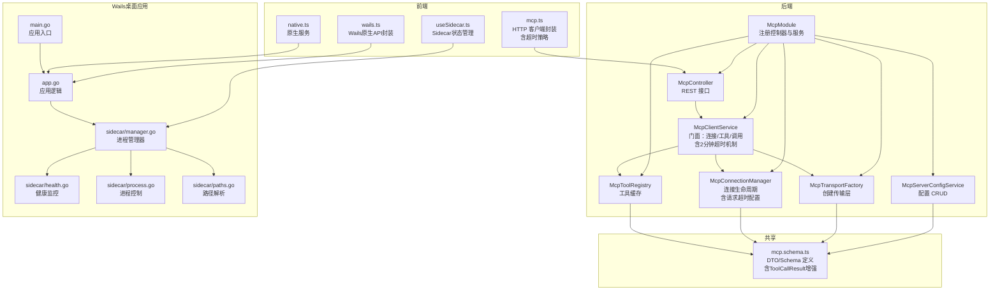

**图表来源**

- [apps/backend/src/mcp/mcp.module.ts:13-22](file://apps/backend/src/mcp/mcp.module.ts#L13-L22)
- [apps/backend/src/mcp/mcp.controller.ts:40-46](file://apps/backend/src/mcp/mcp.controller.ts#L40-L46)
- [apps/backend/src/mcp/mcp-client.service.ts:18-28](file://apps/backend/src/mcp/mcp-client.service.ts#L18-L28)
- [apps/backend/src/mcp/mcp-server-config.service.ts:10-13](file://apps/backend/src/mcp/mcp-server-config.service.ts#L10-L13)
- [apps/backend/src/mcp/core/mcp-transport.factory.ts:10-11](file://apps/backend/src/mcp/core/mcp-transport.factory.ts#L10-L11)
- [apps/backend/src/mcp/core/mcp-connection.manager.ts:12-15](file://apps/backend/src/mcp/core/mcp-connection.manager.ts#L12-L15)
- [apps/backend/src/mcp/core/mcp-tool.registry.ts:5-10](file://apps/backend/src/mcp/core/mcp-tool.registry.ts#L5-L10)
- [packages/shared/src/schemas/mcp.schema.ts:1-220](file://packages/shared/src/schemas/mcp.schema.ts#L1-L220)
- [apps/frontend/src/features/mcp/api/mcp.ts:16-107](file://apps/frontend/src/features/mcp/api/mcp.ts#L16-L107)
- [apps/wails/main.go:20-95](file://apps/wails/main.go#L20-L95)
- [apps/wails/app.go:15-32](file://apps/wails/app.go#L15-L32)
- [apps/wails/sidecar/manager.go:47-69](file://apps/wails/sidecar/manager.go#L47-L69)

**章节来源**

- [apps/backend/src/mcp/mcp.module.ts:13-22](file://apps/backend/src/mcp/mcp.module.ts#L13-L22)
- [apps/backend/src/mcp/mcp.controller.ts:40-46](file://apps/backend/src/mcp/mcp.controller.ts#L40-L46)
- [apps/backend/src/mcp/mcp-client.service.ts:18-28](file://apps/backend/src/mcp/mcp-client.service.ts#L18-L28)
- [apps/backend/src/mcp/mcp-server-config.service.ts:10-13](file://apps/backend/src/mcp/mcp-server-config.service.ts#L10-L13)
- [apps/backend/src/mcp/core/mcp-transport.factory.ts:10-11](file://apps/backend/src/mcp/core/mcp-transport.factory.ts#L10-L11)
- [apps/backend/src/mcp/core/mcp-connection.manager.ts:12-15](file://apps/backend/src/mcp/core/mcp-connection.manager.ts#L12-L15)
- [apps/backend/src/mcp/core/mcp-tool.registry.ts:5-10](file://apps/backend/src/mcp/core/mcp-tool.registry.ts#L5-L10)
- [packages/shared/src/schemas/mcp.schema.ts:1-220](file://packages/shared/src/schemas/mcp.schema.ts#L1-L220)
- [apps/frontend/src/features/mcp/api/mcp.ts:16-107](file://apps/frontend/src/features/mcp/api/mcp.ts#L16-L107)
- [apps/wails/main.go:20-95](file://apps/wails/main.go#L20-L95)
- [apps/wails/app.go:15-32](file://apps/wails/app.go#L15-L32)
- [apps/wails/sidecar/manager.go:47-69](file://apps/wails/sidecar/manager.go#L47-L69)

## 核心组件

- McpClientService：统一门面，负责连接管理、工具发现与调用、连接状态查询与清理。**新增** 2分钟超时机制保护工具调用。
- McpController：提供 REST API，包括配置 CRUD、连接/断开、工具发现、工具调用等。
- McpServerConfigService：用户维度的 MCP 服务器配置持久化与权限控制。
- McpTransportFactory：根据传输类型创建 STDIO 或 HTTP 传输，内置安全检查与环境变量白名单。
- McpConnectionManager：维护连接映射，负责连接生命周期与错误事件处理。**新增** 请求超时配置。
- McpToolRegistry：缓存工具清单，支持刷新与清理。
- **新增** Wails桌面应用：提供原生桌面功能，包括进程管理、健康监控、路径解析。
- **新增** Sidecar进程管理器：管理Node.js Sidecar进程的生命周期。
- 前端 mcp.ts：对后端 API 的封装，提供统一的请求方法与超时配置。**新增** 改进的错误处理。
- **新增** 前端 wails.ts：Wails原生API封装，提供桌面应用功能。

**章节来源**

- [apps/backend/src/mcp/mcp-client.service.ts:18-123](file://apps/backend/src/mcp/mcp-client.service.ts#L18-L123)
- [apps/backend/src/mcp/mcp.controller.ts:40-208](file://apps/backend/src/mcp/mcp.controller.ts#L40-L208)
- [apps/backend/src/mcp/mcp-server-config.service.ts:10-155](file://apps/backend/src/mcp/mcp-server-config.service.ts#L10-L155)
- [apps/backend/src/mcp/core/mcp-transport.factory.ts:10-219](file://apps/backend/src/mcp/core/mcp-transport.factory.ts#L10-L219)
- [apps/backend/src/mcp/core/mcp-connection.manager.ts:12-100](file://apps/backend/src/mcp/core/mcp-connection.manager.ts#L12-L100)
- [apps/backend/src/mcp/core/mcp-tool.registry.ts:5-47](file://apps/backend/src/mcp/core/mcp-tool.registry.ts#L5-L47)
- [apps/frontend/src/features/mcp/api/mcp.ts:16-107](file://apps/frontend/src/features/mcp/api/mcp.ts#L16-L107)
- [apps/wails/app.go:15-32](file://apps/wails/app.go#L15-L32)
- [apps/wails/sidecar/manager.go:47-146](file://apps/wails/sidecar/manager.go#L47-L146)

## 架构总览

下图展示从前端到后端再到 MCP 服务器的整体调用链路与数据流，包括新增的Wails桌面应用集成和2分钟超时保护机制。

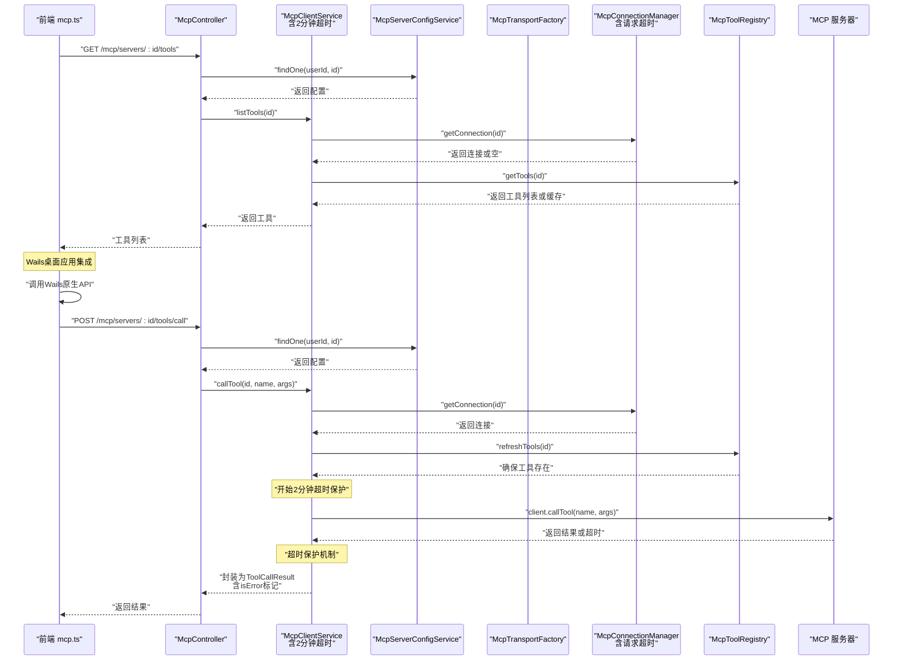

**图表来源**

- [apps/backend/src/mcp/mcp.controller.ts:168-207](file://apps/backend/src/mcp/mcp.controller.ts#L168-L207)
- [apps/backend/src/mcp/mcp-client.service.ts:60-108](file://apps/backend/src/mcp/mcp-client.service.ts#L60-L108)
- [apps/backend/src/mcp/core/mcp-tool.registry.ts:12-41](file://apps/backend/src/mcp/core/mcp-tool.registry.ts#L12-L41)
- [apps/backend/src/mcp/core/mcp-connection.manager.ts:89-95](file://apps/backend/src/mcp/core/mcp-connection.manager.ts#L89-L95)
- [apps/frontend/src/features/mcp/api/mcp.ts:59-84](file://apps/frontend/src/features/mcp/api/mcp.ts#L59-L84)

## 详细组件分析

### McpClientService：客户端门面

- 职责
  - 连接/断开：通过工厂创建传输，交由连接管理器建立或关闭连接。
  - 工具发现：先检查连接，再通过工具注册表获取/刷新工具清单。
  - 工具调用：校验工具存在性，调用底层 client.callTool，封装返回结果。
  - 状态查询：判断连接状态、列出活跃连接。
- 关键点
  - 连接成功后预热工具注册表，减少首次调用延迟。
  - 工具调用前进行存在性校验，避免无效调用。
  - **新增** 2分钟超时保护机制，防止MCP服务卡死导致请求永久阻塞。
  - **新增** ToolCallResult增强，包含isError布尔标记和内容数组。
  - **新增** Promise.race超时机制，确保工具调用不会无限等待。

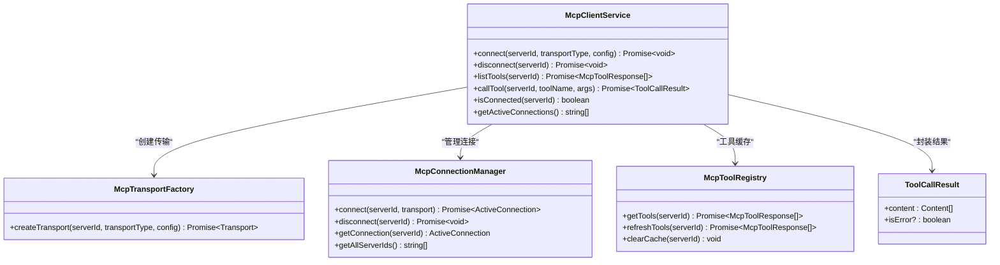

**图表来源**

- [apps/backend/src/mcp/mcp-client.service.ts:18-123](file://apps/backend/src/mcp/mcp-client.service.ts#L18-L123)
- [apps/backend/src/mcp/core/mcp-transport.factory.ts:112-126](file://apps/backend/src/mcp/core/mcp-transport.factory.ts#L112-L126)
- [apps/backend/src/mcp/core/mcp-connection.manager.ts:23-95](file://apps/backend/src/mcp/core/mcp-connection.manager.ts#L23-L95)
- [apps/backend/src/mcp/core/mcp-tool.registry.ts:12-46](file://apps/backend/src/mcp/core/mcp-tool.registry.ts#L12-L46)
- [packages/shared/src/schemas/mcp.schema.ts:291-303](file://packages/shared/src/schemas/mcp.schema.ts#L291-303)

**章节来源**

- [apps/backend/src/mcp/mcp-client.service.ts:30-123](file://apps/backend/src/mcp/mcp-client.service.ts#L30-L123)

### McpController：REST API 实现

- 权限与鉴权
  - 使用 JWT 守卫保护所有路由。
  - 所有操作均基于当前用户上下文，读写分离用户维度数据。
- 主要接口
  - 配置管理：创建、查询、更新、删除。
  - 连接管理：连接、断开。
  - 工具发现：按服务器或聚合所有启用服务器的工具。
  - 工具调用：按名称与参数调用。
- 速率限制
  - 对连接、工具发现、工具调用分别施加不同窗口的节流策略，防止滥用。

**图表来源**

- [apps/backend/src/mcp/mcp.controller.ts:40-208](file://apps/backend/src/mcp/mcp.controller.ts#L40-L208)
- [apps/backend/src/common/throttling/throttling.constants.ts:144-160](file://apps/backend/src/common/throttling/throttling.constants.ts#L144-L160)

**章节来源**

- [apps/backend/src/mcp/mcp.controller.ts:40-208](file://apps/backend/src/mcp/mcp.controller.ts#L40-L208)
- [apps/backend/src/common/throttling/throttling.constants.ts:144-160](file://apps/backend/src/common/throttling/throttling.constants.ts#L144-L160)

### McpTransportFactory：传输层工厂与安全

- 支持的传输类型
  - STDIO：通过命令与参数启动外部进程，严格控制允许的命令与环境变量。
  - HTTP：StreamableHTTP 客户端，支持 Bearer/OAuth/API Key 认证头注入。
- 安全限制
  - 禁止 localhost、.local、私网地址与回环地址的 HTTP 目标。
  - 生产环境默认禁用 STDIO，除非显式开启并配置允许命令白名单。
  - 仅传递受控环境变量到子进程，避免泄露敏感信息。

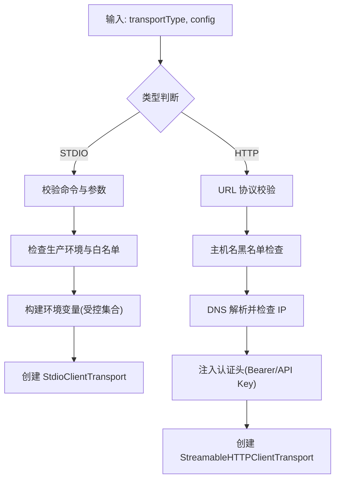

**图表来源**

- [apps/backend/src/mcp/core/mcp-transport.factory.ts:112-218](file://apps/backend/src/mcp/core/mcp-transport.factory.ts#L112-L218)
- [packages/shared/src/schemas/mcp.schema.ts:63-116](file://packages/shared/src/schemas/mcp.schema.ts#L63-L116)

**章节来源**

- [apps/backend/src/mcp/core/mcp-transport.factory.ts:112-218](file://apps/backend/src/mcp/core/mcp-transport.factory.ts#L112-L218)
- [packages/shared/src/schemas/mcp.schema.ts:63-116](file://packages/shared/src/schemas/mcp.schema.ts#L63-L116)

### McpConnectionManager：连接生命周期

- 维护 serverId -> ActiveConnection 映射。
- 连接建立时设置超时、错误监听与关闭回调；断开时关闭 client 并清理缓存。
- **新增** 请求超时配置，默认300秒，防止连接建立过程中的长时间阻塞。
- 在模块销毁时自动断开所有连接，保证资源回收。

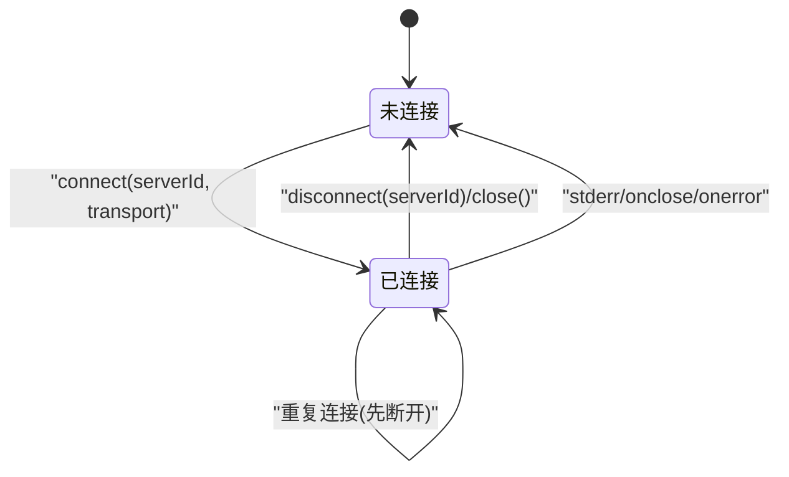

**图表来源**

- [apps/backend/src/mcp/core/mcp-connection.manager.ts:23-95](file://apps/backend/src/mcp/core/mcp-connection.manager.ts#L23-L95)

**章节来源**

- [apps/backend/src/mcp/core/mcp-connection.manager.ts:12-100](file://apps/backend/src/mcp/core/mcp-connection.manager.ts#L12-L100)

### McpToolRegistry：工具缓存与刷新

- 缓存结构：Map<serverId, tools[]>。
- 行为：优先返回缓存；若无连接则清空缓存并返回空；刷新失败时回退到旧缓存。

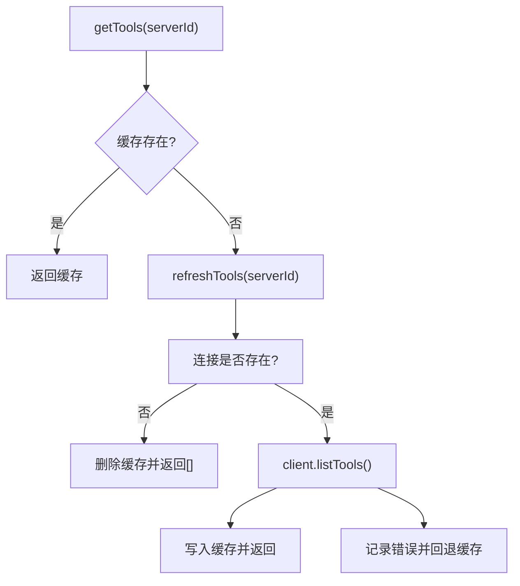

**图表来源**

- [apps/backend/src/mcp/core/mcp-tool.registry.ts:12-46](file://apps/backend/src/mcp/core/mcp-tool.registry.ts#L12-L46)

**章节来源**

- [apps/backend/src/mcp/core/mcp-tool.registry.ts:12-46](file://apps/backend/src/mcp/core/mcp-tool.registry.ts#L12-L46)

### 前端 API 封装：mcp.ts

- 方法概览
  - 服务器配置：getServers/getServer/createServer/updateServer/deleteServer
  - 工具：getTools/getAllTools
  - 连接：connect/disconnect
  - 调用：callTool
- 超时策略
  - 发现工具：30 秒
  - 连接：5 分钟
  - 调用：60 秒
- 数据解包
  - 统一使用共享包的响应包装解包函数。
- **新增** 错误处理改进
  - 更好的错误信息传递
  - 支持ToolCallResult的isError标记

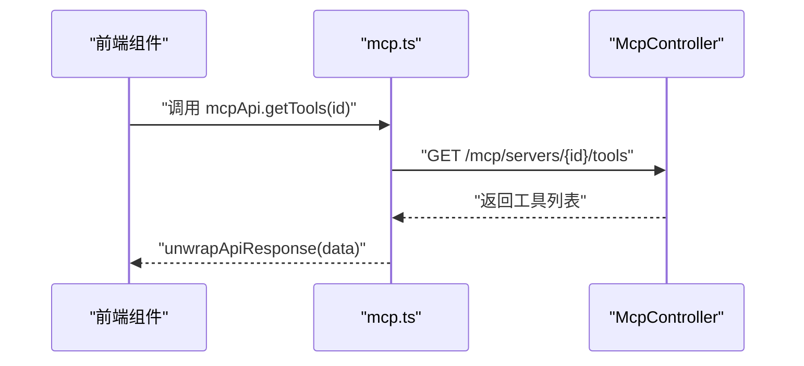

**图表来源**

- [apps/frontend/src/features/mcp/api/mcp.ts:59-84](file://apps/frontend/src/features/mcp/api/mcp.ts#L59-L84)
- [apps/backend/src/mcp/mcp.controller.ts:168-184](file://apps/backend/src/mcp/mcp.controller.ts#L168-L184)

**章节来源**

- [apps/frontend/src/features/mcp/api/mcp.ts:16-107](file://apps/frontend/src/features/mcp/api/mcp.ts#L16-L107)

## Wails桌面应用集成

### 应用入口与配置

Wails桌面应用提供原生桌面体验，集成MCP客户端功能。应用入口配置了菜单系统、窗口属性和资产服务器。

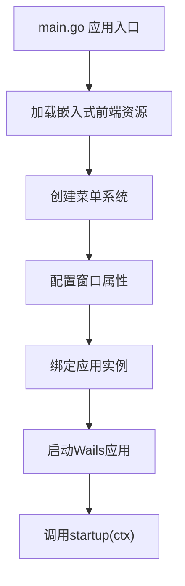

**图表来源**

- [apps/wails/main.go:20-95](file://apps/wails/main.go#L20-L95)

**章节来源**

- [apps/wails/main.go:20-95](file://apps/wails/main.go#L20-L95)
- [apps/wails/wails.json:1-22](file://apps/wails/wails.json#L1-L22)

### 应用逻辑与生命周期

应用逻辑封装了Wails运行时API，提供窗口管理、对话框显示、浏览器打开等功能。

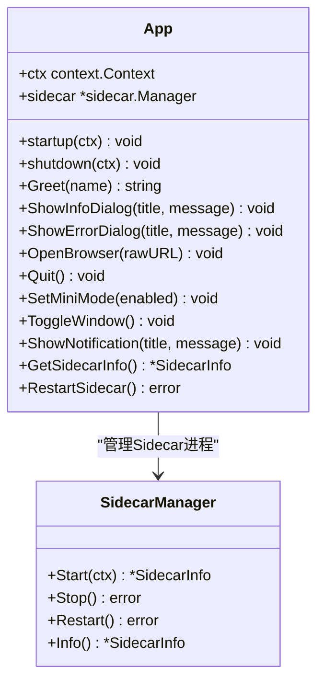

**图表来源**

- [apps/wails/app.go:15-32](file://apps/wails/app.go#L15-L32)
- [apps/wails/sidecar/manager.go:47-146](file://apps/wails/sidecar/manager.go#L47-L146)

**章节来源**

- [apps/wails/app.go:15-211](file://apps/wails/app.go#L15-L211)

### Sidecar进程管理器

Sidecar进程管理器负责Node.js Sidecar进程的完整生命周期管理，包括启动、停止、重启和监控。

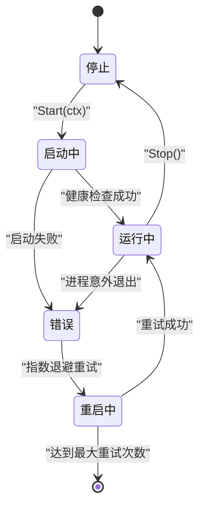

**图表来源**

- [apps/wails/sidecar/manager.go:14-61](file://apps/wails/sidecar/manager.go#L14-L61)
- [apps/wails/sidecar/manager.go:220-289](file://apps/wails/sidecar/manager.go#L220-L289)

**章节来源**

- [apps/wails/sidecar/manager.go:47-289](file://apps/wails/sidecar/manager.go#L47-L289)

### 健康监控机制

健康监控通过定期轮询Sidecar的/health端点来验证进程状态，支持超时控制和上下文取消。

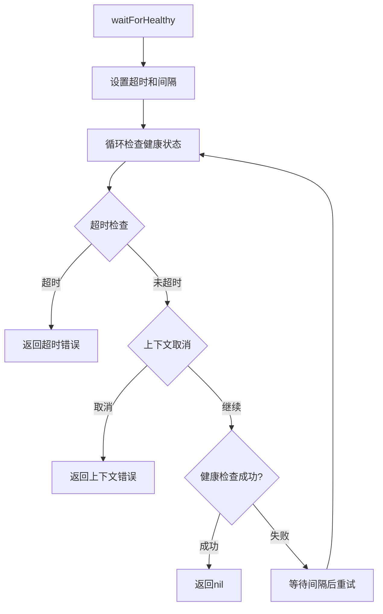

**图表来源**

- [apps/wails/sidecar/health.go:11-44](file://apps/wails/sidecar/health.go#L11-L44)

**章节来源**

- [apps/wails/sidecar/health.go:11-77](file://apps/wails/sidecar/health.go#L11-L77)

### 进程控制与终止

进程控制实现了跨平台的进程管理和优雅终止，支持进程组隔离和信号处理。

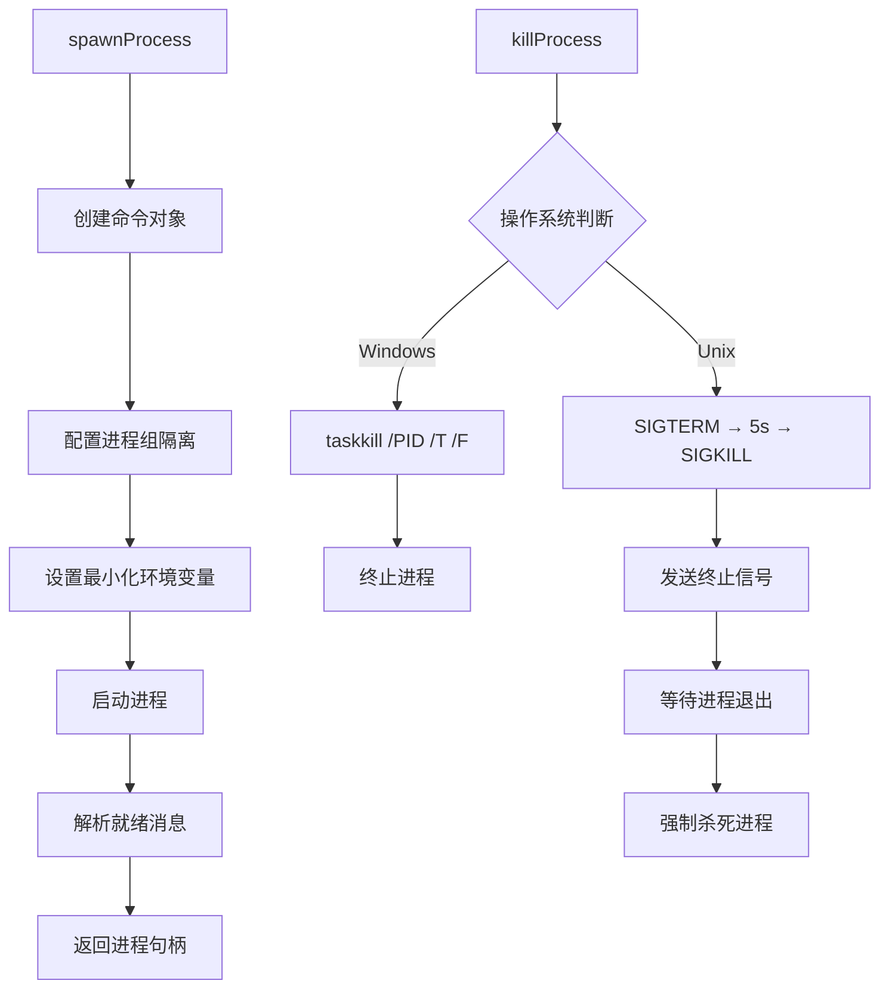

**图表来源**

- [apps/wails/sidecar/process.go:16-81](file://apps/wails/sidecar/process.go#L16-L81)
- [apps/wails/sidecar/process.go:83-147](file://apps/wails/sidecar/process.go#L83-L147)

**章节来源**

- [apps/wails/sidecar/process.go:16-164](file://apps/wails/sidecar/process.go#L16-L164)

### 路径解析与部署

路径解析支持多平台部署，自动检测可执行文件位置并解析Node.js二进制和入口文件路径。

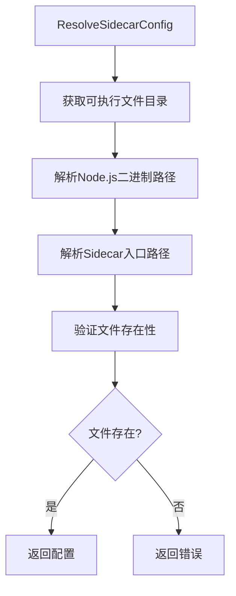

**图表来源**

- [apps/wails/sidecar/paths.go:16-48](file://apps/wails/sidecar/paths.go#L16-L48)

**章节来源**

- [apps/wails/sidecar/paths.go:16-97](file://apps/wails/sidecar/paths.go#L16-L97)

### 前端Wails集成

前端提供了完整的Wails原生API封装和服务集成。

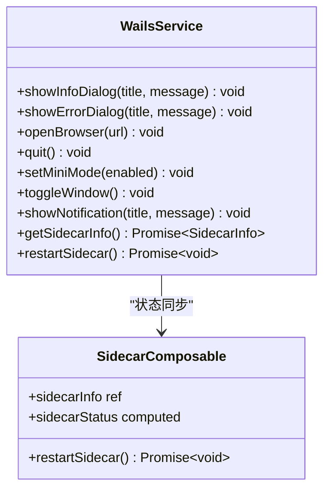

**图表来源**

- [apps/frontend/src/lib/wails.ts:1-200](file://apps/frontend/src/lib/wails.ts#L1-L200)
- [apps/frontend/src/composables/useSidecar.ts:1-150](file://apps/frontend/src/composables/useSidecar.ts#L1-L150)

**章节来源**

- [apps/frontend/src/lib/wails.ts:1-200](file://apps/frontend/src/lib/wails.ts#L1-L200)
- [apps/frontend/src/composables/useSidecar.ts:1-150](file://apps/frontend/src/composables/useSidecar.ts#L1-L150)
- [apps/frontend/src/services/native.ts:1-100](file://apps/frontend/src/services/native.ts#L1-L100)

## 依赖关系分析

- 模块耦合
  - McpModule 统一导出配置服务与客户端服务，便于其他模块按需注入。
  - McpController 仅依赖服务层，不直接操作传输层，职责清晰。
  - **新增** Wails应用通过Manager模式解耦进程管理与应用逻辑。
- 外部依赖
  - @modelcontextprotocol/sdk：提供 STDIO 与 HTTP 传输及 Client。
  - 共享包 @lumina/shared：前后端一致的 DTO 与 Schema。
  - **新增** Wails v2：提供桌面应用框架和原生API。
  - **新增** Node.js：作为Sidecar进程运行时。
- 循环依赖
  - 通过门面与服务层解耦，未见循环依赖迹象。
  - **新增** Wails应用采用事件驱动模式，避免循环依赖。

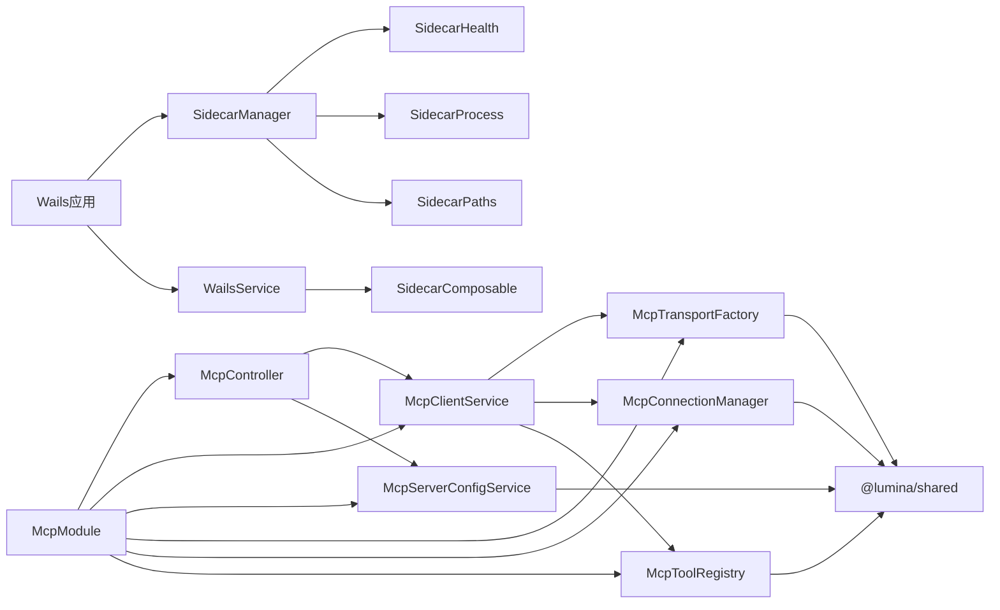

**图表来源**

- [apps/backend/src/mcp/mcp.module.ts:13-22](file://apps/backend/src/mcp/mcp.module.ts#L13-L22)
- [apps/backend/src/mcp/mcp-client.service.ts:18-28](file://apps/backend/src/mcp/mcp-client.service.ts#L18-L28)
- [apps/backend/src/mcp/mcp.controller.ts:40-46](file://apps/backend/src/mcp/mcp.controller.ts#L40-L46)
- [apps/backend/src/mcp/mcp-server-config.service.ts:10-13](file://apps/backend/src/mcp/mcp-server-config.service.ts#L10-L13)
- [packages/shared/src/schemas/mcp.schema.ts:1-220](file://packages/shared/src/schemas/mcp.schema.ts#L1-L220)
- [apps/wails/app.go:15-32](file://apps/wails/app.go#L15-L32)
- [apps/wails/sidecar/manager.go:47-69](file://apps/wails/sidecar/manager.go#L47-L69)

**章节来源**

- [apps/backend/src/mcp/mcp.module.ts:13-22](file://apps/backend/src/mcp/mcp.module.ts#L13-L22)
- [apps/backend/src/mcp/mcp-client.service.ts:18-28](file://apps/backend/src/mcp/mcp-client.service.ts#L18-L28)
- [apps/backend/src/mcp/mcp.controller.ts:40-46](file://apps/backend/src/mcp/mcp.controller.ts#L40-L46)
- [apps/backend/src/mcp/mcp-server-config.service.ts:10-13](file://apps/backend/src/mcp/mcp-server-config.service.ts#L10-L13)
- [packages/shared/src/schemas/mcp.schema.ts:1-220](file://packages/shared/src/schemas/mcp.schema.ts#L1-L220)
- [apps/wails/app.go:15-32](file://apps/wails/app.go#L15-L32)
- [apps/wails/sidecar/manager.go:47-69](file://apps/wails/sidecar/manager.go#L47-L69)

## 性能考量

- 连接复用
  - 连接管理器以 serverId 为键维护连接，避免重复握手。
- 工具缓存
  - 工具注册表缓存工具清单，减少频繁 listTools 请求。
- 超时与节流
  - 前端针对工具发现与调用设置合理超时；后端对连接、工具发现、工具调用分别设置节流策略，防止抖动与滥用。
  - **新增** 2分钟超时保护机制，防止MCP服务卡死导致请求永久阻塞。
- 传输选择
  - HTTP 传输具备更好的网络鲁棒性；STDIO 适合本地可信进程，但受限于环境变量与命令白名单。
- **新增** 进程管理优化
  - Sidecar进程采用进程组隔离，支持优雅终止和自动重启。
  - 健康监控使用指数退避算法，避免频繁重启造成系统压力。
  - 跨平台兼容性优化，Windows使用taskkill，Unix使用信号处理。
- **新增** ToolCallResult增强
  - 支持isError布尔标记，便于前端区分正常结果和错误状态。
  - 内容数组结构更加灵活，支持多种数据类型。

**章节来源**

- [apps/backend/src/mcp/core/mcp-tool.registry.ts:12-46](file://apps/backend/src/mcp/core/mcp-tool.registry.ts#L12-L46)
- [apps/backend/src/common/throttling/throttling.constants.ts:144-160](file://apps/backend/src/common/throttling/throttling.constants.ts#L144-L160)
- [apps/frontend/src/features/mcp/api/mcp.ts:62-82](file://apps/frontend/src/features/mcp/api/mcp.ts#L62-L82)
- [apps/wails/sidecar/manager.go:258-287](file://apps/wails/sidecar/manager.go#L258-L287)
- [packages/shared/src/schemas/mcp.schema.ts:291-303](file://packages/shared/src/schemas/mcp.schema.ts#L291-303)

## 故障排查指南

- 常见错误与定位
  - "未连接到 MCP 服务器"：确认已调用连接接口或在调用工具前自动连接。
  - "工具不存在"：确认工具名称拼写正确，或重新刷新工具缓存。
  - "STDIO 传输被禁用"：检查生产环境变量与命令白名单配置。
  - "HTTP 主机被阻止"：确认目标 URL 不是 localhost、.local 或私网地址。
  - **新增** "MCP tool call timed out after 120s"：工具调用超过2分钟超时限制。
  - **新增** "ToolCallResult isError=true"：工具返回错误状态，需要检查工具实现。
  - **新增** "Sidecar进程启动失败"：检查Node.js二进制文件路径和权限。
  - **新增** "Sidecar健康检查超时"：检查防火墙设置和端口占用情况。
  - **新增** "Wails应用无法启动"：检查前端资源打包和菜单配置。
- 日志与监控
  - 后端日志包含连接、断开、工具刷新与调用的关键事件，便于定位问题。
  - **新增** 2分钟超时日志，记录超时原因和调用参数。
  - **新增** ToolCallResult错误日志，包含isError标记和内容详情。
  - **新增** Sidecar进程日志包含启动、停止、重启的详细信息。
  - **新增** Wails应用日志记录原生API调用和事件处理。
- 测试参考
  - 单元测试覆盖了连接、工具发现与调用、断开等关键路径，可作为行为参考。
  - **新增** 超时机制测试，验证2分钟超时保护的有效性。
  - **新增** ToolCallResult错误处理测试，验证isError标记的正确传递。
  - **新增** Sidecar进程管理器包含完整的生命周期测试用例。

**章节来源**

- [apps/backend/src/mcp/mcp-client.service.ts:74-108](file://apps/backend/src/mcp/mcp-client.service.ts#L74-L108)
- [apps/backend/src/mcp/core/mcp-transport.factory.ts:91-110](file://apps/backend/src/mcp/core/mcp-transport.factory.ts#L91-L110)
- [apps/backend/tests/mcp/mcp-client.service.spec.ts:118-130](file://apps/backend/tests/mcp/mcp-client.service.spec.ts#L118-L130)
- [apps/backend/tests/mcp/mcp-transport.factory.spec.ts:94-126](file://apps/backend/tests/mcp/mcp-transport.factory.spec.ts#L94-L126)
- [apps/wails/sidecar/manager.go:118-126](file://apps/wails/sidecar/manager.go#L118-L126)

## 结论

该 MCP 客户端集成方案通过清晰的模块划分与安全约束，提供了稳定、可扩展的工具调用能力。后端以门面服务为核心，结合传输工厂、连接管理与工具缓存，实现了高效的工具发现与调用；前端提供统一 API 封装与合理的超时策略。配合节流与安全检查，整体具备良好的生产可用性。

**新增的2分钟超时机制显著提升了系统的稳定性**，防止MCP服务卡死导致请求永久阻塞，确保系统能够及时响应超时错误并进行适当的错误处理。**改进的ToolCallResult类型增强了错误传播能力**，通过isError标记使前端能够准确区分正常结果和错误状态，提升了用户体验。

**新增的Wails桌面应用集成为系统提供了原生桌面体验**，包括进程管理、健康监控、路径解析等功能。Sidecar进程管理器采用事件驱动模式，支持自动重启和优雅终止，确保系统的稳定性和可靠性。前端通过Wails原生API封装，实现了与桌面应用的无缝集成。

## 附录

### API 定义与调用示例

- 获取服务器配置列表
  - 方法：GET
  - 路径：/mcp/servers
  - 前端封装：参见 [apps/frontend/src/features/mcp/api/mcp.ts:20-23](file://apps/frontend/src/features/mcp/api/mcp.ts#L20-L23)
- 获取单个服务器配置
  - 方法：GET
  - 路径：/mcp/servers/{id}
  - 前端封装：参见 [apps/frontend/src/features/mcp/api/mcp.ts:28-31](file://apps/frontend/src/features/mcp/api/mcp.ts#L28-L31)
- 创建服务器配置
  - 方法：POST
  - 路径：/mcp/servers
  - 前端封装：参见 [apps/frontend/src/features/mcp/api/mcp.ts:36-39](file://apps/frontend/src/features/mcp/api/mcp.ts#L36-L39)
- 更新服务器配置
  - 方法：PUT
  - 路径：/mcp/servers/{id}
  - 前端封装：参见 [apps/frontend/src/features/mcp/api/mcp.ts:44-47](file://apps/frontend/src/features/mcp/api/mcp.ts#L44-L47)
- 删除服务器配置
  - 方法：DELETE
  - 路径：/mcp/servers/{id}
  - 前端封装：参见 [apps/frontend/src/features/mcp/api/mcp.ts:52-54](file://apps/frontend/src/features/mcp/api/mcp.ts#L52-L54)
- 获取服务器工具列表
  - 方法：GET
  - 路径：/mcp/servers/{id}/tools
  - 前端封装：参见 [apps/frontend/src/features/mcp/api/mcp.ts:59-65](file://apps/frontend/src/features/mcp/api/mcp.ts#L59-L65)
- 聚合所有启用服务器的工具
  - 方法：GET
  - 路径：/mcp/tools
  - 前端封装：参见 [apps/frontend/src/features/mcp/api/mcp.ts:103-106](file://apps/frontend/src/features/mcp/api/mcp.ts#L103-L106)
- 连接服务器
  - 方法：POST
  - 路径：/mcp/servers/{id}/connect
  - 前端封装：参见 [apps/frontend/src/features/mcp/api/mcp.ts:89-91](file://apps/frontend/src/features/mcp/api/mcp.ts#L89-L91)
- 断开服务器连接
  - 方法：POST
  - 路径：/mcp/servers/{id}/disconnect
  - 前端封装：参见 [apps/frontend/src/features/mcp/api/mcp.ts:96-98](file://apps/frontend/src/features/mcp/api/mcp.ts#L96-L98)
- 调用工具
  - 方法：POST
  - 路径：/mcp/servers/{id}/tools/call
  - 前端封装：参见 [apps/frontend/src/features/mcp/api/mcp.ts:70-84](file://apps/frontend/src/features/mcp/api/mcp.ts#L70-L84)

### Wails桌面应用API

- **新增** 获取Sidecar状态
  - 方法：GET
  - 路径：/sidecar/info
  - 前端封装：参见 [apps/frontend/src/lib/wails.ts:150-160](file://apps/frontend/src/lib/wails.ts#L150-L160)
- **新增** 重启Sidecar进程
  - 方法：POST
  - 路径：/sidecar/restart
  - 前端封装：参见 [apps/frontend/src/lib/wails.ts:165-175](file://apps/frontend/src/lib/wails.ts#L165-L175)
- **新增** 显示信息对话框
  - 方法：POST
  - 路径：/dialog/info
  - 前端封装：参见 [apps/frontend/src/lib/wails.ts:120-130](file://apps/frontend/src/lib/wails.ts#L120-L130)
- **新增** 显示错误对话框
  - 方法：POST
  - 路径：/dialog/error
  - 前端封装：参见 [apps/frontend/src/lib/wails.ts:135-145](file://apps/frontend/src/lib/wails.ts#L135-L145)

### 错误码与异常

- 未找到配置：后端抛出"未找到"异常，前端捕获并提示。
- 权限不足：后端抛出"禁止访问"异常，前端提示无权限。
- 连接失败：后端记录错误并抛出异常，前端提示重试或检查配置。
- 工具不存在：调用前校验失败，抛出"工具不存在"异常。
- 传输被阻止：STDIO/HTTP 安全检查失败，抛出相应异常。
- **新增** 工具调用超时：2分钟超时保护触发，抛出"工具调用超时"异常。
- **新增** ToolCallResult错误：工具返回isError=true，前端显示错误内容。
- **新增** Sidecar启动失败：进程启动或健康检查失败，返回详细错误信息。
- **新增** 路径解析错误：可执行文件或Node.js二进制文件找不到，返回路径相关信息。
- **新增** 进程终止错误：优雅终止失败，尝试强制终止并记录错误。

**章节来源**

- [apps/backend/src/mcp/mcp-server-config.service.ts:55-58](file://apps/backend/src/mcp/mcp-server-config.service.ts#L55-L58)
- [apps/backend/src/mcp/mcp-server-config.service.ts:124-126](file://apps/backend/src/mcp/mcp-server-config.service.ts#L124-L126)
- [apps/backend/src/mcp/mcp-client.service.ts:76-87](file://apps/backend/src/mcp/mcp-client.service.ts#L76-L87)
- [apps/backend/src/mcp/core/mcp-transport.factory.ts:91-110](file://apps/backend/src/mcp/core/mcp-transport.factory.ts#L91-L110)
- [apps/wails/sidecar/manager.go:93-102](file://apps/wails/sidecar/manager.go#L93-L102)
- [apps/wails/sidecar/paths.go:35-42](file://apps/wails/sidecar/paths.go#L35-L42)

### 最佳实践

- 配置管理
  - 为每个服务器配置唯一标识与描述，启用字段默认开启，便于快速接入。
- 连接策略
  - 工具调用前自动连接，避免手动管理；断开时清理缓存，确保下次刷新。
- 安全配置
  - 生产环境务必配置 STDIO 命令白名单；HTTP 仅使用公网 HTTPS 地址。
- 超时与节流
  - 前端针对工具发现与调用设置合理超时；后端对高频接口设置节流，防止滥用。
  - **新增** 2分钟超时保护机制，适用于可能长时间运行的工具调用。
- 响应处理
  - 统一使用共享包的响应包装与解包，保证前后端一致性。
  - **新增** ToolCallResult增强处理，支持isError标记和内容数组。
- **新增** 超时机制最佳实践
  - 工具调用设置合理的超时时间，平衡响应速度和执行完整性。
  - 前端正确处理超时错误，提供友好的用户反馈。
  - 后端记录超时日志，便于问题诊断和性能优化。
- **新增** 错误处理最佳实践
  - ToolCallResult的isError标记用于前端错误状态判断。
  - 统一的错误信息格式，便于前端统一处理。
  - 完善的错误日志记录，包含调用参数和错误详情。
- **新增** 进程管理最佳实践
  - Sidecar进程采用进程组隔离，确保子进程正确终止。
  - 健康监控使用指数退避算法，避免频繁重启。
  - 跨平台兼容性考虑，Windows使用taskkill，Unix使用信号处理。
- **新增** Wails应用集成建议
  - 前端资源嵌入到Go二进制文件，确保应用独立性。
  - 菜单系统遵循平台规范，提供一致的用户体验。
  - 事件驱动模式，避免阻塞主线程。

**章节来源**

- [apps/backend/src/mcp/mcp-client.service.ts:33-55](file://apps/backend/src/mcp/mcp-client.service.ts#L33-L55)
- [apps/backend/src/mcp/core/mcp-transport.factory.ts:67-89](file://apps/backend/src/mcp/core/mcp-transport.factory.ts#L67-L89)
- [apps/frontend/src/features/mcp/api/mcp.ts:62-82](file://apps/frontend/src/features/mcp/api/mcp.ts#L62-L82)
- [apps/backend/src/common/throttling/throttling.constants.ts:144-160](file://apps/backend/src/common/throttling/throttling.constants.ts#L144-L160)
- [apps/wails/sidecar/manager.go:258-287](file://apps/wails/sidecar/manager.go#L258-L287)
- [apps/wails/sidecar/process.go:97-147](file://apps/wails/sidecar/process.go#L97-L147)
