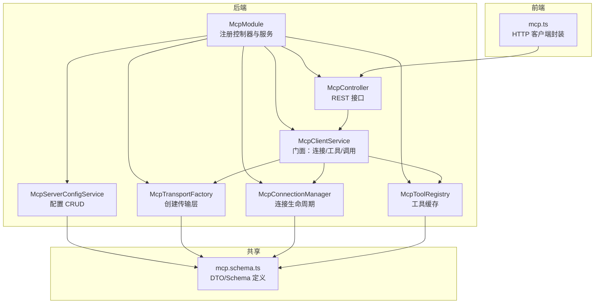
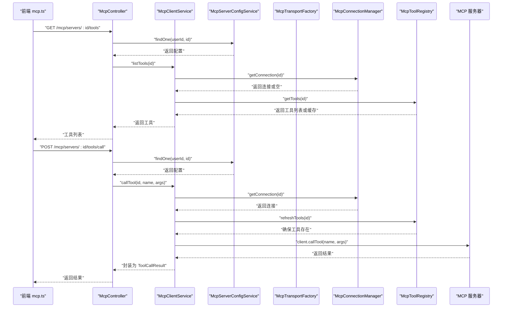
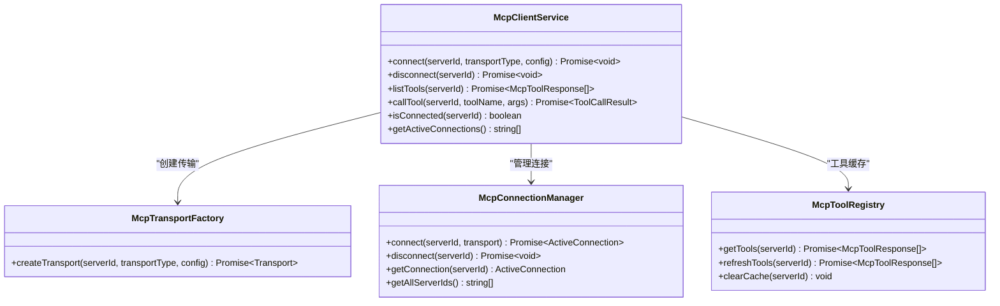
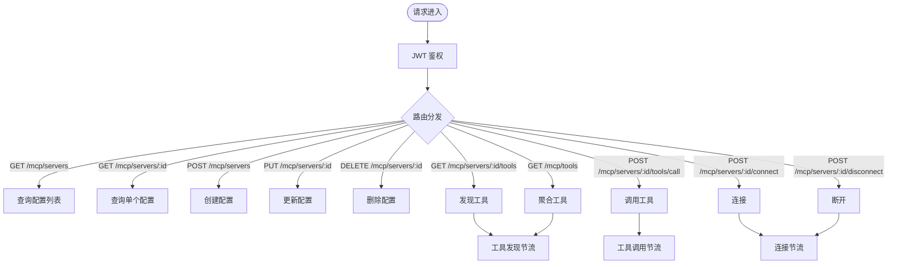
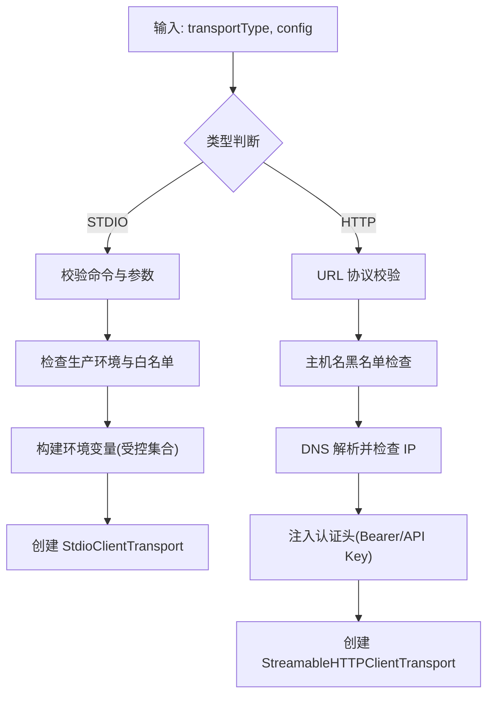
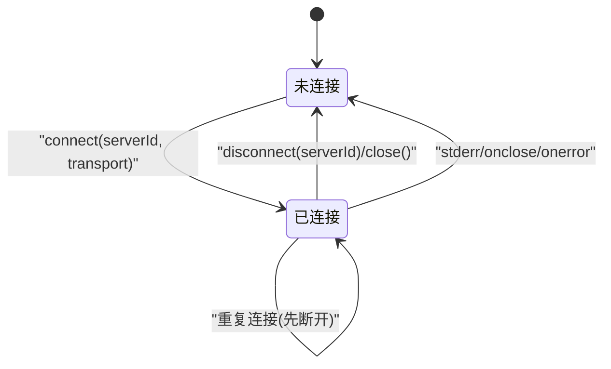
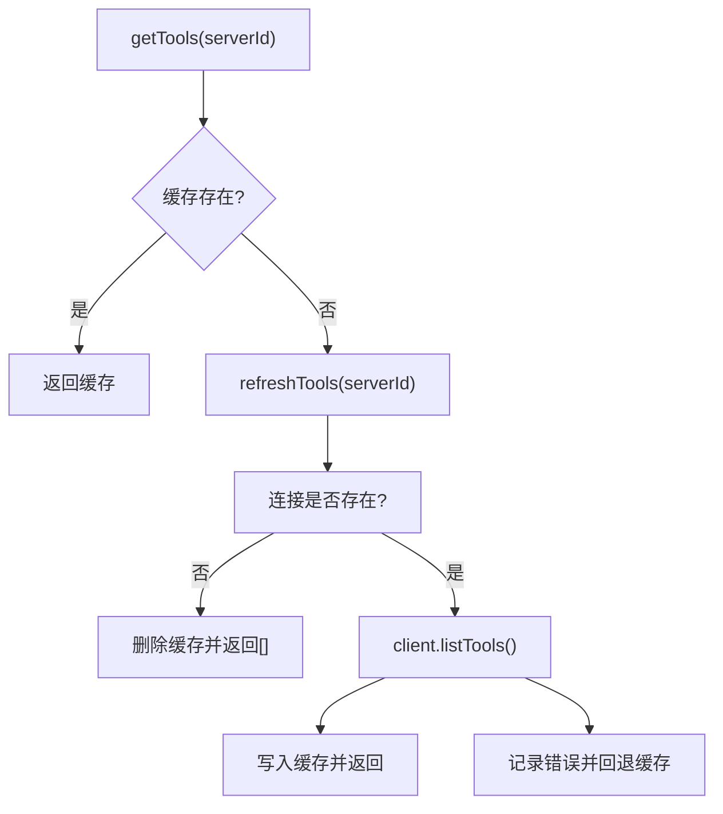
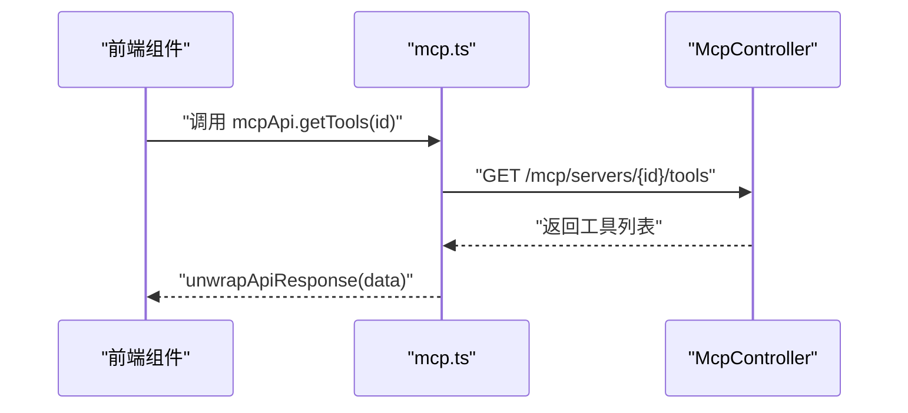
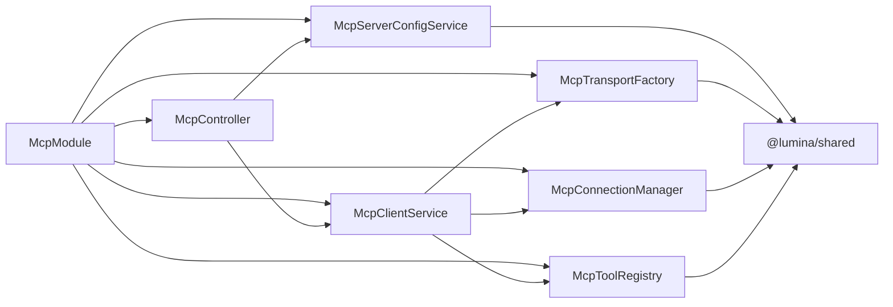

# MCP客户端集成

<cite>
**本文引用的文件**
- [apps/backend/src/mcp/mcp-client.service.ts](file://apps/backend/src/mcp/mcp-client.service.ts)
- [apps/backend/src/mcp/mcp.controller.ts](file://apps/backend/src/mcp/mcp.controller.ts)
- [apps/backend/src/mcp/mcp.dto.ts](file://apps/backend/src/mcp/mcp.dto.ts)
- [apps/backend/src/mcp/mcp.module.ts](file://apps/backend/src/mcp/mcp.module.ts)
- [apps/backend/src/mcp/mcp-server-config.service.ts](file://apps/backend/src/mcp/mcp-server-config.service.ts)
- [apps/backend/src/mcp/core/mcp-transport.factory.ts](file://apps/backend/src/mcp/core/mcp-transport.factory.ts)
- [apps/backend/src/mcp/core/mcp-connection.manager.ts](file://apps/backend/src/mcp/core/mcp-connection.manager.ts)
- [apps/backend/src/mcp/core/mcp-tool.registry.ts](file://apps/backend/src/mcp/core/mcp-tool.registry.ts)
- [packages/shared/src/schemas/mcp.schema.ts](file://packages/shared/src/schemas/mcp.schema.ts)
- [apps/frontend/src/features/mcp/api/mcp.ts](file://apps/frontend/src/features/mcp/api/mcp.ts)
- [apps/backend/src/common/throttling/throttling.constants.ts](file://apps/backend/src/common/throttling/throttling.constants.ts)
- [apps/backend/tests/mcp/mcp-client.service.spec.ts](file://apps/backend/tests/mcp/mcp-client.service.spec.ts)
- [apps/backend/tests/mcp/mcp-transport.factory.spec.ts](file://apps/backend/tests/mcp/mcp-transport.factory.spec.ts)
</cite>

## 目录
1. [简介](#简介)
2. [项目结构](#项目结构)
3. [核心组件](#核心组件)
4. [架构总览](#架构总览)
5. [详细组件分析](#详细组件分析)
6. [依赖关系分析](#依赖关系分析)
7. [性能考量](#性能考量)
8. [故障排查指南](#故障排查指南)
9. [结论](#结论)
10. [附录](#附录)

## 简介
本文件面向需要在系统中集成 MCP（Model Context Protocol）客户端能力的开发者，提供从后端 NestJS 服务到前端 API 的完整集成指南。文档覆盖以下关键主题：
- 设计架构与职责划分
- 客户端初始化流程、连接与断开
- 工具发现与调用流程、参数传递与响应处理
- 前端 API 封装与 HTTP 客户端使用
- 错误处理策略与安全限制
- 连接池与缓存管理
- API 调用示例与最佳实践

## 项目结构
MCP 客户端相关代码主要分布在后端模块与共享包中，并由前端提供统一的 API 封装。

图表来源
- [apps/backend/src/mcp/mcp.module.ts:13-22](file://apps/backend/src/mcp/mcp.module.ts#L13-L22)
- [apps/backend/src/mcp/mcp.controller.ts:40-46](file://apps/backend/src/mcp/mcp.controller.ts#L40-L46)
- [apps/backend/src/mcp/mcp-client.service.ts:18-28](file://apps/backend/src/mcp/mcp-client.service.ts#L18-L28)
- [apps/backend/src/mcp/mcp-server-config.service.ts:10-13](file://apps/backend/src/mcp/mcp-server-config.service.ts#L10-L13)
- [apps/backend/src/mcp/core/mcp-transport.factory.ts:10-11](file://apps/backend/src/mcp/core/mcp-transport.factory.ts#L10-L11)
- [apps/backend/src/mcp/core/mcp-connection.manager.ts:12-15](file://apps/backend/src/mcp/core/mcp-connection.manager.ts#L12-L15)
- [apps/backend/src/mcp/core/mcp-tool.registry.ts:5-10](file://apps/backend/src/mcp/core/mcp-tool.registry.ts#L5-L10)
- [packages/shared/src/schemas/mcp.schema.ts:1-220](file://packages/shared/src/schemas/mcp.schema.ts#L1-L220)
- [apps/frontend/src/features/mcp/api/mcp.ts:16-107](file://apps/frontend/src/features/mcp/api/mcp.ts#L16-L107)

章节来源
- [apps/backend/src/mcp/mcp.module.ts:13-22](file://apps/backend/src/mcp/mcp.module.ts#L13-L22)
- [apps/backend/src/mcp/mcp.controller.ts:40-46](file://apps/backend/src/mcp/mcp.controller.ts#L40-L46)
- [apps/backend/src/mcp/mcp-client.service.ts:18-28](file://apps/backend/src/mcp/mcp-client.service.ts#L18-L28)
- [apps/backend/src/mcp/mcp-server-config.service.ts:10-13](file://apps/backend/src/mcp/mcp-server-config.service.ts#L10-L13)
- [apps/backend/src/mcp/core/mcp-transport.factory.ts:10-11](file://apps/backend/src/mcp/core/mcp-transport.factory.ts#L10-L11)
- [apps/backend/src/mcp/core/mcp-connection.manager.ts:12-15](file://apps/backend/src/mcp/core/mcp-connection.manager.ts#L12-L15)
- [apps/backend/src/mcp/core/mcp-tool.registry.ts:5-10](file://apps/backend/src/mcp/core/mcp-tool.registry.ts#L5-L10)
- [packages/shared/src/schemas/mcp.schema.ts:1-220](file://packages/shared/src/schemas/mcp.schema.ts#L1-L220)
- [apps/frontend/src/features/mcp/api/mcp.ts:16-107](file://apps/frontend/src/features/mcp/api/mcp.ts#L16-L107)

## 核心组件
- McpClientService：统一门面，负责连接管理、工具发现与调用、连接状态查询与清理。
- McpController：提供 REST API，包括配置 CRUD、连接/断开、工具发现、工具调用等。
- McpServerConfigService：用户维度的 MCP 服务器配置持久化与权限控制。
- McpTransportFactory：根据传输类型创建 STDIO 或 HTTP 传输，内置安全检查与环境变量白名单。
- McpConnectionManager：维护连接映射，负责连接生命周期与错误事件处理。
- McpToolRegistry：缓存工具清单，支持刷新与清理。
- 前端 mcp.ts：对后端 API 的封装，提供统一的请求方法与超时配置。

章节来源
- [apps/backend/src/mcp/mcp-client.service.ts:18-123](file://apps/backend/src/mcp/mcp-client.service.ts#L18-L123)
- [apps/backend/src/mcp/mcp.controller.ts:40-208](file://apps/backend/src/mcp/mcp.controller.ts#L40-L208)
- [apps/backend/src/mcp/mcp-server-config.service.ts:10-155](file://apps/backend/src/mcp/mcp-server-config.service.ts#L10-L155)
- [apps/backend/src/mcp/core/mcp-transport.factory.ts:10-219](file://apps/backend/src/mcp/core/mcp-transport.factory.ts#L10-L219)
- [apps/backend/src/mcp/core/mcp-connection.manager.ts:12-100](file://apps/backend/src/mcp/core/mcp-connection.manager.ts#L12-L100)
- [apps/backend/src/mcp/core/mcp-tool.registry.ts:5-47](file://apps/backend/src/mcp/core/mcp-tool.registry.ts#L5-L47)
- [apps/frontend/src/features/mcp/api/mcp.ts:16-107](file://apps/frontend/src/features/mcp/api/mcp.ts#L16-L107)

## 架构总览
下图展示从前端到后端再到 MCP 服务器的整体调用链路与数据流。

图表来源
- [apps/backend/src/mcp/mcp.controller.ts:168-207](file://apps/backend/src/mcp/mcp.controller.ts#L168-L207)
- [apps/backend/src/mcp/mcp-client.service.ts:60-108](file://apps/backend/src/mcp/mcp-client.service.ts#L60-L108)
- [apps/backend/src/mcp/core/mcp-tool.registry.ts:12-41](file://apps/backend/src/mcp/core/mcp-tool.registry.ts#L12-L41)
- [apps/backend/src/mcp/core/mcp-connection.manager.ts:89-95](file://apps/backend/src/mcp/core/mcp-connection.manager.ts#L89-L95)
- [apps/frontend/src/features/mcp/api/mcp.ts:59-84](file://apps/frontend/src/features/mcp/api/mcp.ts#L59-L84)

## 详细组件分析

### McpClientService：客户端门面
- 职责
  - 连接/断开：通过工厂创建传输，交由连接管理器建立或关闭连接。
  - 工具发现：先检查连接，再通过工具注册表获取/刷新工具清单。
  - 工具调用：校验工具存在性，调用底层 client.callTool，封装返回结果。
  - 状态查询：判断连接状态、列出活跃连接。
- 关键点
  - 连接成功后预热工具注册表，减少首次调用延迟。
  - 工具调用前进行存在性校验，避免无效调用。
  - 返回结果统一为 ToolCallResult，包含内容数组与错误标记。

图表来源
- [apps/backend/src/mcp/mcp-client.service.ts:18-123](file://apps/backend/src/mcp/mcp-client.service.ts#L18-L123)
- [apps/backend/src/mcp/core/mcp-transport.factory.ts:112-126](file://apps/backend/src/mcp/core/mcp-transport.factory.ts#L112-L126)
- [apps/backend/src/mcp/core/mcp-connection.manager.ts:23-95](file://apps/backend/src/mcp/core/mcp-connection.manager.ts#L23-L95)
- [apps/backend/src/mcp/core/mcp-tool.registry.ts:12-46](file://apps/backend/src/mcp/core/mcp-tool.registry.ts#L12-L46)

章节来源
- [apps/backend/src/mcp/mcp-client.service.ts:30-123](file://apps/backend/src/mcp/mcp-client.service.ts#L30-L123)

### McpController：REST API 实现
- 权限与鉴权
  - 使用 JWT 守卫保护所有路由。
  - 所有操作均基于当前用户上下文，读写分离用户维度数据。
- 主要接口
  - 配置管理：创建、查询、更新、删除。
  - 连接管理：连接、断开。
  - 工具发现：按服务器或聚合所有启用服务器的工具。
  - 工具调用：按名称与参数调用。
- 速率限制
  - 对连接、工具发现、工具调用分别施加不同窗口的节流策略，防止滥用。

图表来源
- [apps/backend/src/mcp/mcp.controller.ts:40-208](file://apps/backend/src/mcp/mcp.controller.ts#L40-L208)
- [apps/backend/src/common/throttling/throttling.constants.ts:144-160](file://apps/backend/src/common/throttling/throttling.constants.ts#L144-L160)

章节来源
- [apps/backend/src/mcp/mcp.controller.ts:40-208](file://apps/backend/src/mcp/mcp.controller.ts#L40-L208)
- [apps/backend/src/common/throttling/throttling.constants.ts:144-160](file://apps/backend/src/common/throttling/throttling.constants.ts#L144-L160)

### McpTransportFactory：传输层工厂与安全
- 支持的传输类型
  - STDIO：通过命令与参数启动外部进程，严格控制允许的命令与环境变量。
  - HTTP：StreamableHTTP 客户端，支持 Bearer/OAuth/API Key 认证头注入。
- 安全限制
  - 禁止 localhost、.local、私网地址与回环地址的 HTTP 目标。
  - 生产环境默认禁用 STDIO，除非显式开启并配置允许命令白名单。
  - 仅传递受控环境变量到子进程，避免泄露敏感信息。

图表来源
- [apps/backend/src/mcp/core/mcp-transport.factory.ts:112-218](file://apps/backend/src/mcp/core/mcp-transport.factory.ts#L112-L218)
- [packages/shared/src/schemas/mcp.schema.ts:63-116](file://packages/shared/src/schemas/mcp.schema.ts#L63-L116)

章节来源
- [apps/backend/src/mcp/core/mcp-transport.factory.ts:112-218](file://apps/backend/src/mcp/core/mcp-transport.factory.ts#L112-L218)
- [packages/shared/src/schemas/mcp.schema.ts:63-116](file://packages/shared/src/schemas/mcp.schema.ts#L63-L116)

### McpConnectionManager：连接生命周期
- 维护 serverId -> ActiveConnection 映射。
- 连接建立时设置超时、错误监听与关闭回调；断开时关闭 client 并清理缓存。
- 在模块销毁时自动断开所有连接，保证资源回收。

图表来源
- [apps/backend/src/mcp/core/mcp-connection.manager.ts:23-95](file://apps/backend/src/mcp/core/mcp-connection.manager.ts#L23-L95)

章节来源
- [apps/backend/src/mcp/core/mcp-connection.manager.ts:12-100](file://apps/backend/src/mcp/core/mcp-connection.manager.ts#L12-L100)

### McpToolRegistry：工具缓存与刷新
- 缓存结构：Map<serverId, tools[]>。
- 行为：优先返回缓存；若无连接则清空缓存并返回空；刷新失败时回退到旧缓存。

图表来源
- [apps/backend/src/mcp/core/mcp-tool.registry.ts:12-46](file://apps/backend/src/mcp/core/mcp-tool.registry.ts#L12-L46)

章节来源
- [apps/backend/src/mcp/core/mcp-tool.registry.ts:12-46](file://apps/backend/src/mcp/core/mcp-tool.registry.ts#L12-L46)

### 前端 API 封装：mcp.ts
- 方法概览
  - 服务器配置：getServers/getServer/createServer/updateServer/deleteServer
  - 工具：getTools/getAllTools
  - 连接：connect/disconnect
  - 调用：callTool
- 超时策略
  - 发现工具：30 秒
  - 连接：5 分钟
  - 调用：60 秒
- 数据解包
  - 统一使用共享包的响应包装解包函数。

图表来源
- [apps/frontend/src/features/mcp/api/mcp.ts:59-84](file://apps/frontend/src/features/mcp/api/mcp.ts#L59-L84)
- [apps/backend/src/mcp/mcp.controller.ts:168-184](file://apps/backend/src/mcp/mcp.controller.ts#L168-L184)

章节来源
- [apps/frontend/src/features/mcp/api/mcp.ts:16-107](file://apps/frontend/src/features/mcp/api/mcp.ts#L16-L107)

## 依赖关系分析
- 模块耦合
  - McpModule 统一导出配置服务与客户端服务，便于其他模块按需注入。
  - McpController 仅依赖服务层，不直接操作传输层，职责清晰。
- 外部依赖
  - @modelcontextprotocol/sdk：提供 STDIO 与 HTTP 传输及 Client。
  - 共享包 @lumina/shared：前后端一致的 DTO 与 Schema。
- 循环依赖
  - 通过门面与服务层解耦，未见循环依赖迹象。

图表来源
- [apps/backend/src/mcp/mcp.module.ts:13-22](file://apps/backend/src/mcp/mcp.module.ts#L13-L22)
- [apps/backend/src/mcp/mcp-client.service.ts:18-28](file://apps/backend/src/mcp/mcp-client.service.ts#L18-L28)
- [apps/backend/src/mcp/mcp.controller.ts:40-46](file://apps/backend/src/mcp/mcp.controller.ts#L40-L46)
- [apps/backend/src/mcp/mcp-server-config.service.ts:10-13](file://apps/backend/src/mcp/mcp-server-config.service.ts#L10-L13)
- [packages/shared/src/schemas/mcp.schema.ts:1-220](file://packages/shared/src/schemas/mcp.schema.ts#L1-L220)

章节来源
- [apps/backend/src/mcp/mcp.module.ts:13-22](file://apps/backend/src/mcp/mcp.module.ts#L13-L22)
- [apps/backend/src/mcp/mcp-client.service.ts:18-28](file://apps/backend/src/mcp/mcp-client.service.ts#L18-L28)
- [apps/backend/src/mcp/mcp.controller.ts:40-46](file://apps/backend/src/mcp/mcp.controller.ts#L40-L46)
- [apps/backend/src/mcp/mcp-server-config.service.ts:10-13](file://apps/backend/src/mcp/mcp-server-config.service.ts#L10-L13)
- [packages/shared/src/schemas/mcp.schema.ts:1-220](file://packages/shared/src/schemas/mcp.schema.ts#L1-L220)

## 性能考量
- 连接复用
  - 连接管理器以 serverId 为键维护连接，避免重复握手。
- 工具缓存
  - 工具注册表缓存工具清单，减少频繁 listTools 请求。
- 超时与节流
  - 前端针对工具发现与调用设置合理超时；后端对连接、工具发现、工具调用分别设置节流策略，防止抖动与滥用。
- 传输选择
  - HTTP 传输具备更好的网络鲁棒性；STDIO 适合本地可信进程，但受限于环境变量与命令白名单。

章节来源
- [apps/backend/src/mcp/core/mcp-tool.registry.ts:12-46](file://apps/backend/src/mcp/core/mcp-tool.registry.ts#L12-L46)
- [apps/backend/src/common/throttling/throttling.constants.ts:144-160](file://apps/backend/src/common/throttling/throttling.constants.ts#L144-L160)
- [apps/frontend/src/features/mcp/api/mcp.ts:62-82](file://apps/frontend/src/features/mcp/api/mcp.ts#L62-L82)

## 故障排查指南
- 常见错误与定位
  - “未连接到 MCP 服务器”：确认已调用连接接口或在调用工具前自动连接。
  - “工具不存在”：确认工具名称拼写正确，或重新刷新工具缓存。
  - “STDIO 传输被禁用”：检查生产环境变量与命令白名单配置。
  - “HTTP 主机被阻止”：确认目标 URL 不是 localhost、.local 或私网地址。
- 日志与监控
  - 后端日志包含连接、断开、工具刷新与调用的关键事件，便于定位问题。
- 测试参考
  - 单元测试覆盖了连接、工具发现与调用、断开等关键路径，可作为行为参考。

章节来源
- [apps/backend/src/mcp/mcp-client.service.ts:74-108](file://apps/backend/src/mcp/mcp-client.service.ts#L74-L108)
- [apps/backend/src/mcp/core/mcp-transport.factory.ts:91-110](file://apps/backend/src/mcp/core/mcp-transport.factory.ts#L91-L110)
- [apps/backend/tests/mcp/mcp-client.service.spec.ts:118-130](file://apps/backend/tests/mcp/mcp-client.service.spec.ts#L118-L130)
- [apps/backend/tests/mcp/mcp-transport.factory.spec.ts:94-126](file://apps/backend/tests/mcp/mcp-transport.factory.spec.ts#L94-L126)

## 结论
该 MCP 客户端集成方案通过清晰的模块划分与安全约束，提供了稳定、可扩展的工具调用能力。后端以门面服务为核心，结合传输工厂、连接管理与工具缓存，实现了高效的工具发现与调用；前端提供统一 API 封装与合理的超时策略。配合节流与安全检查，整体具备良好的生产可用性。

## 附录

### API 定义与调用示例
- 获取服务器配置列表
  - 方法：GET
  - 路径：/mcp/servers
  - 前端封装：参见 [apps/frontend/src/features/mcp/api/mcp.ts:20-23](file://apps/frontend/src/features/mcp/api/mcp.ts#L20-L23)
- 获取单个服务器配置
  - 方法：GET
  - 路径：/mcp/servers/{id}
  - 前端封装：参见 [apps/frontend/src/features/mcp/api/mcp.ts:28-31](file://apps/frontend/src/features/mcp/api/mcp.ts#L28-L31)
- 创建服务器配置
  - 方法：POST
  - 路径：/mcp/servers
  - 前端封装：参见 [apps/frontend/src/features/mcp/api/mcp.ts:36-39](file://apps/frontend/src/features/mcp/api/mcp.ts#L36-L39)
- 更新服务器配置
  - 方法：PUT
  - 路径：/mcp/servers/{id}
  - 前端封装：参见 [apps/frontend/src/features/mcp/api/mcp.ts:44-47](file://apps/frontend/src/features/mcp/api/mcp.ts#L44-L47)
- 删除服务器配置
  - 方法：DELETE
  - 路径：/mcp/servers/{id}
  - 前端封装：参见 [apps/frontend/src/features/mcp/api/mcp.ts:52-54](file://apps/frontend/src/features/mcp/api/mcp.ts#L52-L54)
- 获取服务器工具列表
  - 方法：GET
  - 路径：/mcp/servers/{id}/tools
  - 前端封装：参见 [apps/frontend/src/features/mcp/api/mcp.ts:59-65](file://apps/frontend/src/features/mcp/api/mcp.ts#L59-L65)
- 聚合所有启用服务器的工具
  - 方法：GET
  - 路径：/mcp/tools
  - 前端封装：参见 [apps/frontend/src/features/mcp/api/mcp.ts:103-106](file://apps/frontend/src/features/mcp/api/mcp.ts#L103-L106)
- 连接服务器
  - 方法：POST
  - 路径：/mcp/servers/{id}/connect
  - 前端封装：参见 [apps/frontend/src/features/mcp/api/mcp.ts:89-91](file://apps/frontend/src/features/mcp/api/mcp.ts#L89-L91)
- 断开服务器连接
  - 方法：POST
  - 路径：/mcp/servers/{id}/disconnect
  - 前端封装：参见 [apps/frontend/src/features/mcp/api/mcp.ts:96-98](file://apps/frontend/src/features/mcp/api/mcp.ts#L96-L98)
- 调用工具
  - 方法：POST
  - 路径：/mcp/servers/{id}/tools/call
  - 前端封装：参见 [apps/frontend/src/features/mcp/api/mcp.ts:70-84](file://apps/frontend/src/features/mcp/api/mcp.ts#L70-L84)

### 错误码与异常
- 未找到配置：后端抛出“未找到”异常，前端捕获并提示。
- 权限不足：后端抛出“禁止访问”异常，前端提示无权限。
- 连接失败：后端记录错误并抛出异常，前端提示重试或检查配置。
- 工具不存在：调用前校验失败，抛出“工具不存在”异常。
- 传输被阻止：STDIO/HTTP 安全检查失败，抛出相应异常。

章节来源
- [apps/backend/src/mcp/mcp-server-config.service.ts:55-58](file://apps/backend/src/mcp/mcp-server-config.service.ts#L55-L58)
- [apps/backend/src/mcp/mcp-server-config.service.ts:124-126](file://apps/backend/src/mcp/mcp-server-config.service.ts#L124-L126)
- [apps/backend/src/mcp/mcp-client.service.ts:76-87](file://apps/backend/src/mcp/mcp-client.service.ts#L76-L87)
- [apps/backend/src/mcp/core/mcp-transport.factory.ts:91-110](file://apps/backend/src/mcp/core/mcp-transport.factory.ts#L91-L110)

### 最佳实践
- 配置管理
  - 为每个服务器配置唯一标识与描述，启用字段默认开启，便于快速接入。
- 连接策略
  - 工具调用前自动连接，避免手动管理；断开时清理缓存，确保下次刷新。
- 安全配置
  - 生产环境务必配置 STDIO 命令白名单；HTTP 仅使用公网 HTTPS 地址。
- 超时与节流
  - 前端针对工具发现与调用设置合理超时；后端对高频接口设置节流，防止滥用。
- 响应处理
  - 统一使用共享包的响应包装与解包，保证前后端一致性。

章节来源
- [apps/backend/src/mcp/mcp-client.service.ts:33-55](file://apps/backend/src/mcp/mcp-client.service.ts#L33-L55)
- [apps/backend/src/mcp/core/mcp-transport.factory.ts:67-89](file://apps/backend/src/mcp/core/mcp-transport.factory.ts#L67-L89)
- [apps/frontend/src/features/mcp/api/mcp.ts:62-82](file://apps/frontend/src/features/mcp/api/mcp.ts#L62-L82)
- [apps/backend/src/common/throttling/throttling.constants.ts:144-160](file://apps/backend/src/common/throttling/throttling.constants.ts#L144-L160)