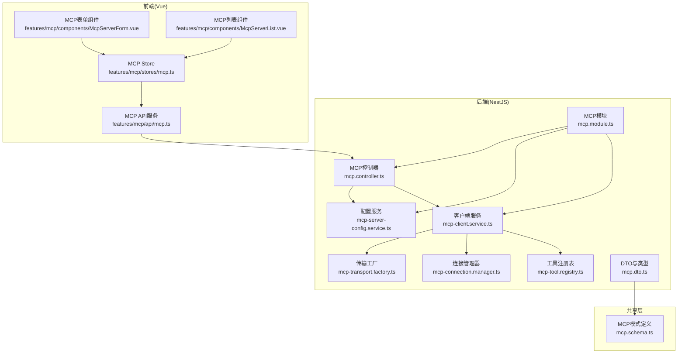
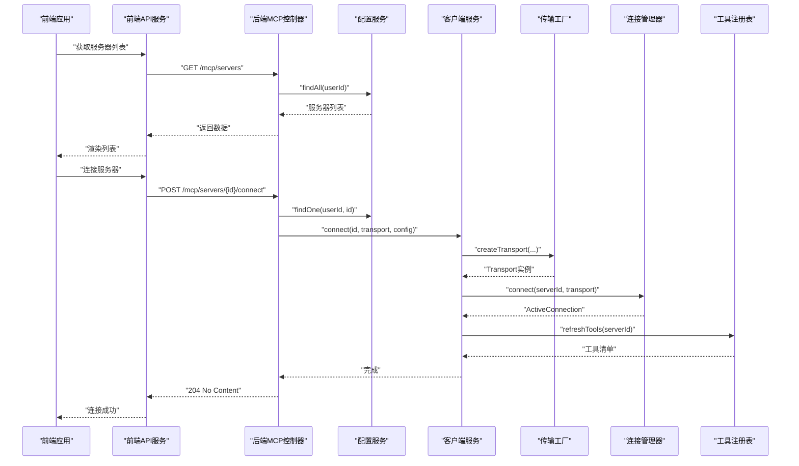
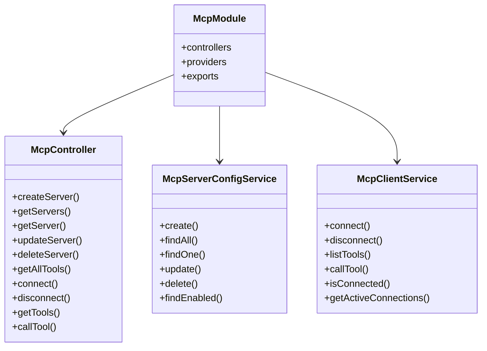
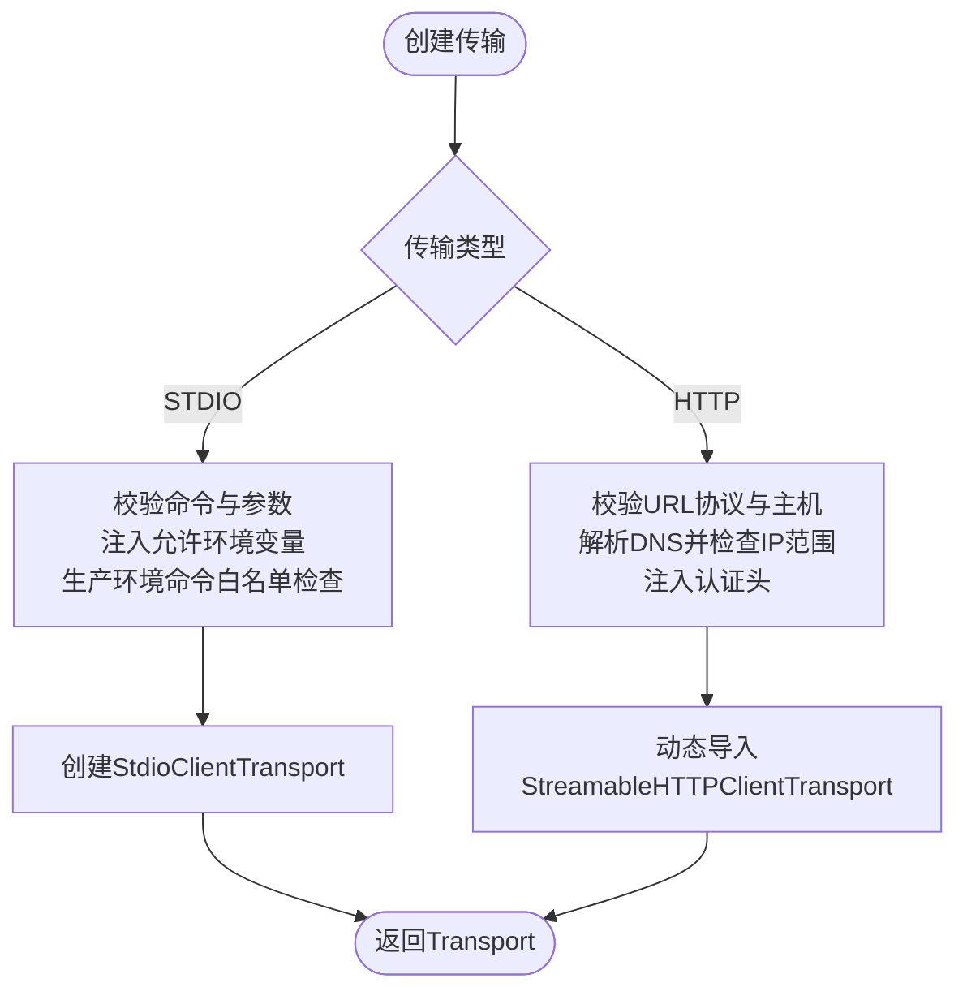
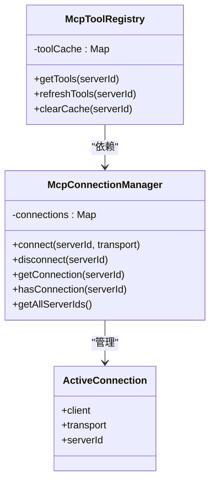
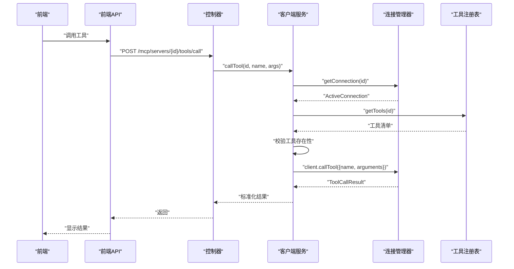
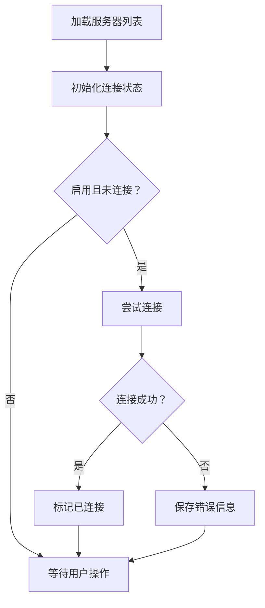
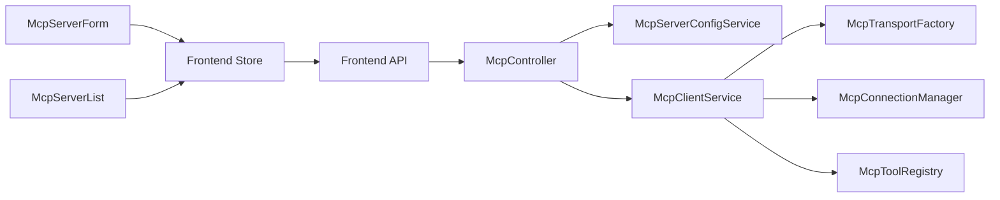

# MCP工具系统

<cite>
**本文档引用的文件**
- [apps/backend/src/mcp/mcp.module.ts](file://apps/backend/src/mcp/mcp.module.ts)
- [apps/backend/src/mcp/mcp.controller.ts](file://apps/backend/src/mcp/mcp.controller.ts)
- [apps/backend/src/mcp/mcp.dto.ts](file://apps/backend/src/mcp/mcp.dto.ts)
- [apps/backend/src/mcp/mcp-client.service.ts](file://apps/backend/src/mcp/mcp-client.service.ts)
- [apps/backend/src/mcp/mcp-server-config.service.ts](file://apps/backend/src/mcp/mcp-server-config.service.ts)
- [apps/backend/src/mcp/core/mcp-transport.factory.ts](file://apps/backend/src/mcp/core/mcp-transport.factory.ts)
- [apps/backend/src/mcp/core/mcp-connection.manager.ts](file://apps/backend/src/mcp/core/mcp-connection.manager.ts)
- [apps/backend/src/mcp/core/mcp-tool.registry.ts](file://apps/backend/src/mcp/core/mcp-tool.registry.ts)
- [packages/shared/src/schemas/mcp.schema.ts](file://packages/shared/src/schemas/mcp.schema.ts)
- [apps/frontend/src/features/mcp/api/mcp.ts](file://apps/frontend/src/features/mcp/api/mcp.ts)
- [apps/frontend/src/features/mcp/stores/mcp.ts](file://apps/frontend/src/features/mcp/stores/mcp.ts)
- [apps/frontend/src/features/mcp/components/McpServerForm.vue](file://apps/frontend/src/features/mcp/components/McpServerForm.vue)
- [apps/frontend/src/features/mcp/components/McpServerList.vue](file://apps/frontend/src/features/mcp/components/McpServerList.vue)
- [apps/backend/tests/mcp/mcp-client.service.spec.ts](file://apps/backend/tests/mcp/mcp-client.service.spec.ts)
- [apps/backend/tests/mcp/mcp-server-config.service.spec.ts](file://apps/backend/tests/mcp/mcp-server-config.service.spec.ts)
</cite>

## 目录
1. [简介](#简介)
2. [项目结构](#项目结构)
3. [核心组件](#核心组件)
4. [架构总览](#架构总览)
5. [详细组件分析](#详细组件分析)
6. [依赖关系分析](#依赖关系分析)
7. [性能考虑](#性能考虑)
8. [故障排除指南](#故障排除指南)
9. [结论](#结论)
10. [附录](#附录)

## 简介
本文件面向Lumina Todo的MCP（Model Context Protocol）工具系统，系统性阐述其在后端的实现原理、服务器配置管理、工具发现机制；以及在前端的工具配置界面与状态管理。文档覆盖以下关键主题：
- Model Context Protocol的实现原理与约束
- 服务器配置管理（创建、查询、更新、删除）
- 工具发现机制与工具注册表
- MCP客户端服务的连接管理、工具注册表、传输工厂设计
- 后端MCP模块的架构设计
- 前端工具配置界面与API接口规范
- MCP服务器的HTTP与STDIO传输方式
- 工具调用流程与错误处理机制
- 配置示例、集成指南、权限管理与状态监控
- 与AI助手系统的协作模式与最佳实践

## 项目结构
MCP工具系统主要由后端NestJS模块与前端Vue应用组成，共享层提供跨端数据模式定义。

**图表来源**
- [apps/backend/src/mcp/mcp.module.ts:1-25](file://apps/backend/src/mcp/mcp.module.ts#L1-L25)
- [apps/backend/src/mcp/mcp.controller.ts:1-209](file://apps/backend/src/mcp/mcp.controller.ts#L1-L209)
- [apps/backend/src/mcp/mcp-client.service.ts:1-124](file://apps/backend/src/mcp/mcp-client.service.ts#L1-L124)
- [apps/backend/src/mcp/mcp-server-config.service.ts:1-156](file://apps/backend/src/mcp/mcp-server-config.service.ts#L1-L156)
- [apps/backend/src/mcp/core/mcp-transport.factory.ts:1-220](file://apps/backend/src/mcp/core/mcp-transport.factory.ts#L1-L220)
- [apps/backend/src/mcp/core/mcp-connection.manager.ts:1-101](file://apps/backend/src/mcp/core/mcp-connection.manager.ts#L1-L101)
- [apps/backend/src/mcp/core/mcp-tool.registry.ts:1-48](file://apps/backend/src/mcp/core/mcp-tool.registry.ts#L1-L48)
- [apps/backend/src/mcp/mcp.dto.ts:1-59](file://apps/backend/src/mcp/mcp.dto.ts#L1-L59)
- [packages/shared/src/schemas/mcp.schema.ts:1-220](file://packages/shared/src/schemas/mcp.schema.ts#L1-L220)
- [apps/frontend/src/features/mcp/api/mcp.ts:1-108](file://apps/frontend/src/features/mcp/api/mcp.ts#L1-L108)
- [apps/frontend/src/features/mcp/stores/mcp.ts:1-246](file://apps/frontend/src/features/mcp/stores/mcp.ts#L1-L246)
- [apps/frontend/src/features/mcp/components/McpServerForm.vue:1-188](file://apps/frontend/src/features/mcp/components/McpServerForm.vue#L1-L188)
- [apps/frontend/src/features/mcp/components/McpServerList.vue:1-351](file://apps/frontend/src/features/mcp/components/McpServerList.vue#L1-L351)

**章节来源**
- [apps/backend/src/mcp/mcp.module.ts:1-25](file://apps/backend/src/mcp/mcp.module.ts#L1-L25)
- [apps/backend/src/mcp/mcp.controller.ts:1-209](file://apps/backend/src/mcp/mcp.controller.ts#L1-L209)
- [apps/backend/src/mcp/mcp-client.service.ts:1-124](file://apps/backend/src/mcp/mcp-client.service.ts#L1-L124)
- [apps/backend/src/mcp/mcp-server-config.service.ts:1-156](file://apps/backend/src/mcp/mcp-server-config.service.ts#L1-L156)
- [apps/backend/src/mcp/core/mcp-transport.factory.ts:1-220](file://apps/backend/src/mcp/core/mcp-transport.factory.ts#L1-L220)
- [apps/backend/src/mcp/core/mcp-connection.manager.ts:1-101](file://apps/backend/src/mcp/core/mcp-connection.manager.ts#L1-L101)
- [apps/backend/src/mcp/core/mcp-tool.registry.ts:1-48](file://apps/backend/src/mcp/core/mcp-tool.registry.ts#L1-L48)
- [apps/backend/src/mcp/mcp.dto.ts:1-59](file://apps/backend/src/mcp/mcp.dto.ts#L1-L59)
- [packages/shared/src/schemas/mcp.schema.ts:1-220](file://packages/shared/src/schemas/mcp.schema.ts#L1-L220)
- [apps/frontend/src/features/mcp/api/mcp.ts:1-108](file://apps/frontend/src/features/mcp/api/mcp.ts#L1-L108)
- [apps/frontend/src/features/mcp/stores/mcp.ts:1-246](file://apps/frontend/src/features/mcp/stores/mcp.ts#L1-L246)
- [apps/frontend/src/features/mcp/components/McpServerForm.vue:1-188](file://apps/frontend/src/features/mcp/components/McpServerForm.vue#L1-L188)
- [apps/frontend/src/features/mcp/components/McpServerList.vue:1-351](file://apps/frontend/src/features/mcp/components/McpServerList.vue#L1-L351)

## 核心组件
- MCP模块：集中导出与装配核心服务，提供控制器入口。
- MCP控制器：暴露REST API，负责鉴权、节流、权限校验与业务编排。
- 配置服务：持久化用户MCP服务器配置，支持CRUD与启用筛选。
- 客户端服务：统一门面，协调传输工厂、连接管理器与工具注册表。
- 传输工厂：根据传输类型创建STDIO或HTTP传输，并进行安全校验与环境注入。
- 连接管理器：维护活跃连接，处理连接生命周期与错误事件。
- 工具注册表：缓存工具清单，支持刷新与清理。
- 前端API与Store：封装后端API，管理服务器状态、连接状态与错误信息。
- 表单与列表组件：提供可视化配置与运维界面。

**章节来源**
- [apps/backend/src/mcp/mcp.module.ts:1-25](file://apps/backend/src/mcp/mcp.module.ts#L1-L25)
- [apps/backend/src/mcp/mcp.controller.ts:1-209](file://apps/backend/src/mcp/mcp.controller.ts#L1-L209)
- [apps/backend/src/mcp/mcp-server-config.service.ts:1-156](file://apps/backend/src/mcp/mcp-server-config.service.ts#L1-L156)
- [apps/backend/src/mcp/mcp-client.service.ts:1-124](file://apps/backend/src/mcp/mcp-client.service.ts#L1-L124)
- [apps/backend/src/mcp/core/mcp-transport.factory.ts:1-220](file://apps/backend/src/mcp/core/mcp-transport.factory.ts#L1-L220)
- [apps/backend/src/mcp/core/mcp-connection.manager.ts:1-101](file://apps/backend/src/mcp/core/mcp-connection.manager.ts#L1-L101)
- [apps/backend/src/mcp/core/mcp-tool.registry.ts:1-48](file://apps/backend/src/mcp/core/mcp-tool.registry.ts#L1-L48)
- [apps/frontend/src/features/mcp/api/mcp.ts:1-108](file://apps/frontend/src/features/mcp/api/mcp.ts#L1-L108)
- [apps/frontend/src/features/mcp/stores/mcp.ts:1-246](file://apps/frontend/src/features/mcp/stores/mcp.ts#L1-L246)

## 架构总览
系统采用分层架构：前端通过API与Store与后端交互；后端控制器作为入口，委派给配置服务与客户端服务；客户端服务再委派给传输工厂、连接管理器与工具注册表。共享层提供跨端模式定义，确保前后端一致性。

**图表来源**
- [apps/backend/src/mcp/mcp.controller.ts:141-148](file://apps/backend/src/mcp/mcp.controller.ts#L141-L148)
- [apps/backend/src/mcp/mcp-client.service.ts:33-47](file://apps/backend/src/mcp/mcp-client.service.ts#L33-L47)
- [apps/backend/src/mcp/core/mcp-transport.factory.ts:112-126](file://apps/backend/src/mcp/core/mcp-transport.factory.ts#L112-L126)
- [apps/backend/src/mcp/core/mcp-connection.manager.ts:23-73](file://apps/backend/src/mcp/core/mcp-connection.manager.ts#L23-L73)
- [apps/backend/src/mcp/core/mcp-tool.registry.ts:20-42](file://apps/backend/src/mcp/core/mcp-tool.registry.ts#L20-L42)
- [apps/frontend/src/features/mcp/api/mcp.ts:89-91](file://apps/frontend/src/features/mcp/api/mcp.ts#L89-L91)

**章节来源**
- [apps/backend/src/mcp/mcp.controller.ts:1-209](file://apps/backend/src/mcp/mcp.controller.ts#L1-L209)
- [apps/backend/src/mcp/mcp-client.service.ts:1-124](file://apps/backend/src/mcp/mcp-client.service.ts#L1-L124)
- [apps/backend/src/mcp/core/mcp-transport.factory.ts:1-220](file://apps/backend/src/mcp/core/mcp-transport.factory.ts#L1-L220)
- [apps/backend/src/mcp/core/mcp-connection.manager.ts:1-101](file://apps/backend/src/mcp/core/mcp-connection.manager.ts#L1-L101)
- [apps/backend/src/mcp/core/mcp-tool.registry.ts:1-48](file://apps/backend/src/mcp/core/mcp-tool.registry.ts#L1-L48)
- [apps/frontend/src/features/mcp/api/mcp.ts:1-108](file://apps/frontend/src/features/mcp/api/mcp.ts#L1-L108)

## 详细组件分析

### 后端MCP模块与控制器
- 模块装配：导出配置服务与客户端服务，注入传输工厂、连接管理器、工具注册表。
- 控制器职责：
  - 服务器配置：创建、查询、更新、删除、按启用状态筛选。
  - 连接管理：连接/断开指定服务器，懒加载连接用于工具发现。
  - 工具发现：聚合所有启用服务器的工具清单，注入serverId便于前端识别归属。
  - 工具调用：校验权限与连接状态，调用具体工具并返回结果。

**图表来源**
- [apps/backend/src/mcp/mcp.module.ts:1-25](file://apps/backend/src/mcp/mcp.module.ts#L1-L25)
- [apps/backend/src/mcp/mcp.controller.ts:1-209](file://apps/backend/src/mcp/mcp.controller.ts#L1-L209)
- [apps/backend/src/mcp/mcp-server-config.service.ts:1-156](file://apps/backend/src/mcp/mcp-server-config.service.ts#L1-L156)
- [apps/backend/src/mcp/mcp-client.service.ts:1-124](file://apps/backend/src/mcp/mcp-client.service.ts#L1-L124)

**章节来源**
- [apps/backend/src/mcp/mcp.module.ts:1-25](file://apps/backend/src/mcp/mcp.module.ts#L1-L25)
- [apps/backend/src/mcp/mcp.controller.ts:1-209](file://apps/backend/src/mcp/mcp.controller.ts#L1-L209)
- [apps/backend/src/mcp/mcp-server-config.service.ts:1-156](file://apps/backend/src/mcp/mcp-server-config.service.ts#L1-L156)
- [apps/backend/src/mcp/mcp-client.service.ts:1-124](file://apps/backend/src/mcp/mcp-client.service.ts#L1-L124)

### 传输工厂设计（STDIO与HTTP）
- STDIO传输：
  - 命令与参数校验，禁止命令含空格（需通过args分离）。
  - 环境变量白名单注入，支持NODE_ENV、代理等常见键。
  - 生产环境限制允许命令列表，可通过环境变量配置。
  - 包名纠错：对特定包名进行自动修正。
- HTTP传输：
  - URL协议限制为http/https，主机名与IP地址白名单过滤。
  - 支持Bearer/OAuth/API Key认证，自动注入Authorization头。
  - 动态导入StreamableHTTP传输以支持流式请求。

**图表来源**
- [apps/backend/src/mcp/core/mcp-transport.factory.ts:112-126](file://apps/backend/src/mcp/core/mcp-transport.factory.ts#L112-L126)
- [apps/backend/src/mcp/core/mcp-transport.factory.ts:128-188](file://apps/backend/src/mcp/core/mcp-transport.factory.ts#L128-L188)
- [apps/backend/src/mcp/core/mcp-transport.factory.ts:190-218](file://apps/backend/src/mcp/core/mcp-transport.factory.ts#L190-L218)

**章节来源**
- [apps/backend/src/mcp/core/mcp-transport.factory.ts:1-220](file://apps/backend/src/mcp/core/mcp-transport.factory.ts#L1-L220)
- [packages/shared/src/schemas/mcp.schema.ts:79-118](file://packages/shared/src/schemas/mcp.schema.ts#L79-L118)

### 连接管理器与工具注册表
- 连接管理器：
  - 维护serverId到ActiveConnection的映射，支持重复连接时先断开再连接。
  - 客户端初始化时设置超时时间，STDIO传输监听stderr与关闭事件。
  - 提供连接状态查询与全部serverId枚举。
- 工具注册表：
  - 缓存每个服务器的工具清单，首次访问触发刷新。
  - 连接断开或异常时清理缓存，保证后续刷新可用。

**图表来源**
- [apps/backend/src/mcp/core/mcp-connection.manager.ts:6-101](file://apps/backend/src/mcp/core/mcp-connection.manager.ts#L6-L101)
- [apps/backend/src/mcp/core/mcp-tool.registry.ts:1-48](file://apps/backend/src/mcp/core/mcp-tool.registry.ts#L1-L48)

**章节来源**
- [apps/backend/src/mcp/core/mcp-connection.manager.ts:1-101](file://apps/backend/src/mcp/core/mcp-connection.manager.ts#L1-L101)
- [apps/backend/src/mcp/core/mcp-tool.registry.ts:1-48](file://apps/backend/src/mcp/core/mcp-tool.registry.ts#L1-L48)

### 客户端服务与工具调用流程
- 连接：通过传输工厂创建Transport，交由连接管理器建立连接，随后预热工具注册表。
- 断开：清理工具缓存并断开连接。
- 工具发现：若未连接则懒加载连接，调用工具注册表获取工具清单。
- 工具调用：校验工具存在性，构造调用参数，调用底层客户端的callTool方法，记录日志并返回标准化结果。

**图表来源**
- [apps/backend/src/mcp/mcp.controller.ts:190-207](file://apps/backend/src/mcp/mcp.controller.ts#L190-L207)
- [apps/backend/src/mcp/mcp-client.service.ts:70-108](file://apps/backend/src/mcp/mcp-client.service.ts#L70-L108)
- [apps/backend/src/mcp/core/mcp-tool.registry.ts:12-42](file://apps/backend/src/mcp/core/mcp-tool.registry.ts#L12-L42)
- [apps/frontend/src/features/mcp/api/mcp.ts:70-84](file://apps/frontend/src/features/mcp/api/mcp.ts#L70-L84)

**章节来源**
- [apps/backend/src/mcp/mcp.controller.ts:1-209](file://apps/backend/src/mcp/mcp.controller.ts#L1-L209)
- [apps/backend/src/mcp/mcp-client.service.ts:1-124](file://apps/backend/src/mcp/mcp-client.service.ts#L1-L124)
- [apps/frontend/src/features/mcp/api/mcp.ts:1-108](file://apps/frontend/src/features/mcp/api/mcp.ts#L1-L108)

### 前端工具配置界面与状态管理
- API服务：封装后端REST接口，设置合理超时（连接30s，工具调用60s），统一响应解包。
- Store：
  - 管理服务器列表、加载状态、错误信息。
  - 维护连接状态、正在连接状态与服务器错误信息。
  - 自动连接策略：启用且未连接时自动尝试连接；运行时配置变更时断开后重建连接。
- 表单组件：支持STDIO与HTTP两种传输类型的配置，内置校验与提交准备。
- 列表组件：展示服务器状态、命令/URL、操作按钮（连接/重试/工具/编辑/删除）。

**图表来源**
- [apps/frontend/src/features/mcp/stores/mcp.ts:43-84](file://apps/frontend/src/features/mcp/stores/mcp.ts#L43-L84)
- [apps/frontend/src/features/mcp/stores/mcp.ts:175-202](file://apps/frontend/src/features/mcp/stores/mcp.ts#L175-L202)
- [apps/frontend/src/features/mcp/components/McpServerForm.vue:100-135](file://apps/frontend/src/features/mcp/components/McpServerForm.vue#L100-L135)
- [apps/frontend/src/features/mcp/components/McpServerList.vue:73-85](file://apps/frontend/src/features/mcp/components/McpServerList.vue#L73-L85)

**章节来源**
- [apps/frontend/src/features/mcp/api/mcp.ts:1-108](file://apps/frontend/src/features/mcp/api/mcp.ts#L1-L108)
- [apps/frontend/src/features/mcp/stores/mcp.ts:1-246](file://apps/frontend/src/features/mcp/stores/mcp.ts#L1-L246)
- [apps/frontend/src/features/mcp/components/McpServerForm.vue:1-188](file://apps/frontend/src/features/mcp/components/McpServerForm.vue#L1-L188)
- [apps/frontend/src/features/mcp/components/McpServerList.vue:1-351](file://apps/frontend/src/features/mcp/components/McpServerList.vue#L1-L351)

## 依赖关系分析
- 后端模块内聚：控制器依赖配置服务与客户端服务；客户端服务依赖传输工厂、连接管理器与工具注册表。
- 共享层解耦：共享模式定义确保前后端一致的DTO与Schema，减少重复校验。
- 前后端耦合点：前端API服务直接依赖后端控制器暴露的REST接口。

**图表来源**
- [apps/backend/src/mcp/mcp.controller.ts:1-209](file://apps/backend/src/mcp/mcp.controller.ts#L1-L209)
- [apps/backend/src/mcp/mcp-client.service.ts:1-124](file://apps/backend/src/mcp/mcp-client.service.ts#L1-L124)
- [apps/backend/src/mcp/core/mcp-transport.factory.ts:1-220](file://apps/backend/src/mcp/core/mcp-transport.factory.ts#L1-L220)
- [apps/backend/src/mcp/core/mcp-connection.manager.ts:1-101](file://apps/backend/src/mcp/core/mcp-connection.manager.ts#L1-L101)
- [apps/backend/src/mcp/core/mcp-tool.registry.ts:1-48](file://apps/backend/src/mcp/core/mcp-tool.registry.ts#L1-L48)
- [apps/frontend/src/features/mcp/api/mcp.ts:1-108](file://apps/frontend/src/features/mcp/api/mcp.ts#L1-L108)
- [apps/frontend/src/features/mcp/stores/mcp.ts:1-246](file://apps/frontend/src/features/mcp/stores/mcp.ts#L1-L246)

**章节来源**
- [apps/backend/src/mcp/mcp.controller.ts:1-209](file://apps/backend/src/mcp/mcp.controller.ts#L1-L209)
- [apps/backend/src/mcp/mcp-client.service.ts:1-124](file://apps/backend/src/mcp/mcp-client.service.ts#L1-L124)
- [apps/frontend/src/features/mcp/api/mcp.ts:1-108](file://apps/frontend/src/features/mcp/api/mcp.ts#L1-L108)
- [apps/frontend/src/features/mcp/stores/mcp.ts:1-246](file://apps/frontend/src/features/mcp/stores/mcp.ts#L1-L246)

## 性能考虑
- 连接懒加载：工具发现与调用前仅在必要时建立连接，降低资源占用。
- 工具清单缓存：工具注册表缓存工具清单，避免频繁RPC调用。
- 超时与节流：控制器对连接、工具发现与工具调用设置不同节流阈值，防止滥用。
- 传输优化：HTTP传输采用流式客户端，STDIO传输仅注入必要环境变量，减少启动开销。
- 前端状态管理：Store区分“连接中”与“已连接”，避免重复连接与闪烁。

[本节为通用指导，无需列出章节来源]

## 故障排除指南
- 连接失败
  - 检查传输类型与配置是否匹配（STDIO命令不允许含空格，需拆分为args）。
  - 确认生产环境是否开启STDIO（MCP_ENABLE_STDIO）及命令白名单（MCP_STDIO_ALLOWED_COMMANDS）。
  - 对HTTP传输，确认URL协议为http/https，主机未被阻断，DNS解析可达且IP不在私网/环回范围内。
- 工具不可用
  - 确认服务器已连接；若未连接，控制器会在工具发现与调用时自动尝试连接。
  - 检查工具名称是否正确；客户端服务会校验工具是否存在。
- 权限问题
  - 控制器在多个操作中进行所有权校验，若抛出未找到或无权限异常，需确认当前用户与服务器归属。
- 前端错误
  - Store维护每个服务器的错误信息，可在列表组件中查看并重试连接。
  - API服务对连接与工具调用设置了合理超时，避免长时间挂起。

**章节来源**
- [apps/backend/src/mcp/core/mcp-transport.factory.ts:67-89](file://apps/backend/src/mcp/core/mcp-transport.factory.ts#L67-L89)
- [apps/backend/src/mcp/core/mcp-transport.factory.ts:91-110](file://apps/backend/src/mcp/core/mcp-transport.factory.ts#L91-L110)
- [apps/backend/src/mcp/mcp.controller.ts:120-133](file://apps/backend/src/mcp/mcp.controller.ts#L120-L133)
- [apps/backend/src/mcp/mcp-client.service.ts:80-87](file://apps/backend/src/mcp/mcp-client.service.ts#L80-L87)
- [apps/frontend/src/features/mcp/stores/mcp.ts:175-202](file://apps/frontend/src/features/mcp/stores/mcp.ts#L175-L202)

## 结论
Lumina Todo的MCP工具系统通过清晰的分层设计与严格的传输安全策略，实现了灵活、可扩展且安全的外部工具集成能力。后端以模块化服务为核心，前端提供直观的配置与运维界面，配合共享模式定义确保一致性。通过懒加载连接、工具缓存与合理的超时/节流策略，系统在易用性与性能之间取得良好平衡。

[本节为总结性内容，无需列出章节来源]

## 附录

### API接口规范（后端）
- 服务器配置
  - GET /mcp/servers：获取用户所有服务器配置
  - GET /mcp/servers/:id：按ID获取服务器配置
  - POST /mcp/servers：创建服务器配置
  - PUT /mcp/servers/:id：更新服务器配置
  - DELETE /mcp/servers/:id：删除服务器配置
- 连接管理
  - POST /mcp/servers/:id/connect：连接指定服务器
  - POST /mcp/servers/:id/disconnect：断开指定服务器
- 工具发现与调用
  - GET /mcp/tools：获取所有启用服务器的工具清单
  - GET /mcp/servers/:id/tools：获取指定服务器的工具清单
  - POST /mcp/servers/:id/tools/call：调用指定工具

**章节来源**
- [apps/backend/src/mcp/mcp.controller.ts:51-207](file://apps/backend/src/mcp/mcp.controller.ts#L51-L207)
- [apps/frontend/src/features/mcp/api/mcp.ts:20-106](file://apps/frontend/src/features/mcp/api/mcp.ts#L20-L106)

### 传输配置示例
- STDIO
  - 必填字段：command（不可含空格）、args（数组）
  - 可选字段：env（键值对）、cwd（工作目录）
  - 生产环境要求：MCP_ENABLE_STDIO=true 或配置MCP_STDIO_ALLOWED_COMMANDS
- HTTP
  - 必填字段：url（http/https，不可为localhost/.local/.localhost）
  - 可选字段：headers（键值对）、auth（type=bearer/oauth/api_key，token或apiKey）

**章节来源**
- [packages/shared/src/schemas/mcp.schema.ts:79-118](file://packages/shared/src/schemas/mcp.schema.ts#L79-L118)
- [apps/backend/src/mcp/core/mcp-transport.factory.ts:67-89](file://apps/backend/src/mcp/core/mcp-transport.factory.ts#L67-L89)
- [apps/backend/src/mcp/core/mcp-transport.factory.ts:91-110](file://apps/backend/src/mcp/core/mcp-transport.factory.ts#L91-L110)

### 集成指南
- 添加新MCP工具
  - 在目标MCP服务器上实现工具清单与工具调用接口。
  - 在Lumina中创建服务器配置（选择STDIO或HTTP传输），填写对应配置。
  - 使用“连接”按钮建立连接，随后在“工具”页面查看工具清单。
- 管理工具权限
  - 服务器配置默认启用，可在前端列表中切换启用状态。
  - 控制器在每次操作前进行所有权校验，确保用户只能管理自己的服务器。
- 监控工具状态
  - 前端列表展示连接状态、错误信息与命令/URL信息。
  - Store维护每个服务器的连接状态与错误，便于快速定位问题。

**章节来源**
- [apps/backend/src/mcp/mcp.controller.ts:112-136](file://apps/backend/src/mcp/mcp.controller.ts#L112-L136)
- [apps/frontend/src/features/mcp/components/McpServerList.vue:103-137](file://apps/frontend/src/features/mcp/components/McpServerList.vue#L103-L137)
- [apps/frontend/src/features/mcp/stores/mcp.ts:175-202](file://apps/frontend/src/features/mcp/stores/mcp.ts#L175-L202)

### 与AI助手系统的协作模式
- 自动发现：控制器提供“获取所有启用服务器的工具”接口，供AI助手自动发现可用工具。
- 权限与安全：传输工厂对HTTP与STDIO分别进行安全校验，避免访问内网或不受信任的服务。
- 最佳实践：
  - 优先使用HTTP传输并配置认证头，便于统一管理与审计。
  - 在生产环境严格配置STDIO命令白名单，避免任意命令执行风险。
  - 合理设置节流与超时，避免工具调用影响系统稳定性。

**章节来源**
- [apps/backend/src/mcp/mcp.controller.ts:112-136](file://apps/backend/src/mcp/mcp.controller.ts#L112-L136)
- [apps/backend/src/mcp/core/mcp-transport.factory.ts:91-110](file://apps/backend/src/mcp/core/mcp-transport.factory.ts#L91-L110)
- [apps/backend/src/mcp/core/mcp-transport.factory.ts:67-89](file://apps/backend/src/mcp/core/mcp-transport.factory.ts#L67-L89)