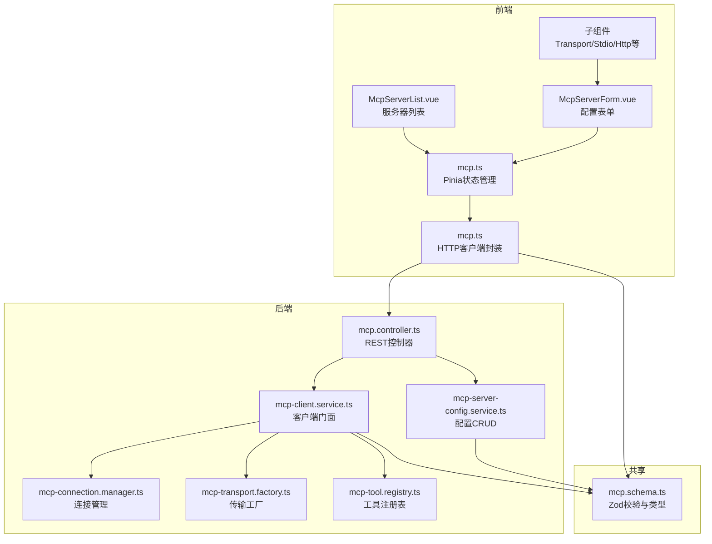
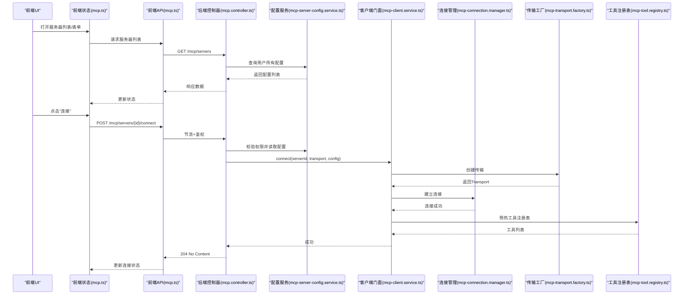
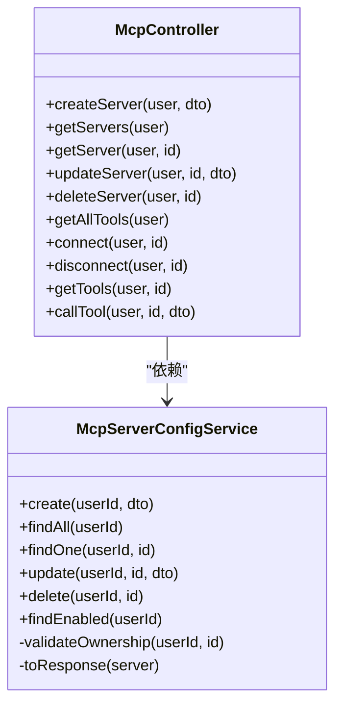
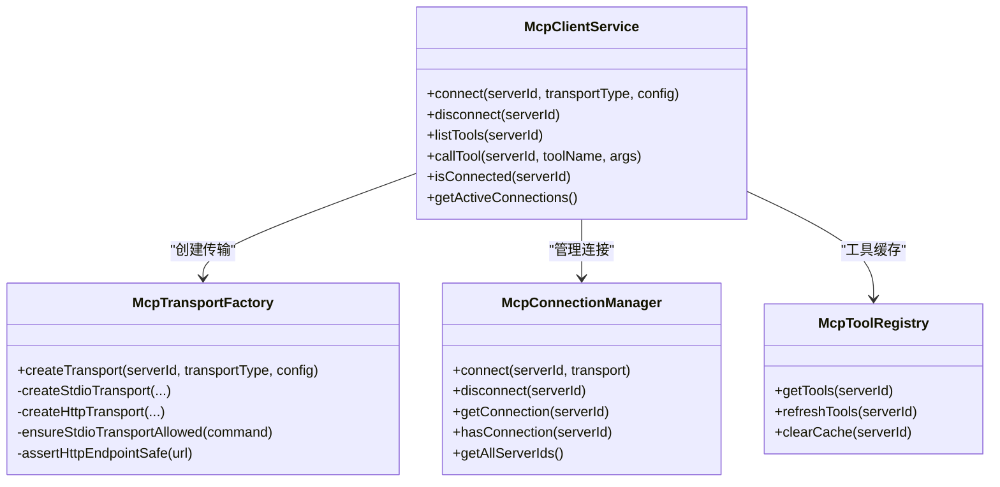
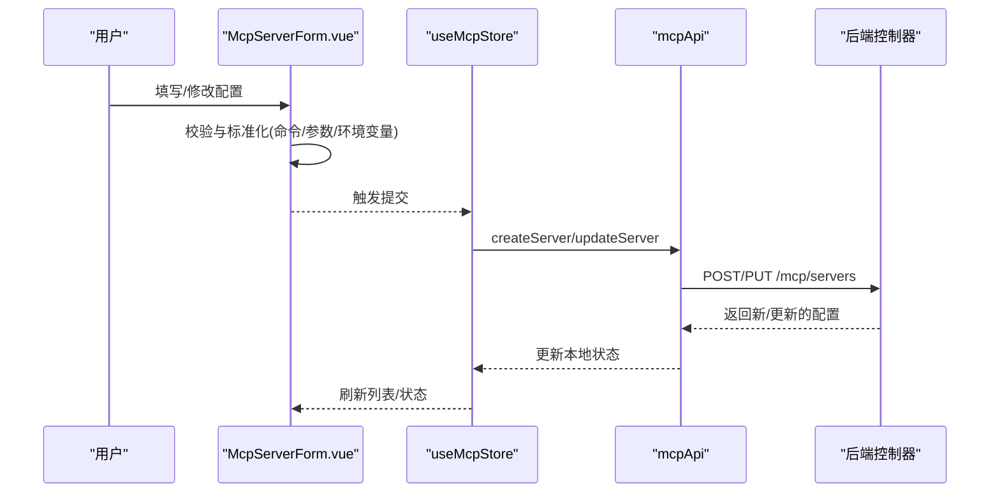
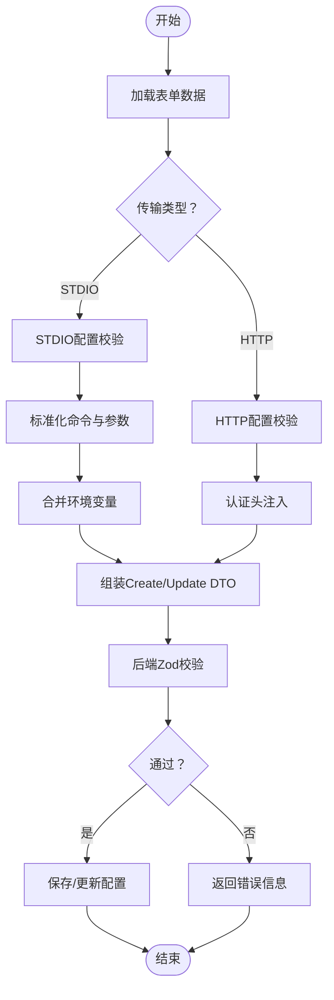
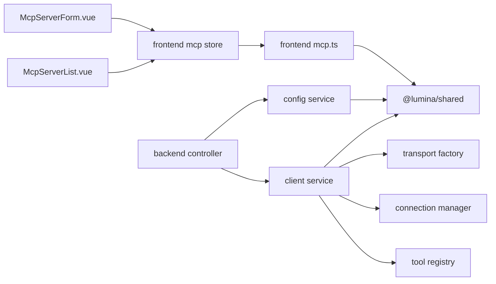

# MCP服务器管理

<cite>
**本文引用的文件**
- [apps/backend/src/mcp/mcp-server-config.service.ts](file://apps/backend/src/mcp/mcp-server-config.service.ts)
- [apps/backend/src/mcp/mcp.controller.ts](file://apps/backend/src/mcp/mcp.controller.ts)
- [apps/backend/src/mcp/mcp.dto.ts](file://apps/backend/src/mcp/mcp.dto.ts)
- [apps/backend/src/mcp/mcp-client.service.ts](file://apps/backend/src/mcp/mcp-client.service.ts)
- [apps/backend/src/mcp/core/mcp-connection.manager.ts](file://apps/backend/src/mcp/core/mcp-connection.manager.ts)
- [apps/backend/src/mcp/core/mcp-transport.factory.ts](file://apps/backend/src/mcp/core/mcp-transport.factory.ts)
- [apps/backend/src/mcp/core/mcp-tool.registry.ts](file://apps/backend/src/mcp/core/mcp-tool.registry.ts)
- [packages/shared/src/schemas/mcp.schema.ts](file://packages/shared/src/schemas/mcp.schema.ts)
- [apps/frontend/src/features/mcp/api/mcp.ts](file://apps/frontend/src/features/mcp/api/mcp.ts)
- [apps/frontend/src/features/mcp/stores/mcp.ts](file://apps/frontend/src/features/mcp/stores/mcp.ts)
- [apps/frontend/src/features/mcp/components/McpServerForm.vue](file://apps/frontend/src/features/mcp/components/McpServerForm.vue)
- [apps/frontend/src/features/mcp/components/McpServerList.vue](file://apps/frontend/src/features/mcp/components/McpServerList.vue)
- [apps/frontend/src/features/mcp/components/McpServerTransportSelector.vue](file://apps/frontend/src/features/mcp/components/McpServerTransportSelector.vue)
- [apps/frontend/src/features/mcp/components/McpServerStdioConfig.vue](file://apps/frontend/src/features/mcp/components/McpServerStdioConfig.vue)
- [apps/frontend/src/features/mcp/components/mcpServerForm.types.ts](file://apps/frontend/src/features/mcp/components/mcpServerForm.types.ts)
</cite>

## 目录
1. [简介](#简介)
2. [项目结构](#项目结构)
3. [核心组件](#核心组件)
4. [架构总览](#架构总览)
5. [详细组件分析](#详细组件分析)
6. [依赖关系分析](#依赖关系分析)
7. [性能考量](#性能考量)
8. [故障排除指南](#故障排除指南)
9. [结论](#结论)
10. [附录](#附录)

## 简介
本文件为MCP（Model Context Protocol）服务器管理功能的完整使用与技术文档。内容覆盖后端配置服务、连接管理、工具发现与调用，以及前端设置管理器的用户界面组件与交互流程。文档还包含服务器连接测试、配置验证、状态监控、最佳实践、安全考虑、性能调优建议及故障排除指南，帮助用户正确配置与管理MCP服务器。

## 项目结构
MCP相关能力横跨后端NestJS应用与前端Vue应用，共享数据模型定义于packages/shared包中，确保前后端一致的数据契约与校验规则。

图表来源
- [apps/frontend/src/features/mcp/api/mcp.ts:16-107](file://apps/frontend/src/features/mcp/api/mcp.ts#L16-L107)
- [apps/frontend/src/features/mcp/stores/mcp.ts:15-245](file://apps/frontend/src/features/mcp/stores/mcp.ts#L15-L245)
- [apps/frontend/src/features/mcp/components/McpServerForm.vue:1-188](file://apps/frontend/src/features/mcp/components/McpServerForm.vue#L1-L188)
- [apps/frontend/src/features/mcp/components/McpServerList.vue:1-351](file://apps/frontend/src/features/mcp/components/McpServerList.vue#L1-L351)
- [apps/backend/src/mcp/mcp.controller.ts:40-208](file://apps/backend/src/mcp/mcp.controller.ts#L40-L208)
- [apps/backend/src/mcp/mcp-server-config.service.ts:10-155](file://apps/backend/src/mcp/mcp-server-config.service.ts#L10-L155)
- [apps/backend/src/mcp/mcp-client.service.ts:18-123](file://apps/backend/src/mcp/mcp-client.service.ts#L18-L123)
- [apps/backend/src/mcp/core/mcp-connection.manager.ts:13-100](file://apps/backend/src/mcp/core/mcp-connection.manager.ts#L13-L100)
- [apps/backend/src/mcp/core/mcp-transport.factory.ts:10-219](file://apps/backend/src/mcp/core/mcp-transport.factory.ts#L10-L219)
- [apps/backend/src/mcp/core/mcp-tool.registry.ts:6-47](file://apps/backend/src/mcp/core/mcp-tool.registry.ts#L6-L47)
- [packages/shared/src/schemas/mcp.schema.ts:1-220](file://packages/shared/src/schemas/mcp.schema.ts#L1-L220)

章节来源
- [apps/backend/src/mcp/mcp.controller.ts:40-208](file://apps/backend/src/mcp/mcp.controller.ts#L40-L208)
- [apps/backend/src/mcp/mcp-server-config.service.ts:10-155](file://apps/backend/src/mcp/mcp-server-config.service.ts#L10-L155)
- [apps/backend/src/mcp/mcp-client.service.ts:18-123](file://apps/backend/src/mcp/mcp-client.service.ts#L18-L123)
- [apps/frontend/src/features/mcp/api/mcp.ts:16-107](file://apps/frontend/src/features/mcp/api/mcp.ts#L16-L107)
- [apps/frontend/src/features/mcp/stores/mcp.ts:15-245](file://apps/frontend/src/features/mcp/stores/mcp.ts#L15-L245)
- [packages/shared/src/schemas/mcp.schema.ts:1-220](file://packages/shared/src/schemas/mcp.schema.ts#L1-L220)

## 核心组件
- 后端控制器：提供MCP服务器配置的CRUD、连接/断开、工具发现与调用接口，并集成节流保护与鉴权。
- 配置服务：负责用户维度的MCP服务器配置持久化与查询，含权限校验与响应格式转换。
- 客户端门面：统一管理传输层、连接生命周期与工具注册表，屏蔽SDK细节。
- 连接管理器：维护serverId到Client实例的映射，处理连接建立、关闭与事件监听。
- 传输工厂：根据传输类型创建STDIO或HTTP传输，内置安全检查与环境变量注入。
- 工具注册表：缓存并刷新工具清单，支持连接状态变更后的预热。
- 前端API封装：统一REST调用，设置超时策略与错误处理。
- 前端状态管理：集中管理服务器列表、连接状态、连接中状态与错误信息。
- 前端表单组件：分模块拆分基础信息、传输类型选择、STDIO/HTTP配置，支持动态切换与提交。

章节来源
- [apps/backend/src/mcp/mcp.controller.ts:40-208](file://apps/backend/src/mcp/mcp.controller.ts#L40-L208)
- [apps/backend/src/mcp/mcp-server-config.service.ts:10-155](file://apps/backend/src/mcp/mcp-server-config.service.ts#L10-L155)
- [apps/backend/src/mcp/mcp-client.service.ts:18-123](file://apps/backend/src/mcp/mcp-client.service.ts#L18-L123)
- [apps/backend/src/mcp/core/mcp-connection.manager.ts:13-100](file://apps/backend/src/mcp/core/mcp-connection.manager.ts#L13-L100)
- [apps/backend/src/mcp/core/mcp-transport.factory.ts:10-219](file://apps/backend/src/mcp/core/mcp-transport.factory.ts#L10-L219)
- [apps/backend/src/mcp/core/mcp-tool.registry.ts:6-47](file://apps/backend/src/mcp/core/mcp-tool.registry.ts#L6-L47)
- [apps/frontend/src/features/mcp/api/mcp.ts:16-107](file://apps/frontend/src/features/mcp/api/mcp.ts#L16-L107)
- [apps/frontend/src/features/mcp/stores/mcp.ts:15-245](file://apps/frontend/src/features/mcp/stores/mcp.ts#L15-L245)

## 架构总览
下图展示从前端到后端的关键交互路径，包括配置管理、连接建立、工具发现与调用。

图表来源
- [apps/frontend/src/features/mcp/stores/mcp.ts:175-189](file://apps/frontend/src/features/mcp/stores/mcp.ts#L175-L189)
- [apps/frontend/src/features/mcp/api/mcp.ts:89-98](file://apps/frontend/src/features/mcp/api/mcp.ts#L89-L98)
- [apps/backend/src/mcp/mcp.controller.ts:141-148](file://apps/backend/src/mcp/mcp.controller.ts#L141-L148)
- [apps/backend/src/mcp/mcp-client.service.ts:33-47](file://apps/backend/src/mcp/mcp-client.service.ts#L33-L47)
- [apps/backend/src/mcp/core/mcp-connection.manager.ts:23-73](file://apps/backend/src/mcp/core/mcp-connection.manager.ts#L23-L73)
- [apps/backend/src/mcp/core/mcp-transport.factory.ts:112-126](file://apps/backend/src/mcp/core/mcp-transport.factory.ts#L112-L126)
- [apps/backend/src/mcp/core/mcp-tool.registry.ts:20-42](file://apps/backend/src/mcp/core/mcp-tool.registry.ts#L20-L42)

## 详细组件分析

### 后端控制器与配置服务
- 控制器提供以下接口：
  - 创建/更新/删除服务器配置
  - 获取全部/单个配置
  - 连接/断开指定服务器
  - 发现工具（单服务器/全启用服务器聚合）
  - 调用工具
- 配置服务负责：
  - 用户维度的CRUD与权限校验
  - 启用服务器查询（用于AI工具自动发现）
  - 响应格式转换（含时间字段）

图表来源
- [apps/backend/src/mcp/mcp.controller.ts:40-208](file://apps/backend/src/mcp/mcp.controller.ts#L40-L208)
- [apps/backend/src/mcp/mcp-server-config.service.ts:10-155](file://apps/backend/src/mcp/mcp-server-config.service.ts#L10-L155)

章节来源
- [apps/backend/src/mcp/mcp.controller.ts:40-208](file://apps/backend/src/mcp/mcp.controller.ts#L40-L208)
- [apps/backend/src/mcp/mcp-server-config.service.ts:10-155](file://apps/backend/src/mcp/mcp-server-config.service.ts#L10-L155)

### 客户端门面与传输工厂
- 客户端门面：
  - 统一connect/disconnect/listTools/callTool入口
  - 在连接成功后预热工具注册表
  - 对未连接场景抛出明确错误
- 传输工厂：
  - STDIO：命令白名单、参数规范化、环境变量注入、工作目录设置
  - HTTP：协议限制、主机解析与阻断检测、认证头注入
  - 安全性：禁止私有/回环地址访问，生产环境需显式允许命令

图表来源
- [apps/backend/src/mcp/mcp-client.service.ts:18-123](file://apps/backend/src/mcp/mcp-client.service.ts#L18-L123)
- [apps/backend/src/mcp/core/mcp-transport.factory.ts:10-219](file://apps/backend/src/mcp/core/mcp-transport.factory.ts#L10-L219)
- [apps/backend/src/mcp/core/mcp-connection.manager.ts:13-100](file://apps/backend/src/mcp/core/mcp-connection.manager.ts#L13-L100)
- [apps/backend/src/mcp/core/mcp-tool.registry.ts:6-47](file://apps/backend/src/mcp/core/mcp-tool.registry.ts#L6-L47)

章节来源
- [apps/backend/src/mcp/mcp-client.service.ts:18-123](file://apps/backend/src/mcp/mcp-client.service.ts#L18-L123)
- [apps/backend/src/mcp/core/mcp-transport.factory.ts:10-219](file://apps/backend/src/mcp/core/mcp-transport.factory.ts#L10-L219)
- [apps/backend/src/mcp/core/mcp-connection.manager.ts:13-100](file://apps/backend/src/mcp/core/mcp-connection.manager.ts#L13-L100)
- [apps/backend/src/mcp/core/mcp-tool.registry.ts:6-47](file://apps/backend/src/mcp/core/mcp-tool.registry.ts#L6-L47)

### 前端设置管理器与表单设计
- 表单组件：
  - 基础信息：名称、描述、启用开关
  - 传输类型选择：STDIO/HTTP卡片式选择
  - STDIO配置：命令、参数、环境变量、工作目录
  - HTTP配置：URL、请求头、认证方式（Bearer/API Key/OAuth）
- 列表组件：
  - 展示服务器状态（禁用/已连接/连接中/连接错误）
  - 支持连接/断开、查看工具、编辑、删除
  - 自动连接策略：启用且未连接时尝试连接
- 状态管理：
  - 服务器列表、加载状态、错误信息
  - 连接状态、连接中状态、错误消息
  - 提供创建/更新/删除/连接/断开/获取工具等动作

图表来源
- [apps/frontend/src/features/mcp/components/McpServerForm.vue:100-135](file://apps/frontend/src/features/mcp/components/McpServerForm.vue#L100-L135)
- [apps/frontend/src/features/mcp/stores/mcp.ts:89-151](file://apps/frontend/src/features/mcp/stores/mcp.ts#L89-L151)
- [apps/frontend/src/features/mcp/api/mcp.ts:36-47](file://apps/frontend/src/features/mcp/api/mcp.ts#L36-L47)
- [apps/backend/src/mcp/mcp.controller.ts:51-92](file://apps/backend/src/mcp/mcp.controller.ts#L51-L92)

章节来源
- [apps/frontend/src/features/mcp/components/McpServerForm.vue:1-188](file://apps/frontend/src/features/mcp/components/McpServerForm.vue#L1-L188)
- [apps/frontend/src/features/mcp/components/McpServerTransportSelector.vue:1-117](file://apps/frontend/src/features/mcp/components/McpServerTransportSelector.vue#L1-L117)
- [apps/frontend/src/features/mcp/components/McpServerStdioConfig.vue:1-215](file://apps/frontend/src/features/mcp/components/McpServerStdioConfig.vue#L1-L215)
- [apps/frontend/src/features/mcp/components/mcpServerForm.types.ts:1-25](file://apps/frontend/src/features/mcp/components/mcpServerForm.types.ts#L1-L25)
- [apps/frontend/src/features/mcp/stores/mcp.ts:15-245](file://apps/frontend/src/features/mcp/stores/mcp.ts#L15-L245)
- [apps/frontend/src/features/mcp/api/mcp.ts:16-107](file://apps/frontend/src/features/mcp/api/mcp.ts#L16-L107)

### 配置验证与数据模型
- 共享Schema定义了：
  - 传输类型枚举（STDIO/HTTP）
  - STDIO配置：命令必填、参数数组、环境变量映射、工作目录
  - HTTP配置：URL合法性与公共可达性校验、请求头、认证类型与凭据
  - 创建/更新Schema：传输与配置必须匹配；更新时若提供transport需同时提供config
  - 工具调用Schema：工具名必填，参数可选默认空对象
- 后端DTO基于共享Schema生成，确保前后端一致的输入输出约束。

章节来源
- [packages/shared/src/schemas/mcp.schema.ts:1-220](file://packages/shared/src/schemas/mcp.schema.ts#L1-L220)
- [apps/backend/src/mcp/mcp.dto.ts:1-59](file://apps/backend/src/mcp/mcp.dto.ts#L1-L59)

### 服务器连接测试与状态监控
- 连接测试：
  - 前端点击“连接”触发POST /mcp/servers/{id}/connect
  - 后端读取配置并通过客户端门面建立连接
  - 连接成功后预热工具注册表，便于后续工具发现
- 状态监控：
  - 前端store维护每个serverId的连接状态、连接中状态与错误信息
  - 列表组件根据状态渲染不同颜色与提示
  - 断开连接时清理工具缓存并关闭底层连接

章节来源
- [apps/backend/src/mcp/mcp.controller.ts:141-148](file://apps/backend/src/mcp/mcp.controller.ts#L141-L148)
- [apps/backend/src/mcp/mcp-client.service.ts:33-47](file://apps/backend/src/mcp/mcp-client.service.ts#L33-L47)
- [apps/frontend/src/features/mcp/stores/mcp.ts:175-202](file://apps/frontend/src/features/mcp/stores/mcp.ts#L175-L202)
- [apps/frontend/src/features/mcp/components/McpServerList.vue:103-137](file://apps/frontend/src/features/mcp/components/McpServerList.vue#L103-L137)

### 配置验证流程（算法）

图表来源
- [apps/frontend/src/features/mcp/components/McpServerForm.vue:100-135](file://apps/frontend/src/features/mcp/components/McpServerForm.vue#L100-L135)
- [apps/frontend/src/features/mcp/components/McpServerStdioConfig.vue:68-75](file://apps/frontend/src/features/mcp/components/McpServerStdioConfig.vue#L68-L75)
- [packages/shared/src/schemas/mcp.schema.ts:148-172](file://packages/shared/src/schemas/mcp.schema.ts#L148-L172)

## 依赖关系分析
- 前端依赖：
  - API封装依赖共享类型与响应解包
  - 状态管理依赖API封装
  - 表单组件依赖状态管理与子组件
- 后端依赖：
  - 控制器依赖配置服务与客户端门面
  - 客户端门面依赖传输工厂、连接管理器与工具注册表
  - 传输工厂依赖SDK与DNS解析
  - 工具注册表依赖连接管理器

图表来源
- [apps/frontend/src/features/mcp/api/mcp.ts:1-12](file://apps/frontend/src/features/mcp/api/mcp.ts#L1-L12)
- [apps/frontend/src/features/mcp/stores/mcp.ts:1-11](file://apps/frontend/src/features/mcp/stores/mcp.ts#L1-L11)
- [apps/backend/src/mcp/mcp.controller.ts:19-29](file://apps/backend/src/mcp/mcp.controller.ts#L19-L29)
- [apps/backend/src/mcp/mcp-client.service.ts:9-11](file://apps/backend/src/mcp/mcp-client.service.ts#L9-L11)
- [packages/shared/src/schemas/mcp.schema.ts:1-12](file://packages/shared/src/schemas/mcp.schema.ts#L1-L12)

章节来源
- [apps/frontend/src/features/mcp/api/mcp.ts:1-12](file://apps/frontend/src/features/mcp/api/mcp.ts#L1-L12)
- [apps/frontend/src/features/mcp/stores/mcp.ts:1-11](file://apps/frontend/src/features/mcp/stores/mcp.ts#L1-L11)
- [apps/backend/src/mcp/mcp.controller.ts:19-29](file://apps/backend/src/mcp/mcp.controller.ts#L19-L29)
- [apps/backend/src/mcp/mcp-client.service.ts:9-11](file://apps/backend/src/mcp/mcp-client.service.ts#L9-L11)
- [packages/shared/src/schemas/mcp.schema.ts:1-12](file://packages/shared/src/schemas/mcp.schema.ts#L1-L12)

## 性能考量
- 连接超时与请求超时：
  - 连接：5分钟（应对冷启动/大体积下载）
  - 工具发现：30秒
  - 工具调用：60秒
- 节流保护：
  - 连接/断开、工具发现、工具调用均配置独立节流策略，防止滥用与资源争用
- 工具缓存：
  - 工具注册表缓存工具清单，减少重复RPC调用
- 连接复用：
  - 同一serverId复用连接，避免频繁重建
- 前端动画与渲染：
  - 使用GSAP进行入场动画，注意在大量服务器时的性能影响，必要时可按需禁用

章节来源
- [apps/frontend/src/features/mcp/api/mcp.ts:62-82](file://apps/frontend/src/features/mcp/api/mcp.ts#L62-L82)
- [apps/backend/src/mcp/mcp.controller.ts:113-192](file://apps/backend/src/mcp/mcp.controller.ts#L113-L192)
- [apps/backend/src/mcp/core/mcp-tool.registry.ts:12-42](file://apps/backend/src/mcp/core/mcp-tool.registry.ts#L12-L42)

## 故障排除指南
- 连接失败
  - 检查服务器是否启用且未处于连接中
  - 查看前端错误提示与后端日志
  - 确认传输配置正确（STDIO命令白名单、HTTP URL可达性）
- 工具不可见
  - 确认已连接目标服务器
  - 尝试手动触发工具刷新（工具发现接口）
  - 检查工具注册表缓存是否被清理
- STDIO相关问题
  - 命令包含空格会被拒绝，需拆分为command与args
  - 生产环境需配置允许命令列表，否则STDIO禁用
  - 环境变量仅允许白名单键，多余键会被忽略
- HTTP相关问题
  - URL必须为http/https且主机不在阻断列表内
  - 认证头需正确设置（Bearer/API Key/OAuth）
- 权限与安全
  - 更新/删除操作会先校验所有权，越权将被拒绝
  - 私有/回环地址与localhost域名被阻断，避免内网探测风险

章节来源
- [apps/backend/src/mcp/core/mcp-transport.factory.ts:67-89](file://apps/backend/src/mcp/core/mcp-transport.factory.ts#L67-L89)
- [apps/backend/src/mcp/core/mcp-transport.factory.ts:91-110](file://apps/backend/src/mcp/core/mcp-transport.factory.ts#L91-L110)
- [apps/backend/src/mcp/mcp-client.service.ts:74-108](file://apps/backend/src/mcp/mcp-client.service.ts#L74-L108)
- [apps/backend/src/mcp/mcp.controller.ts:104-107](file://apps/backend/src/mcp/mcp.controller.ts#L104-L107)
- [packages/shared/src/schemas/mcp.schema.ts:134-172](file://packages/shared/src/schemas/mcp.schema.ts#L134-L172)

## 结论
本MCP服务器管理方案通过前后端协作实现了从配置、连接、工具发现到工具调用的完整闭环。后端以传输工厂与连接管理器为核心，确保安全性与稳定性；前端以组件化表单与状态管理提升用户体验。配合严格的配置校验、节流保护与缓存策略，可在保证安全的前提下提供良好的性能与可观测性。

## 附录

### 最佳实践
- 配置层面
  - 优先使用HTTP传输并启用认证头；STDIO仅在受控环境下使用
  - 明确列出STDIO允许命令，生产环境务必配置
  - 合理设置环境变量，避免泄露敏感信息
- 连接层面
  - 启用服务器在页面加载时自动连接，未启用则保持断开
  - 工具调用前确保已连接，必要时进行连接测试
- 安全层面
  - 严格限制HTTP URL为公网可达，禁止localhost与私网地址
  - 使用Bearer Token或API Key进行认证，避免明文密码
- 性能层面
  - 合理设置节流阈值，避免频繁连接/断开
  - 利用工具缓存减少重复RPC调用
  - 大量服务器时适当降低前端动画强度

### 安全考虑
- 传输工厂对HTTP URL进行协议与主机解析校验，阻断私有/回环地址
- STDIO命令白名单机制，生产环境强制配置允许命令
- 仅允许白名单环境变量键注入，避免污染运行时环境

### 性能调优建议
- 合理设置连接超时与工具调用超时，平衡响应速度与稳定性
- 使用工具缓存与懒连接策略，减少不必要的RPC调用
- 在高并发场景下调整节流参数，避免后端压力过大