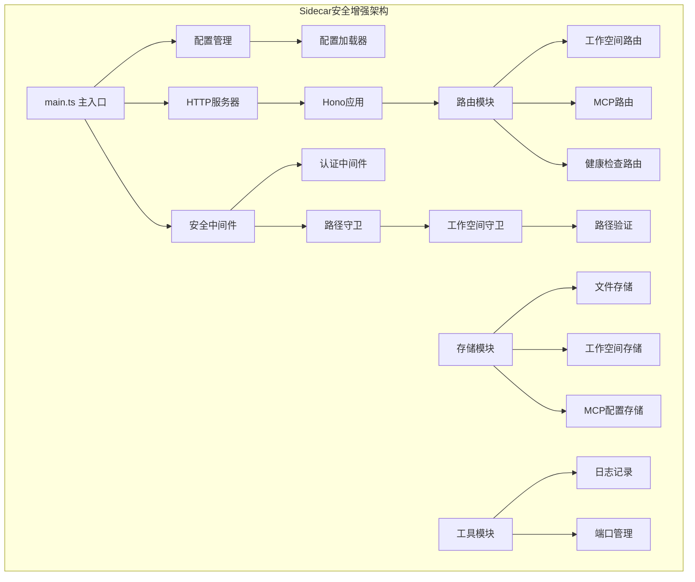
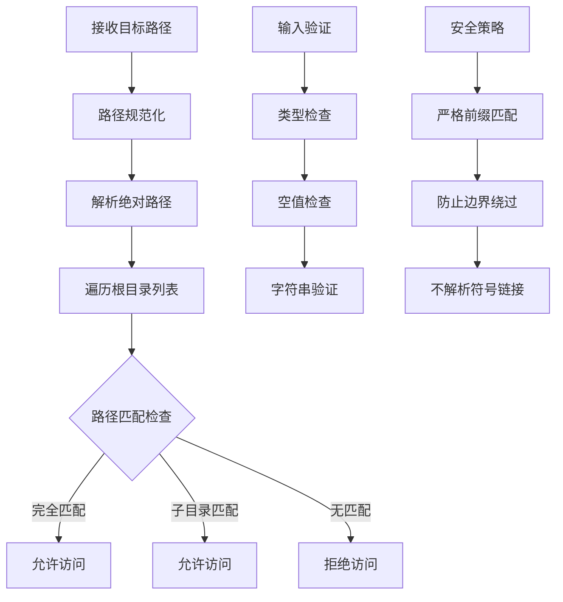
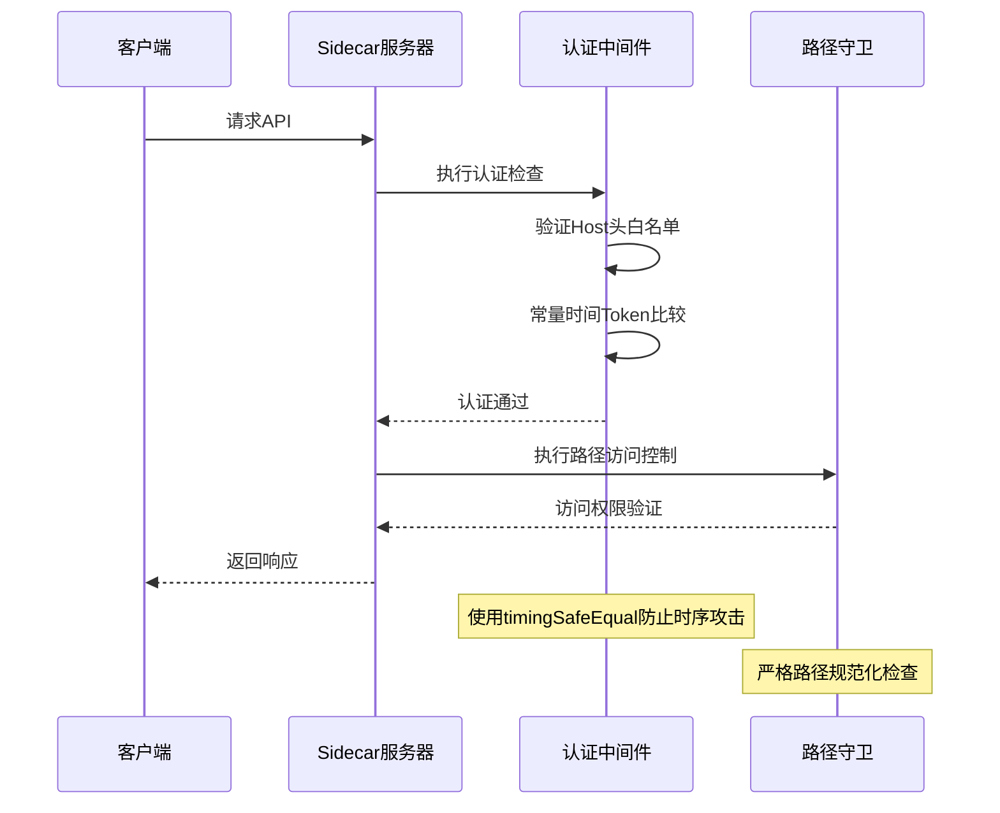
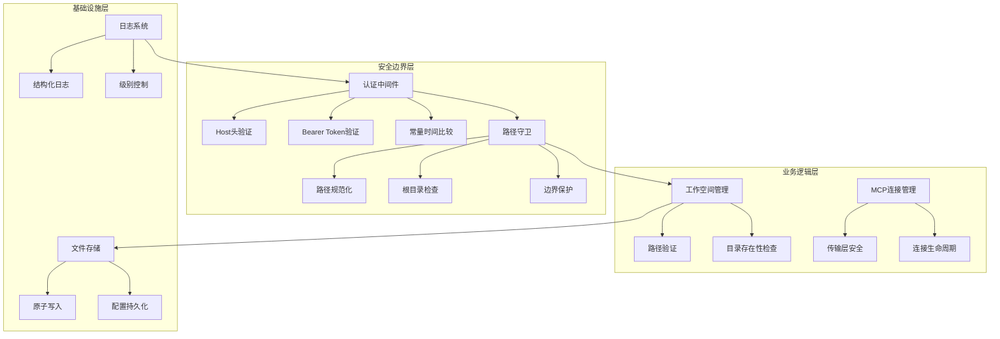
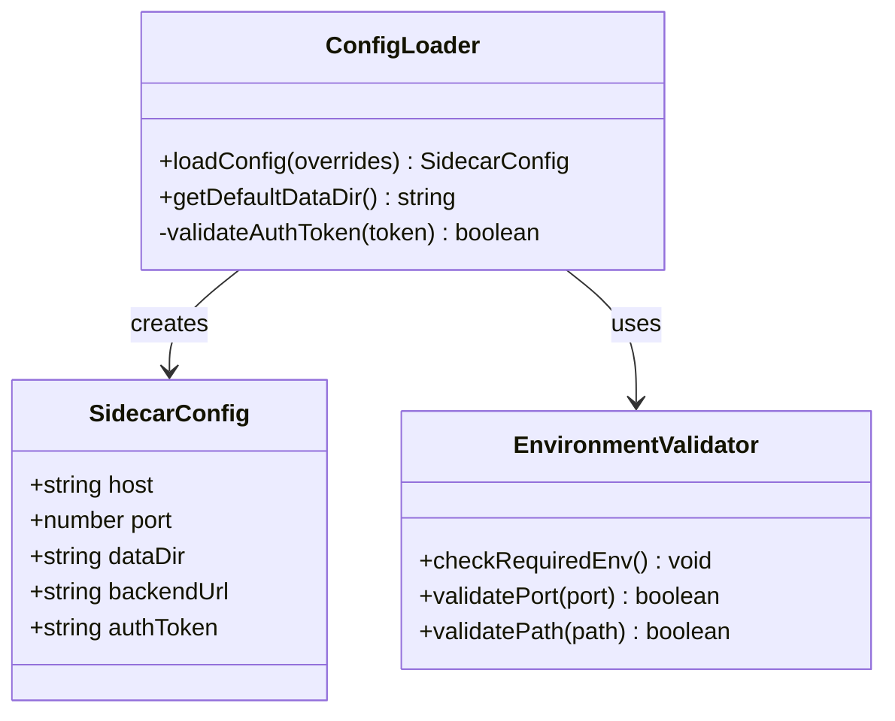
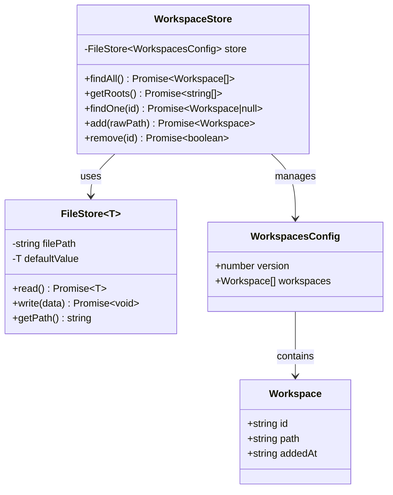
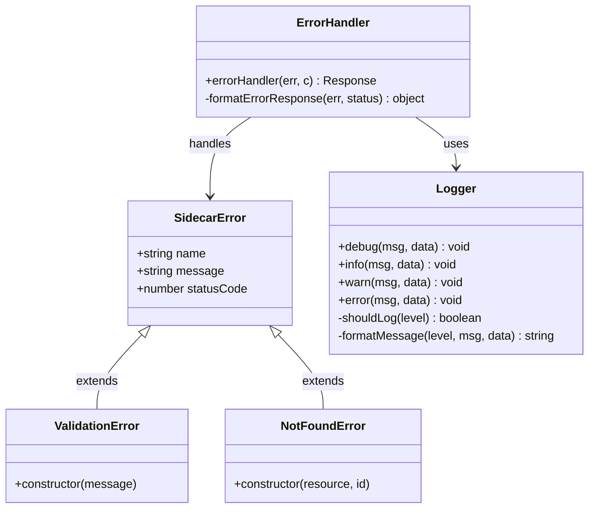
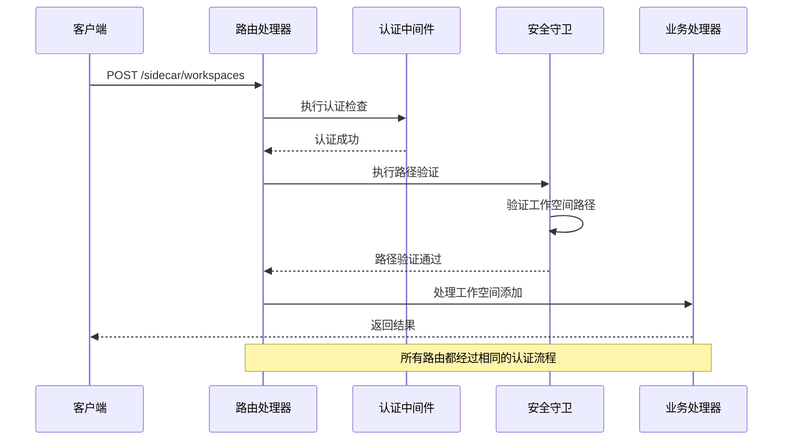

# Sidecar安全增强

<cite>
**本文档引用的文件**
- [apps/sidecar/src/security/workspace-guard.ts](file://apps/sidecar/src/security/workspace-guard.ts)
- [apps/sidecar/src/server/auth.ts](file://apps/sidecar/src/server/auth.ts)
- [apps/sidecar/src/store/workspace-store.ts](file://apps/sidecar/src/store/workspace-store.ts)
- [apps/sidecar/src/config.ts](file://apps/sidecar/src/config.ts)
- [apps/sidecar/src/main.ts](file://apps/sidecar/src/main.ts)
- [apps/sidecar/src/server/errors.ts](file://apps/sidecar/src/server/errors.ts)
- [apps/sidecar/src/store/file-store.ts](file://apps/sidecar/src/store/file-store.ts)
- [apps/sidecar/src/utils/logger.ts](file://apps/sidecar/src/utils/logger.ts)
- [apps/sidecar/src/routes/workspaces.ts](file://apps/sidecar/src/routes/workspaces.ts)
- [apps/sidecar/src/routes/mcp.ts](file://apps/sidecar/src/routes/mcp.ts)
- [apps/sidecar/tests/security/workspace-guard.spec.ts](file://apps/sidecar/tests/security/workspace-guard.spec.ts)
- [apps/sidecar/tests/server/auth.spec.ts](file://apps/sidecar/tests/server/auth.spec.ts)
</cite>

## 目录
1. [简介](#简介)
2. [项目结构](#项目结构)
3. [核心安全组件](#核心安全组件)
4. [架构概览](#架构概览)
5. [详细组件分析](#详细组件分析)
6. [依赖关系分析](#依赖关系分析)
7. [性能考虑](#性能考虑)
8. [故障排除指南](#故障排除指南)
9. [结论](#结论)

## 简介

Sidecar安全增强项目是对Lumina应用中Sidecar组件进行深度安全加固的重要升级。该项目专注于构建一个安全、可靠的本地代理服务，为AI助手功能提供受控的文件系统访问能力和安全的MCP（Model Context Protocol）通信机制。

该安全增强方案采用了多层防护策略，包括严格的路径访问控制、强身份认证、防DNS重绑定攻击、常量时间密码比较等核心安全特性。通过这些措施，确保Sidecar能够在保证安全性的同时，为上层应用提供必要的功能支持。

## 项目结构

Sidecar项目采用模块化的架构设计，主要分为以下几个核心模块：



**图表来源**
- [apps/sidecar/src/main.ts:1-59](file://apps/sidecar/src/main.ts#L1-L59)
- [apps/sidecar/src/config.ts:1-51](file://apps/sidecar/src/config.ts#L1-L51)

**章节来源**
- [apps/sidecar/src/main.ts:1-59](file://apps/sidecar/src/main.ts#L1-L59)
- [apps/sidecar/src/config.ts:1-51](file://apps/sidecar/src/config.ts#L1-L51)

## 核心安全组件

### 路径访问控制

路径访问控制系统是Sidecar安全增强的核心组件之一，它通过严格的路径验证机制防止目录遍历攻击和越权访问。



**图表来源**
- [apps/sidecar/src/security/workspace-guard.ts:16-42](file://apps/sidecar/src/security/workspace-guard.ts#L16-L42)

### 强身份认证系统

Sidecar实现了基于Bearer Token的强身份认证机制，采用常量时间比较算法防止时序攻击。



**图表来源**
- [apps/sidecar/src/server/auth.ts:73-116](file://apps/sidecar/src/server/auth.ts#L73-L116)
- [apps/sidecar/src/security/workspace-guard.ts:33-42](file://apps/sidecar/src/security/workspace-guard.ts#L33-L42)

**章节来源**
- [apps/sidecar/src/security/workspace-guard.ts:1-43](file://apps/sidecar/src/security/workspace-guard.ts#L1-L43)
- [apps/sidecar/src/server/auth.ts:1-117](file://apps/sidecar/src/server/auth.ts#L1-L117)

## 架构概览

Sidecar安全增强采用分层架构设计，确保每个组件都有明确的安全职责和边界。



**图表来源**
- [apps/sidecar/src/server/auth.ts:73-116](file://apps/sidecar/src/server/auth.ts#L73-L116)
- [apps/sidecar/src/security/workspace-guard.ts:16-42](file://apps/sidecar/src/security/workspace-guard.ts#L16-L42)
- [apps/sidecar/src/store/file-store.ts:29-53](file://apps/sidecar/src/store/file-store.ts#L29-L53)

## 详细组件分析

### 配置管理系统

配置管理系统负责加载和管理Sidecar的所有运行时配置，包括监听地址、端口、数据目录和认证令牌等关键参数。



**图表来源**
- [apps/sidecar/src/config.ts:4-50](file://apps/sidecar/src/config.ts#L4-L50)

**章节来源**
- [apps/sidecar/src/config.ts:1-51](file://apps/sidecar/src/config.ts#L1-L51)

### 工作空间存储系统

工作空间存储系统提供了安全的工作目录白名单管理功能，确保MCP客户端只能访问预授权的目录。



**图表来源**
- [apps/sidecar/src/store/workspace-store.ts:26-93](file://apps/sidecar/src/store/workspace-store.ts#L26-L93)
- [apps/sidecar/src/store/file-store.ts:8-58](file://apps/sidecar/src/store/file-store.ts#L8-L58)

**章节来源**
- [apps/sidecar/src/store/workspace-store.ts:1-94](file://apps/sidecar/src/store/workspace-store.ts#L1-L94)
- [apps/sidecar/src/store/file-store.ts:1-59](file://apps/sidecar/src/store/file-store.ts#L1-L59)

### 错误处理与日志系统

错误处理系统提供了统一的错误响应格式和结构化日志记录功能，确保安全事件能够被正确捕获和记录。



**图表来源**
- [apps/sidecar/src/server/errors.ts:8-53](file://apps/sidecar/src/server/errors.ts#L8-L53)
- [apps/sidecar/src/utils/logger.ts:28-41](file://apps/sidecar/src/utils/logger.ts#L28-L41)

**章节来源**
- [apps/sidecar/src/server/errors.ts:1-54](file://apps/sidecar/src/server/errors.ts#L1-L54)
- [apps/sidecar/src/utils/logger.ts:1-42](file://apps/sidecar/src/utils/logger.ts#L1-L42)

### 路由安全控制

路由安全控制系统确保所有API请求都经过适当的认证和授权检查，特别是针对工作空间管理和MCP操作的关键接口。



**图表来源**
- [apps/sidecar/src/routes/workspaces.ts:23-48](file://apps/sidecar/src/routes/workspaces.ts#L23-L48)
- [apps/sidecar/src/server/auth.ts:73-116](file://apps/sidecar/src/server/auth.ts#L73-L116)

**章节来源**
- [apps/sidecar/src/routes/workspaces.ts:1-64](file://apps/sidecar/src/routes/workspaces.ts#L1-L64)

## 依赖关系分析

Sidecar安全增强项目的依赖关系体现了清晰的关注点分离和模块化设计。

```mermaid
graph TD
subgraph "核心依赖"
A[@hono/node-server] --> B[HTTP服务器]
C[hono] --> D[Web框架]
E[uuid] --> F[唯一标识符]
end
subgraph "MCP协议支持"
G[@modelcontextprotocol/sdk] --> H[MCP客户端]
I[@lumina/shared] --> J[共享类型定义]
end
subgraph "开发工具"
K[tsup] --> L[打包工具]
M[vitest] --> N[测试框架]
O[typescript] --> P[类型检查]
end
subgraph "运行时依赖"
Q[node:path] --> R[路径操作]
S[node:fs/promises] --> T[文件系统]
U[node:crypto] --> V[加密功能]
end
A --> C
G --> I
K --> M
Q --> S
S --> U
```

**图表来源**
- [apps/sidecar/package.json:18-32](file://apps/sidecar/package.json#L18-L32)

**章节来源**
- [apps/sidecar/package.json:1-34](file://apps/sidecar/package.json#L1-L34)

## 性能考虑

### 常量时间比较优化

为了防止时序攻击，Sidecar使用了常量时间的密码比较算法，这虽然增加了计算开销，但显著提升了安全性。

### 路径验证缓存

工作空间路径验证采用内存缓存机制，避免重复的文件系统查询操作，提升整体性能。

### 异步I/O优化

所有文件系统操作都采用异步模式，确保高并发场景下的响应性能。

## 故障排除指南

### 常见安全问题诊断

**认证失败问题**
- 检查Host头格式是否正确（必须包含端口号）
- 验证Bearer Token长度和格式
- 确认Token大小写敏感性

**路径访问被拒绝**
- 验证目标路径是否在工作空间白名单内
- 检查路径规范化过程中的边界条件
- 确认没有使用相对路径进行目录遍历

**日志分析技巧**
- 查看结构化日志中的时间戳和错误详情
- 关注认证失败和路径验证失败的日志条目
- 监控系统资源使用情况和连接状态

**章节来源**
- [apps/sidecar/tests/server/auth.spec.ts:1-165](file://apps/sidecar/tests/server/auth.spec.ts#L1-L165)
- [apps/sidecar/tests/security/workspace-guard.spec.ts:1-89](file://apps/sidecar/tests/security/workspace-guard.spec.ts#L1-L89)

## 结论

Sidecar安全增强项目通过实施多层次的安全策略，成功构建了一个既安全又实用的本地代理服务。主要安全特性包括：

1. **严格的路径访问控制**：通过工作空间白名单机制防止目录遍历和越权访问
2. **强身份认证系统**：采用Bearer Token认证和常量时间比较算法
3. **防DNS重绑定攻击**：通过Host头白名单机制防范网络层攻击
4. **结构化错误处理**：提供统一的错误响应格式和详细的日志记录
5. **原子文件操作**：确保配置文件的完整性和一致性

这些安全增强措施不仅提升了系统的整体安全性，还保持了良好的用户体验和性能表现。通过模块化的架构设计和完善的测试覆盖，Sidecar安全增强项目为Lumina应用提供了可靠的安全基础。