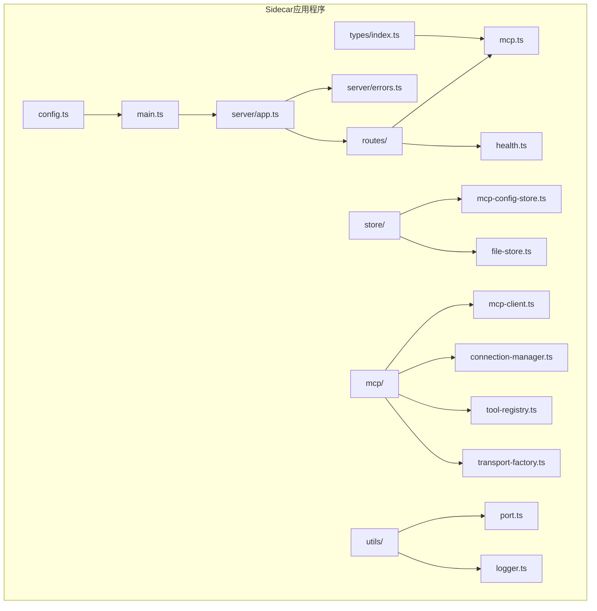
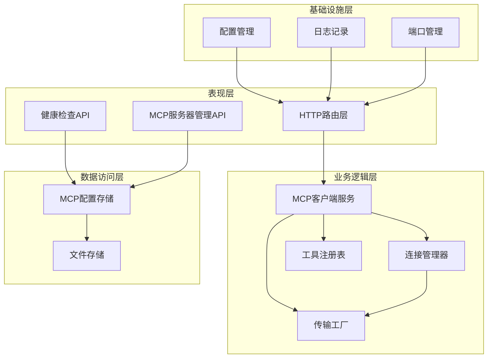
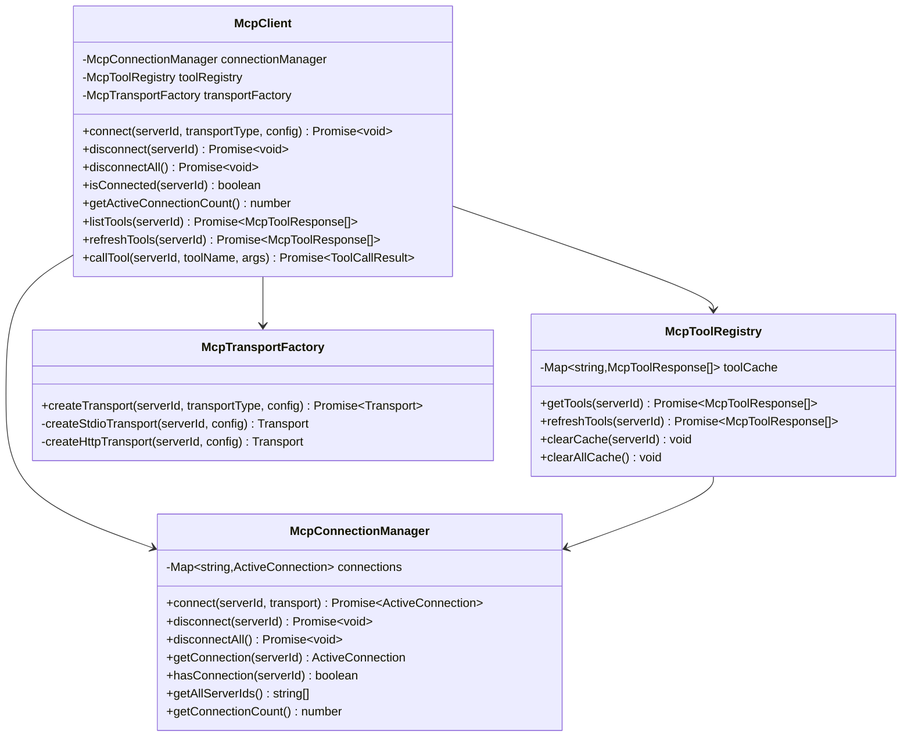
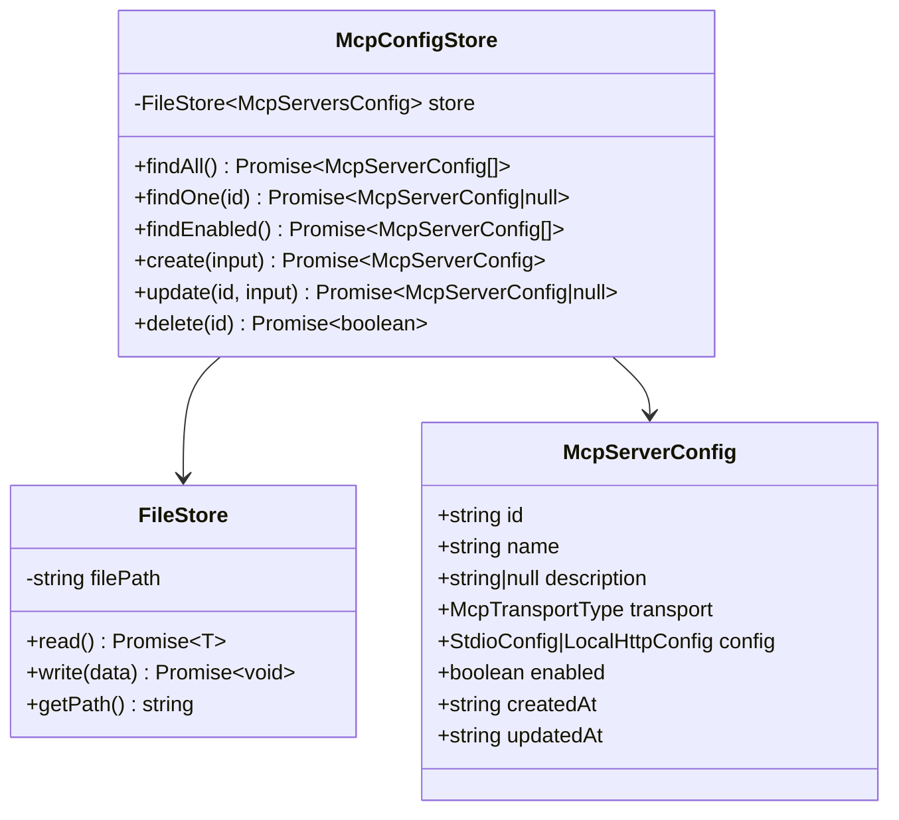
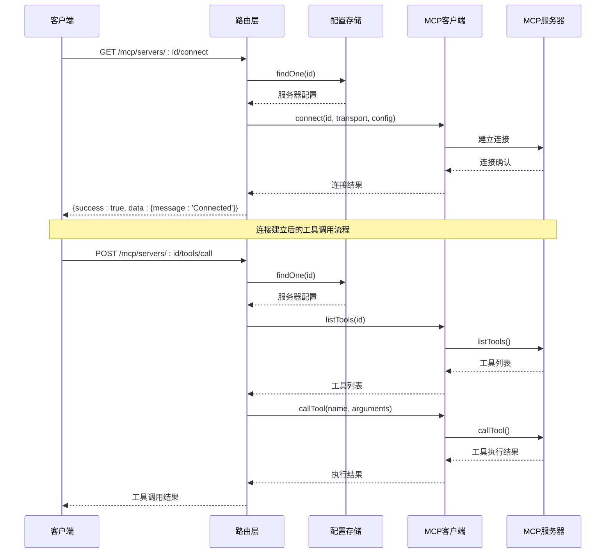

# Sidecar应用程序

<cite>
**本文档引用的文件**
- [apps/sidecar/src/main.ts](file://apps/sidecar/src/main.ts)
- [apps/sidecar/src/config.ts](file://apps/sidecar/src/config.ts)
- [apps/sidecar/src/server/app.ts](file://apps/sidecar/src/server/app.ts)
- [apps/sidecar/src/server/errors.ts](file://apps/sidecar/src/server/errors.ts)
- [apps/sidecar/src/routes/mcp.ts](file://apps/sidecar/src/routes/mcp.ts)
- [apps/sidecar/src/routes/health.ts](file://apps/sidecar/src/routes/health.ts)
- [apps/sidecar/src/store/mcp-config-store.ts](file://apps/sidecar/src/store/mcp-config-store.ts)
- [apps/sidecar/src/store/file-store.ts](file://apps/sidecar/src/store/file-store.ts)
- [apps/sidecar/src/mcp/mcp-client.ts](file://apps/sidecar/src/mcp/mcp-client.ts)
- [apps/sidecar/src/mcp/connection-manager.ts](file://apps/sidecar/src/mcp/connection-manager.ts)
- [apps/sidecar/src/mcp/tool-registry.ts](file://apps/sidecar/src/mcp/tool-registry.ts)
- [apps/sidecar/src/mcp/transport-factory.ts](file://apps/sidecar/src/mcp/transport-factory.ts)
- [apps/sidecar/src/types/index.ts](file://apps/sidecar/src/types/index.ts)
- [apps/sidecar/src/utils/port.ts](file://apps/sidecar/src/utils/port.ts)
- [apps/sidecar/src/utils/logger.ts](file://apps/sidecar/src/utils/logger.ts)
- [apps/sidecar/package.json](file://apps/sidecar/package.json)
- [apps/sidecar/tsconfig.json](file://apps/sidecar/tsconfig.json)
- [apps/sidecar/vitest.config.mts](file://apps/sidecar/vitest.config.mts)
- [apps/sidecar/tests/store/mcp-config-store.spec.ts](file://apps/sidecar/tests/store/mcp-config-store.spec.ts)
- [apps/sidecar/tests/mcp/transport-factory.spec.ts](file://apps/sidecar/tests/mcp/transport-factory.spec.ts)
</cite>

## 目录

1. [简介](#简介)
2. [项目结构](#项目结构)
3. [核心组件](#核心组件)
4. [架构概览](#架构概览)
5. [详细组件分析](#详细组件分析)
6. [依赖关系分析](#依赖关系分析)
7. [性能考虑](#性能考虑)
8. [故障排除指南](#故障排除指南)
9. [结论](#结论)

## 简介

Sidecar应用程序是一个基于Node.js开发的MCP（Model Context Protocol）客户端代理服务，专门为Lumina桌面应用提供MCP服务器管理能力。该应用程序通过HTTP API提供MCP服务器的配置、连接、工具发现和工具调用功能。

主要特性包括：

- 支持STDIO和HTTP两种传输协议
- MCP服务器配置持久化存储
- 动态工具发现和缓存机制
- 健康检查和监控功能
- 跨平台兼容性（Windows、macOS、Linux）

## 项目结构

Sidecar应用程序采用模块化的架构设计，主要分为以下几个核心模块：



**图表来源**

- [apps/sidecar/src/main.ts:1-53](file://apps/sidecar/src/main.ts#L1-L53)
- [apps/sidecar/src/server/app.ts:1-33](file://apps/sidecar/src/server/app.ts#L1-L33)
- [apps/sidecar/src/routes/mcp.ts:1-238](file://apps/sidecar/src/routes/mcp.ts#L1-L238)

**章节来源**

- [apps/sidecar/src/main.ts:1-53](file://apps/sidecar/src/main.ts#L1-L53)
- [apps/sidecar/src/config.ts:1-37](file://apps/sidecar/src/config.ts#L1-L37)
- [apps/sidecar/package.json:1-34](file://apps/sidecar/package.json#L1-L34)

## 核心组件

### 应用程序入口点

主入口文件负责应用程序的初始化、配置加载、路由注册和服务器启动。

### 配置管理系统

配置系统支持多种配置来源，包括环境变量、默认值和运行时覆盖。

### HTTP服务器框架

基于Hono框架构建的轻量级HTTP服务器，提供CORS支持和全局错误处理。

### MCP客户端服务

封装了完整的MCP客户端功能，包括连接管理、工具发现和传输工厂。

**章节来源**

- [apps/sidecar/src/main.ts:11-47](file://apps/sidecar/src/main.ts#L11-L47)
- [apps/sidecar/src/config.ts:29-36](file://apps/sidecar/src/config.ts#L29-L36)
- [apps/sidecar/src/server/app.ts:6-32](file://apps/sidecar/src/server/app.ts#L6-L32)

## 架构概览

Sidecar应用程序采用分层架构设计，实现了清晰的关注点分离：



**图表来源**

- [apps/sidecar/src/mcp/mcp-client.ts:12-21](file://apps/sidecar/src/mcp/mcp-client.ts#L12-L21)
- [apps/sidecar/src/store/mcp-config-store.ts:8-13](file://apps/sidecar/src/store/mcp-config-store.ts#L8-L13)
- [apps/sidecar/src/server/app.ts:6-32](file://apps/sidecar/src/server/app.ts#L6-L32)

## 详细组件分析

### MCP客户端服务

MCP客户端服务是整个应用程序的核心，提供了统一的接口来管理MCP服务器连接和工具调用。



**图表来源**

- [apps/sidecar/src/mcp/mcp-client.ts:12-21](file://apps/sidecar/src/mcp/mcp-client.ts#L12-L21)
- [apps/sidecar/src/mcp/connection-manager.ts:16-104](file://apps/sidecar/src/mcp/connection-manager.ts#L16-L104)
- [apps/sidecar/src/mcp/tool-registry.ts:9-52](file://apps/sidecar/src/mcp/tool-registry.ts#L9-L52)
- [apps/sidecar/src/mcp/transport-factory.ts:17-32](file://apps/sidecar/src/mcp/transport-factory.ts#L17-L32)

### 配置存储系统

配置存储系统提供了MCP服务器配置的持久化管理，支持原子写入和数据恢复。



**图表来源**

- [apps/sidecar/src/store/mcp-config-store.ts:8-89](file://apps/sidecar/src/store/mcp-config-store.ts#L8-L89)
- [apps/sidecar/src/store/file-store.ts:8-58](file://apps/sidecar/src/store/file-store.ts#L8-L58)
- [apps/sidecar/src/types/index.ts:6-15](file://apps/sidecar/src/types/index.ts#L6-L15)

### HTTP路由系统

HTTP路由系统提供了完整的MCP服务器管理API，包括CRUD操作、连接管理和工具调用。



**图表来源**

- [apps/sidecar/src/routes/mcp.ts:106-181](file://apps/sidecar/src/routes/mcp.ts#L106-L181)
- [apps/sidecar/src/mcp/mcp-client.ts:23-88](file://apps/sidecar/src/mcp/mcp-client.ts#L23-L88)

**章节来源**

- [apps/sidecar/src/routes/mcp.ts:13-237](file://apps/sidecar/src/routes/mcp.ts#L13-L237)
- [apps/sidecar/src/mcp/mcp-client.ts:12-89](file://apps/sidecar/src/mcp/mcp-client.ts#L12-L89)

## 依赖关系分析

应用程序的依赖关系体现了清晰的分层架构和关注点分离：

```mermaid
graph TB
subgraph "外部依赖"
A[@hono/node-server]
B[@modelcontextprotocol/sdk]
C[hono]
D[uuid]
end
subgraph "内部模块"
E[apps/sidecar/src]
F[apps/shared/src]
end
subgraph "应用程序层"
G[main.ts]
H[server/app.ts]
I[routes/]
J[store/]
K[mcp/]
L[types/]
M[utils/]
end
A --> H
B --> K
C --> H
D --> G
E --> F
G --> H
H --> I
I --> J
I --> K
J --> L
K --> L
K --> M
L --> M
```

**图表来源**

- [apps/sidecar/package.json:18-32](file://apps/sidecar/package.json#L18-L32)
- [apps/sidecar/src/main.ts:1-9](file://apps/sidecar/src/main.ts#L1-L9)

**章节来源**

- [apps/sidecar/package.json:1-34](file://apps/sidecar/package.json#L1-L34)
- [apps/sidecar/tsconfig.json:1-14](file://apps/sidecar/tsconfig.json#L1-L14)

## 性能考虑

### 连接池管理

应用程序实现了智能的连接池管理，避免重复连接和资源浪费。

### 工具缓存机制

工具注册表实现了两级缓存机制，减少频繁的网络请求。

### 异步处理

所有I/O操作都采用异步模式，确保高并发场景下的响应性。

### 内存优化

使用WeakMap和适当的垃圾回收策略，避免内存泄漏。

## 故障排除指南

### 常见问题诊断

1. **连接失败**：检查MCP服务器的可达性和认证配置
2. **工具不可用**：验证工具名称和参数格式
3. **配置丢失**：确认数据目录的读写权限
4. **端口冲突**：使用端口探测功能获取可用端口

### 日志分析

应用程序使用结构化日志记录，便于问题诊断和性能监控。

### 错误处理

实现了全面的错误处理机制，包括网络异常、超时和认证失败等情况。

**章节来源**

- [apps/sidecar/src/server/errors.ts](file://apps/sidecar/src/server/errors.ts)
- [apps/sidecar/src/utils/logger.ts](file://apps/sidecar/src/utils/logger.ts)

## 结论

Sidecar应用程序是一个设计精良的MCP客户端代理服务，具有以下特点：

**优势**

- 清晰的分层架构和模块化设计
- 完善的错误处理和日志记录机制
- 支持多种传输协议和认证方式
- 良好的跨平台兼容性
- 完整的测试覆盖和文档

**应用场景**

- 桌面应用的AI工具集成
- 本地MCP服务器管理
- 多平台应用的统一MCP接入点

该应用程序为Lumina生态系统提供了稳定可靠的MCP客户端服务，支持未来功能扩展和性能优化。
