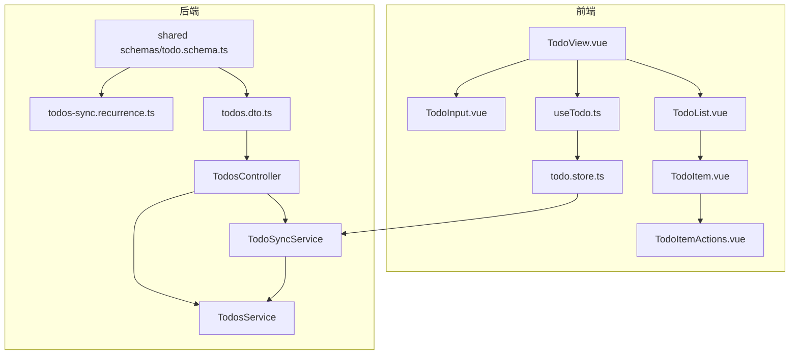
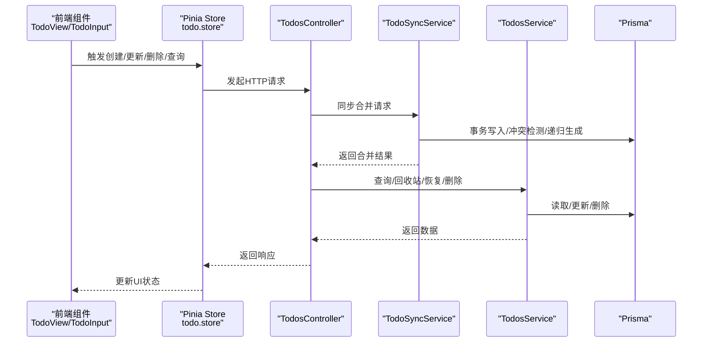
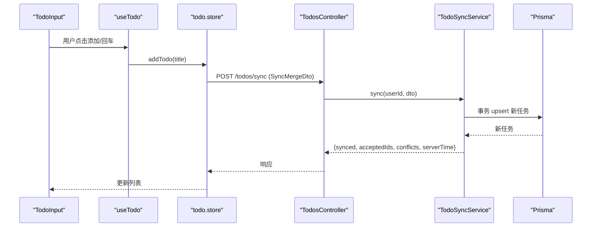
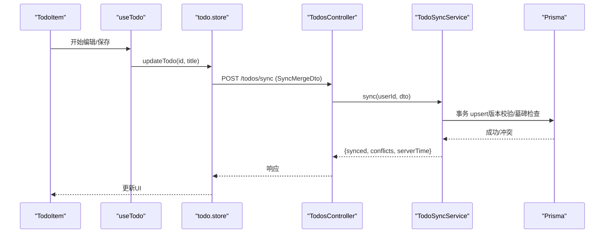
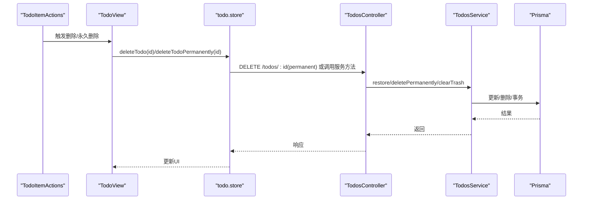
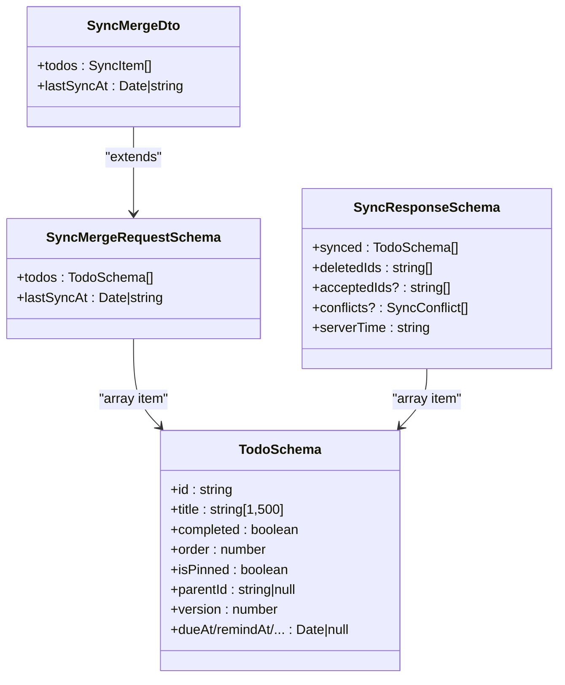
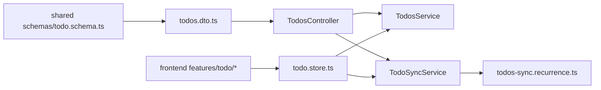

# 任务CRUD操作

<cite>
**本文档引用的文件**
- [apps/backend/src/todos/todos.controller.ts](file://apps/backend/src/todos/todos.controller.ts)
- [apps/backend/src/todos/todos.service.ts](file://apps/backend/src/todos/todos.service.ts)
- [apps/backend/src/todos/todos-sync.service.ts](file://apps/backend/src/todos/todos-sync.service.ts)
- [apps/backend/src/todos/todos-sync.recurrence.ts](file://apps/backend/src/todos/todos-sync.recurrence.ts)
- [apps/backend/src/todos/todos.dto.ts](file://apps/backend/src/todos/todos.dto.ts)
- [apps/frontend/src/features/todo/TodoView.vue](file://apps/frontend/src/features/todo/TodoView.vue)
- [apps/frontend/src/features/todo/components/TodoInput.vue](file://apps/frontend/src/features/todo/components/TodoInput.vue)
- [apps/frontend/src/features/todo/components/TodoItem.vue](file://apps/frontend/src/features/todo/components/TodoItem.vue)
- [apps/frontend/src/features/todo/components/TodoList.vue](file://apps/frontend/src/features/todo/components/TodoList.vue)
- [apps/frontend/src/features/todo/components/TodoItemActions.vue](file://apps/frontend/src/features/todo/components/TodoItemActions.vue)
- [apps/frontend/src/features/todo/composables/useTodo.ts](file://apps/frontend/src/features/todo/composables/useTodo.ts)
- [apps/frontend/src/features/todo/stores/todo.store.ts](file://apps/frontend/src/features/todo/stores/todo.store.ts)
- [packages/shared/src/schemas/todo.schema.ts](file://packages/shared/src/schemas/todo.schema.ts)
</cite>

## 目录
1. [简介](#简介)
2. [项目结构](#项目结构)
3. [核心组件](#核心组件)
4. [架构总览](#架构总览)
5. [详细组件分析](#详细组件分析)
6. [依赖关系分析](#依赖关系分析)
7. [性能考虑](#性能考虑)
8. [故障排查指南](#故障排查指南)
9. [结论](#结论)
10. [附录](#附录)

## 简介
本文件系统性阐述 Lumina Todo 的任务 CRUD（创建、读取、更新、删除）实现，覆盖后端 TodosController 的 API 设计、TodosService 的服务层逻辑、DTO 数据传输对象定义；同时详述前端组件与后端服务的交互模式，包括 TodoItem 组件的状态管理、TodoInput 组件的数据绑定、用户交互处理。文档还提供任务创建表单、任务列表渲染、任务编辑功能、批量操作实现的示例路径，并解释错误处理机制、数据验证规则、权限控制策略，最后给出性能优化技巧与最佳实践。

## 项目结构
Lumina Todo 的任务 CRUD 涉及前后端协作：
- 后端位于 apps/backend/src/todos，包含控制器、服务、同步服务与 DTO 定义
- 前端位于 apps/frontend/src/features/todo，包含视图、组件、组合式函数与 Pinia Store
- 共享类型定义位于 packages/shared/src/schemas/todo.schema.ts

**图表来源**
- [apps/frontend/src/features/todo/TodoView.vue:1-522](file://apps/frontend/src/features/todo/TodoView.vue#L1-L522)
- [apps/frontend/src/features/todo/components/TodoInput.vue:1-161](file://apps/frontend/src/features/todo/components/TodoInput.vue#L1-L161)
- [apps/frontend/src/features/todo/components/TodoList.vue:1-316](file://apps/frontend/src/features/todo/components/TodoList.vue#L1-L316)
- [apps/frontend/src/features/todo/components/TodoItem.vue:1-419](file://apps/frontend/src/features/todo/components/TodoItem.vue#L1-L419)
- [apps/frontend/src/features/todo/components/TodoItemActions.vue:1-92](file://apps/frontend/src/features/todo/components/TodoItemActions.vue#L1-L92)
- [apps/frontend/src/features/todo/composables/useTodo.ts:1-186](file://apps/frontend/src/features/todo/composables/useTodo.ts#L1-L186)
- [apps/frontend/src/features/todo/stores/todo.store.ts:1-389](file://apps/frontend/src/features/todo/stores/todo.store.ts#L1-L389)
- [apps/backend/src/todos/todos.controller.ts:1-70](file://apps/backend/src/todos/todos.controller.ts#L1-L70)
- [apps/backend/src/todos/todos.service.ts:1-147](file://apps/backend/src/todos/todos.service.ts#L1-L147)
- [apps/backend/src/todos/todos-sync.service.ts:1-226](file://apps/backend/src/todos/todos-sync.service.ts#L1-L226)
- [apps/backend/src/todos/todos-sync.recurrence.ts:1-210](file://apps/backend/src/todos/todos-sync.recurrence.ts#L1-L210)
- [apps/backend/src/todos/todos.dto.ts:1-5](file://apps/backend/src/todos/todos.dto.ts#L1-L5)
- [packages/shared/src/schemas/todo.schema.ts:1-76](file://packages/shared/src/schemas/todo.schema.ts#L1-L76)

**章节来源**
- [apps/frontend/src/features/todo/TodoView.vue:1-522](file://apps/frontend/src/features/todo/TodoView.vue#L1-L522)
- [apps/backend/src/todos/todos.controller.ts:1-70](file://apps/backend/src/todos/todos.controller.ts#L1-L70)

## 核心组件
- 后端 TodosController：提供任务查询、回收站查询、恢复、永久删除、清空回收站等 API，并通过 JWT 认证保护
- TodosService：封装任务读取、回收站读取、恢复、永久删除、清空回收站的数据库操作
- TodoSyncService：实现增量同步与合并，处理版本冲突、墓碑标记、递归任务生成
- 前端 TodoView：聚合输入、过滤、搜索、列表渲染、视图切换与动画
- TodoInput：任务创建输入与日期解析提示
- TodoList/TodoItem：任务列表渲染、子任务递归、拖拽重排、展开折叠
- useTodo：前端交互逻辑与错误提示
- todo.store：Pinia Store，统一管理任务状态、过滤、排序、同步、提议变更等

**章节来源**
- [apps/backend/src/todos/todos.controller.ts:20-70](file://apps/backend/src/todos/todos.controller.ts#L20-L70)
- [apps/backend/src/todos/todos.service.ts:27-147](file://apps/backend/src/todos/todos.service.ts#L27-L147)
- [apps/backend/src/todos/todos-sync.service.ts:41-226](file://apps/backend/src/todos/todos-sync.service.ts#L41-L226)
- [apps/frontend/src/features/todo/TodoView.vue:1-522](file://apps/frontend/src/features/todo/TodoView.vue#L1-L522)
- [apps/frontend/src/features/todo/components/TodoInput.vue:1-161](file://apps/frontend/src/features/todo/components/TodoInput.vue#L1-L161)
- [apps/frontend/src/features/todo/components/TodoList.vue:1-316](file://apps/frontend/src/features/todo/components/TodoList.vue#L1-L316)
- [apps/frontend/src/features/todo/components/TodoItem.vue:1-419](file://apps/frontend/src/features/todo/components/TodoItem.vue#L1-L419)
- [apps/frontend/src/features/todo/composables/useTodo.ts:1-186](file://apps/frontend/src/features/todo/composables/useTodo.ts#L1-L186)
- [apps/frontend/src/features/todo/stores/todo.store.ts:1-389](file://apps/frontend/src/features/todo/stores/todo.store.ts#L1-L389)

## 架构总览
后端采用 NestJS 控制器+服务+拦截器的分层设计，前端采用 Vue + Pinia + 组合式函数的响应式架构。两者通过共享的 Zod Schema 进行数据契约约束，通过 JWT 保障接口安全。

**图表来源**
- [apps/frontend/src/features/todo/TodoView.vue:178-187](file://apps/frontend/src/features/todo/TodoView.vue#L178-L187)
- [apps/frontend/src/features/todo/stores/todo.store.ts:210-232](file://apps/frontend/src/features/todo/stores/todo.store.ts#L210-L232)
- [apps/backend/src/todos/todos.controller.ts:30-68](file://apps/backend/src/todos/todos.controller.ts#L30-L68)
- [apps/backend/src/todos/todos-sync.service.ts:52-224](file://apps/backend/src/todos/todos-sync.service.ts#L52-L224)
- [apps/backend/src/todos/todos.service.ts:38-145](file://apps/backend/src/todos/todos.service.ts#L38-L145)

## 详细组件分析

### 后端 TodosController API 设计
- GET /todos：获取当前用户所有未删除任务
- GET /todos/trash：获取回收站中的任务
- POST /todos/:id/restore：恢复已删除任务
- DELETE /todos/:id/permanent：永久删除任务
- DELETE /todos/trash/clear：清空回收站
- POST /todos/sync：离线优先的增量同步与合并

认证与授权：
- 使用 JwtAuthGuard 保护所有路由
- 通过 @CurrentUser 注入当前用户上下文，确保操作限定在当前用户

**章节来源**
- [apps/backend/src/todos/todos.controller.ts:20-70](file://apps/backend/src/todos/todos.controller.ts#L20-L70)

### TodosService 服务层逻辑
- findAll(userId)：按是否置顶、顺序、创建时间排序返回未删除任务
- findTrash(userId)：返回回收站任务
- restore(userId, id)：取消删除标记并递增版本号，广播同步通知
- deletePermanently(userId, id)：写入墓碑记录并删除任务，广播同步通知
- clearTrash(userId)：批量写入墓碑并删除回收站任务，广播同步通知

事务与一致性：
- 永久删除与清空回收站使用事务，保证墓碑与删除的一致性

**章节来源**
- [apps/backend/src/todos/todos.service.ts:27-147](file://apps/backend/src/todos/todos.service.ts#L27-L147)

### TodoSyncService 同步与合并
- 输入：SyncMergeDto（基于共享 Schema 的 Zod DTO）
- 流程：
  1) 事务内处理客户端推送的变更，检查墓碑、所有权、版本一致性
  2) upsert 写入，必要时生成下一次递归任务
  3) 拉取自上次同步以来的服务器变更
  4) 合并结果，返回冲突、删除 ID、接受 ID、服务器时间
- 冲突类型：TOMBSTONED（墓碑）、OWNER_MISMATCH（所有权不匹配）、VERSION_CONFLICT（版本冲突）

递归任务处理：
- todos-sync.recurrence.ts 解析周期规则、时区、提醒时间，决定是否生成下一次递归任务

**章节来源**
- [apps/backend/src/todos/todos-sync.service.ts:41-226](file://apps/backend/src/todos/todos-sync.service.ts#L41-L226)
- [apps/backend/src/todos/todos-sync.recurrence.ts:87-151](file://apps/backend/src/todos/todos-sync.recurrence.ts#L87-L151)
- [apps/backend/src/todos/todos.dto.ts:1-5](file://apps/backend/src/todos/todos.dto.ts#L1-L5)
- [packages/shared/src/schemas/todo.schema.ts:37-76](file://packages/shared/src/schemas/todo.schema.ts#L37-L76)

### 前端交互与状态管理

#### TodoView：视图编排与动画
- 负责输入区域、过滤、搜索、视图切换与过渡动画
- 通过 useTodo 组合式函数协调交互逻辑
- 根据视图模式选择 TodoList/TodoVisualizer/TodoStatistics

**章节来源**
- [apps/frontend/src/features/todo/TodoView.vue:1-522](file://apps/frontend/src/features/todo/TodoView.vue#L1-L522)
- [apps/frontend/src/features/todo/composables/useTodo.ts:1-186](file://apps/frontend/src/features/todo/composables/useTodo.ts#L1-L186)

#### TodoInput：任务创建与日期解析
- 双态占位符：根据 AI 配置状态切换提示文案
- 简易自然语言日期解析：识别“今天/明天/下周”等关键词并提示
- 自动聚焦与无障碍标签

**章节来源**
- [apps/frontend/src/features/todo/components/TodoInput.vue:1-161](file://apps/frontend/src/features/todo/components/TodoInput.vue#L1-L161)

#### TodoList/TodoItem：列表渲染与交互
- TodoList：支持拖拽重排、分段显示“稍后处理”、空态提示
- TodoItem：支持展开/折叠、编辑、子任务添加、动作面板、拖拽处理
- 递归渲染子任务，支持搜索模式下的路径高亮

**章节来源**
- [apps/frontend/src/features/todo/components/TodoList.vue:1-316](file://apps/frontend/src/features/todo/components/TodoList.vue#L1-L316)
- [apps/frontend/src/features/todo/components/TodoItem.vue:1-419](file://apps/frontend/src/features/todo/components/TodoItem.vue#L1-L419)

#### useTodo：交互逻辑与错误提示
- 处理新增、编辑、切换完成状态、键盘事件
- 防抖搜索、全局快捷键（如打开 AI 助手）
- 错误监听与 Toast 提示

**章节来源**
- [apps/frontend/src/features/todo/composables/useTodo.ts:1-186](file://apps/frontend/src/features/todo/composables/useTodo.ts#L1-L186)

#### todo.store：状态中心
- 统一管理 todos、过滤、视图模式、搜索、展开状态、拖拽状态、错误、提议变更、同步状态
- 通过 createTodoCloud 与云端同步，通过 createTodoActions 实现 CRUD 与排序
- 与共享 Schema 对接，确保前后端数据契约一致

**章节来源**
- [apps/frontend/src/features/todo/stores/todo.store.ts:21-368](file://apps/frontend/src/features/todo/stores/todo.store.ts#L21-L368)

### CRUD 操作流程详解

#### 创建（Create）
- 前端：TodoInput 接收输入，useTodo.handleAddTodo 校验并调用 store.addTodo
- 同步：todo.store 内部通过 createTodoCloud 调用后端 /todos/sync，携带本地变更
- 后端：TodoSyncService 在事务内 upsert 新任务，必要时生成递归任务
- 结果：返回合并后的任务集合，前端更新本地状态

**图表来源**
- [apps/frontend/src/features/todo/components/TodoInput.vue:151-158](file://apps/frontend/src/features/todo/components/TodoInput.vue#L151-L158)
- [apps/frontend/src/features/todo/composables/useTodo.ts:52-68](file://apps/frontend/src/features/todo/composables/useTodo.ts#L52-L68)
- [apps/frontend/src/features/todo/stores/todo.store.ts:210-232](file://apps/frontend/src/features/todo/stores/todo.store.ts#L210-L232)
- [apps/backend/src/todos/todos.controller.ts:30-38](file://apps/backend/src/todos/todos.controller.ts#L30-L38)
- [apps/backend/src/todos/todos-sync.service.ts:52-179](file://apps/backend/src/todos/todos-sync.service.ts#L52-L179)

**章节来源**
- [apps/frontend/src/features/todo/components/TodoInput.vue:1-161](file://apps/frontend/src/features/todo/components/TodoInput.vue#L1-L161)
- [apps/frontend/src/features/todo/composables/useTodo.ts:52-68](file://apps/frontend/src/features/todo/composables/useTodo.ts#L52-L68)
- [apps/frontend/src/features/todo/stores/todo.store.ts:210-232](file://apps/frontend/src/features/todo/stores/todo.store.ts#L210-L232)
- [apps/backend/src/todos/todos.controller.ts:30-38](file://apps/backend/src/todos/todos.controller.ts#L30-L38)
- [apps/backend/src/todos/todos-sync.service.ts:52-179](file://apps/backend/src/todos/todos-sync.service.ts#L52-L179)

#### 读取（Read）
- 前端：TodoView 首次加载时调用 store.fetchTodos，内部通过 createTodoCloud 与后端同步
- 后端：TodosController.findAll 返回未删除任务；findTrash 返回回收站任务
- 排序：服务端按置顶、顺序、创建时间排序

**章节来源**
- [apps/frontend/src/features/todo/TodoView.vue:178-187](file://apps/frontend/src/features/todo/TodoView.vue#L178-L187)
- [apps/backend/src/todos/todos.controller.ts:40-50](file://apps/backend/src/todos/todos.controller.ts#L40-L50)
- [apps/backend/src/todos/todos.service.ts:38-47](file://apps/backend/src/todos/todos.service.ts#L38-L47)

#### 更新（Update）
- 前端：TodoItem 进入编辑模式，useTodo.startEditing 设置 editingId/editingTitle，保存时调用 store.updateTodo
- 同步：todo.store 通过 createTodoCloud 调用 /todos/sync，携带版本号与变更
- 冲突处理：TodoSyncService 检测版本冲突并返回冲突列表
- 后端：TodosService.restore/deletePermanently/clearTrash 等操作更新数据库并广播同步

**图表来源**
- [apps/frontend/src/features/todo/components/TodoItem.vue:155-166](file://apps/frontend/src/features/todo/components/TodoItem.vue#L155-L166)
- [apps/frontend/src/features/todo/composables/useTodo.ts:106-122](file://apps/frontend/src/features/todo/composables/useTodo.ts#L106-L122)
- [apps/frontend/src/features/todo/stores/todo.store.ts:210-232](file://apps/frontend/src/features/todo/stores/todo.store.ts#L210-L232)
- [apps/backend/src/todos/todos.controller.ts:30-38](file://apps/backend/src/todos/todos.controller.ts#L30-L38)
- [apps/backend/src/todos/todos-sync.service.ts:115-126](file://apps/backend/src/todos/todos-sync.service.ts#L115-L126)

**章节来源**
- [apps/frontend/src/features/todo/components/TodoItem.vue:155-166](file://apps/frontend/src/features/todo/components/TodoItem.vue#L155-L166)
- [apps/frontend/src/features/todo/composables/useTodo.ts:106-122](file://apps/frontend/src/features/todo/composables/useTodo.ts#L106-L122)
- [apps/frontend/src/features/todo/stores/todo.store.ts:210-232](file://apps/frontend/src/features/todo/stores/todo.store.ts#L210-L232)
- [apps/backend/src/todos/todos.controller.ts:30-38](file://apps/backend/src/todos/todos.controller.ts#L30-L38)
- [apps/backend/src/todos/todos-sync.service.ts:115-126](file://apps/backend/src/todos/todos-sync.service.ts#L115-L126)

#### 删除（Delete）
- 前端：TodoItemActions 触发删除或永久删除，TodoView 列表监听 delete 事件
- 同步：store.deleteTodo/store.deleteTodoPermanently 通过 /todos/sync 或具体 API
- 后端：TodosService.restore/deletePermanently/clearTrash，写入墓碑并广播同步

**图表来源**
- [apps/frontend/src/features/todo/components/TodoItemActions.vue:29-31](file://apps/frontend/src/features/todo/components/TodoItemActions.vue#L29-L31)
- [apps/frontend/src/features/todo/TodoView.vue:251-267](file://apps/frontend/src/features/todo/TodoView.vue#L251-L267)
- [apps/backend/src/todos/todos.controller.ts:52-68](file://apps/backend/src/todos/todos.controller.ts#L52-L68)
- [apps/backend/src/todos/todos.service.ts:66-111](file://apps/backend/src/todos/todos.service.ts#L66-L111)

**章节来源**
- [apps/frontend/src/features/todo/components/TodoItemActions.vue:1-92](file://apps/frontend/src/features/todo/components/TodoItemActions.vue#L1-L92)
- [apps/frontend/src/features/todo/TodoView.vue:251-267](file://apps/frontend/src/features/todo/TodoView.vue#L251-L267)
- [apps/backend/src/todos/todos.controller.ts:52-68](file://apps/backend/src/todos/todos.controller.ts#L52-L68)
- [apps/backend/src/todos/todos.service.ts:66-111](file://apps/backend/src/todos/todos.service.ts#L66-L111)

### 数据传输对象（DTO）与验证
- SyncMergeDto：基于共享 Schema 的 Zod DTO，约束 todos 数组与 lastSyncAt 时间
- TodoSchema：定义任务字段的最小值、最大值、可空性、枚举等约束
- SyncMergeRequestSchema/SyncResponseSchema：定义批量同步请求与响应结构

**图表来源**
- [apps/backend/src/todos/todos.dto.ts:1-5](file://apps/backend/src/todos/todos.dto.ts#L1-L5)
- [packages/shared/src/schemas/todo.schema.ts:8-76](file://packages/shared/src/schemas/todo.schema.ts#L8-L76)

**章节来源**
- [apps/backend/src/todos/todos.dto.ts:1-5](file://apps/backend/src/todos/todos.dto.ts#L1-L5)
- [packages/shared/src/schemas/todo.schema.ts:1-76](file://packages/shared/src/schemas/todo.schema.ts#L1-L76)

### 权限控制与安全
- TodosController 使用 JwtAuthGuard 保护所有路由
- 当前用户通过 @CurrentUser 注入，所有操作限定在当前用户上下文中
- TodoSyncService 在 upsert 前检查墓碑与所有权，防止越权与墓碑项被修改

**章节来源**
- [apps/backend/src/todos/todos.controller.ts:12-24](file://apps/backend/src/todos/todos.controller.ts#L12-L24)
- [apps/backend/src/todos/todos-sync.service.ts:69-113](file://apps/backend/src/todos/todos-sync.service.ts#L69-L113)

### 错误处理机制
- 前端：
  - useTodo 监听全局错误并在非直接操作时弹出 Toast
  - TodoInput/TodoItemActions 提供错误提示与反馈
- 后端：
  - 版本冲突、墓碑、所有权不匹配等场景返回冲突信息
  - 事务保证一致性，失败时回滚

**章节来源**
- [apps/frontend/src/features/todo/composables/useTodo.ts:26-40](file://apps/frontend/src/features/todo/composables/useTodo.ts#L26-L40)
- [apps/frontend/src/features/todo/components/TodoInput.vue:140-148](file://apps/frontend/src/features/todo/components/TodoInput.vue#L140-L148)
- [apps/backend/src/todos/todos-sync.service.ts:115-126](file://apps/backend/src/todos/todos-sync.service.ts#L115-L126)

### 批量操作实现
- 清空回收站：TodosController.clearTrash -> TodosService.clearTrash
- 恢复多个：TodosController.restore -> TodosService.restore
- 同步合并：TodoSyncService 遍历 todos 数组，逐条 upsert 并生成冲突列表

**章节来源**
- [apps/backend/src/todos/todos.controller.ts:64-68](file://apps/backend/src/todos/todos.controller.ts#L64-L68)
- [apps/backend/src/todos/todos.service.ts:116-145](file://apps/backend/src/todos/todos.service.ts#L116-L145)
- [apps/backend/src/todos/todos-sync.service.ts:66-179](file://apps/backend/src/todos/todos-sync.service.ts#L66-L179)

## 依赖关系分析

**图表来源**
- [packages/shared/src/schemas/todo.schema.ts:1-76](file://packages/shared/src/schemas/todo.schema.ts#L1-L76)
- [apps/backend/src/todos/todos.dto.ts:1-5](file://apps/backend/src/todos/todos.dto.ts#L1-L5)
- [apps/backend/src/todos/todos.controller.ts:1-70](file://apps/backend/src/todos/todos.controller.ts#L1-L70)
- [apps/backend/src/todos/todos.service.ts:1-147](file://apps/backend/src/todos/todos.service.ts#L1-L147)
- [apps/backend/src/todos/todos-sync.service.ts:1-226](file://apps/backend/src/todos/todos-sync.service.ts#L1-L226)
- [apps/backend/src/todos/todos-sync.recurrence.ts:1-210](file://apps/backend/src/todos/todos-sync.recurrence.ts#L1-L210)
- [apps/frontend/src/features/todo/stores/todo.store.ts:1-389](file://apps/frontend/src/features/todo/stores/todo.store.ts#L1-L389)

**章节来源**
- [apps/backend/src/todos/todos.controller.ts:1-70](file://apps/backend/src/todos/todos.controller.ts#L1-L70)
- [apps/backend/src/todos/todos.service.ts:1-147](file://apps/backend/src/todos/todos.service.ts#L1-L147)
- [apps/backend/src/todos/todos-sync.service.ts:1-226](file://apps/backend/src/todos/todos-sync.service.ts#L1-L226)
- [apps/frontend/src/features/todo/stores/todo.store.ts:1-389](file://apps/frontend/src/features/todo/stores/todo.store.ts#L1-L389)

## 性能考虑
- 前端：
  - TodoList 使用 vuedraggable 实现高性能拖拽，避免不必要的重排
  - TodoItem 使用 GSAP 驱动的高度动画，减少布局抖动
  - useTodo 使用防抖搜索，降低频繁更新带来的性能压力
- 后端：
  - TodoSyncService 使用事务批量 upsert，减少往返与锁竞争
  - 服务端排序与过滤在数据库层面完成，避免前端过度计算
  - 递归任务生成在 upsert 成功后按需创建，避免重复计算

[本节为通用性能建议，无需特定文件来源]

## 故障排查指南
- 同步冲突：
  - 现象：返回 conflicts，包含 TOMBSTONED/OWNER_MISMATCH/VERSION_CONFLICT
  - 处理：前端根据冲突类型提示用户或自动接受/重试
- 帐户切换：
  - 现象：不同用户登录导致 remoteTodos 清空
  - 处理：mergeOnLogin 时重置同步状态并重新拉取
- 任务为空态：
  - 现象：无任务时显示相应空态图标与描述
  - 处理：TodoList 根据 filter/searchQuery 判断空态内容
- 错误提示：
  - 现象：输入非法或网络异常时弹出 Toast
  - 处理：useTodo 监听错误并在合适时机清除

**章节来源**
- [apps/backend/src/todos/todos-sync.service.ts:115-126](file://apps/backend/src/todos/todos-sync.service.ts#L115-L126)
- [apps/frontend/src/features/todo/stores/todo.store.ts:255-270](file://apps/frontend/src/features/todo/stores/todo.store.ts#L255-L270)
- [apps/frontend/src/features/todo/components/TodoList.vue:85-112](file://apps/frontend/src/features/todo/components/TodoList.vue#L85-L112)
- [apps/frontend/src/features/todo/composables/useTodo.ts:26-40](file://apps/frontend/src/features/todo/composables/useTodo.ts#L26-L40)

## 结论
Lumina Todo 的任务 CRUD 通过前后端清晰的职责划分与共享契约实现稳定可靠的用户体验。后端以事务与冲突检测保障数据一致性，前端以组合式函数与 Pinia Store 提供流畅的交互体验。通过递归任务与增量同步机制，系统支持复杂的时间与多端协同场景。

## 附录
- 任务创建表单示例路径：[apps/frontend/src/features/todo/components/TodoInput.vue:1-161](file://apps/frontend/src/features/todo/components/TodoInput.vue#L1-L161)
- 任务列表渲染示例路径：[apps/frontend/src/features/todo/components/TodoList.vue:1-316](file://apps/frontend/src/features/todo/components/TodoList.vue#L1-L316)
- 任务编辑功能示例路径：[apps/frontend/src/features/todo/components/TodoItem.vue:155-166](file://apps/frontend/src/features/todo/components/TodoItem.vue#L155-L166)
- 批量操作实现示例路径：[apps/backend/src/todos/todos.controller.ts:64-68](file://apps/backend/src/todos/todos.controller.ts#L64-L68)