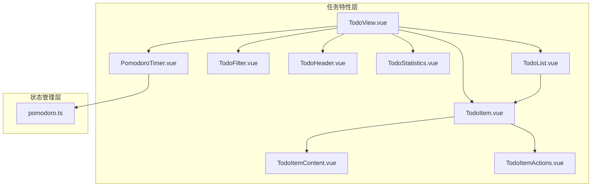
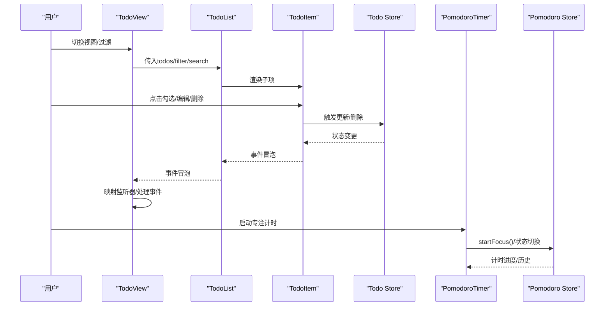
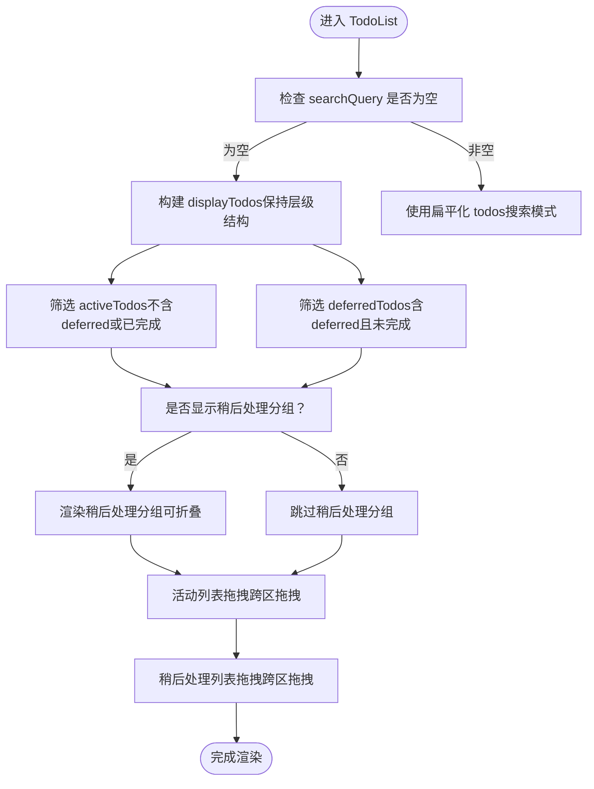
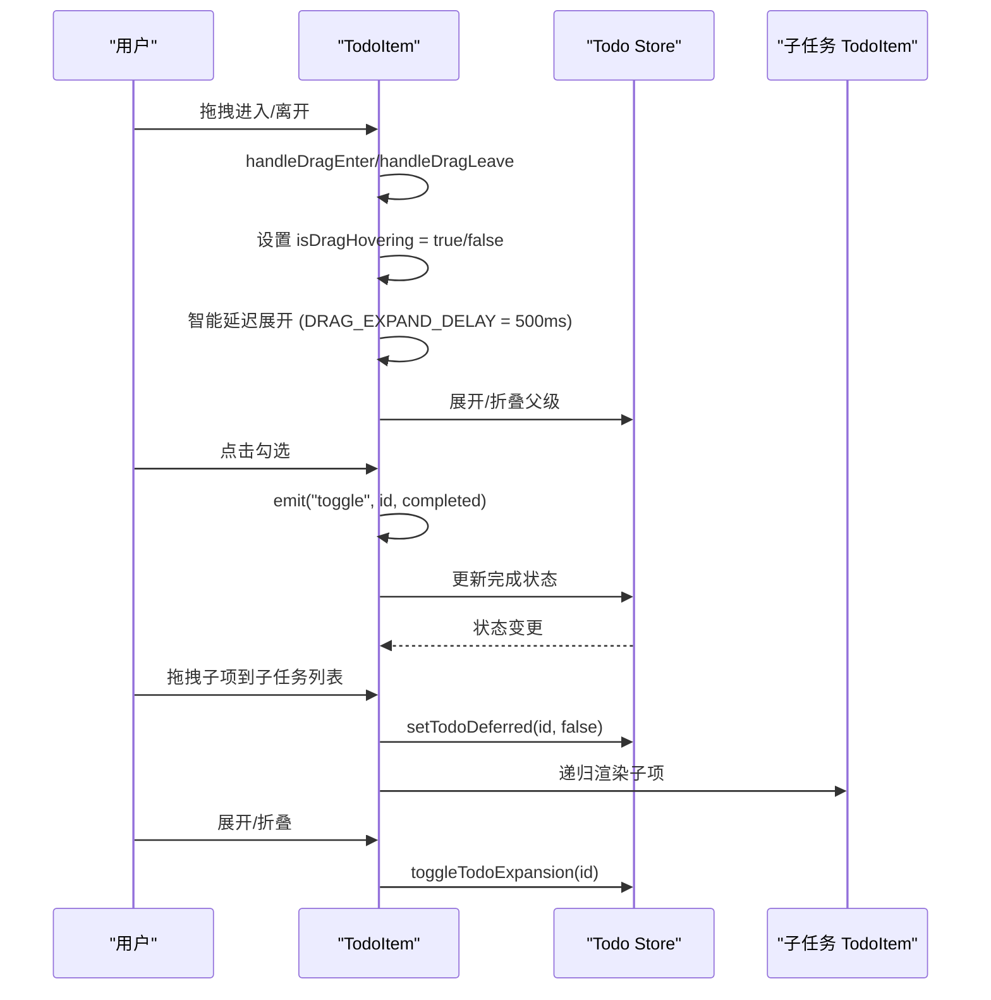
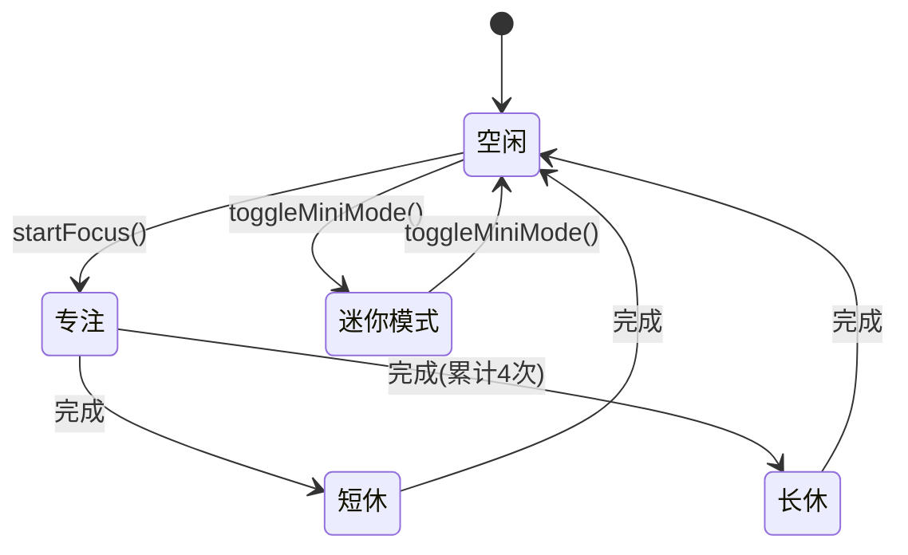
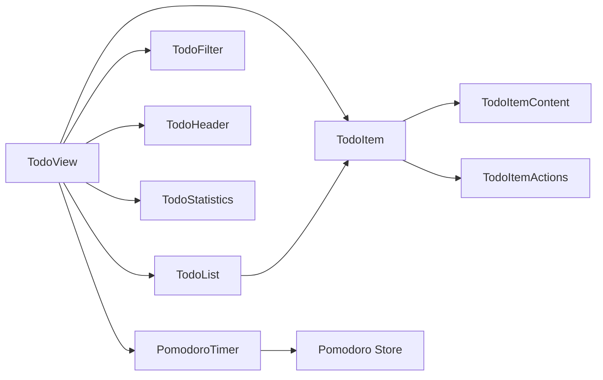

# 任务UI组件

<cite>
**本文档引用的文件**
- [TodoList.vue](file://apps/frontend/src/features/todo/components/TodoList.vue)
- [TodoItem.vue](file://apps/frontend/src/features/todo/components/TodoItem.vue)
- [TodoItemContent.vue](file://apps/frontend/src/features/todo/components/TodoItemContent.vue)
- [TodoItemActions.vue](file://apps/frontend/src/features/todo/components/TodoItemActions.vue)
- [TodoHeader.vue](file://apps/frontend/src/features/todo/components/TodoHeader.vue)
- [TodoFilter.vue](file://apps/frontend/src/features/todo/components/TodoFilter.vue)
- [TodoStatistics.vue](file://apps/frontend/src/features/todo/components/TodoStatistics.vue)
- [PomodoroTimer.vue](file://apps/frontend/src/features/todo/components/PomodoroTimer.vue)
- [TodoView.vue](file://apps/frontend/src/features/todo/TodoView.vue)
- [pomodoro.ts](file://apps/frontend/src/features/todo/stores/pomodoro.ts)
- [theme.css](file://apps/frontend/src/styles/theme.css)
- [useTheme.ts](file://apps/frontend/src/composables/useTheme.ts)
- [TodoList.spec.ts](file://apps/frontend/tests/features/todo/components/TodoList.spec.ts)
- [TodoItem.spec.ts](file://apps/frontend/tests/features/todo/components/TodoItem.spec.ts)
</cite>

## 目录
1. [简介](#简介)
2. [项目结构](#项目结构)
3. [核心组件](#核心组件)
4. [架构总览](#架构总览)
5. [详细组件分析](#详细组件分析)
6. [依赖关系分析](#依赖关系分析)
7. [性能考虑](#性能考虑)
8. [故障排查指南](#故障排查指南)
9. [结论](#结论)
10. [附录](#附录)

## 简介
本文件面向Lumina Todo的任务UI组件体系，系统性阐述Vue组件设计模式、组件间通信机制、响应式数据绑定、虚拟滚动实现、交互行为、布局与筛选逻辑、数据可视化以及专注计时功能。文档同时覆盖props定义、events事件、slots插槽使用、样式定制选项、组件复用策略、性能优化技巧、主题适配方案、测试方法与调试技巧，帮助开发者快速理解并高效扩展任务管理界面。

## 项目结构
Lumina Todo前端采用特征域划分的组件组织方式，任务UI位于features/todo目录，包含视图容器TodoView、多个可复用UI组件以及基于Pinia的状态管理模块。组件通过统一的TodoView进行编排，配合GSAP动画、ECharts可视化、vuedraggable拖拽、i18n国际化等能力，构建出流畅、可定制、可扩展的任务管理体验。

**图表来源**
- [TodoView.vue:1-522](file://apps/frontend/src/features/todo/TodoView.vue#L1-L522)
- [TodoList.vue:1-316](file://apps/frontend/src/features/todo/components/TodoList.vue#L1-L316)
- [TodoItem.vue:1-473](file://apps/frontend/src/features/todo/components/TodoItem.vue#L1-L473)
- [TodoItemContent.vue:1-251](file://apps/frontend/src/features/todo/components/TodoItemContent.vue#L1-L251)
- [TodoItemActions.vue:1-92](file://apps/frontend/src/features/todo/components/TodoItemActions.vue#L1-L92)
- [TodoFilter.vue:1-204](file://apps/frontend/src/features/todo/components/TodoFilter.vue#L1-L204)
- [TodoHeader.vue:1-422](file://apps/frontend/src/features/todo/components/TodoHeader.vue#L1-L422)
- [TodoStatistics.vue:1-342](file://apps/frontend/src/features/todo/components/TodoStatistics.vue#L1-L342)
- [PomodoroTimer.vue:1-175](file://apps/frontend/src/features/todo/components/PomodoroTimer.vue#L1-L175)
- [pomodoro.ts:1-402](file://apps/frontend/src/features/todo/stores/pomodoro.ts#L1-L402)

**章节来源**
- [TodoView.vue:1-522](file://apps/frontend/src/features/todo/TodoView.vue#L1-L522)

## 核心组件
- TodoList：负责任务列表渲染、空态展示、拖拽排序、稍后处理分组、deferredSection展开/折叠偏好记忆。
- TodoItem：单个任务项的完整交互载体，包含展开/折叠、编辑、子任务、拖拽、动作面板、元信息徽章等。**新增拖拽悬停检测系统**，包括isDragHovering状态管理、智能延迟展开功能、视觉反馈增强等重要用户体验改进。
- TodoHeader：顶部导航与控制区，含视图切换、主题切换、语言切换、用户菜单、源切换等。
- TodoFilter：过滤器与工具栏，支持搜索开关、回收站过滤、清空回收站、展开/折叠全部。
- TodoStatistics：统计面板，集成ECharts展示完成率、周活跃度、专注时长等。
- PomodoroTimer：专注计时器，支持迷你模式、全屏模式、状态动画、favicon进度指示、Wails窗口同步。

**章节来源**
- [TodoList.vue:1-316](file://apps/frontend/src/features/todo/components/TodoList.vue#L1-L316)
- [TodoItem.vue:1-473](file://apps/frontend/src/features/todo/components/TodoItem.vue#L1-L473)
- [TodoHeader.vue:1-422](file://apps/frontend/src/features/todo/components/TodoHeader.vue#L1-L422)
- [TodoFilter.vue:1-204](file://apps/frontend/src/features/todo/components/TodoFilter.vue#L1-L204)
- [TodoStatistics.vue:1-342](file://apps/frontend/src/features/todo/components/TodoStatistics.vue#L1-L342)
- [PomodoroTimer.vue:1-175](file://apps/frontend/src/features/todo/components/PomodoroTimer.vue#L1-L175)

## 架构总览
组件间通过TodoView统一编排，TodoView根据视图模式与过滤条件选择渲染TodoList/TodoVisualizer/TodoStatistics，并将事件冒泡与监听器映射到TodoView内的useTodo组合式函数，实现增删改查、拖拽重排、搜索过滤等核心流程。状态管理由Pinia提供，TodoList/TodoItem通过store暴露的方法与计算属性驱动UI更新；PomodoroTimer与pomodoro store联动，实现计时、历史记录、迷你模式等。

**图表来源**
- [TodoView.vue:190-273](file://apps/frontend/src/features/todo/TodoView.vue#L190-L273)
- [TodoList.vue:34-43](file://apps/frontend/src/features/todo/components/TodoList.vue#L34-L43)
- [TodoItem.vue:41-50](file://apps/frontend/src/features/todo/components/TodoItem.vue#L41-L50)
- [pomodoro.ts:196-356](file://apps/frontend/src/features/todo/stores/pomodoro.ts#L196-L356)

**章节来源**
- [TodoView.vue:190-273](file://apps/frontend/src/features/todo/TodoView.vue#L190-L273)

## 详细组件分析

### TodoList 组件分析
- 设计模式：容器组件+子项复用，使用vuedraggable实现拖拽排序与跨列表拖拽；computed getter/setter分离读写，保证deferred状态在拖拽过程中的正确性。
- 组件通信：通过defineEmits向上冒泡toggle/startEdit/saveEdit/cancelEdit/delete/reorder/editingTitle/editKeydown等事件，供TodoView统一处理。
- 响应式数据绑定：displayTodos/activeTodos/deferredTodos/shouldShowDeferredSection/isDeferredSectionExpanded等computed组合过滤与分组逻辑。
- 虚拟滚动：当前实现为标准滚动容器+滚动区域组件，未见专用虚拟滚动库；可通过引入虚拟滚动库进一步优化超大列表性能。
- 空态与无障碍：emptyState根据filter/searchQuery动态生成图标与文案，deferredSection提供aria-expanded与按钮控件，提升可访问性。

**图表来源**
- [TodoList.vue:114-145](file://apps/frontend/src/features/todo/components/TodoList.vue#L114-L145)

**章节来源**
- [TodoList.vue:1-316](file://apps/frontend/src/features/todo/components/TodoList.vue#L1-L316)

### TodoItem 组件分析
- 设计模式：复合组件，内部组合TodoItemContent/TodoItemActions/TodoItemEdit/TodoItemAddSubtask，递归渲染子任务树。
- 交互行为：点击勾选触发toggle事件；双击标题或点击编辑按钮进入编辑模式；拖拽开始/结束时自动展开父级；拖入子任务列表自动清除deferred状态。
- **新增拖拽悬停检测系统**：通过isDragHovering状态管理、dragEnterCount计数器、dragExpandTimer智能延迟展开功能，提供更精确的拖拽反馈和用户体验。
- 动画效果：使用GSAP驱动子任务展开/折叠的高度动画，避免v-show导致的布局抖动。
- 可访问性：提供aria-label与键盘事件回调，支持屏幕阅读器识别。
- 无障碍反馈：错误时通过toast与tooltip提示，提升可用性。

**图表来源**
- [TodoItem.vue:194-238](file://apps/frontend/src/features/todo/components/TodoItem.vue#L194-L238)
- [TodoItemContent.vue:1-251](file://apps/frontend/src/features/todo/components/TodoItemContent.vue#L1-L251)
- [TodoItemActions.vue:1-92](file://apps/frontend/src/features/todo/components/TodoItemActions.vue#L1-L92)

**章节来源**
- [TodoItem.vue:1-473](file://apps/frontend/src/features/todo/components/TodoItem.vue#L1-L473)
- [TodoItemContent.vue:1-251](file://apps/frontend/src/features/todo/components/TodoItemContent.vue#L1-L251)
- [TodoItemActions.vue:1-92](file://apps/frontend/src/features/todo/components/TodoItemActions.vue#L1-L92)

### TodoHeader 组件分析
- 功能布局：左侧品牌区，中间视图切换（列表/草稿/可视化/统计），右侧操作区（主题、语言、源切换、用户菜单）。
- 交互机制：通过TodoView中的store切换viewMode与todoSource；移动端通过下拉菜单聚合功能。
- 可访问性：按钮均提供Tooltip与aria-label，支持键盘导航与屏幕阅读器。

**章节来源**
- [TodoHeader.vue:1-422](file://apps/frontend/src/features/todo/components/TodoHeader.vue#L1-L422)

### TodoFilter 组件分析
- 筛选逻辑：基于FilterType切换"待办/已完成"，支持搜索开关、回收站过滤、清空回收站确认弹窗。
- 工具栏：展开/折叠全部、搜索、回收站、清空回收站等工具按钮，提供Tooltip提示。
- 事件通信：通过v-model与update:前缀事件双向绑定filter/showSearch/isDrawerOpen。

**章节来源**
- [TodoFilter.vue:1-204](file://apps/frontend/src/features/todo/components/TodoFilter.vue#L1-L204)

### TodoStatistics 组件分析
- 数据可视化：集成ECharts，按需懒加载，使用ResizeObserver确保容器尺寸就绪后初始化图表，防抖优化resize性能。
- 指标概览：总任务、已完成、待完成、番茄数；完成率饼图、每周活跃度折线图、专注时长柱状图。
- 主题适配：基于useTheme与useDark动态切换图表主题色与背景，支持暗色模式。

**章节来源**
- [TodoStatistics.vue:1-342](file://apps/frontend/src/features/todo/components/TodoStatistics.vue#L1-L342)

### PomodoroTimer 组件分析
- 专注计时：基于pomodoro store的状态机（idle/focus/short_break/long_break），支持多种模式（classic/icebreaker/flow/cosmos）。
- 迷你模式：浏览器端居中悬浮，Wails端全屏覆盖；支持拖拽区域、玻璃拟态背景、浮动动画。
- 状态同步：与document.title、favicon进度条联动，提供震动反馈与系统通知；支持持久化恢复计时。
- 事件与监听：通过store暴露startFocus/pause/resume/reset/toggleMiniMode等动作，供外部组件调用。

**图表来源**
- [pomodoro.ts:10-401](file://apps/frontend/src/features/todo/stores/pomodoro.ts#L10-L401)
- [PomodoroTimer.vue:1-175](file://apps/frontend/src/features/todo/components/PomodoroTimer.vue#L1-L175)

**章节来源**
- [PomodoroTimer.vue:1-175](file://apps/frontend/src/features/todo/components/PomodoroTimer.vue#L1-L175)
- [pomodoro.ts:1-402](file://apps/frontend/src/features/todo/stores/pomodoro.ts#L1-L402)

## 依赖关系分析
- 组件耦合：TodoView作为编排中心，低耦合地组合各子组件；TodoList/TodoItem通过事件与props解耦，便于单元测试与复用。
- 外部依赖：vuedraggable（拖拽）、ECharts（可视化）、GSAP（动画）、Lucide图标、i18n、Pinia、VueUse等。
- 状态依赖：TodoList/TodoItem依赖Todo Store；PomodoroTimer依赖Pomodoro Store；主题依赖useTheme与CSS变量。

**图表来源**
- [TodoView.vue:1-522](file://apps/frontend/src/features/todo/TodoView.vue#L1-L522)
- [pomodoro.ts:1-402](file://apps/frontend/src/features/todo/stores/pomodoro.ts#L1-L402)

**章节来源**
- [TodoView.vue:1-522](file://apps/frontend/src/features/todo/TodoView.vue#L1-L522)

## 性能考虑
- 动画与渲染
  - 使用GSAP驱动TodoItem展开/折叠的height动画，避免频繁DOM布局抖动。
  - TodoView对视图切换使用Transition与GSAP自定义动画，减少页面重绘。
  - TodoStatistics使用ResizeObserver与debounce优化图表resize性能。
- 拖拽与排序
  - TodoList/TodoItem通过computed setter在拖拽过程中即时修正deferred状态，避免脏数据。
  - vuedraggable启用ghost-class/chosen-class/drag-class提升拖拽反馈。
  - **新增拖拽悬停检测系统**：通过智能延迟展开（DRAG_EXPAND_DELAY = 500ms）避免拖拽经过时误触发，提升拖拽体验。
- 可访问性与无障碍
  - 提供aria-expanded、aria-controls、aria-label等属性，确保屏幕阅读器可用。
  - Tooltip/Popover提供延迟与焦点管理，避免干扰用户操作。
- 主题与样式
  - CSS变量集中于theme.css，useTheme动态注入主题色，减少重排与闪烁。
  - 动画过渡统一使用--theme-transition，保证全局一致性。

[本节为通用指导，无需特定文件引用]

## 故障排查指南
- 拖拽异常
  - 症状：拖拽后deferred状态未正确清除或设置。
  - 排查：检查TodoList中dragList/draggable setter逻辑与TodoItem子任务列表setter逻辑。
  - 参考测试：TodoList.spec.ts验证拖拽时setTodoDeferred调用。
  - **新增**：检查isDragHovering状态管理是否正常工作，dragEnterCount计数器是否正确递增递减。
- 编辑模式无法保存
  - 症状：编辑后点击保存无响应。
  - 排查：确认TodoItem在handleSaveEdit中调用store.updateTodo并emit saveEdit；TodoView监听saveEdit事件。
  - 参考测试：TodoItem.spec.ts验证编辑保存事件。
- 统计图表不显示
  - 症状：图表空白或不更新。
  - 排查：确认ResizeObserver已检测到容器尺寸变化；检查useTodoStatisticsOptions返回的option是否有效。
- 计时器状态不同步
  - 症状：刷新页面后计时器状态异常。
  - 排查：检查pomodoro store的持久化配置与自动恢复逻辑。

**章节来源**
- [TodoList.spec.ts:353-448](file://apps/frontend/tests/features/todo/components/TodoList.spec.ts#L353-L448)
- [TodoItem.spec.ts:572-611](file://apps/frontend/tests/features/todo/components/TodoItem.spec.ts#L572-L611)
- [TodoStatistics.vue:68-117](file://apps/frontend/src/features/todo/components/TodoStatistics.vue#L68-L117)
- [pomodoro.ts:247-265](file://apps/frontend/src/features/todo/stores/pomodoro.ts#L247-L265)

## 结论
Lumina Todo的任务UI组件体系以清晰的职责划分、完善的事件通信与响应式数据绑定为基础，结合动画、可视化与主题系统，提供了良好的用户体验与可扩展性。**新增的拖拽悬停检测系统显著提升了拖拽操作的精确性和用户体验**，通过智能延迟展开、状态管理和视觉反馈增强了交互的可靠性。建议后续在超大列表场景引入虚拟滚动、完善无障碍标签与键盘快捷键、加强错误边界与日志上报，持续提升稳定性与可维护性。

[本节为总结，无需特定文件引用]

## 附录

### 组件组合模式与事件处理示例
- 组合模式：TodoView通过v-bind/v-on将props与事件映射到当前视图组件，实现多视图切换与统一事件处理。
- 事件处理：TodoList/TodoItem通过defineEmits声明事件，TodoView在currentViewListeners中统一接收并调用useTodo组合式函数。

**章节来源**
- [TodoView.vue:229-273](file://apps/frontend/src/features/todo/TodoView.vue#L229-L273)

### 动画效果实现要点
- TodoItem展开/折叠：使用GSAP设置/动画height，完成后清理height以自适应内容。
- TodoView视图切换：自定义Transition钩子，使用GSAP实现位移、缩放与模糊的过渡效果。

**章节来源**
- [TodoItem.vue:250-304](file://apps/frontend/src/features/todo/components/TodoItem.vue#L250-L304)
- [TodoView.vue:391-453](file://apps/frontend/src/features/todo/TodoView.vue#L391-L453)

### 无障碍访问支持
- 关键属性：aria-expanded、aria-controls、aria-label、role等。
- 交互反馈：Tooltip延迟、键盘导航、屏幕阅读器提示。

**章节来源**
- [TodoList.vue:242-245](file://apps/frontend/src/features/todo/components/TodoList.vue#L242-L245)
- [TodoItem.vue:302-303](file://apps/frontend/src/features/todo/components/TodoItem.vue#L302-L303)

### 主题适配方案
- CSS变量：通过theme.css集中管理基础色、文本色、图表色等。
- 动态主题：useTheme监听主题与颜色变化，实时注入CSS变量，支持随机主题与明暗模式。

**章节来源**
- [theme.css:1-170](file://apps/frontend/src/styles/theme.css#L1-L170)
- [useTheme.ts:308-377](file://apps/frontend/src/composables/useTheme.ts#L308-L377)

### 测试方法与调试技巧
- 单元测试：使用Vitest与@vue/test-utils对TodoList/TodoItem进行事件冒泡、状态变更、拖拽行为等断言。
- Mock策略：对第三方UI库与图标组件进行轻量Mock，聚焦业务逻辑验证。
- 调试技巧：利用浏览器开发者工具观察组件树、事件流与状态变化；在TodoView中打印currentViewProps/currentViewListeners以核对事件映射。

**章节来源**
- [TodoList.spec.ts:1-600](file://apps/frontend/tests/features/todo/components/TodoList.spec.ts#L1-L600)
- [TodoItem.spec.ts:1-949](file://apps/frontend/tests/features/todo/components/TodoItem.spec.ts#L1-L949)

### 拖拽悬停检测系统详解

**新增功能概述**
TodoItem组件新增了完整的拖拽悬停检测系统，显著提升了拖拽操作的用户体验和精确性。该系统包含以下关键特性：

- **isDragHovering状态管理**：实时跟踪元素是否处于拖拽悬停状态
- **dragEnterCount计数器**：精确管理多个dragenter/dragleave事件的配对
- **智能延迟展开**：DRAG_EXPAND_DELAY = 500ms的延迟机制，避免误触发
- **视觉反馈增强**：通过CSS类和边框效果提供直观的拖拽状态指示

**技术实现细节**
- 状态管理：通过ref创建isDragHovering、dragEnterCount、dragExpandTimer三个核心状态
- 事件处理：handleDragEnter、handleDragLeave、handleDragEnd三个方法分别处理不同阶段的拖拽事件
- 延迟机制：使用setTimeout实现500ms的智能延迟展开，避免拖拽经过时的误触发
- 清理机制：确保dragExpandTimer在适当时机被清除，防止内存泄漏

**用户体验改进**
- 减少误操作：智能延迟避免拖拽经过时的意外展开
- 更精确的反馈：视觉指示让用户清楚知道当前的拖拽状态
- 平滑的交互：结合GSAP动画实现流畅的展开/折叠效果

**章节来源**
- [TodoItem.vue:52-59](file://apps/frontend/src/features/todo/components/TodoItem.vue#L52-L59)
- [TodoItem.vue:194-238](file://apps/frontend/src/features/todo/components/TodoItem.vue#L194-L238)
- [TodoItem.vue:319-324](file://apps/frontend/src/features/todo/components/TodoItem.vue#L319-L324)
- [TodoItem.vue:436-441](file://apps/frontend/src/features/todo/components/TodoItem.vue#L436-L441)