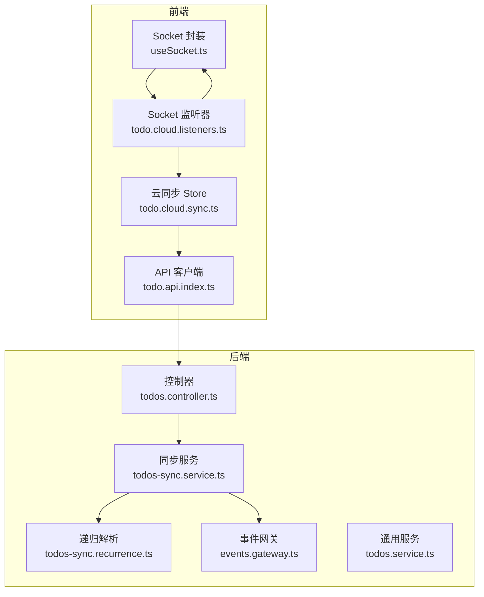
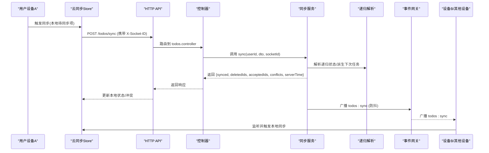
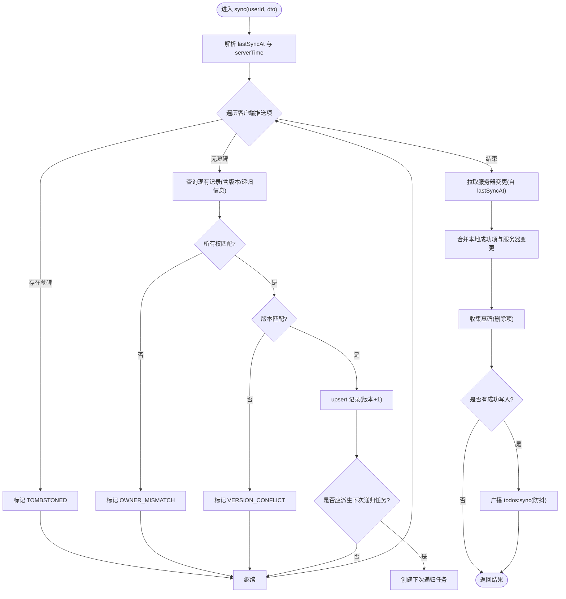
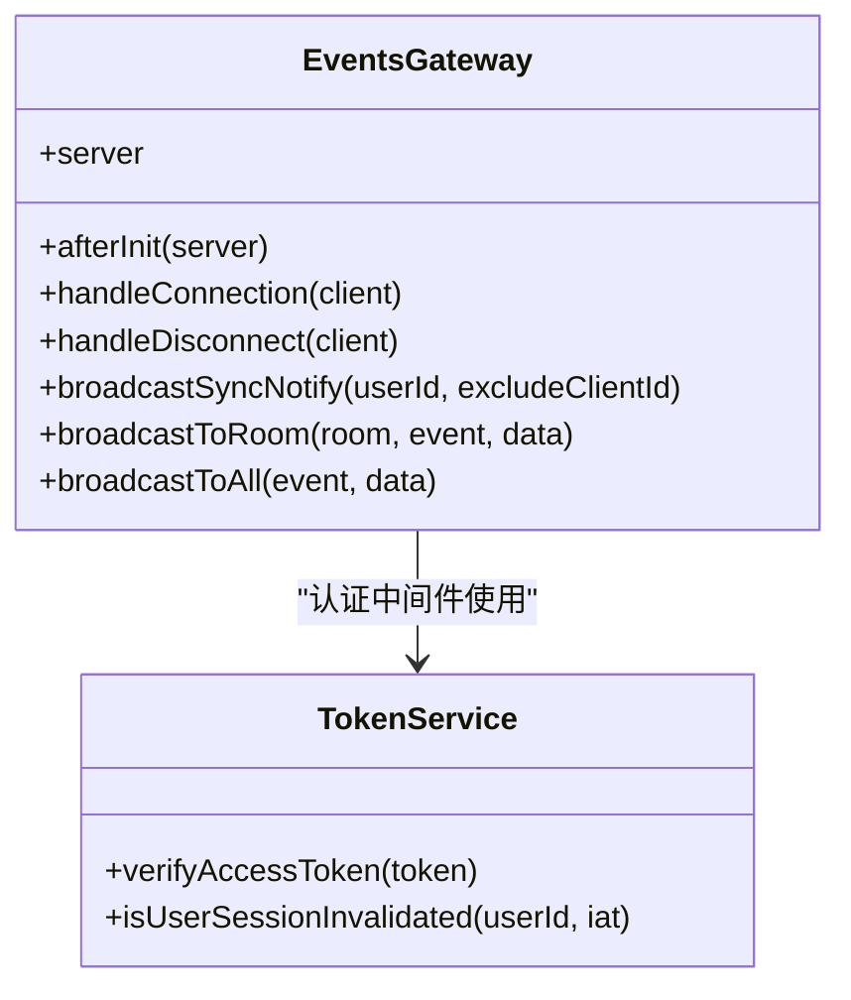
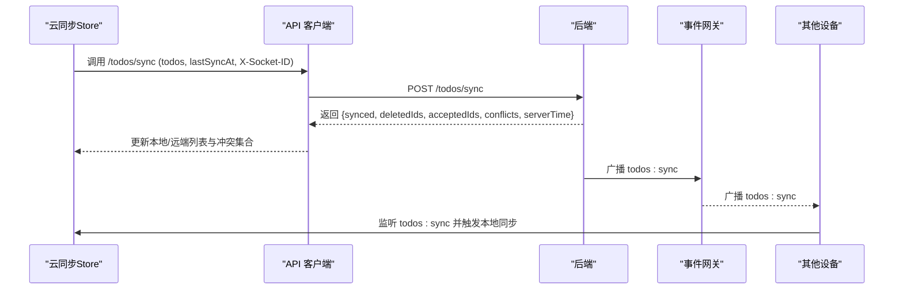
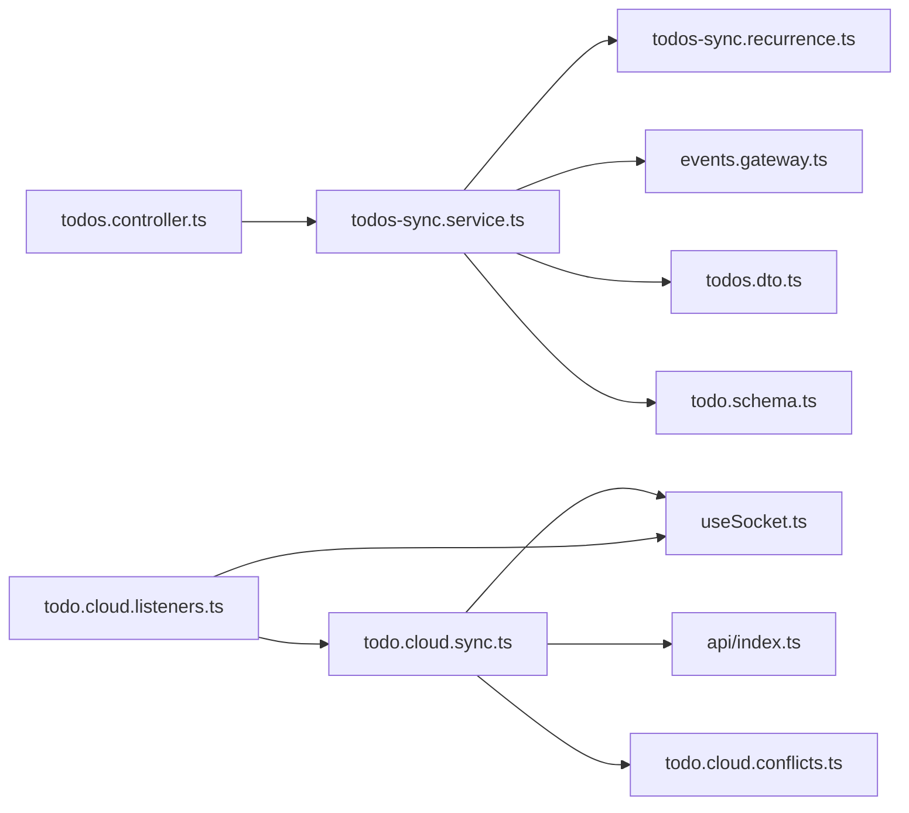

# 任务同步机制

<cite>
**本文引用的文件**
- [apps/backend/src/todos/todos-sync.service.ts](file://apps/backend/src/todos/todos-sync.service.ts)
- [apps/backend/src/todos/todos.controller.ts](file://apps/backend/src/todos/todos.controller.ts)
- [apps/backend/src/todos/todos.dto.ts](file://apps/backend/src/todos/todos.dto.ts)
- [apps/backend/src/todos/todos-sync.recurrence.ts](file://apps/backend/src/todos/todos-sync.recurrence.ts)
- [apps/backend/src/todos/todos.service.ts](file://apps/backend/src/todos/todos.service.ts)
- [apps/backend/src/events/events.gateway.ts](file://apps/backend/src/events/events.gateway.ts)
- [apps/frontend/src/features/todo/stores/todo.cloud.sync.ts](file://apps/frontend/src/features/todo/stores/todo.cloud.sync.ts)
- [apps/frontend/src/features/todo/stores/todo.cloud.listeners.ts](file://apps/frontend/src/features/todo/stores/todo.cloud.listeners.ts)
- [apps/frontend/src/features/todo/stores/todo.cloud.conflicts.ts](file://apps/frontend/src/features/todo/stores/todo.cloud.conflicts.ts)
- [apps/frontend/src/features/todo/stores/todo.cloud.ts](file://apps/frontend/src/features/todo/stores/todo.cloud.ts)
- [apps/frontend/src/composables/useSocket.ts](file://apps/frontend/src/composables/useSocket.ts)
- [apps/frontend/src/features/todo/api/index.ts](file://apps/frontend/src/features/todo/api/index.ts)
- [packages/shared/src/schemas/todo.schema.ts](file://packages/shared/src/schemas/todo.schema.ts)
</cite>

## 目录

1. [简介](#简介)
2. [项目结构](#项目结构)
3. [核心组件](#核心组件)
4. [架构总览](#架构总览)
5. [详细组件分析](#详细组件分析)
6. [依赖关系分析](#依赖关系分析)
7. [性能考量](#性能考量)
8. [故障排除指南](#故障排除指南)
9. [结论](#结论)
10. [附录](#附录)

## 简介

本文件系统化阐述 Lumina Todo 的多设备任务同步机制，覆盖以下关键点：

- 同步触发条件与流程：离线优先的增量合并、冲突检测与解决、离线数据处理与重试。
- 实时通信：WebSocket 在同步中的作用、EventsGateway 的消息广播机制。
- 前端云同步 store 的状态管理：同步状态、冲突集合、本地/远端数据合并策略。
- 数据版本控制与一致性：基于版本号的严格冲突检测、服务端事务与幂等合并。
- 性能优化：防抖、冷却时间、增量拉取、回退标记、重试指数退避。
- 调试与排障：日志与错误分类、认证与连接问题定位。

## 项目结构

围绕“任务同步”的前后端协作主要涉及：

- 后端
  - 控制器：接收同步请求，转发至同步服务。
  - 同步服务：执行增量合并、冲突检测、递归任务生成、广播通知。
  - 事件网关：WebSocket 网关，负责认证、房间管理、广播“todos:sync”等事件。
  - 通用服务：用于删除/恢复/清空回收站等操作触发广播。
- 前端
  - 云同步 store：封装同步动作、冲突构建与处理、本地/远端合并。
  - Socket 封装：连接生命周期、认证重试、房间加入、事件监听。
  - API 层：统一调用后端 /todos/sync 接口，并携带 X-Socket-ID。

图表来源

- [apps/frontend/src/features/todo/stores/todo.cloud.sync.ts:1-187](file://apps/frontend/src/features/todo/stores/todo.cloud.sync.ts#L1-L187)
- [apps/frontend/src/composables/useSocket.ts:1-191](file://apps/frontend/src/composables/useSocket.ts#L1-L191)
- [apps/frontend/src/features/todo/api/index.ts:1-62](file://apps/frontend/src/features/todo/api/index.ts#L1-L62)
- [apps/backend/src/todos/todos.controller.ts:1-70](file://apps/backend/src/todos/todos.controller.ts#L1-L70)
- [apps/backend/src/todos/todos-sync.service.ts:1-226](file://apps/backend/src/todos/todos-sync.service.ts#L1-L226)
- [apps/backend/src/todos/todos-sync.recurrence.ts:1-210](file://apps/backend/src/todos/todos-sync.recurrence.ts#L1-L210)
- [apps/backend/src/events/events.gateway.ts:1-266](file://apps/backend/src/events/events.gateway.ts#L1-L266)
- [apps/backend/src/todos/todos.service.ts:1-147](file://apps/backend/src/todos/todos.service.ts#L1-L147)

章节来源

- [apps/frontend/src/features/todo/stores/todo.cloud.sync.ts:1-187](file://apps/frontend/src/features/todo/stores/todo.cloud.sync.ts#L1-L187)
- [apps/frontend/src/composables/useSocket.ts:1-191](file://apps/frontend/src/composables/useSocket.ts#L1-L191)
- [apps/frontend/src/features/todo/api/index.ts:1-62](file://apps/frontend/src/features/todo/api/index.ts#L1-L62)
- [apps/backend/src/todos/todos.controller.ts:1-70](file://apps/backend/src/todos/todos.controller.ts#L1-L70)
- [apps/backend/src/todos/todos-sync.service.ts:1-226](file://apps/backend/src/todos/todos-sync.service.ts#L1-L226)
- [apps/backend/src/todos/todos-sync.recurrence.ts:1-210](file://apps/backend/src/todos/todos-sync.recurrence.ts#L1-L210)
- [apps/backend/src/events/events.gateway.ts:1-266](file://apps/backend/src/events/events.gateway.ts#L1-L266)
- [apps/backend/src/todos/todos.service.ts:1-147](file://apps/backend/src/todos/todos.service.ts#L1-L147)

## 核心组件

- 后端同步服务（TodoSyncService）
  - 负责增量合并、冲突检测、递归任务派生、服务器端变更拉取、广播通知。
- 事件网关（EventsGateway）
  - WebSocket 网关，认证中间件、房间管理、广播 todos:sync。
- 前端云同步 store（todo.cloud.sync）
  - 统一发起同步、合并结果、处理冲突、重试与错误处理。
- Socket 封装（useSocket）
  - 连接生命周期、认证错误重试、房间加入、事件监听。
- API 客户端（todo.api.index）
  - 调用 /todos/sync，携带 X-Socket-ID 以避免自身广播回流。

章节来源

- [apps/backend/src/todos/todos-sync.service.ts:42-226](file://apps/backend/src/todos/todos-sync.service.ts#L42-L226)
- [apps/backend/src/events/events.gateway.ts:57-266](file://apps/backend/src/events/events.gateway.ts#L57-L266)
- [apps/frontend/src/features/todo/stores/todo.cloud.sync.ts:25-187](file://apps/frontend/src/features/todo/stores/todo.cloud.sync.ts#L25-L187)
- [apps/frontend/src/composables/useSocket.ts:56-191](file://apps/frontend/src/composables/useSocket.ts#L56-L191)
- [apps/frontend/src/features/todo/api/index.ts:8-20](file://apps/frontend/src/features/todo/api/index.ts#L8-L20)

## 架构总览

下图展示了从用户操作到多设备实时同步的关键交互：

图表来源

- [apps/frontend/src/features/todo/api/index.ts:8-20](file://apps/frontend/src/features/todo/api/index.ts#L8-L20)
- [apps/backend/src/todos/todos.controller.ts:30-38](file://apps/backend/src/todos/todos.controller.ts#L30-L38)
- [apps/backend/src/todos/todos-sync.service.ts:52-224](file://apps/backend/src/todos/todos-sync.service.ts#L52-L224)
- [apps/backend/src/todos/todos-sync.recurrence.ts:87-151](file://apps/backend/src/todos/todos-sync.recurrence.ts#L87-L151)
- [apps/backend/src/events/events.gateway.ts:180-202](file://apps/backend/src/events/events.gateway.ts#L180-L202)
- [apps/frontend/src/features/todo/stores/todo.cloud.listeners.ts:24-31](file://apps/frontend/src/features/todo/stores/todo.cloud.listeners.ts#L24-L31)

## 详细组件分析

### 后端同步服务（TodoSyncService）

- 增量合并与事务
  - 使用数据库事务批量处理客户端推送的变更，保证原子性。
  - 对每个推送项先检查墓碑（删除记录），再检查所有权与版本号，最后 upsert。
- 版本控制与冲突检测
  - 严格基于版本号比对，避免客户端时钟漂移导致的误判。
  - 冲突类型：TOMBSTONED（已被删除）、OWNER_MISMATCH（非本人）、VERSION_CONFLICT（版本不一致）。
- 递归任务派生
  - 当完成一个可递归的父任务且满足派生条件时，服务端生成下一个周期任务。
- 服务器端变更拉取
  - 基于 lastSyncAt 拉取自上次同步以来的服务器变更，初次同步排除回收站。
- 广播通知
  - 成功写入后，向用户房间广播 todos:sync（带防抖，500ms 内仅一次）。

图表来源

- [apps/backend/src/todos/todos-sync.service.ts:52-224](file://apps/backend/src/todos/todos-sync.service.ts#L52-L224)
- [apps/backend/src/todos/todos-sync.recurrence.ts:87-151](file://apps/backend/src/todos/todos-sync.recurrence.ts#L87-L151)
- [apps/backend/src/events/events.gateway.ts:180-202](file://apps/backend/src/events/events.gateway.ts#L180-L202)

章节来源

- [apps/backend/src/todos/todos-sync.service.ts:42-226](file://apps/backend/src/todos/todos-sync.service.ts#L42-L226)
- [apps/backend/src/todos/todos-sync.recurrence.ts:1-210](file://apps/backend/src/todos/todos-sync.recurrence.ts#L1-L210)

### 事件网关（EventsGateway）

- 认证与房间
  - 中间件校验访问令牌与会话有效性；连接后自动加入 user:{userId} 房间。
- 广播机制
  - 提供 broadcastSyncNotify，内部使用 Map 存储用户级定时器，500ms 防抖，避免频繁广播。
  - 支持 except 排除特定 socketId，防止自身写入广播回流。
- 房间加入/离开与消息广播
  - 提供 join/leave 以及通用广播接口，便于其他服务调用。

图表来源

- [apps/backend/src/events/events.gateway.ts:57-266](file://apps/backend/src/events/events.gateway.ts#L57-L266)

章节来源

- [apps/backend/src/events/events.gateway.ts:1-266](file://apps/backend/src/events/events.gateway.ts#L1-L266)

### 前端云同步 Store（todo.cloud.sync）

- 同步触发与冷却
  - 仅当远端源开启且存在“未同步”项时触发；2 秒冷却时间，避免频繁请求。
  - 通过 API 客户端调用 /todos/sync，并携带 X-Socket-ID。
- 结果合并
  - acceptedIds 或无冲突/冲突集为空时，回退标记为已同步。
  - 将服务端返回的 synced 合并到本地或远端列表，保持冲突项不变。
- 冲突处理
  - 构建冲突对象（包含本地草稿与服务端快照），支持接受服务端或重试版本冲突。
- 错误与重试
  - 对 5xx 或无响应的错误采用指数退避重试（最多 1 次）。
- 本地提醒循环
  - 监听 todos:remind 事件，更新提醒状态并触发本地提示。

图表来源

- [apps/frontend/src/features/todo/stores/todo.cloud.sync.ts:34-154](file://apps/frontend/src/features/todo/stores/todo.cloud.sync.ts#L34-L154)
- [apps/frontend/src/features/todo/api/index.ts:8-20](file://apps/frontend/src/features/todo/api/index.ts#L8-L20)
- [apps/backend/src/todos/todos.controller.ts:30-38](file://apps/backend/src/todos/todos.controller.ts#L30-L38)
- [apps/backend/src/events/events.gateway.ts:180-202](file://apps/backend/src/events/events.gateway.ts#L180-L202)

章节来源

- [apps/frontend/src/features/todo/stores/todo.cloud.sync.ts:1-187](file://apps/frontend/src/features/todo/stores/todo.cloud.sync.ts#L1-L187)
- [apps/frontend/src/features/todo/stores/todo.cloud.conflicts.ts:1-91](file://apps/frontend/src/features/todo/stores/todo.cloud.conflicts.ts#L1-L91)
- [apps/frontend/src/features/todo/stores/todo.cloud.listeners.ts:1-90](file://apps/frontend/src/features/todo/stores/todo.cloud.listeners.ts#L1-L90)
- [apps/frontend/src/composables/useSocket.ts:1-191](file://apps/frontend/src/composables/useSocket.ts#L1-L191)

### Socket 封装（useSocket）

- 连接与认证
  - 自动注入 token 到 auth 字段；连接成功后加入 user:{userId} 房间。
  - 认证错误时尝试刷新令牌并重新连接。
- 生命周期与等待
  - 提供 connect/disconnect/waitForConnection，支持超时回调。
- 传输与路径
  - 生产环境优先 websocket，开发环境兼容 polling；显式 path 与 credentials。

章节来源

- [apps/frontend/src/composables/useSocket.ts:56-191](file://apps/frontend/src/composables/useSocket.ts#L56-L191)

### 共享数据模型（packages/shared）

- 同步请求/响应
  - SyncMergeRequest：todos 数组与 lastSyncAt。
  - SyncResponse：synced 列表、deletedIds、acceptedIds、conflicts、serverTime。
- 冲突类型
  - TOMBSTONED、OWNER_MISMATCH、VERSION_CONFLICT。
- Todo 基本字段
  - 包含版本号 version、递归相关字段、时间戳等。

章节来源

- [packages/shared/src/schemas/todo.schema.ts:40-76](file://packages/shared/src/schemas/todo.schema.ts#L40-L76)

## 依赖关系分析

- 后端
  - TodosController 依赖 TodoSyncService。
  - TodoSyncService 依赖 PrismaService、EventsGateway、递归解析模块。
  - TodosService 在删除/恢复/清空回收站时也触发广播。
- 前端
  - todo.cloud.sync 依赖 API 客户端、Socket 封装、冲突构建工具。
  - todo.cloud.listeners 依赖 Socket 封装与提醒循环。

图表来源

- [apps/backend/src/todos/todos.controller.ts:25-28](file://apps/backend/src/todos/todos.controller.ts#L25-L28)
- [apps/backend/src/todos/todos-sync.service.ts:43-47](file://apps/backend/src/todos/todos-sync.service.ts#L43-L47)
- [apps/backend/src/todos/todos-sync.recurrence.ts:1-210](file://apps/backend/src/todos/todos-sync.recurrence.ts#L1-L210)
- [apps/backend/src/events/events.gateway.ts:1-266](file://apps/backend/src/events/events.gateway.ts#L1-L266)
- [apps/frontend/src/features/todo/stores/todo.cloud.sync.ts:1-187](file://apps/frontend/src/features/todo/stores/todo.cloud.sync.ts#L1-L187)
- [apps/frontend/src/features/todo/api/index.ts:1-62](file://apps/frontend/src/features/todo/api/index.ts#L1-L62)
- [apps/frontend/src/composables/useSocket.ts:1-191](file://apps/frontend/src/composables/useSocket.ts#L1-L191)
- [apps/frontend/src/features/todo/stores/todo.cloud.conflicts.ts:1-91](file://apps/frontend/src/features/todo/stores/todo.cloud.conflicts.ts#L1-L91)
- [apps/frontend/src/features/todo/stores/todo.cloud.listeners.ts:1-90](file://apps/frontend/src/features/todo/stores/todo.cloud.listeners.ts#L1-L90)
- [apps/backend/src/todos/todos.dto.ts:1-5](file://apps/backend/src/todos/todos.dto.ts#L1-L5)
- [packages/shared/src/schemas/todo.schema.ts:40-76](file://packages/shared/src/schemas/todo.schema.ts#L40-L76)

章节来源

- [apps/backend/src/todos/todos.controller.ts:1-70](file://apps/backend/src/todos/todos.controller.ts#L1-L70)
- [apps/backend/src/todos/todos-sync.service.ts:1-226](file://apps/backend/src/todos/todos-sync.service.ts#L1-L226)
- [apps/backend/src/todos/todos-sync.recurrence.ts:1-210](file://apps/backend/src/todos/todos-sync.recurrence.ts#L1-L210)
- [apps/backend/src/events/events.gateway.ts:1-266](file://apps/backend/src/events/events.gateway.ts#L1-L266)
- [apps/frontend/src/features/todo/stores/todo.cloud.sync.ts:1-187](file://apps/frontend/src/features/todo/stores/todo.cloud.sync.ts#L1-L187)
- [apps/frontend/src/features/todo/api/index.ts:1-62](file://apps/frontend/src/features/todo/api/index.ts#L1-L62)
- [apps/frontend/src/composables/useSocket.ts:1-191](file://apps/frontend/src/composables/useSocket.ts#L1-L191)
- [apps/frontend/src/features/todo/stores/todo.cloud.conflicts.ts:1-91](file://apps/frontend/src/features/todo/stores/todo.cloud.conflicts.ts#L1-L91)
- [apps/frontend/src/features/todo/stores/todo.cloud.listeners.ts:1-90](file://apps/frontend/src/features/todo/stores/todo.cloud.listeners.ts#L1-L90)
- [apps/backend/src/todos/todos.dto.ts:1-5](file://apps/backend/src/todos/todos.dto.ts#L1-L5)
- [packages/shared/src/schemas/todo.schema.ts:1-76](file://packages/shared/src/schemas/todo.schema.ts#L1-L76)

## 性能考量

- 防抖与冷却
  - 服务端广播防抖（500ms），减少重复广播；前端同步冷却（2000ms）与防抖函数，降低请求频率。
- 增量同步
  - 基于 lastSyncAt 拉取增量变更，避免全量同步。
- 事务与幂等
  - 事务保证批量 upsert 的原子性；版本号严格校验避免重复写入。
- 回退标记
  - 当 acceptedIds 不存在且无冲突时，回退标记为已同步，提升用户体验。
- 指数退避
  - 对 5xx 或无响应错误进行最多 1 次指数退避重试，缓解瞬时异常。
- 缓存策略
  - 前端维护本地/远端列表与冲突集合，避免重复渲染与重复请求。

[本节为通用性能建议，无需具体文件分析]

## 故障排除指南

- WebSocket 认证失败
  - 现象：连接报 unauthorized。
  - 排查：确认 token 是否有效、是否被服务端判定会话失效；检查 CORS 配置与 allowedHeaders。
  - 参考
    - [apps/frontend/src/composables/useSocket.ts:93-108](file://apps/frontend/src/composables/useSocket.ts#L93-L108)
    - [apps/backend/src/events/events.gateway.ts:90-115](file://apps/backend/src/events/events.gateway.ts#L90-L115)
- 广播未到达或重复
  - 现象：设备间不同步或反复提示。
  - 排查：确认 X-Socket-ID 是否正确传递；检查服务端广播防抖逻辑与房间加入。
  - 参考
    - [apps/frontend/src/features/todo/api/index.ts:16-16](file://apps/frontend/src/features/todo/api/index.ts#L16-L16)
    - [apps/backend/src/events/events.gateway.ts:180-202](file://apps/backend/src/events/events.gateway.ts#L180-L202)
- 版本冲突反复出现
  - 现象：VERSION_CONFLICT 循环。
  - 排查：确认本地 draft 的版本号与服务端 serverVersion 一致后再重试；避免在冲突期间修改同一项。
  - 参考
    - [apps/frontend/src/features/todo/stores/todo.cloud.conflicts.ts:60-83](file://apps/frontend/src/features/todo/stores/todo.cloud.conflicts.ts#L60-L83)
    - [apps/backend/src/todos/todos-sync.service.ts:115-126](file://apps/backend/src/todos/todos-sync.service.ts#L115-L126)
- 递归任务未派生
  - 现象：完成父任务后未生成下一次任务。
  - 排查：确认 dueAt 存在、规则合法、时区有效、父任务未完成/未删除且未派生过。
  - 参考
    - [apps/backend/src/todos/todos-sync.recurrence.ts:125-132](file://apps/backend/src/todos/todos-sync.recurrence.ts#L125-L132)
- 删除/恢复/清空回收站后未同步
  - 现象：其他设备未感知变更。
  - 排查：确认 TodosService 的对应操作是否调用了广播。
  - 参考
    - [apps/backend/src/todos/todos.service.ts:83-144](file://apps/backend/src/todos/todos.service.ts#L83-L144)

章节来源

- [apps/frontend/src/composables/useSocket.ts:93-108](file://apps/frontend/src/composables/useSocket.ts#L93-L108)
- [apps/backend/src/events/events.gateway.ts:90-115](file://apps/backend/src/events/events.gateway.ts#L90-L115)
- [apps/frontend/src/features/todo/api/index.ts:16-16](file://apps/frontend/src/features/todo/api/index.ts#L16-L16)
- [apps/backend/src/events/events.gateway.ts:180-202](file://apps/backend/src/events/events.gateway.ts#L180-L202)
- [apps/frontend/src/features/todo/stores/todo.cloud.conflicts.ts:60-83](file://apps/frontend/src/features/todo/stores/todo.cloud.conflicts.ts#L60-L83)
- [apps/backend/src/todos/todos-sync.service.ts:115-126](file://apps/backend/src/todos/todos-sync.service.ts#L115-L126)
- [apps/backend/src/todos/todos-sync.recurrence.ts:125-132](file://apps/backend/src/todos/todos-sync.recurrence.ts#L125-L132)
- [apps/backend/src/todos/todos.service.ts:83-144](file://apps/backend/src/todos/todos.service.ts#L83-L144)

## 结论

Lumina Todo 的同步机制以“离线优先、版本严格、增量合并、实时广播”为核心设计：

- 通过严格的版本号与冲突类型，保障多设备并发下的数据一致性。
- 服务端事务与递归派生逻辑确保业务正确性与可扩展性。
- 前端采用冷却、防抖、回退标记与指数退避，兼顾性能与可靠性。
- WebSocket 实时广播与房间机制，使多设备几乎无延迟地保持一致。

[本节为总结性内容，无需具体文件分析]

## 附录

- 同步触发条件
  - 前端：存在未同步项、远端源开启、超过冷却时间。
  - 后端：收到 /todos/sync 请求，携带 X-Socket-ID。
- 数据版本控制
  - 服务端 upsert 时版本+1；冲突检测严格基于版本号。
- 增量同步优化
  - 基于 lastSyncAt 拉取增量；初次同步排除回收站。
- 网络异常处理
  - 前端：5xx 或无响应时指数退避重试；认证错误自动刷新令牌。
  - 后端：广播防抖；事务保证原子性。

[本节为概要性附录，无需具体文件分析]
