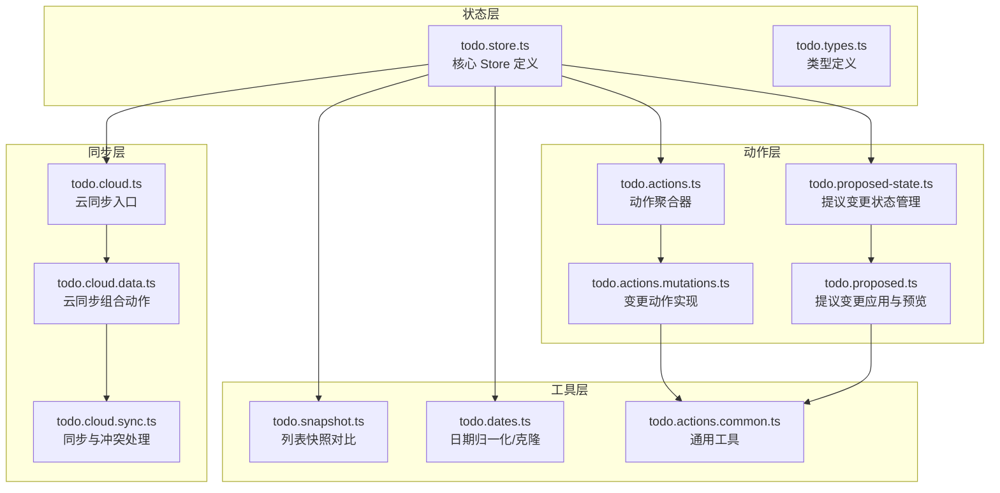
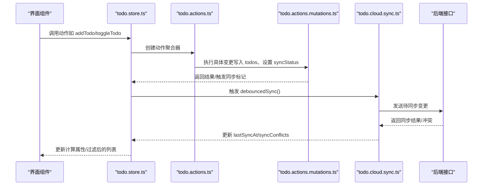
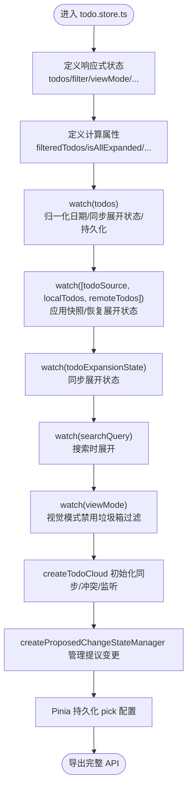
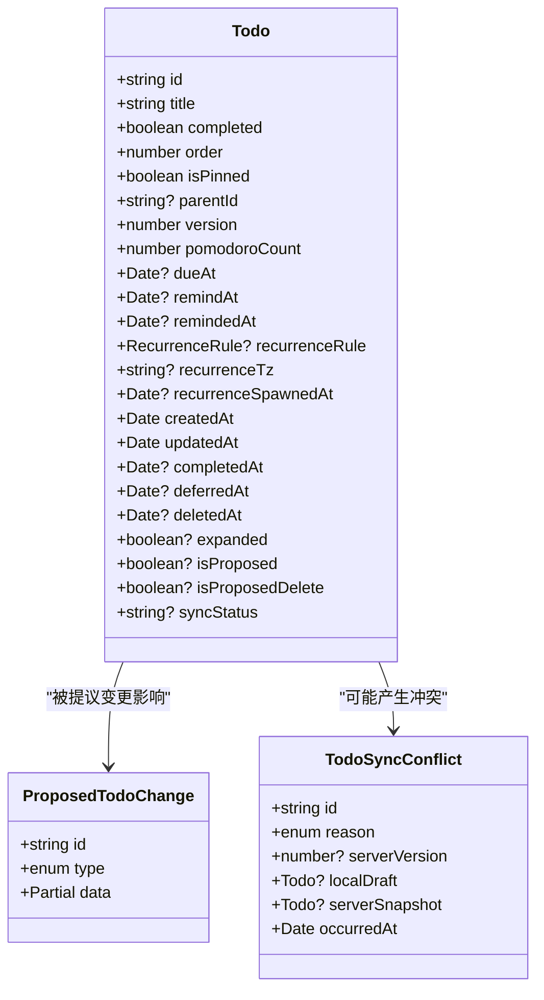
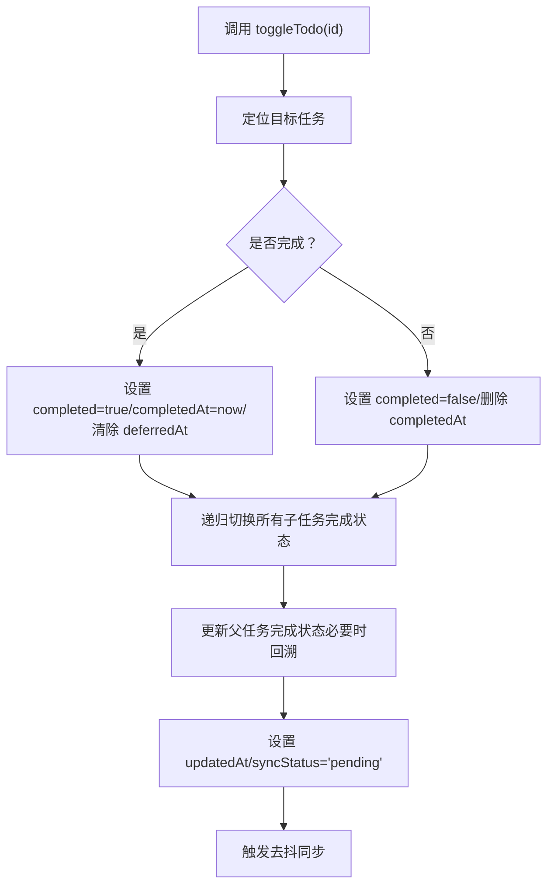
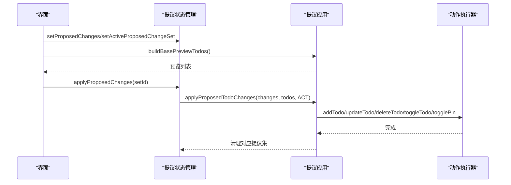
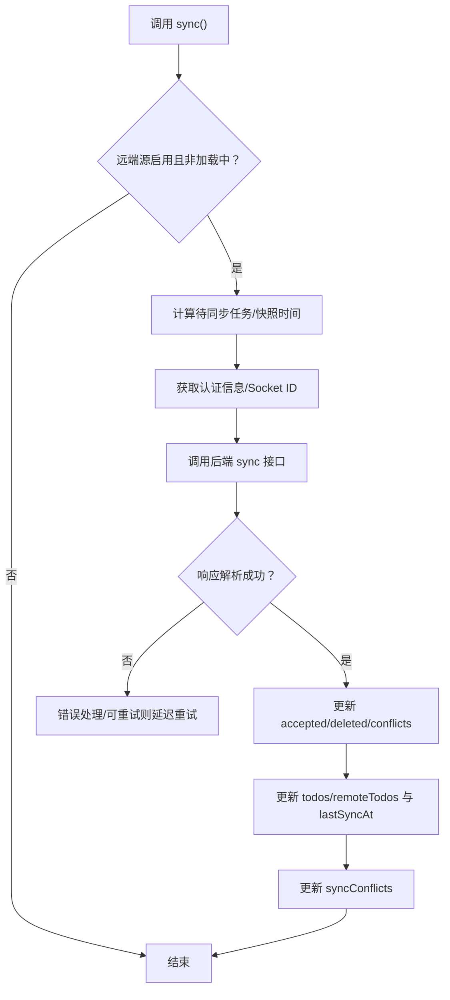
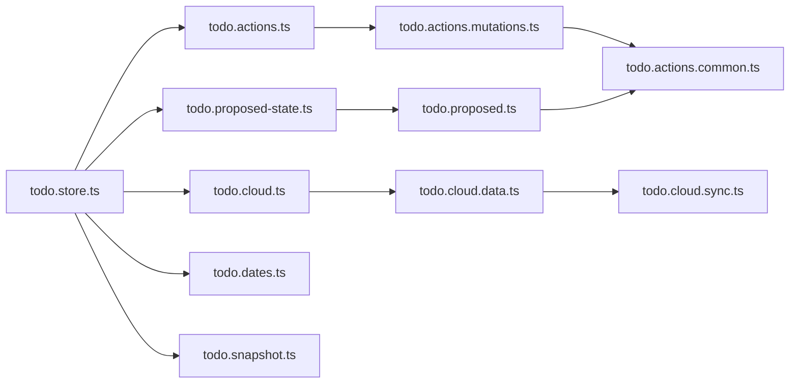

# 任务状态管理

<cite>
**本文引用的文件**
- [apps/frontend/src/features/todo/stores/todo.store.ts](file://apps/frontend/src/features/todo/stores/todo.store.ts)
- [apps/frontend/src/features/todo/stores/todo.types.ts](file://apps/frontend/src/features/todo/stores/todo.types.ts)
- [apps/frontend/src/features/todo/stores/todo.actions.ts](file://apps/frontend/src/features/todo/stores/todo.actions.ts)
- [apps/frontend/src/features/todo/stores/todo.actions.mutations.ts](file://apps/frontend/src/features/todo/stores/todo.actions.mutations.ts)
- [apps/frontend/src/features/todo/stores/todo.proposed-state.ts](file://apps/frontend/src/features/todo/stores/todo.proposed-state.ts)
- [apps/frontend/src/features/todo/stores/todo.proposed.ts](file://apps/frontend/src/features/todo/stores/todo.proposed.ts)
- [apps/frontend/src/features/todo/stores/todo.snapshot.ts](file://apps/frontend/src/features/todo/stores/todo.snapshot.ts)
- [apps/frontend/src/features/todo/stores/todo.dates.ts](file://apps/frontend/src/features/todo/stores/todo.dates.ts)
- [apps/frontend/src/features/todo/stores/todo.cloud.ts](file://apps/frontend/src/features/todo/stores/todo.cloud.ts)
- [apps/frontend/src/features/todo/stores/todo.cloud.data.ts](file://apps/frontend/src/features/todo/stores/todo.cloud.data.ts)
- [apps/frontend/src/features/todo/stores/todo.cloud.sync.ts](file://apps/frontend/src/features/todo/stores/todo.cloud.sync.ts)
- [apps/frontend/src/features/todo/stores/todo.actions.common.ts](file://apps/frontend/src/features/todo/stores/todo.actions.common.ts)
</cite>

## 目录

1. [简介](#简介)
2. [项目结构](#项目结构)
3. [核心组件](#核心组件)
4. [架构总览](#架构总览)
5. [详细组件分析](#详细组件分析)
6. [依赖关系分析](#依赖关系分析)
7. [性能考量](#性能考量)
8. [故障排查指南](#故障排查指南)
9. [结论](#结论)
10. [附录](#附录)

## 简介

本文件围绕 Lumina Todo 的任务状态管理进行系统性技术文档整理，重点覆盖以下方面：

- Pinia Store 设计与状态树结构
- Action 分发机制与模块化组织
- 类型定义与数据模型
- 任务状态生命周期管理
- 快照机制与撤销/重做（提议变更）
- 同步与冲突处理
- 状态持久化策略
- 订阅、异步处理、计算属性、重置机制
- 最佳实践、性能优化与内存泄漏防护
- 与其他 Store 的集成与数据流控制

## 项目结构

Lumina Todo 的前端采用基于功能域的组织方式，任务相关状态集中在 features/todo/stores 下，通过模块化拆分实现高内聚低耦合：

- 核心 Store：todo.store.ts
- 类型定义：todo.types.ts
- 动作聚合器：todo.actions.ts
- 变更动作实现：todo.actions.mutations.ts
- 提议变更与撤销/重做：todo.proposed-state.ts、todo.proposed.ts
- 快照与一致性校验：todo.snapshot.ts、todo.dates.ts
- 云端同步与冲突：todo.cloud.ts、todo.cloud.data.ts、todo.cloud.sync.ts
- 通用工具：todo.actions.common.ts

图表来源

- [apps/frontend/src/features/todo/stores/todo.store.ts:21-368](file://apps/frontend/src/features/todo/stores/todo.store.ts#L21-L368)
- [apps/frontend/src/features/todo/stores/todo.types.ts:1-69](file://apps/frontend/src/features/todo/stores/todo.types.ts#L1-L69)
- [apps/frontend/src/features/todo/stores/todo.actions.ts:1-111](file://apps/frontend/src/features/todo/stores/todo.actions.ts#L1-L111)
- [apps/frontend/src/features/todo/stores/todo.actions.mutations.ts:1-457](file://apps/frontend/src/features/todo/stores/todo.actions.mutations.ts#L1-L457)
- [apps/frontend/src/features/todo/stores/todo.proposed-state.ts:1-79](file://apps/frontend/src/features/todo/stores/todo.proposed-state.ts#L1-L79)
- [apps/frontend/src/features/todo/stores/todo.proposed.ts:1-197](file://apps/frontend/src/features/todo/stores/todo.proposed.ts#L1-L197)
- [apps/frontend/src/features/todo/stores/todo.cloud.ts:1-44](file://apps/frontend/src/features/todo/stores/todo.cloud.ts#L1-L44)
- [apps/frontend/src/features/todo/stores/todo.cloud.data.ts:1-43](file://apps/frontend/src/features/todo/stores/todo.cloud.data.ts#L1-L43)
- [apps/frontend/src/features/todo/stores/todo.cloud.sync.ts:1-187](file://apps/frontend/src/features/todo/stores/todo.cloud.sync.ts#L1-L187)
- [apps/frontend/src/features/todo/stores/todo.snapshot.ts:1-44](file://apps/frontend/src/features/todo/stores/todo.snapshot.ts#L1-L44)
- [apps/frontend/src/features/todo/stores/todo.dates.ts:1-60](file://apps/frontend/src/features/todo/stores/todo.dates.ts#L1-L60)
- [apps/frontend/src/features/todo/stores/todo.actions.common.ts:1-85](file://apps/frontend/src/features/todo/stores/todo.actions.common.ts#L1-L85)

章节来源

- [apps/frontend/src/features/todo/stores/todo.store.ts:1-389](file://apps/frontend/src/features/todo/stores/todo.store.ts#L1-L389)
- [apps/frontend/src/features/todo/stores/todo.types.ts:1-69](file://apps/frontend/src/features/todo/stores/todo.types.ts#L1-L69)

## 核心组件

- 核心 Store（todo.store.ts）：集中定义响应式状态、计算属性、副作用监听、云同步与提议变更管理，并导出完整 API。
- 类型系统（todo.types.ts）：统一 Todo、过滤器、视图模式、数据源、同步冲突与提议变更等类型。
- 动作聚合器（todo.actions.ts）：将获取、变更、UI、AI 等动作按职责拆分并聚合返回。
- 变更动作实现（todo.actions.mutations.ts）：具体业务动作（新增、更新、删除、排序、计划等），负责状态变更与同步标记。
- 提议变更（todo.proposed-state.ts、todo.proposed.ts）：维护提议变更集合、激活集、应用/丢弃/清理提议变更。
- 快照与一致性（todo.snapshot.ts、todo.dates.ts）：提供列表快照对比与日期归一化/克隆，保障持久化与比较稳定性。
- 云同步（todo.cloud.ts、todo.cloud.data.ts、todo.cloud.sync.ts）：封装同步、冲突、监听、回收站等能力，支持防抖与重试。

章节来源

- [apps/frontend/src/features/todo/stores/todo.store.ts:21-368](file://apps/frontend/src/features/todo/stores/todo.store.ts#L21-L368)
- [apps/frontend/src/features/todo/stores/todo.types.ts:3-40](file://apps/frontend/src/features/todo/stores/todo.types.ts#L3-L40)
- [apps/frontend/src/features/todo/stores/todo.actions.ts:8-110](file://apps/frontend/src/features/todo/stores/todo.actions.ts#L8-L110)
- [apps/frontend/src/features/todo/stores/todo.actions.mutations.ts:13-456](file://apps/frontend/src/features/todo/stores/todo.actions.mutations.ts#L13-L456)
- [apps/frontend/src/features/todo/stores/todo.proposed-state.ts:18-78](file://apps/frontend/src/features/todo/stores/todo.proposed-state.ts#L18-L78)
- [apps/frontend/src/features/todo/stores/todo.proposed.ts:11-196](file://apps/frontend/src/features/todo/stores/todo.proposed.ts#L11-L196)
- [apps/frontend/src/features/todo/stores/todo.snapshot.ts:3-43](file://apps/frontend/src/features/todo/stores/todo.snapshot.ts#L3-L43)
- [apps/frontend/src/features/todo/stores/todo.dates.ts:13-59](file://apps/frontend/src/features/todo/stores/todo.dates.ts#L13-L59)
- [apps/frontend/src/features/todo/stores/todo.cloud.ts:6-43](file://apps/frontend/src/features/todo/stores/todo.cloud.ts#L6-L43)
- [apps/frontend/src/features/todo/stores/todo.cloud.data.ts:7-42](file://apps/frontend/src/features/todo/stores/todo.cloud.data.ts#L7-L42)
- [apps/frontend/src/features/todo/stores/todo.cloud.sync.ts:25-186](file://apps/frontend/src/features/todo/stores/todo.cloud.sync.ts#L25-L186)

## 架构总览

下图展示了从 UI 到 Store、再到云端的数据流与控制路径，包括本地/远程数据源切换、提议变更、同步与冲突处理。

图表来源

- [apps/frontend/src/features/todo/stores/todo.store.ts:234-253](file://apps/frontend/src/features/todo/stores/todo.store.ts#L234-L253)
- [apps/frontend/src/features/todo/stores/todo.actions.ts:63-109](file://apps/frontend/src/features/todo/stores/todo.actions.ts#L63-L109)
- [apps/frontend/src/features/todo/stores/todo.actions.mutations.ts:97-151](file://apps/frontend/src/features/todo/stores/todo.actions.mutations.ts#L97-L151)
- [apps/frontend/src/features/todo/stores/todo.cloud.sync.ts:34-154](file://apps/frontend/src/features/todo/stores/todo.cloud.sync.ts#L34-L154)

## 详细组件分析

### 核心 Store（todo.store.ts）

- 状态树
  - 基础状态：todos、filter、viewMode、searchQuery、todoExpansionState、deferredSectionExpandedPreference、loading、isDragging、error、isDrawerOpen、isMaximized、isSilencingToast、isTrashLoaded、todoSource、localTodos、remoteTodos
  - 同步状态：lastSyncAt、syncOwnerId、syncConflicts
  - 提议变更：proposedChangeSets、proposedChangeSetOrder、activeProposedChangeSetId
- 计算属性
  - filteredTodos、isAllExpanded、pendingCount、completedCount、proposedChanges、basePreviewTodos、previewTodos、visualTodos、isRemoteSource
- 副作用与监听
  - 监听 todos：归一化日期、同步展开状态到持久化记录、在非快照应用时持久化当前源的 todos
  - 监听 [todoSource, localTodos, remoteTodos]：根据数据源切换应用快照并恢复展开状态
  - 监听 todoExpansionState：在应用快照期间跳过，否则同步 UI 展开状态
  - 监听 searchQuery：搜索时展开所有项
  - 监听 viewMode：视觉模式下禁止垃圾箱过滤
- 云同步与数据源
  - 通过 createTodoCloud 注入 sync、debouncedSync、mergeOnLogin、冲突处理、监听器初始化等
  - 通过 createTodoSourceManager 实现本地/远程数据源切换与快照应用
- 提议变更
  - 通过 createProposedChangeStateManager 维护提议变更集合与激活集
  - applyProposedChanges 应用提议变更并清理对应集合
- 持久化
  - 使用 Pinia 持久化配置，选择性持久化部分字段到 localStorage

图表来源

- [apps/frontend/src/features/todo/stores/todo.store.ts:21-388](file://apps/frontend/src/features/todo/stores/todo.store.ts#L21-L388)

章节来源

- [apps/frontend/src/features/todo/stores/todo.store.ts:21-388](file://apps/frontend/src/features/todo/stores/todo.store.ts#L21-L388)

### 类型系统（todo.types.ts）

- Todo 扩展字段：完成/延期/删除时间、提醒相关、周期规则与时区、父子关系、展开状态、提议标记、同步状态、专注计数
- 同步冲突：冲突原因枚举、冲突对象结构
- 提议变更：变更类型（新增/更新/删除/切换/置顶）、变更数据结构
- 过滤与视图：FilterType、ViewMode、数据源类型
- 树形可视化数据：TreeData 结构（用于可视化视图）

图表来源

- [apps/frontend/src/features/todo/stores/todo.types.ts:3-30](file://apps/frontend/src/features/todo/stores/todo.types.ts#L3-L30)

章节来源

- [apps/frontend/src/features/todo/stores/todo.types.ts:1-69](file://apps/frontend/src/features/todo/stores/todo.types.ts#L1-L69)

### 动作聚合器（todo.actions.ts）

- 职责拆分
  - 获取动作：todo.actions.fetch.ts
  - 变更动作：todo.actions.mutations.ts
  - UI 动作：todo.actions.ui.ts
  - AI 动作：todo.actions.ai.ts
- 返回聚合后的动作集合，统一暴露给 Store

章节来源

- [apps/frontend/src/features/todo/stores/todo.actions.ts:8-110](file://apps/frontend/src/features/todo/stores/todo.actions.ts#L8-L110)

### 变更动作实现（todo.actions.mutations.ts）

- 关键动作
  - 新增/批量新增：添加到顶部并设置初始状态，触发去抖同步
  - 删除/恢复：递归删除子任务；恢复时必要时先恢复父任务
  - 切换完成/置顶/延期：维护父子级联动与时间戳
  - 排序/移动：检查重复标题、自动取消子任务的延期状态
  - 更新标题/父子关系：重复性校验、联动更新父级完成状态
  - 更新计划：到期日/提醒日/周期规则合法性校验与时区设置
- 父子联动
  - 子任务完成/删除影响父任务完成状态，必要时回溯更新父链
- 同步标记
  - 每次变更设置 syncStatus='pending'，触发去抖同步

图表来源

- [apps/frontend/src/features/todo/stores/todo.actions.mutations.ts:225-263](file://apps/frontend/src/features/todo/stores/todo.actions.mutations.ts#L225-L263)

章节来源

- [apps/frontend/src/features/todo/stores/todo.actions.mutations.ts:13-456](file://apps/frontend/src/features/todo/stores/todo.actions.mutations.ts#L13-L456)

### 提议变更与撤销/重做（todo.proposed-state.ts、todo.proposed.ts）

- 提议变更状态管理
  - 维护变更集合字典、变更顺序数组、激活集 ID
  - 支持设置/追加/清空/丢弃指定或当前激活集
- 预览与应用
  - buildBasePreviewTodos：基于现有 todos 与提议变更生成预览副本
  - applyProposedTodoChanges：按拓扑顺序处理新增，再处理更新/删除/切换/置顶
  - 处理新增依赖关系，映射新旧 ID，保证父子关系正确

图表来源

- [apps/frontend/src/features/todo/stores/todo.proposed-state.ts:18-78](file://apps/frontend/src/features/todo/stores/todo.proposed-state.ts#L18-L78)
- [apps/frontend/src/features/todo/stores/todo.proposed.ts:11-196](file://apps/frontend/src/features/todo/stores/todo.proposed.ts#L11-L196)

章节来源

- [apps/frontend/src/features/todo/stores/todo.proposed-state.ts:1-79](file://apps/frontend/src/features/todo/stores/todo.proposed-state.ts#L1-L79)
- [apps/frontend/src/features/todo/stores/todo.proposed.ts:1-197](file://apps/frontend/src/features/todo/stores/todo.proposed.ts#L1-L197)

### 快照机制与一致性（todo.snapshot.ts、todo.dates.ts）

- 快照对比
  - isSameTodoList：逐项比较 id/title/completed/order/pinned/parentId/version/syncStatus 等关键字段，含多类时间字段的毫秒级比较
- 日期归一化与克隆
  - normalizeTodoDatesInPlace：将字符串/数字/Date 归一化为 Date，避免跨存储/网络传输导致的类型不一致
  - cloneTodo/snapshotTodos：深拷贝以生成稳定快照，用于持久化与一致性校验

章节来源

- [apps/frontend/src/features/todo/stores/todo.snapshot.ts:3-43](file://apps/frontend/src/features/todo/stores/todo.snapshot.ts#L3-L43)
- [apps/frontend/src/features/todo/stores/todo.dates.ts:13-59](file://apps/frontend/src/features/todo/stores/todo.dates.ts#L13-L59)

### 云同步与冲突处理（todo.cloud.ts、todo.cloud.data.ts、todo.cloud.sync.ts）

- 同步入口
  - createTodoCloud -> createTodoCloudData -> 组合同步/冲突/监听/回收站动作
- 同步流程
  - 去抖与冷却：SYNC_COOLDOWN_MS 防止频繁请求
  - 条件触发：仅当远端源启用且未处于加载中时
  - 过滤待同步：syncStatus !== 'synced' 的任务
  - 发送请求：携带待同步任务与 lastSyncAt
  - 处理响应：接受/删除/冲突/服务端时间更新
  - 冲突处理：构建冲突对象并保留至 syncConflicts
  - 重试策略：对可重试错误进行指数退避重试
- 登录合并
  - mergeOnLogin：用户切换时重置状态并触发同步
- 监听与回收站
  - initSocketListener：建立实时监听
  - deleteTodoPermanently/clearTrash：回收站相关操作

图表来源

- [apps/frontend/src/features/todo/stores/todo.cloud.sync.ts:34-154](file://apps/frontend/src/features/todo/stores/todo.cloud.sync.ts#L34-L154)

章节来源

- [apps/frontend/src/features/todo/stores/todo.cloud.ts:6-43](file://apps/frontend/src/features/todo/stores/todo.cloud.ts#L6-L43)
- [apps/frontend/src/features/todo/stores/todo.cloud.data.ts:7-42](file://apps/frontend/src/features/todo/stores/todo.cloud.data.ts#L7-L42)
- [apps/frontend/src/features/todo/stores/todo.cloud.sync.ts:15-186](file://apps/frontend/src/features/todo/stores/todo.cloud.sync.ts#L15-L186)

### 通用工具（todo.actions.common.ts）

- 生成唯一 ID：优先使用 crypto.randomUUID 或 getRandomValues 回退方案
- 映射服务端任务到本地：统一转换日期字段与状态
- 重复性校验：同父级下标题去重（忽略大小写）
- 获取任务路径：沿父链收集标题

章节来源

- [apps/frontend/src/features/todo/stores/todo.actions.common.ts:4-85](file://apps/frontend/src/features/todo/stores/todo.actions.common.ts#L4-L85)

## 依赖关系分析

- 模块内聚
  - todo.store.ts 作为中心枢纽，聚合动作、提议变更、云同步与数据源管理
  - todo.actions.ts 将 fetch/mutations/ui/ai 动作解耦，便于扩展与测试
- 外部依赖
  - Pinia：状态持久化 pick、响应式依赖
  - Axios：同步请求与错误判断
  - Lodash：去抖（debounce）
  - @lumina/shared：共享类型与 API 解包工具
- 循环依赖
  - 通过工厂函数与动态导入（如 auth store）避免循环引用

图表来源

- [apps/frontend/src/features/todo/stores/todo.store.ts:13-20](file://apps/frontend/src/features/todo/stores/todo.store.ts#L13-L20)
- [apps/frontend/src/features/todo/stores/todo.actions.ts:3-6](file://apps/frontend/src/features/todo/stores/todo.actions.ts#L3-L6)
- [apps/frontend/src/features/todo/stores/todo.proposed-state.ts:1-8](file://apps/frontend/src/features/todo/stores/todo.proposed-state.ts#L1-L8)
- [apps/frontend/src/features/todo/stores/todo.cloud.ts:4-5](file://apps/frontend/src/features/todo/stores/todo.cloud.ts#L4-L5)
- [apps/frontend/src/features/todo/stores/todo.cloud.data.ts:2-5](file://apps/frontend/src/features/todo/stores/todo.cloud.data.ts#L2-L5)
- [apps/frontend/src/features/todo/stores/todo.cloud.sync.ts:1-13](file://apps/frontend/src/features/todo/stores/todo.cloud.sync.ts#L1-L13)
- [apps/frontend/src/features/todo/stores/todo.actions.mutations.ts:2-4](file://apps/frontend/src/features/todo/stores/todo.actions.mutations.ts#L2-L4)
- [apps/frontend/src/features/todo/stores/todo.proposed.ts:1-2](file://apps/frontend/src/features/todo/stores/todo.proposed.ts#L1-L2)
- [apps/frontend/src/features/todo/stores/todo.actions.common.ts:1-2](file://apps/frontend/src/features/todo/stores/todo.actions.common.ts#L1-L2)
- [apps/frontend/src/features/todo/stores/todo.dates.ts:1-2](file://apps/frontend/src/features/todo/stores/todo.dates.ts#L1-L2)
- [apps/frontend/src/features/todo/stores/todo.snapshot.ts:1-2](file://apps/frontend/src/features/todo/stores/todo.snapshot.ts#L1-L2)

章节来源

- [apps/frontend/src/features/todo/stores/todo.store.ts:1-389](file://apps/frontend/src/features/todo/stores/todo.store.ts#L1-L389)
- [apps/frontend/src/features/todo/stores/todo.actions.ts:1-111](file://apps/frontend/src/features/todo/stores/todo.actions.ts#L1-L111)
- [apps/frontend/src/features/todo/stores/todo.actions.mutations.ts:1-457](file://apps/frontend/src/features/todo/stores/todo.actions.mutations.ts#L1-L457)
- [apps/frontend/src/features/todo/stores/todo.proposed-state.ts:1-79](file://apps/frontend/src/features/todo/stores/todo.proposed-state.ts#L1-L79)
- [apps/frontend/src/features/todo/stores/todo.proposed.ts:1-197](file://apps/frontend/src/features/todo/stores/todo.proposed.ts#L1-L197)
- [apps/frontend/src/features/todo/stores/todo.cloud.ts:1-44](file://apps/frontend/src/features/todo/stores/todo.cloud.ts#L1-L44)
- [apps/frontend/src/features/todo/stores/todo.cloud.data.ts:1-43](file://apps/frontend/src/features/todo/stores/todo.cloud.data.ts#L1-L43)
- [apps/frontend/src/features/todo/stores/todo.cloud.sync.ts:1-187](file://apps/frontend/src/features/todo/stores/todo.cloud.sync.ts#L1-L187)
- [apps/frontend/src/features/todo/stores/todo.dates.ts:1-60](file://apps/frontend/src/features/todo/stores/todo.dates.ts#L1-L60)
- [apps/frontend/src/features/todo/stores/todo.snapshot.ts:1-44](file://apps/frontend/src/features/todo/stores/todo.snapshot.ts#L1-L44)
- [apps/frontend/src/features/todo/stores/todo.actions.common.ts:1-85](file://apps/frontend/src/features/todo/stores/todo.actions.common.ts#L1-L85)

## 性能考量

- 去抖与冷却
  - 同步去抖：SYNC_COOLDOWN_MS 防止高频变更导致的请求风暴
  - 可重试错误：指数退避，避免雪崩效应
- 计算属性与深度监听
  - 仅在必要时触发深度监听（如 todos），并在应用快照期间跳过持久化
  - 过滤与预览计算基于基础预览，减少重复计算
- 数据归一化
  - 在 todos 变更时统一日期格式，避免比较与持久化差异
- 批量操作
  - 批量新增/删除时一次性设置 syncStatus 并触发去抖同步，降低同步次数

[本节为通用性能建议，无需特定文件来源]

## 故障排查指南

- 同步失败
  - 现象：error='todo.syncFailed'，控制台输出错误
  - 排查：确认网络连通、认证状态、服务端状态码；检查可重试错误与退避策略
  - 参考：[todo.cloud.sync.ts:139-151](file://apps/frontend/src/features/todo/stores/todo.cloud.sync.ts#L139-L151)
- 冲突处理
  - 现象：syncConflicts 中出现冲突项
  - 排查：核对冲突原因（TOMBSTONED/OWNER_MISMATCH/VERSION_CONFLICT），选择接受或重试
  - 参考：[todo.cloud.sync.ts:106-121](file://apps/frontend/src/features/todo/stores/todo.cloud.sync.ts#L106-L121)
- 重复任务
  - 现象：error='todo.duplicate'
  - 排查：检查同父级下标题是否重复，排除自身 ID
  - 参考：[todo.actions.mutations.ts:33-35](file://apps/frontend/src/features/todo/stores/todo.actions.mutations.ts#L33-L35)
- 计划设置异常
  - 现象：error='todo.remindAfterDue'/'todo.recurrenceNeedsDue'
  - 排查：提醒时间不得晚于到期时间；周期规则需配合到期时间
  - 参考：[todo.actions.mutations.ts:390-439](file://apps/frontend/src/features/todo/stores/todo.actions.mutations.ts#L390-L439)
- 展开状态不同步
  - 现象：刷新后展开状态丢失
  - 排查：确认持久化 pick 是否包含 todoExpansionState；检查应用快照期间是否跳过同步
  - 参考：[todo.store.ts:90-134](file://apps/frontend/src/features/todo/stores/todo.store.ts#L90-L134)

章节来源

- [apps/frontend/src/features/todo/stores/todo.cloud.sync.ts:139-151](file://apps/frontend/src/features/todo/stores/todo.cloud.sync.ts#L139-L151)
- [apps/frontend/src/features/todo/stores/todo.actions.mutations.ts:33-35](file://apps/frontend/src/features/todo/stores/todo.actions.mutations.ts#L33-L35)
- [apps/frontend/src/features/todo/stores/todo.actions.mutations.ts:390-439](file://apps/frontend/src/features/todo/stores/todo.actions.mutations.ts#L390-L439)
- [apps/frontend/src/features/todo/stores/todo.store.ts:90-134](file://apps/frontend/src/features/todo/stores/todo.store.ts#L90-L134)

## 结论

Lumina Todo 的任务状态管理通过 Pinia Store 将状态、动作、提议变更与云同步有机结合，形成清晰的职责边界与稳定的运行机制。其特性包括：

- 结构化的类型系统确保数据一致性
- 动作模块化提升可维护性与可测试性
- 提议变更与快照机制支持撤销/重做与预览
- 云同步具备冲突检测、去抖与重试策略
- 持久化策略聚焦关键状态，兼顾性能与体验

[本节为总结性内容，无需特定文件来源]

## 附录

### 状态订阅与使用示例（路径指引）

- 订阅 todos 变化并触发去抖同步
  - [apps/frontend/src/features/todo/stores/todo.store.ts:90-115](file://apps/frontend/src/features/todo/stores/todo.store.ts#L90-L115)
- 计算属性 filteredTodos/previewTodos
  - [apps/frontend/src/features/todo/stores/todo.store.ts:47-49](file://apps/frontend/src/features/todo/stores/todo.store.ts#L47-L49)
  - [apps/frontend/src/features/todo/stores/todo.store.ts:173-179](file://apps/frontend/src/features/todo/stores/todo.store.ts#L173-L179)
- 异步 action：新增任务
  - [apps/frontend/src/features/todo/stores/todo.actions.mutations.ts:97-151](file://apps/frontend/src/features/todo/stores/todo.actions.mutations.ts#L97-L151)
- computed 属性：pendingCount/completedCount
  - [apps/frontend/src/features/todo/stores/todo.store.ts:153-163](file://apps/frontend/src/features/todo/stores/todo.store.ts#L153-L163)
- 状态重置：clearRemoteOnLogout/resetSyncStatus
  - [apps/frontend/src/features/todo/stores/todo.store.ts:290-299](file://apps/frontend/src/features/todo/stores/todo.store.ts#L290-L299)
  - [apps/frontend/src/features/todo/stores/todo.cloud.sync.ts:175-177](file://apps/frontend/src/features/todo/stores/todo.cloud.sync.ts#L175-L177)

### 最佳实践与内存防护

- 动作粒度：将复杂业务拆分为多个小动作，便于单元测试与复用
- 去抖与节流：对网络请求与重排等昂贵操作使用去抖/节流
- 计算属性缓存：利用 computed 缓存中间态，避免重复计算
- 内存防护：及时清理监听器与定时器；在组件卸载时停止去抖回调
- 类型约束：严格使用 todo.types.ts 中的类型，避免隐式类型转换

[本节为通用最佳实践，无需特定文件来源]
