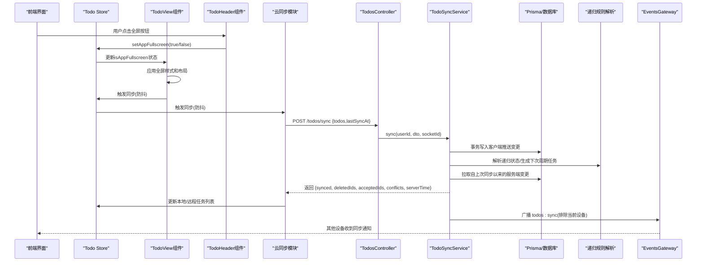
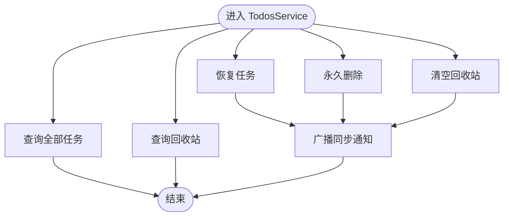
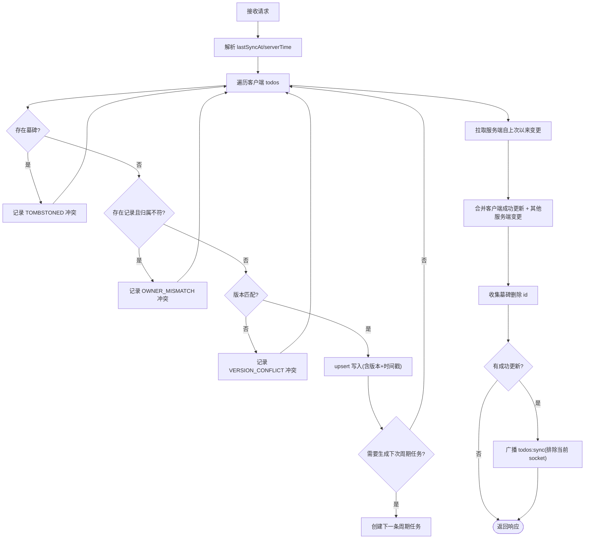
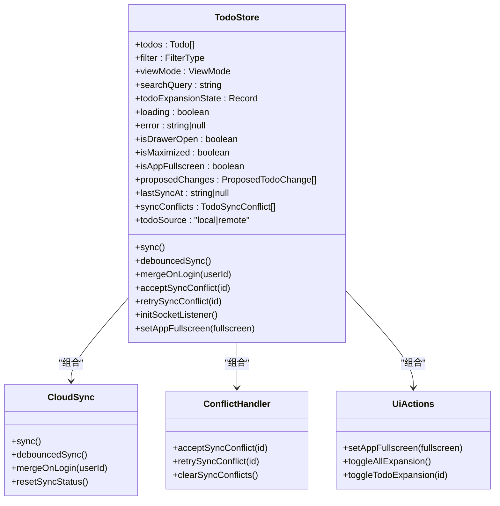
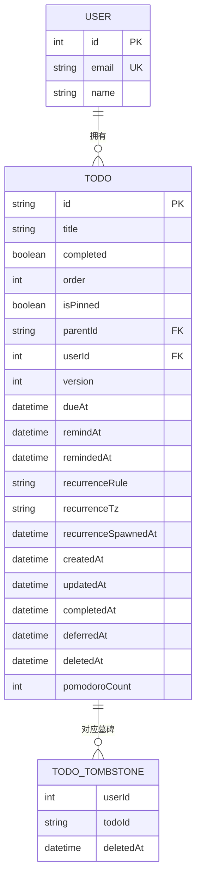
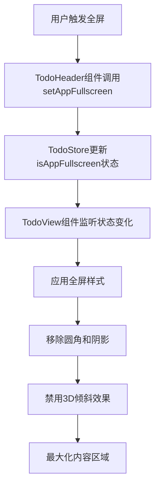
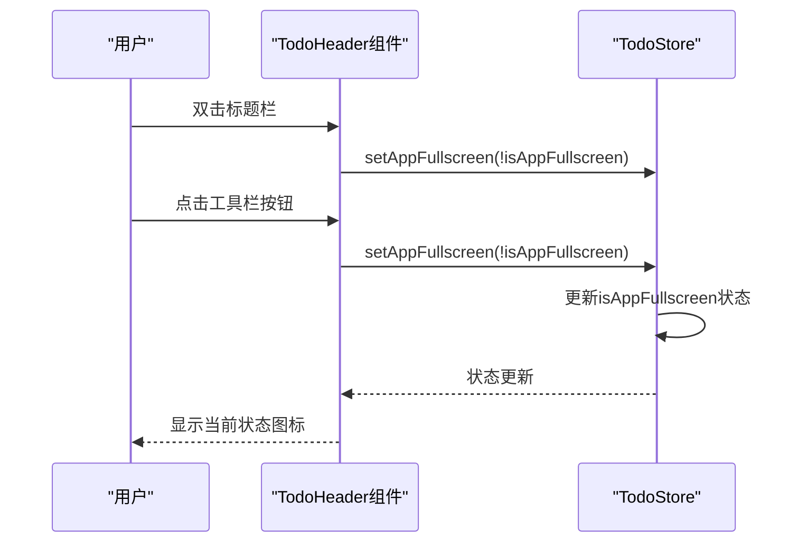
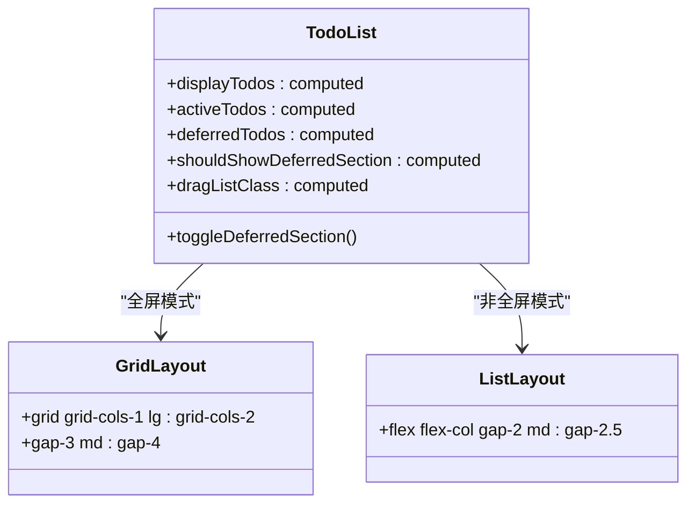
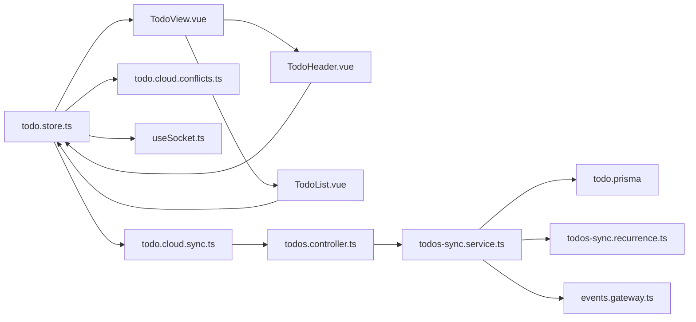

# 任务管理系统

<cite>
**本文引用的文件**
- [apps/backend/src/todos/todos.service.ts](file://apps/backend/src/todos/todos.service.ts)
- [apps/backend/src/todos/todos.controller.ts](file://apps/backend/src/todos/todos.controller.ts)
- [apps/backend/src/todos/todos.dto.ts](file://apps/backend/src/todos/todos.dto.ts)
- [apps/backend/src/todos/todos-sync.service.ts](file://apps/backend/src/todos/todos-sync.service.ts)
- [apps/backend/src/todos/todos-sync.recurrence.ts](file://apps/backend/src/todos/todos-sync.recurrence.ts)
- [apps/backend/src/events/events.gateway.ts](file://apps/backend/src/events/events.gateway.ts)
- [apps/backend/prisma/schema/todo.prisma](file://apps/backend/prisma/schema/todo.prisma)
- [packages/shared/src/schemas/todo.schema.ts](file://packages/shared/src/schemas/todo.schema.ts)
- [apps/frontend/src/features/todo/stores/todo.store.ts](file://apps/frontend/src/features/todo/stores/todo.store.ts)
- [apps/frontend/src/features/todo/stores/todo.cloud.ts](file://apps/frontend/src/features/todo/stores/todo.cloud.ts)
- [apps/frontend/src/features/todo/stores/todo.cloud.sync.ts](file://apps/frontend/src/features/todo/stores/todo.cloud.sync.ts)
- [apps/frontend/src/features/todo/stores/todo.cloud.conflicts.ts](file://apps/frontend/src/features/todo/stores/todo.cloud.conflicts.ts)
- [apps/frontend/src/features/todo/stores/todo.types.ts](file://apps/frontend/src/features/todo/stores/todo.types.ts)
- [apps/frontend/src/features/todo/stores/todo.actions.ui.ts](file://apps/frontend/src/features/todo/stores/todo.actions.ui.ts)
- [apps/frontend/src/features/todo/stores/todo.actions.ts](file://apps/frontend/src/features/todo/stores/todo.actions.ts)
- [apps/frontend/src/features/todo/composables/useTodo.ts](file://apps/frontend/src/features/todo/composables/useTodo.ts)
- [apps/frontend/src/composables/useSocket.ts](file://apps/frontend/src/composables/useSocket.ts)
- [apps/frontend/src/features/todo/TodoView.vue](file://apps/frontend/src/features/todo/TodoView.vue)
- [apps/frontend/src/features/todo/components/TodoHeader.vue](file://apps/frontend/src/features/todo/components/TodoHeader.vue)
- [apps/frontend/src/features/todo/components/TodoList.vue](file://apps/frontend/src/features/todo/components/TodoList.vue)
- [apps/frontend/src/features/todo/components/TodoItem.vue](file://apps/frontend/src/features/todo/components/TodoItem.vue)
</cite>

## 更新摘要

**所做更改**

- 新增全屏模式支持章节，详细说明TodoView组件的isAppFullscreen状态管理
- 更新TodoHeader组件集成全屏控制功能的实现细节
- 增强TodoList组件在全屏模式下的视觉优化和布局调整
- 添加全屏模式下的交互行为和用户体验改进

## 目录

1. [简介](#简介)
2. [项目结构](#项目结构)
3. [核心组件](#核心组件)
4. [架构总览](#架构总览)
5. [详细组件分析](#详细组件分析)
6. [全屏模式支持](#全屏模式支持)
7. [依赖关系分析](#依赖关系分析)
8. [性能考量](#性能考量)
9. [故障排查指南](#故障排查指南)
10. [结论](#结论)
11. [附录](#附录)

## 简介

本文件为 Lumina Todo 的任务管理系统提供系统化技术文档，覆盖任务 CRUD、任务同步机制、多设备一致性、回收站管理、前端状态管理与组件交互、任务模型与数据库 Schema、API 接口规范、实时通信集成及性能优化策略。特别关注最新的UI增强功能，包括全屏模式支持、TodoView组件的状态管理、TodoHeader组件的全屏控制集成以及TodoList组件的视觉优化。

## 项目结构

- 后端采用 NestJS 架构，任务相关模块位于 apps/backend/src/todos，包含控制器、服务、DTO、同步服务与递归规则解析。
- 数据库使用 Prisma，任务表与墓碑表定义于 apps/backend/prisma/schema/todo.prisma。
- 前端使用 Vue 3 + Pinia，任务状态集中于 apps/frontend/src/features/todo/stores/todo.store.ts，云同步、冲突处理、Socket 监听等能力由独立模块组合。
- 共享类型与校验基于 packages/shared/src/schemas/todo.schema.ts，确保前后端一致的数据契约。
- **新增**：全屏模式支持通过TodoView组件的isAppFullscreen状态管理，集成到TodoHeader组件的控制面板中。

```mermaid
graph TB
subgraph "前端"
FE_Store["Pinia Todo Store<br/>todo.store.ts"]
FE_Sync["云同步模块<br/>todo.cloud.sync.ts"]
FE_Conf["冲突处理模块<br/>todo.cloud.conflicts.ts"]
FE_Socket["Socket 封装<br/>useSocket.ts"]
FE_Composable["业务组合函数<br/>useTodo.ts"]
FE_View["TodoView组件<br/>全屏模式支持"]
FE_Header["TodoHeader组件<br/>全屏控制集成"]
FE_List["TodoList组件<br/>视觉优化"]
end
subgraph "后端"
BE_Controller["TodosController<br/>todos.controller.ts"]
BE_Service["TodosService<br/>todos.service.ts"]
BE_Sync["TodoSyncService<br/>todos-sync.service.ts"]
BE_Rec["递归规则解析<br/>todos-sync.recurrence.ts"]
BE_DB["Prisma Schema<br/>todo.prisma"]
BE_WS["EventsGateway<br/>events.gateway.ts"]
end
FE_Store --> FE_Sync
FE_Store --> FE_Conf
FE_Store --> FE_Socket
FE_Store --> FE_Composable
FE_View --> FE_Store
FE_Header --> FE_Store
FE_List --> FE_Store
FE_Sync --> BE_Controller
BE_Controller --> BE_Service
BE_Controller --> BE_Sync
BE_Sync --> BE_DB
BE_Service --> BE_DB
BE_Sync --> BE_Rec
BE_WS <- --> FE_Socket
```

**图表来源**

- [apps/frontend/src/features/todo/stores/todo.store.ts:1-389](file://apps/frontend/src/features/todo/stores/todo.store.ts#L1-L389)
- [apps/frontend/src/features/todo/stores/todo.cloud.sync.ts:1-187](file://apps/frontend/src/features/todo/stores/todo.cloud.sync.ts#L1-L187)
- [apps/frontend/src/features/todo/stores/todo.cloud.conflicts.ts:1-91](file://apps/frontend/src/features/todo/stores/todo.cloud.conflicts.ts#L1-L91)
- [apps/frontend/src/composables/useSocket.ts:1-191](file://apps/frontend/src/composables/useSocket.ts#L1-L191)
- [apps/frontend/src/features/todo/TodoView.vue:1-549](file://apps/frontend/src/features/todo/TodoView.vue#L1-L549)
- [apps/frontend/src/features/todo/components/TodoHeader.vue:1-474](file://apps/frontend/src/features/todo/components/TodoHeader.vue#L1-L474)
- [apps/frontend/src/features/todo/components/TodoList.vue:1-323](file://apps/frontend/src/features/todo/components/TodoList.vue#L1-L323)

**章节来源**

- [apps/frontend/src/features/todo/stores/todo.store.ts:1-389](file://apps/frontend/src/features/todo/stores/todo.store.ts#L1-L389)
- [apps/backend/src/todos/todos.controller.ts:1-70](file://apps/backend/src/todos/todos.controller.ts#L1-L70)

## 核心组件

- 后端 TodosService：提供任务查询、回收站查询、恢复、永久删除、清空回收站等 CRUD 能力，并在关键操作后触发同步广播。
- 后端 TodoSyncService：实现"离线优先"的增量同步与合并，包含冲突检测（墓碑、所有权、版本冲突）、服务端变更拉取、递归任务生成。
- 前端 Todo Store：集中管理本地/远程任务源、过滤与排序、搜索、展开状态持久化、提议变更集、同步状态与冲突集合，**新增**全屏模式状态管理。
- 实时通信 EventsGateway：基于 Socket.IO 的用户房间广播，用于多设备间同步通知。
- 数据模型与 DTO：共享 Schema 定义任务字段、同步请求/响应与冲突类型；Prisma Schema 定义数据库表结构与索引。

**章节来源**

- [apps/backend/src/todos/todos.service.ts:28-147](file://apps/backend/src/todos/todos.service.ts#L28-L147)
- [apps/backend/src/todos/todos-sync.service.ts:42-226](file://apps/backend/src/todos/todos-sync.service.ts#L42-L226)
- [apps/frontend/src/features/todo/stores/todo.store.ts:21-389](file://apps/frontend/src/features/todo/stores/todo.store.ts#L21-L389)
- [apps/backend/src/events/events.gateway.ts:57-266](file://apps/backend/src/events/events.gateway.ts#L57-L266)
- [packages/shared/src/schemas/todo.schema.ts:1-76](file://packages/shared/src/schemas/todo.schema.ts#L1-L76)
- [apps/backend/prisma/schema/todo.prisma:1-40](file://apps/backend/prisma/schema/todo.prisma#L1-L40)

## 架构总览

下图展示了从前端到后端再到数据库与实时通信的整体流程，重点体现"离线优先"的同步策略与多设备一致性保障，以及全屏模式的用户体验优化。



**图表来源**

- [apps/frontend/src/features/todo/components/TodoHeader.vue:94-99](file://apps/frontend/src/features/todo/components/TodoHeader.vue#L94-L99)
- [apps/frontend/src/features/todo/stores/todo.actions.ui.ts:45-47](file://apps/frontend/src/features/todo/stores/todo.actions.ui.ts#L45-L47)
- [apps/frontend/src/features/todo/TodoView.vue:90-97](file://apps/frontend/src/features/todo/TodoView.vue#L90-L97)
- [apps/frontend/src/features/todo/stores/todo.cloud.sync.ts:34-154](file://apps/frontend/src/features/todo/stores/todo.cloud.sync.ts#L34-L154)
- [apps/backend/src/todos/todos.controller.ts:30-38](file://apps/backend/src/todos/todos.controller.ts#L30-L38)
- [apps/backend/src/todos/todos-sync.service.ts:52-224](file://apps/backend/src/todos/todos-sync.service.ts#L52-L224)
- [apps/backend/src/todos/todos-sync.recurrence.ts:87-151](file://apps/backend/src/todos/todos-sync.recurrence.ts#L87-L151)
- [apps/backend/src/events/events.gateway.ts:180-202](file://apps/backend/src/events/events.gateway.ts#L180-L202)

## 详细组件分析

### 后端 TodosService（回收站与基础 CRUD）

- 查询全部任务：按是否置顶、顺序、创建时间排序，排除已删除项。
- 回收站查询：仅返回 deletedAt 非空的任务，按删除时间倒序。
- 恢复任务：将 deletedAt 清空并版本号递增，随后广播同步通知。
- 永久删除：事务写入墓碑表（去重 upsert），再删除任务记录，最后广播。
- 清空回收站：批量写入墓碑，再删除对应任务，最后广播。



**图表来源**

- [apps/backend/src/todos/todos.service.ts:38-145](file://apps/backend/src/todos/todos.service.ts#L38-L145)
- [apps/backend/src/events/events.gateway.ts:180-202](file://apps/backend/src/events/events.gateway.ts#L180-L202)

**章节来源**

- [apps/backend/src/todos/todos.service.ts:28-147](file://apps/backend/src/todos/todos.service.ts#L28-L147)

### 后端 TodoSyncService（离线优先同步与合并）

- 输入：客户端推送的 todos 数组与 lastSyncAt 时间戳。
- 冲突检测：
  - 墓碑冲突：若该 id 对应墓碑存在则标记冲突。
  - 所有权冲突：现有记录属于其他用户。
  - 版本冲突：严格比较 client/server version，不一致则冲突。
- 事务写入：对每个推送项执行 upsert，维护版本号与时间戳。
- 递归处理：根据完成状态、规则与时区计算下次周期任务并插入。
- 拉取变更：按 lastSyncAt 与用户维度查询服务端变更，过滤掉已成功更新的 id。
- 广播通知：对本次成功更新的变更进行去抖广播，通知其他设备。



**图表来源**

- [apps/backend/src/todos/todos-sync.service.ts:52-224](file://apps/backend/src/todos/todos-sync.service.ts#L52-L224)
- [apps/backend/src/todos/todos-sync.recurrence.ts:87-151](file://apps/backend/src/todos/todos-sync.recurrence.ts#L87-L151)
- [apps/backend/src/events/events.gateway.ts:180-202](file://apps/backend/src/events/events.gateway.ts#L180-L202)

**章节来源**

- [apps/backend/src/todos/todos-sync.service.ts:42-226](file://apps/backend/src/todos/todos-sync.service.ts#L42-L226)
- [apps/backend/src/todos/todos-sync.recurrence.ts:1-210](file://apps/backend/src/todos/todos-sync.recurrence.ts#L1-L210)

### 前端 Todo Store（状态管理与云同步）

- 数据源：支持本地与远程两种数据源，通过 todoSource 切换；本地持久化于 localStorage。
- 过滤与排序：基于 filter、searchQuery、视图模式与展开状态计算。
- 提议变更集：支持暂存一组变更，预览后再应用，避免即时副作用。
- 同步状态：每条任务维护 syncStatus（synced/pending/error），用于 UI 反馈与冲突识别。
- **新增** 全屏模式状态：isAppFullscreen 状态管理，支持全屏/非全屏切换。
- 云同步：将本地"待同步"任务打包为共享 Todo 结构，调用后端 /todos/sync；解析返回的 synced/deletedIds/conflicts，更新本地/远程列表并记录冲突。
- 冲突处理：支持接受服务端快照、重试版本冲突（提升本地版本号后重新同步）。
- Socket 监听：初始化后加入 user:userId 房间，接收 todos:sync 事件后触发同步。



**图表来源**

- [apps/frontend/src/features/todo/stores/todo.store.ts:21-389](file://apps/frontend/src/features/todo/stores/todo.store.ts#L21-L389)
- [apps/frontend/src/features/todo/stores/todo.cloud.sync.ts:25-186](file://apps/frontend/src/features/todo/stores/todo.cloud.sync.ts#L25-L186)
- [apps/frontend/src/features/todo/stores/todo.cloud.conflicts.ts:21-90](file://apps/frontend/src/features/todo/stores/todo.cloud.conflicts.ts#L21-L90)
- [apps/frontend/src/features/todo/stores/todo.actions.ui.ts:22-117](file://apps/frontend/src/features/todo/stores/todo.actions.ui.ts#L22-L117)

**章节来源**

- [apps/frontend/src/features/todo/stores/todo.store.ts:1-389](file://apps/frontend/src/features/todo/stores/todo.store.ts#L1-L389)
- [apps/frontend/src/features/todo/stores/todo.cloud.sync.ts:1-187](file://apps/frontend/src/features/todo/stores/todo.cloud.sync.ts#L1-L187)
- [apps/frontend/src/features/todo/stores/todo.cloud.conflicts.ts:1-91](file://apps/frontend/src/features/todo/stores/todo.cloud.conflicts.ts#L1-L91)

### 任务模型设计与数据库 Schema

- 任务字段：id、title、completed、order、isPinned、parentId、version、dueAt、remindAt、remindedAt、recurrenceRule、recurrenceTz、recurrenceSpawnedAt、createdAt、updatedAt、completedAt、deferredAt、deletedAt、pomodoroCount。
- 索引：用户维度 + 更新时间、提醒时间、到期时间索引，以及 deletedAt 索引，优化查询与提醒扫描。
- 墓碑表：记录用户与任务的删除时间，作为服务端删除标识，避免误删与重复删除。



**图表来源**

- [apps/backend/prisma/schema/todo.prisma:1-40](file://apps/backend/prisma/schema/todo.prisma#L1-L40)

**章节来源**

- [apps/backend/prisma/schema/todo.prisma:1-40](file://apps/backend/prisma/schema/todo.prisma#L1-L40)
- [packages/shared/src/schemas/todo.schema.ts:8-28](file://packages/shared/src/schemas/todo.schema.ts#L8-L28)

### API 接口规范

- 认证：JWT Bearer，受保护路由。
- 同步接口
  - 方法：POST /todos/sync
  - 请求体：todos（数组，每项为 Todo）、lastSyncAt（可选，服务端将裁剪到 serverTime）
  - 响应：synced（合并后的任务列表）、deletedIds（服务端删除的 id）、acceptedIds（客户端推送被接受的 id）、conflicts（冲突列表）、serverTime（服务端时间）
- 查询接口
  - GET /todos：返回当前用户所有未删除任务
  - GET /todos/trash：返回回收站任务
- 回收站操作
  - POST /todos/:id/restore：恢复任务
  - DELETE /todos/:id/permanent：永久删除
  - DELETE /todos/trash/clear：清空回收站

**章节来源**

- [apps/backend/src/todos/todos.controller.ts:30-68](file://apps/backend/src/todos/todos.controller.ts#L30-L68)
- [apps/backend/src/todos/todos.dto.ts:1-5](file://apps/backend/src/todos/todos.dto.ts#L1-L5)
- [packages/shared/src/schemas/todo.schema.ts:40-68](file://packages/shared/src/schemas/todo.schema.ts#L40-L68)

### 常见使用场景与代码示例路径

- 批量操作（批量同步/合并）
  - 前端：将本地待同步任务集合转换为共享 Todo 结构，调用 todoApi.sync，解析返回并更新本地/远程列表。
  - 后端：TodoSyncService 遍历 todos，逐条 upsert 并生成递归任务，最后合并服务端变更。
  - 示例路径：
    - [apps/frontend/src/features/todo/stores/todo.cloud.sync.ts:58-104](file://apps/frontend/src/features/todo/stores/todo.cloud.sync.ts#L58-L104)
    - [apps/backend/src/todos/todos-sync.service.ts:149-177](file://apps/backend/src/todos/todos-sync.service.ts#L149-L177)
- 任务分类与优先级
  - 分类：通过 filter（pending/completed/trash）与 parentId 维护树形结构。
  - 优先级：通过 isPinned 与 order 控制排序。
  - 示例路径：
    - [apps/frontend/src/features/todo/stores/todo.store.ts:47-49](file://apps/frontend/src/features/todo/stores/todo.store.ts#L47-L49)
    - [apps/backend/src/todos/todos.service.ts:39-46](file://apps/backend/src/todos/todos.service.ts#L39-L46)
- 优先级设置与排序
  - 前端：通过 actions 设置 isPinned 与 order，触发 debouncedSync。
  - 后端：排序依据 isPinned desc、order asc、createdAt desc。
  - 示例路径：
    - [apps/frontend/src/features/todo/stores/todo.store.ts:234-253](file://apps/frontend/src/features/todo/stores/todo.store.ts#L234-L253)
    - [apps/backend/src/todos/todos.service.ts:39-46](file://apps/backend/src/todos/todos.service.ts#L39-L46)
- 递归任务（周期性任务）
  - 解析规则：DAILY/WEEKDAYS/WEEKLY/MONTHLY，支持时区规范化与下周到期时间计算。
  - 生成策略：当完成且无子任务时，根据规则与时区生成下一条任务。
  - 示例路径：
    - [apps/backend/src/todos/todos-sync.recurrence.ts:87-151](file://apps/backend/src/todos/todos-sync.recurrence.ts#L87-L151)
    - [apps/backend/src/todos/todos-sync.service.ts:163-176](file://apps/backend/src/todos/todos-sync.service.ts#L163-176)

## 全屏模式支持

### TodoView组件的全屏状态管理

TodoView组件是全屏模式的核心实现，通过isAppFullscreen状态控制整个应用的布局和视觉效果：

- **布局调整**：当isAppFullscreen为true时，应用最大宽度限制为none，高度设置为screen，移除圆角和阴影效果。
- **玻璃效果优化**：全屏模式下移除玻璃边缘高光，提供更纯净的视觉体验。
- **鼠标悬停效果**：全屏模式下禁用3D倾斜效果，避免干扰专注模式。
- **状态监听**：监听isAppFullscreen状态变化，自动重置3D倾斜动画。



**图表来源**

- [apps/frontend/src/features/todo/TodoView.vue:90-97](file://apps/frontend/src/features/todo/TodoView.vue#L90-L97)
- [apps/frontend/src/features/todo/TodoView.vue:324-346](file://apps/frontend/src/features/todo/TodoView.vue#L324-L346)
- [apps/frontend/src/features/todo/components/TodoHeader.vue:94-99](file://apps/frontend/src/features/todo/components/TodoHeader.vue#L94-L99)

### TodoHeader组件的全屏控制集成

TodoHeader组件提供了双重全屏控制入口：

- **双击标题栏**：在Wails环境下支持双击标题栏切换全屏状态。
- **工具栏按钮**：桌面端提供独立的全屏切换按钮，显示当前状态（最大化/最小化）。
- **移动端适配**：移动设备通过下拉菜单提供全屏切换选项。



**图表来源**

- [apps/frontend/src/features/todo/components/TodoHeader.vue:94-99](file://apps/frontend/src/features/todo/components/TodoHeader.vue#L94-L99)
- [apps/frontend/src/features/todo/components/TodoHeader.vue:250-260](file://apps/frontend/src/features/todo/components/TodoHeader.vue#L250-L260)
- [apps/frontend/src/features/todo/components/TodoHeader.vue:285-302](file://apps/frontend/src/features/todo/components/TodoHeader.vue#L285-L302)

### TodoList组件的视觉优化

TodoList组件在全屏模式下进行了专门的视觉优化：

- **网格布局**：全屏模式下切换为网格布局（grid），支持1列到2列自适应。
- **间距调整**：减少列表项之间的间距，提高信息密度。
- **滚动优化**：保持垂直滚动特性，确保长列表的流畅体验。
- **响应式设计**：根据屏幕尺寸自动调整列数和间距。



**图表来源**

- [apps/frontend/src/features/todo/components/TodoList.vue:143-147](file://apps/frontend/src/features/todo/components/TodoList.vue#L143-L147)
- [apps/frontend/src/features/todo/components/TodoList.vue:189-210](file://apps/frontend/src/features/todo/components/TodoList.vue#L189-L210)

**章节来源**

- [apps/frontend/src/features/todo/TodoView.vue:1-549](file://apps/frontend/src/features/todo/TodoView.vue#L1-L549)
- [apps/frontend/src/features/todo/components/TodoHeader.vue:1-474](file://apps/frontend/src/features/todo/components/TodoHeader.vue#L1-L474)
- [apps/frontend/src/features/todo/components/TodoList.vue:1-323](file://apps/frontend/src/features/todo/components/TodoList.vue#L1-L323)

## 依赖关系分析

- 前端依赖
  - Pinia Store 管理状态与动作，组合云同步与冲突处理模块。
  - Socket 封装负责连接、鉴权、房间加入与事件监听。
  - 共享 Schema 保证前后端数据结构一致。
  - **新增**：全屏模式依赖TodoView、TodoHeader、TodoList组件的协作。
- 后端依赖
  - Prisma 提供类型安全的数据库访问与事务。
  - EventsGateway 提供用户房间广播，实现多设备同步通知。
  - 递归解析模块独立于同步服务，便于测试与复用。



**图表来源**

- [apps/frontend/src/features/todo/stores/todo.store.ts:1-389](file://apps/frontend/src/features/todo/stores/todo.store.ts#L1-L389)
- [apps/frontend/src/features/todo/stores/todo.cloud.sync.ts:1-187](file://apps/frontend/src/features/todo/stores/todo.cloud.sync.ts#L1-L187)
- [apps/frontend/src/features/todo/stores/todo.cloud.conflicts.ts:1-91](file://apps/frontend/src/features/todo/stores/todo.cloud.conflicts.ts#L1-L91)
- [apps/frontend/src/composables/useSocket.ts:1-191](file://apps/frontend/src/composables/useSocket.ts#L1-L191)
- [apps/frontend/src/features/todo/TodoView.vue:1-549](file://apps/frontend/src/features/todo/TodoView.vue#L1-L549)
- [apps/frontend/src/features/todo/components/TodoHeader.vue:1-474](file://apps/frontend/src/features/todo/components/TodoHeader.vue#L1-L474)
- [apps/frontend/src/features/todo/components/TodoList.vue:1-323](file://apps/frontend/src/features/todo/components/TodoList.vue#L1-L323)
- [apps/backend/src/todos/todos.controller.ts:1-70](file://apps/backend/src/todos/todos.controller.ts#L1-L70)
- [apps/backend/src/todos/todos-sync.service.ts:1-226](file://apps/backend/src/todos/todos-sync.service.ts#L1-L226)
- [apps/backend/src/todos/todos-sync.recurrence.ts:1-210](file://apps/backend/src/todos/todos-sync.recurrence.ts#L1-L210)
- [apps/backend/prisma/schema/todo.prisma:1-40](file://apps/backend/prisma/schema/todo.prisma#L1-L40)
- [apps/backend/src/events/events.gateway.ts:1-266](file://apps/backend/src/events/events.gateway.ts#L1-L266)

## 性能考量

- 数据库层面
  - 为用户维度 + 时间字段建立复合索引，减少查询与提醒扫描成本。
  - 使用事务批量写入墓碑与删除任务，降低锁竞争与不一致风险。
- 后端层面
  - 同步过程使用事务保证原子性，避免部分更新导致的脏数据。
  - 服务端对 lastSyncAt 进行边界裁剪，避免客户端时钟漂移影响。
  - 广播采用 500ms 防抖，减少频繁广播带来的网络与 CPU 开销。
- 前端层面
  - 同步冷却与防抖：SYNC_COOLDOWN_MS 与 lodash debounce，避免高频变更导致的重复请求。
  - 本地持久化：Pinia 持久化关键状态，减少刷新丢失。
  - 冲突最小化：版本严格匹配，减少不必要的回滚与重试。
  - **新增** 全屏模式优化：禁用3D效果和复杂动画，提升专注模式下的性能表现。

**章节来源**

- [apps/backend/prisma/schema/todo.prisma:24-28](file://apps/backend/prisma/schema/todo.prisma#L24-L28)
- [apps/backend/src/todos/todos-sync.service.ts:56-60](file://apps/backend/src/todos/todos-sync.service.ts#L56-L60)
- [apps/backend/src/events/events.gateway.ts:180-202](file://apps/backend/src/events/events.gateway.ts#L180-L202)
- [apps/frontend/src/features/todo/stores/todo.cloud.sync.ts:15-156](file://apps/frontend/src/features/todo/stores/todo.cloud.sync.ts#L15-L156)

## 故障排查指南

- 版本冲突（VERSION_CONFLICT）
  - 现象：本地版本与服务端不一致，同步返回冲突。
  - 处理：前端将本地草稿克隆为新版本，提升 version 后重试同步。
  - 示例路径：
    - [apps/frontend/src/features/todo/stores/todo.cloud.conflicts.ts:60-83](file://apps/frontend/src/features/todo/stores/todo.cloud.conflicts.ts#L60-L83)
- 墓碑冲突（TOMBSTONED）
  - 现象：目标任务已被服务端删除。
  - 处理：前端从本地列表移除该任务并清理冲突。
  - 示例路径：
    - [apps/frontend/src/features/todo/stores/todo.cloud.conflicts.ts:33-41](file://apps/frontend/src/features/todo/stores/todo.cloud.conflicts.ts#L33-L41)
- 所有权冲突（OWNER_MISMATCH）
  - 现象：尝试更新不属于当前用户的任务。
  - 处理：从本地移除并清理冲突。
  - 示例路径：
    - [apps/frontend/src/features/todo/stores/todo.cloud.conflicts.ts:37-41](file://apps/frontend/src/features/todo/stores/todo.cloud.conflicts.ts#L37-L41)
- Socket 连接问题
  - 现象：连接失败或鉴权异常。
  - 处理：useSocket 自动刷新令牌并重连；日志冷却避免刷屏。
  - 示例路径：
    - [apps/frontend/src/composables/useSocket.ts:93-108](file://apps/frontend/src/composables/useSocket.ts#L93-L108)
- **新增** 全屏模式问题
  - 现象：全屏切换后布局异常或动画卡顿。
  - 处理：检查isAppFullscreen状态更新、CSS类名应用、3D效果禁用逻辑。
  - 示例路径：
    - [apps/frontend/src/features/todo/TodoView.vue:90-97](file://apps/frontend/src/features/todo/TodoView.vue#L90-L97)
    - [apps/frontend/src/features/todo/components/TodoHeader.vue:94-99](file://apps/frontend/src/features/todo/components/TodoHeader.vue#L94-L99)

**章节来源**

- [apps/frontend/src/features/todo/stores/todo.cloud.conflicts.ts:1-91](file://apps/frontend/src/features/todo/stores/todo.cloud.conflicts.ts#L1-L91)
- [apps/frontend/src/composables/useSocket.ts:1-191](file://apps/frontend/src/composables/useSocket.ts#L1-L191)

## 结论

Lumina Todo 的任务系统通过"离线优先"的同步策略、严格的版本控制与墓碑机制、以及 Socket 房间广播，实现了跨设备的一致性与可靠性。**最新更新**的全屏模式支持进一步提升了用户体验，通过TodoView组件的状态管理、TodoHeader组件的控制集成以及TodoList组件的视觉优化，为用户提供了专注的工作环境。前端以 Pinia 为核心统一状态与动作，后端以事务与索引保障性能与正确性。递归任务与提醒机制进一步增强了任务生命周期管理能力。建议在生产环境中持续监控同步冲突率与 Socket 连接稳定性，并结合业务增长逐步扩展缓存与分页策略。

## 附录

- 任务 CRUD 与回收站操作
  - 前端入口：useTodo 组合函数封装常用交互。
  - 后端入口：TodosController 提供 REST 接口。
  - 示例路径：
    - [apps/frontend/src/features/todo/composables/useTodo.ts:52-122](file://apps/frontend/src/features/todo/composables/useTodo.ts#L52-L122)
    - [apps/backend/src/todos/todos.controller.ts:40-68](file://apps/backend/src/todos/todos.controller.ts#L40-L68)
- 任务模型与类型
  - 共享类型：Todo、SyncItem、SyncMergeRequest、SyncConflict。
  - 前端类型：Todo、TodoSyncConflict、ProposedTodoChange、FilterType、ViewMode、TodoDataSource。
  - **新增** 全屏模式类型：isAppFullscreen 状态管理。
  - 示例路径：
    - [packages/shared/src/schemas/todo.schema.ts:1-76](file://packages/shared/src/schemas/todo.schema.ts#L1-L76)
    - [apps/frontend/src/features/todo/stores/todo.types.ts:1-69](file://apps/frontend/src/features/todo/stores/todo.types.ts#L1-L69)
- **新增** 全屏模式实现
  - TodoView组件：全屏状态监听与样式应用。
  - TodoHeader组件：全屏控制入口与状态显示。
  - TodoList组件：全屏模式下的网格布局优化。
  - 示例路径：
    - [apps/frontend/src/features/todo/TodoView.vue:90-97](file://apps/frontend/src/features/todo/TodoView.vue#L90-L97)
    - [apps/frontend/src/features/todo/components/TodoHeader.vue:94-99](file://apps/frontend/src/features/todo/components/TodoHeader.vue#L94-L99)
    - [apps/frontend/src/features/todo/components/TodoList.vue:143-147](file://apps/frontend/src/features/todo/components/TodoList.vue#L143-L147)
