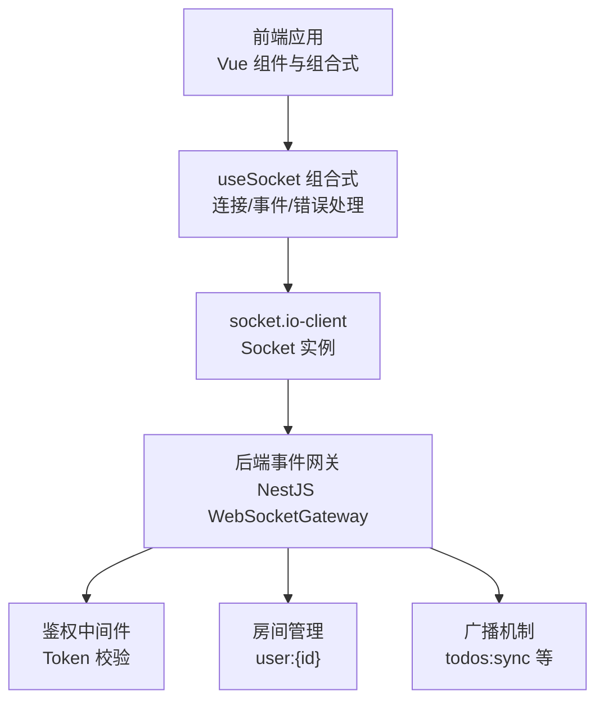
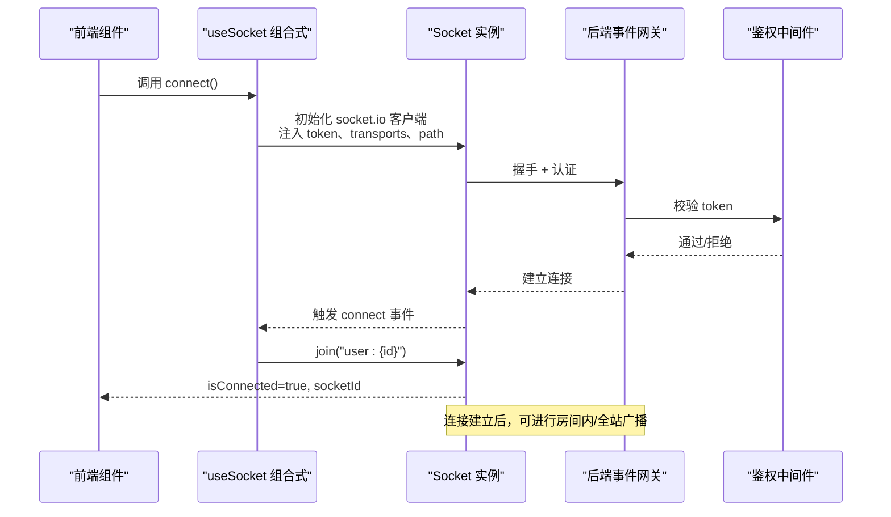
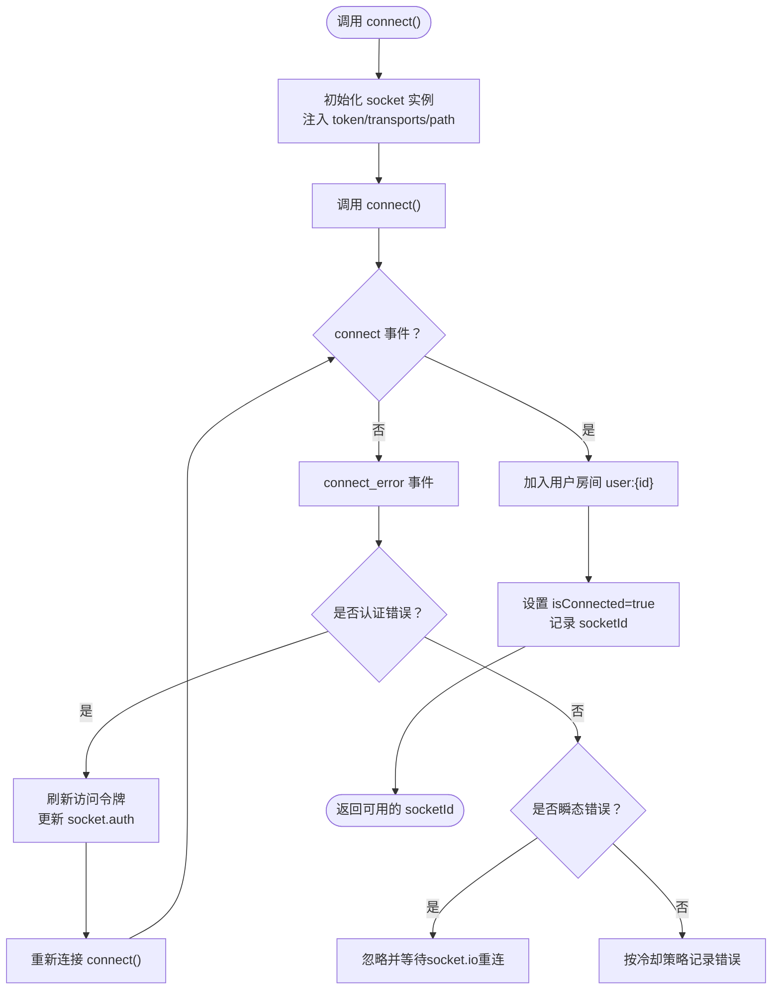
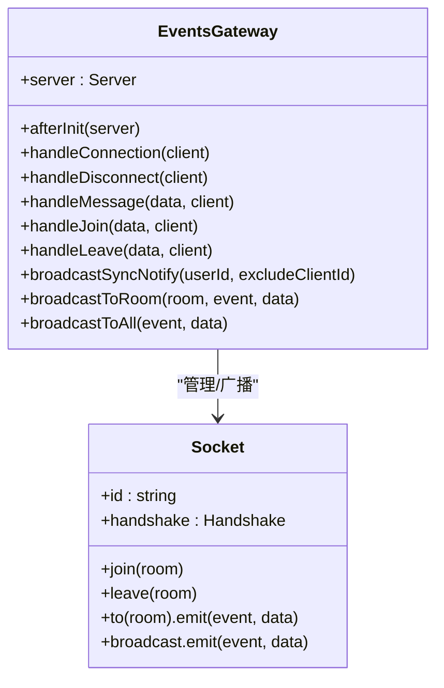
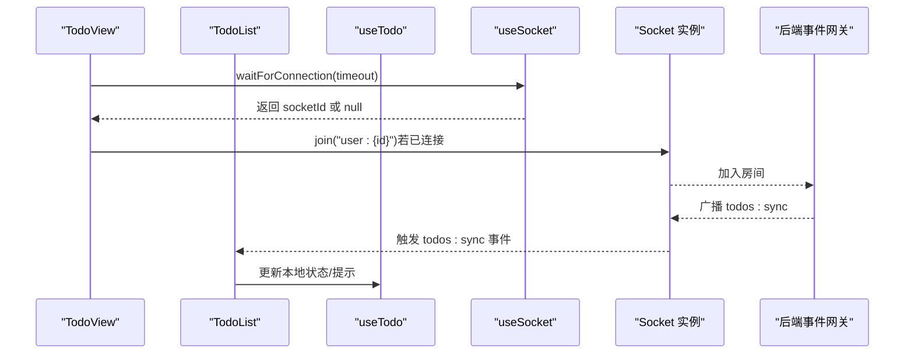
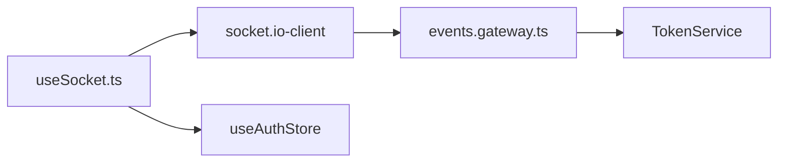

# Socket客户端

<cite>
**本文引用的文件**
- [useSocket.ts](file://apps/frontend/src/composables/useSocket.ts)
- [useSocket.errors.ts](file://apps/frontend/src/composables/useSocket.errors.ts)
- [events.gateway.ts](file://apps/backend/src/events/events.gateway.ts)
- [TodoView.vue](file://apps/frontend/src/features/todo/TodoView.vue)
- [TodoList.vue](file://apps/frontend/src/features/todo/components/TodoList.vue)
- [useTodo.ts](file://apps/frontend/src/features/todo/composables/useTodo.ts)
</cite>

## 目录

1. [简介](#简介)
2. [项目结构](#项目结构)
3. [核心组件](#核心组件)
4. [架构总览](#架构总览)
5. [详细组件分析](#详细组件分析)
6. [依赖关系分析](#依赖关系分析)
7. [性能考量](#性能考量)
8. [故障排查指南](#故障排查指南)
9. [结论](#结论)
10. [附录](#附录)

## 简介

本文件面向Lumina Todo前端的Socket客户端，系统性阐述基于socket.io-client的useSocket组合式实现，覆盖连接建立、事件监听、消息发送、错误处理、重连机制、错误状态管理、连接状态管理、通信协议与事件命名约定，并提供在Vue组件中的集成示例与最佳实践。

## 项目结构

- 前端Socket客户端位于应用前端的组合式函数中，负责统一管理Socket实例、连接生命周期、认证令牌注入、房间加入、错误分类与日志冷却、等待连接完成等。
- 后端事件网关位于NestJS WebSockets模块，提供CORS配置、鉴权中间件、房间管理、广播机制、事件订阅等能力，与前端形成稳定的双向通信通道。

图表来源

- [useSocket.ts:56-191](file://apps/frontend/src/composables/useSocket.ts#L56-L191)
- [events.gateway.ts:57-266](file://apps/backend/src/events/events.gateway.ts#L57-L266)

章节来源

- [useSocket.ts:1-191](file://apps/frontend/src/composables/useSocket.ts#L1-L191)
- [events.gateway.ts:1-266](file://apps/backend/src/events/events.gateway.ts#L1-L266)

## 核心组件

- useSocket组合式：封装Socket实例、连接控制、等待连接完成、错误处理与日志冷却、认证令牌注入、房间加入、连接状态与Socket ID暴露。
- useSocket.errors工具：对连接错误进行分类，区分认证类错误与瞬态错误，辅助自动重连与降噪处理。
- 后端事件网关：提供CORS、鉴权、房间加入/离开、消息转发、广播（如todos:sync）等。

章节来源

- [useSocket.ts:19-26](file://apps/frontend/src/composables/useSocket.ts#L19-L26)
- [useSocket.errors.ts:1-33](file://apps/frontend/src/composables/useSocket.errors.ts#L1-L33)
- [events.gateway.ts:57-266](file://apps/backend/src/events/events.gateway.ts#L57-L266)

## 架构总览

Socket通信采用“前端组合式 + 后端网关”的分层设计：

- 前端通过useSocket统一初始化socket.io客户端，注入认证令牌，监听连接状态与错误，必要时刷新令牌并重连。
- 后端通过WebSocketGateway实现CORS白名单、鉴权中间件、房间权限校验、事件订阅与广播。
- 前后端事件命名遵循“领域:动作”语义，如todos:sync用于任务同步通知。

图表来源

- [useSocket.ts:59-120](file://apps/frontend/src/composables/useSocket.ts#L59-L120)
- [events.gateway.ts:86-141](file://apps/backend/src/events/events.gateway.ts#L86-L141)

## 详细组件分析

### useSocket 组合式实现

- 连接建立
  - 自动注入withCredentials与跨域凭据，选择传输方式（开发优先轮询，生产优先WebSocket），显式指定socket.io路径，避免反向代理歧义。
  - 初始化时注入认证令牌，首次连接前更新auth.token，确保握手阶段携带有效token。
- 事件监听
  - connect：标记连接成功，记录socketId；若已认证，自动加入“user:{userId}”房间。
  - disconnect：标记断开，清空socketId。
  - connect_error：区分认证错误与瞬态错误；认证错误触发token刷新并重连；瞬态错误忽略；其他错误按冷却策略打印日志。
- 错误处理与重连
  - 通过isSocketAuthError与isTransientSocketError进行错误分类。
  - 认证错误时刷新访问令牌，更新socket.auth并重新连接。
  - 瞬态错误由socket.io内部重连策略处理，useSocket仅做降噪与日志冷却。
- 等待连接完成
  - waitForConnection提供超时等待，返回socketId或null，便于在组件挂载时安全地进行后续操作。
- 连接状态管理
  - isConnected与socketId为响应式状态，供组件读取；disconnect时重置为初始值。
- 认证与房间
  - 通过鉴权中间件确保只有合法用户能加入房间；前端在connect后自动join用户房间，避免越权。

图表来源

- [useSocket.ts:59-120](file://apps/frontend/src/composables/useSocket.ts#L59-L120)
- [useSocket.ts:93-108](file://apps/frontend/src/composables/useSocket.ts#L93-L108)
- [useSocket.errors.ts:23-32](file://apps/frontend/src/composables/useSocket.errors.ts#L23-L32)

章节来源

- [useSocket.ts:56-191](file://apps/frontend/src/composables/useSocket.ts#L56-L191)

### useSocket.errors 错误分类

- 认证错误关键词：unauthorized、token、jwt、authentication。
- 瞬态错误关键词：timeout、transport close、transport error、websocket error、xhr poll error、xhr post error。
- 提供isSocketAuthError与isTransientSocketError两个判定函数，供useSocket在connect_error分支中使用。

章节来源

- [useSocket.errors.ts:1-33](file://apps/frontend/src/composables/useSocket.errors.ts#L1-L33)

### 后端事件网关与通信协议

- CORS与传输
  - 支持CORS白名单与凭证，显式声明允许的头部，namespace为/events，transports包含polling与websocket。
- 鉴权中间件
  - 从握手参数或Authorization头提取token，验证并检查会话是否失效，失败则拒绝连接。
- 房间与权限
  - 自动加入“user:{userId}”房间；join/leave事件需校验房间归属，防止越权访问。
- 事件与广播
  - message：支持向指定房间或全站广播。
  - todos:sync：后端对同一用户多设备广播同步通知，带时间戳，前端监听并更新本地状态。
  - user:joined/user:left：房间成员变更通知。

图表来源

- [events.gateway.ts:57-266](file://apps/backend/src/events/events.gateway.ts#L57-L266)

章节来源

- [events.gateway.ts:57-266](file://apps/backend/src/events/events.gateway.ts#L57-L266)

### 前端组件集成示例与最佳实践

- TodoView与TodoList
  - TodoView作为顶层容器，负责动画、布局与视图切换；TodoList负责渲染任务列表与交互事件。
  - 在这些组件中，可通过useSocket提供的waitForConnection在挂载时等待连接稳定后再进行房间加入或数据拉取，避免竞态。
  - 当收到todos:sync事件时，组件可触发本地状态更新，实现多设备同步。
- useTodo组合式
  - 通过useTodoStore与useToast等组合式，集中处理错误提示与UI反馈；当Socket错误发生时，可结合toast进行用户提示。

图表来源

- [TodoView.vue:178-187](file://apps/frontend/src/features/todo/TodoView.vue#L178-L187)
- [TodoList.vue:1-316](file://apps/frontend/src/features/todo/components/TodoList.vue#L1-L316)
- [useTodo.ts:1-186](file://apps/frontend/src/features/todo/composables/useTodo.ts#L1-L186)
- [useSocket.ts:131-161](file://apps/frontend/src/composables/useSocket.ts#L131-L161)

章节来源

- [TodoView.vue:1-522](file://apps/frontend/src/features/todo/TodoView.vue#L1-L522)
- [TodoList.vue:1-316](file://apps/frontend/src/features/todo/components/TodoList.vue#L1-L316)
- [useTodo.ts:1-186](file://apps/frontend/src/features/todo/composables/useTodo.ts#L1-L186)
- [useSocket.ts:131-161](file://apps/frontend/src/composables/useSocket.ts#L131-L161)

## 依赖关系分析

- 前端依赖
  - socket.io-client：提供Socket实例与事件模型。
  - Vue响应式系统：isConnected、socketId为响应式状态，供组件读取。
  - 鉴权存储：useAuthStore提供token与认证状态，驱动Socket连接与房间加入。
- 后端依赖
  - NestJS WebSockets：WebSocketGateway、Socket、Server。
  - TokenService：验证访问令牌与会话有效性。
- 关系耦合
  - 前后端通过“user:{id}”房间解耦，避免直接耦合具体业务对象。
  - 事件命名采用“领域:动作”，如todos:sync，便于扩展与维护。

图表来源

- [useSocket.ts:1-10](file://apps/frontend/src/composables/useSocket.ts#L1-L10)
- [events.gateway.ts:14-66](file://apps/backend/src/events/events.gateway.ts#L14-L66)

章节来源

- [useSocket.ts:1-10](file://apps/frontend/src/composables/useSocket.ts#L1-L10)
- [events.gateway.ts:14-66](file://apps/backend/src/events/events.gateway.ts#L14-L66)

## 性能考量

- 传输与路径
  - 生产优先WebSocket，降低延迟；开发环境兼容轮询，提升可达性。
  - 显式指定socket.io路径，避免反向代理导致的路径解析问题。
- 重连策略
  - 合理的重连次数与随机抖动，避免雪崩效应。
- 广播防抖
  - 后端对同一用户的广播进行500ms防抖，减少频繁通知带来的抖动与资源消耗。
- 日志冷却
  - 前端对重复错误进行冷却输出，避免控制台刷屏与性能损耗。

章节来源

- [useSocket.ts:14-15](file://apps/frontend/src/composables/useSocket.ts#L14-L15)
- [useSocket.ts:32-51](file://apps/frontend/src/composables/useSocket.ts#L32-L51)
- [events.gateway.ts:180-202](file://apps/backend/src/events/events.gateway.ts#L180-L202)

## 故障排查指南

- 连接失败
  - 检查CORS配置与凭证传递，确认后端允许的origin与headers。
  - 确认前端注入的token有效且未过期；若出现认证错误，useSocket会尝试刷新并重连。
- 房间加入失败
  - 校验房间名格式与权限；后端会校验房间归属，越权将被拒绝。
- 广播无响应
  - 确认已在connect后加入房间；检查事件名是否正确（如todos:sync）。
- 控制台日志过多
  - 错误已被冷却策略抑制；若仍异常，检查错误类型与关键词匹配逻辑。
- 多设备不同步
  - 检查广播防抖是否生效；确认excludeClientId逻辑是否正确排除自身。

章节来源

- [useSocket.ts:93-108](file://apps/frontend/src/composables/useSocket.ts#L93-L108)
- [events.gateway.ts:77-84](file://apps/backend/src/events/events.gateway.ts#L77-L84)
- [events.gateway.ts:207-226](file://apps/backend/src/events/events.gateway.ts#L207-L226)
- [events.gateway.ts:180-202](file://apps/backend/src/events/events.gateway.ts#L180-L202)

## 结论

useSocket组合式提供了统一、健壮的Socket客户端能力：连接管理、认证与房间、错误分类与重连、等待连接完成、状态暴露与日志冷却。后端事件网关通过严格的CORS与鉴权、房间权限校验与广播机制，保障了实时通信的安全与稳定。两者配合实现了Lumina Todo的多设备同步与实时交互体验。

## 附录

### 通信协议与事件命名约定

- 命名约定
  - 领域:动作，如todos:sync、user:joined、user:left、message。
- 事件说明
  - connect/disconnect/connect_error：连接生命周期事件。
  - join/leave：房间加入与离开，需校验房间归属。
  - message：消息发送与广播。
  - todos:sync：任务同步通知，带时间戳，支持排除特定客户端。

章节来源

- [events.gateway.ts:150-175](file://apps/backend/src/events/events.gateway.ts#L150-L175)
- [events.gateway.ts:207-226](file://apps/backend/src/events/events.gateway.ts#L207-L226)
- [events.gateway.ts:228-250](file://apps/backend/src/events/events.gateway.ts#L228-L250)
- [events.gateway.ts:177-202](file://apps/backend/src/events/events.gateway.ts#L177-L202)
