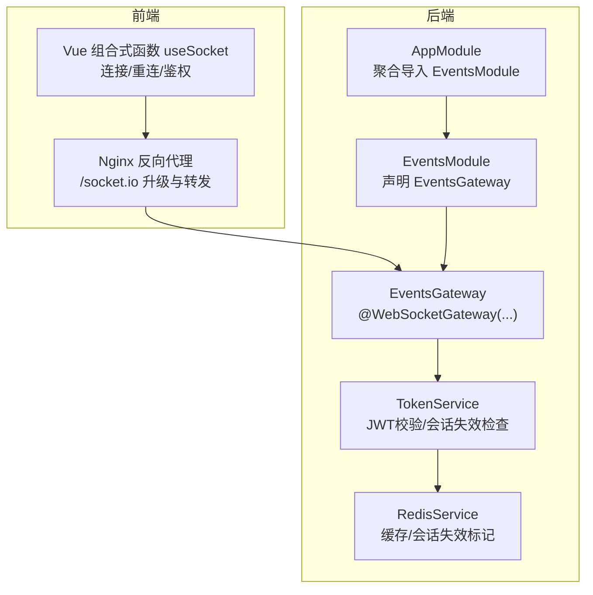
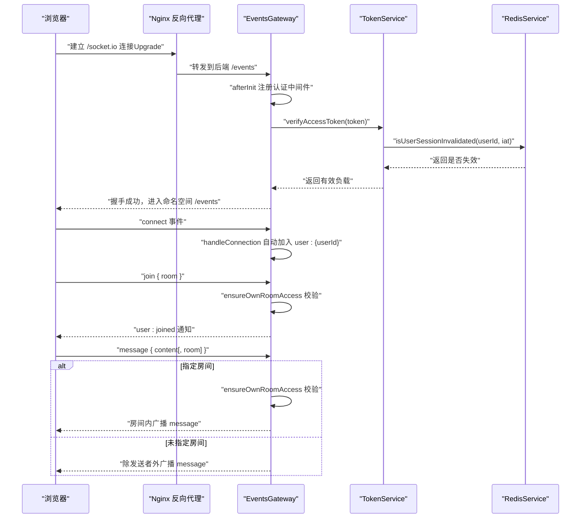
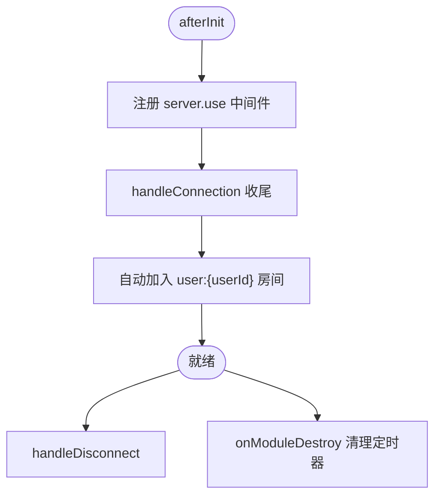
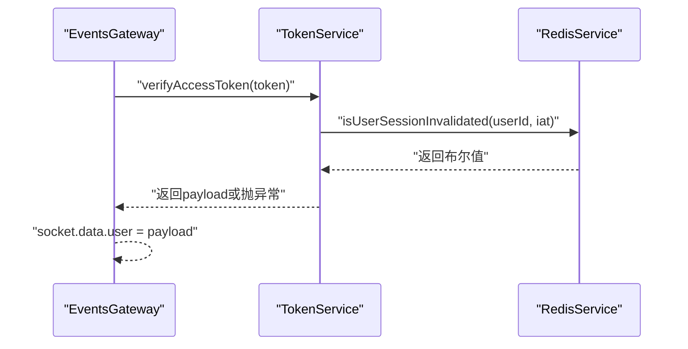
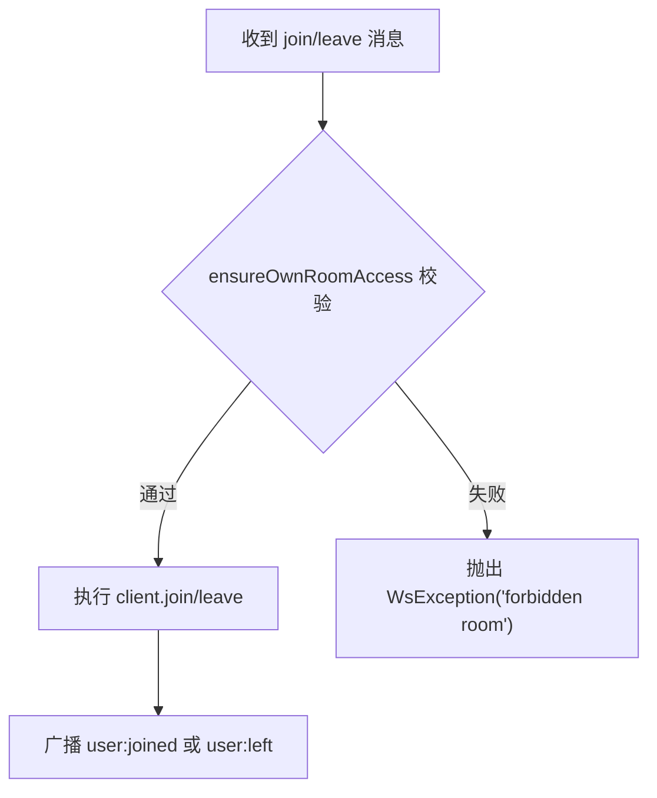
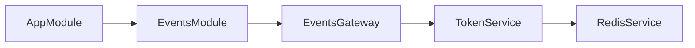

# WebSocket网关

<cite>
**本文引用的文件**
- [apps/backend/src/events/events.gateway.ts](file://apps/backend/src/events/events.gateway.ts)
- [apps/backend/src/events/events.module.ts](file://apps/backend/src/events/events.module.ts)
- [apps/backend/src/auth/token.service.ts](file://apps/backend/src/auth/token.service.ts)
- [apps/backend/src/redis/redis.service.ts](file://apps/backend/src/redis/redis.service.ts)
- [apps/backend/src/app.module.ts](file://apps/backend/src/app.module.ts)
- [apps/frontend/src/composables/useSocket.ts](file://apps/frontend/src/composables/useSocket.ts)
- [apps/frontend/src/composables/useSocket.errors.ts](file://apps/frontend/src/composables/useSocket.errors.ts)
- [apps/frontend/nginx.conf](file://apps/frontend/nginx.conf)
- [docker-compose.yml](file://docker-compose.yml)
- [apps/backend/tests/events/events.gateway.spec.ts](file://apps/backend/tests/events/events.gateway.spec.ts)
</cite>

## 目录
1. [简介](#简介)
2. [项目结构](#项目结构)
3. [核心组件](#核心组件)
4. [架构总览](#架构总览)
5. [详细组件分析](#详细组件分析)
6. [依赖关系分析](#依赖关系分析)
7. [性能考量](#性能考量)
8. [故障排查指南](#故障排查指南)
9. [结论](#结论)
10. [附录](#附录)

## 简介
本文件面向Lumina Todo项目的WebSocket网关，系统性阐述基于@WebSocketGateway装饰器的配置要点、CORS策略、传输协议选择；详解网关生命周期回调（初始化、连接、断开）、认证中间件与JWT校验流程、用户会话状态检查；深入解析房间管理机制（自动分配、权限控制）以及广播防抖策略。文档同时提供前后端集成示例与排障建议，帮助开发者快速理解与扩展WebSocket能力。

## 项目结构
WebSocket网关位于后端应用events子系统，通过独立模块导出，供应用主模块聚合引入。前端通过Socket.IO客户端在浏览器侧发起连接，并在Nginx反向代理层完成WebSocket升级与转发。

**图表来源**
- [apps/backend/src/app.module.ts:140](file://apps/backend/src/app.module.ts#L140)
- [apps/backend/src/events/events.module.ts:9-14](file://apps/backend/src/events/events.module.ts#L9-L14)
- [apps/backend/src/events/events.gateway.ts:20-56](file://apps/backend/src/events/events.gateway.ts#L20-L56)
- [apps/frontend/nginx.conf:144-180](file://apps/frontend/nginx.conf#L144-L180)

**章节来源**
- [apps/backend/src/app.module.ts:140](file://apps/backend/src/app.module.ts#L140)
- [apps/backend/src/events/events.module.ts:9-14](file://apps/backend/src/events/events.module.ts#L9-L14)
- [apps/backend/src/events/events.gateway.ts:20-56](file://apps/backend/src/events/events.gateway.ts#L20-L56)
- [apps/frontend/nginx.conf:144-180](file://apps/frontend/nginx.conf#L144-L180)

## 核心组件
- @WebSocketGateway装饰器配置
  - CORS策略：动态origin白名单、credentials、显式allowedHeaders，支持开发/调试特殊origin
  - 命名空间namespace：/events
  - 传输协议transports：['polling','websocket']
- 认证中间件：从握手参数或Authorization头提取JWT，调用TokenService验证访问令牌并检查会话是否失效
- 房间管理：连接时自动加入“user:{userId}”房间；提供join/leave消息订阅；房间访问权限校验
- 广播防抖：针对同一用户的todos:sync事件进行去抖，避免频繁广播
- 生命周期：afterInit（注册中间件）、handleConnection（自动入房）、handleDisconnect（日志记录）

**章节来源**
- [apps/backend/src/events/events.gateway.ts:20-56](file://apps/backend/src/events/events.gateway.ts#L20-L56)
- [apps/backend/src/events/events.gateway.ts:86-145](file://apps/backend/src/events/events.gateway.ts#L86-L145)
- [apps/backend/src/events/events.gateway.ts:177-202](file://apps/backend/src/events/events.gateway.ts#L177-L202)
- [apps/backend/src/events/events.gateway.ts:207-250](file://apps/backend/src/events/events.gateway.ts#L207-L250)

## 架构总览
下图展示了从浏览器到后端网关的完整链路，包括Nginx升级、鉴权中间件、房间管理与事件广播。

**图表来源**
- [apps/backend/src/events/events.gateway.ts:86-145](file://apps/backend/src/events/events.gateway.ts#L86-L145)
- [apps/backend/src/events/events.gateway.ts:150-175](file://apps/backend/src/events/events.gateway.ts#L150-L175)
- [apps/backend/src/events/events.gateway.ts:207-250](file://apps/backend/src/events/events.gateway.ts#L207-L250)
- [apps/frontend/nginx.conf:144-180](file://apps/frontend/nginx.conf#L144-L180)

## 详细组件分析

### @WebSocketGateway装饰器与CORS策略
- CORS.origin：支持环境变量CORS_ORIGIN多值白名单；当为'*'时放行；否则严格匹配；允许origin为空、'null'、wails://、http://wails.localhost等开发场景
- credentials：true，允许携带Cookie/凭证
- allowedHeaders：显式声明，避免通配符导致的浏览器限制
- namespace：/events，区分业务命名空间
- transports：['polling','websocket']，优先websocket，回退polling

这些配置确保了跨域兼容性与安全性，同时兼顾桌面应用（Wails）与Web应用的握手差异。

**章节来源**
- [apps/backend/src/events/events.gateway.ts:20-56](file://apps/backend/src/events/events.gateway.ts#L20-L56)

### 传输协议选择
- 前端默认按开发/dev优先使用['polling','websocket']，生产/prod优先['websocket','polling']，并显式指定path='/socket.io/'与withCredentials
- Nginx对/ws路径进行升级与转发，关闭代理缓冲，延长读写超时，保证实时性

**章节来源**
- [apps/frontend/src/composables/useSocket.ts:15](file://apps/frontend/src/composables/useSocket.ts#L15)
- [apps/frontend/src/composables/useSocket.ts:64-77](file://apps/frontend/src/composables/useSocket.ts#L64-L77)
- [apps/frontend/nginx.conf:144-180](file://apps/frontend/nginx.conf#L144-L180)

### 网关生命周期管理
- afterInit：注册认证中间件，拦截握手阶段的鉴权逻辑
- handleConnection：连接建立后，自动加入“user:{userId}”房间
- handleDisconnect：记录断开事件
- onModuleDestroy：清理广播防抖定时器，避免内存泄漏

**图表来源**
- [apps/backend/src/events/events.gateway.ts:86-145](file://apps/backend/src/events/events.gateway.ts#L86-L145)
- [apps/backend/src/events/events.gateway.ts:118-124](file://apps/backend/src/events/events.gateway.ts#L118-L124)

**章节来源**
- [apps/backend/src/events/events.gateway.ts:86-145](file://apps/backend/src/events/events.gateway.ts#L86-L145)
- [apps/backend/src/events/events.gateway.ts:118-124](file://apps/backend/src/events/events.gateway.ts#L118-L124)

### 认证中间件与JWT令牌验证
- 中间件从握手auth或Authorization头提取token
- 调用TokenService.verifyAccessToken校验访问令牌有效性
- 通过TokenService.isUserSessionInvalidated检查会话是否被标记失效（基于Redis）
- 成功后将用户负载写入socket.data.user，后续可直接使用

**图表来源**
- [apps/backend/src/events/events.gateway.ts:90-115](file://apps/backend/src/events/events.gateway.ts#L90-L115)
- [apps/backend/src/auth/token.service.ts:115-125](file://apps/backend/src/auth/token.service.ts#L115-L125)
- [apps/backend/src/auth/token.service.ts:55-76](file://apps/backend/src/auth/token.service.ts#L55-L76)

**章节来源**
- [apps/backend/src/events/events.gateway.ts:90-115](file://apps/backend/src/events/events.gateway.ts#L90-L115)
- [apps/backend/src/auth/token.service.ts:115-125](file://apps/backend/src/auth/token.service.ts#L115-L125)
- [apps/backend/src/auth/token.service.ts:55-76](file://apps/backend/src/auth/token.service.ts#L55-L76)

### 用户会话状态检查
- Redis键采用CachePrefix.AUTH前缀，键名形如“invalidate:{userId}”
- 通过比较token签发时间iat与失效时间戳，判断是否应拒绝
- 该机制支持强制登出/切换设备后的即时生效

**章节来源**
- [apps/backend/src/auth/token.service.ts:47-76](file://apps/backend/src/auth/token.service.ts#L47-L76)
- [apps/backend/src/redis/redis.service.ts:18-25](file://apps/backend/src/redis/redis.service.ts#L18-L25)

### 房间管理机制
- 自动分配：连接成功后自动加入“user:{userId}”房间
- 权限控制：handleJoin/handleMessage均调用ensureOwnRoomAccess，仅允许访问自身房间
- 手动加入/离开：支持客户端发送join/leave消息，网关校验后执行加入/离开并广播user:joined/user:left
- 房间广播：支持向指定房间或全体广播

**图表来源**
- [apps/backend/src/events/events.gateway.ts:207-250](file://apps/backend/src/events/events.gateway.ts#L207-L250)
- [apps/backend/src/events/events.gateway.ts:77-84](file://apps/backend/src/events/events.gateway.ts#L77-L84)

**章节来源**
- [apps/backend/src/events/events.gateway.ts:138-141](file://apps/backend/src/events/events.gateway.ts#L138-L141)
- [apps/backend/src/events/events.gateway.ts:207-250](file://apps/backend/src/events/events.gateway.ts#L207-L250)
- [apps/backend/src/events/events.gateway.ts:77-84](file://apps/backend/src/events/events.gateway.ts#L77-L84)

### 广播防抖与事件广播
- broadcastSyncNotify：对同一userId在500ms内去抖，合并多次触发，避免风暴
- 支持向房间或全体广播todos:sync事件，可选择排除特定clientId

**章节来源**
- [apps/backend/src/events/events.gateway.ts:177-202](file://apps/backend/src/events/events.gateway.ts#L177-L202)
- [apps/backend/src/events/events.gateway.ts:255-264](file://apps/backend/src/events/events.gateway.ts#L255-L264)

### 前端集成与错误处理
- useSocket：初始化socket实例，设置withCredentials、transports、path、auth.token；监听connect/disconnect/connect_error
- connect_error中识别认证类错误（如unauthorized/token/expired）与瞬时传输错误（如timeout/transport close），必要时刷新token并重连
- Nginx：对/ws路径进行Upgrade/Connection头部透传，关闭缓冲，延长超时，确保WebSocket稳定

**章节来源**
- [apps/frontend/src/composables/useSocket.ts:56-120](file://apps/frontend/src/composables/useSocket.ts#L56-L120)
- [apps/frontend/src/composables/useSocket.ts:93-108](file://apps/frontend/src/composables/useSocket.ts#L93-L108)
- [apps/frontend/src/composables/useSocket.errors.ts:8-32](file://apps/frontend/src/composables/useSocket.errors.ts#L8-L32)
- [apps/frontend/nginx.conf:144-180](file://apps/frontend/nginx.conf#L144-L180)

## 依赖关系分析
- EventsGateway依赖TokenService进行JWT校验与会话失效检查，TokenService依赖RedisService进行缓存读写
- EventsModule导入AuthModule以注入TokenService
- AppModule聚合EventsModule，使网关在应用启动时加载

**图表来源**
- [apps/backend/src/events/events.gateway.ts:66](file://apps/backend/src/events/events.gateway.ts#L66)
- [apps/backend/src/events/events.module.ts:10](file://apps/backend/src/events/events.module.ts#L10)
- [apps/backend/src/app.module.ts:140](file://apps/backend/src/app.module.ts#L140)

**章节来源**
- [apps/backend/src/events/events.gateway.ts:66](file://apps/backend/src/events/events.gateway.ts#L66)
- [apps/backend/src/events/events.module.ts:10](file://apps/backend/src/events/events.module.ts#L10)
- [apps/backend/src/app.module.ts:140](file://apps/backend/src/app.module.ts#L140)

## 性能考量
- 广播防抖：todos:sync事件在500ms内合并，降低网络与CPU压力
- 传输协议：生产环境优先websocket，减少轮询开销；Nginx关闭代理缓冲，避免延迟累积
- CORS白名单：避免通配符，减少浏览器安全警告与不必要的握手失败
- 会话失效检查：基于Redis的O(1)读取，成本低且可扩展

[本节为通用指导，无需具体文件引用]

## 故障排查指南
- 认证失败
  - 现象：connect_error包含unauthorized/token等关键字
  - 处理：前端检测到认证错误时刷新token并重连；后端日志会记录WebSocket认证失败
- 房间访问被拒
  - 现象：WsException('forbidden room')
  - 处理：确认客户端发送的房间名与当前用户ID一致
- 传输错误
  - 现象：timeout/transport close等瞬时错误
  - 处理：前端自动重试；若持续出现，检查Nginx升级配置与网络稳定性
- CORS拒绝
  - 现象：握手阶段被CORS拒绝
  - 处理：核对CORS_ORIGIN环境变量与实际origin，确保包含开发/调试特殊origin

**章节来源**
- [apps/frontend/src/composables/useSocket.errors.ts:8-32](file://apps/frontend/src/composables/useSocket.errors.ts#L8-L32)
- [apps/frontend/src/composables/useSocket.ts:93-108](file://apps/frontend/src/composables/useSocket.ts#L93-L108)
- [apps/backend/src/events/events.gateway.ts:77-84](file://apps/backend/src/events/events.gateway.ts#L77-L84)
- [apps/backend/src/events/events.gateway.ts:20-56](file://apps/backend/src/events/events.gateway.ts#L20-L56)

## 结论
Lumina Todo的WebSocket网关通过严谨的@WebSocketGateway配置、完善的CORS策略与传输协议选择、可靠的JWT认证中间件与会话失效检查、严格的房间权限控制与广播防抖机制，构建了安全、稳定、高性能的实时通信基础。结合前端useSocket的自动重连与错误分类处理，以及Nginx对WebSocket的正确升级与转发，整体链路具备良好的可维护性与扩展性。

[本节为总结性内容，无需具体文件引用]

## 附录

### 关键配置与环境变量
- CORS_ORIGIN：后端CORS白名单，支持多值逗号分隔
- JWT_SECRET/JWT_REFRESH_SECRET：JWT密钥，生产需配置刷新密钥
- REDIS_*：Redis连接参数，用于会话失效标记与黑名单存储
- Nginx /socket.io：必须透传Upgrade/Connection头部，关闭代理缓冲，延长超时

**章节来源**
- [docker-compose.yml:105](file://docker-compose.yml#L105)
- [docker-compose.yml:103-104](file://docker-compose.yml#L103-L104)
- [docker-compose.yml:98-101](file://docker-compose.yml#L98-L101)
- [apps/frontend/nginx.conf:144-180](file://apps/frontend/nginx.conf#L144-L180)

### 测试参考
- 房间权限测试：验证非本人房间加入/消息发送会被拒绝
- 认证中间件测试：模拟verifyAccessToken与isUserSessionInvalidated行为

**章节来源**
- [apps/backend/tests/events/events.gateway.spec.ts:37-58](file://apps/backend/tests/events/events.gateway.spec.ts#L37-L58)