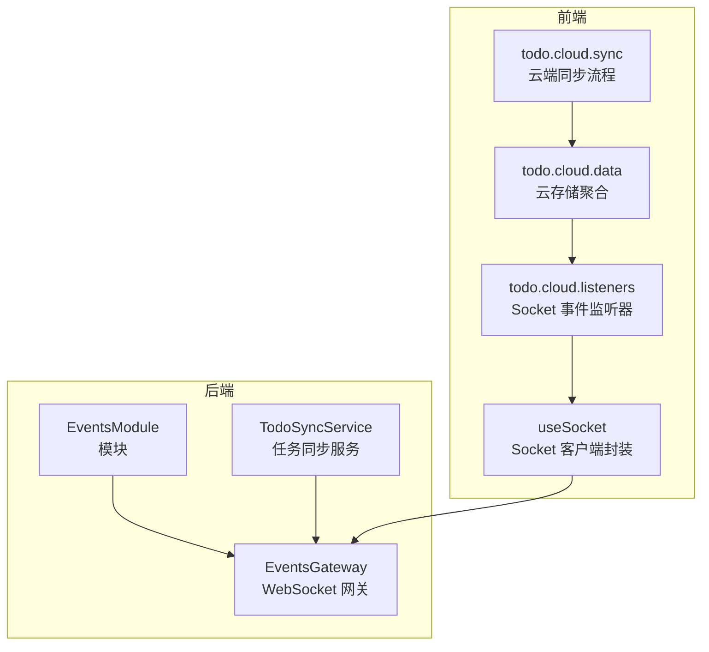
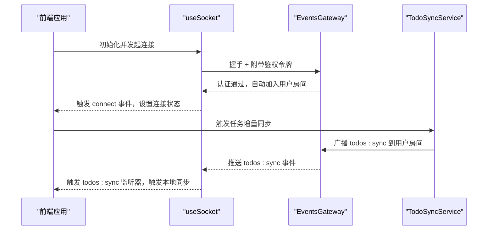
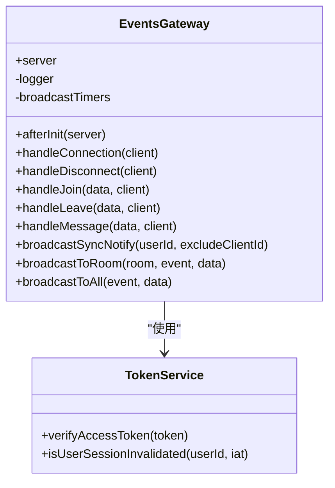
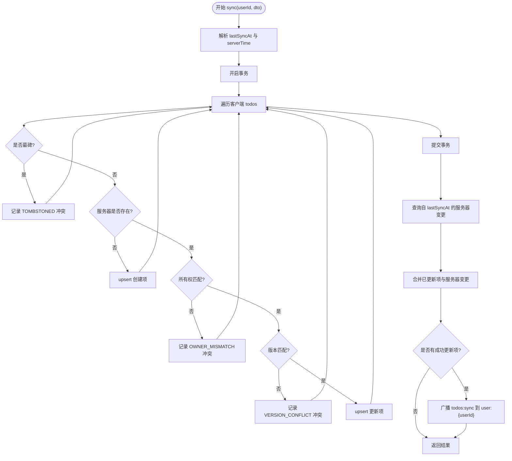
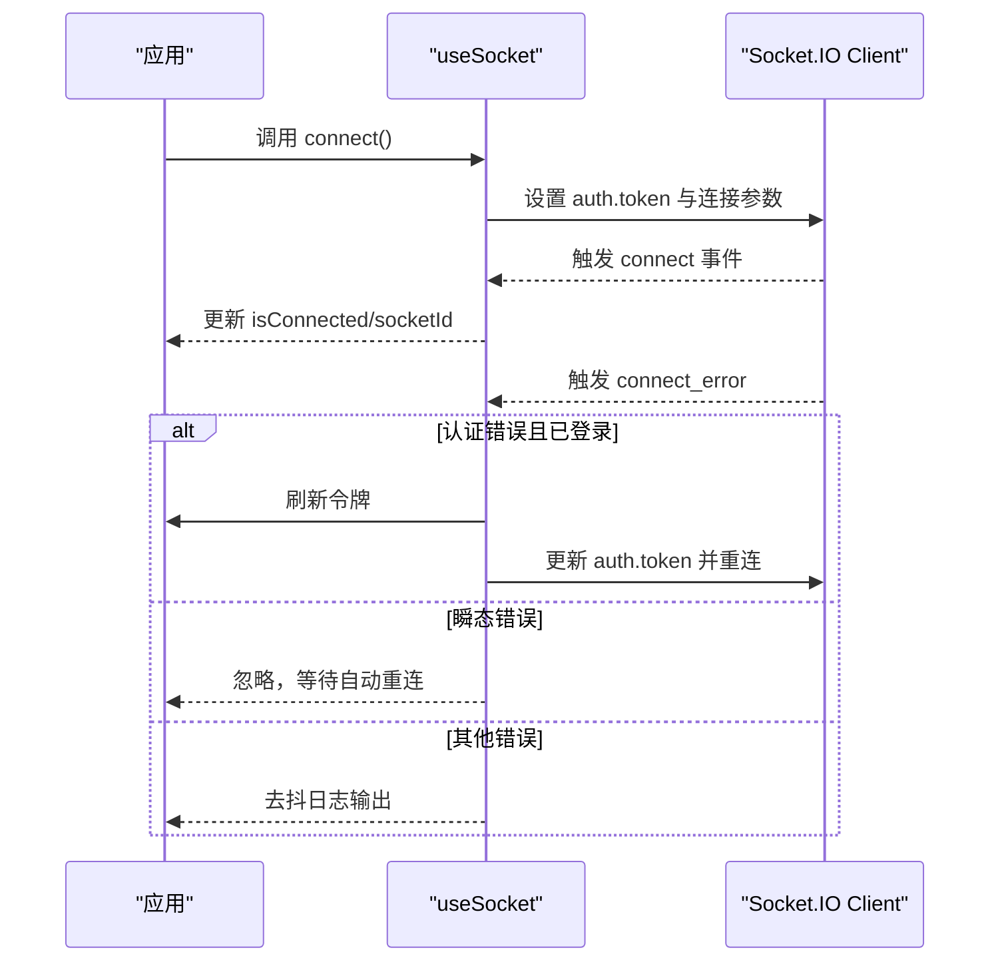
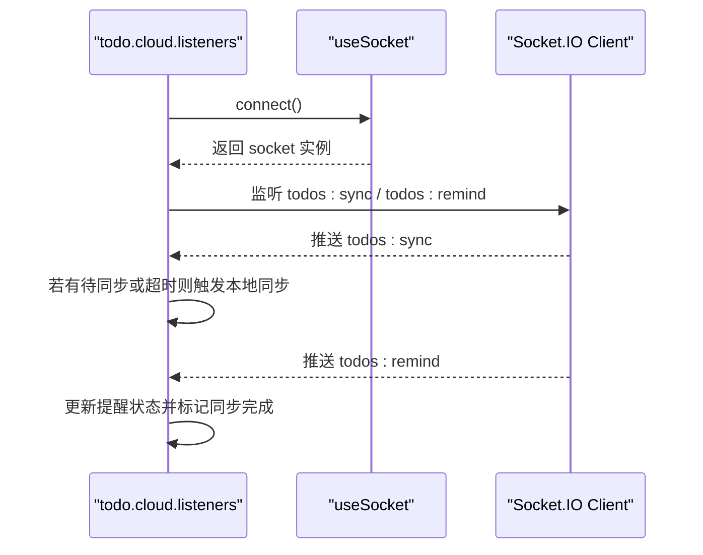
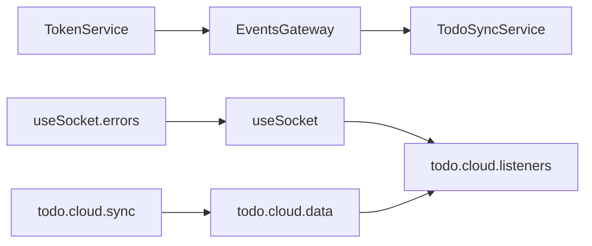

# 实时通信系统

<cite>
**本文档引用的文件**
- [apps/backend/src/events/events.gateway.ts](file://apps/backend/src/events/events.gateway.ts)
- [apps/backend/src/events/events.module.ts](file://apps/backend/src/events/events.module.ts)
- [apps/backend/src/todos/todos-sync.service.ts](file://apps/backend/src/todos/todos-sync.service.ts)
- [apps/frontend/src/composables/useSocket.ts](file://apps/frontend/src/composables/useSocket.ts)
- [apps/frontend/src/composables/useSocket.errors.ts](file://apps/frontend/src/composables/useSocket.errors.ts)
- [apps/frontend/src/features/todo/stores/todo.cloud.listeners.ts](file://apps/frontend/src/features/todo/stores/todo.cloud.listeners.ts)
- [apps/frontend/src/features/todo/stores/todo.cloud.data.ts](file://apps/frontend/src/features/todo/stores/todo.cloud.data.ts)
- [apps/frontend/src/features/todo/stores/todo.cloud.sync.ts](file://apps/frontend/src/features/todo/stores/todo.cloud.sync.ts)
- [apps/backend/tests/events/events.gateway.spec.ts](file://apps/backend/tests/events/events.gateway.spec.ts)
- [apps/frontend/tests/composables/useSocket.errors.spec.ts](file://apps/frontend/tests/composables/useSocket.errors.spec.ts)
</cite>

## 目录

1. [简介](#简介)
2. [项目结构](#项目结构)
3. [核心组件](#核心组件)
4. [架构总览](#架构总览)
5. [详细组件分析](#详细组件分析)
6. [依赖关系分析](#依赖关系分析)
7. [性能考量](#性能考量)
8. [故障排查指南](#故障排查指南)
9. [结论](#结论)
10. [附录](#附录)

## 简介

本文件面向 Lumina Todo 的实时通信系统，聚焦于 WebSocket 网关、房间管理、消息广播、前端 Socket 连接与重连、错误处理与鉴权、事件网关架构、消息序列化与连接生命周期管理、实时数据同步与离线消息处理、并发连接管理等主题。文档同时给出与任务系统、AI 助手系统的实时集成方式及性能优化与故障恢复策略，并提供可操作的使用示例路径。

## 项目结构

实时通信系统由后端 NestJS WebSocket 网关与前端 Socket.IO 客户端组成，围绕“用户房间”模型实现点对点与广播通信；任务系统通过增量同步触发后端广播，前端监听广播事件以触发本地同步；AI 助手系统通过聊天状态与任务建议联动，但不直接参与实时通信通道。

图表来源

- [apps/backend/src/events/events.gateway.ts:57-266](file://apps/backend/src/events/events.gateway.ts#L57-L266)
- [apps/backend/src/events/events.module.ts:1-15](file://apps/backend/src/events/events.module.ts#L1-L15)
- [apps/backend/src/todos/todos-sync.service.ts:42-226](file://apps/backend/src/todos/todos-sync.service.ts#L42-L226)
- [apps/frontend/src/composables/useSocket.ts:56-191](file://apps/frontend/src/composables/useSocket.ts#L56-L191)
- [apps/frontend/src/features/todo/stores/todo.cloud.listeners.ts:47-84](file://apps/frontend/src/features/todo/stores/todo.cloud.listeners.ts#L47-L84)
- [apps/frontend/src/features/todo/stores/todo.cloud.data.ts:7-43](file://apps/frontend/src/features/todo/stores/todo.cloud.data.ts#L7-L43)
- [apps/frontend/src/features/todo/stores/todo.cloud.sync.ts:98-141](file://apps/frontend/tests/features/todo/stores/todo.sync.spec.ts#L98-L141)

章节来源

- [apps/backend/src/events/events.gateway.ts:1-266](file://apps/backend/src/events/events.gateway.ts#L1-L266)
- [apps/backend/src/events/events.module.ts:1-15](file://apps/backend/src/events/events.module.ts#L1-L15)
- [apps/frontend/src/composables/useSocket.ts:1-191](file://apps/frontend/src/composables/useSocket.ts#L1-L191)

## 核心组件

- WebSocket 网关（后端）
  - 负责认证中间件、CORS 配置、连接生命周期管理、房间加入/离开、消息广播、向特定用户广播同步通知。
- Socket 客户端（前端）
  - 提供连接初始化、鉴权参数注入、连接状态跟踪、错误分类与自动重连、等待连接完成等能力。
- 任务同步服务（后端）
  - 在增量合并成功后，调用网关向用户房间广播“todos:sync”，前端监听后触发本地同步。
- 云存储与监听器（前端）
  - 初始化 Socket 监听器，订阅 todos:sync、todos:remind 等事件，驱动本地状态更新与提醒逻辑。

章节来源

- [apps/backend/src/events/events.gateway.ts:57-266](file://apps/backend/src/events/events.gateway.ts#L57-L266)
- [apps/frontend/src/composables/useSocket.ts:56-191](file://apps/frontend/src/composables/useSocket.ts#L56-L191)
- [apps/backend/src/todos/todos-sync.service.ts:42-226](file://apps/backend/src/todos/todos-sync.service.ts#L42-L226)
- [apps/frontend/src/features/todo/stores/todo.cloud.listeners.ts:47-84](file://apps/frontend/src/features/todo/stores/todo.cloud.listeners.ts#L47-L84)

## 架构总览

WebSocket 网关通过 Socket.IO 提供多传输支持与命名空间隔离；前端通过 useSocket 统一管理连接、鉴权与重连；任务系统在写入成功后触发广播，前端监听后进行增量同步；AI 助手系统通过聊天状态与任务建议联动，不直接占用实时通信通道。

图表来源

- [apps/backend/src/events/events.gateway.ts:177-202](file://apps/backend/src/events/events.gateway.ts#L177-L202)
- [apps/backend/src/todos/todos-sync.service.ts:212-215](file://apps/backend/src/todos/todos-sync.service.ts#L212-L215)
- [apps/frontend/src/composables/useSocket.ts:79-86](file://apps/frontend/src/composables/useSocket.ts#L79-L86)
- [apps/frontend/src/features/todo/stores/todo.cloud.listeners.ts:68-72](file://apps/frontend/src/features/todo/stores/todo.cloud.listeners.ts#L68-L72)

## 详细组件分析

### WebSocket 网关（后端）

- 认证中间件
  - 从握手头部或握手鉴权参数中提取令牌，验证有效性并检查会话是否失效，通过后将用户信息写入 socket.data。
- CORS 与传输
  - 支持生产环境动态白名单与常见开发/原生环境来源；显式声明允许的请求头，启用轮询与 WebSocket 两种传输。
- 房间与权限
  - 自动将已认证客户端加入“user:{userId}”房间；限制 join/leave/message 仅能访问自身房间，防止越权。
- 广播与通知
  - 提供向房间/全站广播方法；提供“todos:sync”广播通知，内部使用防抖（500ms）避免频繁广播。
- 生命周期
  - onModuleDestroy 清理广播定时器，确保进程退出时无悬挂定时器。

图表来源

- [apps/backend/src/events/events.gateway.ts:57-266](file://apps/backend/src/events/events.gateway.ts#L57-L266)

章节来源

- [apps/backend/src/events/events.gateway.ts:20-145](file://apps/backend/src/events/events.gateway.ts#L20-L145)
- [apps/backend/src/events/events.gateway.ts:177-266](file://apps/backend/src/events/events.gateway.ts#L177-L266)

### 事件网关模块（后端）

- 导出 EventsGateway，注入 AuthModule 以使用 TokenService。

章节来源

- [apps/backend/src/events/events.module.ts:1-15](file://apps/backend/src/events/events.module.ts#L1-L15)

### 任务同步服务（后端）

- 增量合并与冲突检测
  - 使用数据库事务处理客户端推送的变更，严格比对版本号，识别墓碑、所有权不匹配与版本冲突。
- 服务器变更拉取与合并
  - 基于 lastSyncAt 拉取服务器侧变更，合并客户端已成功更新项，返回统一结果集。
- 广播通知
  - 当存在成功更新项时，调用网关向用户房间广播“todos:sync”，并可排除特定客户端 ID。

图表来源

- [apps/backend/src/todos/todos-sync.service.ts:52-224](file://apps/backend/src/todos/todos-sync.service.ts#L52-L224)

章节来源

- [apps/backend/src/todos/todos-sync.service.ts:42-226](file://apps/backend/src/todos/todos-sync.service.ts#L42-L226)

### 前端 Socket 客户端（useSocket）

- 连接初始化
  - 使用 Socket.IO Client，自动连接关闭、凭证携带、传输选择、重连参数与路径配置。
- 鉴权与重连
  - 连接时附带令牌；当发生认证类错误且已登录时，自动刷新令牌并重新连接。
- 连接状态与等待
  - 提供 isConnected/socketId 状态跟踪与 waitForConnection 超时等待。
- 错误处理
  - 对错误类型进行关键字匹配，区分认证错误与瞬态传输错误，非瞬态错误进行去抖日志输出。

图表来源

- [apps/frontend/src/composables/useSocket.ts:79-108](file://apps/frontend/src/composables/useSocket.ts#L79-L108)
- [apps/frontend/src/composables/useSocket.errors.ts:23-32](file://apps/frontend/src/composables/useSocket.errors.ts#L23-L32)

章节来源

- [apps/frontend/src/composables/useSocket.ts:56-191](file://apps/frontend/src/composables/useSocket.ts#L56-L191)
- [apps/frontend/src/composables/useSocket.errors.ts:1-33](file://apps/frontend/src/composables/useSocket.errors.ts#L1-L33)

### 前端 Socket 事件监听器（todo.cloud.listeners）

- 初始化监听器
  - 在应用启动时挂载 todos:sync 与 todos:remind 事件监听；根据认证状态决定是否附加监听。
- 事件处理
  - todos:sync：若存在待同步任务或距离上次同步时间过长，则触发本地增量同步。
  - todos:remind：根据提醒时间更新本地提醒状态并标记同步完成。

图表来源

- [apps/frontend/src/features/todo/stores/todo.cloud.listeners.ts:68-72](file://apps/frontend/src/features/todo/stores/todo.cloud.listeners.ts#L68-L72)
- [apps/frontend/src/features/todo/stores/todo.cloud.listeners.ts:24-45](file://apps/frontend/src/features/todo/stores/todo.cloud.listeners.ts#L24-L45)

章节来源

- [apps/frontend/src/features/todo/stores/todo.cloud.listeners.ts:47-84](file://apps/frontend/src/features/todo/stores/todo.cloud.listeners.ts#L47-L84)

### 前端云存储聚合（todo.cloud.data）

- 聚合多个子域动作：同步、冲突处理、垃圾桶、监听器等，形成统一的云存储接口。

章节来源

- [apps/frontend/src/features/todo/stores/todo.cloud.data.ts:7-43](file://apps/frontend/src/features/todo/stores/todo.cloud.data.ts#L7-L43)

### 前端云端同步流程（todo.cloud.sync）

- 发起同步
  - 收集本地待同步任务，构造增量同步请求，携带当前 Socket ID。
- 处理响应
  - 解析返回的已同步项、删除项、接受项、冲突项与服务器时间，更新本地状态。
- 重试与错误
  - 对可重试错误采用指数退避重试，最终失败记录错误。

章节来源

- [apps/frontend/src/features/todo/stores/todo.cloud.sync.ts:47-186](file://apps/frontend/src/features/todo/stores/todo.cloud.sync.ts#L47-L186)

## 依赖关系分析

- 后端
  - EventsGateway 依赖 TokenService 进行鉴权；TodoSyncService 依赖 EventsGateway 进行广播。
- 前端
  - useSocket 依赖 useSocket.errors 进行错误分类；todo.cloud.listeners 依赖 useSocket 进行事件绑定；todo.cloud.data 聚合各子域动作。

图表来源

- [apps/backend/src/events/events.gateway.ts:66-66](file://apps/backend/src/events/events.gateway.ts#L66-L66)
- [apps/backend/src/todos/todos-sync.service.ts:45-46](file://apps/backend/src/todos/todos-sync.service.ts#L45-L46)
- [apps/frontend/src/composables/useSocket.ts:5-8](file://apps/frontend/src/composables/useSocket.ts#L5-L8)
- [apps/frontend/src/features/todo/stores/todo.cloud.listeners.ts:63-64](file://apps/frontend/src/features/todo/stores/todo.cloud.listeners.ts#L63-L64)
- [apps/frontend/src/features/todo/stores/todo.cloud.data.ts:22-26](file://apps/frontend/src/features/todo/stores/todo.cloud.data.ts#L22-L26)

章节来源

- [apps/backend/src/events/events.gateway.ts:66-66](file://apps/backend/src/events/events.gateway.ts#L66-L66)
- [apps/backend/src/todos/todos-sync.service.ts:45-46](file://apps/backend/src/todos/todos-sync.service.ts#L45-L46)
- [apps/frontend/src/composables/useSocket.ts:5-8](file://apps/frontend/src/composables/useSocket.ts#L5-L8)
- [apps/frontend/src/features/todo/stores/todo.cloud.listeners.ts:63-64](file://apps/frontend/src/features/todo/stores/todo.cloud.listeners.ts#L63-L64)
- [apps/frontend/src/features/todo/stores/todo.cloud.data.ts:22-26](file://apps/frontend/src/features/todo/stores/todo.cloud.data.ts#L22-L26)

## 性能考量

- 广播防抖
  - 后端对“todos:sync”广播使用 Map 存储定时器，500ms 内多次触发仅保留最后一次，降低广播风暴风险。
- 事务与幂等
  - 增量合并使用数据库事务，严格版本匹配与墓碑检测，避免重复写入与冲突。
- 传输与重连
  - 前端在开发与生产环境分别调整传输优先级；合理设置重连次数与延迟，平衡可用性与资源消耗。
- 事件监听去抖
  - 前端在收到广播后，结合本地待同步任务与时间阈值再触发同步，避免频繁网络请求。

章节来源

- [apps/backend/src/events/events.gateway.ts:180-202](file://apps/backend/src/events/events.gateway.ts#L180-L202)
- [apps/backend/src/todos/todos-sync.service.ts:67-178](file://apps/backend/src/todos/todos-sync.service.ts#L67-L178)
- [apps/frontend/src/composables/useSocket.ts:64-77](file://apps/frontend/src/composables/useSocket.ts#L64-L77)

## 故障排查指南

- 认证失败
  - 现象：连接被拒绝或立即断开。
  - 排查：确认握手时携带的令牌有效且未过期；检查 TokenService 验证逻辑与会话失效判定。
- 房间越权
  - 现象：join/leave/message 抛出“forbidden room”异常。
  - 排查：确保房间名格式为“user:{userId}"，且与当前认证用户一致。
- 瞬态传输错误
  - 现象：连接中断但可自动恢复。
  - 排查：关注网络波动、Nginx 超时、代理层问题；前端已内置瞬态错误忽略策略。
- 非预期错误日志
  - 现象：控制台出现去抖后的错误日志。
  - 排查：检查错误指纹与冷却时间，定位重复错误根因。
- 测试验证
  - 后端测试覆盖了房间越权与鉴权失败场景；前端测试覆盖了错误类型识别。

章节来源

- [apps/backend/tests/events/events.gateway.spec.ts:37-58](file://apps/backend/tests/events/events.gateway.spec.ts#L37-L58)
- [apps/frontend/tests/composables/useSocket.errors.spec.ts:4-16](file://apps/frontend/tests/composables/useSocket.errors.spec.ts#L4-L16)
- [apps/frontend/src/composables/useSocket.errors.ts:23-32](file://apps/frontend/src/composables/useSocket.errors.ts#L23-L32)
- [apps/frontend/src/composables/useSocket.ts:93-108](file://apps/frontend/src/composables/useSocket.ts#L93-L108)

## 结论

Lumina Todo 的实时通信系统以“用户房间”为核心，结合后端网关的鉴权与广播、前端的连接管理与事件监听，实现了稳定高效的实时数据同步。通过事务与版本控制保障一致性，通过广播防抖与监听去抖提升性能，通过错误分类与自动重连增强鲁棒性。与任务系统、AI 助手系统的集成清晰解耦，前者通过广播驱动同步，后者通过聊天状态与任务建议联动，共同构建完整的协作体验。

## 附录

### 使用示例（路径指引）

- 建立连接
  - 初始化 Socket：[apps/frontend/src/composables/useSocket.ts:59-111](file://apps/frontend/src/composables/useSocket.ts#L59-L111)
  - 连接与鉴权参数：[apps/frontend/src/composables/useSocket.ts:64-77](file://apps/frontend/src/composables/useSocket.ts#L64-L77)
- 监听事件
  - 订阅 todos:sync 与 todos:remind：[apps/frontend/src/features/todo/stores/todo.cloud.listeners.ts:68-72](file://apps/frontend/src/features/todo/stores/todo.cloud.listeners.ts#L68-L72)
- 发送消息（房间）
  - 前端主动发送消息（如需要扩展）：[apps/frontend/src/composables/useSocket.ts:83-85](file://apps/frontend/src/composables/useSocket.ts#L83-L85)
  - 后端接收与广播：[apps/backend/src/events/events.gateway.ts:150-175](file://apps/backend/src/events/events.gateway.ts#L150-L175)
- 广播同步通知
  - 后端触发广播：[apps/backend/src/todos/todos-sync.service.ts:213-215](file://apps/backend/src/todos/todos-sync.service.ts#L213-L215)
  - 前端接收并触发同步：[apps/frontend/src/features/todo/stores/todo.cloud.listeners.ts:24-31](file://apps/frontend/src/features/todo/stores/todo.cloud.listeners.ts#L24-L31)

### 与任务系统、AI 助手系统的集成

- 任务系统
  - 写入成功后广播“todos:sync”，前端监听后触发本地增量同步与冲突处理。
- AI 助手系统
  - 通过聊天状态与任务建议联动，不直接占用实时通信通道；可在需要时扩展结构化消息事件。

章节来源

- [apps/backend/src/todos/todos-sync.service.ts:212-215](file://apps/backend/src/todos/todos-sync.service.ts#L212-L215)
- [apps/frontend/src/features/todo/stores/todo.cloud.listeners.ts:24-45](file://apps/frontend/src/features/todo/stores/todo.cloud.listeners.ts#L24-L45)
