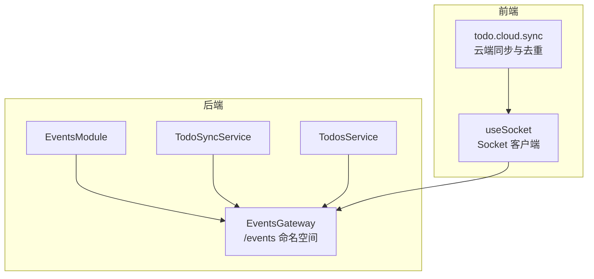
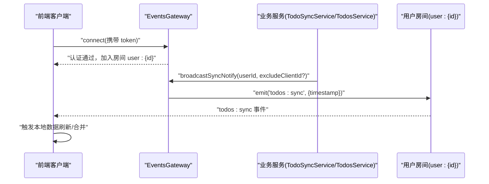
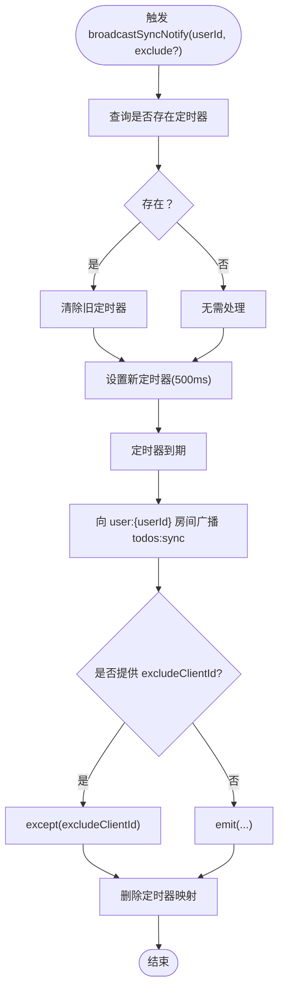
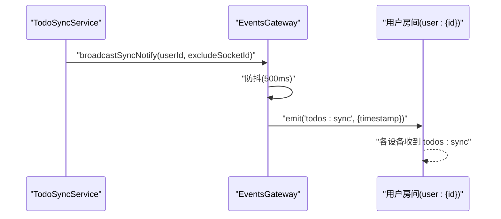
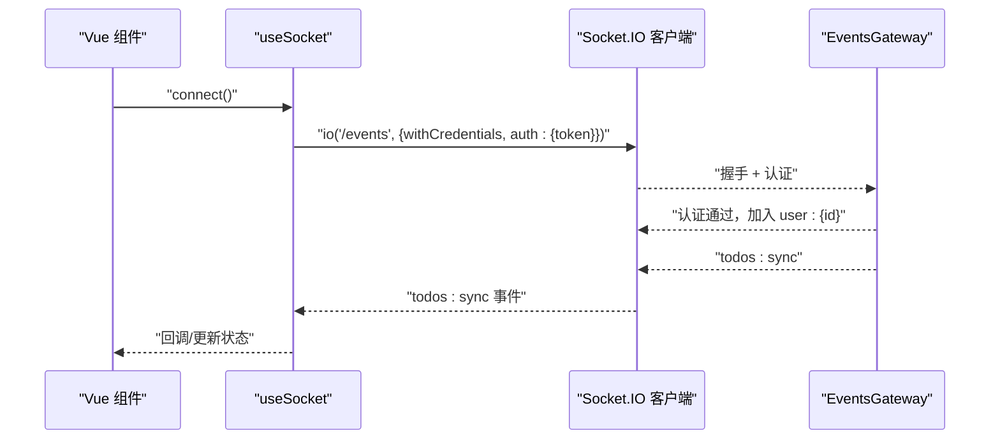
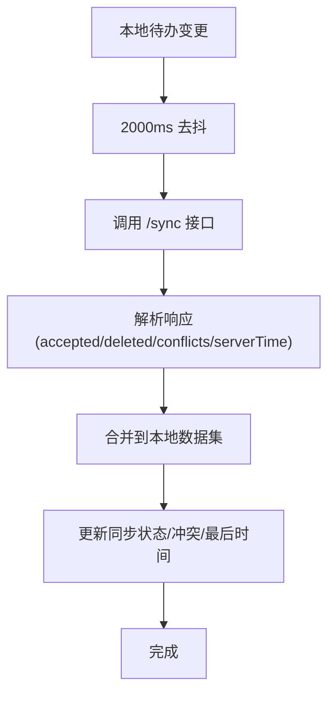
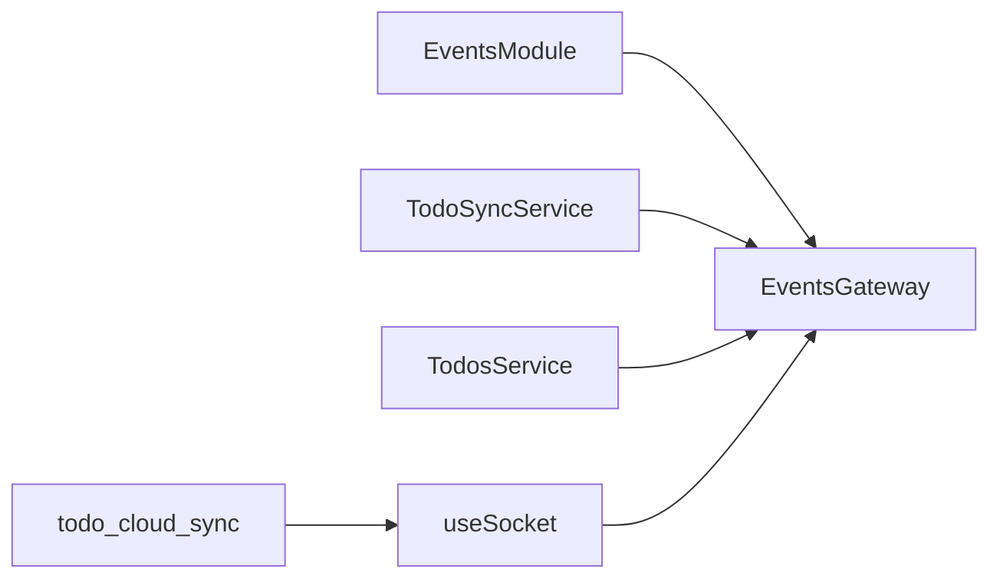

# 广播系统

<cite>
**本文引用的文件**
- [apps/backend/src/events/events.gateway.ts](file://apps/backend/src/events/events.gateway.ts)
- [apps/backend/src/events/events.module.ts](file://apps/backend/src/events/events.module.ts)
- [apps/backend/src/todos/todos-sync.service.ts](file://apps/backend/src/todos/todos-sync.service.ts)
- [apps/backend/src/todos/todos.service.ts](file://apps/backend/src/todos/todos.service.ts)
- [apps/frontend/src/composables/useSocket.ts](file://apps/frontend/src/composables/useSocket.ts)
- [apps/frontend/src/features/todo/stores/todo.cloud.sync.ts](file://apps/frontend/src/features/todo/stores/todo.cloud.sync.ts)
- [apps/backend/tests/events/events.gateway.spec.ts](file://apps/backend/tests/events/events.gateway.spec.ts)
</cite>

## 目录

1. [简介](#简介)
2. [项目结构](#项目结构)
3. [核心组件](#核心组件)
4. [架构总览](#架构总览)
5. [详细组件分析](#详细组件分析)
6. [依赖关系分析](#依赖关系分析)
7. [性能考量](#性能考量)
8. [故障排查指南](#故障排查指南)
9. [结论](#结论)
10. [附录](#附录)

## 简介

本文件系统性阐述 Lumina Todo 的广播系统，覆盖以下主题：

- 广播类型：用户房间广播、全局广播、条件广播
- 防抖机制：500ms 防抖窗口与定时器管理策略
- 触发时机：任务同步通知、用户状态变更等
- 数据序列化与传输格式：事件名约定、消息体结构
- 去重与性能优化：服务端防抖、客户端节流与重连策略
- 实战示例：如何在业务逻辑中触发广播、如何处理接收方数据更新
- 监控与调试：日志、错误分类与重连参数

## 项目结构

广播系统由后端 WebSocket 网关与前端 Socket 客户端共同组成，围绕“用户房间”进行广播分发，并通过服务层在关键业务操作后触发广播。

图表来源

- [apps/backend/src/events/events.gateway.ts:57-265](file://apps/backend/src/events/events.gateway.ts#L57-L265)
- [apps/backend/src/events/events.module.ts:1-15](file://apps/backend/src/events/events.module.ts#L1-L15)
- [apps/backend/src/todos/todos-sync.service.ts:42-226](file://apps/backend/src/todos/todos-sync.service.ts#L42-L226)
- [apps/backend/src/todos/todos.service.ts:28-147](file://apps/backend/src/todos/todos.service.ts#L28-L147)
- [apps/frontend/src/composables/useSocket.ts:56-191](file://apps/frontend/src/composables/useSocket.ts#L56-L191)
- [apps/frontend/src/features/todo/stores/todo.cloud.sync.ts:25-187](file://apps/frontend/src/features/todo/stores/todo.cloud.sync.ts#L25-L187)

章节来源

- [apps/backend/src/events/events.gateway.ts:1-266](file://apps/backend/src/events/events.gateway.ts#L1-L266)
- [apps/backend/src/events/events.module.ts:1-15](file://apps/backend/src/events/events.module.ts#L1-L15)
- [apps/frontend/src/composables/useSocket.ts:1-191](file://apps/frontend/src/composables/useSocket.ts#L1-L191)

## 核心组件

- 后端网关 EventsGateway
  - 负责认证中间件、CORS 白名单校验、房间加入/离开、消息转发、全局广播与用户房间广播
  - 提供服务间调用接口：向房间广播、向全站广播
  - 内置防抖：对同一用户的广播进行 500ms 防抖，避免风暴
- 业务服务
  - TodoSyncService：在增量同步成功后触发用户房间广播
  - TodosService：在恢复/永久删除/清空回收站等操作后触发用户房间广播
- 前端 Socket 客户端 useSocket
  - 初始化连接、鉴权、重连、错误分类与日志冷却
  - 自动加入用户房间 user:{id}
- 前端云同步 todo.cloud.sync
  - 对本地变更进行 2000ms 去抖，避免频繁网络请求
  - 将当前 Socket ID 作为参数传递给后端，便于服务端排除广播发送方

章节来源

- [apps/backend/src/events/events.gateway.ts:57-265](file://apps/backend/src/events/events.gateway.ts#L57-L265)
- [apps/backend/src/todos/todos-sync.service.ts:42-226](file://apps/backend/src/todos/todos-sync.service.ts#L42-L226)
- [apps/backend/src/todos/todos.service.ts:28-147](file://apps/backend/src/todos/todos.service.ts#L28-L147)
- [apps/frontend/src/composables/useSocket.ts:56-191](file://apps/frontend/src/composables/useSocket.ts#L56-L191)
- [apps/frontend/src/features/todo/stores/todo.cloud.sync.ts:25-187](file://apps/frontend/src/features/todo/stores/todo.cloud.sync.ts#L25-L187)

## 架构总览

广播系统采用“服务驱动广播”的设计：业务层在完成关键写操作后，调用网关提供的广播接口；网关根据目标维度（房间/全站）进行消息分发；前端客户端订阅对应事件并更新本地状态。

图表来源

- [apps/backend/src/events/events.gateway.ts:177-202](file://apps/backend/src/events/events.gateway.ts#L177-L202)
- [apps/backend/src/todos/todos-sync.service.ts:212-215](file://apps/backend/src/todos/todos-sync.service.ts#L212-L215)
- [apps/backend/src/todos/todos.service.ts:83-84](file://apps/backend/src/todos/todos.service.ts#L83-L84)
- [apps/frontend/src/composables/useSocket.ts:79-86](file://apps/frontend/src/composables/useSocket.ts#L79-L86)

## 详细组件分析

### 后端网关 EventsGateway

- 认证中间件
  - 从握手头部或 auth 字段提取 token，验证并检查会话是否失效
  - 成功后将用户信息写入 socket.data.user
- CORS 与命名空间
  - 支持多 origin 白名单、开发环境特殊前缀、凭证与显式允许头
  - 命名空间 /events，传输协议 polling/websocket
- 房间与权限
  - 自动加入 user:{id} 房间
  - join/leave 仅允许访问自身房间，防止越权
- 广播接口
  - 用户房间广播：broadcastSyncNotify(userId, excludeClientId?)
  - 房间级广播：broadcastToRoom(room, event, data)
  - 全局广播：broadcastToAll(event, data)
- 防抖实现
  - 使用 Map<number, NodeJS.Timeout> 维护每个用户的定时器
  - 500ms 窗口内重复触发会取消旧定时器并重设
  - 定时器到期后执行广播并清理映射

图表来源

- [apps/backend/src/events/events.gateway.ts:180-202](file://apps/backend/src/events/events.gateway.ts#L180-L202)

章节来源

- [apps/backend/src/events/events.gateway.ts:20-56](file://apps/backend/src/events/events.gateway.ts#L20-L56)
- [apps/backend/src/events/events.gateway.ts:86-145](file://apps/backend/src/events/events.gateway.ts#L86-L145)
- [apps/backend/src/events/events.gateway.ts:177-202](file://apps/backend/src/events/events.gateway.ts#L177-L202)
- [apps/backend/src/events/events.gateway.ts:252-264](file://apps/backend/src/events/events.gateway.ts#L252-L264)

### 业务服务与广播触发

- TodoSyncService
  - 在增量同步成功（有写入项）后，调用 broadcastSyncNotify(userId, excludeSocketId)
- TodosService
  - 在恢复、永久删除、清空回收站等写操作后，调用 broadcastSyncNotify(userId)

图表来源

- [apps/backend/src/todos/todos-sync.service.ts:212-215](file://apps/backend/src/todos/todos-sync.service.ts#L212-L215)
- [apps/backend/src/todos/todos.service.ts:83-84](file://apps/backend/src/todos/todos.service.ts#L83-L84)
- [apps/backend/src/todos/todos.service.ts:109-110](file://apps/backend/src/todos/todos.service.ts#L109-L110)
- [apps/backend/src/todos/todos.service.ts:143-144](file://apps/backend/src/todos/todos.service.ts#L143-L144)

章节来源

- [apps/backend/src/todos/todos-sync.service.ts:52-224](file://apps/backend/src/todos/todos-sync.service.ts#L52-L224)
- [apps/backend/src/todos/todos.service.ts:66-144](file://apps/backend/src/todos/todos.service.ts#L66-L144)

### 前端 Socket 客户端 useSocket

- 连接与认证
  - 自动携带 token，连接后加入 user:{id} 房间
  - connect_error 分类处理：鉴权失败自动刷新令牌并重连；瞬时传输错误忽略；其他错误记录并冷却输出
- 生命周期
  - 单例初始化、连接状态 ref、等待连接工具 waitForConnection
- 与后端事件协作
  - 监听 todos:sync，触发本地数据刷新流程

图表来源

- [apps/frontend/src/composables/useSocket.ts:59-111](file://apps/frontend/src/composables/useSocket.ts#L59-L111)
- [apps/frontend/src/composables/useSocket.ts:131-161](file://apps/frontend/src/composables/useSocket.ts#L131-L161)
- [apps/backend/src/events/events.gateway.ts:177-202](file://apps/backend/src/events/events.gateway.ts#L177-L202)

章节来源

- [apps/frontend/src/composables/useSocket.ts:56-191](file://apps/frontend/src/composables/useSocket.ts#L56-L191)

### 前端云同步 todo.cloud.sync

- 本地去抖
  - 2000ms 冷却窗口，避免频繁网络请求
- 云端同步
  - 调用后端接口，携带当前 Socket ID，用于服务端排除广播发送方
  - 解析响应，合并到本地数据集，维护冲突列表与最后同步时间

图表来源

- [apps/frontend/src/features/todo/stores/todo.cloud.sync.ts:15-156](file://apps/frontend/src/features/todo/stores/todo.cloud.sync.ts#L15-L156)
- [apps/frontend/src/features/todo/stores/todo.cloud.sync.ts:56-64](file://apps/frontend/src/features/todo/stores/todo.cloud.sync.ts#L56-L64)

章节来源

- [apps/frontend/src/features/todo/stores/todo.cloud.sync.ts:25-187](file://apps/frontend/src/features/todo/stores/todo.cloud.sync.ts#L25-L187)

## 依赖关系分析

- 模块依赖
  - EventsModule 导出 EventsGateway，供业务模块注入
- 服务依赖
  - TodoSyncService 注入 EventsGateway，负责在同步成功后触发广播
  - TodosService 注入 EventsGateway，负责在关键写操作后触发广播
- 前端依赖
  - useSocket 作为全局 Socket 客户端，统一管理连接与事件
  - todo.cloud.sync 依赖 useSocket 获取当前 Socket ID 并发起同步

图表来源

- [apps/backend/src/events/events.module.ts:9-14](file://apps/backend/src/events/events.module.ts#L9-L14)
- [apps/backend/src/todos/todos-sync.service.ts:43-47](file://apps/backend/src/todos/todos-sync.service.ts#L43-L47)
- [apps/backend/src/todos/todos.service.ts:29-33](file://apps/backend/src/todos/todos.service.ts#L29-L33)
- [apps/frontend/src/composables/useSocket.ts:56-60](file://apps/frontend/src/composables/useSocket.ts#L56-L60)
- [apps/frontend/src/features/todo/stores/todo.cloud.sync.ts](file://apps/frontend/src/features/todo/stores/todo.cloud.sync.ts#L8)

章节来源

- [apps/backend/src/events/events.module.ts:1-15](file://apps/backend/src/events/events.module.ts#L1-L15)
- [apps/backend/src/todos/todos-sync.service.ts:42-47](file://apps/backend/src/todos/todos-sync.service.ts#L42-L47)
- [apps/backend/src/todos/todos.service.ts:28-33](file://apps/backend/src/todos/todos.service.ts#L28-L33)
- [apps/frontend/src/composables/useSocket.ts:56-60](file://apps/frontend/src/composables/useSocket.ts#L56-L60)
- [apps/frontend/src/features/todo/stores/todo.cloud.sync.ts:1-14](file://apps/frontend/src/features/todo/stores/todo.cloud.sync.ts#L1-L14)

## 性能考量

- 服务端防抖
  - 500ms 窗口聚合同一用户的多次广播，显著降低风暴风险
  - 定时器映射避免内存泄漏，模块销毁时统一清理
- 客户端去抖
  - 云端同步 2000ms 冷却，减少网络压力与后端负载
- 传输与重连
  - 前端默认优先 websocket，回退 polling；指数退避重连，上限 5000ms
  - 错误冷却日志，避免噪声刷屏
- 排除广播发送方
  - 后端支持 excludeClientId，避免设备自播自听造成重复处理

章节来源

- [apps/backend/src/events/events.gateway.ts:118-124](file://apps/backend/src/events/events.gateway.ts#L118-L124)
- [apps/backend/src/events/events.gateway.ts:180-202](file://apps/backend/src/events/events.gateway.ts#L180-L202)
- [apps/frontend/src/features/todo/stores/todo.cloud.sync.ts](file://apps/frontend/src/features/todo/stores/todo.cloud.sync.ts#L15)
- [apps/frontend/src/composables/useSocket.ts:64-77](file://apps/frontend/src/composables/useSocket.ts#L64-L77)
- [apps/frontend/src/composables/useSocket.ts:93-108](file://apps/frontend/src/composables/useSocket.ts#L93-L108)

## 故障排查指南

- 认证失败
  - 现象：连接被拒绝，控制台出现 unauthorized
  - 排查：确认 token 是否正确传递、是否过期、是否被服务端判定会话失效
- CORS 拒绝
  - 现象：握手阶段被拒绝
  - 排查：核对 CORS_ORIGIN 环境变量、Origin 是否在白名单或开发前缀匹配
- 房间越权
  - 现象：加入/发送消息到他人房间被拒绝
  - 排查：确保 room 名称格式 user:{id} 与当前用户一致
- 广播风暴
  - 现象：短时间内大量 todos:sync 到达
  - 排查：确认业务层是否在高频写入场景下重复触发广播；检查前端去抖与后端防抖是否生效
- 重复处理
  - 现象：设备自播自听导致重复更新
  - 排查：后端广播接口支持排除发送方；前端确保在收到 todos:sync 后幂等处理
- 日志与冷却
  - 建议：利用前端错误冷却日志定位异常根因，避免重复告警

章节来源

- [apps/backend/src/events/events.gateway.ts:20-56](file://apps/backend/src/events/events.gateway.ts#L20-L56)
- [apps/backend/src/events/events.gateway.ts:77-84](file://apps/backend/src/events/events.gateway.ts#L77-L84)
- [apps/backend/src/events/events.gateway.ts:180-202](file://apps/backend/src/events/events.gateway.ts#L180-L202)
- [apps/frontend/src/composables/useSocket.ts:32-51](file://apps/frontend/src/composables/useSocket.ts#L32-L51)
- [apps/backend/tests/events/events.gateway.spec.ts:37-58](file://apps/backend/tests/events/events.gateway.spec.ts#L37-L58)

## 结论

广播系统以“服务驱动 + 网关统一分发 + 客户端订阅”的模式实现，结合 500ms 服务端防抖与 2000ms 客户端去抖，有效平衡了实时性与性能。通过房间隔离与权限校验，确保广播的安全边界；通过排除发送方与错误分类，提升用户体验与可维护性。建议在高频写入场景下继续强化业务层的批量提交与合并策略，进一步降低广播频率。

## 附录

### 广播事件与数据格式

- 事件名约定
  - todos:sync：任务同步通知
- 消息体结构
  - todos:sync：包含时间戳字段，用于客户端幂等处理
- 传输与序列化
  - 使用 Socket.IO 默认 JSON 序列化，事件名与数据体均为标准对象

章节来源

- [apps/backend/src/events/events.gateway.ts:180-202](file://apps/backend/src/events/events.gateway.ts#L180-L202)
- [apps/frontend/src/composables/useSocket.ts:79-86](file://apps/frontend/src/composables/useSocket.ts#L79-L86)

### 如何在业务逻辑中触发广播

- 增量同步成功后
  - 调用 broadcastSyncNotify(userId, excludeSocketId)
- 关键写操作后
  - 恢复、永久删除、清空回收站等操作完成后调用 broadcastSyncNotify(userId)

章节来源

- [apps/backend/src/todos/todos-sync.service.ts:212-215](file://apps/backend/src/todos/todos-sync.service.ts#L212-L215)
- [apps/backend/src/todos/todos.service.ts:83-84](file://apps/backend/src/todos/todos.service.ts#L83-L84)
- [apps/backend/src/todos/todos.service.ts:109-110](file://apps/backend/src/todos/todos.service.ts#L109-L110)
- [apps/backend/src/todos/todos.service.ts:143-144](file://apps/backend/src/todos/todos.service.ts#L143-L144)

### 如何处理广播接收方的数据更新

- 前端监听 todos:sync
  - 收到事件后触发本地数据刷新流程，合并远端变更、清理冲突、更新最后同步时间
- 去重与幂等
  - 依据时间戳与本地快照判断是否需要更新，避免重复渲染

章节来源

- [apps/frontend/src/composables/useSocket.ts:79-86](file://apps/frontend/src/composables/useSocket.ts#L79-L86)
- [apps/frontend/src/features/todo/stores/todo.cloud.sync.ts:66-138](file://apps/frontend/src/features/todo/stores/todo.cloud.sync.ts#L66-L138)
