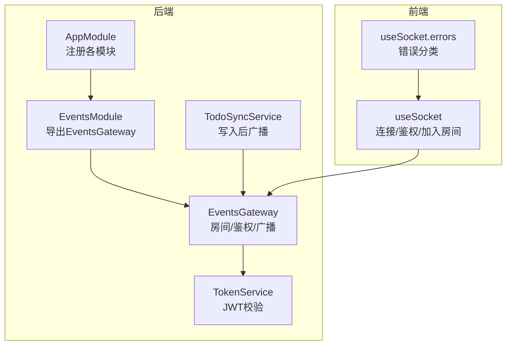
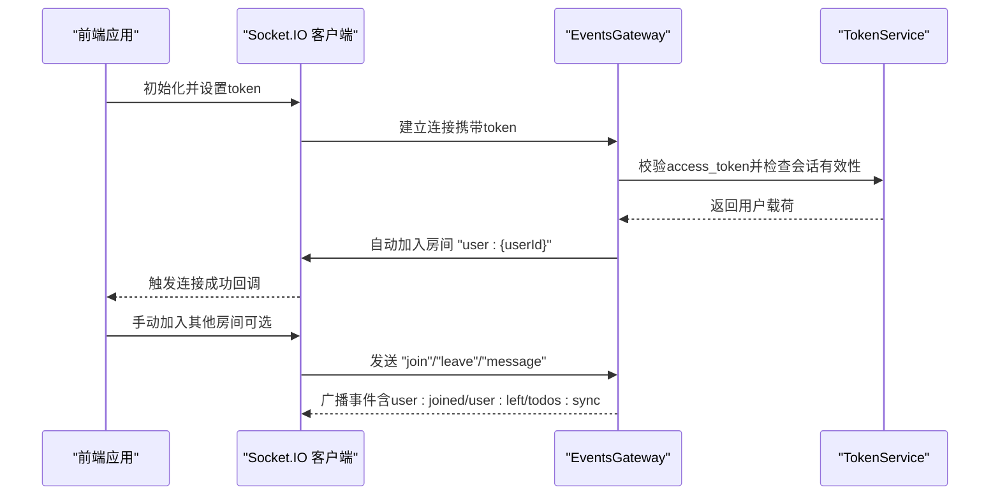
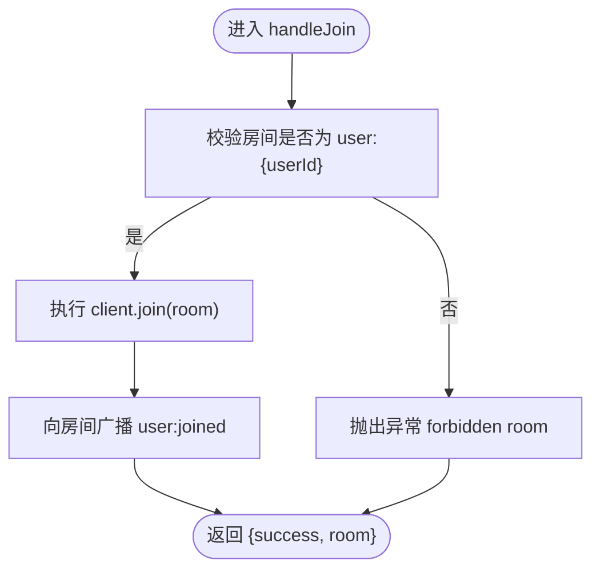
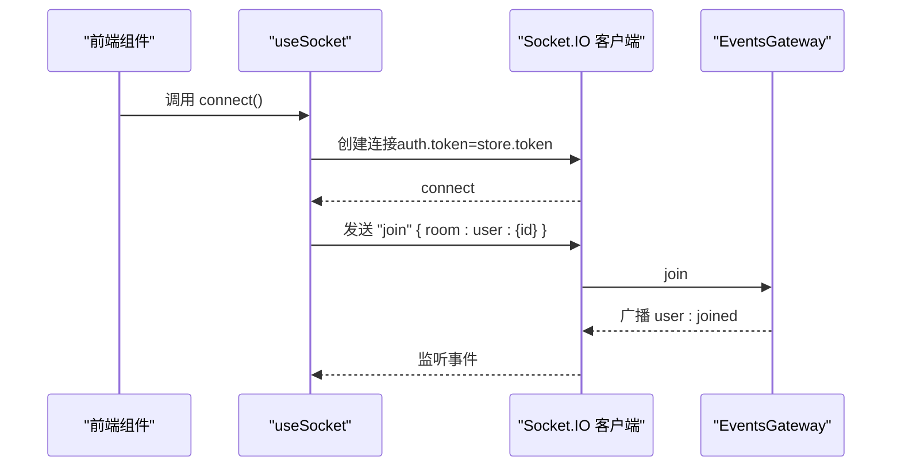
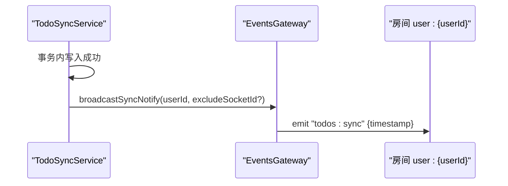
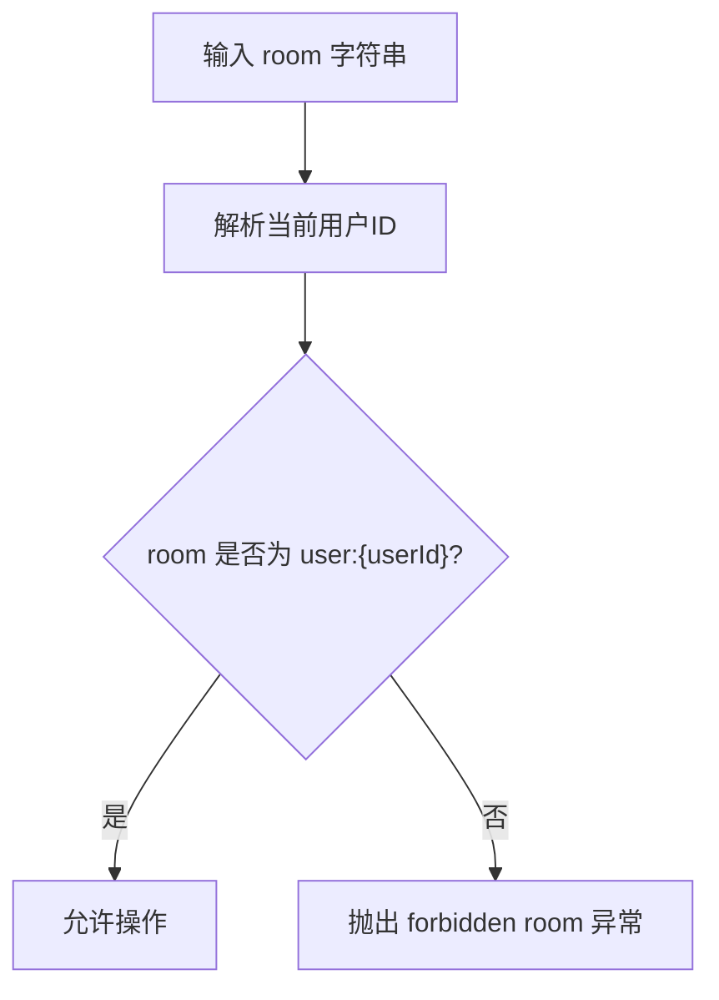
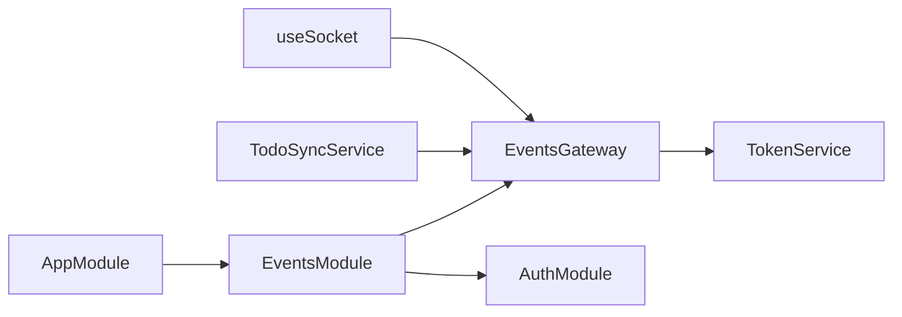

# 房间管理

<cite>
**本文引用的文件**
- [apps/backend/src/events/events.gateway.ts](file://apps/backend/src/events/events.gateway.ts)
- [apps/backend/src/events/events.module.ts](file://apps/backend/src/events/events.module.ts)
- [apps/backend/src/events/index.ts](file://apps/backend/src/events/index.ts)
- [apps/backend/src/app.module.ts](file://apps/backend/src/app.module.ts)
- [apps/backend/src/auth/token.service.ts](file://apps/backend/src/auth/token.service.ts)
- [apps/backend/src/todos/todos-sync.service.ts](file://apps/backend/src/todos/todos-sync.service.ts)
- [apps/frontend/src/composables/useSocket.ts](file://apps/frontend/src/composables/useSocket.ts)
- [apps/frontend/src/composables/useSocket.errors.ts](file://apps/frontend/src/composables/useSocket.errors.ts)
- [apps/backend/tests/events/events.gateway.spec.ts](file://apps/backend/tests/events/events.gateway.spec.ts)
</cite>

## 目录

1. [简介](#简介)
2. [项目结构](#项目结构)
3. [核心组件](#核心组件)
4. [架构总览](#架构总览)
5. [详细组件分析](#详细组件分析)
6. [依赖关系分析](#依赖关系分析)
7. [性能考量](#性能考量)
8. [故障排查指南](#故障排查指南)
9. [结论](#结论)
10. [附录](#附录)

## 简介

本文件面向Lumina Todo的“房间管理”子系统，聚焦以下主题：

- 房间的概念与作用：基于用户维度的私有房间模型，用于隔离与定向广播。
- 用户房间的自动分配机制：连接建立时自动加入“user:{userId}”房间。
- 房间ID生成规则：统一采用“user:{userId}”格式，其中userId来自JWT载荷。
- 房间加入/离开流程：权限校验、房间存在性检查、用户状态更新与事件广播。
- 房间事件处理：user:joined、user:left等事件的触发与处理逻辑。
- 房间内消息传递与广播：消息路由规则、广播范围控制。
- 实战示例：如何实现房间管理功能、权限校验、房间内广播等。

## 项目结构

- 后端通过NestJS的WebSocket网关提供实时通信能力，房间管理由事件网关集中实现。
- 前端通过Socket.IO客户端连接到后端，自动完成鉴权与房间加入。
- 同步服务在关键写入后触发房间级广播，实现跨设备同步通知。

图表来源

- [apps/backend/src/app.module.ts:28-146](file://apps/backend/src/app.module.ts#L28-L146)
- [apps/backend/src/events/events.module.ts:1-14](file://apps/backend/src/events/events.module.ts#L1-L14)
- [apps/backend/src/events/events.gateway.ts:57-265](file://apps/backend/src/events/events.gateway.ts#L57-L265)
- [apps/backend/src/auth/token.service.ts](file://apps/backend/src/auth/token.service.ts)
- [apps/backend/src/todos/todos-sync.service.ts:42-47](file://apps/backend/src/todos/todos-sync.service.ts#L42-L47)
- [apps/frontend/src/composables/useSocket.ts:56-191](file://apps/frontend/src/composables/useSocket.ts#L56-L191)
- [apps/frontend/src/composables/useSocket.errors.ts:1-33](file://apps/frontend/src/composables/useSocket.errors.ts#L1-L33)

章节来源

- [apps/backend/src/app.module.ts:28-146](file://apps/backend/src/app.module.ts#L28-L146)
- [apps/backend/src/events/events.module.ts:1-14](file://apps/backend/src/events/events.module.ts#L1-L14)
- [apps/backend/src/events/events.gateway.ts:57-265](file://apps/backend/src/events/events.gateway.ts#L57-L265)
- [apps/frontend/src/composables/useSocket.ts:56-191](file://apps/frontend/src/composables/useSocket.ts#L56-L191)

## 核心组件

- 事件网关（EventsGateway）
  - 负责WebSocket握手、鉴权、自动房间加入、房间加入/离开、消息转发与广播。
  - 提供对其他服务的广播接口（向房间或全体广播）。
- 事件模块（EventsModule）
  - 导出事件网关，注入认证模块。
- 前端Socket组合式函数（useSocket）
  - 维护连接生命周期、鉴权失败自动刷新、连接后自动加入用户房间。
- 同步服务（TodoSyncService）
  - 在写入成功后调用事件网关进行房间广播，实现跨设备同步通知。

章节来源

- [apps/backend/src/events/events.gateway.ts:57-265](file://apps/backend/src/events/events.gateway.ts#L57-L265)
- [apps/backend/src/events/events.module.ts:1-14](file://apps/backend/src/events/events.module.ts#L1-L14)
- [apps/frontend/src/composables/useSocket.ts:56-191](file://apps/frontend/src/composables/useSocket.ts#L56-L191)
- [apps/backend/src/todos/todos-sync.service.ts:42-47](file://apps/backend/src/todos/todos-sync.service.ts#L42-L47)

## 架构总览

房间管理围绕“用户房间”展开，核心流程如下：

- 连接建立：后端中间件校验JWT；成功后自动加入“user:{userId}”房间。
- 权限校验：所有房间相关操作均要求房间名与当前用户ID一致。
- 房间事件：加入/离开时广播user:joined/user:left；写入后广播todos:sync。
- 消息广播：支持房间内广播与全服广播，支持排除特定客户端。

图表来源

- [apps/backend/src/events/events.gateway.ts:86-141](file://apps/backend/src/events/events.gateway.ts#L86-L141)
- [apps/backend/src/auth/token.service.ts](file://apps/backend/src/auth/token.service.ts)
- [apps/frontend/src/composables/useSocket.ts:74-108](file://apps/frontend/src/composables/useSocket.ts#L74-L108)

## 详细组件分析

### 事件网关（EventsGateway）

- 鉴权中间件
  - 从握手参数或头部提取token，调用TokenService校验；若会话失效则拒绝。
- 自动房间加入
  - 连接成功后，自动加入“user:{userId}”房间，确保每个用户设备都在其私有房间中。
- 房间加入/离开
  - 仅允许加入与当前用户绑定的房间；加入成功后向房间内其他成员广播user:joined；离开后广播user:left。
- 消息处理
  - 若携带room字段：仅允许发送至与当前用户绑定的房间；向该房间广播消息；否则向全体广播（除发送者）。
- 广播接口
  - 对外暴露broadcastToRoom与broadcastToAll，供其他服务调用。
- 同步通知防抖
  - 对同一用户的广播进行500ms去抖，避免频繁通知导致的风暴。

图表来源

- [apps/backend/src/events/events.gateway.ts:207-226](file://apps/backend/src/events/events.gateway.ts#L207-L226)

章节来源

- [apps/backend/src/events/events.gateway.ts:86-141](file://apps/backend/src/events/events.gateway.ts#L86-L141)
- [apps/backend/src/events/events.gateway.ts:207-250](file://apps/backend/src/events/events.gateway.ts#L207-L250)
- [apps/backend/src/events/events.gateway.ts:150-175](file://apps/backend/src/events/events.gateway.ts#L150-L175)
- [apps/backend/src/events/events.gateway.ts:177-202](file://apps/backend/src/events/events.gateway.ts#L177-L202)

### 前端Socket组合式函数（useSocket）

- 连接与鉴权
  - 使用withCredentials与path配置连接到后端/events命名空间；auth携带token。
  - 连接成功后，若存在用户ID则主动发送“join”加入“user:{userId}”房间。
- 错误处理
  - 对认证类错误尝试刷新token并重连；对瞬时传输错误进行忽略或冷却记录。
- 生命周期
  - 提供connect/disconnect/waitForConnection等方法，便于上层组件管理。

图表来源

- [apps/frontend/src/composables/useSocket.ts:56-108](file://apps/frontend/src/composables/useSocket.ts#L56-L108)
- [apps/frontend/src/composables/useSocket.ts:83-85](file://apps/frontend/src/composables/useSocket.ts#L83-L85)

章节来源

- [apps/frontend/src/composables/useSocket.ts:56-191](file://apps/frontend/src/composables/useSocket.ts#L56-L191)
- [apps/frontend/src/composables/useSocket.errors.ts:1-33](file://apps/frontend/src/composables/useSocket.errors.ts#L1-L33)

### 同步服务（TodoSyncService）

- 写入后广播
  - 在事务内成功写入后，调用EventsGateway.broadcastSyncNotify(userId, excludeSocketId)，向用户房间广播todos:sync事件。
- 广播防抖
  - 通过内部定时器实现500ms去抖，避免高频写入引发的重复广播。

图表来源

- [apps/backend/src/todos/todos-sync.service.ts:213-215](file://apps/backend/src/todos/todos-sync.service.ts#L213-L215)
- [apps/backend/src/events/events.gateway.ts:177-202](file://apps/backend/src/events/events.gateway.ts#L177-L202)

章节来源

- [apps/backend/src/todos/todos-sync.service.ts:42-47](file://apps/backend/src/todos/todos-sync.service.ts#L42-L47)
- [apps/backend/src/todos/todos-sync.service.ts:213-215](file://apps/backend/src/todos/todos-sync.service.ts#L213-L215)

### 房间ID生成规则与权限校验

- 房间ID规则
  - 统一采用“user:{userId}”，其中userId来自JWT载荷中的sub字段。
- 权限校验
  - 所有房间相关操作（join/leave/message）均调用ensureOwnRoomAccess，确保room必须等于“user:{当前用户ID}”。

图表来源

- [apps/backend/src/events/events.gateway.ts:77-84](file://apps/backend/src/events/events.gateway.ts#L77-L84)

章节来源

- [apps/backend/src/events/events.gateway.ts:77-84](file://apps/backend/src/events/events.gateway.ts#L77-L84)

### 房间事件处理机制

- user:joined
  - 在handleJoin成功后，向房间内其他成员广播user:joined，包含userId与room。
- user:left
  - 在handleLeave成功后，向房间广播user:left，包含userId与room。
- todos:sync
  - 在TodoSyncService写入成功后，通过broadcastSyncNotify触发，向用户房间广播todos:sync（可排除发送方）。

章节来源

- [apps/backend/src/events/events.gateway.ts:220-224](file://apps/backend/src/events/events.gateway.ts#L220-L224)
- [apps/backend/src/events/events.gateway.ts:244-247](file://apps/backend/src/events/events.gateway.ts#L244-L247)
- [apps/backend/src/events/events.gateway.ts:180-202](file://apps/backend/src/events/events.gateway.ts#L180-L202)

### 房间内消息传递与广播范围控制

- 指定房间广播
  - 当message携带room字段且通过权限校验时，向该房间广播消息。
- 全体广播（除发送者）
  - 当message未携带room字段时，使用client.broadcast向所有客户端广播。
- 排除特定客户端
  - 广播到房间时支持except(excludeClientId)，用于避免向发送方重复推送。

章节来源

- [apps/backend/src/events/events.gateway.ts:150-175](file://apps/backend/src/events/events.gateway.ts#L150-L175)
- [apps/backend/src/events/events.gateway.ts:255-257](file://apps/backend/src/events/events.gateway.ts#L255-L257)

## 依赖关系分析

- 模块依赖
  - AppModule导入EventsModule；EventsModule导入AuthModule并导出EventsGateway。
- 组件耦合
  - EventsGateway依赖TokenService进行JWT校验；TodoSyncService依赖EventsGateway进行广播。
- 外部集成
  - 前端通过Socket.IO客户端连接后端/events命名空间，遵循CORS与传输配置。

图表来源

- [apps/backend/src/app.module.ts:134-140](file://apps/backend/src/app.module.ts#L134-L140)
- [apps/backend/src/events/events.module.ts:9-12](file://apps/backend/src/events/events.module.ts#L9-L12)
- [apps/backend/src/events/events.gateway.ts:66](file://apps/backend/src/events/events.gateway.ts#L66)
- [apps/backend/src/todos/todos-sync.service.ts:42-47](file://apps/backend/src/todos/todos-sync.service.ts#L42-L47)
- [apps/frontend/src/composables/useSocket.ts:64-77](file://apps/frontend/src/composables/useSocket.ts#L64-L77)

章节来源

- [apps/backend/src/app.module.ts:134-140](file://apps/backend/src/app.module.ts#L134-L140)
- [apps/backend/src/events/events.module.ts:9-12](file://apps/backend/src/events/events.module.ts#L9-L12)
- [apps/backend/src/events/events.gateway.ts:66](file://apps/backend/src/events/events.gateway.ts#L66)
- [apps/backend/src/todos/todos-sync.service.ts:42-47](file://apps/backend/src/todos/todos-sync.service.ts#L42-L47)
- [apps/frontend/src/composables/useSocket.ts:64-77](file://apps/frontend/src/composables/useSocket.ts#L64-L77)

## 性能考量

- 广播防抖
  - 同步通知采用500ms去抖，减少高频写入带来的广播风暴。
- 连接与重连
  - 前端配置了指数回退与最大重连时间，提升网络波动下的稳定性。
- 传输选择
  - 开发环境优先polling，生产环境优先websocket，兼顾兼容性与性能。

章节来源

- [apps/backend/src/events/events.gateway.ts:177-202](file://apps/backend/src/events/events.gateway.ts#L177-L202)
- [apps/frontend/src/composables/useSocket.ts:10-17](file://apps/frontend/src/composables/useSocket.ts#L10-L17)
- [apps/frontend/src/composables/useSocket.ts:64-77](file://apps/frontend/src/composables/useSocket.ts#L64-L77)

## 故障排查指南

- 常见错误类型
  - 未授权：握手阶段缺少token或校验失败。
  - 房间访问被拒：尝试加入非自身房间。
  - 传输瞬时错误：超时、传输关闭等，属于可恢复错误。
- 前端处理策略
  - 认证类错误：尝试刷新token并重连。
  - 瞬时错误：忽略或冷却记录，避免日志刷屏。
- 后端日志
  - 关注连接、鉴权、房间加入/离开与广播的关键日志，定位异常场景。

章节来源

- [apps/frontend/src/composables/useSocket.errors.ts:8-32](file://apps/frontend/src/composables/useSocket.errors.ts#L8-L32)
- [apps/frontend/src/composables/useSocket.ts:93-108](file://apps/frontend/src/composables/useSocket.ts#L93-L108)
- [apps/backend/src/events/events.gateway.ts:86-116](file://apps/backend/src/events/events.gateway.ts#L86-L116)

## 结论

Lumina Todo的房间管理以“用户房间”为核心，结合严格的权限校验与高效的广播机制，实现了安全、低耦合、易扩展的实时通信能力。后端通过事件网关统一处理鉴权、房间与广播，前端通过useSocket简化接入与错误处理，同步服务在关键写入后触发房间广播，确保多设备一致性。

## 附录

### 示例：实现房间管理功能（后端）

- 在事件网关中添加新的房间事件处理函数，复用ensureOwnRoomAccess进行权限校验。
- 使用server.to(room).emit或client.to(room).emit实现房间内广播。
- 使用server.emit或client.broadcast.emit实现全体广播。

章节来源

- [apps/backend/src/events/events.gateway.ts:207-250](file://apps/backend/src/events/events.gateway.ts#L207-L250)
- [apps/backend/src/events/events.gateway.ts:255-264](file://apps/backend/src/events/events.gateway.ts#L255-L264)

### 示例：实现房间权限验证（后端）

- 在处理任何房间相关请求前，调用ensureOwnRoomAccess，确保room与当前用户ID一致。
- 对于非房间相关请求，先调用getAuthorizedUserId解析用户ID。

章节来源

- [apps/backend/src/events/events.gateway.ts:77-84](file://apps/backend/src/events/events.gateway.ts#L77-L84)
- [apps/backend/src/events/events.gateway.ts:68-75](file://apps/backend/src/events/events.gateway.ts#L68-L75)

### 示例：在房间内进行消息广播（后端）

- 指定房间：server.to(room).emit('event', data)
- 排除发送者：client.to(room).emit('event', data)
- 全体广播（除发送者）：client.broadcast.emit('event', data)

章节来源

- [apps/backend/src/events/events.gateway.ts:150-175](file://apps/backend/src/events/events.gateway.ts#L150-L175)
- [apps/backend/src/events/events.gateway.ts:244-247](file://apps/backend/src/events/events.gateway.ts#L244-L247)

### 示例：前端加入/离开房间与事件监听

- 连接成功后主动发送“join”加入“user:{userId}”房间。
- 监听user:joined/user:left/todos:sync等事件，更新UI或触发本地同步。

章节来源

- [apps/frontend/src/composables/useSocket.ts:83-85](file://apps/frontend/src/composables/useSocket.ts#L83-L85)
- [apps/frontend/src/composables/useSocket.ts:79-91](file://apps/frontend/src/composables/useSocket.ts#L79-L91)

### 单元测试参考

- 测试覆盖：禁止加入他人房间、允许加入本人房间、禁止向他人房间发送消息等。

章节来源

- [apps/backend/tests/events/events.gateway.spec.ts:37-58](file://apps/backend/tests/events/events.gateway.spec.ts#L37-L58)
