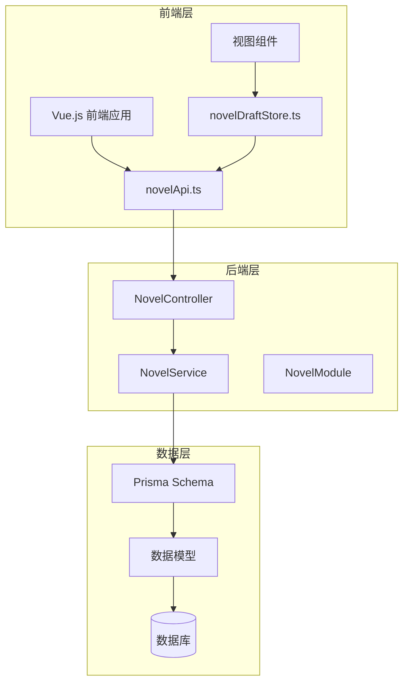
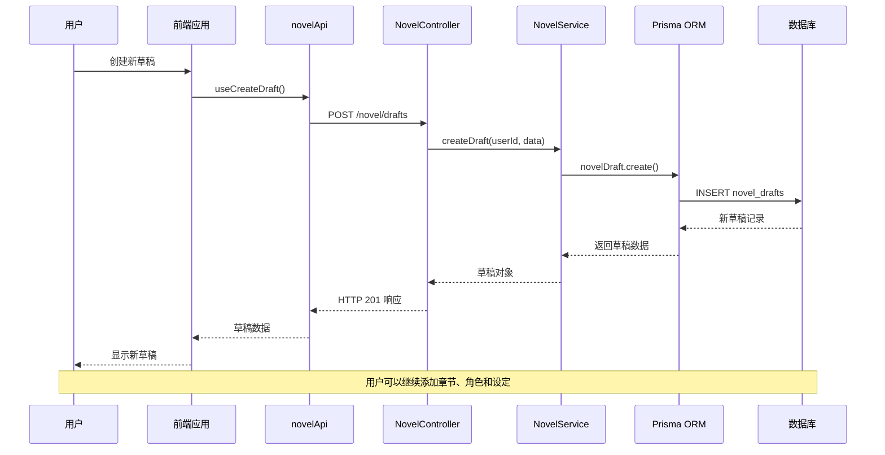
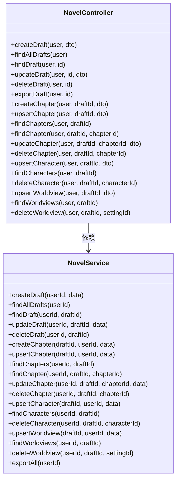
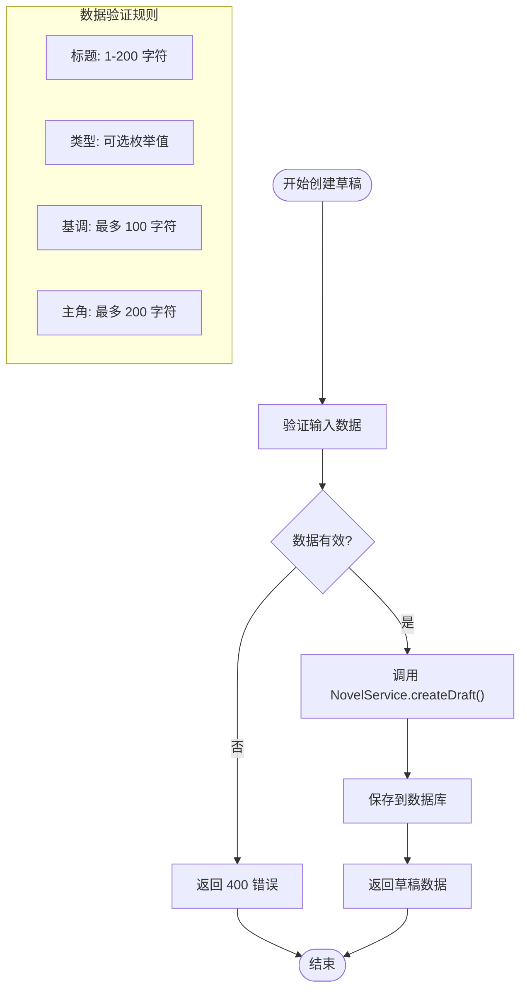
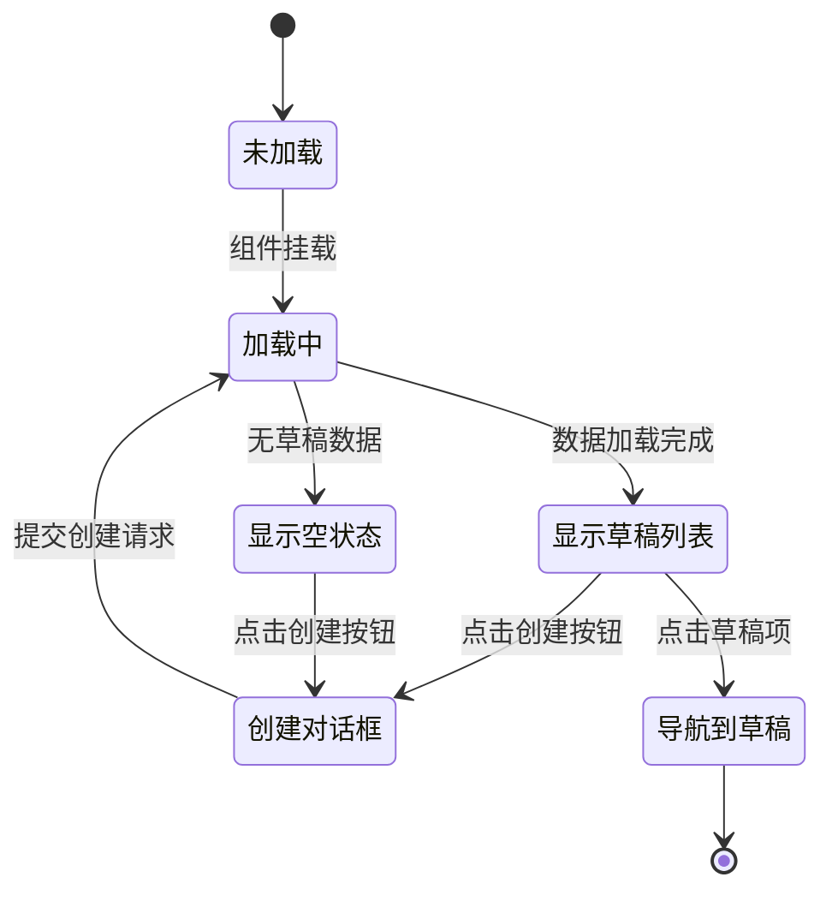
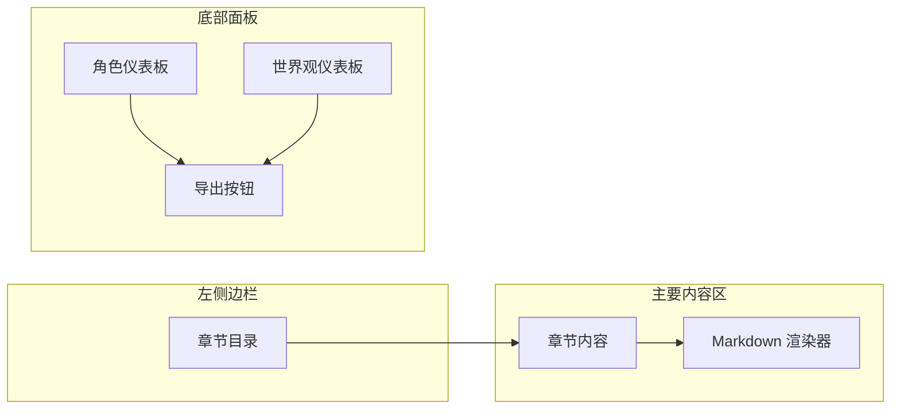
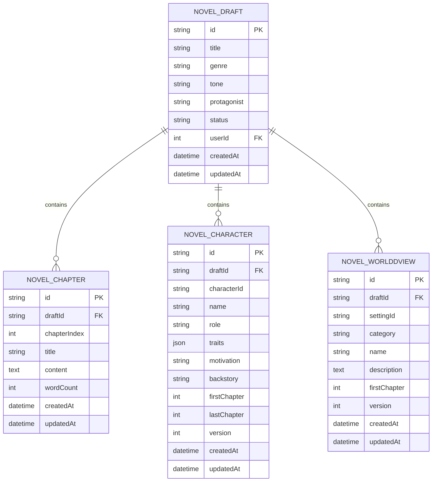

# 小说写作模式

<cite>
**本文档引用的文件**
- [apps/backend/src/novel/novel.controller.ts](file://apps/backend/src/novel/novel.controller.ts)
- [apps/backend/src/novel/novel.service.ts](file://apps/backend/src/novel/novel.service.ts)
- [apps/backend/src/novel/novel.module.ts](file://apps/backend/src/novel/novel.module.ts)
- [apps/backend/src/novel/dto/novel.dto.ts](file://apps/backend/src/novel/dto/novel.dto.ts)
- [apps/backend/prisma/schema/novel.prisma](file://apps/backend/prisma/schema/novel.prisma)
- [packages/shared/src/schemas/novel.schema.ts](file://packages/shared/src/schemas/novel.schema.ts)
- [apps/frontend/src/features/novel/api/novelApi.ts](file://apps/frontend/src/features/novel/api/novelApi.ts)
- [apps/frontend/src/features/novel/stores/novelDraftStore.ts](file://apps/frontend/src/features/novel/stores/novelDraftStore.ts)
- [apps/frontend/src/features/novel/views/NovelBookshelfView.vue](file://apps/frontend/src/features/novel/views/NovelBookshelfView.vue)
- [apps/frontend/src/features/novel/views/NovelDraftView.vue](file://apps/frontend/src/features/novel/views/NovelDraftView.vue)
</cite>

## 目录
1. [简介](#简介)
2. [项目结构](#项目结构)
3. [核心组件](#核心组件)
4. [架构概览](#架构概览)
5. [详细组件分析](#详细组件分析)
6. [依赖关系分析](#依赖关系分析)
7. [性能考虑](#性能考虑)
8. [故障排除指南](#故障排除指南)
9. [结论](#结论)

## 简介

小说写作模式是 Lumina 应用程序中的一个核心功能模块，为用户提供了一个完整的数字化小说创作环境。该系统支持用户创建和管理小说草稿、编写章节内容、维护角色信息以及构建世界观设定。通过前后端分离的架构设计，用户可以在云端安全地存储和同步他们的创作内容。

该模块采用 NestJS 后端框架和 Vue.js 前端技术栈，结合 Prisma ORM 进行数据持久化，为用户提供流畅的创作体验。系统支持多种小说类型（奇幻、科幻、言情、悬疑等），并提供了完整的 CRUD 操作接口来管理创作过程中的各种元素。

## 项目结构

小说写作模式在项目中采用了清晰的分层架构，主要分为后端 API 层、数据模型层和前端展示层三个部分：



**图表来源**
- [apps/frontend/src/features/novel/api/novelApi.ts:1-176](file://apps/frontend/src/features/novel/api/novelApi.ts#L1-L176)
- [apps/backend/src/novel/novel.controller.ts:1-196](file://apps/backend/src/novel/novel.controller.ts#L1-L196)
- [apps/backend/src/novel/novel.service.ts:1-253](file://apps/backend/src/novel/novel.service.ts#L1-L253)

**章节来源**
- [apps/backend/src/novel/novel.module.ts:1-11](file://apps/backend/src/novel/novel.module.ts#L1-L11)
- [apps/backend/prisma/schema/novel.prisma:1-74](file://apps/backend/prisma/schema/novel.prisma#L1-L74)

## 核心组件

小说写作模式包含以下核心组件：

### 后端服务组件
- **NovelController**: 处理所有小说相关的 HTTP 请求，提供 RESTful API 接口
- **NovelService**: 实现业务逻辑，包括草稿管理、章节处理、角色维护和世界观构建
- **DTO 验证**: 使用 Zod 模式验证输入数据的完整性和正确性

### 前端展示组件
- **NovelBookshelfView**: 小说书架界面，用于管理用户的草稿列表
- **NovelDraftView**: 草稿详情界面，显示章节内容和创作工具
- **novelApi**: Vue Query 集成的 API 客户端，处理数据获取和缓存
- **novelDraftStore**: Pinia 状态管理，维护当前激活的草稿信息

### 数据模型组件
- **NovelDraft**: 小说草稿实体，包含标题、类型、主题等基本信息
- **NovelChapter**: 章节实体，管理章节索引、标题、内容和字数统计
- **NovelCharacter**: 角色实体，维护角色标识、名称、身份和背景故事
- **NovelWorldview**: 世界观实体，组织地理、文化、魔法系统等设定信息

**章节来源**
- [apps/backend/src/novel/novel.controller.ts:31-196](file://apps/backend/src/novel/novel.controller.ts#L31-L196)
- [apps/backend/src/novel/novel.service.ts:8-253](file://apps/backend/src/novel/novel.service.ts#L8-L253)
- [apps/frontend/src/features/novel/views/NovelBookshelfView.vue:1-173](file://apps/frontend/src/features/novel/views/NovelBookshelfView.vue#L1-L173)

## 架构概览

小说写作模式采用典型的三层架构设计，实现了清晰的关注点分离：



**图表来源**
- [apps/frontend/src/features/novel/api/novelApi.ts:38-53](file://apps/frontend/src/features/novel/api/novelApi.ts#L38-L53)
- [apps/backend/src/novel/novel.controller.ts:36-40](file://apps/backend/src/novel/novel.controller.ts#L36-L40)
- [apps/backend/src/novel/novel.service.ts:14-22](file://apps/backend/src/novel/novel.service.ts#L14-L22)

系统架构的关键特点包括：

1. **认证授权**: 所有 API 端点都使用 JWT 认证保护
2. **数据验证**: 前后端双重数据验证确保数据完整性
3. **状态管理**: 前端使用 Vue Query 进行数据缓存和状态管理
4. **错误处理**: 统一的异常处理机制提供一致的错误响应
5. **版本控制**: 角色和世界观支持版本追踪

## 详细组件分析

### 后端控制器分析

NovelController 提供了完整的小说创作管理接口，按照资源类型进行组织：



**图表来源**
- [apps/backend/src/novel/novel.controller.ts:31-196](file://apps/backend/src/novel/novel.controller.ts#L31-L196)
- [apps/backend/src/novel/novel.service.ts:9-253](file://apps/backend/src/novel/novel.service.ts#L9-L253)

#### 草稿管理流程



**图表来源**
- [apps/backend/src/novel/novel.controller.ts:36-40](file://apps/backend/src/novel/novel.controller.ts#L36-L40)
- [packages/shared/src/schemas/novel.schema.ts:46-59](file://packages/shared/src/schemas/novel.schema.ts#L46-L59)

**章节来源**
- [apps/backend/src/novel/novel.controller.ts:34-74](file://apps/backend/src/novel/novel.controller.ts#L34-L74)
- [apps/backend/src/novel/novel.service.ts:14-51](file://apps/backend/src/novel/novel.service.ts#L14-L51)

### 前端组件分析

#### 小说书架视图

NovelBookshelfView 提供了用户管理草稿的主界面：



**图表来源**
- [apps/frontend/src/features/novel/views/NovelBookshelfView.vue:17-67](file://apps/frontend/src/features/novel/views/NovelBookshelfView.vue#L17-L67)

#### 草稿详情视图

NovelDraftView 展示了单个草稿的详细信息和创作工具：



**图表来源**
- [apps/frontend/src/features/novel/views/NovelDraftView.vue:100-152](file://apps/frontend/src/features/novel/views/NovelDraftView.vue#L100-L152)

**章节来源**
- [apps/frontend/src/features/novel/views/NovelBookshelfView.vue:1-173](file://apps/frontend/src/features/novel/views/NovelBookshelfView.vue#L1-L173)
- [apps/frontend/src/features/novel/views/NovelDraftView.vue:1-155](file://apps/frontend/src/features/novel/views/NovelDraftView.vue#L1-L155)

### 数据模型分析

小说写作模式的数据模型设计遵循了良好的数据库规范化原则：



**图表来源**
- [apps/backend/prisma/schema/novel.prisma:1-74](file://apps/backend/prisma/schema/novel.prisma#L1-L74)

**章节来源**
- [apps/backend/prisma/schema/novel.prisma:1-74](file://apps/backend/prisma/schema/novel.prisma#L1-L74)
- [packages/shared/src/schemas/novel.schema.ts:1-161](file://packages/shared/src/schemas/novel.schema.ts#L1-L161)

## 依赖关系分析

小说写作模式的依赖关系体现了清晰的分层架构：

```mermaid
graph TD
subgraph "外部依赖"
NestJS[NestJS 框架]
Vue[Vue.js 框架]
Prisma[Prisma ORM]
Zod[Zod 数据验证]
end
subgraph "共享包"
Shared[@lumina/shared]
Schemas[数据模式定义]
end
subgraph "后端模块"
Backend[apps/backend]
Controllers[控制器层]
Services[服务层]
PrismaSchema[数据库模式]
end
subgraph "前端模块"
Frontend[apps/frontend]
Views[视图组件]
Stores[状态管理]
API[API 客户端]
end
NestJS --> Backend
Vue --> Frontend
Prisma --> PrismaSchema
Zod --> Schemas
Shared --> Schemas
Shared --> Controllers
Shared --> API
Backend --> Controllers
Backend --> Services
Backend --> PrismaSchema
Frontend --> Views
Frontend --> Stores
Frontend --> API
Controllers --> Services
Services --> PrismaSchema
API --> Controllers
```

**图表来源**
- [apps/backend/src/novel/novel.module.ts:5-9](file://apps/backend/src/novel/novel.module.ts#L5-L9)
- [apps/frontend/src/features/novel/api/novelApi.ts:1-176](file://apps/frontend/src/features/novel/api/novelApi.ts#L1-L176)

**章节来源**
- [apps/backend/src/novel/dto/novel.dto.ts:1-17](file://apps/backend/src/novel/dto/novel.dto.ts#L1-L17)
- [packages/shared/src/schemas/novel.schema.ts:1-161](file://packages/shared/src/schemas/novel.schema.ts#L1-L161)

## 性能考虑

小说写作模式在设计时充分考虑了性能优化：

### 缓存策略
- **查询缓存**: Vue Query 提供智能缓存机制，减少重复请求
- **数据过期**: 30分钟垃圾回收时间，平衡数据新鲜度和性能
- **增量更新**: 支持局部数据更新，避免全量刷新

### 数据优化
- **懒加载**: 章节内容按需加载，提升初始渲染速度
- **索引优化**: 关键字段建立数据库索引，加速查询操作
- **批量操作**: 支持批量导出功能，提高大数据量处理效率

### 前端性能
- **虚拟滚动**: 大列表使用虚拟滚动技术
- **组件拆分**: 功能组件独立打包，支持按需加载
- **状态管理**: Pinia 提供轻量级状态管理

## 故障排除指南

### 常见问题及解决方案

#### 认证失败
**症状**: API 请求返回 401 未授权
**原因**: JWT 令牌过期或无效
**解决**: 重新登录获取新令牌

#### 数据验证错误
**症状**: API 返回 400 错误，提示字段验证失败
**原因**: 输入数据不符合 Zod 模式要求
**解决**: 检查字段长度、类型和必填项

#### 数据不存在
**症状**: API 返回 404 未找到
**原因**: 请求的资源 ID 不存在或属于其他用户
**解决**: 确认资源 ID 正确性和用户权限

#### 并发冲突
**症状**: 章节索引冲突或版本更新失败
**原因**: 多个用户同时修改同一资源
**解决**: 实施乐观锁机制，重试更新操作

**章节来源**
- [apps/backend/src/novel/novel.service.ts:37-50](file://apps/backend/src/novel/novel.service.ts#L37-L50)
- [apps/backend/src/novel/novel.service.ts:65-65](file://apps/backend/src/novel/novel.service.ts#L65-L65)

## 结论

小说写作模式是一个功能完整、架构清晰的数字化创作平台。通过前后端分离的设计，系统为用户提供了流畅的创作体验，支持从小说草稿创建到章节编写的完整工作流程。

系统的主要优势包括：

1. **完整的创作工具链**: 从草稿管理到章节编辑，再到角色和世界观维护
2. **云端同步能力**: 支持跨设备访问和数据同步
3. **数据安全保障**: 基于 JWT 的认证授权机制
4. **可扩展性设计**: 模块化的架构便于功能扩展
5. **用户体验优化**: 响应式设计和直观的操作界面

未来可以考虑的功能增强包括：离线编辑支持、团队协作功能、模板系统、导出格式多样化等。整体而言，小说写作模式为现代数字创作提供了坚实的技术基础。