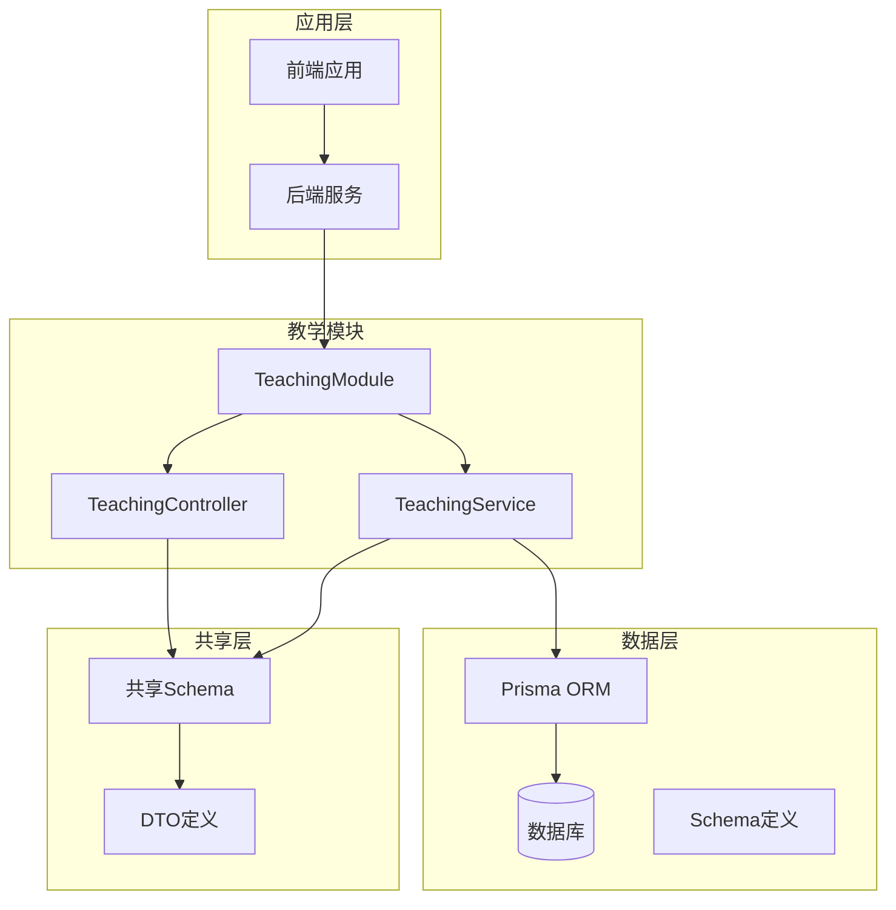
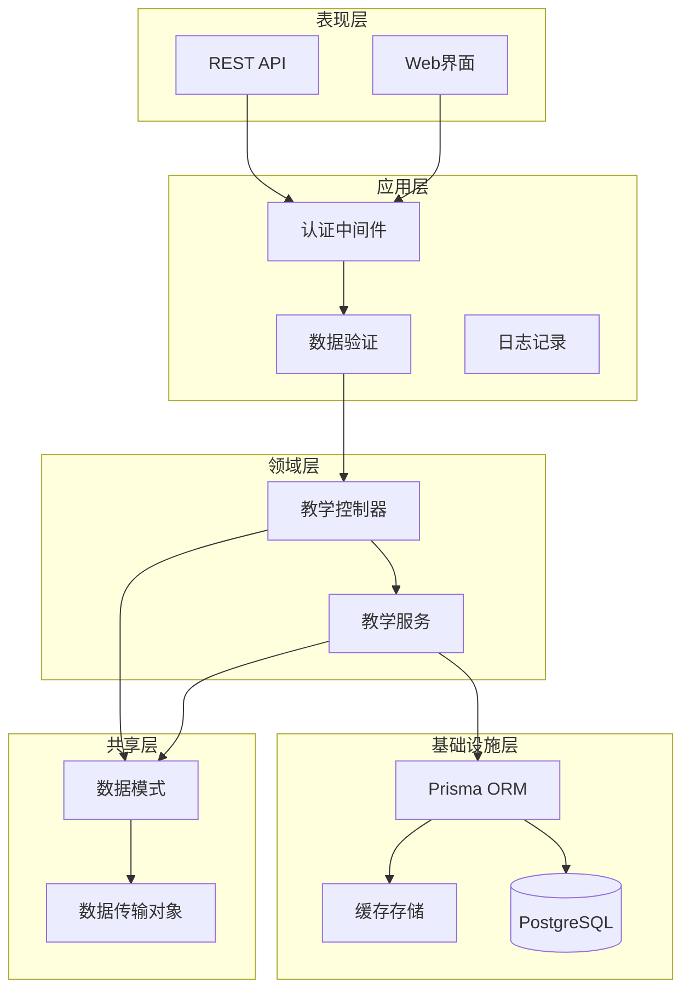
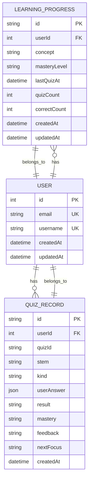
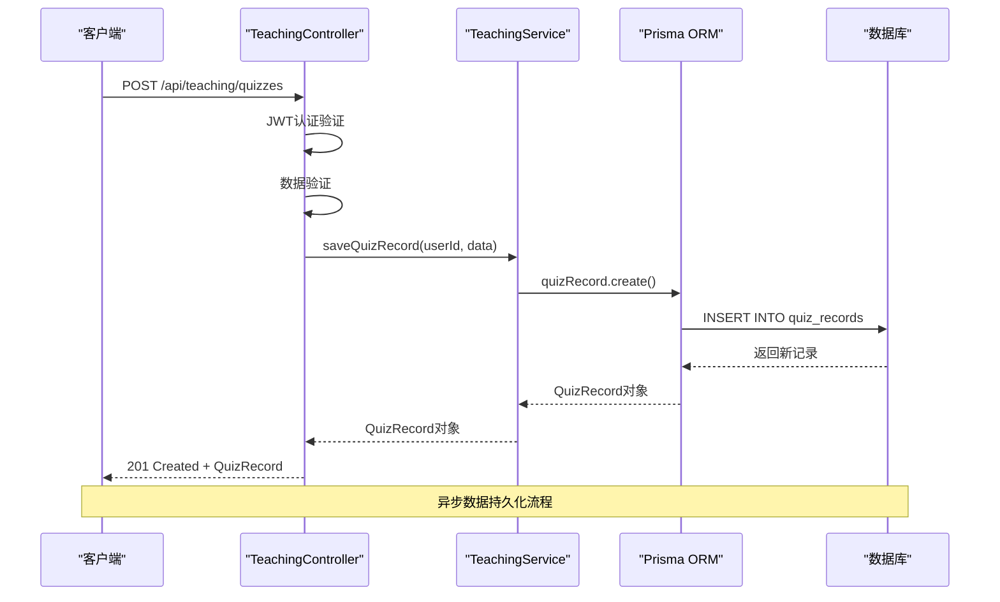
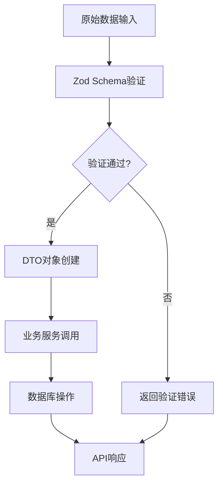
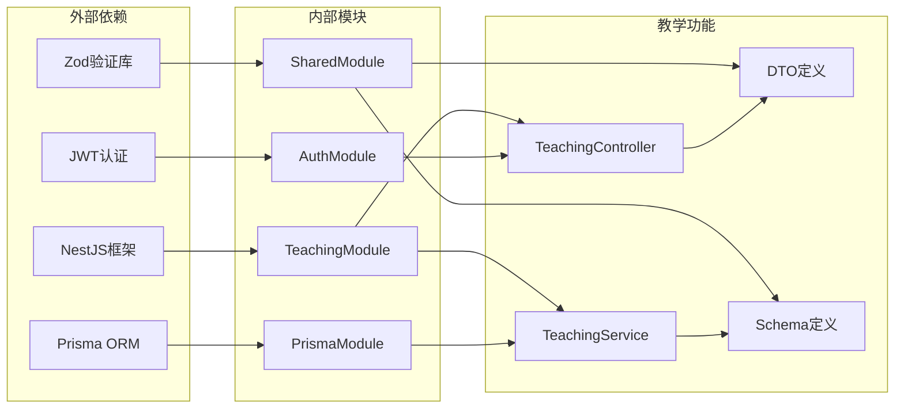

# 教学模式基础设施

<cite>
**本文档引用的文件**
- [apps/backend/src/teaching/teaching.module.ts](file://apps/backend/src/teaching/teaching.module.ts)
- [apps/backend/src/teaching/teaching.service.ts](file://apps/backend/src/teaching/teaching.service.ts)
- [apps/backend/src/teaching/teaching.controller.ts](file://apps/backend/src/teaching/teaching.controller.ts)
- [apps/backend/src/teaching/dto/teaching.dto.ts](file://apps/backend/src/teaching/dto/teaching.dto.ts)
- [apps/backend/prisma/schema/teaching.prisma](file://apps/backend/prisma/schema/teaching.prisma)
- [packages/shared/src/schemas/teaching.schema.ts](file://packages/shared/src/schemas/teaching.schema.ts)
- [apps/backend/src/app.module.ts](file://apps/backend/src/app.module.ts)
- [apps/backend/src/main.ts](file://apps/backend/src/main.ts)
</cite>

## 目录
1. [简介](#简介)
2. [项目结构](#项目结构)
3. [核心组件](#核心组件)
4. [架构概览](#架构概览)
5. [详细组件分析](#详细组件分析)
6. [依赖关系分析](#依赖关系分析)
7. [性能考虑](#性能考虑)
8. [故障排除指南](#故障排除指南)
9. [结论](#结论)

## 简介

教学模式基础设施是简思（Lumina）AI个人待办应用中的一个核心功能模块，专门用于支持教学场景下的学习评估、进度跟踪和知识管理。该系统通过结构化的API接口提供测验记录管理、学习进度跟踪、知识图谱构建和数据导出等功能，为用户提供了完整的教学反馈循环。

该基础设施采用现代化的微服务架构设计，结合了NestJS框架的强大功能、Prisma ORM的数据持久化能力，以及TypeScript的类型安全特性。系统支持实时数据同步、批量操作处理和多维度的学习分析，为教育工作者和学习者提供了专业级的教学支持工具。

## 项目结构

教学模式基础设施在整体项目中采用模块化组织方式，主要包含以下核心层次：

**图表来源**
- [apps/backend/src/teaching/teaching.module.ts:1-11](file://apps/backend/src/teaching/teaching.module.ts#L1-L11)
- [apps/backend/src/teaching/teaching.controller.ts:1-77](file://apps/backend/src/teaching/teaching.controller.ts#L1-L77)
- [apps/backend/src/teaching/teaching.service.ts:1-160](file://apps/backend/src/teaching/teaching.service.ts#L1-L160)

**章节来源**
- [apps/backend/src/teaching/teaching.module.ts:1-11](file://apps/backend/src/teaching/teaching.module.ts#L1-L11)
- [apps/backend/src/app.module.ts:23-23](file://apps/backend/src/app.module.ts#L23-L23)

## 核心组件

教学模式基础设施由三个核心组件构成，每个组件都有明确的职责分工和协作关系：

### 教学控制器（TeachingController）

教学控制器是系统的对外接口，负责处理HTTP请求和响应。它实现了完整的RESTful API，包括测验记录管理、学习进度跟踪和数据导出等功能。控制器使用JWT认证保护所有接口，并通过装饰器实现API文档自动生成。

### 教学服务（TeachingService）

教学服务是业务逻辑的核心实现，提供了数据持久化、复杂查询和业务规则执行。它封装了所有与教学相关的数据操作，包括单条和批量的测验记录保存、学习进度的UPSERT操作、综合概览计算和数据导出等。

### 教学模块（TeachingModule）

教学模块是依赖注入容器，负责组件的初始化和生命周期管理。它将控制器和服务类注册到NestJS框架中，并配置必要的依赖关系和导出项。

**章节来源**
- [apps/backend/src/teaching/teaching.controller.ts:1-77](file://apps/backend/src/teaching/teaching.controller.ts#L1-L77)
- [apps/backend/src/teaching/teaching.service.ts:1-160](file://apps/backend/src/teaching/teaching.service.ts#L1-L160)
- [apps/backend/src/teaching/teaching.module.ts:1-11](file://apps/backend/src/teaching/teaching.module.ts#L1-L11)

## 架构概览

教学模式基础设施采用了分层架构设计，确保了关注点分离和可维护性：

**图表来源**
- [apps/backend/src/teaching/teaching.controller.ts:1-77](file://apps/backend/src/teaching/teaching.controller.ts#L1-L77)
- [apps/backend/src/teaching/teaching.service.ts:1-160](file://apps/backend/src/teaching/teaching.service.ts#L1-L160)
- [apps/backend/src/teaching/teaching.module.ts:1-11](file://apps/backend/src/teaching/teaching.module.ts#L1-L11)

该架构的主要特点包括：

1. **清晰的分层结构**：表现层、应用层、领域层和基础设施层职责分明
2. **依赖注入机制**：通过NestJS的IoC容器管理组件依赖关系
3. **数据验证层**：使用Zod进行运行时数据验证，确保数据完整性
4. **认证授权机制**：基于JWT的认证体系，保护所有敏感接口
5. **异步处理能力**：支持批量操作和并发处理

## 详细组件分析

### 数据模型设计

教学模式基础设施的核心数据模型围绕学习评估和进度跟踪展开，主要包括两个核心实体：

**图表来源**
- [apps/backend/prisma/schema/teaching.prisma:1-36](file://apps/backend/prisma/schema/teaching.prisma#L1-L36)

#### 学习进度模型（LearningProgress）

学习进度模型记录了用户在各个知识点上的掌握情况，支持三种掌握等级：新手（novice）、发展中（developing）和熟练（proficient）。系统通过统计测验次数和正确次数来计算学习进度。

#### 测验记录模型（QuizRecord）

测验记录模型保存了用户的每次测验详情，包括题目内容、答案、评估结果和反馈信息。支持多种题型，包括单选、多选和简答题。

**章节来源**
- [apps/backend/prisma/schema/teaching.prisma:1-36](file://apps/backend/prisma/schema/teaching.prisma#L1-L36)

### API接口设计

教学模式提供了完整的RESTful API接口，支持教学场景的各种需求：

**图表来源**
- [apps/backend/src/teaching/teaching.controller.ts:23-27](file://apps/backend/src/teaching/teaching.controller.ts#L23-L27)
- [apps/backend/src/teaching/teaching.service.ts:11-27](file://apps/backend/src/teaching/teaching.service.ts#L11-L27)

#### 测验记录管理接口

系统提供了完整的测验记录管理功能，包括单条记录保存、批量记录保存和历史记录查询。所有接口都经过JWT认证保护，确保数据安全。

#### 学习进度跟踪接口

学习进度跟踪接口支持学习进度的创建、更新和批量处理。系统采用UPSERT模式，自动处理已存在记录的更新和新记录的创建。

#### 综合概览接口

概览接口提供了学习数据的聚合分析，包括总测验数、正确率计算和知识点分布统计。

**章节来源**
- [apps/backend/src/teaching/teaching.controller.ts:1-77](file://apps/backend/src/teaching/teaching.controller.ts#L1-L77)

### 数据验证和类型安全

教学模式基础设施充分利用TypeScript的类型系统和Zod的运行时验证，确保数据的完整性和一致性：

**图表来源**
- [apps/backend/src/teaching/dto/teaching.dto.ts:1-15](file://apps/backend/src/teaching/dto/teaching.dto.ts#L1-L15)
- [packages/shared/src/schemas/teaching.schema.ts:1-91](file://packages/shared/src/schemas/teaching.schema.ts#L1-L91)

**章节来源**
- [apps/backend/src/teaching/dto/teaching.dto.ts:1-15](file://apps/backend/src/teaching/dto/teaching.dto.ts#L1-L15)
- [packages/shared/src/schemas/teaching.schema.ts:1-91](file://packages/shared/src/schemas/teaching.schema.ts#L1-L91)

## 依赖关系分析

教学模式基础设施的依赖关系体现了清晰的关注点分离和模块化设计：

**图表来源**
- [apps/backend/src/teaching/teaching.module.ts:1-11](file://apps/backend/src/teaching/teaching.module.ts#L1-L11)
- [apps/backend/src/app.module.ts:137-151](file://apps/backend/src/app.module.ts#L137-L151)

### 核心依赖关系

1. **NestJS框架依赖**：提供依赖注入、模块化和装饰器支持
2. **Prisma ORM依赖**：提供类型安全的数据库操作和迁移管理
3. **Zod验证库依赖**：提供运行时数据验证和类型推断
4. **JWT认证依赖**：提供用户身份验证和授权机制

### 模块间耦合度

教学模块与其他模块的耦合度保持在合理范围内，主要通过以下方式降低耦合：

- **接口抽象**：通过接口定义模块间的契约
- **依赖注入**：减少直接的类依赖关系
- **事件驱动**：通过事件机制实现松耦合通信

**章节来源**
- [apps/backend/src/app.module.ts:1-166](file://apps/backend/src/app.module.ts#L1-L166)

## 性能考虑

教学模式基础设施在设计时充分考虑了性能优化，采用了多种策略来提升系统响应速度和吞吐量：

### 数据库优化策略

1. **索引优化**：为常用查询字段建立索引，包括用户ID和时间戳字段
2. **查询优化**：使用分页查询避免大量数据传输
3. **连接池管理**：合理配置数据库连接池参数

### 缓存策略

1. **Redis缓存**：利用Redis作为缓存层存储热点数据
2. **批量操作**：支持批量数据操作减少数据库往返
3. **异步处理**：非关键操作采用异步处理避免阻塞

### 并发控制

1. **JWT令牌管理**：通过短期有效的JWT令牌控制访问频率
2. **速率限制**：实现全局和基于IP的速率限制
3. **优雅降级**：在高负载情况下提供降级服务

## 故障排除指南

### 常见问题诊断

#### 认证失败问题

当遇到JWT认证失败时，检查以下要点：
- 确认JWT令牌格式正确且未过期
- 验证用户账户状态正常
- 检查服务器时间同步情况

#### 数据验证错误

当出现数据验证错误时：
- 检查输入数据是否符合Zod Schema定义
- 确认必填字段是否完整
- 验证数据类型和范围约束

#### 数据库连接问题

数据库连接失败的常见原因：
- 检查数据库服务状态
- 验证连接字符串配置
- 确认网络连通性

### 调试工具和方法

1. **日志分析**：利用Pino日志系统查看详细的请求和错误信息
2. **API测试**：使用Swagger UI测试API接口功能
3. **数据库监控**：通过Prisma日志监控SQL查询性能

**章节来源**
- [apps/backend/src/main.ts:170-181](file://apps/backend/src/main.ts#L170-L181)

## 结论

教学模式基础设施为简思（Lumina）应用提供了完善的学习教学支持功能。通过模块化的设计、类型安全的实现和现代化的技术栈，该系统能够有效支撑各种教学场景的需求。

系统的主要优势包括：

1. **完整的功能覆盖**：从测验记录到学习进度的全流程支持
2. **类型安全保障**：充分利用TypeScript和Zod确保数据完整性
3. **可扩展的架构**：模块化设计便于功能扩展和维护
4. **专业的性能表现**：优化的数据库设计和缓存策略

未来可以考虑的功能增强方向：
- 集成更高级的分析算法
- 支持更多的题型和评估标准
- 增强实时协作功能
- 扩展移动端适配能力

该基础设施为构建专业级的教育应用奠定了坚实的基础，能够满足现代在线教学的各种需求。