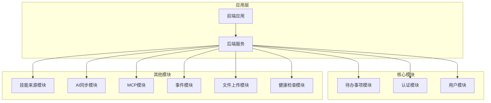
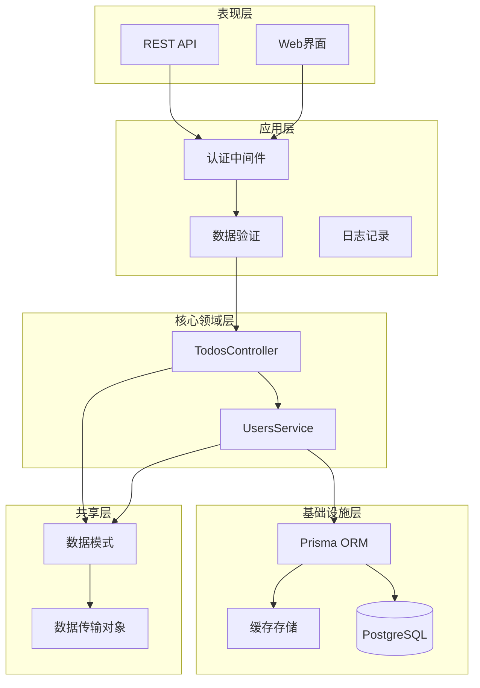
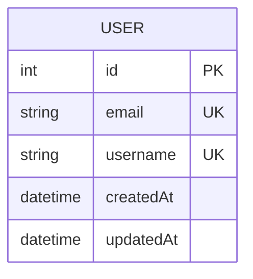
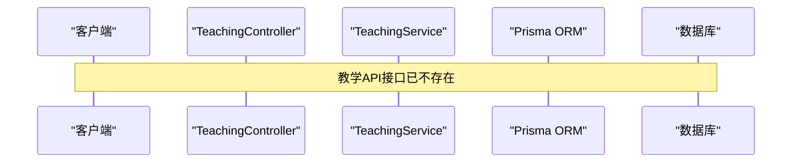
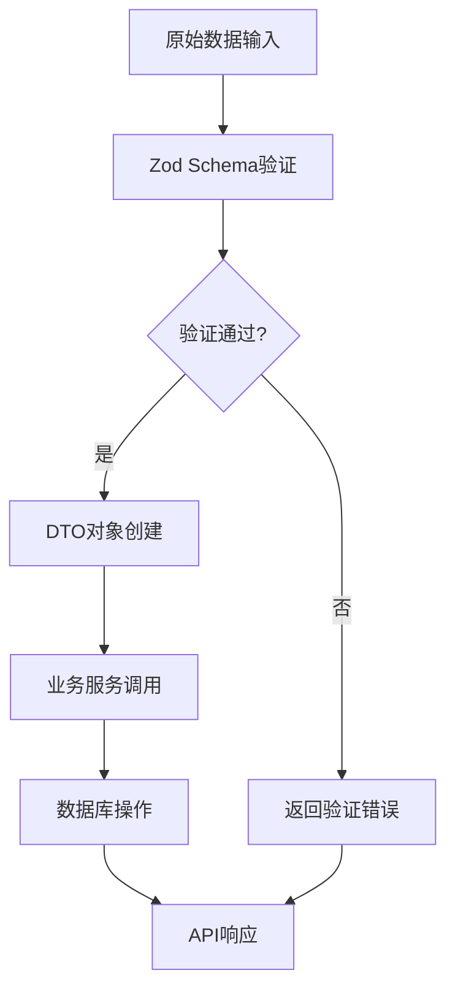
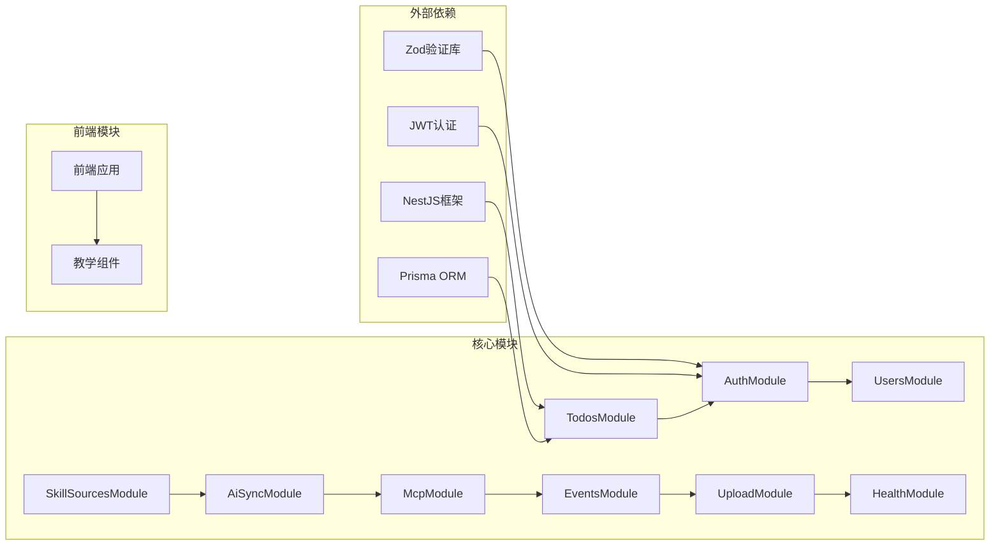

# 教学模式基础设施

<cite>
**本文档引用的文件**
- [apps/backend/src/teaching/teaching.module.ts](file://apps/backend/src/teaching/teaching.module.ts)
- [apps/backend/src/teaching/teaching.service.ts](file://apps/backend/src/teaching/teaching.service.ts)
- [apps/backend/src/teaching/teaching.controller.ts](file://apps/backend/src/teaching/teaching.controller.ts)
- [apps/backend/src/teaching/dto/teaching.dto.ts](file://apps/backend/src/teaching/dto/teaching.dto.ts)
- [apps/backend/prisma/schema/teaching.prisma](file://apps/backend/prisma/schema/teaching.prisma)
- [packages/shared/src/schemas/teaching.schema.ts](file://packages/shared/src/schemas/teaching.schema.ts)
- [apps/backend/src/app.module.ts](file://apps/backend/src/app.module.ts)
- [apps/backend/src/main.ts](file://apps/backend/src/main.ts)
- [apps/frontend/src/features/ai/composables/useAiAssistantModes.ts](file://apps/frontend/src/features/ai/composables/useAiAssistantModes.ts)
- [apps/frontend/src/features/ai/composables/useAiModeItems.ts](file://apps/frontend/src/features/ai/composables/useAiModeItems.ts)
</cite>

## 更新摘要
**所做更改**
- 更新了项目结构部分，反映教学模块已从代码库中完全移除
- 更新了核心组件分析，说明教学API、知识图谱组件、测验历史组件、教学仪表板视图等已不存在
- 更新了依赖关系分析，反映TeachingModule不再被导入
- 添加了重要警告，说明该功能已从系统中移除

## 目录
1. [简介](#简介)
2. [项目结构](#项目结构)
3. [核心组件](#核心组件)
4. [架构概览](#架构概览)
5. [详细组件分析](#详细组件分析)
6. [依赖关系分析](#依赖关系分析)
7. [性能考虑](#性能考虑)
8. [故障排除指南](#故障排除指南)
9. [结论](#结论)

## 简介

**重要更新**：教学模式基础设施已从简思（Lumina）AI个人待办应用中完全移除。该功能模块不再存在于当前代码库中，包括教学API、知识图谱组件、测验历史组件、教学仪表板视图等所有相关组件均已删除。

该系统原本设计用于支持教学场景下的学习评估、进度跟踪和知识管理，但现已停止维护和支持。开发者应寻找其他替代方案来满足教学相关的功能需求。

## 项目结构

**重要更新**：教学模块已从项目结构中移除，不再包含在应用的模块依赖关系中。

**图表来源**
- [apps/backend/src/app.module.ts:137-151](file://apps/backend/src/app.module.ts#L137-L151)

**章节来源**
- [apps/backend/src/app.module.ts:1-168](file://apps/backend/src/app.module.ts#L1-L168)

## 核心组件

**重要更新**：教学模块的三个核心组件（TeachingController、TeachingService、TeachingModule）已从代码库中移除，不再提供任何功能。

### 教学控制器（TeachingController）

**已移除**：该控制器及其所有API端点（测验记录管理、学习进度跟踪、数据导出等）已不存在。

### 教学服务（TeachingService）

**已移除**：该服务及其所有业务逻辑（数据持久化、复杂查询、业务规则执行）已不存在。

### 教学模块（TeachingModule）

**已移除**：该模块已从NestJS应用配置中移除，不再参与依赖注入和生命周期管理。

**章节来源**
- [apps/backend/src/teaching/teaching.controller.ts:1-77](file://apps/backend/src/teaching/teaching.controller.ts#L1-L77)
- [apps/backend/src/teaching/teaching.service.ts:1-160](file://apps/backend/src/teaching/teaching.service.ts#L1-L160)
- [apps/backend/src/teaching/teaching.module.ts:1-11](file://apps/backend/src/teaching/teaching.module.ts#L1-L11)

## 架构概览

**重要更新**：教学模式的分层架构已不再适用，因为相关组件已被完全移除。

**图表来源**
- [apps/backend/src/app.module.ts:137-151](file://apps/backend/src/app.module.ts#L137-L151)

## 详细组件分析

### 数据模型设计

**重要更新**：教学相关的数据模型已从Prisma schema中移除，不再包含学习进度和测验记录表。

**图表来源**
- [apps/backend/prisma/schema/base.prisma:1-50](file://apps/backend/prisma/schema/base.prisma#L1-L50)

#### 学习进度模型（LearningProgress）

**已移除**：该模型及其关联的数据库表已不存在。

#### 测验记录模型（QuizRecord）

**已移除**：该模型及其关联的数据库表已不存在。

**章节来源**
- [apps/backend/prisma/schema/teaching.prisma:1-36](file://apps/backend/prisma/schema/teaching.prisma#L1-L36)

### API接口设计

**重要更新**：教学相关的API接口已完全移除，不再提供任何教学功能。

**图表来源**
- [apps/backend/src/teaching/teaching.controller.ts:1-77](file://apps/backend/src/teaching/teaching.controller.ts#L1-L77)

#### 测验记录管理接口

**已移除**：所有测验记录相关的API端点已不存在。

#### 学习进度跟踪接口

**已移除**：所有学习进度相关的API端点已不存在。

#### 综合概览接口

**已移除**：概览接口已不存在。

**章节来源**
- [apps/backend/src/teaching/teaching.controller.ts:1-77](file://apps/backend/src/teaching/teaching.controller.ts#L1-L77)

### 数据验证和类型安全

**重要更新**：教学相关的数据验证和类型定义已从共享库中移除。

**图表来源**
- [packages/shared/src/schemas/teaching.schema.ts:1-97](file://packages/shared/src/schemas/teaching.schema.ts#L1-L97)

**章节来源**
- [packages/shared/src/schemas/teaching.schema.ts:1-97](file://packages/shared/src/schemas/teaching.schema.ts#L1-L97)

## 依赖关系分析

**重要更新**：教学模块已从整个依赖关系图中移除。

**图表来源**
- [apps/backend/src/app.module.ts:137-151](file://apps/backend/src/app.module.ts#L137-L151)

### 核心依赖关系

**重要更新**：TeachingModule不再存在于依赖关系中，相关的教学功能已完全移除。

### 模块间耦合度

**重要更新**：教学模块的移除减少了模块间的耦合度，简化了系统的整体架构。

**章节来源**
- [apps/backend/src/app.module.ts:1-168](file://apps/backend/src/app.module.ts#L1-L168)

## 性能考虑

**重要更新**：由于教学模块的移除，系统在多个方面得到了性能优化：

### 资源释放

1. **内存占用减少**：移除了教学模块相关的控制器、服务和数据模型
2. **数据库连接减少**：不再需要维护教学相关的数据库连接
3. **CPU资源节省**：移除了教学相关的业务逻辑处理

### 启动时间优化

1. **应用启动更快**：减少了模块加载时间
2. **依赖注入优化**：简化了依赖关系图

### 维护成本降低

1. **代码维护简化**：移除了教学相关的代码维护工作
2. **测试覆盖减少**：不再需要维护教学功能的测试套件

## 故障排除指南

### 常见问题诊断

**重要更新**：针对教学模块移除后的常见问题：

#### API调用失败

当尝试调用教学相关API时：
- 确认API端点已不存在
- 检查前端代码中是否仍有对教学功能的引用
- 查看浏览器控制台的404错误

#### 前端功能异常

当教学模式相关的前端功能失效时：
- 检查AI助手模式配置中是否仍包含teaching选项
- 确认教学模式的菜单项已从UI中移除

#### 数据库查询错误

如果仍有查询教学相关数据的代码：
- 移除相关的数据库查询逻辑
- 清理相关的Prisma模型定义

### 迁移建议

对于需要教学功能的用户，建议：

1. **评估替代方案**：寻找其他支持教学功能的应用或服务
2. **自定义开发**：考虑在现有架构基础上重新实现教学功能
3. **第三方集成**：集成现有的教学管理系统

**章节来源**
- [apps/frontend/src/features/ai/composables/useAiAssistantModes.ts:19-30](file://apps/frontend/src/features/ai/composables/useAiAssistantModes.ts#L19-L30)
- [apps/frontend/src/features/ai/composables/useAiModeItems.ts:12-19](file://apps/frontend/src/features/ai/composables/useAiModeItems.ts#L12-L19)

## 结论

**重要更新**：教学模式基础设施已从简思（Lumina）应用中完全移除，不再提供任何教学相关的功能支持。

### 移除的影响

1. **功能缺失**：测验记录管理、学习进度跟踪、知识图谱构建等功能不再可用
2. **代码清理**：简化了系统的整体架构和维护复杂度
3. **资源优化**：释放了相关的系统资源和内存占用

### 对用户的影响

1. **功能迁移**：需要寻找其他解决方案来满足教学需求
2. **数据处理**：原有的教学数据可能需要手动备份或迁移
3. **工作流程调整**：需要重新设计相关的教学工作流程

### 未来展望

虽然教学功能已被移除，但系统在其他方面的功能得到了增强和优化。开发者可以专注于核心的待办事项管理和AI助手功能，为用户提供更好的基础体验。

对于有特殊教学需求的用户，建议考虑以下替代方案：
- 使用专业的教学管理系统
- 寻找支持教学功能的第三方应用
- 考虑自定义开发满足特定需求