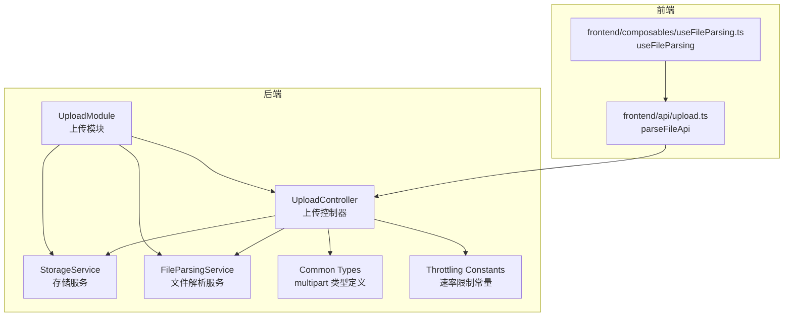
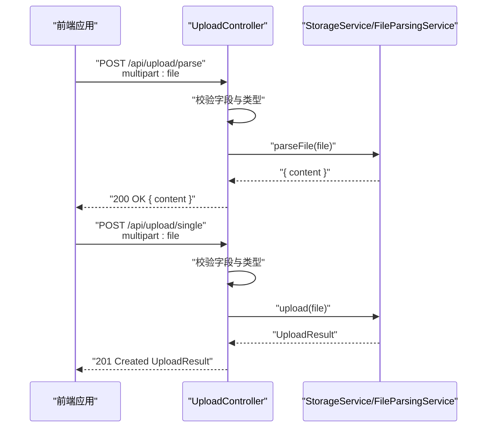
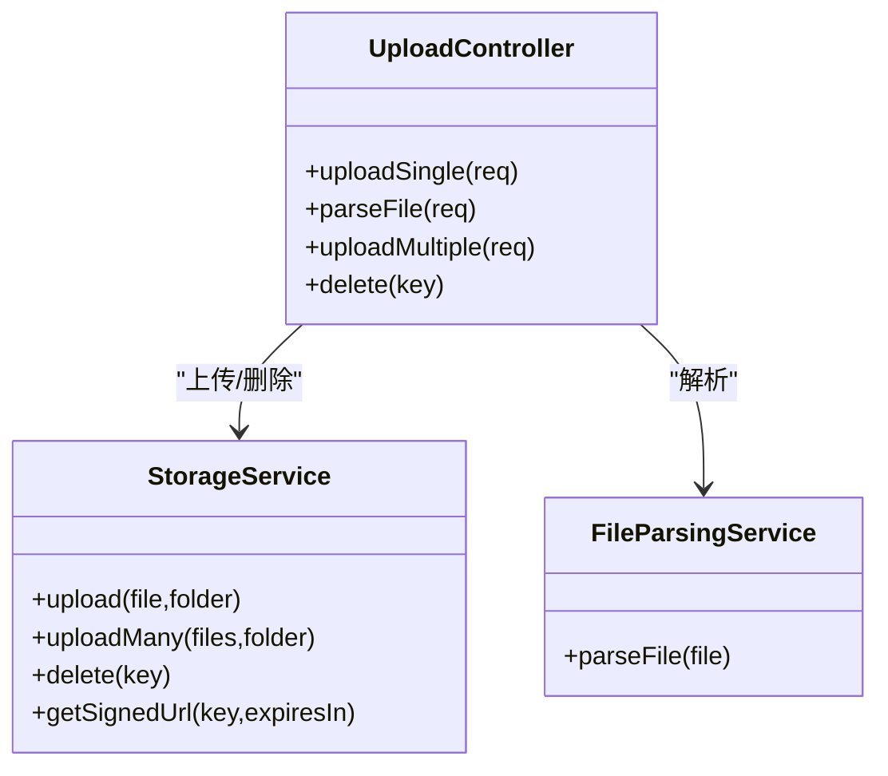

# 上传控制器

<cite>
**本文引用的文件**
- [apps/backend/src/upload/upload.controller.ts](file://apps/backend/src/upload/upload.controller.ts)
- [apps/backend/src/upload/storage.service.ts](file://apps/backend/src/upload/storage.service.ts)
- [apps/backend/src/upload/file-parsing.service.ts](file://apps/backend/src/upload/file-parsing.service.ts)
- [apps/backend/src/upload/upload.constants.ts](file://apps/backend/src/upload/upload.constants.ts)
- [apps/backend/src/upload/upload.module.ts](file://apps/backend/src/upload/upload.module.ts)
- [apps/backend/src/common/types.ts](file://apps/backend/src/common/types.ts)
- [apps/backend/src/common/throttling/throttling.constants.ts](file://apps/backend/src/common/throttling/throttling.constants.ts)
- [apps/backend/src/i18n/en-US/upload.ts](file://apps/backend/src/i18n/en-US/upload.ts)
- [apps/backend/src/i18n/zh-CN/upload.ts](file://apps/backend/src/i18n/zh-CN/upload.ts)
- [apps/frontend/src/api/upload.ts](file://apps/frontend/src/api/upload.ts)
- [apps/frontend/src/composables/useFileParsing.ts](file://apps/frontend/src/composables/useFileParsing.ts)
- [apps/backend/tests/upload/upload.controller.spec.ts](file://apps/backend/tests/upload/upload.controller.spec.ts)
- [apps/backend/tests/upload/file-parsing.service.spec.ts](file://apps/backend/tests/upload/file-parsing.service.spec.ts)
- [apps/backend/tests/upload/storage.service.spec.ts](file://apps/backend/tests/upload/storage.service.spec.ts)
</cite>

## 目录
1. [简介](#简介)
2. [项目结构](#项目结构)
3. [核心组件](#核心组件)
4. [架构总览](#架构总览)
5. [详细组件分析](#详细组件分析)
6. [依赖关系分析](#依赖关系分析)
7. [性能与容量规划](#性能与容量规划)
8. [故障排查指南](#故障排查指南)
9. [结论](#结论)
10. [附录](#附录)

## 简介
本文件为 Lumina Todo 的上传控制器提供系统化、可操作的 API 文档与实现说明。重点覆盖以下方面：
- HTTP 端点定义与请求/响应规范
- 单文件上传、批量上传、文件内容解析（不落地）三种模式
- 文件类型与大小限制、安全校验与错误处理策略
- 鉴权与访问控制、速率限制、日志记录
- 客户端集成指南与常见问题排查

## 项目结构
上传子系统由后端 NestJS 模块提供，前端通过统一 HTTP 客户端调用。

图表来源
- [apps/backend/src/upload/upload.controller.ts:1-161](file://apps/backend/src/upload/upload.controller.ts#L1-L161)
- [apps/backend/src/upload/storage.service.ts:1-216](file://apps/backend/src/upload/storage.service.ts#L1-L216)
- [apps/backend/src/upload/file-parsing.service.ts:1-142](file://apps/backend/src/upload/file-parsing.service.ts#L1-L142)
- [apps/backend/src/upload/upload.module.ts:1-16](file://apps/backend/src/upload/upload.module.ts#L1-L16)
- [apps/backend/src/common/types.ts:1-16](file://apps/backend/src/common/types.ts#L1-L16)
- [apps/backend/src/common/throttling/throttling.constants.ts:132-142](file://apps/backend/src/common/throttling/throttling.constants.ts#L132-L142)
- [apps/frontend/src/api/upload.ts:1-23](file://apps/frontend/src/api/upload.ts#L1-L23)
- [apps/frontend/src/composables/useFileParsing.ts:1-76](file://apps/frontend/src/composables/useFileParsing.ts#L1-L76)

章节来源
- [apps/backend/src/upload/upload.controller.ts:1-161](file://apps/backend/src/upload/upload.controller.ts#L1-L161)
- [apps/backend/src/upload/upload.module.ts:1-16](file://apps/backend/src/upload/upload.module.ts#L1-L16)
- [apps/backend/src/common/types.ts:1-16](file://apps/backend/src/common/types.ts#L1-L16)
- [apps/backend/src/common/throttling/throttling.constants.ts:132-142](file://apps/backend/src/common/throttling/throttling.constants.ts#L132-L142)
- [apps/frontend/src/api/upload.ts:1-23](file://apps/frontend/src/api/upload.ts#L1-L23)
- [apps/frontend/src/composables/useFileParsing.ts:1-76](file://apps/frontend/src/composables/useFileParsing.ts#L1-L76)

## 核心组件
- 上传控制器：负责接收 multipart 请求、参数校验、路由分发、鉴权与速率限制。
- 存储服务：封装本地与 S3 兼容存储，提供上传、批量上传、删除、生成预签名 URL 等能力。
- 文件解析服务：对 PDF、DOCX、XLS/XLSX 等进行内容提取，并对文本类扩展名进行直读；支持内容长度截断。
- 上传模块：装配控制器与服务，统一导出。
- 通用类型与速率限制：定义 multipart 请求类型与上传/解析的速率策略。

章节来源
- [apps/backend/src/upload/upload.controller.ts:22-30](file://apps/backend/src/upload/upload.controller.ts#L22-L30)
- [apps/backend/src/upload/storage.service.ts:34-43](file://apps/backend/src/upload/storage.service.ts#L34-L43)
- [apps/backend/src/upload/file-parsing.service.ts:9-11](file://apps/backend/src/upload/file-parsing.service.ts#L9-L11)
- [apps/backend/src/upload/upload.module.ts:6-15](file://apps/backend/src/upload/upload.module.ts#L6-L15)
- [apps/backend/src/common/types.ts:5-15](file://apps/backend/src/common/types.ts#L5-L15)
- [apps/backend/src/common/throttling/throttling.constants.ts:132-142](file://apps/backend/src/common/throttling/throttling.constants.ts#L132-L142)

## 架构总览
下图展示了从浏览器到后端控制器、再到存储与解析服务的整体流程。

图表来源
- [apps/backend/src/upload/upload.controller.ts:95-116](file://apps/backend/src/upload/upload.controller.ts#L95-L116)
- [apps/backend/src/upload/upload.controller.ts:70-90](file://apps/backend/src/upload/upload.controller.ts#L70-L90)
- [apps/backend/src/upload/file-parsing.service.ts:16-72](file://apps/backend/src/upload/file-parsing.service.ts#L16-L72)
- [apps/backend/src/upload/storage.service.ts:116-139](file://apps/backend/src/upload/storage.service.ts#L116-L139)
- [apps/frontend/src/api/upload.ts:11-22](file://apps/frontend/src/api/upload.ts#L11-L22)

## 详细组件分析

### 1) HTTP 端点与请求/响应规范
- 基础路径：/api/upload
- 鉴权：所有端点均需携带 Bearer Token（JWT），使用 JWT 守卫保护
- 速率限制：上传与解析分别应用独立策略（见“性能与容量规划”）

端点一览
- POST /api/upload/parse
  - 功能：解析文件内容（不落地保存）
  - 请求体：multipart/form-data，字段 file（二进制）
  - 成功响应：{ content: string }
  - 错误：400（文件缺失/类型不支持/解析失败）、429（超频）、503（存储未配置时的前置条件）
- POST /api/upload/single
  - 功能：单文件上传
  - 请求体：multipart/form-data，字段 file（二进制）
  - 成功响应：UploadResult
  - 错误：400（文件缺失/类型不支持）、429（超频）、503（存储未配置）
- POST /api/upload/multiple
  - 功能：批量上传（最多 10 个）
  - 请求体：multipart/form-data，字段 files（数组，二进制）
  - 成功响应：UploadResult[]
  - 错误：400（无文件/类型不支持）、429（超频）、503（存储未配置）
- DELETE /api/upload/{key}
  - 功能：删除已上传文件
  - 成功响应：{ success: boolean }
  - 错误：503（存储未配置）

UploadResult 字段
- key: 存储键（如 uploads/uuid.ext）
- url: 访问地址（本地为 /api/public/{key}，S3/OSS/MinIO 为公开域名或预签名 URL）
- bucket: 存储桶名称或 local
- size: 字节数
- mimetype: MIME 类型

章节来源
- [apps/backend/src/upload/upload.controller.ts:70-116](file://apps/backend/src/upload/upload.controller.ts#L70-L116)
- [apps/backend/src/upload/upload.controller.ts:121-149](file://apps/backend/src/upload/upload.controller.ts#L121-L149)
- [apps/backend/src/upload/upload.controller.ts:154-159](file://apps/backend/src/upload/upload.controller.ts#L154-L159)
- [apps/backend/src/upload/storage.service.ts:15-28](file://apps/backend/src/upload/storage.service.ts#L15-L28)

### 2) 参数验证与类型白名单
- 必填字段校验：单/多文件上传要求字段名为 file 或 files；否则返回 400
- 类型校验：同时基于 MIME 与扩展名白名单进行校验
  - 允许的 MIME 类型与扩展名详见常量文件
- 不支持的类型：抛出 400，消息键 upload.UNSUPPORTED_FILE_TYPE
- 解析专用类型：仅支持特定扩展名的文本直读与 PDF/DOCX/XLSX 解析，其他类型返回 400，消息键 upload.UNSUPPORTED_PARSE_FILE_TYPE

章节来源
- [apps/backend/src/upload/upload.controller.ts:82-86](file://apps/backend/src/upload/upload.controller.ts#L82-L86)
- [apps/backend/src/upload/upload.controller.ts:136-146](file://apps/backend/src/upload/upload.controller.ts#L136-L146)
- [apps/backend/src/upload/upload.controller.ts:53-65](file://apps/backend/src/upload/upload.controller.ts#L53-L65)
- [apps/backend/src/upload/upload.constants.ts:1-66](file://apps/backend/src/upload/upload.constants.ts#L1-L66)
- [apps/backend/src/i18n/en-US/upload.ts:2-8](file://apps/backend/src/i18n/en-US/upload.ts#L2-L8)
- [apps/backend/src/i18n/zh-CN/upload.ts:2-8](file://apps/backend/src/i18n/zh-CN/upload.ts#L2-L8)

### 3) 文件大小限制与内容截断
- 文件大小：后端按 multipart 分块读取并转换为 Buffer，未在控制器层显式限制字节数
- 内容解析上限：解析后的内容最大字符数受 MAX_PARSED_CONTENT_CHARS 控制，超长自动截断并追加标记
- 建议：前端在上传前进行本地尺寸与类型检查，避免不必要的网络传输

章节来源
- [apps/backend/src/upload/file-parsing.service.ts:134-140](file://apps/backend/src/upload/file-parsing.service.ts#L134-L140)
- [apps/backend/src/upload/upload.constants.ts:65-66](file://apps/backend/src/upload/upload.constants.ts#L65-L66)

### 4) 存储后端与访问控制
- 支持本地与 S3 兼容存储（含 OSS/MinIO）
- 未配置 S3 凭证时：
  - 上传/删除/获取预签名 URL 将返回 503（消息键 upload.STORAGE_NOT_CONFIGURED）
  - 仍可进行“解析”（parse）与“单文件上传”（single）的本地流程（若本地目录可写）
- 公开访问 URL：
  - S3：https://{bucket}.s3.{region}.amazonaws.com/{key}
  - OSS/MinIO：{endpoint}/{bucket}/{key}
- 预签名 URL：用于临时授权访问私有对象，有效期可配置

章节来源
- [apps/backend/src/upload/storage.service.ts:45-69](file://apps/backend/src/upload/storage.service.ts#L45-L69)
- [apps/backend/src/upload/storage.service.ts:116-139](file://apps/backend/src/upload/storage.service.ts#L116-L139)
- [apps/backend/src/upload/storage.service.ts:186-194](file://apps/backend/src/upload/storage.service.ts#L186-L194)
- [apps/backend/src/i18n/en-US/upload.ts:7-7](file://apps/backend/src/i18n/en-US/upload.ts#L7-L7)
- [apps/backend/tests/upload/storage.service.spec.ts:32-46](file://apps/backend/tests/upload/storage.service.spec.ts#L32-L46)

### 5) 断点续传与批量上传
- 断点续传：当前实现未提供断点续传能力
- 批量上传：支持一次提交多个文件（字段名 files），后端逐个校验并并行上传，返回 UploadResult 数组
- 最大数量：测试用例显示“最多 10 个”，建议前端在 UI 上限制选择数量并提示用户

章节来源
- [apps/backend/src/upload/upload.controller.ts:121-149](file://apps/backend/src/upload/upload.controller.ts#L121-L149)
- [apps/backend/tests/upload/upload.controller.spec.ts:101-101](file://apps/backend/tests/upload/upload.controller.spec.ts#L101-L101)

### 6) 安全与错误处理
- 鉴权：所有端点启用 JWT 守卫，需携带 Authorization: Bearer {token}
- 访问控制：删除接口不进行额外资源级权限校验，仅做存储可用性检查
- 错误处理：
  - 400：缺少文件、类型不支持、解析失败
  - 429：触发速率限制
  - 503：存储未配置或写入失败
- 国际化：错误消息通过 i18n 键映射，便于多语言展示

章节来源
- [apps/backend/src/upload/upload.controller.ts:24-26](file://apps/backend/src/upload/upload.controller.ts#L24-L26)
- [apps/backend/src/upload/upload.controller.ts:82-86](file://apps/backend/src/upload/upload.controller.ts#L82-L86)
- [apps/backend/src/upload/file-parsing.service.ts:48-71](file://apps/backend/src/upload/file-parsing.service.ts#L48-L71)
- [apps/backend/src/i18n/en-US/upload.ts:2-8](file://apps/backend/src/i18n/en-US/upload.ts#L2-L8)
- [apps/backend/src/i18n/zh-CN/upload.ts:2-8](file://apps/backend/src/i18n/zh-CN/upload.ts#L2-L8)

### 7) 日志与可观测性
- 存储服务在关键路径（初始化、上传、删除、写入失败）记录日志，便于定位问题
- 建议：结合服务端日志与前端错误提示，形成端到端的排障闭环

章节来源
- [apps/backend/src/upload/storage.service.ts:45-69](file://apps/backend/src/upload/storage.service.ts#L45-L69)
- [apps/backend/src/upload/storage.service.ts:96-101](file://apps/backend/src/upload/storage.service.ts#L96-L101)
- [apps/backend/src/upload/file-parsing.service.ts:68-70](file://apps/backend/src/upload/file-parsing.service.ts#L68-L70)

### 8) 客户端集成指南
- 前端解析接口：parseFileApi
  - 作用：将文件上传至后端进行解析（不保存），返回纯文本内容
  - 使用：FormData 附加 file 字段，Content-Type 自动设置
- 前端解析组合：useFileParsing
  - 行为：对简单文本/代码文件采用前端 FileReader 直读；复杂文档（PDF/DOCX/XLSX）走后端解析
  - 登录态：后端解析需要有效 JWT，未登录会提示
  - 截断：超过前端最大可解析字符数时进行截断并提示

章节来源
- [apps/frontend/src/api/upload.ts:11-22](file://apps/frontend/src/api/upload.ts#L11-L22)
- [apps/frontend/src/composables/useFileParsing.ts:47-76](file://apps/frontend/src/composables/useFileParsing.ts#L47-L76)

## 依赖关系分析

图表来源
- [apps/backend/src/upload/upload.controller.ts:26-30](file://apps/backend/src/upload/upload.controller.ts#L26-L30)
- [apps/backend/src/upload/storage.service.ts:116-146](file://apps/backend/src/upload/storage.service.ts#L116-L146)
- [apps/backend/src/upload/file-parsing.service.ts:16-72](file://apps/backend/src/upload/file-parsing.service.ts#L16-L72)

章节来源
- [apps/backend/src/upload/upload.controller.ts:26-30](file://apps/backend/src/upload/upload.controller.ts#L26-L30)
- [apps/backend/src/upload/storage.service.ts:116-146](file://apps/backend/src/upload/storage.service.ts#L116-L146)
- [apps/backend/src/upload/file-parsing.service.ts:16-72](file://apps/backend/src/upload/file-parsing.service.ts#L16-L72)

## 性能与容量规划
- 速率限制
  - 上传：FILE_UPLOAD_THROTTLE（短/中/长窗口）
  - 解析：FILE_PARSE_THROTTLE（更严格）
- 窗口与阈值可通过环境变量动态调整，支持全局配置与跳过规则
- 并发：批量上传采用 Promise.all 并行处理，提升吞吐

章节来源
- [apps/backend/src/common/throttling/throttling.constants.ts:132-142](file://apps/backend/src/common/throttling/throttling.constants.ts#L132-L142)
- [apps/backend/src/common/throttling/throttling.constants.ts:173-197](file://apps/backend/src/common/throttling/throttling.constants.ts#L173-L197)
- [apps/backend/src/upload/upload.controller.ts:121-149](file://apps/backend/src/upload/upload.controller.ts#L121-L149)

## 故障排查指南
- 400 错误
  - 缺少文件字段：确认 multipart 字段名是否为 file 或 files
  - 类型不被支持：检查扩展名与 MIME 是否在白名单内
  - 解析失败：PDF/DOCX/XLSX 解析异常或内容过大被截断
- 503 错误
  - 存储未配置：检查 S3_* 环境变量是否齐全
  - 本地写入失败：检查 public 目录权限与磁盘空间
- 429 错误
  - 触发速率限制：降低请求频率或调整阈值
- 建议的日志定位
  - 存储服务初始化与写入失败日志
  - 解析服务异常堆栈与错误消息

章节来源
- [apps/backend/src/upload/upload.controller.ts:82-86](file://apps/backend/src/upload/upload.controller.ts#L82-L86)
- [apps/backend/src/upload/upload.controller.ts:136-146](file://apps/backend/src/upload/upload.controller.ts#L136-L146)
- [apps/backend/src/upload/file-parsing.service.ts:48-71](file://apps/backend/src/upload/file-parsing.service.ts#L48-L71)
- [apps/backend/src/upload/storage.service.ts:96-101](file://apps/backend/src/upload/storage.service.ts#L96-L101)
- [apps/backend/tests/upload/storage.service.spec.ts:32-46](file://apps/backend/tests/upload/storage.service.spec.ts#L32-L46)
- [apps/backend/tests/upload/upload.controller.spec.ts:46-70](file://apps/backend/tests/upload/upload.controller.spec.ts#L46-L70)

## 结论
- 上传控制器提供了清晰的三类能力：解析（不落地）、单文件上传、批量上传与删除
- 通过白名单与速率限制保障安全性与稳定性
- 建议在前端增加本地校验与重试机制，在后端完善资源级权限与审计日志

## 附录

### A. 请求示例与响应结构
- 解析文件（parse）
  - 请求：POST /api/upload/parse，multipart: file
  - 成功：{ content: string }
- 单文件上传（single）
  - 请求：POST /api/upload/single，multipart: file
  - 成功：UploadResult
- 批量上传（multiple）
  - 请求：POST /api/upload/multiple，multipart: files[]
  - 成功：UploadResult[]
- 删除（delete）
  - 请求：DELETE /api/upload/{key}
  - 成功：{ success: boolean }

章节来源
- [apps/backend/src/upload/upload.controller.ts:70-116](file://apps/backend/src/upload/upload.controller.ts#L70-L116)
- [apps/backend/src/upload/upload.controller.ts:121-149](file://apps/backend/src/upload/upload.controller.ts#L121-L149)
- [apps/backend/src/upload/upload.controller.ts:154-159](file://apps/backend/src/upload/upload.controller.ts#L154-L159)
- [apps/backend/src/upload/storage.service.ts:15-28](file://apps/backend/src/upload/storage.service.ts#L15-L28)

### B. 类型与常量参考
- 允许的 MIME 类型与扩展名
- 可解析文本扩展名与最大解析字符数
- 速率限制策略与窗口配置

章节来源
- [apps/backend/src/upload/upload.constants.ts:1-66](file://apps/backend/src/upload/upload.constants.ts#L1-L66)
- [apps/backend/src/common/throttling/throttling.constants.ts:132-142](file://apps/backend/src/common/throttling/throttling.constants.ts#L132-L142)