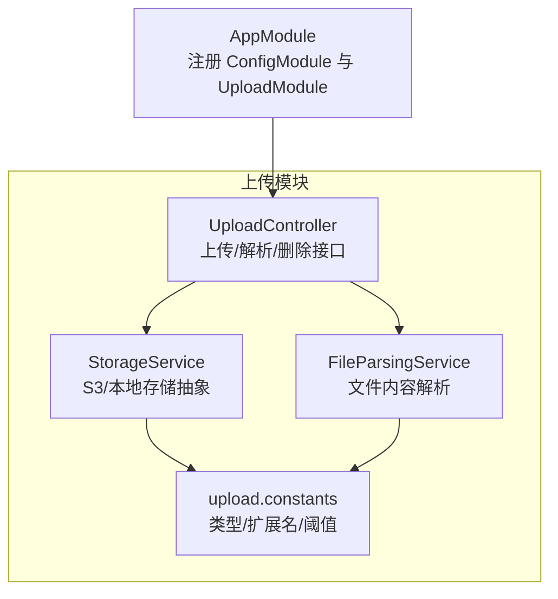
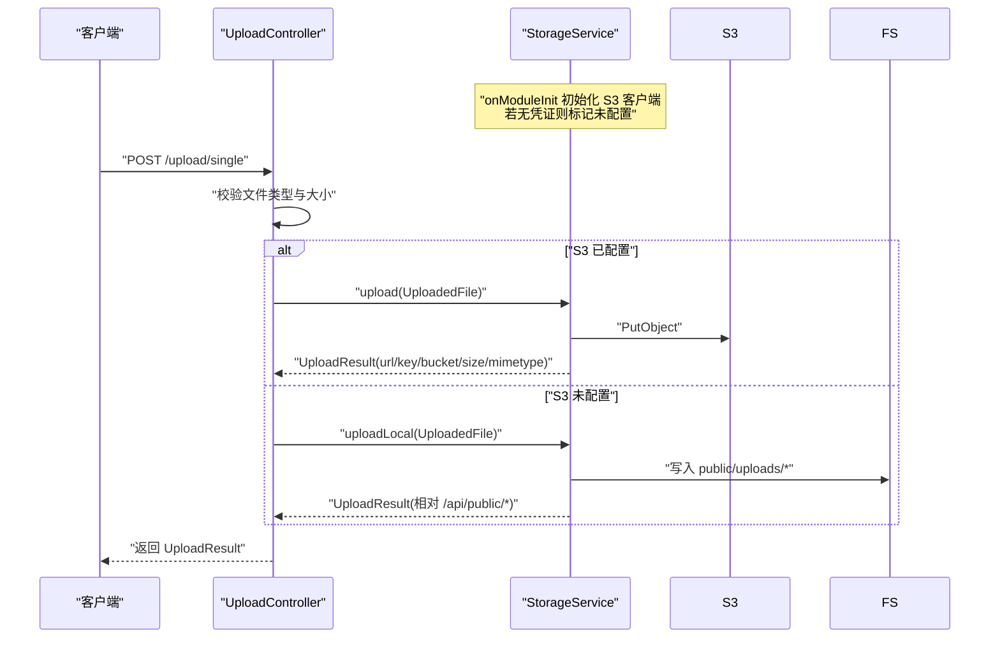
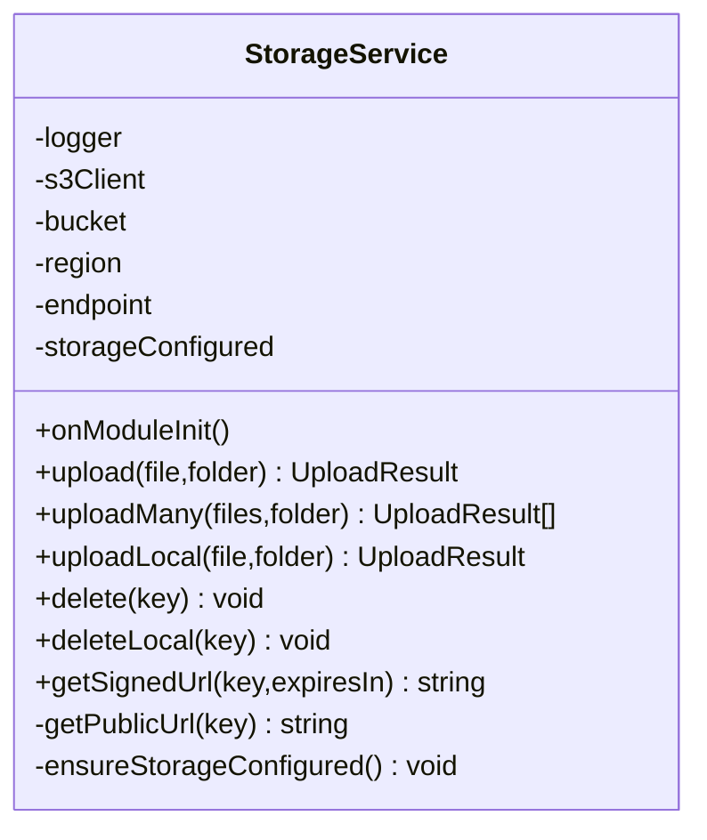
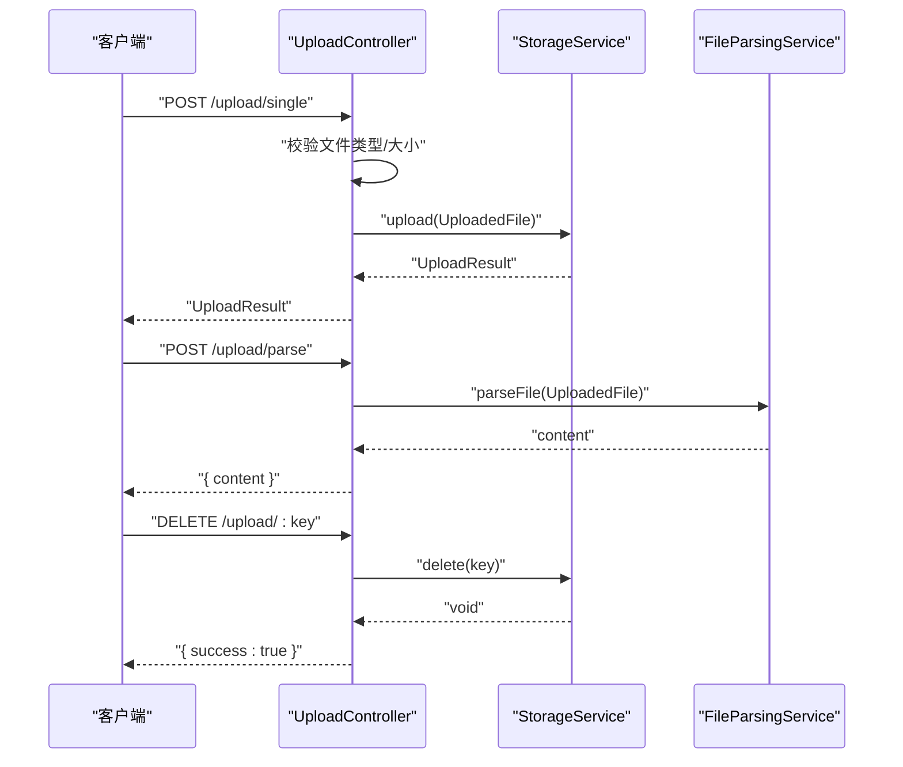
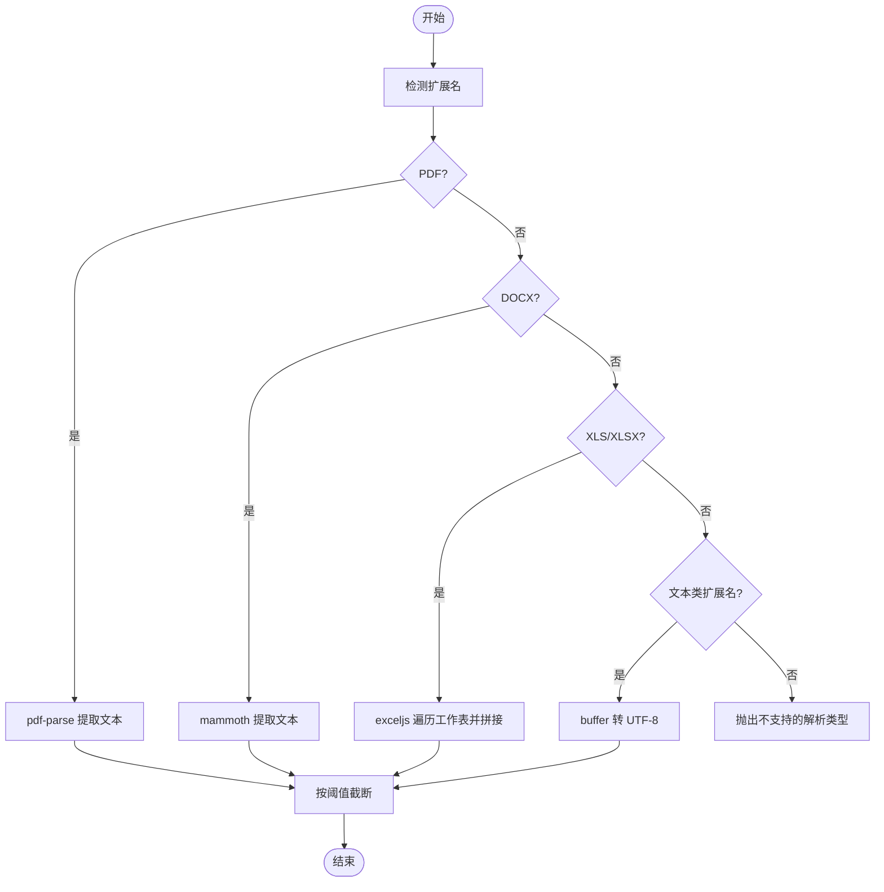
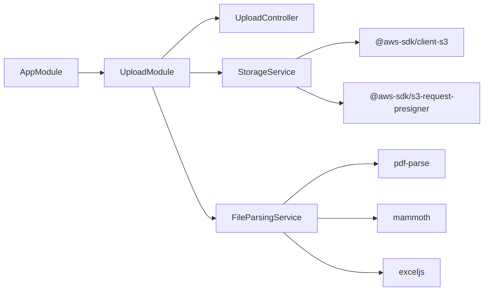

# 存储服务

<cite>
**本文引用的文件**
- [apps/backend/src/upload/storage.service.ts](file://apps/backend/src/upload/storage.service.ts)
- [apps/backend/src/upload/upload.controller.ts](file://apps/backend/src/upload/upload.controller.ts)
- [apps/backend/src/upload/upload.module.ts](file://apps/backend/src/upload/upload.module.ts)
- [apps/backend/src/upload/upload.constants.ts](file://apps/backend/src/upload/upload.constants.ts)
- [apps/backend/src/upload/file-parsing.service.ts](file://apps/backend/src/upload/file-parsing.service.ts)
- [apps/backend/src/app.module.ts](file://apps/backend/src/app.module.ts)
- [apps/backend/tests/upload/storage.service.spec.ts](file://apps/backend/tests/upload/storage.service.spec.ts)
</cite>

## 目录
1. [简介](#简介)
2. [项目结构](#项目结构)
3. [核心组件](#核心组件)
4. [架构总览](#架构总览)
5. [详细组件分析](#详细组件分析)
6. [依赖关系分析](#依赖关系分析)
7. [性能考量](#性能考量)
8. [故障排查指南](#故障排查指南)
9. [结论](#结论)
10. [附录](#附录)

## 简介
本文件面向 Lumina Todo 后端的“存储服务”，系统性阐述其在本地存储与 S3 云存储之间的切换机制、文件路径生成规则、访问权限控制策略，以及核心功能（写入、读取、删除、重命名）的实现细节。文档同时覆盖配置参数、环境变量、安全认证、错误处理与监控指标建议，并提供可直接定位到源码的示例路径，帮助开发者快速上手与优化。

## 项目结构
存储相关能力集中在后端应用的上传模块中，主要由以下文件构成：
- 存储服务：负责 S3 与本地存储的统一抽象与操作
- 上传控制器：对外暴露上传、批量上传、解析与删除接口
- 上传常量：定义允许的 MIME 类型、扩展名、可解析文本扩展名与最大解析长度
- 文件解析服务：对特定格式文件进行内容提取
- 应用模块：注册上传模块与全局配置模块，使环境变量生效

**图表来源**
- [apps/backend/src/upload/upload.controller.ts:1-161](file://apps/backend/src/upload/upload.controller.ts#L1-161)
- [apps/backend/src/upload/storage.service.ts:1-216](file://apps/backend/src/upload/storage.service.ts#L1-216)
- [apps/backend/src/upload/file-parsing.service.ts:1-142](file://apps/backend/src/upload/file-parsing.service.ts#L1-142)
- [apps/backend/src/upload/upload.constants.ts:1-66](file://apps/backend/src/upload/upload.constants.ts#L1-66)
- [apps/backend/src/app.module.ts:28-146](file://apps/backend/src/app.module.ts#L28-146)

**章节来源**
- [apps/backend/src/upload/upload.module.ts:1-16](file://apps/backend/src/upload/upload.module.ts#L1-16)
- [apps/backend/src/app.module.ts:28-146](file://apps/backend/src/app.module.ts#L28-146)

## 核心组件
- 存储服务（StorageService）
  - 功能：支持 S3 与本地两种后端；提供上传、批量上传、删除、获取预签名 URL、生成公开 URL 等能力
  - 关键点：通过环境变量动态决定是否启用 S3；S3 与 OSS/MinIO 的 URL 生成策略不同；本地上传返回相对 API 路径
- 上传控制器（UploadController）
  - 功能：接收 multipart 请求，校验文件类型与大小，调用存储服务完成上传/删除，或调用解析服务完成内容提取
  - 关键点：基于 JWT 的鉴权保护；速率限制；严格白名单校验
- 文件解析服务（FileParsingService）
  - 功能：对 PDF、DOCX、XLS/XLSX 等格式进行内容提取；对纯文本类扩展名直接读取
  - 关键点：统一截断策略，避免超长文本影响下游处理
- 上传常量（upload.constants）
  - 功能：集中管理允许的 MIME 类型、扩展名、可解析文本扩展名与最大解析字符数

**章节来源**
- [apps/backend/src/upload/storage.service.ts:30-216](file://apps/backend/src/upload/storage.service.ts#L30-216)
- [apps/backend/src/upload/upload.controller.ts:19-161](file://apps/backend/src/upload/upload.controller.ts#L19-161)
- [apps/backend/src/upload/file-parsing.service.ts:9-142](file://apps/backend/src/upload/file-parsing.service.ts#L9-142)
- [apps/backend/src/upload/upload.constants.ts:1-66](file://apps/backend/src/upload/upload.constants.ts#L1-66)

## 架构总览
存储服务采用“按需启用”的设计：当 S3 凭证可用时走 S3；否则仅支持本地上传与删除，且不提供签名 URL。S3 与 OSS/MinIO 通过 endpoint 区分 URL 生成方式。

**图表来源**
- [apps/backend/src/upload/upload.controller.ts:67-90](file://apps/backend/src/upload/upload.controller.ts#L67-90)
- [apps/backend/src/upload/storage.service.ts:116-139](file://apps/backend/src/upload/storage.service.ts#L116-139)
- [apps/backend/src/upload/storage.service.ts:74-111](file://apps/backend/src/upload/storage.service.ts#L74-111)

## 详细组件分析

### 存储服务（StorageService）
- 存储策略与配置
  - 环境变量
    - S3_BUCKET：桶名，默认值为 lumina-uploads
    - S3_REGION：区域，默认 us-east-1
    - S3_ENDPOINT：可选，用于 OSS/MinIO 等兼容 S3 的服务
    - S3_ACCESS_KEY_ID / S3_SECRET_ACCESS_KEY：凭证，为空则判定为未配置
  - 初始化行为：onModuleInit 从 ConfigService 读取上述参数；若凭证缺失，后续调用会抛出“存储未配置”异常
  - URL 生成策略
    - 若存在 endpoint：使用 endpoint/{bucket}/{key} 形式
    - 否则：使用标准 AWS S3 域名 {bucket}.s3.{region}.amazonaws.com/{key}
- 文件路径生成规则
  - 云端：folder/randomUUID.ext，folder 默认 uploads
  - 本地：public/{folder}/{filename}，返回 /api/public/{folder}/{filename}
- 核心功能
  - 上传（S3）：构造 PutObjectCommand，发送至 S3，返回 UploadResult
  - 上传（本地）：写入 public/{folder}/随机文件名，返回相对 API 路径
  - 批量上传：并发执行多次上传
  - 删除（S3）：DeleteObject
  - 删除（本地）：删除 public/{folder}/{filename}
  - 获取预签名 URL：GetObject + getSignedUrl，支持指定过期时间
  - 获取公开 URL：依据 endpoint 是否存在选择不同格式
- 错误处理
  - 未配置 S3 时调用 S3 相关方法抛出 ServiceUnavailableException
  - 本地目录创建失败或写入失败抛出 ServiceUnavailableException
  - 删除失败仅记录日志，不抛异常

**图表来源**
- [apps/backend/src/upload/storage.service.ts:34-216](file://apps/backend/src/upload/storage.service.ts#L34-216)

**章节来源**
- [apps/backend/src/upload/storage.service.ts:45-69](file://apps/backend/src/upload/storage.service.ts#L45-69)
- [apps/backend/src/upload/storage.service.ts:74-111](file://apps/backend/src/upload/storage.service.ts#L74-111)
- [apps/backend/src/upload/storage.service.ts:116-139](file://apps/backend/src/upload/storage.service.ts#L116-139)
- [apps/backend/src/upload/storage.service.ts:144-146](file://apps/backend/src/upload/storage.service.ts#L144-146)
- [apps/backend/src/upload/storage.service.ts:151-167](file://apps/backend/src/upload/storage.service.ts#L151-167)
- [apps/backend/src/upload/storage.service.ts:172-181](file://apps/backend/src/upload/storage.service.ts#L172-181)
- [apps/backend/src/upload/storage.service.ts:186-194](file://apps/backend/src/upload/storage.service.ts#L186-194)
- [apps/backend/src/upload/storage.service.ts:199-206](file://apps/backend/src/upload/storage.service.ts#L199-206)
- [apps/backend/src/upload/storage.service.ts:208-214](file://apps/backend/src/upload/storage.service.ts#L208-214)

### 上传控制器（UploadController）
- 认证与限流
  - 使用 JwtAuthGuard 进行鉴权
  - 上传与解析接口均应用 Throttle 限流策略
- 文件校验
  - 严格比对 ALLOWED_UPLOAD_MIME_TYPES 与 ALLOWED_UPLOAD_EXTENSIONS
  - 对于非白名单类型抛出 BadRequestException
- 接口职责
  - 单文件上传：接收 multipart 中名为 file 的字段，转换为 UploadedFile 后调用存储服务
  - 批量上传：遍历 files 字段，最多 10 个
  - 文件解析：调用 FileParsingService 提取文本内容
  - 删除：按 key 删除（S3 或本地）

**图表来源**
- [apps/backend/src/upload/upload.controller.ts:67-90](file://apps/backend/src/upload/upload.controller.ts#L67-90)
- [apps/backend/src/upload/upload.controller.ts:95-116](file://apps/backend/src/upload/upload.controller.ts#L95-116)
- [apps/backend/src/upload/upload.controller.ts:154-159](file://apps/backend/src/upload/upload.controller.ts#L154-159)

**章节来源**
- [apps/backend/src/upload/upload.controller.ts:22-30](file://apps/backend/src/upload/upload.controller.ts#L22-30)
- [apps/backend/src/upload/upload.controller.ts:53-65](file://apps/backend/src/upload/upload.controller.ts#L53-65)
- [apps/backend/src/upload/upload.controller.ts:82-90](file://apps/backend/src/upload/upload.controller.ts#L82-90)
- [apps/backend/src/upload/upload.controller.ts:107-116](file://apps/backend/src/upload/upload.controller.ts#L107-116)
- [apps/backend/src/upload/upload.controller.ts:136-149](file://apps/backend/src/upload/upload.controller.ts#L136-149)
- [apps/backend/src/upload/upload.controller.ts:156-159](file://apps/backend/src/upload/upload.controller.ts#L156-159)

### 文件解析服务（FileParsingService）
- 支持格式
  - PDF：使用 pdf-parse 提取文本
  - DOCX：使用 mammoth 提取纯文本
  - XLS/XLSX：使用 exceljs 遍历工作表，拼接 CSV 行
  - 文本类扩展名：直接以 UTF-8 读取
- 截断策略
  - 超过 MAX_PARSED_CONTENT_CHARS 的内容会被截断并追加省略号标识
- 错误处理
  - 对于已知 BadRequestException 并携带 upload.* 前缀的消息透传
  - 其他异常统一记录日志并返回“文件解析失败”

**图表来源**
- [apps/backend/src/upload/file-parsing.service.ts:16-72](file://apps/backend/src/upload/file-parsing.service.ts#L16-72)
- [apps/backend/src/upload/file-parsing.service.ts:134-140](file://apps/backend/src/upload/file-parsing.service.ts#L134-140)
- [apps/backend/src/upload/upload.constants.ts:45-66](file://apps/backend/src/upload/upload.constants.ts#L45-66)

**章节来源**
- [apps/backend/src/upload/file-parsing.service.ts:16-72](file://apps/backend/src/upload/file-parsing.service.ts#L16-72)
- [apps/backend/src/upload/file-parsing.service.ts:134-140](file://apps/backend/src/upload/file-parsing.service.ts#L134-140)
- [apps/backend/src/upload/upload.constants.ts:45-66](file://apps/backend/src/upload/upload.constants.ts#L45-66)

### 上传常量（upload.constants）
- ALLOWED_UPLOAD_MIME_TYPES：图片、PDF、Office、文本、JSON、CSV 等
- ALLOWED_UPLOAD_EXTENSIONS：与 MIME 白名单互补的扩展名集合
- PARSABLE_TEXT_EXTENSIONS：可直接读取的文本类扩展名集合
- MAX_PARSED_CONTENT_CHARS：解析后内容的最大字符数

**章节来源**
- [apps/backend/src/upload/upload.constants.ts:1-66](file://apps/backend/src/upload/upload.constants.ts#L1-66)

## 依赖关系分析
- 模块装配
  - AppModule 注册 ConfigModule，使 .env/.env.full.example 中的环境变量生效
  - AppModule 导入 UploadModule，从而注入 StorageService、UploadController、FileParsingService
- 组件耦合
  - UploadController 依赖 StorageService 与 FileParsingService
  - StorageService 依赖 @aws-sdk/client-s3 与 @aws-sdk/s3-request-presigner
  - FileParsingService 依赖 pdf-parse、mammoth、exceljs
- 外部依赖
  - S3 SDK：用于云端存储操作
  - 本地文件系统：用于本地上传与删除

**图表来源**
- [apps/backend/src/app.module.ts:28-146](file://apps/backend/src/app.module.ts#L28-146)
- [apps/backend/src/upload/upload.module.ts:10-15](file://apps/backend/src/upload/upload.module.ts#L10-15)
- [apps/backend/src/upload/storage.service.ts:3-13](file://apps/backend/src/upload/storage.service.ts#L3-13)
- [apps/backend/src/upload/file-parsing.service.ts:1-7](file://apps/backend/src/upload/file-parsing.service.ts#L1-7)

**章节来源**
- [apps/backend/src/app.module.ts:28-146](file://apps/backend/src/app.module.ts#L28-146)
- [apps/backend/src/upload/upload.module.ts:10-15](file://apps/backend/src/upload/upload.module.ts#L10-15)
- [apps/backend/src/upload/storage.service.ts:3-13](file://apps/backend/src/upload/storage.service.ts#L3-13)
- [apps/backend/src/upload/file-parsing.service.ts:1-7](file://apps/backend/src/upload/file-parsing.service.ts#L1-7)

## 性能考量
- 上传路径选择
  - 本地上传：适合小规模、低并发场景；注意磁盘空间与权限
  - S3 上传：适合高并发、跨地域访问；注意网络延迟与带宽
- 并发与批处理
  - uploadMany 使用 Promise.all 并发上传，提升吞吐；但需关注 S3 限速与客户端并发上限
- URL 生成
  - 本地：静态文件由 Web 服务器直接提供，延迟低
  - S3/OSS：依赖 CDN/边缘节点缓存，建议开启对象缓存头与合适的过期策略
- 解析性能
  - 大体积 PDF/DOCX/XLSX 解析耗时较长，建议异步化或队列化处理
- 限流与资源保护
  - 控制单次上传大小与文件数量，避免内存峰值过高
  - 速率限制策略已在控制器中应用，可根据业务调整

[本节为通用性能建议，无需特定文件来源]

## 故障排查指南
- “存储未配置”
  - 现象：调用 S3 相关方法（上传/删除/签名 URL）抛出 ServiceUnavailableException
  - 排查：确认 S3_ACCESS_KEY_ID 与 S3_SECRET_ACCESS_KEY 是否正确设置
  - 参考
    - [apps/backend/src/upload/storage.service.ts:208-214](file://apps/backend/src/upload/storage.service.ts#L208-214)
    - [apps/backend/tests/upload/storage.service.spec.ts:32-46](file://apps/backend/tests/upload/storage.service.spec.ts#L32-46)
- “目录创建失败/文件写入失败”
  - 现象：本地上传抛出 ServiceUnavailableException
  - 排查：检查 public 目录权限、磁盘空间、路径是否存在
  - 参考
    - [apps/backend/src/upload/storage.service.ts:84-101](file://apps/backend/src/upload/storage.service.ts#L84-101)
- “文件类型不受支持”
  - 现象：上传/解析接口返回“不支持的文件类型”
  - 排查：确认扩展名与 MIME 是否在白名单中
  - 参考
    - [apps/backend/src/upload/upload.controller.ts:53-65](file://apps/backend/src/upload/upload.controller.ts#L53-65)
    - [apps/backend/src/upload/upload.constants.ts:1-66](file://apps/backend/src/upload/upload.constants.ts#L1-66)
- “文件解析失败”
  - 现象：解析接口返回“文件解析失败”
  - 排查：查看日志定位具体异常；确认文件格式与第三方库版本
  - 参考
    - [apps/backend/src/upload/file-parsing.service.ts:48-72](file://apps/backend/src/upload/file-parsing.service.ts#L48-72)

**章节来源**
- [apps/backend/src/upload/storage.service.ts:208-214](file://apps/backend/src/upload/storage.service.ts#L208-214)
- [apps/backend/tests/upload/storage.service.spec.ts:32-46](file://apps/backend/tests/upload/storage.service.spec.ts#L32-46)
- [apps/backend/src/upload/storage.service.ts:84-101](file://apps/backend/src/upload/storage.service.ts#L84-101)
- [apps/backend/src/upload/upload.controller.ts:53-65](file://apps/backend/src/upload/upload.controller.ts#L53-65)
- [apps/backend/src/upload/upload.constants.ts:1-66](file://apps/backend/src/upload/upload.constants.ts#L1-66)
- [apps/backend/src/upload/file-parsing.service.ts:48-72](file://apps/backend/src/upload/file-parsing.service.ts#L48-72)

## 结论
存储服务通过简洁的接口抽象实现了本地与 S3 的无缝切换，并结合严格的文件类型白名单与速率限制保障了安全性与稳定性。生产环境中建议优先使用 S3 并配合 CDN 加速；本地模式仅适用于开发或受限环境。通过合理的配置与监控，可进一步提升可靠性与性能。

[本节为总结性内容，无需特定文件来源]

## 附录

### 存储配置参数与环境变量
- S3_BUCKET：桶名，默认 lumina-uploads
- S3_REGION：区域，默认 us-east-1
- S3_ENDPOINT：可选，用于 OSS/MinIO 等兼容 S3 的服务
- S3_ACCESS_KEY_ID / S3_SECRET_ACCESS_KEY：S3 凭证，为空则禁用 S3 功能

**章节来源**
- [apps/backend/src/upload/storage.service.ts:45-69](file://apps/backend/src/upload/storage.service.ts#L45-69)

### 访问权限控制
- 上传/删除/解析接口均受 JwtAuthGuard 保护
- 上传与解析接口应用 Throttle 限流策略
- 文件类型严格白名单校验

**章节来源**
- [apps/backend/src/upload/upload.controller.ts:24-26](file://apps/backend/src/upload/upload.controller.ts#L24-26)
- [apps/backend/src/upload/upload.controller.ts:71-72](file://apps/backend/src/upload/upload.controller.ts#L71-72)
- [apps/backend/src/upload/upload.controller.ts:96-97](file://apps/backend/src/upload/upload.controller.ts#L96-97)
- [apps/backend/src/upload/upload.controller.ts:53-65](file://apps/backend/src/upload/upload.controller.ts#L53-65)

### 核心功能使用示例（代码路径）
- 单文件上传
  - [apps/backend/src/upload/upload.controller.ts:82-90](file://apps/backend/src/upload/upload.controller.ts#L82-90)
  - [apps/backend/src/upload/storage.service.ts:116-139](file://apps/backend/src/upload/storage.service.ts#L116-139)
- 批量上传
  - [apps/backend/src/upload/upload.controller.ts:136-149](file://apps/backend/src/upload/upload.controller.ts#L136-149)
  - [apps/backend/src/upload/storage.service.ts:144-146](file://apps/backend/src/upload/storage.service.ts#L144-146)
- 删除文件
  - [apps/backend/src/upload/upload.controller.ts:156-159](file://apps/backend/src/upload/upload.controller.ts#L156-159)
  - [apps/backend/src/upload/storage.service.ts:172-181](file://apps/backend/src/upload/storage.service.ts#L172-181)
- 获取预签名 URL
  - [apps/backend/src/upload/storage.service.ts:186-194](file://apps/backend/src/upload/storage.service.ts#L186-194)

### 不同存储后端的切换逻辑与性能差异
- 切换逻辑
  - onModuleInit 读取 S3 凭证；若凭证缺失，后续 S3 操作抛异常，本地上传仍可用
- 性能差异
  - 本地：低延迟、零网络开销，但扩展性差
  - S3：高扩展、跨地域访问友好，但受网络与配额限制

**章节来源**
- [apps/backend/src/upload/storage.service.ts:45-69](file://apps/backend/src/upload/storage.service.ts#L45-69)
- [apps/backend/src/upload/storage.service.ts:116-139](file://apps/backend/src/upload/storage.service.ts#L116-139)
- [apps/backend/src/upload/storage.service.ts:172-181](file://apps/backend/src/upload/storage.service.ts#L172-181)

### 监控指标建议
- 上传成功率与失败率
- 上传耗时分布（P50/P95/P99）
- S3 请求次数与错误码统计
- 本地磁盘使用率与写入失败次数
- 文件解析耗时与失败率

[本节为通用监控建议，无需特定文件来源]