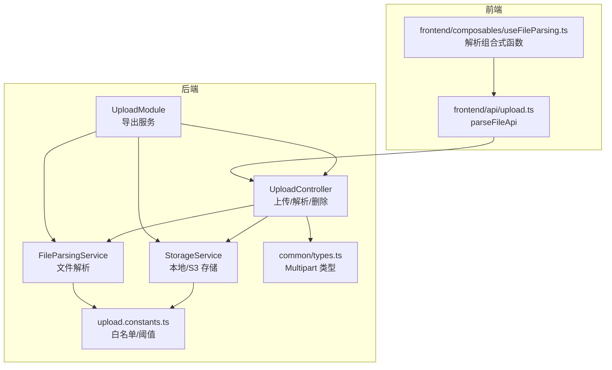
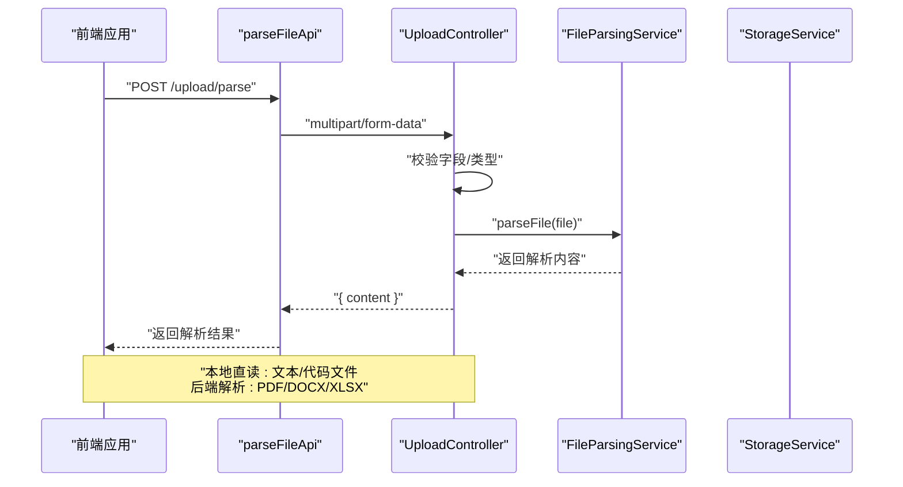
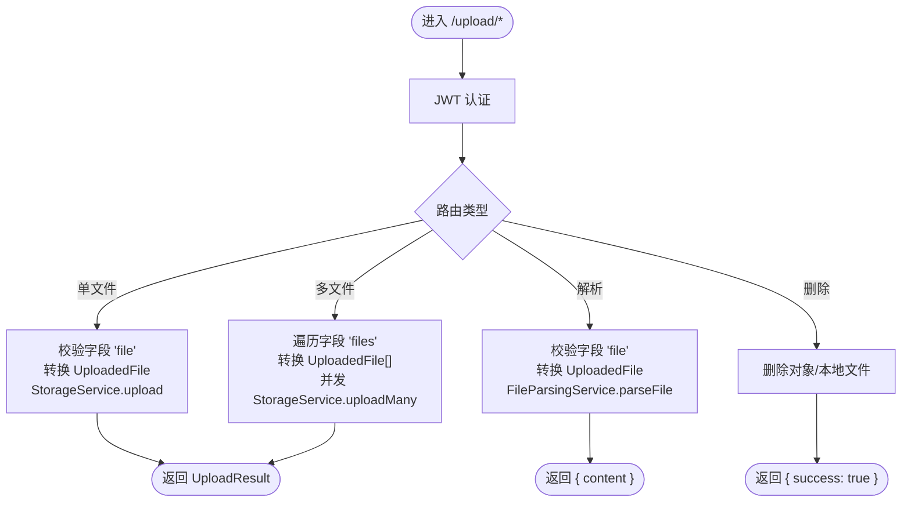
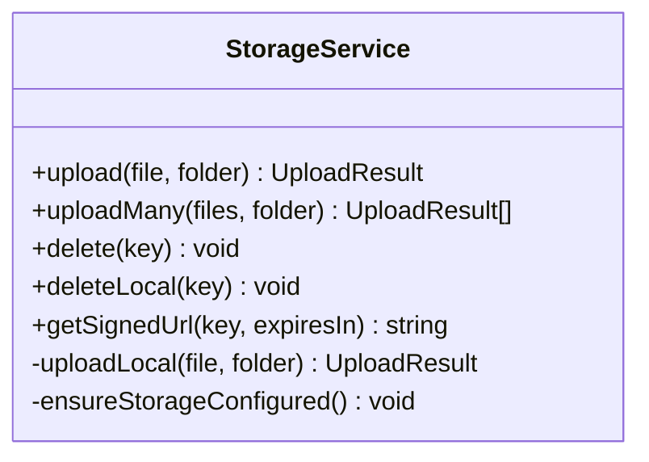
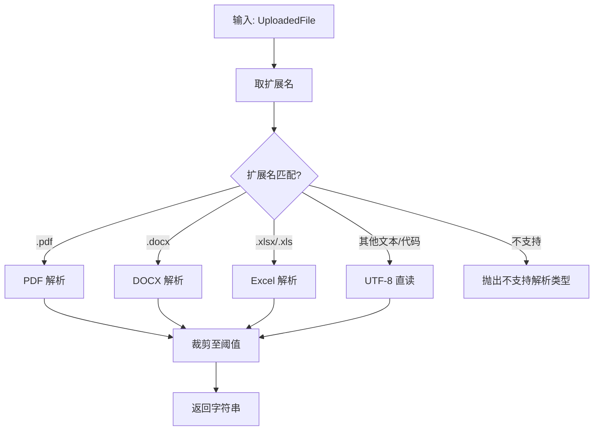
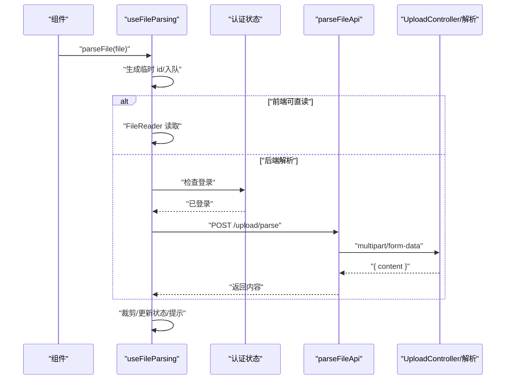
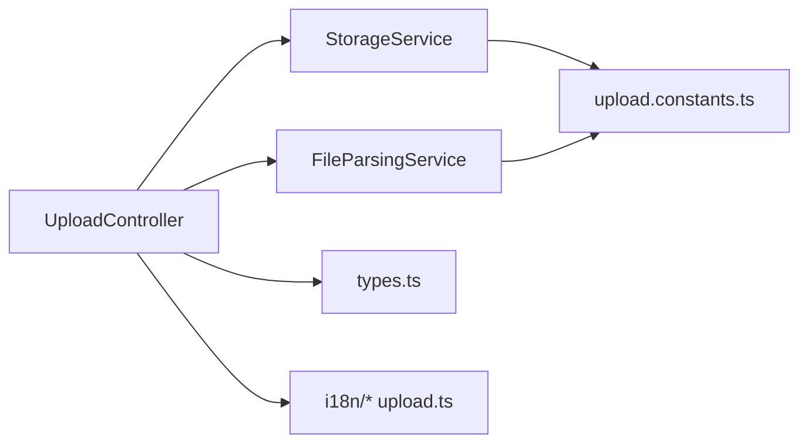

# 文件上传系统

<cite>
**本文引用的文件**
- [apps/backend/src/upload/upload.controller.ts](file://apps/backend/src/upload/upload.controller.ts)
- [apps/backend/src/upload/storage.service.ts](file://apps/backend/src/upload/storage.service.ts)
- [apps/backend/src/upload/file-parsing.service.ts](file://apps/backend/src/upload/file-parsing.service.ts)
- [apps/backend/src/upload/upload.constants.ts](file://apps/backend/src/upload/upload.constants.ts)
- [apps/backend/src/upload/upload.module.ts](file://apps/backend/src/upload/upload.module.ts)
- [apps/backend/src/common/types.ts](file://apps/backend/src/common/types.ts)
- [apps/backend/src/i18n/zh-CN/upload.ts](file://apps/backend/src/i18n/zh-CN/upload.ts)
- [apps/backend/src/i18n/en-US/upload.ts](file://apps/backend/src/i18n/en-US/upload.ts)
- [apps/frontend/src/api/upload.ts](file://apps/frontend/src/api/upload.ts)
- [apps/frontend/src/composables/useFileParsing.ts](file://apps/frontend/src/composables/useFileParsing.ts)
</cite>

## 目录
1. [简介](#简介)
2. [项目结构](#项目结构)
3. [核心组件](#核心组件)
4. [架构总览](#架构总览)
5. [详细组件分析](#详细组件分析)
6. [依赖关系分析](#依赖关系分析)
7. [性能与容量规划](#性能与容量规划)
8. [安全与访问控制](#安全与访问控制)
9. [前端实现与交互](#前端实现与交互)
10. [API 使用示例](#api-使用示例)
11. [故障排查指南](#故障排查指南)
12. [结论](#结论)

## 简介
本文件上传系统为 Lumina Todo 提供统一的文件上传、解析与存储能力，覆盖以下关键能力：
- 存储策略：本地存储与云存储（AWS S3 及兼容 S3 的对象存储，如阿里云 OSS、MinIO）
- 文件解析：支持 PDF、DOCX、XLS/XLSX 等复杂文档以及多种文本/代码格式的纯文本解析；对解析结果进行长度裁剪
- 安全与合规：基于 JWT 的认证保护、文件类型白名单校验、上传与解析接口限流
- 前端集成：文件选择、拖拽上传、解析流程与进度提示，支持前端直读与后端解析两种路径

## 项目结构
后端采用 NestJS 模块化组织，上传相关模块位于 apps/backend/src/upload，前端位于 apps/frontend/src。

**图表来源**
- [apps/backend/src/upload/upload.controller.ts:1-161](file://apps/backend/src/upload/upload.controller.ts#L1-L161)
- [apps/backend/src/upload/storage.service.ts:1-216](file://apps/backend/src/upload/storage.service.ts#L1-L216)
- [apps/backend/src/upload/file-parsing.service.ts:1-142](file://apps/backend/src/upload/file-parsing.service.ts#L1-L142)
- [apps/backend/src/upload/upload.module.ts:1-16](file://apps/backend/src/upload/upload.module.ts#L1-L16)
- [apps/backend/src/common/types.ts:1-16](file://apps/backend/src/common/types.ts#L1-L16)
- [apps/backend/src/upload/upload.constants.ts:1-66](file://apps/backend/src/upload/upload.constants.ts#L1-L66)
- [apps/frontend/src/api/upload.ts:1-23](file://apps/frontend/src/api/upload.ts#L1-L23)
- [apps/frontend/src/composables/useFileParsing.ts:1-122](file://apps/frontend/src/composables/useFileParsing.ts#L1-L122)

**章节来源**
- [apps/backend/src/upload/upload.module.ts:1-16](file://apps/backend/src/upload/upload.module.ts#L1-L16)
- [apps/backend/src/common/types.ts:1-16](file://apps/backend/src/common/types.ts#L1-L16)

## 核心组件
- 上传控制器 UploadController：提供单文件上传、多文件上传、文件解析、删除接口；内置 JWT 认证与限流
- 存储服务 StorageService：封装本地文件写入与 S3 对象上传/删除/签名 URL；支持 OSS/MinIO 兼容端点
- 文件解析服务 FileParsingService：按扩展名分派解析器，支持 PDF、DOCX、XLS/XLSX 与多种文本/代码格式；对结果进行长度裁剪
- 常量与白名单 upload.constants.ts：定义允许的 MIME 类型与扩展名、可解析文本扩展名、解析内容最大字符数
- 前端 API 与组合式函数：封装解析请求、前端直读与后端解析的混合策略、错误处理与提示

**章节来源**
- [apps/backend/src/upload/upload.controller.ts:1-161](file://apps/backend/src/upload/upload.controller.ts#L1-L161)
- [apps/backend/src/upload/storage.service.ts:1-216](file://apps/backend/src/upload/storage.service.ts#L1-L216)
- [apps/backend/src/upload/file-parsing.service.ts:1-142](file://apps/backend/src/upload/file-parsing.service.ts#L1-L142)
- [apps/backend/src/upload/upload.constants.ts:1-66](file://apps/backend/src/upload/upload.constants.ts#L1-L66)
- [apps/frontend/src/api/upload.ts:1-23](file://apps/frontend/src/api/upload.ts#L1-L23)
- [apps/frontend/src/composables/useFileParsing.ts:1-122](file://apps/frontend/src/composables/useFileParsing.ts#L1-L122)

## 架构总览
后端通过 UploadController 统一入口，结合 StorageService 与 FileParsingService 实现“上传即解析”的能力；前端通过 useFileParsing 在本地与后端之间动态选择最优解析路径。

**图表来源**
- [apps/frontend/src/api/upload.ts:1-23](file://apps/frontend/src/api/upload.ts#L1-L23)
- [apps/frontend/src/composables/useFileParsing.ts:1-122](file://apps/frontend/src/composables/useFileParsing.ts#L1-L122)
- [apps/backend/src/upload/upload.controller.ts:95-116](file://apps/backend/src/upload/upload.controller.ts#L95-L116)
- [apps/backend/src/upload/file-parsing.service.ts:1-142](file://apps/backend/src/upload/file-parsing.service.ts#L1-L142)

## 详细组件分析

### 上传控制器 UploadController
- 认证与鉴权：所有路由启用 JWT 守卫，要求携带 Bearer Token
- 单文件上传：接收名为 file 的二进制字段，转换为通用 UploadedFile 后调用 StorageService.upload
- 多文件上传：接收名为 files 的数组字段，最多 10 个（由前端约束），逐个转换后并发上传
- 文件解析：接收 file 字段，调用 FileParsingService.parseFile 返回纯文本内容
- 删除文件：根据 key 删除 S3 对象或本地文件
- 限流：上传与解析接口分别应用独立限流策略

**图表来源**
- [apps/backend/src/upload/upload.controller.ts:67-159](file://apps/backend/src/upload/upload.controller.ts#L67-L159)

**章节来源**
- [apps/backend/src/upload/upload.controller.ts:1-161](file://apps/backend/src/upload/upload.controller.ts#L1-L161)

### 存储服务 StorageService
- 初始化：从配置读取 S3_REGION、S3_BUCKET、S3_ENDPOINT、S3_ACCESS_KEY_ID、S3_SECRET_ACCESS_KEY；若凭证缺失则标记未配置
- 本地上传：生成 UUID 文件名，写入 apps/backend/public/uploads 下；返回 /api/public/{key} 的可访问 URL
- S3 上传：生成 UUID key，PutObject 到指定桶；返回标准公有 URL 或自定义 endpoint 的 URL
- 批量上传：Promise.all 并发上传
- 删除：S3 删除或本地删除
- 预签名 URL：用于私有对象的临时访问

**图表来源**
- [apps/backend/src/upload/storage.service.ts:34-215](file://apps/backend/src/upload/storage.service.ts#L34-L215)

**章节来源**
- [apps/backend/src/upload/storage.service.ts:1-216](file://apps/backend/src/upload/storage.service.ts#L1-L216)

### 文件解析服务 FileParsingService
- 解析策略：按扩展名分派到 PDF、DOCX、Excel 或文本/代码直读；不支持的类型抛出异常
- 文本裁剪：超过阈值时截断并追加省略标识
- 错误处理：区分业务异常与未知错误，记录日志并返回标准化错误消息

**图表来源**
- [apps/backend/src/upload/file-parsing.service.ts:16-72](file://apps/backend/src/upload/file-parsing.service.ts#L16-L72)
- [apps/backend/src/upload/upload.constants.ts:45-65](file://apps/backend/src/upload/upload.constants.ts#L45-L65)

**章节来源**
- [apps/backend/src/upload/file-parsing.service.ts:1-142](file://apps/backend/src/upload/file-parsing.service.ts#L1-L142)
- [apps/backend/src/upload/upload.constants.ts:1-66](file://apps/backend/src/upload/upload.constants.ts#L1-L66)

### 前端解析组合式函数 useFileParsing
- 混合策略：isFrontendParsable 为真时前端直读；否则调用后端 /upload/parse
- 登录态校验：后端解析前需已登录
- 状态管理：维护解析队列与状态（parsing/completed/error），并进行内容长度裁剪与用户提示
- 清理与移除：支持清空与按 id 移除

**图表来源**
- [apps/frontend/src/composables/useFileParsing.ts:47-95](file://apps/frontend/src/composables/useFileParsing.ts#L47-L95)
- [apps/frontend/src/api/upload.ts:11-22](file://apps/frontend/src/api/upload.ts#L11-L22)

**章节来源**
- [apps/frontend/src/composables/useFileParsing.ts:1-122](file://apps/frontend/src/composables/useFileParsing.ts#L1-L122)
- [apps/frontend/src/api/upload.ts:1-23](file://apps/frontend/src/api/upload.ts#L1-L23)

## 依赖关系分析
- 控制器依赖：UploadController 依赖 StorageService 与 FileParsingService
- 类型依赖：MultipartFile 与 FastifyRequestWithMultipart 定义来自 common/types.ts
- 白名单与阈值：upload.constants.ts 为解析与上传提供规则
- 国际化：upload.ts 提供错误文案

**图表来源**
- [apps/backend/src/upload/upload.controller.ts:1-18](file://apps/backend/src/upload/upload.controller.ts#L1-L18)
- [apps/backend/src/common/types.ts:1-16](file://apps/backend/src/common/types.ts#L1-L16)
- [apps/backend/src/upload/upload.constants.ts:1-66](file://apps/backend/src/upload/upload.constants.ts#L1-L66)
- [apps/backend/src/i18n/zh-CN/upload.ts:1-10](file://apps/backend/src/i18n/zh-CN/upload.ts#L1-L10)
- [apps/backend/src/i18n/en-US/upload.ts:1-10](file://apps/backend/src/i18n/en-US/upload.ts#L1-L10)

**章节来源**
- [apps/backend/src/upload/upload.controller.ts:1-18](file://apps/backend/src/upload/upload.controller.ts#L1-L18)
- [apps/backend/src/common/types.ts:1-16](file://apps/backend/src/common/types.ts#L1-L16)
- [apps/backend/src/upload/upload.constants.ts:1-66](file://apps/backend/src/upload/upload.constants.ts#L1-L66)
- [apps/backend/src/i18n/zh-CN/upload.ts:1-10](file://apps/backend/src/i18n/zh-CN/upload.ts#L1-L10)
- [apps/backend/src/i18n/en-US/upload.ts:1-10](file://apps/backend/src/i18n/en-US/upload.ts#L1-L10)

## 性能与容量规划
- 并发上传：uploadMany 使用 Promise.all 并发上传，提升吞吐；建议前端限制一次最多 10 个文件以避免内存峰值
- 限流策略：上传与解析接口分别限流，防止滥用；可根据部署环境调整 Redis 存储与阈值
- 解析阈值：MAX_PARSED_CONTENT_CHARS 限制解析输出长度，避免超大文档导致内存压力
- 存储成本：S3 适合长期归档与跨地域访问；本地存储适合开发/小规模部署，注意磁盘空间与备份策略

[本节为通用指导，无需特定文件引用]

## 安全与访问控制
- 认证：所有上传/解析/删除接口均受 JWT 守卫保护
- 文件类型白名单：仅允许白名单内的 MIME 类型与扩展名，降低恶意文件风险
- 限流：防止暴力尝试与资源耗尽
- 存储可见性：本地上传返回 /api/public/{key}；S3 默认私有，可通过 getSignedUrl 生成临时访问链接
- 错误国际化：错误消息在中英文 i18n 中均有定义，便于用户理解

**章节来源**
- [apps/backend/src/upload/upload.controller.ts:24-25](file://apps/backend/src/upload/upload.controller.ts#L24-L25)
- [apps/backend/src/upload/upload.constants.ts:1-66](file://apps/backend/src/upload/upload.constants.ts#L1-L66)
- [apps/backend/src/i18n/zh-CN/upload.ts:1-10](file://apps/backend/src/i18n/zh-CN/upload.ts#L1-L10)
- [apps/backend/src/i18n/en-US/upload.ts:1-10](file://apps/backend/src/i18n/en-US/upload.ts#L1-L10)

## 前端实现与交互
- 文件选择与拖拽：组件层负责触发选择与拖拽事件，组装 FormData
- 解析流程：useFileParsing 决策直读或后端解析；解析完成后更新状态并提示
- 进度显示：当前实现未提供上传进度回调；可在前端引入 XHR/Axios 的 onUploadProgress 或使用 Web Workers 分片上传（需后端配合）
- 错误处理：统一 toast 提示，区分登录态缺失与解析失败

**章节来源**
- [apps/frontend/src/composables/useFileParsing.ts:1-122](file://apps/frontend/src/composables/useFileParsing.ts#L1-L122)
- [apps/frontend/src/api/upload.ts:1-23](file://apps/frontend/src/api/upload.ts#L1-L23)

## API 使用示例

- 单文件上传
  - 方法与路径：POST /upload/single
  - 请求体：multipart/form-data，字段 file 为二进制
  - 成功响应：UploadResult（包含 key、url、bucket、size、mimetype）

- 多文件上传
  - 方法与路径：POST /upload/multiple
  - 请求体：multipart/form-data，字段 files 为二进制数组
  - 成功响应：UploadResult[]

- 文件解析（不保存）
  - 方法与路径：POST /upload/parse
  - 请求体：multipart/form-data，字段 file 为二进制
  - 成功响应：{ content: string }

- 删除文件
  - 方法与路径：DELETE /upload/:key
  - 成功响应：{ success: boolean }

- 断点续传
  - 当前后端未提供断点续传接口；可采用分片上传并在后端聚合的方式实现（需额外接口与存储策略设计）

[本节为 API 使用说明，未直接分析具体源码片段]

## 故障排查指南
- 对象存储未配置
  - 现象：调用上传/删除/签名 URL 接口报错
  - 原因：S3 凭证未设置
  - 处理：配置 S3_ACCESS_KEY_ID、S3_SECRET_ACCESS_KEY、S3_BUCKET、S3_REGION（可选 S3_ENDPOINT）

- 不支持的文件类型
  - 现象：上传/解析时报“不支持的文件类型”
  - 原因：扩展名或 MIME 不在白名单内
  - 处理：确认文件扩展名与 MIME 是否在 ALLOWED_UPLOAD_EXTENSIONS/MIME_TYPES 中

- 文件解析失败
  - 现象：解析接口返回“文件解析失败”
  - 原因：不支持的扩展名或解析器内部异常
  - 处理：确认扩展名是否在可解析列表；查看后端日志定位具体错误

- 本地上传写入失败
  - 现象：返回“目录创建失败”或“文件写入失败”
  - 原因：权限不足或路径不存在
  - 处理：确保 apps/backend/public/uploads 可写且存在

**章节来源**
- [apps/backend/src/upload/storage.service.ts:53-56](file://apps/backend/src/upload/storage.service.ts#L53-L56)
- [apps/backend/src/upload/upload.constants.ts:1-66](file://apps/backend/src/upload/upload.constants.ts#L1-L66)
- [apps/backend/src/i18n/zh-CN/upload.ts:1-10](file://apps/backend/src/i18n/zh-CN/upload.ts#L1-L10)
- [apps/backend/src/i18n/en-US/upload.ts:1-10](file://apps/backend/src/i18n/en-US/upload.ts#L1-L10)

## 结论
该文件上传系统以模块化方式实现了“上传即解析”的能力，兼顾本地与云存储，具备完善的类型校验、限流与错误国际化。前端采用混合解析策略，在保证安全的同时优化用户体验。后续可在以下方面持续演进：
- 引入断点续传与分片上传接口
- 增强解析能力（OCR、多媒体元数据提取）
- 优化前端进度反馈与错误重试
- 加强对象存储的访问控制与生命周期管理