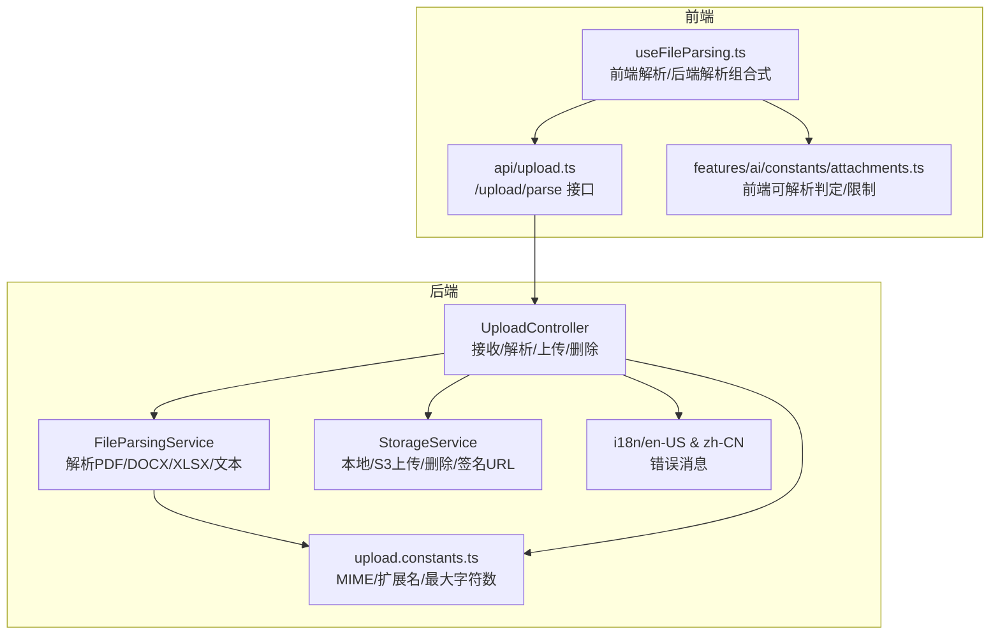
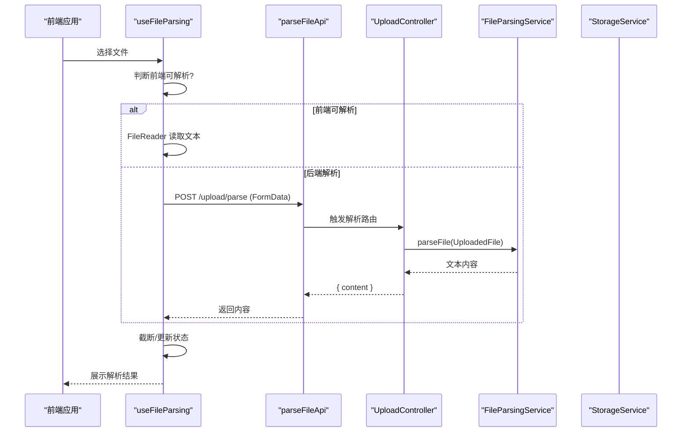
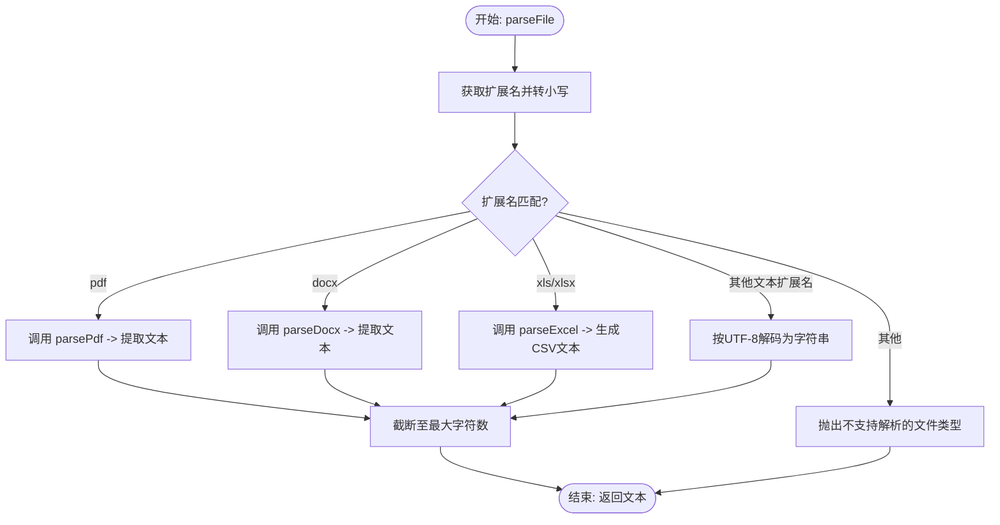
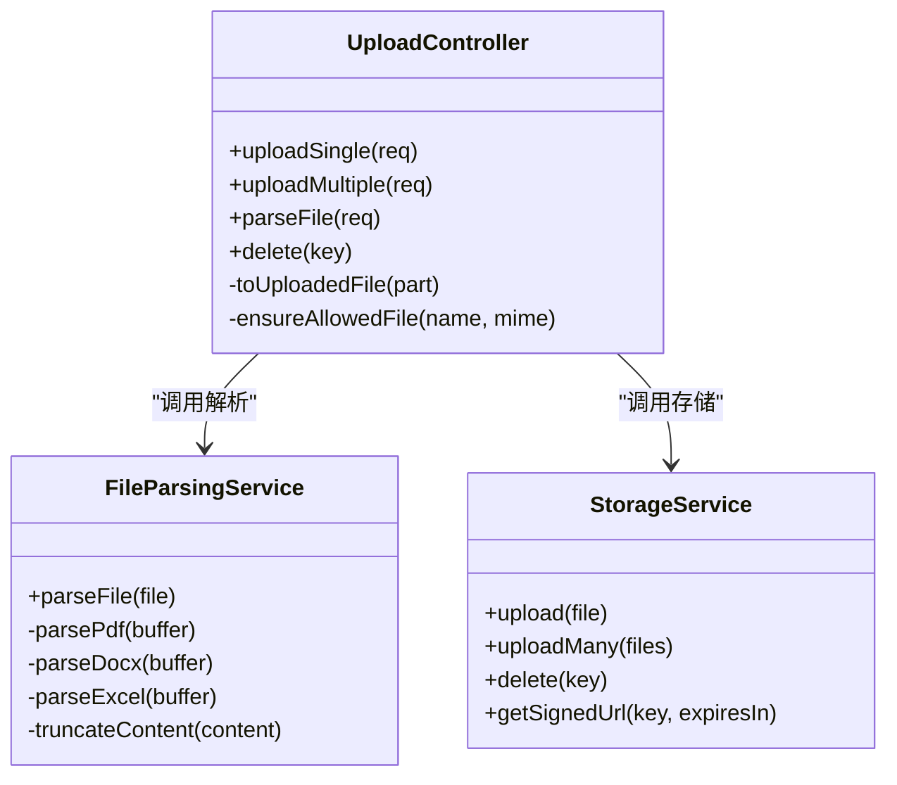
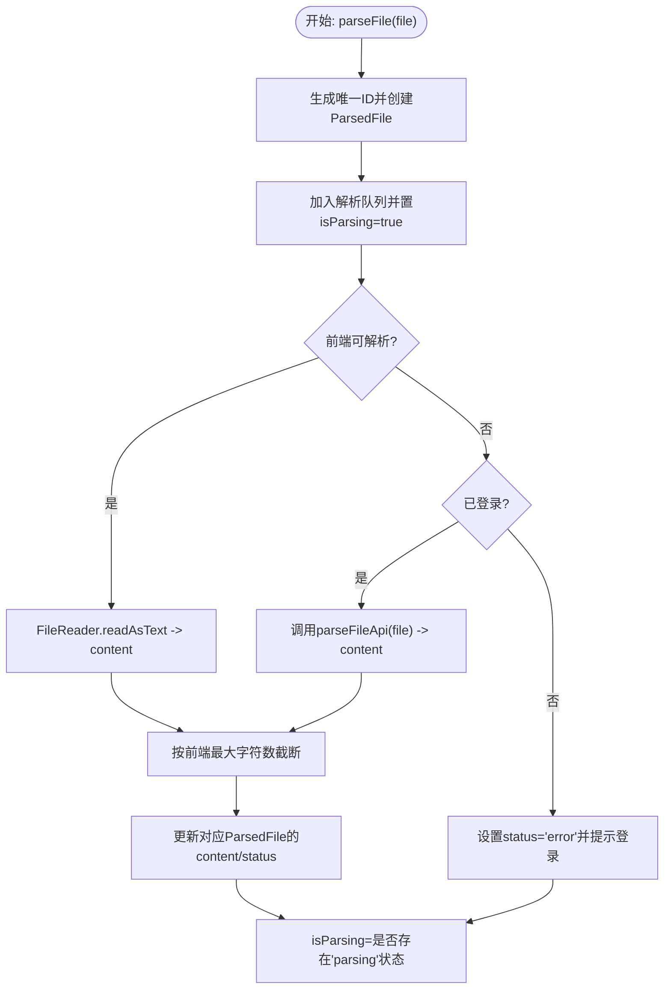
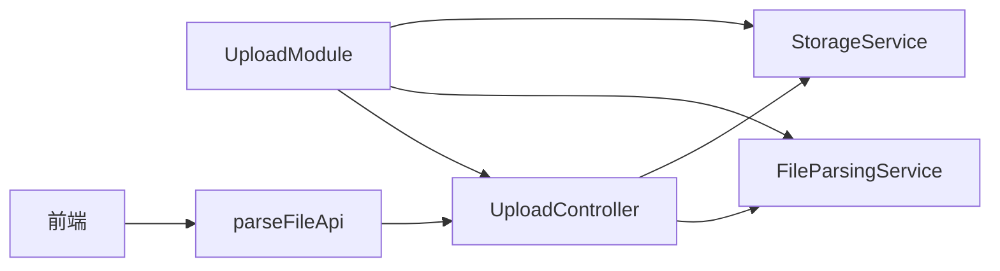

# 文件解析服务

<cite>
**本文引用的文件**
- [apps/backend/src/upload/file-parsing.service.ts](file://apps/backend/src/upload/file-parsing.service.ts)
- [apps/backend/src/upload/upload.controller.ts](file://apps/backend/src/upload/upload.controller.ts)
- [apps/backend/src/upload/storage.service.ts](file://apps/backend/src/upload/storage.service.ts)
- [apps/backend/src/upload/upload.constants.ts](file://apps/backend/src/upload/upload.constants.ts)
- [apps/backend/src/upload/upload.module.ts](file://apps/backend/src/upload/upload.module.ts)
- [apps/frontend/src/composables/useFileParsing.ts](file://apps/frontend/src/composables/useFileParsing.ts)
- [apps/frontend/src/api/upload.ts](file://apps/frontend/src/api/upload.ts)
- [apps/frontend/src/features/ai/constants/attachments.ts](file://apps/frontend/src/features/ai/constants/attachments.ts)
- [apps/backend/src/i18n/en-US/upload.ts](file://apps/backend/src/i18n/en-US/upload.ts)
- [apps/backend/src/i18n/zh-CN/upload.ts](file://apps/backend/src/i18n/zh-CN/upload.ts)
- [apps/backend/tests/upload/file-parsing.service.spec.ts](file://apps/backend/tests/upload/file-parsing.service.spec.ts)
- [apps/frontend/tests/composables/useFileParsing.spec.ts](file://apps/frontend/tests/composables/useFileParsing.spec.ts)
</cite>

## 目录
1. [简介](#简介)
2. [项目结构](#项目结构)
3. [核心组件](#核心组件)
4. [架构总览](#架构总览)
5. [详细组件分析](#详细组件分析)
6. [依赖关系分析](#依赖关系分析)
7. [性能与并发](#性能与并发)
8. [故障排查指南](#故障排查指南)
9. [结论](#结论)
10. [附录](#附录)

## 简介
本技术文档围绕 Lumina Todo 的“文件解析服务”展开，系统性说明后端文件解析能力、前端解析组合式、API 使用方式、错误处理机制，并给出性能优化与并发处理建议。重点覆盖以下方面：
- 支持的文件格式与类型检测
- MIME 类型判断与文件扩展名校验
- 内容解析算法（文本、PDF、DOCX、XLS/XLSX）
- 编码与长度截断策略
- 前后端解析流程与数据结构
- 错误处理与国际化提示
- 性能优化、缓存策略与并发控制

## 项目结构
文件解析服务由后端 NestJS 模块与前端 Vue 组合式函数协同完成，核心模块如下：
- 后端模块
  - 控制器：接收 multipart 请求，执行文件类型检查与解析
  - 解析服务：根据扩展名选择解析器，提取文本内容并截断
  - 存储服务：封装本地与 S3 存储上传、删除、签名 URL
  - 常量：允许的 MIME 类型、扩展名、可解析文本扩展名、最大解析字符数
  - 国际化：上传相关错误消息
- 前端模块
  - 组合式：统一的文件解析逻辑，区分前端可解析与后端解析场景
  - API：封装 /upload/parse 接口请求
  - 常量：前端可解析文件判定、最大解析字符数等

图表来源
- [apps/backend/src/upload/upload.controller.ts:26-160](file://apps/backend/src/upload/upload.controller.ts#L26-L160)
- [apps/backend/src/upload/file-parsing.service.ts:10-141](file://apps/backend/src/upload/file-parsing.service.ts#L10-L141)
- [apps/backend/src/upload/storage.service.ts:35-215](file://apps/backend/src/upload/storage.service.ts#L35-L215)
- [apps/backend/src/upload/upload.constants.ts:1-66](file://apps/backend/src/upload/upload.constants.ts#L1-L66)
- [apps/frontend/src/composables/useFileParsing.ts:24-121](file://apps/frontend/src/composables/useFileParsing.ts#L24-L121)
- [apps/frontend/src/api/upload.ts:11-22](file://apps/frontend/src/api/upload.ts#L11-L22)
- [apps/frontend/src/features/ai/constants/attachments.ts:51-68](file://apps/frontend/src/features/ai/constants/attachments.ts#L51-L68)

章节来源
- [apps/backend/src/upload/upload.module.ts:10-15](file://apps/backend/src/upload/upload.module.ts#L10-L15)

## 核心组件
- 后端解析服务
  - 功能：根据文件扩展名选择解析器；对 PDF 使用 pdf-parse，DOCX 使用 mammoth，XLS/XLSX 使用 exceljs；其余文本类扩展名按 UTF-8 解码
  - 截断：超过最大字符数时截断并追加省略标记
  - 错误：非解析类型抛出“不支持解析的文件类型”，其他异常统一转为“文件解析失败”
- 后端上传控制器
  - 功能：接收 multipart 表单，校验 MIME 与扩展名，调用解析服务或存储服务
  - 限流：对解析与上传分别设置节流
  - 守卫：JWT 认证
- 前端解析组合式
  - 功能：根据前端可解析判定决定是前端 FileReader 还是后端 /upload/parse；维护解析状态与结果列表
  - 限制：前端最大解析字符数与提示截断
- 前端 API
  - 功能：构造 FormData 调用 /upload/parse，返回解析后的文本内容
- 前端可解析判定
  - 功能：基于 MIME 与扩展名判断是否可在前端直接解析（文本/代码类）

章节来源
- [apps/backend/src/upload/file-parsing.service.ts:16-72](file://apps/backend/src/upload/file-parsing.service.ts#L16-L72)
- [apps/backend/src/upload/upload.controller.ts:107-116](file://apps/backend/src/upload/upload.controller.ts#L107-L116)
- [apps/frontend/src/composables/useFileParsing.ts:47-95](file://apps/frontend/src/composables/useFileParsing.ts#L47-L95)
- [apps/frontend/src/api/upload.ts:11-22](file://apps/frontend/src/api/upload.ts#L11-L22)
- [apps/frontend/src/features/ai/constants/attachments.ts:63-68](file://apps/frontend/src/features/ai/constants/attachments.ts#L63-L68)

## 架构总览
下图展示了从前端选择文件到后端解析再到结果返回的关键交互流程。

图表来源
- [apps/frontend/src/composables/useFileParsing.ts:47-95](file://apps/frontend/src/composables/useFileParsing.ts#L47-L95)
- [apps/frontend/src/api/upload.ts:11-22](file://apps/frontend/src/api/upload.ts#L11-L22)
- [apps/backend/src/upload/upload.controller.ts:107-116](file://apps/backend/src/upload/upload.controller.ts#L107-L116)
- [apps/backend/src/upload/file-parsing.service.ts:16-72](file://apps/backend/src/upload/file-parsing.service.ts#L16-L72)

## 详细组件分析

### 后端解析服务（FileParsingService）
- 支持格式与解析器
  - PDF：使用 pdf-parse 提取纯文本
  - DOCX：使用 mammoth 提取原始文本
  - XLS/XLSX：使用 exceljs 加载工作簿，遍历所有工作表，将单元格序列化为 CSV 风格文本
  - 其他文本扩展名：按 UTF-8 解码为字符串
- 截断策略
  - 当解析内容长度超过阈值时，截断并追加省略标记
- 错误处理
  - 不支持的扩展名抛出“不支持解析的文件类型”
  - 其他异常统一记录日志并抛出“文件解析失败”

图表来源
- [apps/backend/src/upload/file-parsing.service.ts:16-72](file://apps/backend/src/upload/file-parsing.service.ts#L16-L72)
- [apps/backend/src/upload/file-parsing.service.ts:74-108](file://apps/backend/src/upload/file-parsing.service.ts#L74-L108)
- [apps/backend/src/upload/file-parsing.service.ts:134-140](file://apps/backend/src/upload/file-parsing.service.ts#L134-L140)

章节来源
- [apps/backend/src/upload/file-parsing.service.ts:16-141](file://apps/backend/src/upload/file-parsing.service.ts#L16-L141)

### 后端上传控制器（UploadController）
- 职责
  - 接收 multipart/form-data，校验文件类型（MIME 或扩展名）
  - 提供 /upload/single、/upload/multiple、/upload/parse、/upload/:key 等接口
  - 对解析与上传分别施加节流
  - 使用 JWT 守卫保护接口
- 关键点
  - ensureAllowedFile：同时校验 MIME 与扩展名
  - parseFile：将 MultipartFile 转为 UploadedFile 并调用解析服务
  - uploadSingle/uploadMultiple：委托存储服务上传

图表来源
- [apps/backend/src/upload/upload.controller.ts:26-160](file://apps/backend/src/upload/upload.controller.ts#L26-L160)
- [apps/backend/src/upload/file-parsing.service.ts:10-141](file://apps/backend/src/upload/file-parsing.service.ts#L10-L141)
- [apps/backend/src/upload/storage.service.ts:115-139](file://apps/backend/src/upload/storage.service.ts#L115-L139)

章节来源
- [apps/backend/src/upload/upload.controller.ts:35-116](file://apps/backend/src/upload/upload.controller.ts#L35-L116)

### 前端解析组合式（useFileParsing）
- 数据结构
  - ParsedFile：包含 id、name、size、type、content、status、error
- 解析策略
  - 前端可解析：直接使用 FileReader 读取文本
  - 后端解析：需要登录态，调用 /upload/parse 获取内容
- 截断与提示
  - 前端同样限制最大解析字符数并在截断时发出警告
- 状态管理
  - isParsing 标识整体解析中状态
  - parsedFiles 维护解析队列与最终结果

图表来源
- [apps/frontend/src/composables/useFileParsing.ts:47-95](file://apps/frontend/src/composables/useFileParsing.ts#L47-L95)

章节来源
- [apps/frontend/src/composables/useFileParsing.ts:9-121](file://apps/frontend/src/composables/useFileParsing.ts#L9-L121)

### 前端 API（parseFileApi）
- 功能：将 File 封装为 FormData，POST 到 /upload/parse
- 返回：包含 content 字段的对象

章节来源
- [apps/frontend/src/api/upload.ts:11-22](file://apps/frontend/src/api/upload.ts#L11-L22)

### 前端可解析判定（attachments.ts）
- 前端可解析 MIME 与扩展名集合
- 文档 MIME 与扩展名集合（含文本类）
- 最大附件大小、最大解析字符数、提示截断

章节来源
- [apps/frontend/src/features/ai/constants/attachments.ts:1-69](file://apps/frontend/src/features/ai/constants/attachments.ts#L1-L69)

### 后端常量（upload.constants.ts）
- 允许的 MIME 类型与扩展名
- 可解析文本扩展名集合
- 最大解析字符数

章节来源
- [apps/backend/src/upload/upload.constants.ts:1-66](file://apps/backend/src/upload/upload.constants.ts#L1-L66)

## 依赖关系分析
- 模块导出
  - UploadModule 导出 StorageService 与 FileParsingService，便于其他模块复用
- 组件耦合
  - UploadController 依赖 FileParsingService 与 StorageService
  - FileParsingService 依赖第三方库（pdf-parse、mammoth、exceljs）
  - 前端 useFileParsing 依赖 parseFileApi 与认证状态
- 外部依赖
  - S3 SDK（AWS SDK v3）用于云端存储
  - Fastify multipart 解析
  - i18n 国际化消息

图表来源
- [apps/backend/src/upload/upload.module.ts:10-15](file://apps/backend/src/upload/upload.module.ts#L10-L15)
- [apps/backend/src/upload/upload.controller.ts:27-30](file://apps/backend/src/upload/upload.controller.ts#L27-L30)
- [apps/frontend/src/api/upload.ts:11-22](file://apps/frontend/src/api/upload.ts#L11-L22)

章节来源
- [apps/backend/src/upload/upload.module.ts:10-15](file://apps/backend/src/upload/upload.module.ts#L10-L15)

## 性能与并发
- 解析性能
  - PDF/DOCX/XLSX 解析为 CPU 密集型任务，建议限制并发与文件大小
  - exceljs 会遍历所有工作表与行，对超大表格建议分片或降采样
- 截断策略
  - 后端与前端均设置最大解析字符数，避免内存与传输压力
- 并发与限流
  - 控制器对解析与上传分别设置节流，防止资源争用
- 缓存策略
  - 当前未实现解析结果缓存；可考虑基于文件哈希的 LRU 缓存以减少重复解析
- 存储
  - 本地存储适合开发/小规模；生产建议使用 S3/MinIO，具备高可用与横向扩展能力

[本节为通用性能建议，无需特定文件引用]

## 故障排查指南
- 常见错误与定位
  - 不支持解析的文件类型：确认扩展名与 MIME 是否在允许列表中
  - 文件解析失败：查看后端日志，关注 pdf-parse、mammoth、exceljs 的异常
  - 对象存储未配置：检查 S3 凭证，确认初始化流程
  - 登录态缺失导致后端解析失败：前端需先登录再触发后端解析
- 国际化提示
  - 后端提供英文与中文的错误消息映射，便于前端统一展示
- 单元测试参考
  - 后端：覆盖不支持扩展名、YAML 文本解析、超长内容截断
  - 前端：覆盖前端可解析文件、无登录态触发复杂文件解析、登录态触发后端解析

章节来源
- [apps/backend/src/i18n/en-US/upload.ts:1-10](file://apps/backend/src/i18n/en-US/upload.ts#L1-L10)
- [apps/backend/src/i18n/zh-CN/upload.ts:1-10](file://apps/backend/src/i18n/zh-CN/upload.ts#L1-L10)
- [apps/backend/tests/upload/file-parsing.service.spec.ts:19-51](file://apps/backend/tests/upload/file-parsing.service.spec.ts#L19-L51)
- [apps/frontend/tests/composables/useFileParsing.spec.ts:38-83](file://apps/frontend/tests/composables/useFileParsing.spec.ts#L38-L83)

## 结论
文件解析服务通过“前端可解析直读 + 后端复杂文档解析”的混合策略，在保证用户体验的同时兼顾了安全性与可扩展性。后端以明确的类型校验、限流与错误处理保障稳定性，前端以组合式抽象简化集成成本。后续可在缓存、并发控制与大文件分片解析等方面进一步优化。

[本节为总结性内容，无需特定文件引用]

## 附录

### 支持的文件格式与类型检测
- 允许的 MIME 类型与扩展名
  - 图片：jpeg、png、gif、webp
  - 文档：pdf、docx、xls、xlsx、txt、md、json、csv、ts、js、py、go、java、c/c++/h/hpp、rs、yaml/yml、toml
- 前端可解析判定
  - 基于 MIME 与扩展名的白名单，优先前端直读以降低后端压力

章节来源
- [apps/backend/src/upload/upload.constants.ts:1-66](file://apps/backend/src/upload/upload.constants.ts#L1-L66)
- [apps/frontend/src/features/ai/constants/attachments.ts:51-68](file://apps/frontend/src/features/ai/constants/attachments.ts#L51-L68)

### 解析结果数据结构
- 后端解析结果
  - { content: string }
- 前端解析结果
  - ParsedFile：id、name、size、type、content、status、error

章节来源
- [apps/frontend/src/api/upload.ts:4-6](file://apps/frontend/src/api/upload.ts#L4-L6)
- [apps/frontend/src/composables/useFileParsing.ts:9-17](file://apps/frontend/src/composables/useFileParsing.ts#L9-L17)

### API 使用示例（后端）
- 解析文件（不保存）
  - 方法：POST /upload/parse
  - 请求体：multipart/form-data，字段 file
  - 成功响应：{ content: string }
  - 异常：upload.FILE_REQUIRED、upload.UNSUPPORTED_FILE_TYPE、upload.UNSUPPORTED_PARSE_FILE_TYPE、upload.FILE_PARSING_FAILED

章节来源
- [apps/backend/src/upload/upload.controller.ts:95-116](file://apps/backend/src/upload/upload.controller.ts#L95-L116)
- [apps/backend/src/i18n/en-US/upload.ts:3-7](file://apps/backend/src/i18n/en-US/upload.ts#L3-L7)
- [apps/backend/src/i18n/zh-CN/upload.ts:3-7](file://apps/backend/src/i18n/zh-CN/upload.ts#L3-L7)

### API 使用示例（前端）
- 解析文件（后端）
  - 调用 parseFileApi(file)，返回 { content }
  - 前端组合式 useFileParsing 会自动处理登录态与状态更新

章节来源
- [apps/frontend/src/api/upload.ts:11-22](file://apps/frontend/src/api/upload.ts#L11-L22)
- [apps/frontend/src/composables/useFileParsing.ts:67-74](file://apps/frontend/src/composables/useFileParsing.ts#L67-L74)

### 文件大小与字符数限制
- 前端最大解析字符数：60,000
- 后端最大解析字符数：120,000
- 单文件最大大小：10MB（用于附件上传与解析）

章节来源
- [apps/frontend/src/features/ai/constants/attachments.ts:42-43](file://apps/frontend/src/features/ai/constants/attachments.ts#L42-L43)
- [apps/backend/src/upload/upload.constants.ts:65-66](file://apps/backend/src/upload/upload.constants.ts#L65-L66)