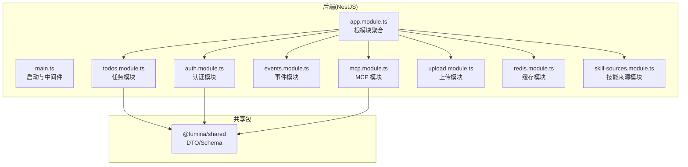
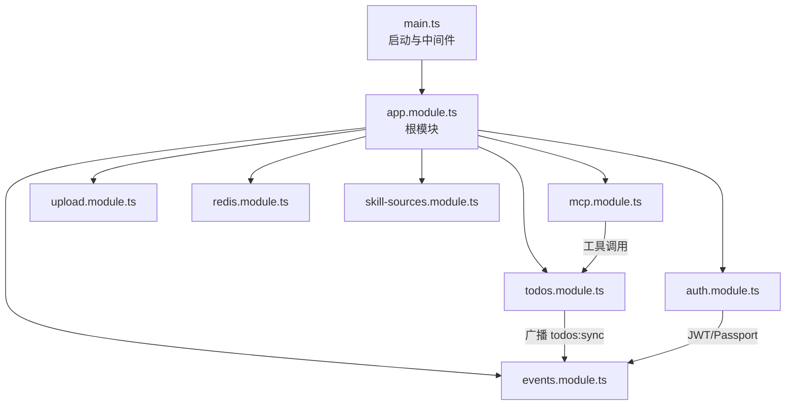
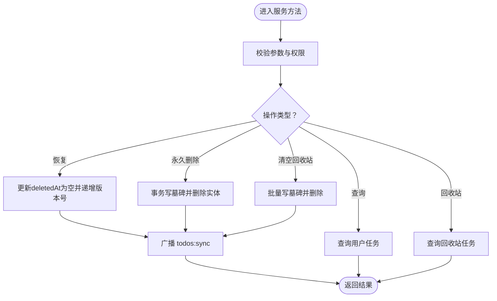
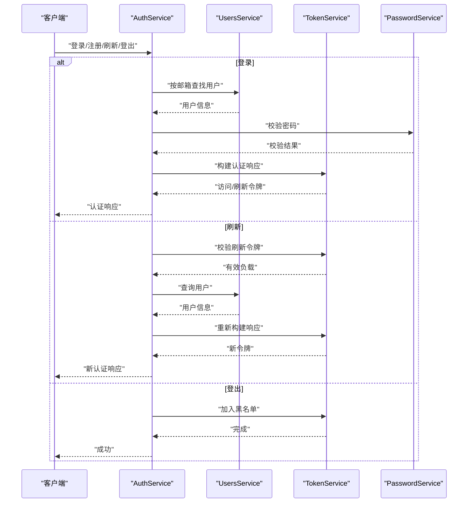
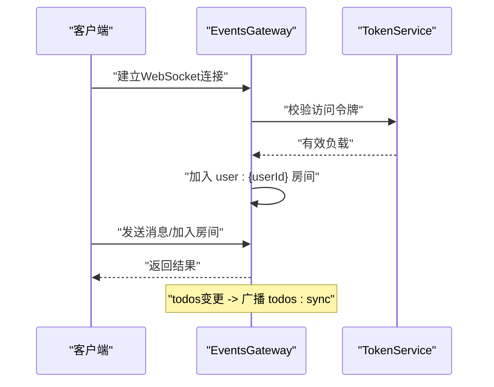
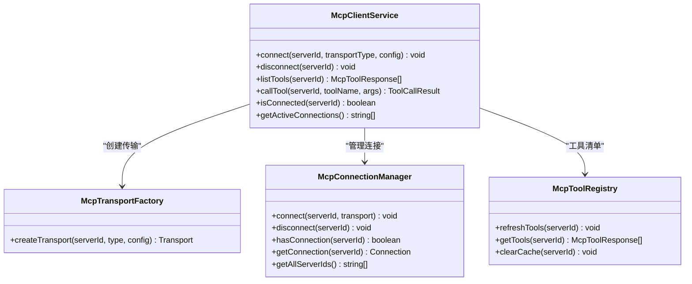
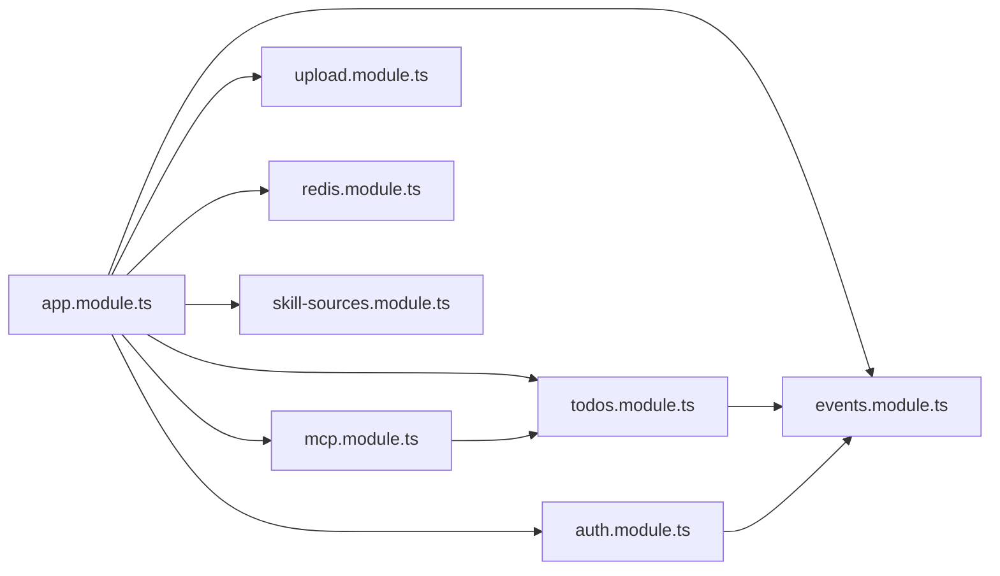

# 核心模块

<cite>
**本文引用的文件**
- [apps/backend/src/app.module.ts](file://apps/backend/src/app.module.ts)
- [apps/backend/src/main.ts](file://apps/backend/src/main.ts)
- [apps/backend/src/todos/todos.module.ts](file://apps/backend/src/todos/todos.module.ts)
- [apps/backend/src/todos/todos.service.ts](file://apps/backend/src/todos/todos.service.ts)
- [apps/backend/src/auth/auth.module.ts](file://apps/backend/src/auth/auth.module.ts)
- [apps/backend/src/auth/auth.service.ts](file://apps/backend/src/auth/auth.service.ts)
- [apps/backend/src/events/events.module.ts](file://apps/backend/src/events/events.module.ts)
- [apps/backend/src/events/events.gateway.ts](file://apps/backend/src/events/events.gateway.ts)
- [apps/backend/src/mcp/mcp.module.ts](file://apps/backend/src/mcp/mcp.module.ts)
- [apps/backend/src/mcp/mcp-client.service.ts](file://apps/backend/src/mcp/mcp-client.service.ts)
- [apps/backend/src/skill-sources/skill-sources.module.ts](file://apps/backend/src/skill-sources/skill-sources.module.ts)
- [apps/backend/src/upload/upload.module.ts](file://apps/backend/src/upload/upload.module.ts)
- [apps/backend/src/redis/redis.module.ts](file://apps/backend/src/redis/redis.module.ts)
- [apps/backend/package.json](file://apps/backend/package.json)
- [packages/shared/package.json](file://packages/shared/package.json)
</cite>

## 目录
1. [简介](#简介)
2. [项目结构](#项目结构)
3. [核心组件](#核心组件)
4. [架构总览](#架构总览)
5. [详细组件分析](#详细组件分析)
6. [依赖分析](#依赖分析)
7. [性能考虑](#性能考虑)
8. [故障排除指南](#故障排除指南)
9. [结论](#结论)
10. [附录](#附录)

## 简介
本文件为 Lumina Todo 的核心模块综合文档，聚焦以下关键模块的设计理念、实现架构与使用方法：
- 任务管理系统（Todos）
- AI 助手系统（AI）（通过 MCP 工具与技能运行时协同）
- MCP 工具系统
- 用户认证系统（Auth）
- 实时通信系统（Events）

文档解释模块间的依赖关系与协作机制，提供配置项、API 接口与使用示例，并指出扩展点与自定义能力，兼顾初学者与进阶开发者的需求。

## 项目结构
后端采用 NestJS 架构，根模块集中导入各业务模块；前端为 Capacitor/Vue 应用，通过 WebSocket 与后端进行实时通信；共享包提供跨端 DTO 与校验模型。

图表来源
- [apps/backend/src/app.module.ts:28-146](file://apps/backend/src/app.module.ts#L28-L146)
- [apps/backend/src/main.ts:34-211](file://apps/backend/src/main.ts#L34-L211)
- [apps/backend/src/todos/todos.module.ts:8-14](file://apps/backend/src/todos/todos.module.ts#L8-L14)
- [apps/backend/src/auth/auth.module.ts:19-39](file://apps/backend/src/auth/auth.module.ts#L19-L39)
- [apps/backend/src/events/events.module.ts:9-14](file://apps/backend/src/events/events.module.ts#L9-L14)
- [apps/backend/src/mcp/mcp.module.ts:13-24](file://apps/backend/src/mcp/mcp.module.ts#L13-L24)
- [apps/backend/src/upload/upload.module.ts:10-15](file://apps/backend/src/upload/upload.module.ts#L10-L15)
- [apps/backend/src/redis/redis.module.ts:26-83](file://apps/backend/src/redis/redis.module.ts#L26-L83)
- [apps/backend/src/skill-sources/skill-sources.module.ts:6-10](file://apps/backend/src/skill-sources/skill-sources.module.ts#L6-L10)

章节来源
- [apps/backend/src/app.module.ts:28-146](file://apps/backend/src/app.module.ts#L28-L146)
- [apps/backend/src/main.ts:34-211](file://apps/backend/src/main.ts#L34-L211)

## 核心组件
- 任务管理系统（Todos）
  - 职责：提供任务的查询、回收站管理、恢复与永久删除、清空回收站等能力；变更时通过事件网关广播“同步通知”，触发多端同步。
  - 关键点：基于 Prisma 访问数据库；通过 EventsGateway 广播 todos:sync 事件；事务保证墓碑记录与删除一致性。
- 用户认证系统（Auth）
  - 职责：整合用户注册、登录、令牌刷新、登出、密码重置流程；基于 JWT 与 Passport；与 Redis 黑名单配合实现会话失效控制。
- 实时通信系统（Events）
  - 职责：基于 Socket.IO 的 WebSocket 网关，提供用户房间隔离、消息广播、房间加入/离开、统一认证中间件与安全策略。
- MCP 工具系统
  - 职责：抽象传输层与连接管理，提供连接/断开、工具清单拉取、工具调用、活跃连接查询等能力；为 AI 助手提供外部工具调用通道。
- 文件上传模块（Upload）
  - 职责：统一文件存储与解析服务，支持本地与 S3 存储；提供上传控制器。
- Redis 缓存模块（Redis）
  - 职责：全局缓存配置与连接；提供 TTL、键前缀、重连策略；为限流、令牌黑名单等提供基础设施。
- 技能来源模块（Skill Sources）
  - 职责：代理外部技能来源与运行时配置，支撑 AI 助手的外部能力扩展。

章节来源
- [apps/backend/src/todos/todos.service.ts:27-147](file://apps/backend/src/todos/todos.service.ts#L27-L147)
- [apps/backend/src/auth/auth.service.ts:12-127](file://apps/backend/src/auth/auth.service.ts#L12-L127)
- [apps/backend/src/events/events.gateway.ts:57-266](file://apps/backend/src/events/events.gateway.ts#L57-L266)
- [apps/backend/src/mcp/mcp-client.service.ts:17-124](file://apps/backend/src/mcp/mcp-client.service.ts#L17-L124)
- [apps/backend/src/upload/upload.module.ts:10-15](file://apps/backend/src/upload/upload.module.ts#L10-L15)
- [apps/backend/src/redis/redis.module.ts:26-83](file://apps/backend/src/redis/redis.module.ts#L26-L83)
- [apps/backend/src/skill-sources/skill-sources.module.ts:6-10](file://apps/backend/src/skill-sources/skill-sources.module.ts#L6-L10)

## 架构总览
后端以 AppModule 为核心，按功能域拆分为多个子模块；主进程在 main.ts 中完成安全中间件、静态资源、CORS、CSRF 校验、全局拦截器与 Swagger 文档装配；Todos 与 Events 协作实现任务变更的实时同步；Auth 与 Events 在认证与授权上形成闭环；MCP 为 AI 助手提供外部工具调用能力。

图表来源
- [apps/backend/src/main.ts:34-211](file://apps/backend/src/main.ts#L34-L211)
- [apps/backend/src/app.module.ts:28-146](file://apps/backend/src/app.module.ts#L28-L146)
- [apps/backend/src/todos/todos.module.ts:8-14](file://apps/backend/src/todos/todos.module.ts#L8-L14)
- [apps/backend/src/auth/auth.module.ts:19-39](file://apps/backend/src/auth/auth.module.ts#L19-L39)
- [apps/backend/src/events/events.module.ts:9-14](file://apps/backend/src/events/events.module.ts#L9-L14)
- [apps/backend/src/mcp/mcp.module.ts:13-24](file://apps/backend/src/mcp/mcp.module.ts#L13-L24)
- [apps/backend/src/upload/upload.module.ts:10-15](file://apps/backend/src/upload/upload.module.ts#L10-L15)
- [apps/backend/src/redis/redis.module.ts:26-83](file://apps/backend/src/redis/redis.module.ts#L26-L83)
- [apps/backend/src/skill-sources/skill-sources.module.ts:6-10](file://apps/backend/src/skill-sources/skill-sources.module.ts#L6-L10)

## 详细组件分析

### 任务管理系统（Todos）
- 设计理念
  - 以“用户维度隔离”和“软删除+墓碑记录”保障数据一致性与可恢复性；通过事件广播实现多端实时同步。
- 关键流程
  - 查询：按是否置顶、排序号、创建时间排序返回。
  - 回收站：筛选 deletedAt 非空的任务并按删除时间倒序。
  - 恢复：更新 deletedAt 为空并递增版本号，随后广播 todos:sync。
  - 永久删除：事务写入墓碑记录并删除实体，随后广播 todos:sync。
  - 清空回收站：批量写墓碑并删除，随后广播 todos:sync。
- 依赖关系
  - 依赖 PrismaService 访问数据库。
  - 依赖 EventsGateway 广播同步通知。
- 扩展点
  - 可在服务层增加更多筛选条件或排序规则。
  - 可引入队列异步处理批量删除/清空逻辑。

图表来源
- [apps/backend/src/todos/todos.service.ts:35-147](file://apps/backend/src/todos/todos.service.ts#L35-L147)
- [apps/backend/src/events/events.gateway.ts:177-202](file://apps/backend/src/events/events.gateway.ts#L177-L202)

章节来源
- [apps/backend/src/todos/todos.module.ts:8-14](file://apps/backend/src/todos/todos.module.ts#L8-L14)
- [apps/backend/src/todos/todos.service.ts:27-147](file://apps/backend/src/todos/todos.service.ts#L27-L147)

### 用户认证系统（Auth）
- 设计理念
  - 统一 Facade 层整合用户、令牌与密码服务；基于 JWT 与 Passport；结合 Redis 黑名单实现会话失效控制。
- 关键流程
  - 登录：校验凭据，构建认证响应（含访问/刷新令牌）。
  - 注册：创建用户并返回认证响应。
  - 刷新：校验刷新令牌有效性与用户状态，生成新令牌。
  - 登出：将刷新令牌加入黑名单。
  - 密码重置：发起重置与执行重置。
- 依赖关系
  - 依赖 UsersService、TokenService、PasswordService。
  - 依赖 JwtModule、RedisModule、MailModule。
- 扩展点
  - 可新增第三方登录策略。
  - 可扩展多设备会话管理与失效策略。

图表来源
- [apps/backend/src/auth/auth.service.ts:23-127](file://apps/backend/src/auth/auth.service.ts#L23-L127)
- [apps/backend/src/auth/auth.module.ts:19-39](file://apps/backend/src/auth/auth.module.ts#L19-L39)

章节来源
- [apps/backend/src/auth/auth.module.ts:19-39](file://apps/backend/src/auth/auth.module.ts#L19-L39)
- [apps/backend/src/auth/auth.service.ts:12-127](file://apps/backend/src/auth/auth.service.ts#L12-L127)

### 实时通信系统（Events）
- 设计理念
  - 基于 Socket.IO 的网关，强制用户房间隔离；统一认证中间件与 CORS 策略；提供消息广播、房间加入/离开与同步通知。
- 关键流程
  - 连接：握手阶段校验访问令牌，注入用户信息并自动加入 user:{id} 房间。
  - 消息：支持向指定房间或广播发送消息。
  - 房间：加入/离开房间并广播成员变更事件。
  - 同步：后端防抖 500ms，向用户房间广播 todos:sync。
- 依赖关系
  - 依赖 TokenService 进行访问令牌校验。
  - 与 Todos 服务协作触发同步通知。
- 扩展点
  - 可扩展房间类型与权限控制。
  - 可引入消息持久化与离线重放。

图表来源
- [apps/backend/src/events/events.gateway.ts:86-266](file://apps/backend/src/events/events.gateway.ts#L86-L266)
- [apps/backend/src/events/events.module.ts:9-14](file://apps/backend/src/events/events.module.ts#L9-L14)

章节来源
- [apps/backend/src/events/events.module.ts:9-14](file://apps/backend/src/events/events.module.ts#L9-L14)
- [apps/backend/src/events/events.gateway.ts:57-266](file://apps/backend/src/events/events.gateway.ts#L57-L266)

### MCP 工具系统
- 设计理念
  - 通过传输工厂与连接管理器抽象底层通信；工具注册表负责工具清单缓存与刷新；客户端门面统一对外暴露连接、断开、列举与调用能力。
- 关键流程
  - 连接：根据传输类型与配置创建传输并建立连接，随后预热工具注册表。
  - 断开：清理工具缓存并断开连接。
  - 工具列举：若未连接则抛错；否则返回工具清单。
  - 工具调用：校验工具存在性，调用远端工具并返回结果。
  - 连接状态：查询活跃连接集合。
- 依赖关系
  - 依赖传输工厂、连接管理器、工具注册表。
- 扩展点
  - 可新增传输类型与连接策略。
  - 可扩展工具调用的超时与重试策略。

图表来源
- [apps/backend/src/mcp/mcp-client.service.ts:17-124](file://apps/backend/src/mcp/mcp-client.service.ts#L17-L124)
- [apps/backend/src/mcp/mcp.module.ts:13-24](file://apps/backend/src/mcp/mcp.module.ts#L13-L24)

章节来源
- [apps/backend/src/mcp/mcp.module.ts:13-24](file://apps/backend/src/mcp/mcp.module.ts#L13-L24)
- [apps/backend/src/mcp/mcp-client.service.ts:17-124](file://apps/backend/src/mcp/mcp-client.service.ts#L17-L124)

### 文件上传模块（Upload）
- 设计理念
  - 统一存储与解析服务，支持本地与 S3；提供上传控制器与常量配置。
- 关键点
  - 存储服务：封装本地与 S3 的上传/删除/获取逻辑。
  - 解析服务：对多种文件类型进行解析与预处理。
  - 控制器：提供上传接口与下载接口。
- 扩展点
  - 可新增存储后端（如 OSS、WebDAV）。
  - 可扩展解析器以支持更多文件格式。

章节来源
- [apps/backend/src/upload/upload.module.ts:10-15](file://apps/backend/src/upload/upload.module.ts#L10-L15)

### Redis 缓存模块（Redis）
- 设计理念
  - 全局缓存模块，自动配置连接、TTL、键前缀与重连策略；为限流、令牌黑名单等提供基础设施。
- 关键点
  - 异步注册：通过 ConfigService 注入读取环境变量。
  - 连接重试：指数退避策略，最多重试 10 次。
  - TTL 与键前缀：可配置默认过期时间与键空间隔离。
- 扩展点
  - 可扩展缓存策略（如 LRU、TTL 分层）。
  - 可引入分布式锁或布隆过滤器。

章节来源
- [apps/backend/src/redis/redis.module.ts:26-83](file://apps/backend/src/redis/redis.module.ts#L26-L83)

### 技能来源模块（Skill Sources）
- 设计理念
  - 代理外部技能来源与运行时配置，支撑 AI 助手的外部能力扩展。
- 关键点
  - 提供控制器与运行时服务，便于统一管理外部技能。
- 扩展点
  - 可接入更多外部技能平台或运行时。

章节来源
- [apps/backend/src/skill-sources/skill-sources.module.ts:6-10](file://apps/backend/src/skill-sources/skill-sources.module.ts#L6-L10)

## 依赖分析
- 模块耦合
  - AppModule 将各模块聚合，形成清晰的边界；Todos 与 Events 之间通过广播事件耦合；Auth 与 Events 通过认证中间件耦合；MCP 与 Todos 通过工具调用耦合。
- 外部依赖
  - NestJS 生态：@nestjs/websockets、@nestjs/jwt、@nestjs/throttler、@nestjs/bullmq、nestjs-i18n、nestjs-pino 等。
  - Socket.IO：WebSocket 网关与认证中间件。
  - Prisma：数据库访问与迁移。
  - AWS SDK：S3 存储支持。
- 循环依赖
  - 通过 forwardRef 解决 Auth 对 Users 的循环依赖。

图表来源
- [apps/backend/src/app.module.ts:28-146](file://apps/backend/src/app.module.ts#L28-L146)
- [apps/backend/src/todos/todos.module.ts:8-14](file://apps/backend/src/todos/todos.module.ts#L8-L14)
- [apps/backend/src/auth/auth.module.ts:19-39](file://apps/backend/src/auth/auth.module.ts#L19-L39)
- [apps/backend/src/events/events.module.ts:9-14](file://apps/backend/src/events/events.module.ts#L9-L14)
- [apps/backend/src/mcp/mcp.module.ts:13-24](file://apps/backend/src/mcp/mcp.module.ts#L13-L24)
- [apps/backend/src/upload/upload.module.ts:10-15](file://apps/backend/src/upload/upload.module.ts#L10-L15)
- [apps/backend/src/redis/redis.module.ts:26-83](file://apps/backend/src/redis/redis.module.ts#L26-L83)
- [apps/backend/src/skill-sources/skill-sources.module.ts:6-10](file://apps/backend/src/skill-sources/skill-sources.module.ts#L6-L10)

章节来源
- [apps/backend/src/app.module.ts:28-146](file://apps/backend/src/app.module.ts#L28-L146)

## 性能考虑
- 传输与压缩
  - Fastify 压缩阈值与 zlib 级别可调；静态资源托管减少重复请求。
- 速率限制
  - 全局 Throttler 结合 Redis 存储，支持指数退避与失败保留策略。
- 事件广播
  - 任务变更采用后端防抖（500ms）合并广播，降低网络压力。
- 缓存
  - Redis 默认 TTL 与键前缀可配置，连接重试策略提升稳定性。
- 数据库
  - 事务保证墓碑与删除的一致性，避免脏数据。

[本节为通用性能建议，无需具体文件引用]

## 故障排除指南
- WebSocket 认证失败
  - 现象：连接被拒绝或 unauthorized。
  - 排查：确认访问令牌有效且未失效；检查 CORS 配置与 Origin 白名单。
  - 参考
    - [apps/backend/src/events/events.gateway.ts:86-116](file://apps/backend/src/events/events.gateway.ts#L86-L116)
- 任务同步未生效
  - 现象：修改任务后其他设备未更新。
  - 排查：确认 TodosService 是否正确调用广播；检查 EventsGateway 是否收到 todos:sync 请求。
  - 参考
    - [apps/backend/src/todos/todos.service.ts:83-84](file://apps/backend/src/todos/todos.service.ts#L83-L84)
    - [apps/backend/src/events/events.gateway.ts:177-202](file://apps/backend/src/events/events.gateway.ts#L177-L202)
- 刷新令牌无效
  - 现象：刷新接口返回 unauthorized。
  - 排查：确认刷新令牌在黑名单中；检查用户会话是否被标记失效；核对令牌类型与签发时间。
  - 参考
    - [apps/backend/src/auth/auth.service.ts:59-93](file://apps/backend/src/auth/auth.service.ts#L59-L93)
- MCP 工具调用失败
  - 现象：调用工具报错或无工具列表。
  - 排查：确认已连接目标服务器；检查工具名是否存在；查看传输与连接状态。
  - 参考
    - [apps/backend/src/mcp/mcp-client.service.ts:60-108](file://apps/backend/src/mcp/mcp-client.service.ts#L60-L108)

章节来源
- [apps/backend/src/events/events.gateway.ts:86-116](file://apps/backend/src/events/events.gateway.ts#L86-L116)
- [apps/backend/src/todos/todos.service.ts:83-84](file://apps/backend/src/todos/todos.service.ts#L83-L84)
- [apps/backend/src/events/events.gateway.ts:177-202](file://apps/backend/src/events/events.gateway.ts#L177-L202)
- [apps/backend/src/auth/auth.service.ts:59-93](file://apps/backend/src/auth/auth.service.ts#L59-L93)
- [apps/backend/src/mcp/mcp-client.service.ts:60-108](file://apps/backend/src/mcp/mcp-client.service.ts#L60-L108)

## 结论
Lumina Todo 的核心模块围绕“任务—认证—实时—工具—上传—缓存—技能来源”形成完整链路：Todos 与 Events 实现多端一致与实时同步；Auth 与 Events 构建安全的认证与授权；MCP 为 AI 助手提供外部工具扩展；Upload 与 Redis 提供存储与缓存基础设施；Skill Sources 为 AI 能力提供外部来源。模块间通过明确的依赖与事件协作，既满足快速开发，又具备良好的扩展性与可维护性。

[本节为总结性内容，无需具体文件引用]

## 附录
- 配置项概览（后端）
  - CORS 与安全
    - CORS_ORIGIN：允许的来源列表或通配符。
    - UPLOAD_MAX_SIZE：上传文件大小上限。
    - UPLOAD_MAX_FILES：单次上传文件数量上限。
    - PORT：服务监听端口。
    - NODE_ENV、LOG_LEVEL：日志级别。
  - 认证与令牌
    - JWT_SECRET、JWT_ACCESS_EXPIRES_IN：JWT 密钥与过期时间。
  - 缓存与队列
    - REDIS_HOST、REDIS_PORT、REDIS_PASSWORD、REDIS_DB、REDIS_KEY_PREFIX、REDIS_DEFAULT_TTL：Redis 连接与缓存配置。
    - BullMQ 默认作业选项：移除完成任务、失败保留、重试次数与指数退避。
  - 其他
    - I18n 国际化语言回退与解析器。
    - Prisma 与数据库适配器。
  - 参考
    - [apps/backend/src/main.ts:49-123](file://apps/backend/src/main.ts#L49-L123)
    - [apps/backend/src/app.module.ts:31-123](file://apps/backend/src/app.module.ts#L31-L123)
    - [apps/backend/src/redis/redis.module.ts:34-72](file://apps/backend/src/redis/redis.module.ts#L34-L72)
- 依赖版本参考
  - NestJS 生态、Fastify、Socket.IO、Prisma、BullMQ、i18n、Pino 等。
  - 参考
    - [apps/backend/package.json:31-87](file://apps/backend/package.json#L31-L87)
    - [packages/shared/package.json:41-51](file://packages/shared/package.json#L41-L51)

章节来源
- [apps/backend/src/main.ts:49-123](file://apps/backend/src/main.ts#L49-L123)
- [apps/backend/src/app.module.ts:31-123](file://apps/backend/src/app.module.ts#L31-L123)
- [apps/backend/src/redis/redis.module.ts:34-72](file://apps/backend/src/redis/redis.module.ts#L34-L72)
- [apps/backend/package.json:31-87](file://apps/backend/package.json#L31-L87)
- [packages/shared/package.json:41-51](file://packages/shared/package.json#L41-L51)