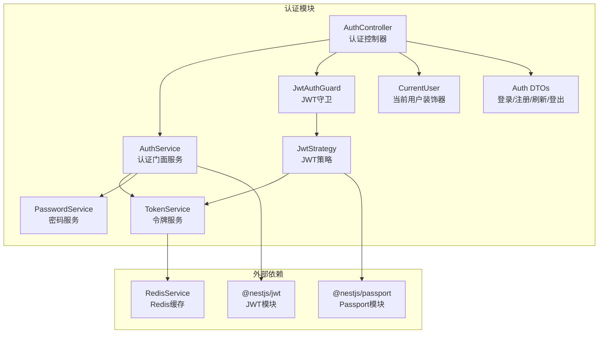
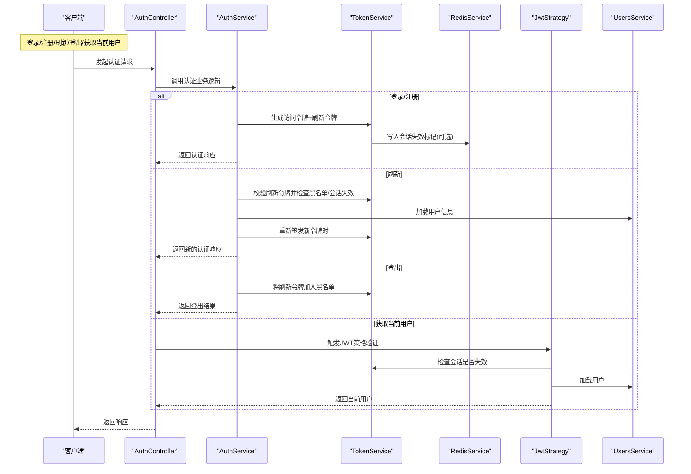
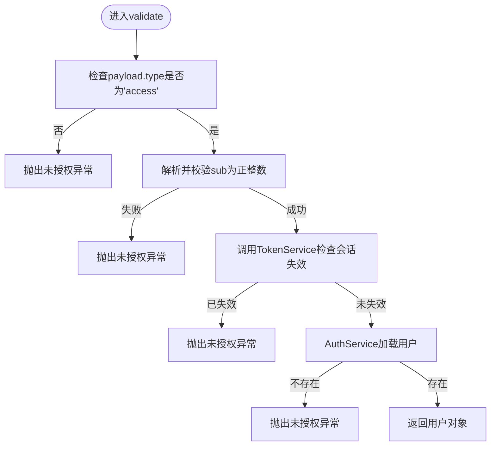
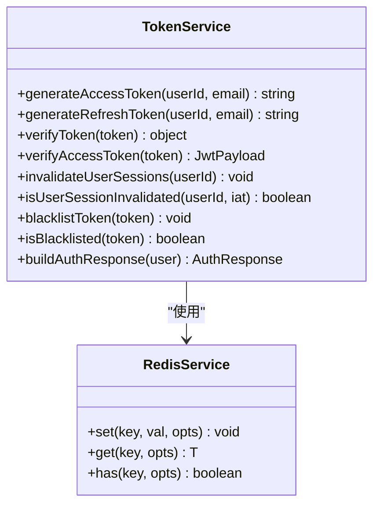
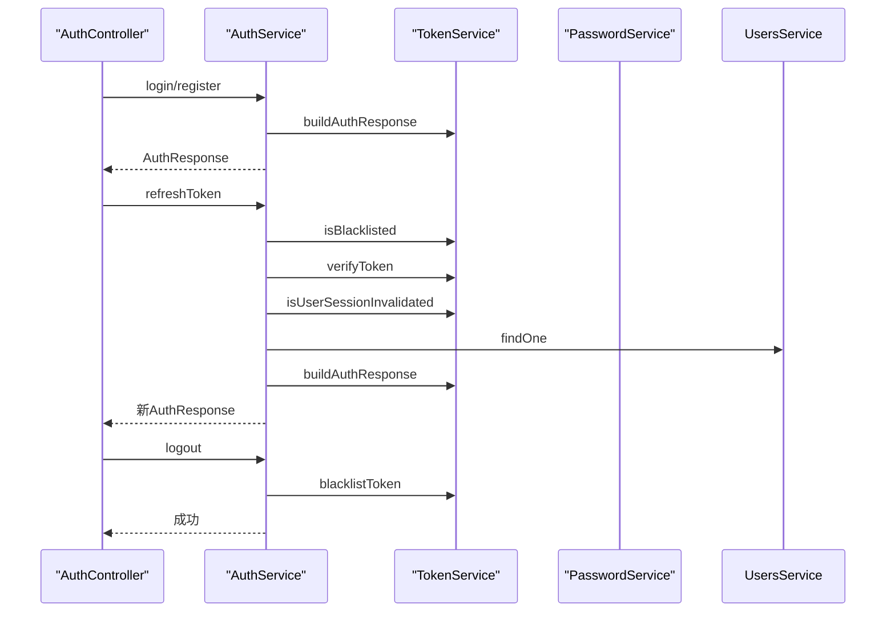
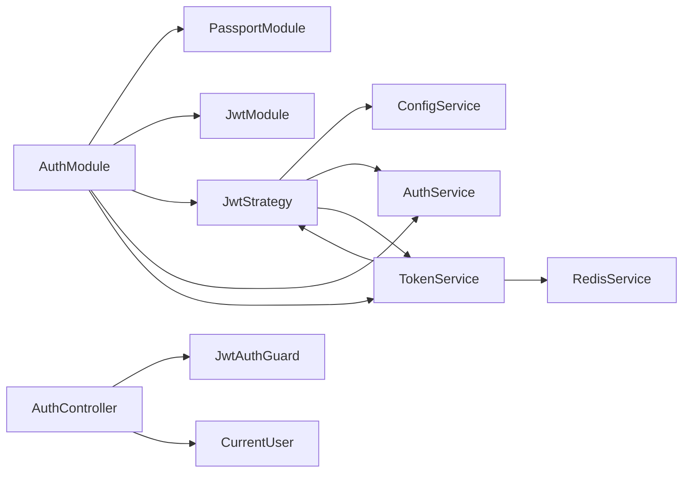

# JWT认证机制

<cite>
**本文引用的文件**
- [apps/backend/src/auth/jwt-auth.guard.ts](file://apps/backend/src/auth/jwt-auth.guard.ts)
- [apps/backend/src/auth/jwt.strategy.ts](file://apps/backend/src/auth/jwt.strategy.ts)
- [apps/backend/src/auth/token.service.ts](file://apps/backend/src/auth/token.service.ts)
- [apps/backend/src/auth/auth.service.ts](file://apps/backend/src/auth/auth.service.ts)
- [apps/backend/src/auth/auth.controller.ts](file://apps/backend/src/auth/auth.controller.ts)
- [apps/backend/src/auth/auth.module.ts](file://apps/backend/src/auth/auth.module.ts)
- [apps/backend/src/auth/password.service.ts](file://apps/backend/src/auth/password.service.ts)
- [apps/backend/src/auth/current-user.decorator.ts](file://apps/backend/src/auth/current-user.decorator.ts)
- [apps/backend/src/auth/auth.dto.ts](file://apps/backend/src/auth/auth.dto.ts)
- [packages/shared/src/schemas/auth.schema.ts](file://packages/shared/src/schemas/auth.schema.ts)
- [apps/backend/src/redis/redis.module.ts](file://apps/backend/src/redis/redis.module.ts)
- [apps/backend/src/redis/redis.service.ts](file://apps/backend/src/redis/redis.service.ts)
- [apps/backend/tests/auth/jwt.strategy.spec.ts](file://apps/backend/tests/auth/jwt.strategy.spec.ts)
- [apps/backend/tests/auth/auth.service.spec.ts](file://apps/backend/tests/auth/auth.service.spec.ts)
- [apps/backend/tests/auth/token.service.spec.ts](file://apps/backend/tests/auth/token.service.spec.ts)
</cite>

## 目录
1. [简介](#简介)
2. [项目结构](#项目结构)
3. [核心组件](#核心组件)
4. [架构总览](#架构总览)
5. [详细组件分析](#详细组件分析)
6. [依赖关系分析](#依赖关系分析)
7. [性能考量](#性能考量)
8. [故障排查指南](#故障排查指南)
9. [结论](#结论)
10. [附录](#附录)

## 简介
本文件系统性阐述本项目的JWT认证机制，包括工作原理、认证流程、令牌生成与验证、过期与刷新策略、生命周期管理、安全配置与最佳实践，并结合实际源码路径给出使用示例与排障建议。重点覆盖以下方面：
- JWT守卫与策略：JwtAuthGuard守卫、JwtStrategy策略
- 令牌类型与生命周期：短期访问令牌与长期刷新令牌
- 令牌刷新与登出：基于Redis的会话失效与黑名单机制
- 安全配置：密钥与过期时间、生产环境差异化配置
- 与Passport.js集成：Passport策略与NestJS JwtModule/JwtService
- 常见安全威胁与防护：令牌泄露、暴力破解、会话劫持、枚举攻击

## 项目结构
认证相关代码集中在后端应用的auth目录，围绕控制器、服务、守卫、策略、令牌服务与Redis缓存展开；共享的DTO与Schema位于packages/shared。

图表来源
- [apps/backend/src/auth/auth.controller.ts:1-81](file://apps/backend/src/auth/auth.controller.ts#L1-L81)
- [apps/backend/src/auth/auth.service.ts:1-127](file://apps/backend/src/auth/auth.service.ts#L1-L127)
- [apps/backend/src/auth/token.service.ts:1-187](file://apps/backend/src/auth/token.service.ts#L1-L187)
- [apps/backend/src/auth/password.service.ts:1-100](file://apps/backend/src/auth/password.service.ts#L1-L100)
- [apps/backend/src/auth/jwt.strategy.ts:1-68](file://apps/backend/src/auth/jwt.strategy.ts#L1-L68)
- [apps/backend/src/auth/jwt-auth.guard.ts:1-10](file://apps/backend/src/auth/jwt-auth.guard.ts#L1-L10)
- [apps/backend/src/auth/current-user.decorator.ts:1-19](file://apps/backend/src/auth/current-user.decorator.ts#L1-L19)
- [apps/backend/src/auth/auth.module.ts:1-41](file://apps/backend/src/auth/auth.module.ts#L1-L41)
- [apps/backend/src/redis/redis.service.ts:1-211](file://apps/backend/src/redis/redis.service.ts#L1-L211)

章节来源
- [apps/backend/src/auth/auth.module.ts:1-41](file://apps/backend/src/auth/auth.module.ts#L1-L41)
- [apps/backend/src/auth/auth.controller.ts:1-81](file://apps/backend/src/auth/auth.controller.ts#L1-L81)

## 核心组件
- JwtAuthGuard：基于@nestjs/passport的认证守卫，用于保护受保护路由
- JwtStrategy：继承PassportStrategy，负责从请求中提取JWT并验证payload
- TokenService：统一管理访问令牌与刷新令牌的生成、验证、黑名单、会话失效
- AuthService：认证门面，协调用户校验、令牌发放、刷新与登出
- PasswordService：密码哈希、比较与重置流程
- RedisService：提供Redis缓存能力，支撑会话失效标记与黑名单
- AuthController：对外暴露登录、注册、刷新、登出、获取当前用户等接口
- CurrentUser装饰器：便捷注入已认证用户到控制器参数
- Auth DTO与Schema：前后端一致的输入校验与Swagger文档生成

章节来源
- [apps/backend/src/auth/jwt-auth.guard.ts:1-10](file://apps/backend/src/auth/jwt-auth.guard.ts#L1-L10)
- [apps/backend/src/auth/jwt.strategy.ts:1-68](file://apps/backend/src/auth/jwt.strategy.ts#L1-L68)
- [apps/backend/src/auth/token.service.ts:1-187](file://apps/backend/src/auth/token.service.ts#L1-L187)
- [apps/backend/src/auth/auth.service.ts:1-127](file://apps/backend/src/auth/auth.service.ts#L1-L127)
- [apps/backend/src/auth/password.service.ts:1-100](file://apps/backend/src/auth/password.service.ts#L1-L100)
- [apps/backend/src/auth/current-user.decorator.ts:1-19](file://apps/backend/src/auth/current-user.decorator.ts#L1-L19)
- [apps/backend/src/auth/auth.controller.ts:1-81](file://apps/backend/src/auth/auth.controller.ts#L1-L81)
- [packages/shared/src/schemas/auth.schema.ts:1-121](file://packages/shared/src/schemas/auth.schema.ts#L1-L121)

## 架构总览
下图展示了JWT认证从客户端发起请求到服务端完成验证与授权的完整流程。

图表来源
- [apps/backend/src/auth/auth.controller.ts:1-81](file://apps/backend/src/auth/auth.controller.ts#L1-L81)
- [apps/backend/src/auth/auth.service.ts:1-127](file://apps/backend/src/auth/auth.service.ts#L1-L127)
- [apps/backend/src/auth/token.service.ts:1-187](file://apps/backend/src/auth/token.service.ts#L1-L187)
- [apps/backend/src/auth/jwt.strategy.ts:1-68](file://apps/backend/src/auth/jwt.strategy.ts#L1-L68)
- [apps/backend/src/redis/redis.service.ts:1-211](file://apps/backend/src/redis/redis.service.ts#L1-L211)

## 详细组件分析

### JwtAuthGuard守卫
- 作用：为路由提供JWT认证保护，未通过认证将返回401
- 实现：继承AuthGuard('jwt')，交由Passport默认策略处理
- 使用：在控制器方法上添加@UseGuards(JwtAuthGuard)

章节来源
- [apps/backend/src/auth/jwt-auth.guard.ts:1-10](file://apps/backend/src/auth/jwt-auth.guard.ts#L1-L10)
- [apps/backend/src/auth/auth.controller.ts:53-59](file://apps/backend/src/auth/auth.controller.ts#L53-L59)

### JwtStrategy策略
- 作用：从Authorization头解析Bearer令牌，验证签名与过期时间，校验payload类型与会话有效性
- 关键点：
  - 仅接受type=access的payload
  - 校验sub为正整数，防止数据库查询异常
  - 通过TokenService检查会话是否被强制失效（Redis标记）
  - 从AuthService加载用户并返回给框架
- 异常：不满足条件时抛UnauthorizedException

图表来源
- [apps/backend/src/auth/jwt.strategy.ts:41-66](file://apps/backend/src/auth/jwt.strategy.ts#L41-L66)

章节来源
- [apps/backend/src/auth/jwt.strategy.ts:1-68](file://apps/backend/src/auth/jwt.strategy.ts#L1-L68)

### TokenService令牌服务
- 令牌生成：
  - 访问令牌：短期（默认900秒），使用JWT_SECRET
  - 刷新令牌：长期（默认604800秒），生产环境使用JWT_REFRESH_SECRET，否则回退至JWT_SECRET
- 令牌验证：
  - verifyToken：优先尝试刷新密钥，再尝试访问密钥，均失败则视为过期
  - verifyAccessToken：严格要求type=access
- 会话失效：
  - invalidateUserSessions：在Redis写入invalidate:{userId}的时间戳，作为会话失效阈值
  - isUserSessionInvalidated：比较token.iat与失效时间，决定是否拒绝旧令牌
- 黑名单：
  - blacklistToken：将token加入Redis黑名单，按剩余有效期设置TTL
  - isBlacklisted：检查token是否在黑名单
- 构建认证响应：buildAuthResponse返回{accessToken, refreshToken, expiresIn, user}

图表来源
- [apps/backend/src/auth/token.service.ts:1-187](file://apps/backend/src/auth/token.service.ts#L1-L187)
- [apps/backend/src/redis/redis.service.ts:1-211](file://apps/backend/src/redis/redis.service.ts#L1-L211)

章节来源
- [apps/backend/src/auth/token.service.ts:1-187](file://apps/backend/src/auth/token.service.ts#L1-L187)

### AuthService认证门面
- 登录/注册：委托TokenService生成令牌对
- 刷新：校验刷新令牌合法性、黑名单、会话失效、用户存在性，成功后重新签发
- 登出：将刷新令牌加入黑名单
- 密码重置：委托PasswordService处理

图表来源
- [apps/backend/src/auth/auth.controller.ts:1-81](file://apps/backend/src/auth/auth.controller.ts#L1-L81)
- [apps/backend/src/auth/auth.service.ts:1-127](file://apps/backend/src/auth/auth.service.ts#L1-L127)
- [apps/backend/src/auth/token.service.ts:1-187](file://apps/backend/src/auth/token.service.ts#L1-L187)
- [apps/backend/src/auth/password.service.ts:1-100](file://apps/backend/src/auth/password.service.ts#L1-L100)

章节来源
- [apps/backend/src/auth/auth.service.ts:1-127](file://apps/backend/src/auth/auth.service.ts#L1-L127)

### PasswordService密码服务
- 密码哈希与比较：bcrypt
- 密码重置：生成随机token并哈希存储，设置过期时间，发送重置链接
- 重置密码：校验token与过期时间，更新密码并使该用户的会话失效

章节来源
- [apps/backend/src/auth/password.service.ts:1-100](file://apps/backend/src/auth/password.service.ts#L1-L100)

### Redis缓存与会话管理
- RedisModule：全局注册，提供连接池与重试策略
- RedisService：封装键前缀、TTL、get/set/has等常用操作
- 会话失效：invalidate:{userId}记录时间戳，配合iat判断令牌是否仍有效
- 黑名单：blacklist:{token}记录黑名单，按剩余有效期TTL清理

章节来源
- [apps/backend/src/redis/redis.module.ts:1-83](file://apps/backend/src/redis/redis.module.ts#L1-L83)
- [apps/backend/src/redis/redis.service.ts:1-211](file://apps/backend/src/redis/redis.service.ts#L1-L211)
- [apps/backend/src/auth/token.service.ts:47-76](file://apps/backend/src/auth/token.service.ts#L47-L76)

### 控制器与DTO
- AuthController：提供登录、注册、刷新、登出、获取当前用户接口，使用JwtAuthGuard保护
- CurrentUser装饰器：从请求上下文提取当前用户
- Auth DTO与Schema：统一输入校验与Swagger文档

章节来源
- [apps/backend/src/auth/auth.controller.ts:1-81](file://apps/backend/src/auth/auth.controller.ts#L1-L81)
- [apps/backend/src/auth/current-user.decorator.ts:1-19](file://apps/backend/src/auth/current-user.decorator.ts#L1-L19)
- [apps/backend/src/auth/auth.dto.ts:1-41](file://apps/backend/src/auth/auth.dto.ts#L1-L41)
- [packages/shared/src/schemas/auth.schema.ts:69-95](file://packages/shared/src/schemas/auth.schema.ts#L69-L95)

## 依赖关系分析
- AuthModule导入PassportModule与JwtModule，注册默认策略为jwt，并通过ConfigService注入密钥与过期时间
- JwtStrategy依赖ConfigService、AuthService、TokenService
- TokenService依赖JwtService、ConfigService、RedisService
- AuthController依赖AuthService、JwtAuthGuard、CurrentUser装饰器

图表来源
- [apps/backend/src/auth/auth.module.ts:1-41](file://apps/backend/src/auth/auth.module.ts#L1-L41)
- [apps/backend/src/auth/jwt.strategy.ts:1-68](file://apps/backend/src/auth/jwt.strategy.ts#L1-L68)
- [apps/backend/src/auth/token.service.ts:1-187](file://apps/backend/src/auth/token.service.ts#L1-L187)
- [apps/backend/src/auth/auth.controller.ts:1-81](file://apps/backend/src/auth/auth.controller.ts#L1-L81)

章节来源
- [apps/backend/src/auth/auth.module.ts:1-41](file://apps/backend/src/auth/auth.module.ts#L1-L41)

## 性能考量
- 令牌验证：使用NestJS内置JwtService进行签名与验证，避免重复计算
- 会话失效与黑名单：Redis读写开销低，建议合理设置TTL与键前缀，避免热键
- 并发场景：刷新令牌时先检查黑名单与会话失效，减少无效数据库查询
- 缓存穿透：RedisService提供getOrSet，必要时可引入布隆过滤器或延迟双删策略（视业务扩展）

## 故障排查指南
- 401未授权
  - 检查Authorization头是否为Bearer令牌
  - 确认JWT_SECRET/JWT_REFRESH_SECRET已正确配置
  - 验证payload.type是否为access
  - 排查Redis中是否存在invalidate:{userId}且token.iat早于该时间
- 刷新失败
  - 检查刷新令牌是否在黑名单
  - 确认用户存在且未被禁用
  - 生产环境需配置JWT_REFRESH_SECRET
- 登出无效
  - 确认blacklistToken已写入Redis且TTL合理
  - 检查Redis连接与键前缀
- 单元测试参考
  - JwtStrategy验证非access令牌、会话失效、有效令牌的场景
  - AuthService登录/刷新/登出的边界条件
  - TokenService生成、验证、黑名单、会话失效的逻辑

章节来源
- [apps/backend/tests/auth/jwt.strategy.spec.ts:1-75](file://apps/backend/tests/auth/jwt.strategy.spec.ts#L1-L75)
- [apps/backend/tests/auth/auth.service.spec.ts:1-177](file://apps/backend/tests/auth/auth.service.spec.ts#L1-L177)
- [apps/backend/tests/auth/token.service.spec.ts:1-198](file://apps/backend/tests/auth/token.service.spec.ts#L1-L198)

## 结论
本项目采用“短期访问令牌 + 长期刷新令牌”的双令牌模型，结合Redis实现会话强制失效与刷新令牌黑名单，形成闭环的安全控制。通过JwtAuthGuard与JwtStrategy实现细粒度的路由保护，配合AuthService统一封装认证流程，既保证了安全性，也提升了可维护性。生产环境建议启用独立的刷新密钥与严格的密钥轮换策略，并持续监控Redis健康状态与令牌使用指标。

## 附录

### JWT生命周期与刷新策略
- 生命周期
  - 访问令牌：短期（默认900秒），用于日常API访问
  - 刷新令牌：长期（默认604800秒），用于换取新的令牌对
- 刷新流程
  - 客户端提交refreshToken
  - 服务端校验黑名单与会话失效，验证payload类型
  - 成功后重新签发新的令牌对
- 登出流程
  - 将refreshToken加入黑名单，使其无法再次刷新
  - 前端清除本地存储的令牌

章节来源
- [apps/backend/src/auth/token.service.ts:41-98](file://apps/backend/src/auth/token.service.ts#L41-L98)
- [apps/backend/src/auth/auth.service.ts:59-101](file://apps/backend/src/auth/auth.service.ts#L59-L101)

### 在控制器中使用认证守卫与当前用户
- 保护路由：在控制器方法上添加@UseGuards(JwtAuthGuard)
- 注入当前用户：使用CurrentUser装饰器作为参数注入
- 示例路径
  - [apps/backend/src/auth/auth.controller.ts:53-59](file://apps/backend/src/auth/auth.controller.ts#L53-L59)
  - [apps/backend/src/auth/current-user.decorator.ts:1-19](file://apps/backend/src/auth/current-user.decorator.ts#L1-L19)

### 与Passport.js的集成
- PassportModule注册默认策略为jwt
- JwtModule通过ConfigService注入secret与signOptions
- JwtStrategy继承PassportStrategy，自定义validate逻辑

章节来源
- [apps/backend/src/auth/auth.module.ts:20-35](file://apps/backend/src/auth/auth.module.ts#L20-L35)
- [apps/backend/src/auth/jwt.strategy.ts:21-36](file://apps/backend/src/auth/jwt.strategy.ts#L21-L36)

### 安全配置与最佳实践
- 密钥管理
  - JWT_SECRET：访问令牌签名密钥
  - JWT_REFRESH_SECRET：刷新令牌签名密钥（生产环境必须配置）
- 过期时间
  - JWT_ACCESS_EXPIRES_IN：访问令牌过期间隔（秒）
  - JWT_REFRESH_EXPIRES_IN：刷新令牌过期间隔（秒）
- 安全建议
  - 启用HTTPS与SameSite Cookie（前端配合）
  - 定期轮换密钥，变更时滚动升级
  - 对登录/刷新接口实施速率限制
  - 密码重置流程避免枚举攻击（已内置）
  - 会话强制失效：调用invalidateUserSessions后，旧令牌将被拒绝

章节来源
- [apps/backend/src/auth/token.service.ts:30-44](file://apps/backend/src/auth/token.service.ts#L30-L44)
- [apps/backend/src/auth/password.service.ts:39-89](file://apps/backend/src/auth/password.service.ts#L39-L89)