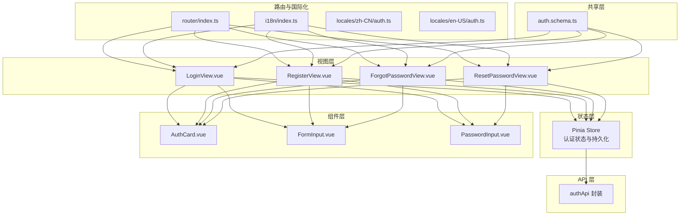
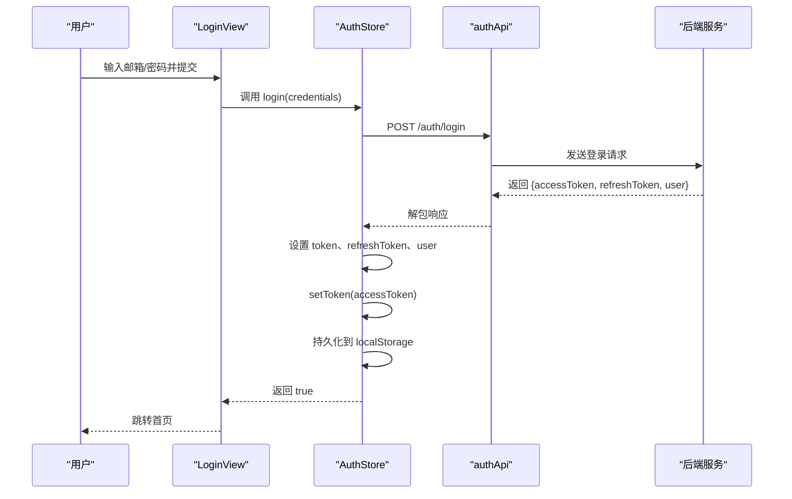
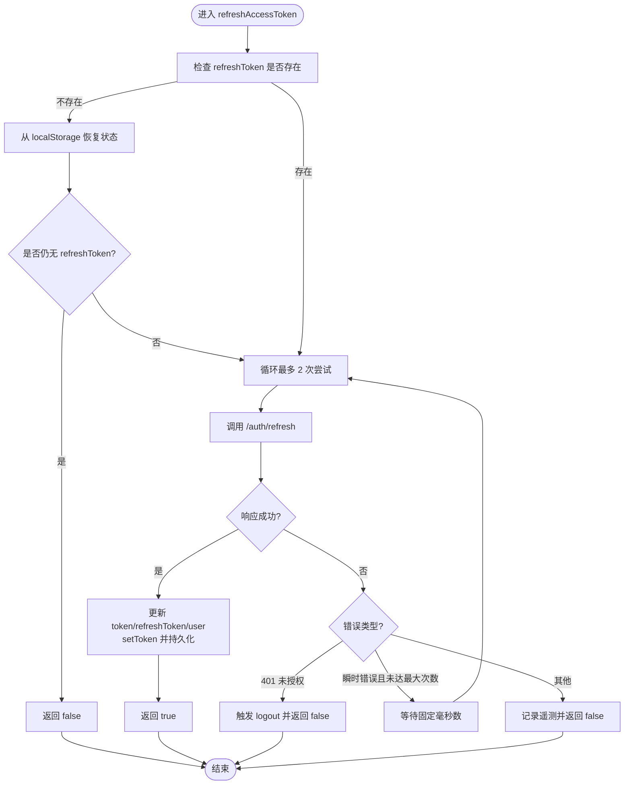
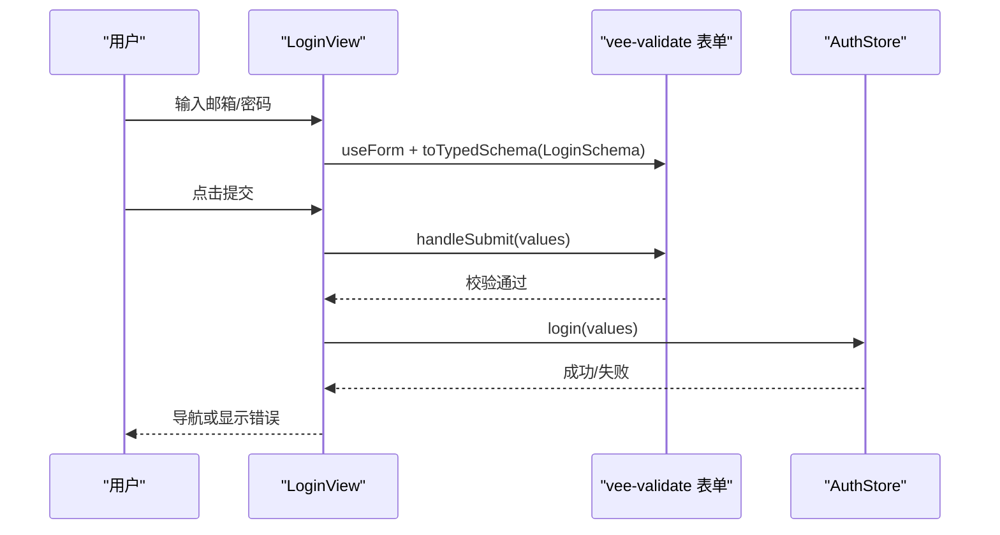
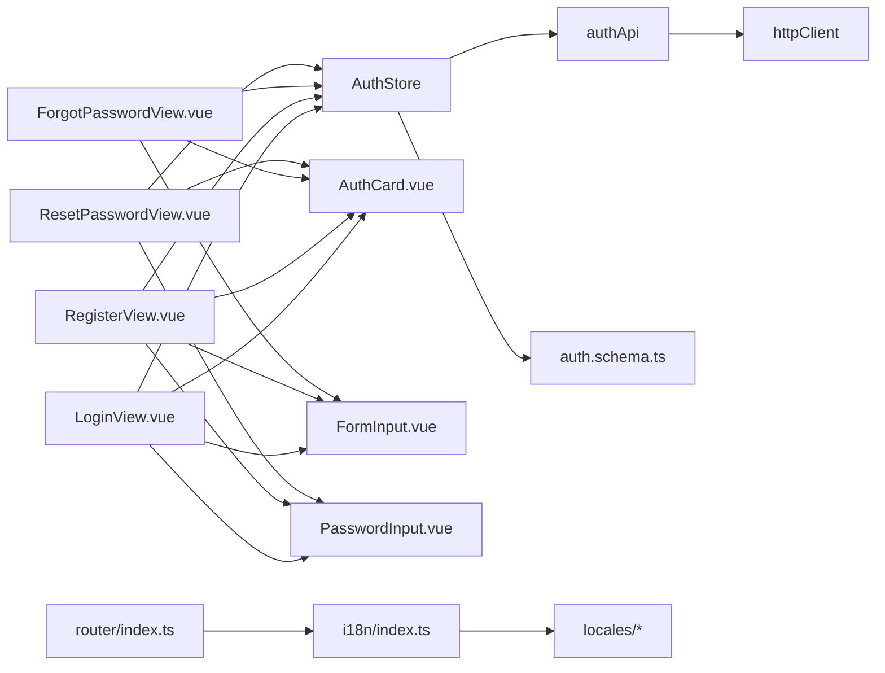

# 前端认证状态管理

<cite>
**本文引用的文件**
- [apps/frontend/src/features/auth/stores/auth.ts](file://apps/frontend/src/features/auth/stores/auth.ts)
- [apps/frontend/src/features/auth/api/index.ts](file://apps/frontend/src/features/auth/api/index.ts)
- [apps/frontend/src/features/auth/views/LoginView.vue](file://apps/frontend/src/features/auth/views/LoginView.vue)
- [apps/frontend/src/features/auth/views/RegisterView.vue](file://apps/frontend/src/features/auth/views/RegisterView.vue)
- [apps/frontend/src/features/auth/views/ForgotPasswordView.vue](file://apps/frontend/src/features/auth/views/ForgotPasswordView.vue)
- [apps/frontend/src/features/auth/views/ResetPasswordView.vue](file://apps/frontend/src/features/auth/views/ResetPasswordView.vue)
- [apps/frontend/src/components/auth/AuthCard.vue](file://apps/frontend/src/components/auth/AuthCard.vue)
- [apps/frontend/src/components/auth/FormInput.vue](file://apps/frontend/src/components/auth/FormInput.vue)
- [apps/frontend/src/components/auth/PasswordInput.vue](file://apps/frontend/src/components/auth/PasswordInput.vue)
- [apps/frontend/src/router/index.ts](file://apps/frontend/src/router/index.ts)
- [apps/frontend/src/i18n/index.ts](file://apps/frontend/src/i18n/index.ts)
- [apps/frontend/src/i18n/locales/zh-CN/auth.ts](file://apps/frontend/src/i18n/locales/zh-CN/auth.ts)
- [apps/frontend/src/i18n/locales/en-US/auth.ts](file://apps/frontend/src/i18n/locales/en-US/auth.ts)
- [packages/shared/src/schemas/auth.schema.ts](file://packages/shared/src/schemas/auth.schema.ts)
- [apps/frontend/src/main.ts](file://apps/frontend/src/main.ts)
</cite>

## 目录

1. [简介](#简介)
2. [项目结构](#项目结构)
3. [核心组件](#核心组件)
4. [架构总览](#架构总览)
5. [详细组件分析](#详细组件分析)
6. [依赖关系分析](#依赖关系分析)
7. [性能考量](#性能考量)
8. [故障排查指南](#故障排查指南)
9. [结论](#结论)
10. [附录](#附录)

## 简介

本文件系统性阐述前端认证状态管理的设计与实现，围绕 Pinia 状态管理在认证中的应用、用户登录状态的持久化存储、路由守卫实现展开；同时覆盖登录表单、注册流程、密码重置组件的实现细节，解释认证状态的响应式更新、Token 自动刷新机制、登出流程处理，并提供 Vue 组合式 API 的使用示例、错误处理与用户体验优化策略，以及与后端 API 的交互模式、表单验证规则、国际化支持、前端安全与本地存储最佳实践、性能优化策略。

## 项目结构

前端认证相关代码主要分布在以下模块：

- 状态层：Pinia Store（认证状态、持久化、Token 刷新、登出）
- 视图层：登录、注册、忘记密码、重置密码等页面组件
- 组件层：通用认证卡片、输入框、密码输入框等可复用 UI
- API 层：认证相关接口封装
- 路由层：路由定义与页面标题国际化
- 国际化层：多语言文案与默认语言选择
- 共享层：前后端共享的表单验证 Schema

图表来源

- [apps/frontend/src/features/auth/stores/auth.ts:1-413](file://apps/frontend/src/features/auth/stores/auth.ts#L1-L413)
- [apps/frontend/src/features/auth/api/index.ts:1-93](file://apps/frontend/src/features/auth/api/index.ts#L1-L93)
- [apps/frontend/src/features/auth/views/LoginView.vue:1-142](file://apps/frontend/src/features/auth/views/LoginView.vue#L1-L142)
- [apps/frontend/src/features/auth/views/RegisterView.vue:1-166](file://apps/frontend/src/features/auth/views/RegisterView.vue#L1-L166)
- [apps/frontend/src/features/auth/views/ForgotPasswordView.vue:1-149](file://apps/frontend/src/features/auth/views/ForgotPasswordView.vue#L1-L149)
- [apps/frontend/src/features/auth/views/ResetPasswordView.vue:1-197](file://apps/frontend/src/features/auth/views/ResetPasswordView.vue#L1-L197)
- [apps/frontend/src/components/auth/AuthCard.vue:1-116](file://apps/frontend/src/components/auth/AuthCard.vue#L1-L116)
- [apps/frontend/src/components/auth/FormInput.vue:1-128](file://apps/frontend/src/components/auth/FormInput.vue#L1-L128)
- [apps/frontend/src/components/auth/PasswordInput.vue:1-137](file://apps/frontend/src/components/auth/PasswordInput.vue#L1-L137)
- [apps/frontend/src/router/index.ts:1-73](file://apps/frontend/src/router/index.ts#L1-L73)
- [apps/frontend/src/i18n/index.ts:1-37](file://apps/frontend/src/i18n/index.ts#L1-L37)
- [apps/frontend/src/i18n/locales/zh-CN/auth.ts:1-62](file://apps/frontend/src/i18n/locales/zh-CN/auth.ts#L1-L62)
- [apps/frontend/src/i18n/locales/en-US/auth.ts:1-63](file://apps/frontend/src/i18n/locales/en-US/auth.ts#L1-L63)
- [packages/shared/src/schemas/auth.schema.ts:1-121](file://packages/shared/src/schemas/auth.schema.ts#L1-L121)

章节来源

- [apps/frontend/src/features/auth/stores/auth.ts:1-413](file://apps/frontend/src/features/auth/stores/auth.ts#L1-L413)
- [apps/frontend/src/features/auth/api/index.ts:1-93](file://apps/frontend/src/features/auth/api/index.ts#L1-L93)
- [apps/frontend/src/router/index.ts:1-73](file://apps/frontend/src/router/index.ts#L1-L73)
- [apps/frontend/src/i18n/index.ts:1-37](file://apps/frontend/src/i18n/index.ts#L1-L37)

## 核心组件

- Pinia 认证 Store：集中管理 token、refreshToken、user、loading、error、fieldErrors；提供登录、注册、获取当前用户、刷新访问令牌、忘记密码、重置密码、头像上传、登出等方法；内置持久化与从本地存储恢复逻辑；具备错误分类与遥测事件上报能力。
- 认证 API 封装：统一对外暴露 getMe、login、register、forgotPassword、resetPassword、refreshToken、logout、uploadAvatar 等方法，屏蔽底层 HTTP 客户端细节。
- 页面组件：LoginView、RegisterView、ForgotPasswordView、ResetPasswordView 通过 vee-validate + Zod Schema 实现表单校验，结合 i18n 提供多语言文案与错误提示。
- 可复用组件：AuthCard（带动画与返回首页）、FormInput、PasswordInput（含显示/隐藏密码）。
- 路由与国际化：路由守卫负责页面标题国际化；i18n 提供默认语言选择与消息映射。
- 共享 Schema：前后端共享的登录、注册、重置密码等输入校验规则。

章节来源

- [apps/frontend/src/features/auth/stores/auth.ts:1-413](file://apps/frontend/src/features/auth/stores/auth.ts#L1-L413)
- [apps/frontend/src/features/auth/api/index.ts:1-93](file://apps/frontend/src/features/auth/api/index.ts#L1-L93)
- [apps/frontend/src/features/auth/views/LoginView.vue:1-142](file://apps/frontend/src/features/auth/views/LoginView.vue#L1-L142)
- [apps/frontend/src/features/auth/views/RegisterView.vue:1-166](file://apps/frontend/src/features/auth/views/RegisterView.vue#L1-L166)
- [apps/frontend/src/features/auth/views/ForgotPasswordView.vue:1-149](file://apps/frontend/src/features/auth/views/ForgotPasswordView.vue#L1-L149)
- [apps/frontend/src/features/auth/views/ResetPasswordView.vue:1-197](file://apps/frontend/src/features/auth/views/ResetPasswordView.vue#L1-L197)
- [apps/frontend/src/components/auth/AuthCard.vue:1-116](file://apps/frontend/src/components/auth/AuthCard.vue#L1-L116)
- [apps/frontend/src/components/auth/FormInput.vue:1-128](file://apps/frontend/src/components/auth/FormInput.vue#L1-L128)
- [apps/frontend/src/components/auth/PasswordInput.vue:1-137](file://apps/frontend/src/components/auth/PasswordInput.vue#L1-L137)
- [apps/frontend/src/router/index.ts:1-73](file://apps/frontend/src/router/index.ts#L1-L73)
- [apps/frontend/src/i18n/index.ts:1-37](file://apps/frontend/src/i18n/index.ts#L1-L37)
- [packages/shared/src/schemas/auth.schema.ts:1-121](file://packages/shared/src/schemas/auth.schema.ts#L1-L121)

## 架构总览

下图展示认证状态在前端的整体流转：页面组件通过组合式 API 调用 Store 方法，Store 通过 API 封装与后端交互，成功后更新响应式状态并持久化；Store 还负责 Token 刷新与登出清理。

图表来源

- [apps/frontend/src/features/auth/views/LoginView.vue:46-53](file://apps/frontend/src/features/auth/views/LoginView.vue#L46-L53)
- [apps/frontend/src/features/auth/stores/auth.ts:148-179](file://apps/frontend/src/features/auth/stores/auth.ts#L148-L179)
- [apps/frontend/src/features/auth/api/index.ts:19-22](file://apps/frontend/src/features/auth/api/index.ts#L19-L22)

章节来源

- [apps/frontend/src/features/auth/stores/auth.ts:1-413](file://apps/frontend/src/features/auth/stores/auth.ts#L1-L413)
- [apps/frontend/src/features/auth/api/index.ts:1-93](file://apps/frontend/src/features/auth/api/index.ts#L1-L93)
- [apps/frontend/src/features/auth/views/LoginView.vue:1-142](file://apps/frontend/src/features/auth/views/LoginView.vue#L1-L142)

## 详细组件分析

### 认证状态管理（Pinia Store）

- 状态字段：token、refreshToken、user、loading、error、fieldErrors；计算属性 isAuthenticated 基于 token 是否存在判断。
- 持久化策略：使用 pinia-plugin-persistedstate 对 token、refreshToken、user 进行 localStorage 持久化；同时提供手动持久化与清理方法，确保跨页面刷新后能恢复状态。
- 错误处理：统一的 handleApiError 将后端返回的 message 与 fieldErrors 映射到 store，便于视图层渲染；区分 401 未授权与 5xx/网络超时等瞬时错误。
- 数据合并：登录成功后异步加载 Todo Store 并执行 mergeOnLogin，完成匿名数据与用户数据的合并；触发 AI 存储范围变更事件。
- Token 刷新：refreshAccessToken 循环最多两次，对瞬时错误进行延迟重试；遇到 401 未授权则主动登出并清空本地状态。
- 登出流程：先清空本地状态与 token，再尝试向后端发起注销（若本地曾有令牌），最后清理远程待办数据并回退到本地视图。
- 遥测事件：通过自定义事件上报认证相关事件，便于监控与分析。

图表来源

- [apps/frontend/src/features/auth/stores/auth.ts:296-341](file://apps/frontend/src/features/auth/stores/auth.ts#L296-L341)

章节来源

- [apps/frontend/src/features/auth/stores/auth.ts:1-413](file://apps/frontend/src/features/auth/stores/auth.ts#L1-L413)

### 登录表单组件设计

- 表单验证：基于 Zod Schema 与 vee-validate，使用 toTypedSchema 将 LoginSchema 应用于表单；支持字段级错误与后端返回的 fieldErrors 同步。
- 用户体验：支持复制错误信息到剪贴板、过渡动画、加载态、跳转注册页与忘记密码链接。
- 国际化：标题、占位符、按钮文案均来自 i18n；错误文案可二次翻译以适配字段约束参数。

图表来源

- [apps/frontend/src/features/auth/views/LoginView.vue:23-53](file://apps/frontend/src/features/auth/views/LoginView.vue#L23-L53)
- [packages/shared/src/schemas/auth.schema.ts:25-28](file://packages/shared/src/schemas/auth.schema.ts#L25-L28)

章节来源

- [apps/frontend/src/features/auth/views/LoginView.vue:1-142](file://apps/frontend/src/features/auth/views/LoginView.vue#L1-L142)
- [packages/shared/src/schemas/auth.schema.ts:1-121](file://packages/shared/src/schemas/auth.schema.ts#L1-L121)

### 注册流程组件

- 表单验证：扩展 RegisterSchema，新增 confirmPassword 字段并进行一致性校验；同样使用 toTypedSchema。
- 用户体验：支持复制错误信息、过渡动画、加载态、跳转登录页。
- 登录后处理：注册成功后与登录相同，触发数据合并与 AI 存储范围变更。

章节来源

- [apps/frontend/src/features/auth/views/RegisterView.vue:1-166](file://apps/frontend/src/features/auth/views/RegisterView.vue#L1-L166)
- [packages/shared/src/schemas/auth.schema.ts:33-41](file://packages/shared/src/schemas/auth.schema.ts#L33-L41)

### 密码重置组件

- 忘记密码：提交邮箱后显示成功提示，引导返回登录页。
- 重置密码：从路由查询参数读取 token，若缺失则显示“链接无效”；提交新密码后显示成功提示并延时跳转登录页。

章节来源

- [apps/frontend/src/features/auth/views/ForgotPasswordView.vue:1-149](file://apps/frontend/src/features/auth/views/ForgotPasswordView.vue#L1-L149)
- [apps/frontend/src/features/auth/views/ResetPasswordView.vue:1-197](file://apps/frontend/src/features/auth/views/ResetPasswordView.vue#L1-L197)

### 路由守卫与页面标题国际化

- 路由守卫：beforeEach 中根据 meta.title 与 i18n 动态设置 document.title，提升 SEO 与用户体验。
- 页面标题：各视图在 meta 中声明标题键，如 login.title、register.title 等。

章节来源

- [apps/frontend/src/router/index.ts:56-70](file://apps/frontend/src/router/index.ts#L56-L70)

### 国际化支持

- 默认语言：优先读取 localStorage 的 locale，否则根据浏览器语言选择 zh-CN 或 en-US。
- 文案来源：登录、注册、忘记密码、重置密码等文案分别位于 zh-CN/auth.ts 与 en-US/auth.ts。
- 类型安全：i18n 暴露 MessageSchema 与受支持语言枚举，保证键值与类型一致。

章节来源

- [apps/frontend/src/i18n/index.ts:1-37](file://apps/frontend/src/i18n/index.ts#L1-L37)
- [apps/frontend/src/i18n/locales/zh-CN/auth.ts:1-62](file://apps/frontend/src/i18n/locales/zh-CN/auth.ts#L1-L62)
- [apps/frontend/src/i18n/locales/en-US/auth.ts:1-63](file://apps/frontend/src/i18n/locales/en-US/auth.ts#L1-L63)

### 表单验证规则与共享 Schema

- 邮箱：必填、合法格式、小写、去空白。
- 密码：必填、长度 6-100。
- 注册：邮箱、用户名（2-50）、密码。
- 重置：token 必填、密码规则同上。
- 统一导出类型：LoginInput、RegisterInput、User、AuthResponse 等，供 Store 与组件使用。

章节来源

- [packages/shared/src/schemas/auth.schema.ts:1-121](file://packages/shared/src/schemas/auth.schema.ts#L1-L121)

### 组合式 API 使用示例

- 在页面组件中引入 useAuthStore，通过 handleSubmit 调用 store.login/register/forgotPassword/resetPassword，并根据返回结果进行导航或错误渲染。
- 在模板中绑定 loading、error、fieldErrors，实现响应式更新与用户体验优化。

章节来源

- [apps/frontend/src/features/auth/views/LoginView.vue:15-53](file://apps/frontend/src/features/auth/views/LoginView.vue#L15-L53)
- [apps/frontend/src/features/auth/views/RegisterView.vue:16-63](file://apps/frontend/src/features/auth/views/RegisterView.vue#L16-L63)
- [apps/frontend/src/features/auth/views/ForgotPasswordView.vue:13-48](file://apps/frontend/src/features/auth/views/ForgotPasswordView.vue#L13-L48)
- [apps/frontend/src/features/auth/views/ResetPasswordView.vue:15-75](file://apps/frontend/src/features/auth/views/ResetPasswordView.vue#L15-L75)

## 依赖关系分析

- Store 依赖 API 封装与共享 Schema；API 封装依赖通用 HTTP 客户端；页面组件依赖 Store 与 UI 组件；路由依赖 i18n；i18n 依赖 locales。
- 关键耦合点：Store 与 API 的解耦、UI 与状态的解耦、Schema 的跨层共享。

图表来源

- [apps/frontend/src/features/auth/stores/auth.ts:1-413](file://apps/frontend/src/features/auth/stores/auth.ts#L1-L413)
- [apps/frontend/src/features/auth/api/index.ts:1-93](file://apps/frontend/src/features/auth/api/index.ts#L1-L93)
- [apps/frontend/src/features/auth/views/LoginView.vue:1-142](file://apps/frontend/src/features/auth/views/LoginView.vue#L1-L142)
- [apps/frontend/src/features/auth/views/RegisterView.vue:1-166](file://apps/frontend/src/features/auth/views/RegisterView.vue#L1-L166)
- [apps/frontend/src/features/auth/views/ForgotPasswordView.vue:1-149](file://apps/frontend/src/features/auth/views/ForgotPasswordView.vue#L1-L149)
- [apps/frontend/src/features/auth/views/ResetPasswordView.vue:1-197](file://apps/frontend/src/features/auth/views/ResetPasswordView.vue#L1-L197)
- [apps/frontend/src/router/index.ts:1-73](file://apps/frontend/src/router/index.ts#L1-L73)
- [apps/frontend/src/i18n/index.ts:1-37](file://apps/frontend/src/i18n/index.ts#L1-L37)

章节来源

- [apps/frontend/src/features/auth/stores/auth.ts:1-413](file://apps/frontend/src/features/auth/stores/auth.ts#L1-L413)
- [apps/frontend/src/features/auth/api/index.ts:1-93](file://apps/frontend/src/features/auth/api/index.ts#L1-L93)
- [apps/frontend/src/router/index.ts:1-73](file://apps/frontend/src/router/index.ts#L1-L73)
- [apps/frontend/src/i18n/index.ts:1-37](file://apps/frontend/src/i18n/index.ts#L1-L37)

## 性能考量

- 查询缓存：全局 Vue Query 默认查询缓存 1 分钟，减少重复请求。
- 懒加载：路由采用动态导入，降低首屏体积。
- 动画与渲染：AuthCard 使用 GSAP 动画，注意在低端设备上的性能影响，必要时可按需禁用。
- 本地存储：仅持久化必要字段，避免 localStorage 过大导致读写性能下降。
- 重试与节流：Token 刷新最多两次重试并带固定延迟，避免频繁重试造成抖动。

章节来源

- [apps/frontend/src/main.ts:120-127](file://apps/frontend/src/main.ts#L120-L127)
- [apps/frontend/src/components/auth/AuthCard.vue:19-38](file://apps/frontend/src/components/auth/AuthCard.vue#L19-L38)
- [apps/frontend/src/features/auth/stores/auth.ts:9-10](file://apps/frontend/src/features/auth/stores/auth.ts#L9-L10)

## 故障排查指南

- 登录失败：检查后端返回的 message 与 fieldErrors，Store 会将其映射到 error 与 fieldErrors；页面组件可通过 i18n 翻译错误键。
- 401 未授权：Store 会在获取当前用户或刷新 Token 时检测 401，自动触发 logout 并清空本地状态。
- 瞬时错误：Store 对 5xx/网络超时/超时等错误进行瞬时判定并重试；若仍失败，上报遥测事件以便定位。
- Token 刷新失败：确认 refreshToken 是否存在；若多次失败，建议引导用户重新登录。
- 登出异常：Store 会尝试向后端发起注销，若失败（常见于令牌已失效），控制台会输出警告但不影响本地清理。
- 国际化问题：检查 i18n 默认语言选择逻辑与 locales 文件是否存在对应键值；确保 initZodI18n 已初始化。

章节来源

- [apps/frontend/src/features/auth/stores/auth.ts:40-51](file://apps/frontend/src/features/auth/stores/auth.ts#L40-L51)
- [apps/frontend/src/features/auth/stores/auth.ts:282-291](file://apps/frontend/src/features/auth/stores/auth.ts#L282-L291)
- [apps/frontend/src/features/auth/stores/auth.ts:319-334](file://apps/frontend/src/features/auth/stores/auth.ts#L319-L334)
- [apps/frontend/src/features/auth/stores/auth.ts:346-372](file://apps/frontend/src/features/auth/stores/auth.ts#L346-L372)
- [apps/frontend/src/i18n/index.ts:12-20](file://apps/frontend/src/i18n/index.ts#L12-L20)

## 结论

本项目通过 Pinia 实现了高内聚、低耦合的认证状态管理，配合 vee-validate + Zod Schema 的表单验证、i18n 国际化与可复用 UI 组件，构建了完整的登录、注册、忘记/重置密码流程。Store 内置持久化、Token 自动刷新与登出清理机制，兼顾安全性与用户体验。建议在生产环境中进一步完善遥测上报、错误边界与性能监控，持续优化首屏与交互流畅度。

## 附录

- 前端安全最佳实践
  - 令牌存储：仅在内存与 localStorage 中保存必要字段，避免在 URL 中传递敏感参数。
  - 输入校验：前后端均进行严格校验，防止注入与越权。
  - 错误处理：不泄露敏感错误细节，统一翻译与兜底文案。
  - 会话管理：合理设置刷新策略与登出行为，及时清理本地状态。
- 本地存储最佳实践
  - 仅持久化最小必要字段，定期清理过期数据。
  - 使用命名空间隔离不同模块的状态，避免键冲突。
  - 对异常解析进行容错处理，防止 JSON 解析失败导致崩溃。
- 性能优化策略
  - 合理使用懒加载与缓存策略，减少不必要的网络请求。
  - 控制动画与特效数量，关注低端设备性能。
  - 对高频状态更新进行节流/防抖，避免过度渲染。
