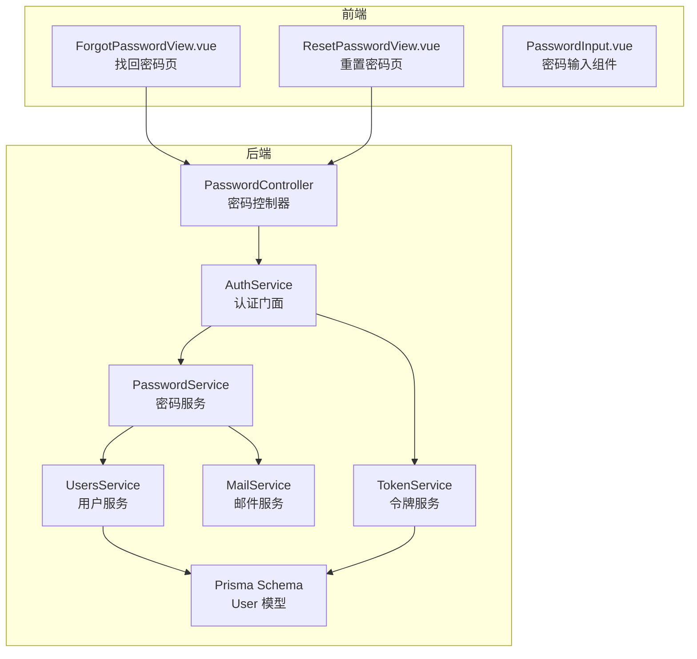
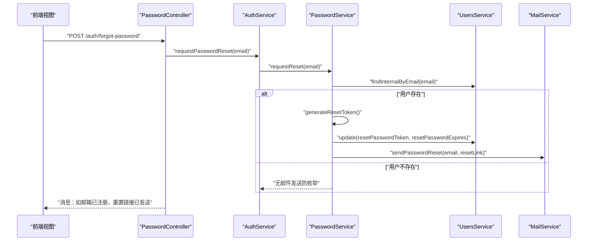
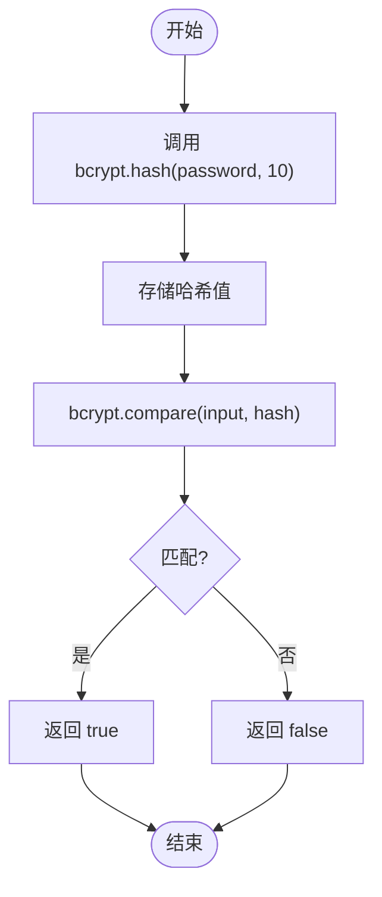
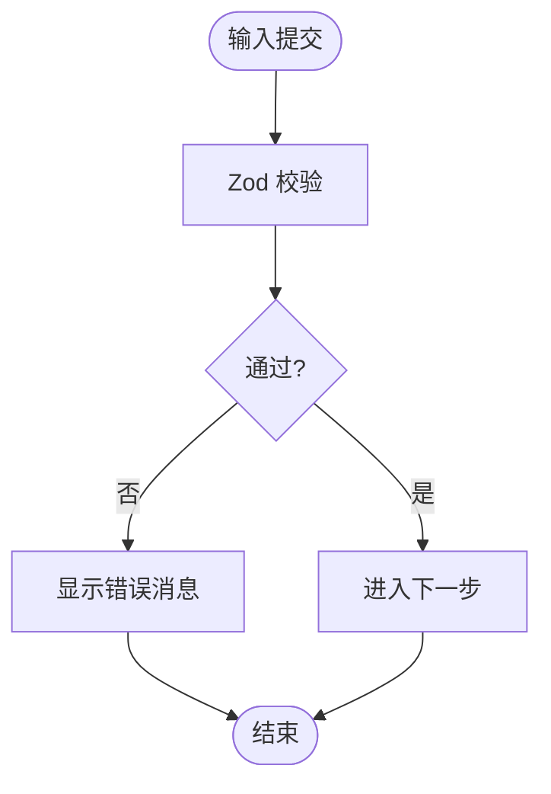
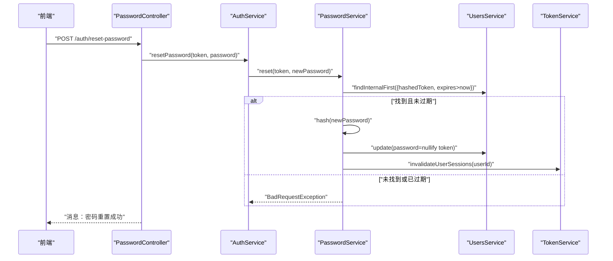
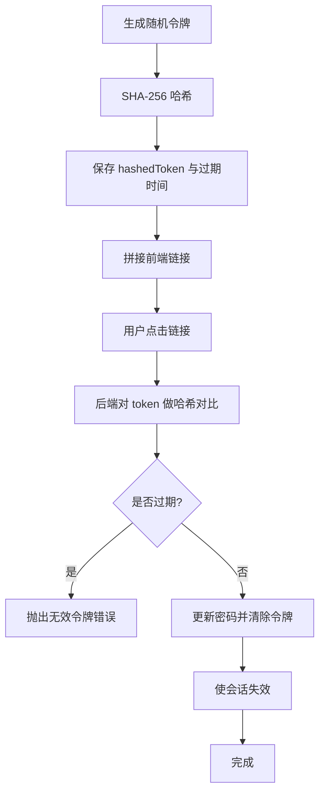
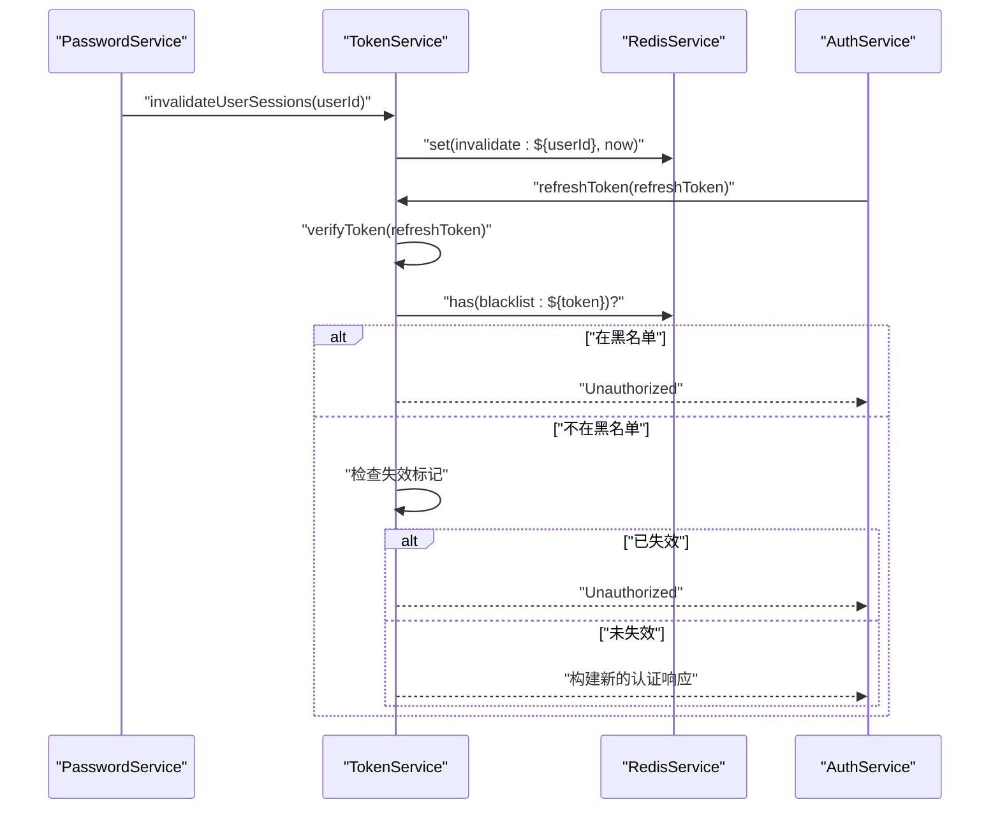
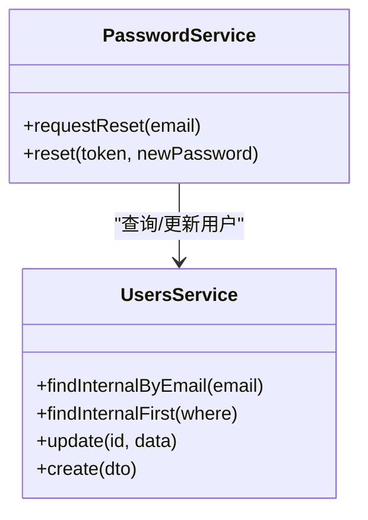
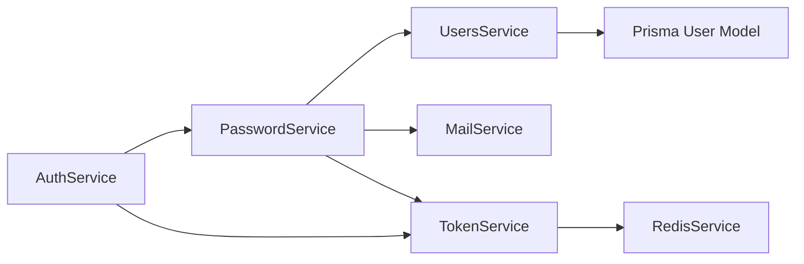

# 密码管理服务

<cite>
**本文引用的文件**
- [apps/backend/src/auth/password.service.ts](file://apps/backend/src/auth/password.service.ts)
- [apps/backend/src/auth/password.controller.ts](file://apps/backend/src/auth/password.controller.ts)
- [apps/backend/src/auth/auth.service.ts](file://apps/backend/src/auth/auth.service.ts)
- [apps/backend/src/auth/token.service.ts](file://apps/backend/src/auth/token.service.ts)
- [apps/backend/src/users/users.service.ts](file://apps/backend/src/users/users.service.ts)
- [apps/backend/src/mail/mail.service.ts](file://apps/backend/src/mail/mail.service.ts)
- [apps/backend/prisma/schema/user.prisma](file://apps/backend/prisma/schema/user.prisma)
- [apps/backend/src/auth/auth.dto.ts](file://apps/backend/src/auth/auth.dto.ts)
- [packages/shared/src/schemas/auth.schema.ts](file://packages/shared/src/schemas/auth.schema.ts)
- [apps/backend/src/common/throttling/throttling.constants.ts](file://apps/backend/src/common/throttling/throttling.constants.ts)
- [apps/frontend/src/features/auth/views/ForgotPasswordView.vue](file://apps/frontend/src/features/auth/views/ForgotPasswordView.vue)
- [apps/frontend/src/features/auth/views/ResetPasswordView.vue](file://apps/frontend/src/features/auth/views/ResetPasswordView.vue)
- [apps/frontend/src/components/auth/PasswordInput.vue](file://apps/frontend/src/components/auth/PasswordInput.vue)
- [apps/backend/tests/auth/password.service.spec.ts](file://apps/backend/tests/auth/password.service.spec.ts)
</cite>

## 目录

1. [简介](#简介)
2. [项目结构](#项目结构)
3. [核心组件](#核心组件)
4. [架构总览](#架构总览)
5. [详细组件分析](#详细组件分析)
6. [依赖关系分析](#依赖关系分析)
7. [性能考量](#性能考量)
8. [故障排查指南](#故障排查指南)
9. [结论](#结论)
10. [附录](#附录)

## 简介

本文件系统化阐述密码管理服务的设计与实现，覆盖以下关键主题：

- 密码加密算法与哈希策略（bcrypt）
- 密码强度验证规则（基于共享 Zod Schema）
- 密码重置流程（邮箱验证、临时令牌生成与校验）
- 会话失效与安全刷新（基于 Redis 的会话失效标记）
- 与用户服务的集成方式与数据模型
- 错误处理策略与安全防护（防枚举、限流、令牌黑名单）
- 安全最佳实践与合规要点

## 项目结构

后端采用 NestJS 分层架构，密码相关能力集中在认证模块内，配合用户、邮件、令牌与缓存服务协同工作；前端通过视图组件与共享 Schema 实现表单校验与交互。

图表来源

- [apps/backend/src/auth/password.controller.ts:11-37](file://apps/backend/src/auth/password.controller.ts#L11-L37)
- [apps/backend/src/auth/auth.service.ts:12-21](file://apps/backend/src/auth/auth.service.ts#L12-L21)
- [apps/backend/src/auth/password.service.ts:9-20](file://apps/backend/src/auth/password.service.ts#L9-L20)
- [apps/backend/src/auth/token.service.ts:15-29](file://apps/backend/src/auth/token.service.ts#L15-L29)
- [apps/backend/src/users/users.service.ts:12-14](file://apps/backend/src/users/users.service.ts#L12-L14)
- [apps/backend/src/mail/mail.service.ts:18-26](file://apps/backend/src/mail/mail.service.ts#L18-L26)
- [apps/backend/prisma/schema/user.prisma:1-16](file://apps/backend/prisma/schema/user.prisma#L1-L16)
- [apps/frontend/src/features/auth/views/ForgotPasswordView.vue:1-149](file://apps/frontend/src/features/auth/views/ForgotPasswordView.vue#L1-L149)
- [apps/frontend/src/features/auth/views/ResetPasswordView.vue:1-197](file://apps/frontend/src/features/auth/views/ResetPasswordView.vue#L1-L197)
- [apps/frontend/src/components/auth/PasswordInput.vue:1-137](file://apps/frontend/src/components/auth/PasswordInput.vue#L1-L137)

章节来源

- [apps/backend/src/auth/password.controller.ts:11-37](file://apps/backend/src/auth/password.controller.ts#L11-L37)
- [apps/backend/src/auth/auth.service.ts:12-21](file://apps/backend/src/auth/auth.service.ts#L12-L21)
- [apps/backend/src/auth/password.service.ts:9-20](file://apps/backend/src/auth/password.service.ts#L9-L20)
- [apps/backend/src/auth/token.service.ts:15-29](file://apps/backend/src/auth/token.service.ts#L15-L29)
- [apps/backend/src/users/users.service.ts:12-14](file://apps/backend/src/users/users.service.ts#L12-L14)
- [apps/backend/src/mail/mail.service.ts:18-26](file://apps/backend/src/mail/mail.service.ts#L18-L26)
- [apps/backend/prisma/schema/user.prisma:1-16](file://apps/backend/prisma/schema/user.prisma#L1-L16)
- [apps/frontend/src/features/auth/views/ForgotPasswordView.vue:1-149](file://apps/frontend/src/features/auth/views/ForgotPasswordView.vue#L1-L149)
- [apps/frontend/src/features/auth/views/ResetPasswordView.vue:1-197](file://apps/frontend/src/features/auth/views/ResetPasswordView.vue#L1-L197)
- [apps/frontend/src/components/auth/PasswordInput.vue:1-137](file://apps/frontend/src/components/auth/PasswordInput.vue#L1-L137)

## 核心组件

- 密码服务 PasswordService：负责密码哈希、比较、重置令牌生成与校验、触发重置邮件与会话失效。
- 认证服务 AuthService：作为门面整合 PasswordService 与 TokenService，提供统一的登录、注册、刷新、登出与密码重置入口。
- 令牌服务 TokenService：生成短期访问令牌与长期刷新令牌，维护会话失效标记与令牌黑名单。
- 用户服务 UsersService：提供用户查询、更新、创建等基础能力，并参与密码重置流程的数据持久化。
- 邮件服务 MailService：封装邮件发送逻辑，支持国际化文案与模板化内容。
- 数据模型 User：包含邮箱、密码、重置令牌与过期时间等字段。

章节来源

- [apps/backend/src/auth/password.service.ts:9-20](file://apps/backend/src/auth/password.service.ts#L9-L20)
- [apps/backend/src/auth/auth.service.ts:12-21](file://apps/backend/src/auth/auth.service.ts#L12-L21)
- [apps/backend/src/auth/token.service.ts:15-29](file://apps/backend/src/auth/token.service.ts#L15-L29)
- [apps/backend/src/users/users.service.ts:12-14](file://apps/backend/src/users/users.service.ts#L12-L14)
- [apps/backend/src/mail/mail.service.ts:18-26](file://apps/backend/src/mail/mail.service.ts#L18-L26)
- [apps/backend/prisma/schema/user.prisma:1-16](file://apps/backend/prisma/schema/user.prisma#L1-L16)

## 架构总览

密码管理服务围绕“控制器-门面-服务”的分层设计展开，前后端通过共享 Schema 与 DTO 协作，确保输入校验与错误消息的一致性。

图表来源

- [apps/backend/src/auth/password.controller.ts:16-25](file://apps/backend/src/auth/password.controller.ts#L16-L25)
- [apps/backend/src/auth/auth.service.ts:106-108](file://apps/backend/src/auth/auth.service.ts#L106-L108)
- [apps/backend/src/auth/password.service.ts:39-61](file://apps/backend/src/auth/password.service.ts#L39-L61)
- [apps/backend/src/users/users.service.ts:54-57](file://apps/backend/src/users/users.service.ts#L54-L57)
- [apps/backend/src/mail/mail.service.ts:88-115](file://apps/backend/src/mail/mail.service.ts#L88-L115)

## 详细组件分析

### 密码加密与哈希（bcrypt）

- 算法选择：使用 bcryptjs 进行密码哈希，成本因子设置为 10，兼顾安全性与性能。
- 核心方法：
  - 哈希：对明文密码进行哈希处理，返回哈希值。
  - 比较：对输入密码与存储哈希进行安全比较，返回布尔结果。
- 安全性：bcrypt 自带盐值，防止彩虹表攻击；固定成本因子降低可调整风险。

图表来源

- [apps/backend/src/auth/password.service.ts:24-34](file://apps/backend/src/auth/password.service.ts#L24-L34)

章节来源

- [apps/backend/src/auth/password.service.ts:24-34](file://apps/backend/src/auth/password.service.ts#L24-L34)

### 密码强度验证规则

- 后端与前端共享 Zod Schema，保证一致的验证行为：
  - 邮箱：必填、合法格式、小写、去空白。
  - 密码：长度最小 6，最大 100，满足基础强度。
- 前端视图组件：
  - ForgotPasswordView：使用共享 Schema 对邮箱进行校验。
  - ResetPasswordView：在前端额外增加“确认密码”一致性校验，提示“两次输入的密码不一致”。

图表来源

- [packages/shared/src/schemas/auth.schema.ts:7-21](file://packages/shared/src/schemas/auth.schema.ts#L7-L21)
- [apps/frontend/src/features/auth/views/ForgotPasswordView.vue:21-23](file://apps/frontend/src/features/auth/views/ForgotPasswordView.vue#L21-L23)
- [apps/frontend/src/features/auth/views/ResetPasswordView.vue:24-32](file://apps/frontend/src/features/auth/views/ResetPasswordView.vue#L24-L32)

章节来源

- [packages/shared/src/schemas/auth.schema.ts:7-21](file://packages/shared/src/schemas/auth.schema.ts#L7-L21)
- [apps/frontend/src/features/auth/views/ForgotPasswordView.vue:21-23](file://apps/frontend/src/features/auth/views/ForgotPasswordView.vue#L21-L23)
- [apps/frontend/src/features/auth/views/ResetPasswordView.vue:24-32](file://apps/frontend/src/features/auth/views/ResetPasswordView.vue#L24-L32)

### 密码重置流程

- 流程概览：
  - 前端提交邮箱，后端查找用户（若不存在则静默返回，防止枚举）。
  - 生成随机令牌与 SHA-256 哈希，设置过期时间，更新用户记录。
  - 发送包含重置链接的邮件（包含原始令牌参数）。
  - 用户点击链接后，后端以哈希令牌查询用户，校验过期时间，更新密码并清除令牌字段。
  - 触发会话失效，使旧令牌无法继续使用。
- 关键点：
  - 令牌仅在有效期内可用；过期自动失效。
  - 无效或过期令牌抛出明确错误，避免泄露细节。

图表来源

- [apps/backend/src/auth/password.controller.ts:27-36](file://apps/backend/src/auth/password.controller.ts#L27-L36)
- [apps/backend/src/auth/auth.service.ts:110-112](file://apps/backend/src/auth/auth.service.ts#L110-L112)
- [apps/backend/src/auth/password.service.ts:66-89](file://apps/backend/src/auth/password.service.ts#L66-L89)
- [apps/backend/src/auth/token.service.ts:47-53](file://apps/backend/src/auth/token.service.ts#L47-L53)

章节来源

- [apps/backend/src/auth/password.controller.ts:27-36](file://apps/backend/src/auth/password.controller.ts#L27-L36)
- [apps/backend/src/auth/auth.service.ts:110-112](file://apps/backend/src/auth/auth.service.ts#L110-L112)
- [apps/backend/src/auth/password.service.ts:39-89](file://apps/backend/src/auth/password.service.ts#L39-L89)
- [apps/backend/src/auth/token.service.ts:47-53](file://apps/backend/src/auth/token.service.ts#L47-L53)

### 临时令牌生成与验证

- 生成：使用随机字节生成原始令牌，同时计算 SHA-256 哈希存储于数据库，原始令牌仅用于构造链接与传递。
- 验证：后端收到请求时先对传入令牌做 SHA-256 哈希，再与数据库中的哈希令牌比对，并检查过期时间。
- 过期时间：通过配置项控制（默认 1 小时），过期后令牌失效。

图表来源

- [apps/backend/src/auth/password.service.ts:47-50](file://apps/backend/src/auth/password.service.ts#L47-L50)
- [apps/backend/src/auth/password.service.ts:66-74](file://apps/backend/src/auth/password.service.ts#L66-L74)
- [apps/backend/src/auth/password.service.ts:94-98](file://apps/backend/src/auth/password.service.ts#L94-L98)

章节来源

- [apps/backend/src/auth/password.service.ts:47-50](file://apps/backend/src/auth/password.service.ts#L47-L50)
- [apps/backend/src/auth/password.service.ts:66-74](file://apps/backend/src/auth/password.service.ts#L66-L74)
- [apps/backend/src/auth/password.service.ts:94-98](file://apps/backend/src/auth/password.service.ts#L94-L98)

### 会话失效与安全刷新

- 会话失效：密码重置后，通过 Redis 写入用户失效标记，后续刷新令牌时若发现令牌签发时间早于失效标记，则拒绝刷新。
- 令牌黑名单：登出时将刷新令牌加入黑名单，防止被重复使用。
- 访问令牌与刷新令牌：短期访问令牌与长期刷新令牌分别签名，验证时优先尝试访问令牌密钥，再尝试刷新令牌密钥。

图表来源

- [apps/backend/src/auth/password.service.ts:88-89](file://apps/backend/src/auth/password.service.ts#L88-L89)
- [apps/backend/src/auth/token.service.ts:47-76](file://apps/backend/src/auth/token.service.ts#L47-L76)
- [apps/backend/src/auth/token.service.ts:95-101](file://apps/backend/src/auth/token.service.ts#L95-L101)
- [apps/backend/src/auth/token.service.ts:130-149](file://apps/backend/src/auth/token.service.ts#L130-L149)

章节来源

- [apps/backend/src/auth/password.service.ts:88-89](file://apps/backend/src/auth/password.service.ts#L88-L89)
- [apps/backend/src/auth/token.service.ts:47-76](file://apps/backend/src/auth/token.service.ts#L47-L76)
- [apps/backend/src/auth/token.service.ts:95-101](file://apps/backend/src/auth/token.service.ts#L95-L101)
- [apps/backend/src/auth/token.service.ts:130-149](file://apps/backend/src/auth/token.service.ts#L130-L149)

### 与用户服务的集成

- 用户查询：通过邮箱精确查找用户，内部方法包含密码字段以便登录与重置场景使用。
- 用户更新：在密码重置成功后更新用户密码，并清理重置令牌与过期时间。
- 创建用户：注册时对密码进行哈希后再入库。

图表来源

- [apps/backend/src/users/users.service.ts:54-91](file://apps/backend/src/users/users.service.ts#L54-L91)
- [apps/backend/src/auth/password.service.ts:39-89](file://apps/backend/src/auth/password.service.ts#L39-L89)

章节来源

- [apps/backend/src/users/users.service.ts:54-91](file://apps/backend/src/users/users.service.ts#L54-L91)
- [apps/backend/src/auth/password.service.ts:39-89](file://apps/backend/src/auth/password.service.ts#L39-L89)

### 错误处理策略与安全防护

- 防枚举攻击：重置请求若用户不存在，不发送任何响应，避免泄露邮箱注册状态。
- 无效令牌：当令牌不存在或已过期时，抛出明确错误，不暴露内部细节。
- 限流保护：针对“忘记密码”和“重置密码”接口设置独立限流策略，降低暴力尝试风险。
- 令牌黑名单：登出时将刷新令牌加入黑名单，确保令牌即时失效。
- 会话失效：重置密码后写入用户级失效标记，阻止旧令牌继续使用。

章节来源

- [apps/backend/src/auth/password.service.ts:42-45](file://apps/backend/src/auth/password.service.ts#L42-L45)
- [apps/backend/src/auth/password.service.ts:76-78](file://apps/backend/src/auth/password.service.ts#L76-L78)
- [apps/backend/src/common/throttling/throttling.constants.ts:108-118](file://apps/backend/src/common/throttling/throttling.constants.ts#L108-L118)
- [apps/backend/src/auth/token.service.ts:130-149](file://apps/backend/src/auth/token.service.ts#L130-L149)
- [apps/backend/src/auth/token.service.ts:47-53](file://apps/backend/src/auth/token.service.ts#L47-L53)

### API 使用示例

- 密码重置请求
  - 方法与路径：POST /auth/forgot-password
  - 请求体：邮箱（遵循共享 Schema）
  - 响应：无论邮箱是否存在，均返回统一消息，避免枚举风险
- 重置密码
  - 方法与路径：POST /auth/reset-password
  - 请求体：token 与 password（遵循共享 Schema）
  - 响应：成功消息，提示使用新密码登录

章节来源

- [apps/backend/src/auth/password.controller.ts:16-25](file://apps/backend/src/auth/password.controller.ts#L16-L25)
- [apps/backend/src/auth/password.controller.ts:27-36](file://apps/backend/src/auth/password.controller.ts#L27-L36)
- [apps/backend/src/auth/auth.dto.ts:29-35](file://apps/backend/src/auth/auth.dto.ts#L29-L35)
- [packages/shared/src/schemas/auth.schema.ts:99-110](file://packages/shared/src/schemas/auth.schema.ts#L99-L110)

## 依赖关系分析

- 组件耦合：
  - PasswordService 依赖 UsersService、MailService、TokenService 与 ConfigService。
  - AuthService 作为门面聚合 PasswordService 与 TokenService，降低上层复杂度。
  - TokenService 依赖 JwtService、ConfigService 与 RedisService。
- 外部依赖：
  - bcryptjs：密码哈希与比较。
  - crypto：随机令牌生成与 SHA-256 哈希。
  - Redis：会话失效标记与令牌黑名单存储。
  - Prisma：用户数据持久化。

图表来源

- [apps/backend/src/auth/password.service.ts:9-20](file://apps/backend/src/auth/password.service.ts#L9-L20)
- [apps/backend/src/auth/auth.service.ts:12-21](file://apps/backend/src/auth/auth.service.ts#L12-L21)
- [apps/backend/src/auth/token.service.ts:15-29](file://apps/backend/src/auth/token.service.ts#L15-L29)
- [apps/backend/prisma/schema/user.prisma:1-16](file://apps/backend/prisma/schema/user.prisma#L1-L16)

章节来源

- [apps/backend/src/auth/password.service.ts:9-20](file://apps/backend/src/auth/password.service.ts#L9-L20)
- [apps/backend/src/auth/auth.service.ts:12-21](file://apps/backend/src/auth/auth.service.ts#L12-L21)
- [apps/backend/src/auth/token.service.ts:15-29](file://apps/backend/src/auth/token.service.ts#L15-L29)
- [apps/backend/prisma/schema/user.prisma:1-16](file://apps/backend/prisma/schema/user.prisma#L1-L16)

## 性能考量

- bcrypt 成本因子：当前为 10，平衡安全与性能；在高并发场景可根据 CPU 能力适当调整。
- 限流策略：针对密码相关接口设置独立限流窗口，减少资源消耗与暴力尝试风险。
- 缓存与存储：Redis 用于会话失效标记与黑名单，建议合理设置 TTL 与内存策略。
- 数据库索引：User 模型中邮箱唯一索引有助于快速查找用户，重置令牌与过期时间字段需建立合适索引以优化查询。

## 故障排查指南

- 重置邮件未送达
  - 检查邮件服务配置与传输器初始化。
  - 确认用户邮箱存在且未被枚举屏蔽。
- 令牌无效或过期
  - 核对前端链接中的 token 参数是否正确传递。
  - 检查数据库中 hashedToken 与过期时间字段是否正确更新。
- 刷新令牌失败
  - 确认令牌未在黑名单中。
  - 检查用户是否存在以及会话失效标记是否生效。
- 密码重置后仍可登录
  - 确认已调用会话失效逻辑并写入 Redis 标记。

章节来源

- [apps/backend/src/mail/mail.service.ts:88-115](file://apps/backend/src/mail/mail.service.ts#L88-L115)
- [apps/backend/src/auth/password.service.ts:66-89](file://apps/backend/src/auth/password.service.ts#L66-L89)
- [apps/backend/src/auth/token.service.ts:47-76](file://apps/backend/src/auth/token.service.ts#L47-L76)
- [apps/backend/tests/auth/password.service.spec.ts:60-91](file://apps/backend/tests/auth/password.service.spec.ts#L60-L91)
- [apps/backend/tests/auth/password.service.spec.ts:93-120](file://apps/backend/tests/auth/password.service.spec.ts#L93-L120)

## 结论

密码管理服务通过 bcrypt 哈希、严格的令牌生命周期管理、Redis 会话失效与黑名单机制，以及完善的前后端校验与限流策略，提供了安全可靠的密码重置与会话安全能力。结合共享 Schema 与统一错误消息，提升了系统的可维护性与用户体验。

## 附录

- 数据模型（User）
  - 字段：id、email（唯一）、name、password、resetPasswordToken、resetPasswordExpires、createdAt、updatedAt
  - 说明：重置令牌与过期时间用于密码重置流程；密码字段在登录与注册场景使用。

章节来源

- [apps/backend/prisma/schema/user.prisma:1-16](file://apps/backend/prisma/schema/user.prisma#L1-L16)
