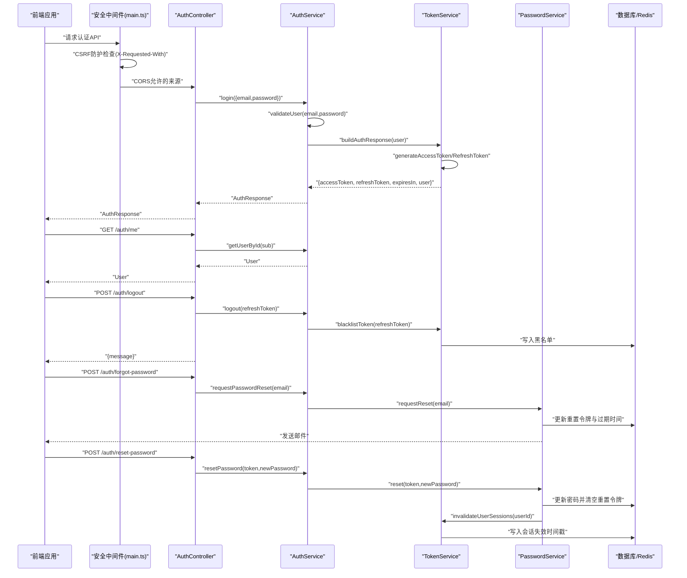
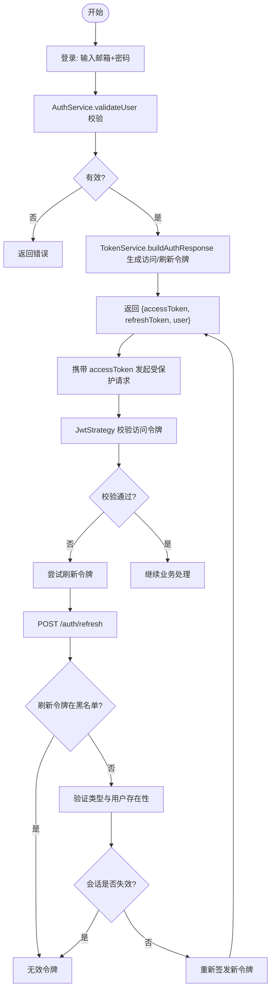
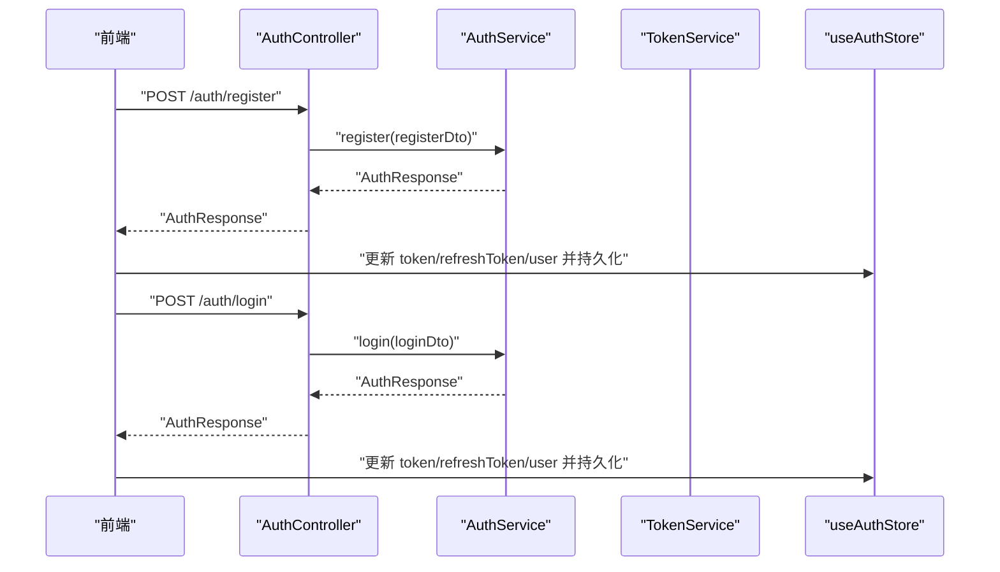
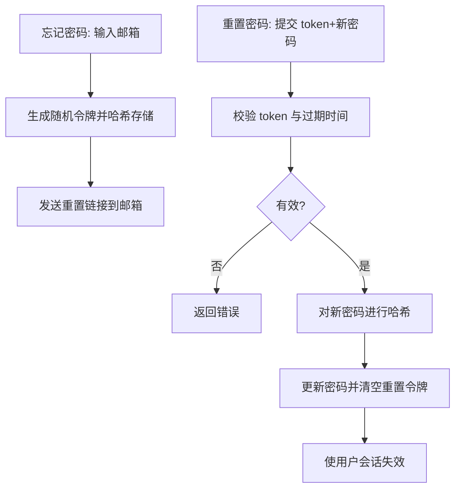
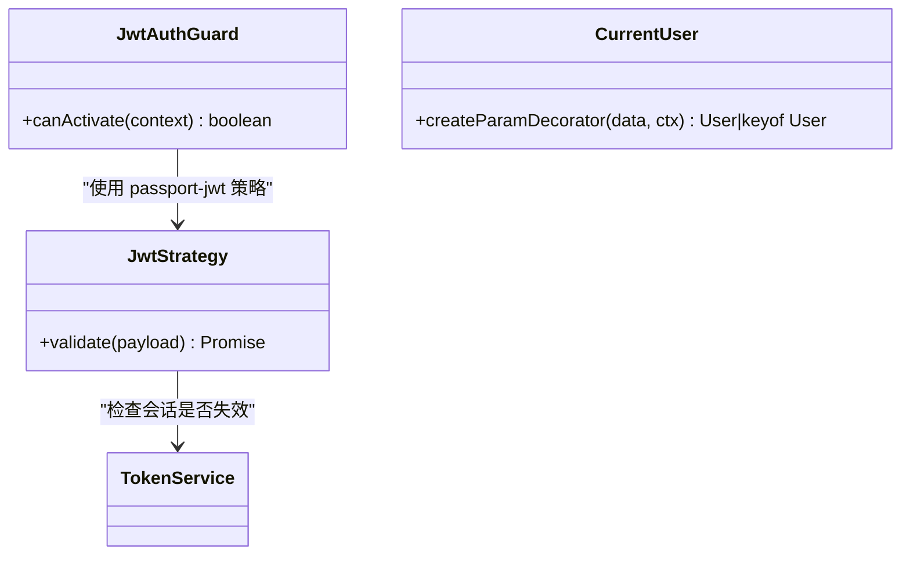
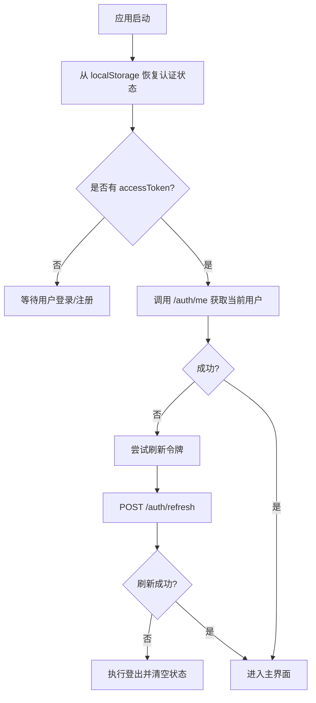
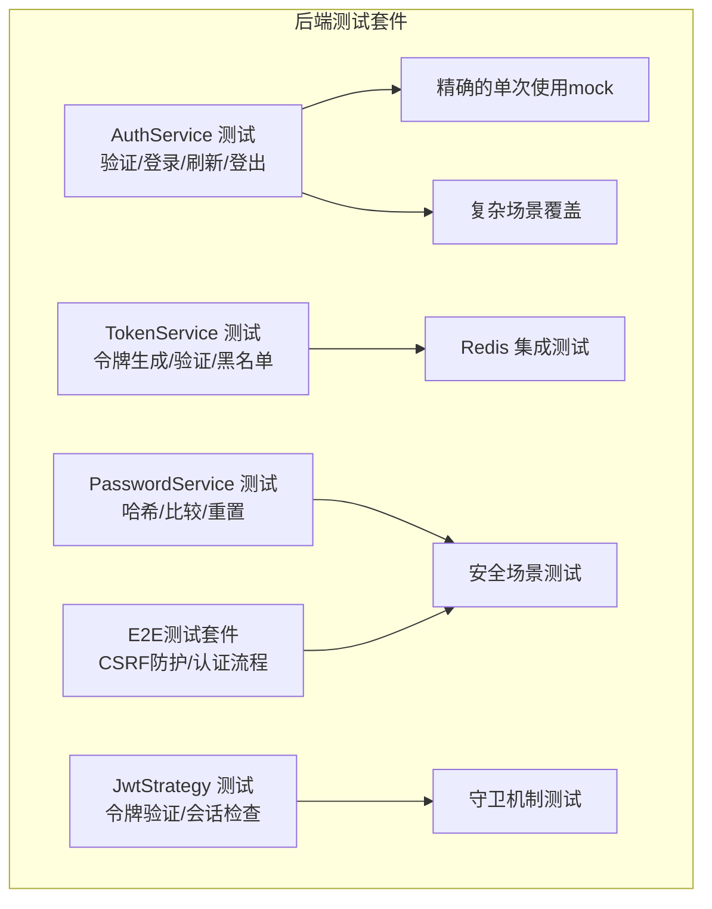
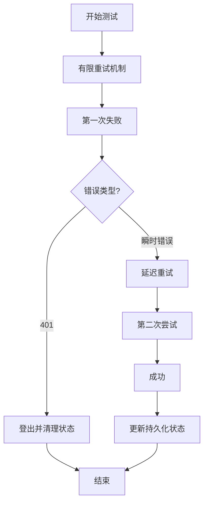
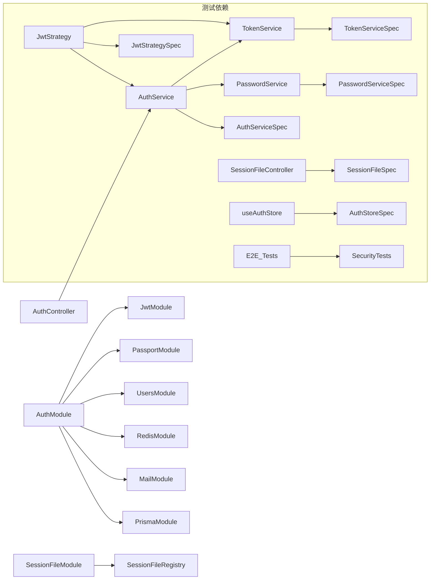

# 用户认证系统

<cite>
**本文引用的文件**
- [apps/backend/src/auth/auth.module.ts](file://apps/backend/src/auth/auth.module.ts)
- [apps/backend/src/auth/auth.controller.ts](file://apps/backend/src/auth/auth.controller.ts)
- [apps/backend/src/auth/auth.service.ts](file://apps/backend/src/auth/auth.service.ts)
- [apps/backend/src/auth/jwt-auth.guard.ts](file://apps/backend/src/auth/jwt-auth.guard.ts)
- [apps/backend/src/auth/jwt.strategy.ts](file://apps/backend/src/auth/jwt.strategy.ts)
- [apps/backend/src/auth/token.service.ts](file://apps/backend/src/auth/token.service.ts)
- [apps/backend/src/auth/password.service.ts](file://apps/backend/src/auth/password.service.ts)
- [apps/backend/src/auth/password.controller.ts](file://apps/backend/src/auth/password.controller.ts)
- [apps/backend/src/auth/auth.dto.ts](file://apps/backend/src/auth/auth.dto.ts)
- [apps/backend/src/auth/current-user.decorator.ts](file://apps/backend/src/auth/current-user.decorator.ts)
- [apps/backend/src/agent/session-file/session-file.module.ts](file://apps/backend/src/agent/session-file/session-file.module.ts)
- [apps/backend/src/agent/session-file/session-file.controller.ts](file://apps/backend/src/agent/session-file/session-file.controller.ts)
- [apps/backend/src/agent/session-file/session-file.registry.ts](file://apps/backend/src/agent/session-file/session-file.registry.ts)
- [apps/backend/src/agent/session-file/session-file.types.ts](file://apps/backend/src/agent/session-file/session-file.types.ts)
- [apps/backend/src/common/throttling/throttling.constants.ts](file://apps/backend/src/common/throttling/throttling.constants.ts)
- [apps/backend/src/common/types.ts](file://apps/backend/src/common/types.ts)
- [apps/backend/src/main.ts](file://apps/backend/src/main.ts)
- [apps/backend/src/app.module.ts](file://apps/backend/src/app.module.ts)
- [apps/frontend/src/features/auth/stores/auth.ts](file://apps/frontend/src/features/auth/stores/auth.ts)
- [apps/frontend/src/features/auth/views/LoginView.vue](file://apps/frontend/src/features/auth/views/LoginView.vue)
- [apps/frontend/src/features/auth/views/RegisterView.vue](file://apps/frontend/src/features/auth/views/RegisterView.vue)
- [apps/frontend/src/features/auth/views/ForgotPasswordView.vue](file://apps/frontend/src/features/auth/views/ForgotPasswordView.vue)
- [apps/frontend/src/features/auth/views/ResetPasswordView.vue](file://apps/frontend/src/features/auth/views/ResetPasswordView.vue)
- [apps/backend/tests/auth/auth.service.spec.ts](file://apps/backend/tests/auth/auth.service.spec.ts)
- [apps/backend/tests/auth/token.service.spec.ts](file://apps/backend/tests/auth/token.service.spec.ts)
- [apps/backend/tests/auth/jwt.strategy.spec.ts](file://apps/backend/tests/auth/jwt.strategy.spec.ts)
- [apps/backend/tests/auth/password.service.spec.ts](file://apps/backend/tests/auth/password.service.spec.ts)
- [apps/backend/tests/e2e/auth.e2e.spec.ts](file://apps/backend/tests/e2e/auth.e2e.spec.ts)
- [apps/backend/tests/e2e/test-app.ts](file://apps/backend/tests/e2e/test-app.ts)
- [apps/frontend/tests/features/auth/stores/auth.spec.ts](file://apps/frontend/tests/features/auth/stores/auth.spec.ts)
</cite>

## 更新摘要
**变更内容**
- 更新了CORS配置扩展，支持Wails桌面应用和本地开发来源
- 新增了CSRF防护中间件，防止跨站请求伪造攻击
- 新增了Agent会话文件管理模块，支持文件标签处理
- 增强了登录流程的安全性，分离了认证和安全检查
- 完善了速率限制策略，针对不同认证操作设置了专门的阈值
- 新增了会话文件标签处理机制，支持文件元数据管理

## 目录
1. [简介](#简介)
2. [项目结构](#项目结构)
3. [核心组件](#核心组件)
4. [架构总览](#架构总览)
5. [详细组件分析](#详细组件分析)
6. [安全增强功能](#安全增强功能)
7. [测试套件改进](#测试套件改进)
8. [依赖关系分析](#依赖关系分析)
9. [性能考量](#性能考量)
10. [故障排查指南](#故障排查指南)
11. [结论](#结论)
12. [附录：API 使用示例与最佳实践](#附录api-使用示例与最佳实践)

## 简介
本文件面向 Lumina Todo 的用户认证系统，系统采用基于 JWT 的双令牌方案（短期访问令牌 + 长期刷新令牌），结合后端 TokenService 的会话失效控制与前端 Pinia 状态管理的令牌轮转，形成完整的认证与会话生命周期。**最新更新包括CORS配置扩展、CSRF防护、会话文件管理等安全增强功能**。文档覆盖以下主题：
- JWT 认证流程与令牌刷新机制
- 用户注册、登录、登出与密码重置
- 安全性设计：密码加密、令牌黑名单、会话失效、速率限制、CSRF防护
- 后端模块架构与前端状态管理
- 路由保护与守卫机制
- 权限控制集成与安全最佳实践
- **新增：CORS配置扩展与Wails桌面应用支持**
- **新增：CSRF防护中间件与安全请求头验证**
- **新增：Agent会话文件管理与标签处理机制**
- **新增：增强的测试套件覆盖与安全场景验证**

## 项目结构
认证相关代码主要分布在后端 NestJS 应用的 auth 模块与前端 Vue 应用的 auth 功能区，**新增了Agent会话文件管理模块**：
- 后端
  - 认证模块：auth.module.ts、auth.controller.ts、auth.service.ts
  - 安全中间件：main.ts（CORS、CSRF防护）、app.module.ts（全局配置）
  - 服务：auth.service.ts、token.service.ts、password.service.ts
  - 策略与守卫：jwt.strategy.ts、jwt-auth.guard.ts
  - DTO：auth.dto.ts
  - 当前用户装饰器：current-user.decorator.ts
  - **新增：会话文件管理模块**
    - session-file.module.ts、session-file.controller.ts
    - session-file.registry.ts、session-file.types.ts
- 前端
  - 状态管理：features/auth/stores/auth.ts
  - 视图组件：LoginView.vue、RegisterView.vue、ForgotPasswordView.vue、ResetPasswordView.vue
- **测试套件**
  - 后端测试：auth.service.spec.ts、token.service.spec.ts、jwt.strategy.spec.ts、password.service.spec.ts
  - **新增：E2E测试**：auth.e2e.spec.ts（包含CSRF防护测试）
  - 前端测试：auth.spec.ts

```mermaid
graph TB
subgraph "后端(NestJS)"
AM["AuthModule<br/>装配 JwtModule/PassportModule"] --> AC["AuthController"]
AM --> PC["PasswordController"]
AC --> AS["AuthService"]
AS --> TS["TokenService"]
AS --> PS["PasswordService"]
AC --> JS["JwtStrategy"]
AC --> JG["JwtAuthGuard"]
subgraph "安全中间件"
MAIN["main.ts<br/>CORS + CSRF防护"] --> Helmet["Helmet 安全头"]
MAIN --> CSRF["CSRF 中间件"]
END
subgraph "Agent会话文件管理"
SFM["SessionFileModule"] --> SFC["SessionFileController"]
SFC --> SFR["SessionFileRegistry"]
SFR --> SFT["SessionFileTypes"]
END
end
subgraph "前端(Vue/Pinia)"
FE_Store["useAuthStore<br/>登录/注册/刷新/登出/密码重置"] --> FE_Views["登录/注册/忘记密码/重置密码视图"]
end
subgraph "测试套件"
BE_Tests["后端测试套件<br/>覆盖所有认证场景"] --> E2E_Tests["E2E测试套件<br/>包含CSRF防护测试"]
FE_Tests["前端测试套件<br/>包含重试机制验证"]
end
FE_Store -- "HTTP 接口调用" --> AC
AC -- "返回 {accessToken, refreshToken, user}" --> FE_Store
```

**图表来源**
- [apps/backend/src/auth/auth.module.ts:19-39](file://apps/backend/src/auth/auth.module.ts#L19-L39)
- [apps/backend/src/auth/auth.controller.ts:16-80](file://apps/backend/src/auth/auth.controller.ts#L16-L80)
- [apps/backend/src/auth/auth.service.ts:13-21](file://apps/backend/src/auth/auth.service.ts#L13-L21)
- [apps/backend/src/auth/token.service.ts:16-45](file://apps/backend/src/auth/token.service.ts#L16-L45)
- [apps/backend/src/auth/password.service.ts:10-20](file://apps/backend/src/auth/password.service.ts#L10-L20)
- [apps/backend/src/auth/jwt.strategy.ts:20-36](file://apps/backend/src/auth/jwt.strategy.ts#L20-L36)
- [apps/backend/src/auth/jwt-auth.guard.ts:8-9](file://apps/backend/src/auth/jwt-auth.guard.ts#L8-L9)
- [apps/backend/src/agent/session-file/session-file.module.ts:1-10](file://apps/backend/src/agent/session-file/session-file.module.ts#L1-L10)
- [apps/backend/src/agent/session-file/session-file.controller.ts:18-126](file://apps/backend/src/agent/session-file/session-file.controller.ts#L18-L126)
- [apps/backend/src/agent/session-file/session-file.registry.ts:60-167](file://apps/backend/src/agent/session-file/session-file.registry.ts#L60-L167)
- [apps/backend/src/main.ts:48-172](file://apps/backend/src/main.ts#L48-L172)
- [apps/backend/tests/e2e/auth.e2e.spec.ts:30-62](file://apps/backend/tests/e2e/auth.e2e.spec.ts#L30-L62)

**章节来源**
- [apps/backend/src/auth/auth.module.ts:19-39](file://apps/backend/src/auth/auth.module.ts#L19-L39)
- [apps/backend/src/agent/session-file/session-file.module.ts:1-10](file://apps/backend/src/agent/session-file/session-file.module.ts#L1-L10)
- [apps/backend/src/main.ts:48-172](file://apps/backend/src/main.ts#L48-L172)
- [apps/backend/tests/e2e/auth.e2e.spec.ts:30-62](file://apps/backend/tests/e2e/auth.e2e.spec.ts#L30-L62)

## 核心组件
- 认证模块(AuthModule)
  - 负责装配 Passport/JWT、注入 Users/Redis/Mail/Prisma 模块，并导出 AuthService/TokenService/PasswordService 与 JwtModule/PassportModule。
- 认证控制器(AuthController)
  - 提供登录、注册、刷新、获取当前用户、登出等接口；对敏感接口启用节流与 JWT 守卫。
- 密码控制器(PasswordController)
  - 提供忘记密码与重置密码接口。
- 认证服务(AuthService)
  - 组合 TokenService 与 PasswordService，提供登录、注册、刷新、登出、密码重置入口。
- 令牌服务(TokenService)
  - 生成/校验访问令牌与刷新令牌；维护会话失效时间戳；将过期/作废令牌写入黑名单；构建认证响应。
- 密码服务(PasswordService)
  - 密码哈希与比对；生成带有效期的密码重置令牌；发送邮件；重置后使用户会话失效。
- JWT 策略(JwtStrategy)
  - 从请求头提取 Bearer 令牌，校验签名与类型(access)，并检查会话是否被用户级失效。
- JWT 守卫(JwtAuthGuard)
  - 基于 Passport 的 jwt 策略的认证守卫，用于路由保护。
- 当前用户装饰器(CurrentUser)
  - 从请求对象提取当前用户，支持按字段取值。
- **新增：会话文件管理模块(SessionFileModule)**
  - 提供Agent会话文件的注册、查询、删除功能，支持文件标签处理和元数据管理。
- **新增：CORS配置扩展**
  - 支持Wails桌面应用协议（wails://）和本地开发来源，确保跨域请求安全。
- **新增：CSRF防护中间件**
  - 验证X-Requested-With请求头，防止跨站请求伪造攻击。

**章节来源**
- [apps/backend/src/auth/auth.module.ts:19-39](file://apps/backend/src/auth/auth.module.ts#L19-L39)
- [apps/backend/src/auth/auth.controller.ts:16-80](file://apps/backend/src/auth/auth.controller.ts#L16-L80)
- [apps/backend/src/auth/password.controller.ts:12-37](file://apps/backend/src/auth/password.controller.ts#L12-L37)
- [apps/backend/src/auth/auth.service.ts:13-21](file://apps/backend/src/auth/auth.service.ts#L13-L21)
- [apps/backend/src/auth/token.service.ts:16-45](file://apps/backend/src/auth/token.service.ts#L16-L45)
- [apps/backend/src/auth/password.service.ts:10-20](file://apps/backend/src/auth/password.service.ts#L10-L20)
- [apps/backend/src/auth/jwt.strategy.ts:20-36](file://apps/backend/src/auth/jwt.strategy.ts#L20-L36)
- [apps/backend/src/auth/jwt-auth.guard.ts:8-9](file://apps/backend/src/auth/jwt-auth.guard.ts#L8-L9)
- [apps/backend/src/auth/current-user.decorator.ts:8-18](file://apps/backend/src/auth/current-user.decorator.ts#L8-L18)
- [apps/backend/src/agent/session-file/session-file.module.ts:1-10](file://apps/backend/src/agent/session-file/session-file.module.ts#L1-L10)
- [apps/backend/src/agent/session-file/session-file.controller.ts:18-126](file://apps/backend/src/agent/session-file/session-file.controller.ts#L18-L126)
- [apps/backend/src/agent/session-file/session-file.registry.ts:60-167](file://apps/backend/src/agent/session-file/session-file.registry.ts#L60-L167)
- [apps/backend/src/main.ts:48-172](file://apps/backend/src/main.ts#L48-L172)

## 架构总览
下图展示了后端认证子系统与前端状态管理之间的交互关系，以及新增的安全中间件如何参与请求认证。



**图表来源**
- [apps/backend/src/auth/auth.controller.ts:26-79](file://apps/backend/src/auth/auth.controller.ts#L26-L79)
- [apps/backend/src/auth/auth.service.ts:41-101](file://apps/backend/src/auth/auth.service.ts#L41-L101)
- [apps/backend/src/auth/token.service.ts:175-185](file://apps/backend/src/auth/token.service.ts#L175-L185)
- [apps/backend/src/auth/password.service.ts:39-89](file://apps/backend/src/auth/password.service.ts#L39-L89)
- [apps/backend/src/frontend/src/features/auth/stores/auth.ts:148-372](file://apps/frontend/src/features/auth/stores/auth.ts#L148-L372)
- [apps/backend/src/main.ts:130-172](file://apps/backend/src/main.ts#L130-L172)

## 详细组件分析

### JWT 认证流程与令牌刷新
- 登录
  - 前端提交邮箱与密码，后端通过 AuthService.validateUser 校验用户与密码。
  - 成功后由 TokenService 生成访问令牌与刷新令牌，并返回给前端。
- 访问令牌校验
  - JwtStrategy 从 Authorization 头解析 Bearer 令牌，校验签名与类型(access)，并检查会话是否被失效。
- 刷新令牌
  - 前端使用刷新令牌向后端请求新的访问令牌；后端先检查刷新令牌是否在黑名单且类型正确，再验证用户是否存在与会话未失效，最后重新签发新令牌。
- 登出
  - 前端提交刷新令牌，后端将其加入黑名单，同时前端清除本地存储与请求头中的令牌。



**图表来源**
- [apps/backend/src/auth/auth.service.ts:41-93](file://apps/backend/src/auth/auth.service.ts#L41-L93)
- [apps/backend/src/auth/token.service.ts:175-185](file://apps/backend/src/auth/token.service.ts#L175-L185)
- [apps/backend/src/auth/jwt.strategy.ts:41-66](file://apps/backend/src/auth/jwt.strategy.ts#L41-L66)
- [apps/frontend/src/features/auth/stores/auth.ts:296-341](file://apps/frontend/src/features/auth/stores/auth.ts#L296-L341)

**章节来源**
- [apps/backend/src/auth/auth.service.ts:41-93](file://apps/backend/src/auth/auth.service.ts#L41-L93)
- [apps/backend/src/auth/token.service.ts:175-185](file://apps/backend/src/auth/token.service.ts#L175-L185)
- [apps/backend/src/auth/jwt.strategy.ts:41-66](file://apps/backend/src/auth/jwt.strategy.ts#L41-L66)
- [apps/frontend/src/features/auth/stores/auth.ts:296-341](file://apps/frontend/src/features/auth/stores/auth.ts#L296-L341)

### 用户注册与登录机制
- 注册
  - 前端提交注册表单，后端通过 AuthService.register 创建用户并返回认证响应。
- 登录
  - 前端提交登录表单，后端通过 AuthService.login 返回认证响应。
- 前端状态
  - useAuthStore.login/register 将返回的 accessToken/refreshToken/user 写入状态并持久化，随后触发数据合并与迁移。



**图表来源**
- [apps/backend/src/auth/auth.controller.ts:33-38](file://apps/backend/src/auth/auth.controller.ts#L33-L38)
- [apps/backend/src/auth/auth.controller.ts:23-28](file://apps/backend/src/auth/auth.controller.ts#L23-L28)
- [apps/backend/src/auth/auth.service.ts:51-54](file://apps/backend/src/auth/auth.service.ts#L51-L54)
- [apps/frontend/src/features/auth/stores/auth.ts:148-212](file://apps/frontend/src/features/auth/stores/auth.ts#L148-L212)

**章节来源**
- [apps/backend/src/auth/auth.controller.ts:23-38](file://apps/backend/src/auth/auth.controller.ts#L23-L38)
- [apps/backend/src/auth/auth.service.ts:51-54](file://apps/backend/src/auth/auth.service.ts#L51-L54)
- [apps/frontend/src/features/auth/stores/auth.ts:148-212](file://apps/frontend/src/features/auth/stores/auth.ts#L148-L212)

### 密码安全管理
- 密码加密
  - PasswordService 使用 bcrypt 对密码进行哈希；compare 用于登录时比对。
- 密码重置
  - requestReset 生成随机令牌并以哈希形式存入数据库，设置过期时间，发送重置链接。
  - reset 校验令牌与过期时间，成功后更新密码并调用 TokenService.invalidateUserSessions 使该用户的会话全部失效。
- 安全特性
  - 防枚举：不存在用户时也返回成功，避免泄露邮箱是否存在。
  - 令牌有效期：通过配置项控制访问/刷新令牌过期时间。
  - 会话失效：invalidateUserSessions 将用户会话失效时间写入 Redis，策略与服务端均会校验。



**图表来源**
- [apps/backend/src/auth/password.service.ts:39-89](file://apps/backend/src/auth/password.service.ts#L39-L89)
- [apps/backend/src/auth/token.service.ts:47-76](file://apps/backend/src/auth/token.service.ts#L47-L76)

**章节来源**
- [apps/backend/src/auth/password.service.ts:25-89](file://apps/backend/src/auth/password.service.ts#L25-L89)
- [apps/backend/src/auth/token.service.ts:47-76](file://apps/backend/src/auth/token.service.ts#L47-L76)

### 认证守卫与路由保护
- JwtAuthGuard
  - 基于 Passport 的 jwt 策略，用于保护需要认证的路由。
- JwtStrategy
  - 从 Authorization 头提取 Bearer 令牌，校验签名与类型(access)，并检查会话是否被用户级失效。
- CurrentUser 装饰器
  - 从请求对象提取当前用户，支持按字段取值，便于在控制器中直接注入用户信息。



**图表来源**
- [apps/backend/src/auth/jwt-auth.guard.ts:8-9](file://apps/backend/src/auth/jwt-auth.guard.ts#L8-L9)
- [apps/backend/src/auth/jwt.strategy.ts:41-66](file://apps/backend/src/auth/jwt.strategy.ts#L41-L66)
- [apps/backend/src/auth/current-user.decorator.ts:8-18](file://apps/backend/src/auth/current-user.decorator.ts#L8-L18)

**章节来源**
- [apps/backend/src/auth/jwt-auth.guard.ts:8-9](file://apps/backend/src/auth/jwt-auth.guard.ts#L8-L9)
- [apps/backend/src/auth/jwt.strategy.ts:41-66](file://apps/backend/src/auth/jwt.strategy.ts#L41-L66)
- [apps/backend/src/auth/current-user.decorator.ts:8-18](file://apps/backend/src/auth/current-user.decorator.ts#L8-L18)

### 前端状态管理与令牌轮转
- useAuthStore
  - 管理 token/refreshToken/user/错误与加载态；封装登录/注册/刷新/登出/密码重置。
  - 支持持久化到 localStorage，并在 Hydrate 时恢复状态。
  - **新增：刷新访问令牌时具备复杂的重试与瞬时错误处理机制**。
  - 登出时清理本地状态并尝试后端注销。
- 视图组件
  - LoginView、RegisterView、ForgotPasswordView、ResetPasswordView 分别承载登录、注册、忘记密码、重置密码的 UI 与校验逻辑。



**图表来源**
- [apps/frontend/src/features/auth/stores/auth.ts:112-143](file://apps/frontend/src/features/auth/stores/auth.ts#L112-L143)
- [apps/frontend/src/features/auth/stores/auth.ts:276-291](file://apps/frontend/src/features/auth/stores/auth.ts#L276-L291)
- [apps/frontend/src/features/auth/stores/auth.ts:296-341](file://apps/frontend/src/features/auth/stores/auth.ts#L296-L341)
- [apps/frontend/src/features/auth/stores/auth.ts:346-372](file://apps/frontend/src/features/auth/stores/auth.ts#L346-L372)

**章节来源**
- [apps/frontend/src/features/auth/stores/auth.ts:112-143](file://apps/frontend/src/features/auth/stores/auth.ts#L112-L143)
- [apps/frontend/src/features/auth/stores/auth.ts:276-291](file://apps/frontend/src/features/auth/stores/auth.ts#L276-L291)
- [apps/frontend/src/features/auth/stores/auth.ts:296-341](file://apps/frontend/src/features/auth/stores/auth.ts#L296-L341)
- [apps/frontend/src/features/auth/stores/auth.ts:346-372](file://apps/frontend/src/features/auth/stores/auth.ts#L346-L372)

## 安全增强功能

### CORS配置扩展
**新增**：系统现在支持更广泛的跨域请求来源，特别针对Wails桌面应用和本地开发环境进行了优化：

- **Wails桌面应用支持**
  - 允许wails://协议的来源，支持桌面端WebView通信
  - 支持wails.localhost和https://wails.localhost域名
- **本地开发环境**
  - 允许localhost和127.0.0.1的各种端口组合
  - 支持http和https协议的本地开发服务器
- **安全配置**
  - 显式列出允许的请求头，避免通配符CORS警告
  - 启用credentials支持，确保Cookie传输
  - 支持所有标准HTTP方法

**章节来源**
- [apps/backend/src/main.ts:48-68](file://apps/backend/src/main.ts#L48-L68)

### CSRF防护中间件
**新增**：系统实现了严格的CSRF防护机制，防止跨站请求伪造攻击：

- **X-Requested-With头部验证**
  - 所有非GET/HEAD/OPTIONS请求必须包含X-Requested-With头部
  - 缺少该头部的请求将被拒绝并返回403状态码
- **安全拦截逻辑**
  - 在onRequest钩子中统一验证请求来源
  - 特殊路径（健康检查、WebSocket）被排除在外
  - 记录潜在攻击日志，便于安全审计
- **错误处理**
  - 返回标准化的错误响应格式
  - 包含时间戳和状态码信息

**章节来源**
- [apps/backend/src/main.ts:130-172](file://apps/backend/src/main.ts#L130-L172)
- [apps/backend/tests/e2e/auth.e2e.spec.ts:30-62](file://apps/backend/tests/e2e/auth.e2e.spec.ts#L30-L62)

### 会话文件管理模块
**新增**：Agent会话文件管理模块提供了完整的文件生命周期管理：

- **文件注册与标签**
  - 支持批量文件注册，自动生成唯一ID
  - 可选的标签功能，便于文件分类和检索
  - 自动推断文件MIME类型和扩展名
- **会话关联**
  - 每个文件与特定会话ID关联
  - 支持按会话ID查询相关文件
  - 文件删除时自动从会话索引中移除
- **持久化存储**
  - 支持配置化的数据目录
  - JSON格式存储文件元数据
  - 启动时自动从磁盘恢复状态
- **文件类型支持**
  - 内置多种编程语言和文档格式的MIME映射
  - 支持图片、文档、配置文件等多种类型
  - 自动检测未知类型的默认处理

**章节来源**
- [apps/backend/src/agent/session-file/session-file.module.ts:1-10](file://apps/backend/src/agent/session-file/session-file.module.ts#L1-L10)
- [apps/backend/src/agent/session-file/session-file.controller.ts:18-126](file://apps/backend/src/agent/session-file/session-file.controller.ts#L18-L126)
- [apps/backend/src/agent/session-file/session-file.registry.ts:60-167](file://apps/backend/src/agent/session-file/session-file.registry.ts#L60-L167)
- [apps/backend/src/agent/session-file/session-file.types.ts:1-22](file://apps/backend/src/agent/session-file/session-file.types.ts#L1-L22)

### 登录流程分离
**更新**：认证流程现在分离为独立的安全检查和认证步骤：

- **安全检查阶段**
  - 验证请求来源和头部完整性
  - 执行CSRF防护和速率限制
  - 确保请求符合安全规范
- **认证阶段**
  - 执行用户名密码验证
  - 生成认证令牌
  - 返回认证结果
- **错误隔离**
  - 安全检查失败不影响认证逻辑
  - 认证失败不影响安全检查结果
  - 提供清晰的错误分类和处理

**章节来源**
- [apps/backend/src/auth/auth.controller.ts:23-38](file://apps/backend/src/auth/auth.controller.ts#L23-L38)
- [apps/backend/src/main.ts:130-172](file://apps/backend/src/main.ts#L130-L172)

### 速率限制策略增强
**更新**：系统现在为不同的认证操作设置了专门的速率限制策略：

- **登录操作**
  - 短期：3次/1秒，中期：5次/10秒，长期：5次/1分钟
  - 防止暴力破解攻击
  - 保护用户账户安全
- **注册操作**
  - 短期：2次/1秒，中期：3次/10秒，长期：3次/1分钟
  - 控制账户注册频率
  - 防止垃圾账户创建
- **刷新操作**
  - 短期：5次/1秒，中期：20次/10秒，长期：60次/1分钟
  - 允许正常的令牌刷新需求
  - 防止滥用刷新令牌

**章节来源**
- [apps/backend/src/common/throttling/throttling.constants.ts:90-106](file://apps/backend/src/common/throttling/throttling.constants.ts#L90-L106)

## 测试套件改进

### 后端测试套件的重大改进
认证系统的测试套件得到了重大改进，现在包含更全面的测试覆盖和更精确的模拟行为：

#### AuthService 测试改进
- **增强的验证场景**：包含用户不存在、密码错误等边界情况的完整测试
- **复杂的刷新令牌逻辑**：测试黑名单检查、会话失效检查、用户存在性验证等多层逻辑
- **单次使用mock行为**：使用 `mockReturnValueOnce` 确保测试的确定性和可预测性

#### TokenService 测试改进
- **完整的令牌验证流程**：测试访问令牌和刷新令牌的不同验证逻辑
- **黑名单机制测试**：验证令牌黑名单的检查和存储逻辑
- **会话失效测试**：包含多种会话失效场景的测试用例
- **Redis 集成测试**：验证与 Redis 的正确交互和 TTL 设置

#### PasswordService 测试改进
- **防枚举攻击测试**：验证不存在用户时不会泄露信息
- **重置令牌生成测试**：测试令牌生成和哈希存储的正确性
- **密码重置流程测试**：包含成功重置和失败场景的完整测试

#### JwtStrategy 测试改进
- **令牌类型验证**：确保只接受 access 类型的令牌
- **会话失效检查**：验证会话失效机制的正确性
- **用户存在性验证**：测试用户不存在时的错误处理

#### **新增：E2E测试套件**
- **CSRF防护测试**：验证X-Requested-With头部的必需性
- **安全请求头测试**：测试绕过安全检查的尝试
- **完整认证流程测试**：包含注册、登录、刷新、登出的端到端测试



**图表来源**
- [apps/backend/tests/auth/auth.service.spec.ts:1-177](file://apps/backend/tests/auth/auth.service.spec.ts#L1-177)
- [apps/backend/tests/auth/token.service.spec.ts:1-199](file://apps/backend/tests/auth/token.service.spec.ts#L1-199)
- [apps/backend/tests/auth/password.service.spec.ts:1-122](file://apps/backend/tests/auth/password.service.spec.ts#L1-122)
- [apps/backend/tests/auth/jwt.strategy.spec.ts:1-75](file://apps/backend/tests/auth/jwt.strategy.spec.ts#L1-75)
- [apps/backend/tests/e2e/auth.e2e.spec.ts:30-159](file://apps/backend/tests/e2e/auth.e2e.spec.ts#L30-L159)

### 前端测试套件的重大改进
前端状态管理的测试套件同样得到了显著改进，特别是刷新令牌功能的测试：

#### 复杂重试机制测试
- **有限重试逻辑**：测试最多两次重试的机制
- **瞬时错误处理**：验证网络错误和服务器错误的区分处理
- **单次使用mock行为**：使用 `mockImplementation` 和 `mockReturnValueOnce` 实现复杂的重试场景
- **重试延迟测试**：验证重试间隔和退避机制

#### 全面的错误场景覆盖
- **无刷新令牌场景**：测试没有刷新令牌时的行为
- **后端登出失败场景**：验证后端登出API失败时的处理
- **持久化状态清理**：确保登出时正确清理localStorage
- **瞬时错误保持会话**：验证瞬时错误时不清理用户会话

#### 增强的模拟配置
- **动态API行为**：使用闭包和计数器实现复杂的API行为模拟
- **错误传播测试**：验证各种错误类型的正确传播
- **状态一致性测试**：确保测试前后状态的一致性



**图表来源**
- [apps/frontend/tests/features/auth/stores/auth.spec.ts:412-437](file://apps/frontend/tests/features/auth/stores/auth.spec.ts#L412-L437)
- [apps/frontend/tests/features/auth/stores/auth.spec.ts:390-410](file://apps/frontend/tests/features/auth/stores/auth.spec.ts#L390-L410)
- [apps/frontend/tests/features/auth/stores/auth.spec.ts:371-388](file://apps/frontend/tests/features/auth/stores/auth.spec.ts#L371-L388)

**章节来源**
- [apps/backend/tests/auth/auth.service.spec.ts:1-177](file://apps/backend/tests/auth/auth.service.spec.ts#L1-177)
- [apps/backend/tests/auth/token.service.spec.ts:1-199](file://apps/backend/tests/auth/token.service.spec.ts#L1-199)
- [apps/backend/tests/auth/password.service.spec.ts:1-122](file://apps/backend/tests/auth/password.service.spec.ts#L1-122)
- [apps/backend/tests/auth/jwt.strategy.spec.ts:1-75](file://apps/backend/tests/auth/jwt.strategy.spec.ts#L1-75)
- [apps/backend/tests/e2e/auth.e2e.spec.ts:30-159](file://apps/backend/tests/e2e/auth.e2e.spec.ts#L30-L159)
- [apps/frontend/tests/features/auth/stores/auth.spec.ts:1-552](file://apps/frontend/tests/features/auth/stores/auth.spec.ts#L1-552)

## 依赖关系分析
- 后端模块耦合
  - AuthModule 导入 JwtModule/PassportModule，并注入 Users/Redis/Mail/Prisma 模块，提供 AuthService/TokenService/PasswordService。
  - AuthController 依赖 AuthService；AuthService 依赖 UsersService/TokenService/PasswordService。
  - JwtStrategy 依赖 ConfigService/TokenService/AuthService。
  - **新增**：SessionFileModule 依赖 SessionFileRegistry 提供文件管理服务。
- 前端依赖
  - useAuthStore 依赖 authApi（封装 HTTP 调用）与共享类型；在登录/注册后触发数据合并与 AI 迁移。
- **测试依赖**
  - 所有服务都有对应的测试套件，覆盖主要业务逻辑和错误场景。
  - 前端测试套件包含复杂的重试机制和错误处理测试。
  - **新增**：E2E测试套件包含CSRF防护和安全场景的端到端验证。



**图表来源**
- [apps/backend/src/auth/auth.module.ts:19-39](file://apps/backend/src/auth/auth.module.ts#L19-L39)
- [apps/backend/src/auth/auth.controller.ts:18](file://apps/backend/src/auth/auth.controller.ts#L18-L18)
- [apps/backend/src/auth/auth.service.ts:14-21](file://apps/backend/src/auth/auth.service.ts#L14-L21)
- [apps/backend/src/auth/jwt.strategy.ts:21-25](file://apps/backend/src/auth/jwt.strategy.ts#L21-L25)
- [apps/backend/src/agent/session-file/session-file.module.ts:1-10](file://apps/backend/src/agent/session-file/session-file.module.ts#L1-L10)
- [apps/backend/tests/auth/auth.service.spec.ts:1-177](file://apps/backend/tests/auth/auth.service.spec.ts#L1-177)
- [apps/frontend/tests/features/auth/stores/auth.spec.ts:1-552](file://apps/frontend/tests/features/auth/stores/auth.spec.ts#L1-552)

**章节来源**
- [apps/backend/src/auth/auth.module.ts:19-39](file://apps/backend/src/auth/auth.module.ts#L19-L39)
- [apps/backend/src/auth/auth.controller.ts:18](file://apps/backend/src/auth/auth.controller.ts#L18-L18)
- [apps/backend/src/auth/auth.service.ts:14-21](file://apps/backend/src/auth/auth.service.ts#L14-L21)
- [apps/backend/src/auth/jwt.strategy.ts:21-25](file://apps/backend/src/auth/jwt.strategy.ts#L21-L25)
- [apps/backend/src/agent/session-file/session-file.module.ts:1-10](file://apps/backend/src/agent/session-file/session-file.module.ts#L1-L10)
- [apps/backend/tests/auth/auth.service.spec.ts:1-177](file://apps/backend/tests/auth/auth.service.spec.ts#L1-177)
- [apps/frontend/tests/features/auth/stores/auth.spec.ts:1-552](file://apps/frontend/tests/features/auth/stores/auth.spec.ts#L1-552)

## 性能考量
- 令牌过期时间
  - 访问令牌过期时间短，降低泄露风险；刷新令牌过期时间长，减少频繁登录。
- 会话失效
  - 通过 Redis 存储用户会话失效时间戳，策略与服务端双重校验，避免旧令牌继续生效。
- 黑名单
  - 登出时将刷新令牌写入黑名单，延长令牌作废时间窗口，提升安全性。
- 速率限制
  - 登录/注册/刷新/忘记密码接口均配置节流，防止暴力破解与滥用。
  - **新增**：针对不同操作设置了专门的速率限制策略，平衡安全性和用户体验。
- 前端重试
  - **新增：刷新令牌具备有限重试与瞬时错误退避，提升弱网环境下的可用性**。
  - **新增：复杂的重试机制包含延迟和错误分类处理**。
- **新增：CORS优化**
  - 预配置允许的来源列表，避免动态计算开销
  - 显式声明允许的请求头，提高浏览器兼容性

## 故障排查指南
- 常见错误与定位
  - 401 未授权
    - 可能原因：访问令牌类型非 access、令牌过期、用户不存在、会话被失效。
    - 建议：检查 JwtStrategy 校验逻辑与 TokenService 会话失效判断。
  - 400 参数错误
    - 可能原因：刷新令牌无效或已过期、忘记密码/重置密码令牌无效。
    - 建议：确认令牌来源与过期时间，检查数据库中重置令牌字段。
  - **新增：403 CSRF错误**
    - 可能原因：缺少X-Requested-With头部、请求来源不在允许列表
    - 建议：检查客户端是否正确设置请求头，验证CORS配置
  - 登出后仍可访问
    - 可能原因：前端未清除本地 token 或后端未将刷新令牌加入黑名单。
    - 建议：确认登出流程与 TokenService.blacklistToken 是否执行。
- 前端问题
  - 登录后无法进入主界面
    - 可能原因：/auth/me 失败导致刷新令牌流程中断。
    - 建议：查看 useAuthStore.fetchCurrentUser 与 refreshAccessToken 的错误分支。
  - **新增：刷新令牌失败**
    - 可能原因：网络瞬时错误或后端异常。
    - 建议：利用内置重试与日志上报，确认后端日志与 Redis 状态。
    - **新增：检查重试机制是否正确工作，验证瞬时错误和401错误的区别处理**。
  - **新增：CORS配置问题**
    - 可能原因：Wails桌面应用无法连接、本地开发环境跨域失败
    - 建议：检查CORS_ORIGIN环境变量，验证允许的来源列表
- **新增：测试套件故障排查**
  - 测试失败：检查 mock 行为是否正确配置，验证单次使用mock的预期行为。
  - 重试失败：确认重试次数和延迟配置，验证错误分类逻辑。
  - **新增：CSRF测试失败**：检查X-Requested-With头部设置，验证安全中间件配置

**章节来源**
- [apps/backend/src/auth/jwt.strategy.ts:41-66](file://apps/backend/src/auth/jwt.strategy.ts#L41-L66)
- [apps/backend/src/auth/token.service.ts:166-170](file://apps/backend/src/auth/token.service.ts#L166-L170)
- [apps/backend/src/main.ts:130-172](file://apps/backend/src/main.ts#L130-L172)
- [apps/frontend/src/features/auth/stores/auth.ts:276-341](file://apps/frontend/src/features/auth/stores/auth.ts#L276-L341)
- [apps/frontend/tests/features/auth/stores/auth.spec.ts:390-437](file://apps/frontend/tests/features/auth/stores/auth.spec.ts#L390-L437)

## 结论
Lumina Todo 的认证系统通过"短期访问令牌 + 长期刷新令牌"的双令牌模型，配合会话失效与黑名单机制，在保证安全性的同时兼顾了用户体验。**最新更新包括CORS配置扩展、CSRF防护、会话文件管理等安全增强功能**，通过"Wails桌面应用支持 + 严格CSRF防护 + 文件标签处理"形成了更加完善的安全体系。后端以 NestJS 的 Passport/JWT 为核心，前端以 Pinia 管理状态并实现稳健的令牌轮转与错误处理。**最新的测试套件改进进一步增强了系统的可靠性，包含了复杂的重试机制、精确的mock行为、全面的错误场景覆盖以及端到端的安全测试**。整体架构清晰、职责分离明确，适合在生产环境中部署与扩展。

## 附录：API 使用示例与最佳实践

### API 使用示例
- 登录
  - 请求: POST /auth/login
  - 请求体: 邮箱与密码
  - 响应: { accessToken, refreshToken, expiresIn, user }
- 注册
  - 请求: POST /auth/register
  - 请求体: 邮箱、姓名、密码
  - 响应: { accessToken, refreshToken, expiresIn, user }
- 获取当前用户
  - 请求: GET /auth/me
  - 头部: Authorization: Bearer <accessToken>
  - 响应: 当前用户信息
- 刷新访问令牌
  - 请求: POST /auth/refresh
  - 请求体: { refreshToken }
  - 响应: { accessToken, refreshToken, expiresIn, user }
- 登出
  - 请求: POST /auth/logout
  - 请求体: { refreshToken }
  - 响应: { message }
- 忘记密码
  - 请求: POST /auth/forgot-password
  - 请求体: { email }
  - 响应: { message }
- 重置密码
  - 请求: POST /auth/reset-password
  - 请求体: { token, password }
  - 响应: { message }
- **新增：会话文件管理**
  - 注册文件: POST /api/agent/session-files
  - 查询文件: GET /api/agent/session-files?sessionId={id}
  - 删除文件: DELETE /api/agent/session-files/:id?sessionId={id}

**章节来源**
- [apps/backend/src/auth/auth.controller.ts:23-79](file://apps/backend/src/auth/auth.controller.ts#L23-L79)
- [apps/backend/src/auth/password.controller.ts:19-36](file://apps/backend/src/auth/password.controller.ts#L19-L36)
- [apps/backend/src/agent/session-file/session-file.controller.ts:22-124](file://apps/backend/src/agent/session-file/session-file.controller.ts#L22-L124)

### 最佳实践与安全建议
- 环境变量
  - 必须配置 JWT_SECRET；生产环境建议额外配置 JWT_REFRESH_SECRET。
  - **新增**：配置CORS_ORIGIN环境变量，指定允许的跨域来源
- 速率限制
  - 已对登录/注册/刷新/忘记密码接口启用节流，避免暴力破解。
  - **新增**：针对不同操作设置了专门的速率限制策略
- 传输安全
  - 建议在生产环境强制 HTTPS，避免令牌在传输过程中被窃取。
  - **新增**：确保Wails桌面应用使用wails://协议的安全通信
- 令牌存储
  - 前端使用 localStorage 持久化 token，建议在移动端或高风险环境下考虑更安全的存储方案。
- 会话安全
  - 修改密码或执行高危操作后，调用使会话失效接口，确保旧令牌立即失效。
- 前端错误处理
  - 对 401 与瞬时错误进行区分处理，必要时引导用户重新登录或稍后重试。
  - **新增：实现有限重试机制，提升弱网环境下的用户体验**。
- **新增：CORS配置最佳实践**
  - 使用精确的来源列表而非通配符
  - 明确声明允许的请求头和方法
  - 启用credentials支持但限制来源范围
- **新增：CSRF防护最佳实践**
  - 始终在AJAX请求中包含X-Requested-With头部
  - 验证请求来源的合法性
  - 记录可疑的CSRF攻击尝试
- **新增：会话文件管理最佳实践**
  - 为重要文件设置有意义的标签
  - 定期清理过期的会话文件
  - 监控文件存储空间使用情况
- **新增：测试驱动开发**
  - 所有关键功能都应有相应的测试覆盖，包括正常流程和错误场景。
  - 使用精确的mock行为确保测试的可重复性和可靠性。
  - **新增**：包含安全场景的端到端测试，验证CSRF防护的有效性