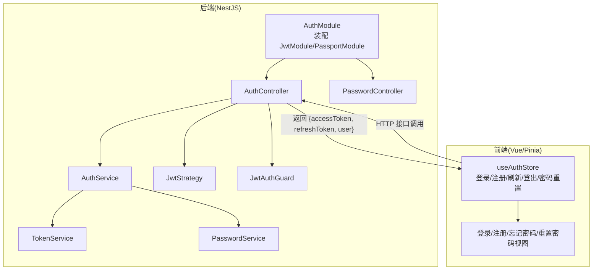
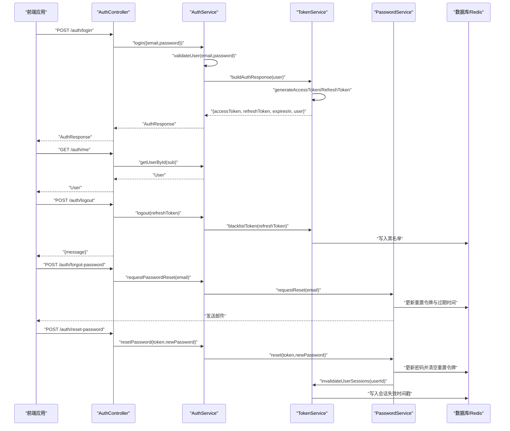
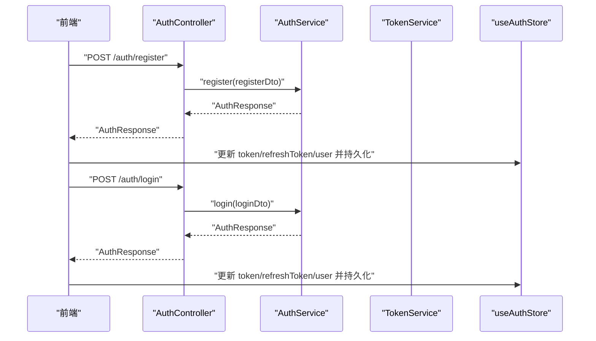
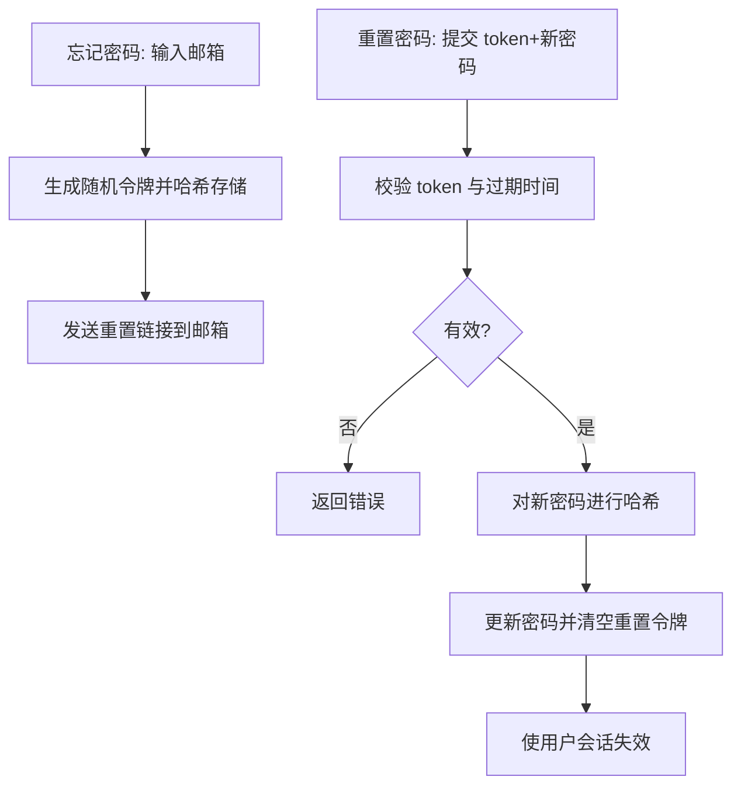
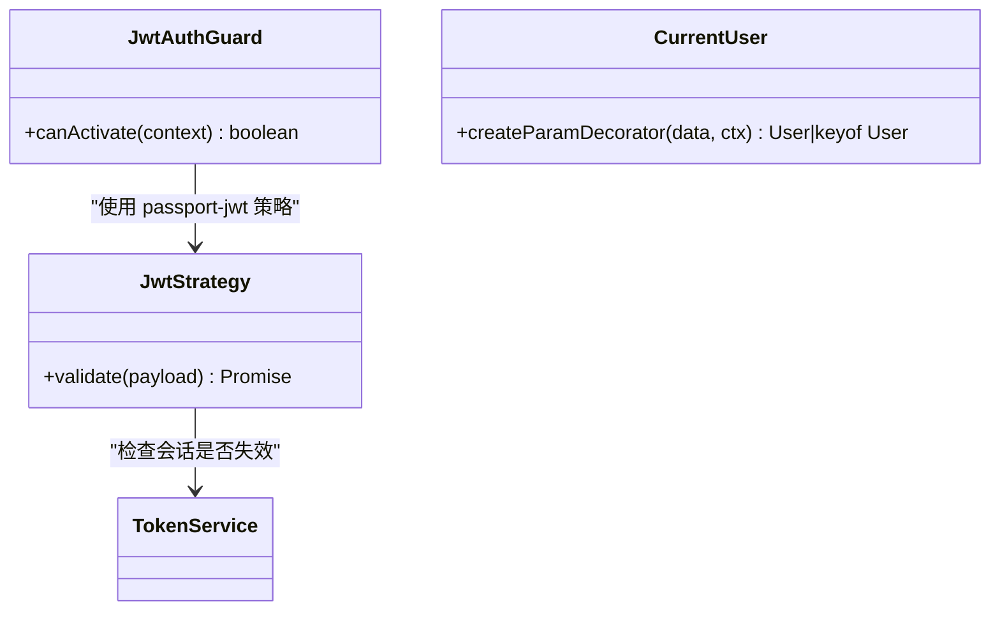
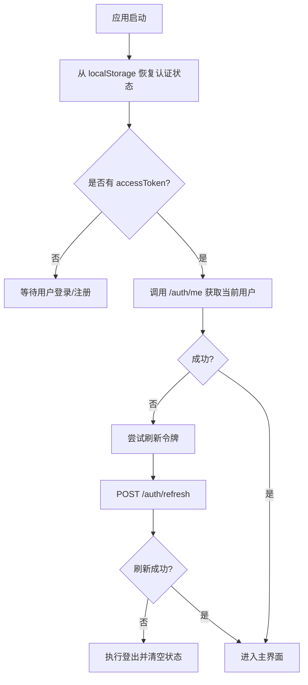
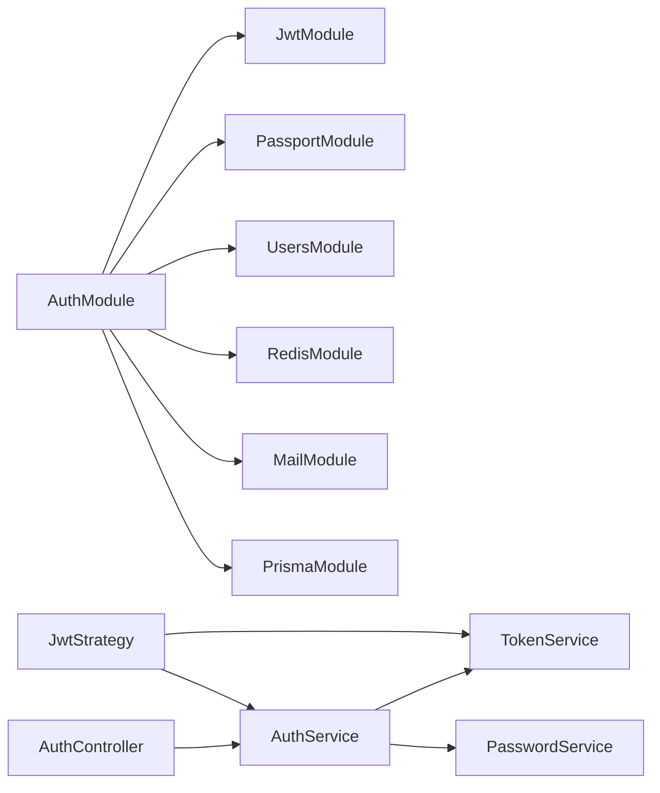

# 用户认证系统

<cite>
**本文引用的文件**
- [apps/backend/src/auth/auth.module.ts](file://apps/backend/src/auth/auth.module.ts)
- [apps/backend/src/auth/auth.controller.ts](file://apps/backend/src/auth/auth.controller.ts)
- [apps/backend/src/auth/auth.service.ts](file://apps/backend/src/auth/auth.service.ts)
- [apps/backend/src/auth/jwt-auth.guard.ts](file://apps/backend/src/auth/jwt-auth.guard.ts)
- [apps/backend/src/auth/jwt.strategy.ts](file://apps/backend/src/auth/jwt.strategy.ts)
- [apps/backend/src/auth/token.service.ts](file://apps/backend/src/auth/token.service.ts)
- [apps/backend/src/auth/password.service.ts](file://apps/backend/src/auth/password.service.ts)
- [apps/backend/src/auth/password.controller.ts](file://apps/backend/src/auth/password.controller.ts)
- [apps/backend/src/auth/auth.dto.ts](file://apps/backend/src/auth/auth.dto.ts)
- [apps/backend/src/auth/current-user.decorator.ts](file://apps/backend/src/auth/current-user.decorator.ts)
- [apps/frontend/src/features/auth/stores/auth.ts](file://apps/frontend/src/features/auth/stores/auth.ts)
- [apps/frontend/src/features/auth/views/LoginView.vue](file://apps/frontend/src/features/auth/views/LoginView.vue)
- [apps/frontend/src/features/auth/views/RegisterView.vue](file://apps/frontend/src/features/auth/views/RegisterView.vue)
- [apps/frontend/src/features/auth/views/ForgotPasswordView.vue](file://apps/frontend/src/features/auth/views/ForgotPasswordView.vue)
- [apps/frontend/src/features/auth/views/ResetPasswordView.vue](file://apps/frontend/src/features/auth/views/ResetPasswordView.vue)
</cite>

## 目录
1. [简介](#简介)
2. [项目结构](#项目结构)
3. [核心组件](#核心组件)
4. [架构总览](#架构总览)
5. [详细组件分析](#详细组件分析)
6. [依赖关系分析](#依赖关系分析)
7. [性能考量](#性能考量)
8. [故障排查指南](#故障排查指南)
9. [结论](#结论)
10. [附录：API 使用示例与最佳实践](#附录api-使用示例与最佳实践)

## 简介
本文件面向 Lumina Todo 的用户认证系统，系统采用基于 JWT 的双令牌方案（短期访问令牌 + 长期刷新令牌），结合后端 TokenService 的会话失效控制与前端 Pinia 状态管理的令牌轮转，形成完整的认证与会话生命周期。文档覆盖以下主题：
- JWT 认证流程与令牌刷新机制
- 用户注册、登录、登出与密码重置
- 安全性设计：密码加密、令牌黑名单、会话失效、速率限制
- 后端模块架构与前端状态管理
- 路由保护与守卫机制
- 权限控制集成与安全最佳实践

## 项目结构
认证相关代码主要分布在后端 NestJS 应用的 auth 模块与前端 Vue 应用的 auth 功能区：
- 后端
  - 模块装配：auth.module.ts
  - 控制器：auth.controller.ts、password.controller.ts
  - 服务：auth.service.ts、token.service.ts、password.service.ts
  - 策略与守卫：jwt.strategy.ts、jwt-auth.guard.ts
  - DTO：auth.dto.ts
  - 当前用户装饰器：current-user.decorator.ts
- 前端
  - 状态管理：features/auth/stores/auth.ts
  - 视图组件：LoginView.vue、RegisterView.vue、ForgotPasswordView.vue、ResetPasswordView.vue

图表来源
- [apps/backend/src/auth/auth.module.ts:19-39](file://apps/backend/src/auth/auth.module.ts#L19-L39)
- [apps/backend/src/auth/auth.controller.ts:16-80](file://apps/backend/src/auth/auth.controller.ts#L16-L80)
- [apps/backend/src/auth/auth.service.ts:13-21](file://apps/backend/src/auth/auth.service.ts#L13-L21)
- [apps/backend/src/auth/token.service.ts:16-45](file://apps/backend/src/auth/token.service.ts#L16-L45)
- [apps/backend/src/auth/password.service.ts:10-20](file://apps/backend/src/auth/password.service.ts#L10-L20)
- [apps/backend/src/auth/jwt.strategy.ts:20-36](file://apps/backend/src/auth/jwt.strategy.ts#L20-L36)
- [apps/backend/src/auth/jwt-auth.guard.ts:8-9](file://apps/backend/src/auth/jwt-auth.guard.ts#L8-L9)
- [apps/frontend/src/features/auth/stores/auth.ts:23-412](file://apps/frontend/src/features/auth/stores/auth.ts#L23-L412)

章节来源
- [apps/backend/src/auth/auth.module.ts:19-39](file://apps/backend/src/auth/auth.module.ts#L19-L39)
- [apps/frontend/src/features/auth/stores/auth.ts:23-412](file://apps/frontend/src/features/auth/stores/auth.ts#L23-L412)

## 核心组件
- 认证模块(AuthModule)
  - 负责装配 Passport/JWT、注入 Users/Redis/Mail/Prisma 模块，并导出 AuthService/TokenService/PasswordService 与 JwtModule/PassportModule。
- 认证控制器(AuthController)
  - 提供登录、注册、刷新、获取当前用户、登出等接口；对敏感接口启用节流与 JWT 守卫。
- 密码控制器(PasswordController)
  - 提供忘记密码与重置密码接口。
- 认证服务(AuthService)
  - 组合 TokenService 与 PasswordService，提供登录、注册、刷新、登出、密码重置入口。
- 令牌服务(TokenService)
  - 生成/校验访问令牌与刷新令牌；维护会话失效时间戳；将过期/作废令牌写入黑名单；构建认证响应。
- 密码服务(PasswordService)
  - 密码哈希与比对；生成带有效期的密码重置令牌；发送邮件；重置后使用户会话失效。
- JWT 策略(JwtStrategy)
  - 从请求头提取 Bearer 令牌，校验签名与类型(access)，并检查会话是否被用户级失效。
- JWT 守卫(JwtAuthGuard)
  - 基于 Passport 的 jwt 策略的认证守卫，用于路由保护。
- 当前用户装饰器(CurrentUser)
  - 从请求对象提取当前用户，支持按字段取值。
- 前端状态管理(useAuthStore)
  - 管理 token/refreshToken/user/错误与加载态；封装登录/注册/刷新/登出/密码重置；持久化与跨页面恢复。

章节来源
- [apps/backend/src/auth/auth.module.ts:19-39](file://apps/backend/src/auth/auth.module.ts#L19-L39)
- [apps/backend/src/auth/auth.controller.ts:16-80](file://apps/backend/src/auth/auth.controller.ts#L16-L80)
- [apps/backend/src/auth/password.controller.ts:12-37](file://apps/backend/src/auth/password.controller.ts#L12-L37)
- [apps/backend/src/auth/auth.service.ts:13-21](file://apps/backend/src/auth/auth.service.ts#L13-L21)
- [apps/backend/src/auth/token.service.ts:16-45](file://apps/backend/src/auth/token.service.ts#L16-L45)
- [apps/backend/src/auth/password.service.ts:10-20](file://apps/backend/src/auth/password.service.ts#L10-L20)
- [apps/backend/src/auth/jwt.strategy.ts:20-36](file://apps/backend/src/auth/jwt.strategy.ts#L20-L36)
- [apps/backend/src/auth/jwt-auth.guard.ts:8-9](file://apps/backend/src/auth/jwt-auth.guard.ts#L8-L9)
- [apps/backend/src/auth/current-user.decorator.ts:8-18](file://apps/backend/src/auth/current-user.decorator.ts#L8-L18)
- [apps/frontend/src/features/auth/stores/auth.ts:23-412](file://apps/frontend/src/features/auth/stores/auth.ts#L23-L412)

## 架构总览
下图展示了后端认证子系统与前端状态管理之间的交互关系，以及 JWT 策略如何参与请求认证。

图表来源
- [apps/backend/src/auth/auth.controller.ts:26-79](file://apps/backend/src/auth/auth.controller.ts#L26-L79)
- [apps/backend/src/auth/auth.service.ts:41-101](file://apps/backend/src/auth/auth.service.ts#L41-L101)
- [apps/backend/src/auth/token.service.ts:175-185](file://apps/backend/src/auth/token.service.ts#L175-L185)
- [apps/backend/src/auth/password.service.ts:39-89](file://apps/backend/src/auth/password.service.ts#L39-L89)
- [apps/frontend/src/features/auth/stores/auth.ts:148-372](file://apps/frontend/src/features/auth/stores/auth.ts#L148-L372)

## 详细组件分析

### JWT 认证流程与令牌刷新
- 登录
  - 前端提交邮箱与密码，后端通过 AuthService.validateUser 校验用户与密码。
  - 成功后由 TokenService 生成访问令牌与刷新令牌，并返回给前端。
- 访问令牌校验
  - JwtStrategy 从 Authorization 头解析 Bearer 令牌，校验签名与类型(access)，并检查用户会话是否被失效。
- 刷新令牌
  - 前端使用刷新令牌向后端请求新的访问令牌；后端先检查刷新令牌是否在黑名单且类型正确，再验证用户是否存在与会话未失效，最后重新签发新令牌。
- 登出
  - 前端提交刷新令牌，后端将其加入黑名单，同时前端清除本地存储与请求头中的令牌。

图表来源
- [apps/backend/src/auth/auth.service.ts:41-93](file://apps/backend/src/auth/auth.service.ts#L41-L93)
- [apps/backend/src/auth/token.service.ts:175-185](file://apps/backend/src/auth/token.service.ts#L175-L185)
- [apps/backend/src/auth/jwt.strategy.ts:41-66](file://apps/backend/src/auth/jwt.strategy.ts#L41-L66)
- [apps/frontend/src/features/auth/stores/auth.ts:296-341](file://apps/frontend/src/features/auth/stores/auth.ts#L296-L341)

章节来源
- [apps/backend/src/auth/auth.service.ts:41-93](file://apps/backend/src/auth/auth.service.ts#L41-L93)
- [apps/backend/src/auth/token.service.ts:175-185](file://apps/backend/src/auth/token.service.ts#L175-L185)
- [apps/backend/src/auth/jwt.strategy.ts:41-66](file://apps/backend/src/auth/jwt.strategy.ts#L41-L66)
- [apps/frontend/src/features/auth/stores/auth.ts:296-341](file://apps/frontend/src/features/auth/stores/auth.ts#L296-L341)

### 用户注册与登录机制
- 注册
  - 前端提交注册表单，后端通过 AuthService.register 创建用户并返回认证响应。
- 登录
  - 前端提交登录表单，后端通过 AuthService.login 返回认证响应。
- 前端状态
  - useAuthStore.login/register 将返回的 accessToken/refreshToken/user 写入状态并持久化，随后触发数据合并与迁移。

图表来源
- [apps/backend/src/auth/auth.controller.ts:33-38](file://apps/backend/src/auth/auth.controller.ts#L33-L38)
- [apps/backend/src/auth/auth.controller.ts:23-28](file://apps/backend/src/auth/auth.controller.ts#L23-L28)
- [apps/backend/src/auth/auth.service.ts:51-54](file://apps/backend/src/auth/auth.service.ts#L51-L54)
- [apps/frontend/src/features/auth/stores/auth.ts:148-212](file://apps/frontend/src/features/auth/stores/auth.ts#L148-L212)

章节来源
- [apps/backend/src/auth/auth.controller.ts:23-38](file://apps/backend/src/auth/auth.controller.ts#L23-L38)
- [apps/backend/src/auth/auth.service.ts:51-54](file://apps/backend/src/auth/auth.service.ts#L51-L54)
- [apps/frontend/src/features/auth/stores/auth.ts:148-212](file://apps/frontend/src/features/auth/stores/auth.ts#L148-L212)

### 密码安全管理
- 密码加密
  - PasswordService 使用 bcrypt 对密码进行哈希；compare 用于登录时比对。
- 密码重置
  - requestReset 生成随机令牌并以哈希形式存入数据库，设置过期时间，发送重置链接。
  - reset 校验令牌与过期时间，成功后更新密码并调用 TokenService.invalidateUserSessions 使该用户的会话全部失效。
- 安全特性
  - 防枚举：不存在用户时也返回成功，避免泄露邮箱是否存在。
  - 令牌有效期：通过配置项控制访问/刷新令牌过期时间。
  - 会话失效：invalidateUserSessions 将用户会话失效时间写入 Redis，策略与服务端均会校验。

图表来源
- [apps/backend/src/auth/password.service.ts:39-89](file://apps/backend/src/auth/password.service.ts#L39-L89)
- [apps/backend/src/auth/token.service.ts:47-76](file://apps/backend/src/auth/token.service.ts#L47-L76)

章节来源
- [apps/backend/src/auth/password.service.ts:25-89](file://apps/backend/src/auth/password.service.ts#L25-L89)
- [apps/backend/src/auth/token.service.ts:47-76](file://apps/backend/src/auth/token.service.ts#L47-L76)

### 认证守卫与路由保护
- JwtAuthGuard
  - 基于 Passport 的 jwt 策略，用于保护需要认证的路由。
- JwtStrategy
  - 从 Authorization 头提取 Bearer 令牌，校验签名与类型(access)，并检查会话是否被用户级失效。
- CurrentUser 装饰器
  - 从请求对象提取当前用户，支持按字段取值，便于在控制器中直接注入用户信息。

图表来源
- [apps/backend/src/auth/jwt-auth.guard.ts:8-9](file://apps/backend/src/auth/jwt-auth.guard.ts#L8-L9)
- [apps/backend/src/auth/jwt.strategy.ts:41-66](file://apps/backend/src/auth/jwt.strategy.ts#L41-L66)
- [apps/backend/src/auth/current-user.decorator.ts:8-18](file://apps/backend/src/auth/current-user.decorator.ts#L8-L18)

章节来源
- [apps/backend/src/auth/jwt-auth.guard.ts:8-9](file://apps/backend/src/auth/jwt-auth.guard.ts#L8-L9)
- [apps/backend/src/auth/jwt.strategy.ts:41-66](file://apps/backend/src/auth/jwt.strategy.ts#L41-L66)
- [apps/backend/src/auth/current-user.decorator.ts:8-18](file://apps/backend/src/auth/current-user.decorator.ts#L8-L18)

### 前端状态管理与令牌轮转
- useAuthStore
  - 管理 token/refreshToken/user/错误与加载态；封装登录/注册/刷新/登出/密码重置。
  - 支持持久化到 localStorage，并在 Hydrate 时恢复状态。
  - 刷新访问令牌时具备重试与瞬时错误处理；登出时清理本地状态并尝试后端注销。
- 视图组件
  - LoginView、RegisterView、ForgotPasswordView、ResetPasswordView 分别承载登录、注册、忘记密码、重置密码的 UI 与校验逻辑。

图表来源
- [apps/frontend/src/features/auth/stores/auth.ts:112-143](file://apps/frontend/src/features/auth/stores/auth.ts#L112-L143)
- [apps/frontend/src/features/auth/stores/auth.ts:276-291](file://apps/frontend/src/features/auth/stores/auth.ts#L276-L291)
- [apps/frontend/src/features/auth/stores/auth.ts:296-341](file://apps/frontend/src/features/auth/stores/auth.ts#L296-L341)
- [apps/frontend/src/features/auth/stores/auth.ts:346-372](file://apps/frontend/src/features/auth/stores/auth.ts#L346-L372)

章节来源
- [apps/frontend/src/features/auth/stores/auth.ts:112-143](file://apps/frontend/src/features/auth/stores/auth.ts#L112-L143)
- [apps/frontend/src/features/auth/stores/auth.ts:276-291](file://apps/frontend/src/features/auth/stores/auth.ts#L276-L291)
- [apps/frontend/src/features/auth/stores/auth.ts:296-341](file://apps/frontend/src/features/auth/stores/auth.ts#L296-L341)
- [apps/frontend/src/features/auth/stores/auth.ts:346-372](file://apps/frontend/src/features/auth/stores/auth.ts#L346-L372)

## 依赖关系分析
- 后端模块耦合
  - AuthModule 导入 JwtModule/PassportModule，并注入 Users/Redis/Mail/Prisma 模块，提供 AuthService/TokenService/PasswordService。
  - AuthController 依赖 AuthService；AuthService 依赖 UsersService/TokenService/PasswordService。
  - JwtStrategy 依赖 ConfigService/TokenService/AuthService。
- 前端依赖
  - useAuthStore 依赖 authApi（封装 HTTP 调用）与共享类型；在登录/注册后触发数据合并与 AI 迁移。

图表来源
- [apps/backend/src/auth/auth.module.ts:19-39](file://apps/backend/src/auth/auth.module.ts#L19-L39)
- [apps/backend/src/auth/auth.controller.ts:18](file://apps/backend/src/auth/auth.controller.ts#L18-L18)
- [apps/backend/src/auth/auth.service.ts:14-21](file://apps/backend/src/auth/auth.service.ts#L14-L21)
- [apps/backend/src/auth/jwt.strategy.ts:21-25](file://apps/backend/src/auth/jwt.strategy.ts#L21-L25)

章节来源
- [apps/backend/src/auth/auth.module.ts:19-39](file://apps/backend/src/auth/auth.module.ts#L19-L39)
- [apps/backend/src/auth/auth.controller.ts:18](file://apps/backend/src/auth/auth.controller.ts#L18-L18)
- [apps/backend/src/auth/auth.service.ts:14-21](file://apps/backend/src/auth/auth.service.ts#L14-L21)
- [apps/backend/src/auth/jwt.strategy.ts:21-25](file://apps/backend/src/auth/jwt.strategy.ts#L21-L25)

## 性能考量
- 令牌过期时间
  - 访问令牌过期时间短，降低泄露风险；刷新令牌过期时间长，减少频繁登录。
- 会话失效
  - 通过 Redis 存储用户会话失效时间戳，策略与服务端双重校验，避免旧令牌继续生效。
- 黑名单
  - 登出时将刷新令牌写入黑名单，延长令牌作废时间窗口，提升安全性。
- 速率限制
  - 登录/注册/刷新/忘记密码接口均配置节流，防止暴力破解与滥用。
- 前端重试
  - 刷新令牌具备有限重试与瞬时错误退避，提升弱网环境下的可用性。

## 故障排查指南
- 常见错误与定位
  - 401 未授权
    - 可能原因：访问令牌类型非 access、令牌过期、用户不存在、会话被失效。
    - 建议：检查 JwtStrategy 校验逻辑与 TokenService 会话失效判断。
  - 400 参数错误
    - 可能原因：刷新令牌无效或已过期、忘记密码/重置密码令牌无效。
    - 建议：确认令牌来源与过期时间，检查数据库中重置令牌字段。
  - 登出后仍可访问
    - 可能原因：前端未清除本地 token 或后端未将刷新令牌加入黑名单。
    - 建议：确认登出流程与 TokenService.blacklistToken 是否执行。
- 前端问题
  - 登录后无法进入主界面
    - 可能原因：/auth/me 失败导致刷新令牌流程中断。
    - 建议：查看 useAuthStore.fetchCurrentUser 与 refreshAccessToken 的错误分支。
  - 刷新令牌失败
    - 可能原因：网络瞬时错误或后端异常。
    - 建议：利用内置重试与日志上报，确认后端日志与 Redis 状态。

章节来源
- [apps/backend/src/auth/jwt.strategy.ts:41-66](file://apps/backend/src/auth/jwt.strategy.ts#L41-L66)
- [apps/backend/src/auth/token.service.ts:166-170](file://apps/backend/src/auth/token.service.ts#L166-L170)
- [apps/frontend/src/features/auth/stores/auth.ts:276-341](file://apps/frontend/src/features/auth/stores/auth.ts#L276-L341)

## 结论
Lumina Todo 的认证系统通过“短期访问令牌 + 长期刷新令牌”的双令牌模型，配合会话失效与黑名单机制，在保证安全性的同时兼顾了用户体验。后端以 NestJS 的 Passport/JWT 为核心，前端以 Pinia 管理状态并实现稳健的令牌轮转与错误处理。整体架构清晰、职责分离明确，适合在生产环境中部署与扩展。

## 附录：API 使用示例与最佳实践

### API 使用示例
- 登录
  - 请求: POST /auth/login
  - 请求体: 邮箱与密码
  - 响应: { accessToken, refreshToken, expiresIn, user }
- 注册
  - 请求: POST /auth/register
  - 请求体: 邮箱、姓名、密码
  - 响应: { accessToken, refreshToken, expiresIn, user }
- 获取当前用户
  - 请求: GET /auth/me
  - 头部: Authorization: Bearer <accessToken>
  - 响应: 当前用户信息
- 刷新访问令牌
  - 请求: POST /auth/refresh
  - 请求体: { refreshToken }
  - 响应: { accessToken, refreshToken, expiresIn, user }
- 登出
  - 请求: POST /auth/logout
  - 请求体: { refreshToken }
  - 响应: { message }
- 忘记密码
  - 请求: POST /auth/forgot-password
  - 请求体: { email }
  - 响应: { message }
- 重置密码
  - 请求: POST /auth/reset-password
  - 请求体: { token, password }
  - 响应: { message }

章节来源
- [apps/backend/src/auth/auth.controller.ts:23-79](file://apps/backend/src/auth/auth.controller.ts#L23-L79)
- [apps/backend/src/auth/password.controller.ts:19-36](file://apps/backend/src/auth/password.controller.ts#L19-L36)

### 最佳实践与安全建议
- 环境变量
  - 必须配置 JWT_SECRET；生产环境建议额外配置 JWT_REFRESH_SECRET。
- 速率限制
  - 已对登录/注册/刷新/忘记密码接口启用节流，避免暴力破解。
- 传输安全
  - 建议在生产环境强制 HTTPS，避免令牌在传输过程中被窃取。
- 令牌存储
  - 前端使用 localStorage 持久化 token，建议在移动端或高风险环境下考虑更安全的存储方案。
- 会话安全
  - 修改密码或执行高危操作后，调用使会话失效接口，确保旧令牌立即失效。
- 前端错误处理
  - 对 401 与瞬时错误进行区分处理，必要时引导用户重新登录或稍后重试。