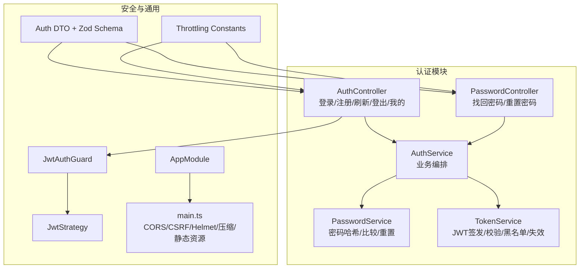
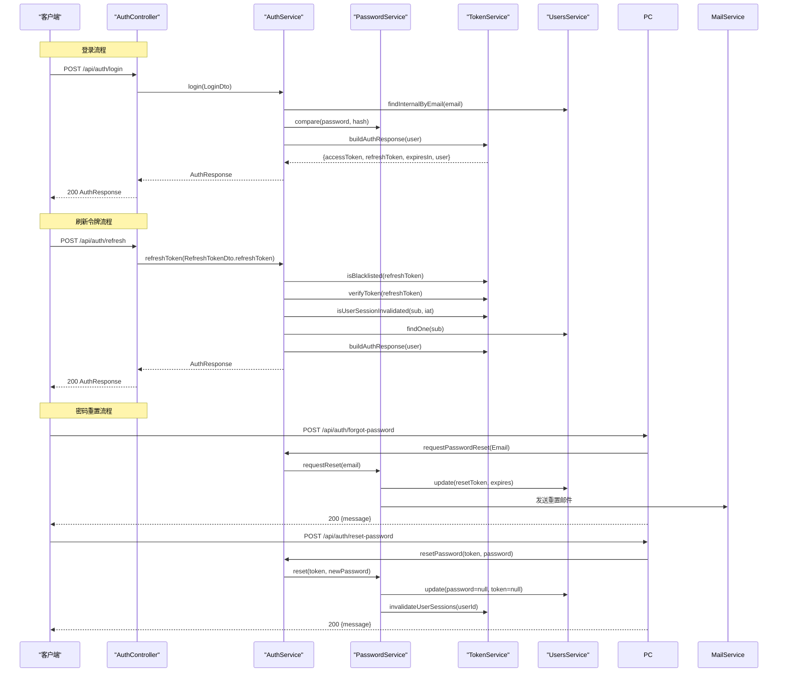
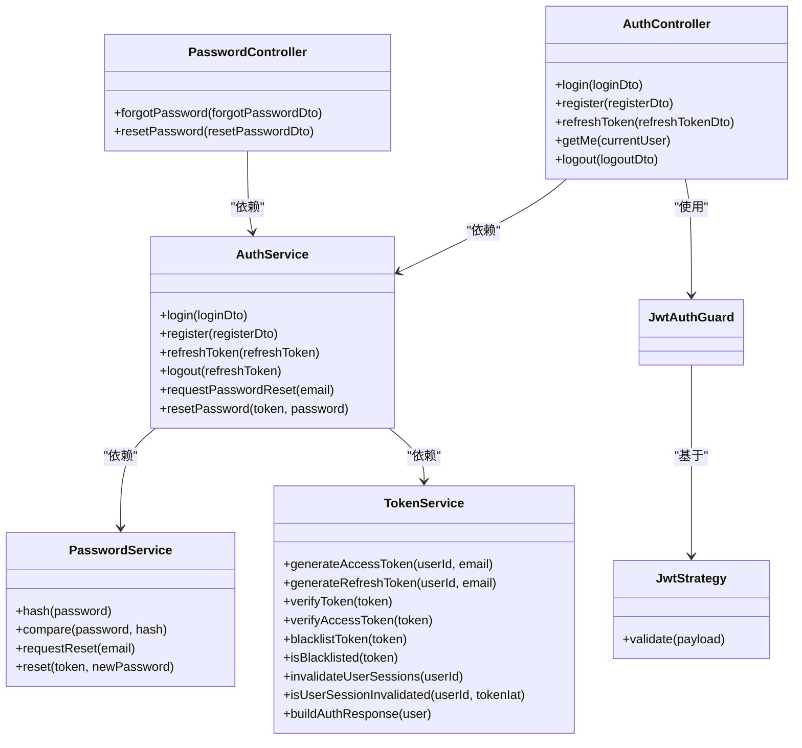

# 认证API接口

<cite>
**本文引用的文件**
- [apps/backend/src/auth/auth.controller.ts](file://apps/backend/src/auth/auth.controller.ts)
- [apps/backend/src/auth/password.controller.ts](file://apps/backend/src/auth/password.controller.ts)
- [apps/backend/src/auth/auth.service.ts](file://apps/backend/src/auth/auth.service.ts)
- [apps/backend/src/auth/password.service.ts](file://apps/backend/src/auth/password.service.ts)
- [apps/backend/src/auth/token.service.ts](file://apps/backend/src/auth/token.service.ts)
- [apps/backend/src/auth/auth.dto.ts](file://apps/backend/src/auth/auth.dto.ts)
- [packages/shared/src/schemas/auth.schema.ts](file://packages/shared/src/schemas/auth.schema.ts)
- [apps/backend/src/common/throttling/throttling.constants.ts](file://apps/backend/src/common/throttling/throttling.constants.ts)
- [apps/backend/src/auth/jwt-auth.guard.ts](file://apps/backend/src/auth/jwt-auth.guard.ts)
- [apps/backend/src/auth/jwt.strategy.ts](file://apps/backend/src/auth/jwt.strategy.ts)
- [apps/backend/src/auth/current-user.decorator.ts](file://apps/backend/src/auth/current-user.decorator.ts)
- [apps/backend/src/app.module.ts](file://apps/backend/src/app.module.ts)
- [apps/backend/src/main.ts](file://apps/backend/src/main.ts)
</cite>

## 目录

1. [简介](#简介)
2. [项目结构](#项目结构)
3. [核心组件](#核心组件)
4. [架构总览](#架构总览)
5. [详细组件分析](#详细组件分析)
6. [依赖关系分析](#依赖关系分析)
7. [性能考量](#性能考量)
8. [故障排除指南](#故障排除指南)
9. [结论](#结论)
10. [附录](#附录)

## 简介

本文件为认证API接口的完整技术文档，覆盖登录、注册、刷新令牌、登出、找回密码、重置密码等全部认证相关HTTP端点。文档详细说明请求参数、响应格式、状态码含义、错误处理方案，并深入解释登录流程实现细节、注册数据验证规则、密码重置安全机制。同时提供基于Swagger的接口规范要点、参数校验规则、认证要求说明，以及版本控制策略、速率限制机制、CORS配置、安全性考虑、防暴力破解措施、日志记录策略和客户端集成指南。

## 项目结构

认证相关代码主要位于后端应用的认证模块与共享包中，采用按功能分层组织：

- 控制器层：暴露REST端点，负责请求接收与响应封装
- 服务层：业务编排，整合用户、令牌、密码服务
- 策略与守卫：JWT认证与授权
- DTO与Schema：请求参数校验与Swagger文档生成
- 限流与安全：全局速率限制、CORS、CSRF防护、Helmet安全头
- 共享Schema：跨模块复用的输入输出Schema

图表来源

- [apps/backend/src/auth/auth.controller.ts:15-80](file://apps/backend/src/auth/auth.controller.ts#L15-L80)
- [apps/backend/src/auth/password.controller.ts:11-37](file://apps/backend/src/auth/password.controller.ts#L11-L37)
- [apps/backend/src/auth/auth.service.ts:12-126](file://apps/backend/src/auth/auth.service.ts#L12-L126)
- [apps/backend/src/auth/password.service.ts:9-99](file://apps/backend/src/auth/password.service.ts#L9-L99)
- [apps/backend/src/auth/token.service.ts:15-186](file://apps/backend/src/auth/token.service.ts#L15-L186)
- [apps/backend/src/auth/jwt-auth.guard.ts:8-9](file://apps/backend/src/auth/jwt-auth.guard.ts#L8-L9)
- [apps/backend/src/auth/jwt.strategy.ts:19-67](file://apps/backend/src/auth/jwt.strategy.ts#L19-L67)
- [apps/backend/src/auth/auth.dto.ts:1-41](file://apps/backend/src/auth/auth.dto.ts#L1-L41)
- [apps/backend/src/common/throttling/throttling.constants.ts:90-118](file://apps/backend/src/common/throttling/throttling.constants.ts#L90-L118)
- [apps/backend/src/app.module.ts:155-159](file://apps/backend/src/app.module.ts#L155-L159)
- [apps/backend/src/main.ts:48-167](file://apps/backend/src/main.ts#L48-L167)

章节来源

- [apps/backend/src/auth/auth.controller.ts:15-80](file://apps/backend/src/auth/auth.controller.ts#L15-L80)
- [apps/backend/src/auth/password.controller.ts:11-37](file://apps/backend/src/auth/password.controller.ts#L11-L37)
- [apps/backend/src/auth/auth.service.ts:12-126](file://apps/backend/src/auth/auth.service.ts#L12-L126)
- [apps/backend/src/auth/password.service.ts:9-99](file://apps/backend/src/auth/password.service.ts#L9-L99)
- [apps/backend/src/auth/token.service.ts:15-186](file://apps/backend/src/auth/token.service.ts#L15-L186)
- [apps/backend/src/auth/jwt-auth.guard.ts:8-9](file://apps/backend/src/auth/jwt-auth.guard.ts#L8-L9)
- [apps/backend/src/auth/jwt.strategy.ts:19-67](file://apps/backend/src/auth/jwt.strategy.ts#L19-L67)
- [apps/backend/src/auth/auth.dto.ts:1-41](file://apps/backend/src/auth/auth.dto.ts#L1-L41)
- [apps/backend/src/common/throttling/throttling.constants.ts:90-118](file://apps/backend/src/common/throttling/throttling.constants.ts#L90-L118)
- [apps/backend/src/app.module.ts:155-159](file://apps/backend/src/app.module.ts#L155-L159)
- [apps/backend/src/main.ts:48-167](file://apps/backend/src/main.ts#L48-L167)

## 核心组件

- 认证控制器：提供登录、注册、刷新、登出、获取当前用户信息等端点
- 密码控制器：提供找回密码、重置密码端点
- 认证服务：整合用户、令牌、密码服务，提供统一认证入口
- 密码服务：密码哈希、比较、重置令牌生成与校验
- 令牌服务：JWT签发、校验、黑名单、会话失效标记
- JWT守卫与策略：基于Bearer Token的访问令牌验证
- DTO与Schema：Zod校验与Swagger文档生成
- 限流常量：认证相关端点的速率限制策略
- 安全与通用：CORS、CSRF防护、Helmet、压缩、静态资源、全局拦截器与过滤器

章节来源

- [apps/backend/src/auth/auth.controller.ts:15-80](file://apps/backend/src/auth/auth.controller.ts#L15-L80)
- [apps/backend/src/auth/password.controller.ts:11-37](file://apps/backend/src/auth/password.controller.ts#L11-L37)
- [apps/backend/src/auth/auth.service.ts:12-126](file://apps/backend/src/auth/auth.service.ts#L12-L126)
- [apps/backend/src/auth/password.service.ts:9-99](file://apps/backend/src/auth/password.service.ts#L9-L99)
- [apps/backend/src/auth/token.service.ts:15-186](file://apps/backend/src/auth/token.service.ts#L15-L186)
- [apps/backend/src/auth/jwt-auth.guard.ts:8-9](file://apps/backend/src/auth/jwt-auth.guard.ts#L8-L9)
- [apps/backend/src/auth/jwt.strategy.ts:19-67](file://apps/backend/src/auth/jwt.strategy.ts#L19-L67)
- [apps/backend/src/auth/auth.dto.ts:1-41](file://apps/backend/src/auth/auth.dto.ts#L1-L41)
- [apps/backend/src/common/throttling/throttling.constants.ts:90-118](file://apps/backend/src/common/throttling/throttling.constants.ts#L90-L118)
- [apps/backend/src/main.ts:48-167](file://apps/backend/src/main.ts#L48-L167)

## 架构总览

认证系统采用“控制器-服务-策略/守卫-令牌/密码服务”的分层设计，配合Zod进行请求参数校验，通过NestJS内置的全局拦截器与异常过滤器统一响应格式与错误处理。安全方面通过Helmet设置安全头、CSRF防护钩子、CORS配置、Gzip压缩、静态资源托管与Redis限流实现。

图表来源

- [apps/backend/src/auth/auth.controller.ts:23-48](file://apps/backend/src/auth/auth.controller.ts#L23-L48)
- [apps/backend/src/auth/password.controller.ts:19-36](file://apps/backend/src/auth/password.controller.ts#L19-L36)
- [apps/backend/src/auth/auth.service.ts:41-93](file://apps/backend/src/auth/auth.service.ts#L41-L93)
- [apps/backend/src/auth/password.service.ts:39-89](file://apps/backend/src/auth/password.service.ts#L39-L89)
- [apps/backend/src/auth/token.service.ts:175-185](file://apps/backend/src/auth/token.service.ts#L175-L185)

章节来源

- [apps/backend/src/auth/auth.controller.ts:23-48](file://apps/backend/src/auth/auth.controller.ts#L23-L48)
- [apps/backend/src/auth/password.controller.ts:19-36](file://apps/backend/src/auth/password.controller.ts#L19-L36)
- [apps/backend/src/auth/auth.service.ts:41-93](file://apps/backend/src/auth/auth.service.ts#L41-L93)
- [apps/backend/src/auth/password.service.ts:39-89](file://apps/backend/src/auth/password.service.ts#L39-L89)
- [apps/backend/src/auth/token.service.ts:175-185](file://apps/backend/src/auth/token.service.ts#L175-L185)

## 详细组件分析

### 认证控制器（AuthController）

- 路径前缀：/api/auth
- 端点列表与行为
  - POST /api/auth/login
    - 请求体：LoginDto（邮箱、密码）
    - 响应：AuthResponse（accessToken、refreshToken、expiresIn、user）
    - 限流：AUTH_LOGIN_THROTTLE
    - 安全：Zod校验、速率限制、CSRF防护
  - POST /api/auth/register
    - 请求体：RegisterDto（邮箱、姓名、密码）
    - 响应：AuthResponse
    - 限流：AUTH_REGISTER_THROTTLE
    - 安全：Zod校验、速率限制
  - POST /api/auth/refresh
    - 请求体：RefreshTokenDto（refreshToken）
    - 响应：AuthResponse
    - 限流：AUTH_REFRESH_THROTTLE
    - 安全：令牌黑名单检查、会话失效检查、Zod校验
  - GET /api/auth/me
    - 认证：Bearer Token（JwtAuthGuard）
    - 响应：User
  - POST /api/auth/logout
    - 认证：Bearer Token（JwtAuthGuard）
    - 请求体：LogoutDto（refreshToken）
    - 响应：{message}
    - 安全：清空Cookie（accessToken、refreshToken）

- 请求示例（路径参考）
  - 登录：[apps/backend/src/auth/auth.controller.ts:23-28](file://apps/backend/src/auth/auth.controller.ts#L23-L28)
  - 注册：[apps/backend/src/auth/auth.controller.ts:33-38](file://apps/backend/src/auth/auth.controller.ts#L33-L38)
  - 刷新：[apps/backend/src/auth/auth.controller.ts:43-48](file://apps/backend/src/auth/auth.controller.ts#L43-L48)
  - 我的：[apps/backend/src/auth/auth.controller.ts:53-59](file://apps/backend/src/auth/auth.controller.ts#L53-L59)
  - 登出：[apps/backend/src/auth/auth.controller.ts:64-79](file://apps/backend/src/auth/auth.controller.ts#L64-L79)

- 响应示例（路径参考）
  - 登录/注册/刷新返回：[apps/backend/src/auth/token.service.ts:175-185](file://apps/backend/src/auth/token.service.ts#L175-L185)
  - 登出返回：[apps/backend/src/auth/auth.controller.ts:71-79](file://apps/backend/src/auth/auth.controller.ts#L71-L79)

- 状态码与错误处理
  - 200 成功；400 参数无效；401 未授权（凭据无效、令牌无效、用户不存在）；429 速率超限
  - 403 CSRF校验失败（缺失X-Requested-With）
  - 429 速率限制触发（见“性能考量”）

章节来源

- [apps/backend/src/auth/auth.controller.ts:15-80](file://apps/backend/src/auth/auth.controller.ts#L15-L80)
- [apps/backend/src/common/throttling/throttling.constants.ts:90-106](file://apps/backend/src/common/throttling/throttling.constants.ts#L90-L106)
- [apps/backend/src/main.ts:133-167](file://apps/backend/src/main.ts#L133-L167)

### 密码控制器（PasswordController）

- 路径前缀：/api/auth
- 端点列表与行为
  - POST /api/auth/forgot-password
    - 请求体：ForgotPasswordDto（邮箱）
    - 响应：{message}
    - 限流：PASSWORD_FORGOT_THROTTLE
    - 安全：防枚举攻击（无论用户是否存在均返回一致响应）
  - POST /api/auth/reset-password
    - 请求体：ResetPasswordDto（token、password）
    - 响应：{message}
    - 限流：PASSWORD_RESET_THROTTLE
    - 安全：令牌哈希存储、过期检查、重置后使用户会话失效

- 请求示例（路径参考）
  - 找回密码：[apps/backend/src/auth/password.controller.ts:19-25](file://apps/backend/src/auth/password.controller.ts#L19-L25)
  - 重置密码：[apps/backend/src/auth/password.controller.ts:30-36](file://apps/backend/src/auth/password.controller.ts#L30-L36)

- 响应示例（路径参考）
  - 找回密码：[apps/backend/src/auth/password.controller.ts:22-25](file://apps/backend/src/auth/password.controller.ts#L22-L25)
  - 重置密码：[apps/backend/src/auth/password.controller.ts:33-36](file://apps/backend/src/auth/password.controller.ts#L33-L36)

章节来源

- [apps/backend/src/auth/password.controller.ts:11-37](file://apps/backend/src/auth/password.controller.ts#L11-L37)
- [apps/backend/src/common/throttling/throttling.constants.ts:108-118](file://apps/backend/src/common/throttling/throttling.constants.ts#L108-L118)

### 认证服务（AuthService）

- 职责
  - 用户验证（邮箱+密码）
  - 统一认证响应构建（AccessToken/RefreshToken）
  - 刷新令牌流程（黑名单、类型校验、会话失效检查、用户存在性检查）
  - 密码重置流程委托
- 关键流程
  - 登录：校验用户与密码，构建认证响应
  - 注册：创建用户并构建认证响应
  - 刷新：黑名单检查、令牌类型与过期校验、会话失效检查、用户存在性检查
  - 登出：将刷新令牌加入黑名单（忽略失败）
  - 密码重置：委托PasswordService执行

章节来源

- [apps/backend/src/auth/auth.service.ts:12-126](file://apps/backend/src/auth/auth.service.ts#L12-L126)

### 密码服务（PasswordService）

- 职责
  - 密码哈希与比较
  - 重置令牌生成（明文token与哈希token）
  - 找回密码：更新用户重置令牌与过期时间，发送邮件
  - 重置密码：校验令牌与过期时间，更新密码并使会话失效
- 安全机制
  - 防枚举攻击：找不到用户时不暴露差异
  - 令牌哈希存储：数据库仅保存哈希值
  - 过期时间控制：默认1小时
  - 重置后调用令牌服务使会话失效

章节来源

- [apps/backend/src/auth/password.service.ts:9-99](file://apps/backend/src/auth/password.service.ts#L9-L99)

### 令牌服务（TokenService）

- 职责
  - AccessToken/RefreshToken签发（不同密钥与过期时间）
  - 令牌验证（区分访问/刷新令牌）
  - 黑名单维护（基于Redis，TTL为剩余有效期）
  - 会话失效标记（按用户维度写入失效时间戳）
  - 构建认证响应（包含user与expiresIn）
- 安全机制
  - 访问令牌短期有效，刷新令牌长期有效
  - 生产环境强制配置JWT_REFRESH_SECRET
  - 刷新令牌过期后自动失效
  - 会话失效检查：若令牌签发时间早于用户会话失效时间戳则视为无效

章节来源

- [apps/backend/src/auth/token.service.ts:15-186](file://apps/backend/src/auth/token.service.ts#L15-L186)

### JWT守卫与策略

- JwtAuthGuard：基于Bearer Token的访问令牌验证
- JwtStrategy：验证payload类型为access、用户存在且未被会话失效、解析sub为正整数
- 配合TokenService进行会话失效检查

章节来源

- [apps/backend/src/auth/jwt-auth.guard.ts:8-9](file://apps/backend/src/auth/jwt-auth.guard.ts#L8-L9)
- [apps/backend/src/auth/jwt.strategy.ts:19-67](file://apps/backend/src/auth/jwt.strategy.ts#L19-L67)
- [apps/backend/src/auth/token.service.ts:55-76](file://apps/backend/src/auth/token.service.ts#L55-L76)

### DTO与Schema

- LoginDto/ RegisterDto/ RefreshTokenDto/ LogoutDto/ ForgotPasswordDto/ ResetPasswordDto
- 基于Zod Schema，自动生成Swagger文档
- 共享Schema定义了邮箱、密码、用户信息、认证响应、刷新/登出/找回/重置等Schema

章节来源

- [apps/backend/src/auth/auth.dto.ts:1-41](file://apps/backend/src/auth/auth.dto.ts#L1-L41)
- [packages/shared/src/schemas/auth.schema.ts:24-121](file://packages/shared/src/schemas/auth.schema.ts#L24-L121)

### 速率限制与安全

- 速率限制策略（短/中/长窗口）
  - 登录：AUTH_LOGIN_THROTTLE
  - 注册：AUTH_REGISTER_THROTTLE
  - 刷新：AUTH_REFRESH_THROTTLE
  - 找回密码：PASSWORD_FORGOT_THROTTLE
  - 重置密码：PASSWORD_RESET_THROTTLE
- 全局限流：基于Redis的ThrottlerModule，支持动态配置窗口与阈值
- CSRF防护：缺失X-Requested-With头部时拒绝非安全请求
- CORS：可配置origin白名单，支持凭证与多方法/多头
- Helmet：内容安全策略、跨站脚本防护、点击劫持防护等
- 压缩：Gzip压缩开启
- 静态资源：/api/public/与/old/public/路径托管

章节来源

- [apps/backend/src/common/throttling/throttling.constants.ts:90-118](file://apps/backend/src/common/throttling/throttling.constants.ts#L90-L118)
- [apps/backend/src/app.module.ts:117-123](file://apps/backend/src/app.module.ts#L117-L123)
- [apps/backend/src/main.ts:48-167](file://apps/backend/src/main.ts#L48-L167)

## 依赖关系分析

图表来源

- [apps/backend/src/auth/auth.controller.ts:17-80](file://apps/backend/src/auth/auth.controller.ts#L17-L80)
- [apps/backend/src/auth/password.controller.ts:13-37](file://apps/backend/src/auth/password.controller.ts#L13-L37)
- [apps/backend/src/auth/auth.service.ts:14-126](file://apps/backend/src/auth/auth.service.ts#L14-L126)
- [apps/backend/src/auth/password.service.ts:11-99](file://apps/backend/src/auth/password.service.ts#L11-L99)
- [apps/backend/src/auth/token.service.ts:17-186](file://apps/backend/src/auth/token.service.ts#L17-L186)
- [apps/backend/src/auth/jwt-auth.guard.ts:8-9](file://apps/backend/src/auth/jwt-auth.guard.ts#L8-L9)
- [apps/backend/src/auth/jwt.strategy.ts:21-67](file://apps/backend/src/auth/jwt.strategy.ts#L21-L67)

章节来源

- [apps/backend/src/auth/auth.controller.ts:17-80](file://apps/backend/src/auth/auth.controller.ts#L17-L80)
- [apps/backend/src/auth/password.controller.ts:13-37](file://apps/backend/src/auth/password.controller.ts#L13-L37)
- [apps/backend/src/auth/auth.service.ts:14-126](file://apps/backend/src/auth/auth.service.ts#L14-L126)
- [apps/backend/src/auth/password.service.ts:11-99](file://apps/backend/src/auth/password.service.ts#L11-L99)
- [apps/backend/src/auth/token.service.ts:17-186](file://apps/backend/src/auth/token.service.ts#L17-L186)
- [apps/backend/src/auth/jwt-auth.guard.ts:8-9](file://apps/backend/src/auth/jwt-auth.guard.ts#L8-L9)
- [apps/backend/src/auth/jwt.strategy.ts:21-67](file://apps/backend/src/auth/jwt.strategy.ts#L21-L67)

## 性能考量

- 速率限制
  - 短窗口：1秒，中窗口：10秒，长窗口：1分钟
  - 登录/注册/刷新/找回/重置分别有独立策略，避免单一阈值导致的误伤
  - 可通过环境变量动态调整窗口大小与阈值
- Redis存储
  - 限流与令牌黑名单均基于Redis，具备高并发与持久化能力
- 压缩与静态资源
  - Gzip压缩减少传输体积
  - 静态资源托管提升公共文件访问效率
- 会话失效
  - 重置密码后调用invalidateUserSessions，确保旧令牌无法继续使用

章节来源

- [apps/backend/src/common/throttling/throttling.constants.ts:11-198](file://apps/backend/src/common/throttling/throttling.constants.ts#L11-L198)
- [apps/backend/src/auth/token.service.ts:47-76](file://apps/backend/src/auth/token.service.ts#L47-L76)
- [apps/backend/src/main.ts:111-123](file://apps/backend/src/main.ts#L111-L123)

## 故障排除指南

- 400 参数校验失败
  - 检查请求体字段类型与长度是否满足Zod规则
  - 参考共享Schema中的字段约束
- 401 未授权
  - 登录凭据无效：确认邮箱与密码
  - 令牌无效或过期：重新登录或使用有效刷新令牌
  - 用户不存在：确认用户已注册
- 403 CSRF校验失败
  - 确保请求携带X-Requested-With头部
- 429 速率超限
  - 降低请求频率或等待限流窗口恢复
  - 检查环境变量中的限流配置
- 登出后仍可访问
  - 确认客户端清除Cookie（accessToken/refreshToken）
  - 服务端已将刷新令牌加入黑名单
- 密码重置无效
  - 确认token未过期且正确传递
  - 重置后会话已被使失效，需重新登录

章节来源

- [packages/shared/src/schemas/auth.schema.ts:24-121](file://packages/shared/src/schemas/auth.schema.ts#L24-L121)
- [apps/backend/src/auth/auth.service.ts:44-92](file://apps/backend/src/auth/auth.service.ts#L44-L92)
- [apps/backend/src/auth/password.service.ts:66-89](file://apps/backend/src/auth/password.service.ts#L66-L89)
- [apps/backend/src/auth/token.service.ts:130-170](file://apps/backend/src/auth/token.service.ts#L130-L170)
- [apps/backend/src/main.ts:133-167](file://apps/backend/src/main.ts#L133-L167)

## 结论

本认证API接口通过清晰的分层设计、严格的参数校验、完善的令牌与会话管理、以及全面的安全防护，提供了稳定可靠的认证能力。结合速率限制、CSRF防护、CORS与Helmet等安全机制，能够有效抵御暴力破解与常见Web攻击。建议在生产环境配置合适的JWT密钥、Redis连接与限流策略，并持续监控日志与告警以保障系统安全与可用性。

## 附录

### 接口规范与参数校验（基于Swagger与Zod）

- 公共约定
  - 路径前缀：/api
  - 认证方式：Bearer Token（Authorization: Bearer <token>）
  - 响应统一格式：由全局拦截器与异常过滤器保证
- 端点一览
  - 登录：POST /api/auth/login
    - 请求体：LoginDto（邮箱、密码）
    - 响应：AuthResponse（accessToken、refreshToken、expiresIn、user）
    - 限流：AUTH_LOGIN_THROTTLE
  - 注册：POST /api/auth/register
    - 请求体：RegisterDto（邮箱、姓名、密码）
    - 响应：AuthResponse
    - 限流：AUTH_REGISTER_THROTTLE
  - 刷新：POST /api/auth/refresh
    - 请求体：RefreshTokenDto（refreshToken）
    - 响应：AuthResponse
    - 限流：AUTH_REFRESH_THROTTLE
  - 我的：GET /api/auth/me
    - 认证：Bearer Token
    - 响应：User
  - 登出：POST /api/auth/logout
    - 请求体：LogoutDto（refreshToken）
    - 响应：{message}
  - 找回密码：POST /api/auth/forgot-password
    - 请求体：ForgotPasswordDto（邮箱）
    - 响应：{message}
    - 限流：PASSWORD_FORGOT_THROTTLE
  - 重置密码：POST /api/auth/reset-password
    - 请求体：ResetPasswordDto（token、password）
    - 响应：{message}
    - 限流：PASSWORD_RESET_THROTTLE

- 参数校验规则（节选）
  - 邮箱：必填、合法邮箱、小写、去空白
  - 密码：必填、长度6~100
  - 姓名：必填、长度2~50
  - 刷新/登出/找回/重置：字段必填且非空
  - 用户Schema：id、email、name、avatar、createdAt、updatedAt
  - 认证响应Schema：accessToken、refreshToken、expiresIn、user

- Swagger文档
  - 访问地址：/api/docs
  - 版本：来自package.json的版本号

章节来源

- [apps/backend/src/auth/auth.controller.ts:23-79](file://apps/backend/src/auth/auth.controller.ts#L23-L79)
- [apps/backend/src/auth/password.controller.ts:19-36](file://apps/backend/src/auth/password.controller.ts#L19-L36)
- [apps/backend/src/auth/auth.dto.ts:15-41](file://apps/backend/src/auth/auth.dto.ts#L15-L41)
- [packages/shared/src/schemas/auth.schema.ts:24-121](file://packages/shared/src/schemas/auth.schema.ts#L24-L121)
- [apps/backend/src/main.ts:181-190](file://apps/backend/src/main.ts#L181-L190)

### 安全性考虑与最佳实践

- 传输安全
  - 使用HTTPS，确保Bearer Token与Cookie安全传输
- 密钥管理
  - JWT_SECRET与JWT_REFRESH_SECRET（生产环境）必须配置
- 令牌策略
  - 访问令牌短期有效，刷新令牌长期有效
  - 刷新令牌过期后自动失效，黑名单机制增强安全性
- 会话管理
  - 密码重置后调用invalidateUserSessions，使旧会话失效
- 防暴力破解
  - 不同端点独立限流策略，结合Redis实现分布式限流
- CSRF防护
  - 非安全方法请求必须携带X-Requested-With头部
- CORS与安全头
  - 显式配置allowedHeaders，避免通配符引发警告
  - Helmet启用XSS、点击劫持等防护

章节来源

- [apps/backend/src/auth/token.service.ts:30-44](file://apps/backend/src/auth/token.service.ts#L30-L44)
- [apps/backend/src/auth/password.service.ts:66-89](file://apps/backend/src/auth/password.service.ts#L66-L89)
- [apps/backend/src/auth/token.service.ts:130-170](file://apps/backend/src/auth/token.service.ts#L130-L170)
- [apps/backend/src/common/throttling/throttling.constants.ts:90-118](file://apps/backend/src/common/throttling/throttling.constants.ts#L90-L118)
- [apps/backend/src/main.ts:48-167](file://apps/backend/src/main.ts#L48-L167)

### 客户端集成指南

- 登录
  - 方法：POST /api/auth/login
  - 请求头：Content-Type: application/json
  - 成功后保存accessToken与refreshToken
- 刷新令牌
  - 方法：POST /api/auth/refresh
  - 使用保存的refreshToken换取新的accessToken/refreshToken
- 获取当前用户
  - 方法：GET /api/auth/me
  - 请求头：Authorization: Bearer <accessToken>
- 登出
  - 方法：POST /api/auth/logout
  - 使用refreshToken并清除本地Cookie
- 找回密码
  - 方法：POST /api/auth/forgot-password
  - 输入邮箱，稍后收到重置邮件
- 重置密码
  - 方法：POST /api/auth/reset-password
  - 携带token与新密码

章节来源

- [apps/backend/src/auth/auth.controller.ts:23-79](file://apps/backend/src/auth/auth.controller.ts#L23-L79)
- [apps/backend/src/auth/password.controller.ts:19-36](file://apps/backend/src/auth/password.controller.ts#L19-L36)

### 常见问题解答

- Q：为什么登录后仍然提示未授权？
  - A：确认Authorization头是否正确携带，且令牌未过期；检查会话是否被使失效
- Q：为什么找回密码总是返回成功？
  - A：为防枚举攻击，无论邮箱是否存在均返回一致响应
- Q：如何避免被限流？
  - A：遵守各端点的限流策略，合理控制请求频率
- Q：如何在生产环境部署？
  - A：配置JWT密钥、Redis连接、CORS白名单、日志级别与安全头

章节来源

- [apps/backend/src/auth/auth.service.ts:44-92](file://apps/backend/src/auth/auth.service.ts#L44-L92)
- [apps/backend/src/auth/password.service.ts:42-45](file://apps/backend/src/auth/password.service.ts#L42-L45)
- [apps/backend/src/common/throttling/throttling.constants.ts:90-118](file://apps/backend/src/common/throttling/throttling.constants.ts#L90-L118)
- [apps/backend/src/main.ts:48-167](file://apps/backend/src/main.ts#L48-L167)
