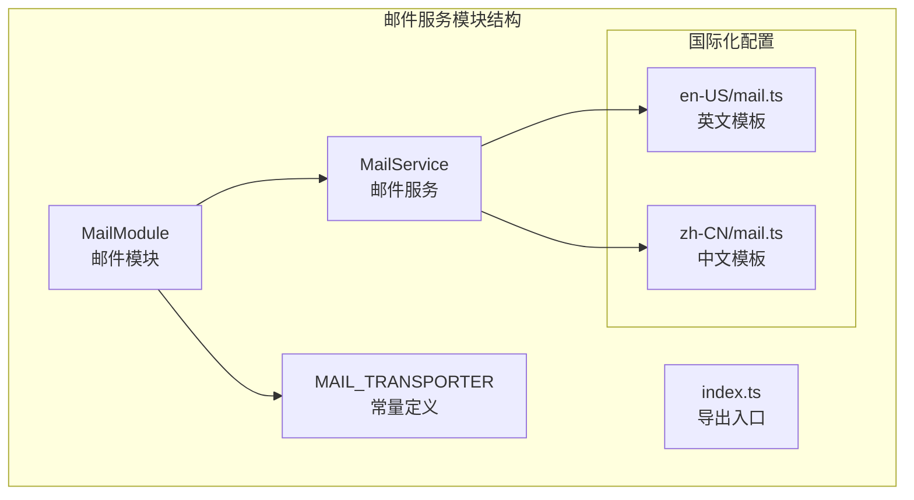
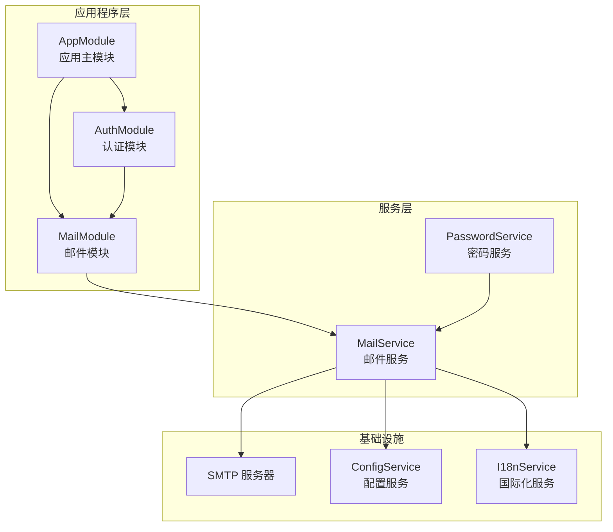
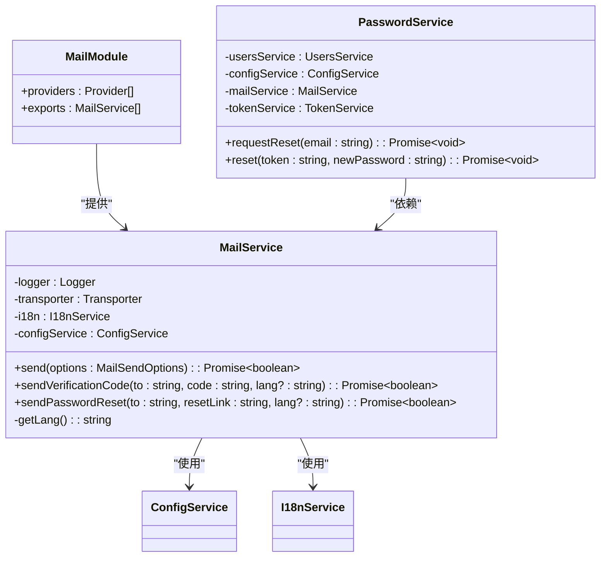
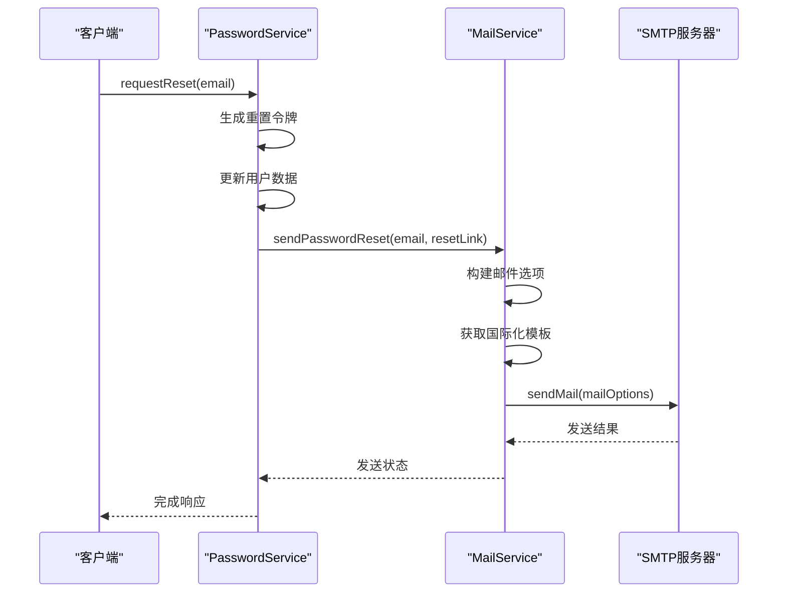
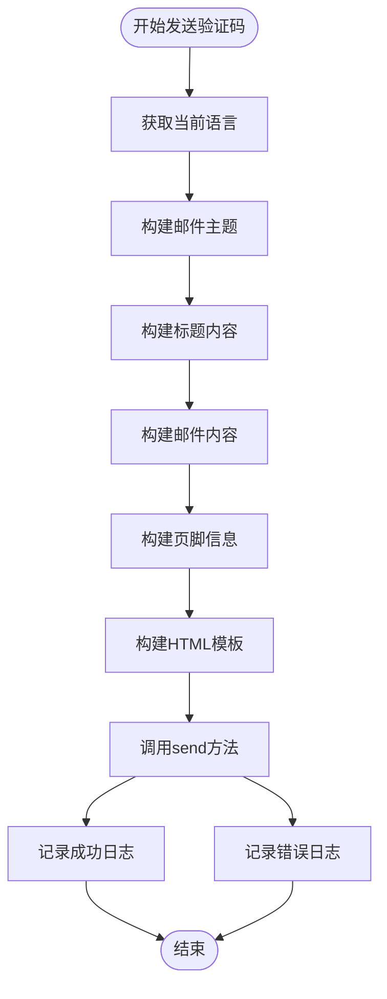
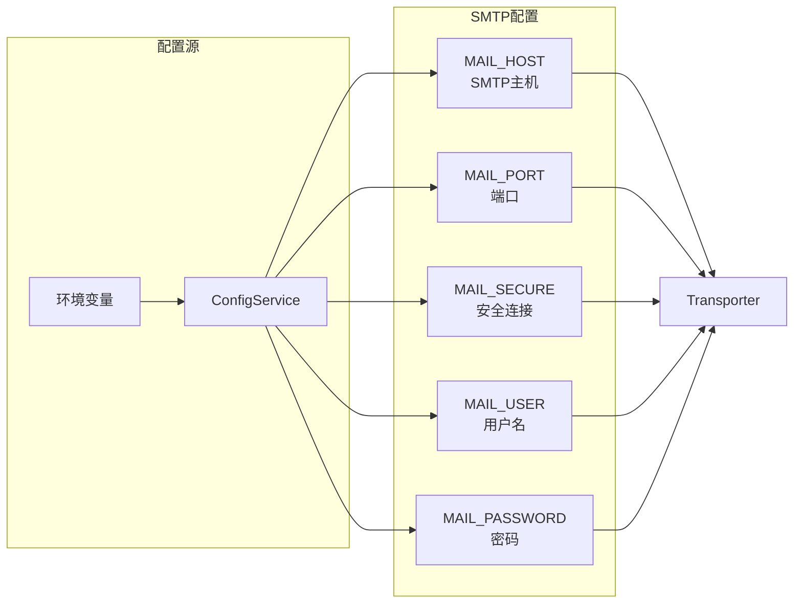
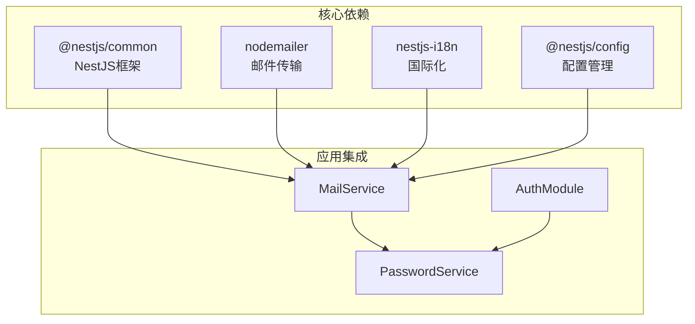
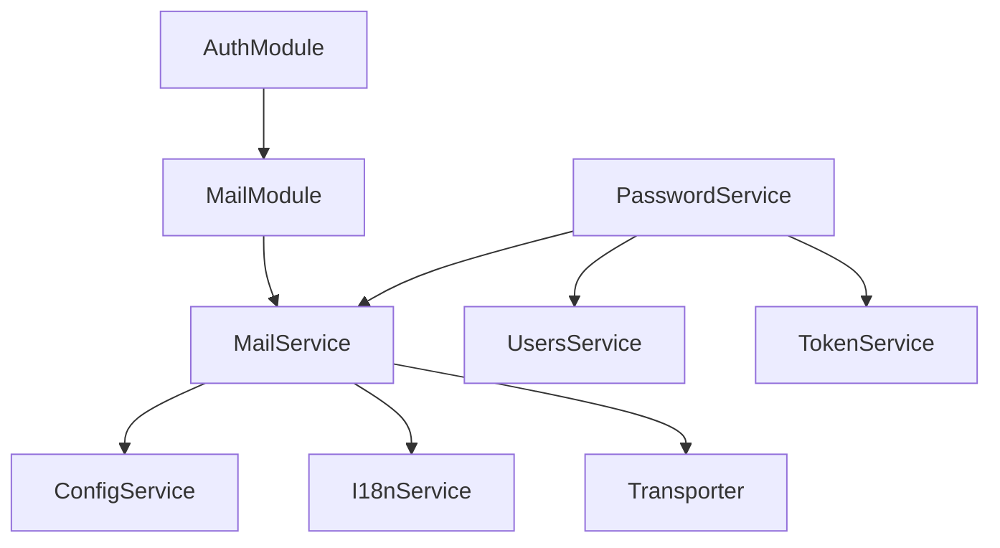

# 邮件服务实现

<cite>
**本文档引用的文件**
- [apps/backend/src/mail/mail.service.ts](file://apps/backend/src/mail/mail.service.ts)
- [apps/backend/src/mail/mail.module.ts](file://apps/backend/src/mail/mail.module.ts)
- [apps/backend/src/mail/mail.constants.ts](file://apps/backend/src/mail/mail.constants.ts)
- [apps/backend/src/mail/index.ts](file://apps/backend/src/mail/index.ts)
- [apps/backend/src/i18n/en-US/mail.ts](file://apps/backend/src/i18n/en-US/mail.ts)
- [apps/backend/src/i18n/zh-CN/mail.ts](file://apps/backend/src/i18n/zh-CN/mail.ts)
- [apps/backend/src/app.module.ts](file://apps/backend/src/app.module.ts)
- [apps/backend/src/auth/auth.module.ts](file://apps/backend/src/auth/auth.module.ts)
- [apps/backend/src/auth/password.service.ts](file://apps/backend/src/auth/password.service.ts)
- [apps/backend/package.json](file://apps/backend/package.json)
</cite>

## 目录
1. [简介](#简介)
2. [项目结构](#项目结构)
3. [核心组件](#核心组件)
4. [架构概览](#架构概览)
5. [详细组件分析](#详细组件分析)
6. [依赖关系分析](#依赖关系分析)
7. [性能考虑](#性能考虑)
8. [故障排除指南](#故障排除指南)
9. [结论](#结论)
10. [附录](#附录)

## 简介

Lumina Todo 的邮件服务实现基于 NestJS 框架和 nodemailer 库，提供了完整的邮件发送功能。该服务封装了 SMTP 邮件传输机制，支持文本和 HTML 格式的邮件发送，并集成了国际化模板系统。

邮件服务的主要特点包括：
- 基于 nodemailer 的 SMTP 邮件传输
- 国际化模板支持（英文和中文）
- 异步邮件发送机制
- 完整的错误处理和日志记录
- 配置驱动的 SMTP 连接管理

## 项目结构

邮件服务位于应用程序的 `apps/backend/src/mail` 目录下，采用标准的 NestJS 模块结构：

**图表来源**
- [apps/backend/src/mail/mail.module.ts:11-36](file://apps/backend/src/mail/mail.module.ts#L11-L36)
- [apps/backend/src/mail/mail.service.ts:18-26](file://apps/backend/src/mail/mail.service.ts#L18-L26)

**章节来源**
- [apps/backend/src/mail/mail.module.ts:1-37](file://apps/backend/src/mail/mail.module.ts#L1-L37)
- [apps/backend/src/mail/mail.service.ts:1-117](file://apps/backend/src/mail/mail.service.ts#L1-L117)
- [apps/backend/src/mail/mail.constants.ts:1-2](file://apps/backend/src/mail/mail.constants.ts#L1-L2)
- [apps/backend/src/mail/index.ts:1-4](file://apps/backend/src/mail/index.ts#L1-L4)

## 核心组件

### MailService 类

MailService 是邮件服务的核心实现，提供了以下主要功能：

#### 主要方法

1. **send()** - 基础邮件发送方法
   - 接受 MailSendOptions 参数
   - 支持单个或多个收件人
   - 返回布尔值表示发送结果

2. **sendVerificationCode()** - 验证码邮件发送
   - 自动生成验证码邮件内容
   - 支持国际化模板
   - 包含样式化的 HTML 模板

3. **sendPasswordReset()** - 密码重置邮件发送
   - 生成密码重置链接
   - 创建交互式 HTML 邮件
   - 包含过期时间信息

#### 关键特性

- **异步处理**：所有邮件发送操作都是异步的
- **错误处理**：捕获并记录所有发送异常
- **日志记录**：详细的发送状态日志
- **配置驱动**：通过环境变量配置 SMTP 设置

**章节来源**
- [apps/backend/src/mail/mail.service.ts:18-117](file://apps/backend/src/mail/mail.service.ts#L18-L117)

### MailModule 模块

MailModule 负责邮件服务的初始化和配置：

#### 配置选项

- **SMTP 主机**：通过 `MAIL_HOST` 环境变量配置
- **端口设置**：默认 587，可通过 `MAIL_PORT` 覆盖
- **安全连接**：通过 `MAIL_SECURE` 控制 SSL/TLS
- **认证信息**：用户名和密码通过 `MAIL_USER` 和 `MAIL_PASSWORD` 配置

#### 依赖注入

- 提供 `MAIL_TRANSPORTER` 令牌
- 注入 `I18nService` 用于国际化
- 注入 `ConfigService` 用于配置管理

**章节来源**
- [apps/backend/src/mail/mail.module.ts:11-36](file://apps/backend/src/mail/mail.module.ts#L11-L36)

## 架构概览

邮件服务在整个应用程序架构中的位置如下：

**图表来源**
- [apps/backend/src/app.module.ts:139-139](file://apps/backend/src/app.module.ts#L139-L139)
- [apps/backend/src/auth/auth.module.ts:22-22](file://apps/backend/src/auth/auth.module.ts#L22-L22)
- [apps/backend/src/mail/mail.module.ts:11-36](file://apps/backend/src/mail/mail.module.ts#L11-L36)

### 组件关系图

**图表来源**
- [apps/backend/src/mail/mail.service.ts:18-26](file://apps/backend/src/mail/mail.service.ts#L18-L26)
- [apps/backend/src/mail/mail.module.ts:11-36](file://apps/backend/src/mail/mail.module.ts#L11-L36)
- [apps/backend/src/auth/password.service.ts:10-20](file://apps/backend/src/auth/password.service.ts#L10-L20)

## 详细组件分析

### 邮件发送流程

邮件发送的核心流程从接收参数到最终发送的完整过程：

**图表来源**
- [apps/backend/src/auth/password.service.ts:39-61](file://apps/backend/src/auth/password.service.ts#L39-L61)
- [apps/backend/src/mail/mail.service.ts:91-115](file://apps/backend/src/mail/mail.service.ts#L91-L115)

### 验证码邮件发送流程

**图表来源**
- [apps/backend/src/mail/mail.service.ts:65-86](file://apps/backend/src/mail/mail.service.ts#L65-L86)

### 配置管理机制

邮件服务通过配置驱动的方式管理 SMTP 连接：

**图表来源**
- [apps/backend/src/mail/mail.module.ts:16-29](file://apps/backend/src/mail/mail.module.ts#L16-L29)

**章节来源**
- [apps/backend/src/mail/mail.service.ts:43-60](file://apps/backend/src/mail/mail.service.ts#L43-L60)
- [apps/backend/src/mail/mail.module.ts:16-29](file://apps/backend/src/mail/mail.module.ts#L16-L29)

### 国际化模板系统

邮件服务支持多语言模板，通过 `nestjs-i18n` 实现：

#### 支持的语言

- **英文 (en-US)**：适用于国际用户
- **中文 (zh-CN)**：适用于中文用户

#### 模板键值

每个语言文件包含以下邮件模板键：
- 验证码主题：`VERIFICATION_CODE_SUBJECT`
- 验证码标题：`VERIFICATION_CODE_TITLE`
- 验证码内容：`VERIFICATION_CODE_CONTENT`
- 验证码页脚：`VERIFICATION_CODE_FOOTER`
- 密码重置主题：`PASSWORD_RESET_SUBJECT`
- 密码重置标题：`PASSWORD_RESET_TITLE`
- 密码重置内容：`PASSWORD_RESET_CONTENT`
- 密码重置按钮：`PASSWORD_RESET_BUTTON`
- 密码重置页脚：`PASSWORD_RESET_FOOTER`
- 密码重置过期：`PASSWORD_RESET_EXPIRY`

**章节来源**
- [apps/backend/src/i18n/en-US/mail.ts:1-16](file://apps/backend/src/i18n/en-US/mail.ts#L1-L16)
- [apps/backend/src/i18n/zh-CN/mail.ts:1-15](file://apps/backend/src/i18n/zh-CN/mail.ts#L1-L15)

## 依赖关系分析

### 外部依赖

邮件服务依赖以下关键外部库：

**图表来源**
- [apps/backend/package.json:44-74](file://apps/backend/package.json#L44-L74)

### 内部依赖关系

**图表来源**
- [apps/backend/src/mail/mail.service.ts:22-26](file://apps/backend/src/mail/mail.service.ts#L22-L26)
- [apps/backend/src/auth/password.service.ts:11-20](file://apps/backend/src/auth/password.service.ts#L11-L20)

**章节来源**
- [apps/backend/package.json:44-86](file://apps/backend/package.json#L44-L86)

## 性能考虑

### 异步处理优势

邮件服务采用异步设计，具有以下性能优势：

1. **非阻塞操作**：邮件发送不会阻塞主线程
2. **并发处理**：可以同时处理多个邮件发送请求
3. **资源优化**：避免长时间占用数据库连接

### 配置优化建议

1. **SMTP 连接池**：考虑实现连接池复用
2. **批量发送**：对于大量邮件可考虑批量处理
3. **缓存模板**：国际化模板可考虑缓存
4. **超时控制**：为 SMTP 操作设置合理的超时时间

### 错误处理策略

- **重试机制**：当前实现未包含自动重试，可在生产环境中考虑添加
- **降级处理**：网络异常时可将邮件放入队列等待重试
- **监控告警**：对频繁失败的邮件发送进行监控

## 故障排除指南

### 常见问题及解决方案

#### SMTP 连接失败

**症状**：邮件发送返回 false，日志显示连接错误

**可能原因**：
- SMTP 主机配置错误
- 端口被防火墙阻止
- 认证信息不正确

**解决步骤**：
1. 验证 `MAIL_HOST` 和 `MAIL_PORT` 配置
2. 检查网络连通性
3. 确认用户名和密码正确

#### 国际化模板缺失

**症状**：邮件内容显示为键名而非实际文本

**解决步骤**：
1. 检查 `i18n` 模块配置
2. 验证语言文件完整性
3. 确认 `Accept-Language` 请求头

#### 邮件格式问题

**症状**：HTML 邮件显示为纯文本

**解决步骤**：
1. 确认 `html` 字段正确设置
2. 检查 HTML 标签的兼容性
3. 验证邮件客户端支持情况

**章节来源**
- [apps/backend/src/mail/mail.service.ts:55-59](file://apps/backend/src/mail/mail.service.ts#L55-L59)

## 结论

Lumina Todo 的邮件服务实现展现了良好的架构设计和实用性：

### 主要优势

1. **模块化设计**：清晰的模块分离和职责划分
2. **配置驱动**：灵活的 SMTP 配置管理
3. **国际化支持**：完整的多语言模板系统
4. **错误处理**：完善的异常捕获和日志记录
5. **依赖注入**：符合 NestJS 最佳实践的依赖管理

### 改进建议

1. **添加重试机制**：实现指数退避的自动重试
2. **队列集成**：使用 BullMQ 实现异步队列处理
3. **监控指标**：添加邮件发送成功率和延迟监控
4. **模板缓存**：优化国际化模板的加载性能

该邮件服务为 Lumina Todo 提供了可靠的基础通信能力，支持用户验证、密码重置等核心业务场景。

## 附录

### 配置参考

| 环境变量 | 默认值 | 描述 |
|---------|--------|------|
| `MAIL_HOST` | `smtp.example.com` | SMTP 服务器地址 |
| `MAIL_PORT` | `587` | SMTP 服务器端口 |
| `MAIL_SECURE` | `false` | 是否使用 SSL/TLS |
| `MAIL_USER` | - | SMTP 用户名 |
| `MAIL_PASSWORD` | - | SMTP 密码 |
| `MAIL_FROM` | `"No Reply" <noreply@example.com>` | 发件人地址 |

### 使用示例

邮件服务的典型使用模式：

1. **密码重置流程**：通过 `PasswordService` 调用 `MailService.sendPasswordReset()`
2. **验证码发送**：直接调用 `MailService.sendVerificationCode()`
3. **自定义邮件**：使用 `MailService.send()` 发送任意内容

**章节来源**
- [apps/backend/src/mail/mail.module.ts:17-26](file://apps/backend/src/mail/mail.module.ts#L17-L26)
- [apps/backend/src/auth/password.service.ts:57-60](file://apps/backend/src/auth/password.service.ts#L57-L60)