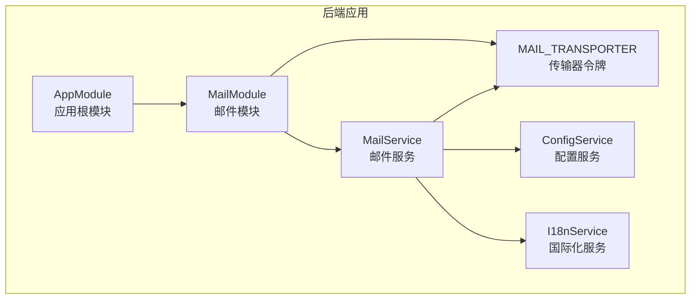
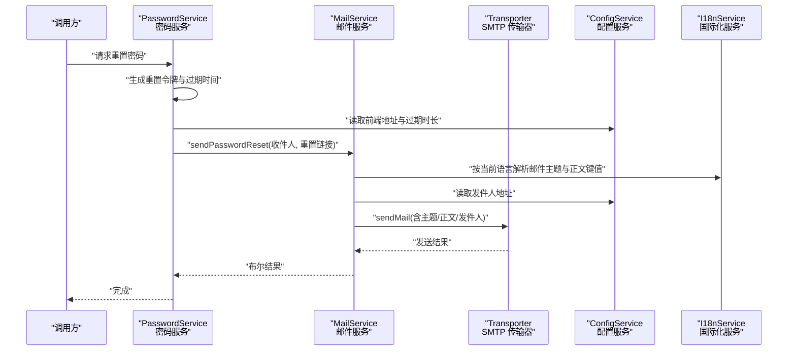
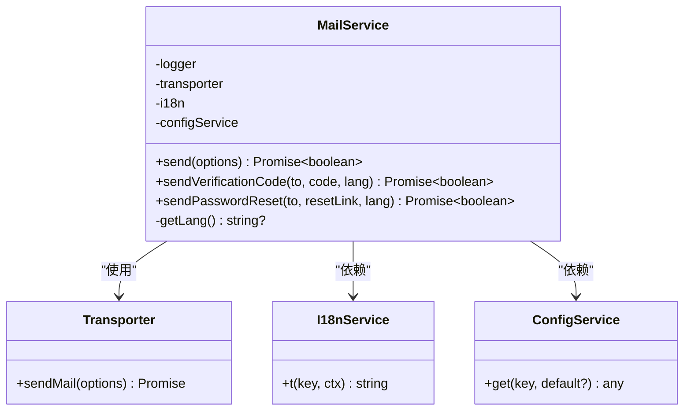
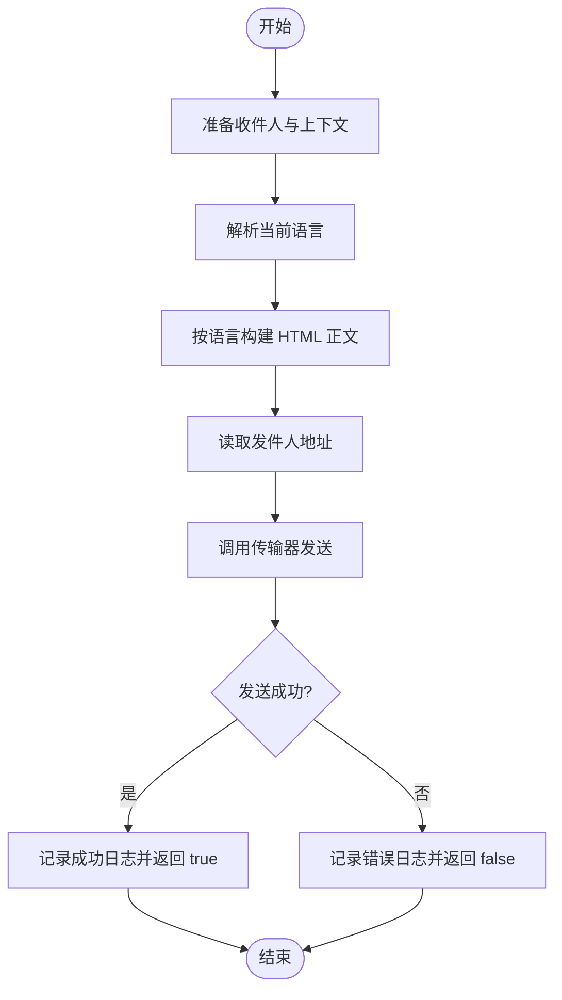
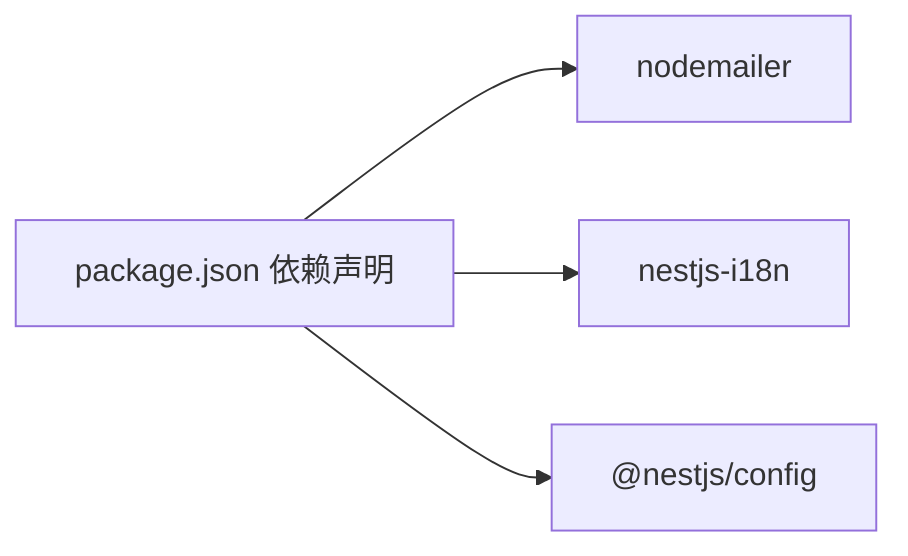

# 邮件服务系统

<cite>
**本文档引用的文件**
- [apps/backend/src/mail/index.ts](file://apps/backend/src/mail/index.ts)
- [apps/backend/src/mail/mail.constants.ts](file://apps/backend/src/mail/mail.constants.ts)
- [apps/backend/src/mail/mail.module.ts](file://apps/backend/src/mail/mail.module.ts)
- [apps/backend/src/mail/mail.service.ts](file://apps/backend/src/mail/mail.service.ts)
- [apps/backend/src/i18n/en-US/mail.ts](file://apps/backend/src/i18n/en-US/mail.ts)
- [apps/backend/src/i18n/zh-CN/mail.ts](file://apps/backend/src/i18n/zh-CN/mail.ts)
- [apps/backend/src/app.module.ts](file://apps/backend/src/app.module.ts)
- [apps/backend/src/auth/password.service.ts](file://apps/backend/src/auth/password.service.ts)
- [apps/backend/src/users/users.service.ts](file://apps/backend/src/users/users.service.ts)
- [apps/backend/package.json](file://apps/backend/package.json)
- [apps/backend/tests/mail/mail.module.spec.ts](file://apps/backend/tests/mail/mail.module.spec.ts)
</cite>

## 目录
1. [简介](#简介)
2. [项目结构](#项目结构)
3. [核心组件](#核心组件)
4. [架构总览](#架构总览)
5. [详细组件分析](#详细组件分析)
6. [依赖关系分析](#依赖关系分析)
7. [性能考量](#性能考量)
8. [故障排除指南](#故障排除指南)
9. [结论](#结论)
10. [附录](#附录)

## 简介
本文件为 Lumina Todo 的邮件服务系统配置与使用文档，覆盖以下主题：
- 配置选项与 SMTP 设置
- 邮件模板管理机制（基于国际化键值）
- 邮件发送流程、模板渲染与国际化支持
- 邮件常量定义、服务实现细节与错误处理策略
- 发送队列管理与发送状态跟踪（结合全局队列与速率限制）
- 安全考虑、防垃圾邮件策略与发送频率限制

## 项目结构
邮件服务位于后端应用的 mail 子模块中，采用 NestJS 模块化设计，通过依赖注入与配置服务完成 SMTP 连接与邮件发送。

图表来源
- [apps/backend/src/app.module.ts:139](file://apps/backend/src/app.module.ts#L139)
- [apps/backend/src/mail/mail.module.ts:11-36](file://apps/backend/src/mail/mail.module.ts#L11-L36)
- [apps/backend/src/mail/mail.service.ts:18-26](file://apps/backend/src/mail/mail.service.ts#L18-L26)

章节来源
- [apps/backend/src/mail/index.ts:1-4](file://apps/backend/src/mail/index.ts#L1-L4)
- [apps/backend/src/mail/mail.module.ts:1-37](file://apps/backend/src/mail/mail.module.ts#L1-L37)
- [apps/backend/src/app.module.ts:139](file://apps/backend/src/app.module.ts#L139)

## 核心组件
- 邮件常量
  - MAIL_TRANSPORTER：用于提供 SMTP 传输器实例的 DI 令牌。
- 邮件模块
  - 负责创建并导出 SMTP 传输器实例，并提供 MailService。
- 邮件服务
  - 提供通用发送方法与两类专用发送方法：验证码邮件、密码重置邮件。
  - 支持国际化主题与正文内容渲染。
  - 统一的错误处理与日志记录。
- 国际化邮件文案
  - 在 en-US 与 zh-CN 中分别提供验证码与密码重置相关文案键值。

章节来源
- [apps/backend/src/mail/mail.constants.ts:1](file://apps/backend/src/mail/mail.constants.ts#L1)
- [apps/backend/src/mail/mail.module.ts:11-36](file://apps/backend/src/mail/mail.module.ts#L11-L36)
- [apps/backend/src/mail/mail.service.ts:18-117](file://apps/backend/src/mail/mail.service.ts#L18-L117)
- [apps/backend/src/i18n/en-US/mail.ts:1-16](file://apps/backend/src/i18n/en-US/mail.ts#L1-L16)
- [apps/backend/src/i18n/zh-CN/mail.ts:1-15](file://apps/backend/src/i18n/zh-CN/mail.ts#L1-L15)

## 架构总览
邮件服务的运行时架构如下：

图表来源
- [apps/backend/src/auth/password.service.ts:39-61](file://apps/backend/src/auth/password.service.ts#L39-L61)
- [apps/backend/src/mail/mail.service.ts:91-115](file://apps/backend/src/mail/mail.service.ts#L91-L115)

## 详细组件分析

### 邮件常量定义
- MAIL_TRANSPORTER：作为传输器的注入令牌，确保在模块内统一提供与复用 SMTP 连接。

章节来源
- [apps/backend/src/mail/mail.constants.ts:1](file://apps/backend/src/mail/mail.constants.ts#L1)

### 邮件模块（MailModule）
- 功能
  - 通过 ConfigService 读取 SMTP 配置，创建 nodemailer 传输器实例。
  - 导出 MailService 供其他模块使用。
- 关键配置项
  - MAIL_HOST：SMTP 主机，默认示例值。
  - MAIL_PORT：SMTP 端口，默认 587。
  - MAIL_SECURE：是否启用 TLS，默认 false。
  - MAIL_USER、MAIL_PASSWORD：SMTP 认证凭据（可选）。
- 传输器工厂
  - 当提供认证信息时，将携带认证字段；否则以匿名方式连接。
  - 对端口进行数值校验，确保端口有效。

章节来源
- [apps/backend/src/mail/mail.module.ts:11-36](file://apps/backend/src/mail/mail.module.ts#L11-L36)

### 邮件服务（MailService）
- 通用发送
  - send(options)：封装发送逻辑，支持纯文本与 HTML。
  - 统一设置发件人地址（默认兜底），记录成功/失败日志并返回布尔结果。
- 专用发送
  - sendVerificationCode(to, code, lang?)：发送验证码邮件，标题、正文、页脚均来自国际化键值。
  - sendPasswordReset(to, resetLink, lang?)：发送密码重置邮件，包含按钮与过期说明。
- 国际化支持
  - 优先从 I18nContext 获取语言；若不可用则回退到配置的后备语言。
  - 所有文案键值来源于 i18n 目录下的 mail.ts。
- 错误处理
  - 捕获发送异常，记录错误日志并返回失败标记，避免中断调用链。

图表来源
- [apps/backend/src/mail/mail.service.ts:18-26](file://apps/backend/src/mail/mail.service.ts#L18-L26)
- [apps/backend/src/mail/mail.service.ts:43-60](file://apps/backend/src/mail/mail.service.ts#L43-L60)
- [apps/backend/src/mail/mail.service.ts:65-86](file://apps/backend/src/mail/mail.service.ts#L65-L86)
- [apps/backend/src/mail/mail.service.ts:91-115](file://apps/backend/src/mail/mail.service.ts#L91-L115)

章节来源
- [apps/backend/src/mail/mail.service.ts:18-117](file://apps/backend/src/mail/mail.service.ts#L18-L117)

### 国际化邮件文案
- 验证码邮件键值
  - VERIFICATION_CODE_SUBJECT、VERIFICATION_CODE_TITLE、VERIFICATION_CODE_CONTENT、VERIFICATION_CODE_FOOTER
- 密码重置邮件键值
  - PASSWORD_RESET_SUBJECT、PASSWORD_RESET_TITLE、PASSWORD_RESET_CONTENT、PASSWORD_RESET_BUTTON、PASSWORD_RESET_FOOTER、PASSWORD_RESET_EXPIRY
- 语言支持
  - en-US 与 zh-CN 各自提供完整键值映射，确保英文与中文用户获得对应文案。

章节来源
- [apps/backend/src/i18n/en-US/mail.ts:1-16](file://apps/backend/src/i18n/en-US/mail.ts#L1-L16)
- [apps/backend/src/i18n/zh-CN/mail.ts:1-15](file://apps/backend/src/i18n/zh-CN/mail.ts#L1-L15)

### 邮件发送流程与模板渲染
- 流程
  - 调用方准备收件人与上下文数据（如验证码或重置链接）。
  - MailService 依据当前语言解析文案键值，拼装 HTML 正文。
  - 读取配置中的发件人地址，构造发送选项并调用传输器发送。
- 模板渲染
  - 采用字符串拼接方式渲染 HTML 模板，包含标题、正文、按钮与页脚。
  - 通过国际化键值保证多语言一致性。

图表来源
- [apps/backend/src/mail/mail.service.ts:65-86](file://apps/backend/src/mail/mail.service.ts#L65-L86)
- [apps/backend/src/mail/mail.service.ts:91-115](file://apps/backend/src/mail/mail.service.ts#L91-L115)
- [apps/backend/src/mail/mail.service.ts:43-60](file://apps/backend/src/mail/mail.service.ts#L43-L60)

### 配置示例与最佳实践
- SMTP 设置
  - 必填项：MAIL_HOST、MAIL_PORT（建议 587）、MAIL_SECURE（建议 true）
  - 可选项：MAIL_USER、MAIL_PASSWORD（若需要认证）
  - 发件人：MAIL_FROM（建议使用带显示名的格式）
- 国际化
  - 确保 i18n 目录下存在 en-US 与 zh-CN 的 mail.ts 键值映射。
- 速率限制与队列
  - 全局已集成速率限制模块与 Redis 存储，建议对敏感操作（如密码重置）设置独立策略。
  - 若需异步发送与重试，可结合全局队列模块进行扩展（当前实现为同步发送）。

章节来源
- [apps/backend/src/mail/mail.module.ts:17-27](file://apps/backend/src/mail/mail.module.ts#L17-L27)
- [apps/backend/src/mail/mail.service.ts:46](file://apps/backend/src/mail/mail.service.ts#L46)
- [apps/backend/src/app.module.ts:118-123](file://apps/backend/src/app.module.ts#L118-L123)

### 错误处理策略
- 发送异常捕获
  - 捕获底层传输器抛出的错误，记录错误堆栈与消息，返回失败标记。
- 调用方处理
  - 建议调用方根据返回值决定是否重试或上报。
- 日志记录
  - 成功与失败均记录日志，便于审计与排障。

章节来源
- [apps/backend/src/mail/mail.service.ts:55-59](file://apps/backend/src/mail/mail.service.ts#L55-L59)

### 发送队列管理与状态跟踪
- 当前实现
  - MailService 的发送方法为同步阻塞调用，适合小规模或低频场景。
- 扩展建议
  - 结合全局队列模块（BullMQ）将发送任务入队，设置重试与退避策略，实现异步发送与状态持久化。
  - 通过队列作业记录发送状态、重试次数与最终结果，便于监控与告警。

章节来源
- [apps/backend/src/app.module.ts:97-116](file://apps/backend/src/app.module.ts#L97-L116)
- [apps/backend/src/mail/mail.service.ts:43-60](file://apps/backend/src/mail/mail.service.ts#L43-L60)

## 依赖关系分析
- 外部依赖
  - nodemailer：SMTP 邮件发送能力。
  - nestjs-i18n：国际化文案解析。
  - @nestjs/config：环境变量与配置读取。
- 内部依赖
  - MailModule 依赖 ConfigService 创建传输器。
  - MailService 依赖 ConfigService 读取发件人，依赖 I18nService 解析文案，依赖 Transporter 执行发送。

图表来源
- [apps/backend/package.json:74](file://apps/backend/package.json#L74)
- [apps/backend/package.json:71](file://apps/backend/package.json#L71)
- [apps/backend/package.json:45](file://apps/backend/package.json#L45)

章节来源
- [apps/backend/package.json:45-86](file://apps/backend/package.json#L45-L86)

## 性能考量
- 同步发送的吞吐瓶颈
  - 单次发送阻塞当前请求线程，高并发场景下可能影响响应时间。
- 异步化建议
  - 将发送任务放入队列，利用工作进程异步处理，提升整体吞吐。
- 重试与退避
  - 队列作业可配置指数退避与最大重试次数，降低瞬时失败率。
- 速率限制
  - 已集成全局速率限制模块，建议对邮件发送接口设置独立策略，避免被滥用。

章节来源
- [apps/backend/src/app.module.ts:118-123](file://apps/backend/src/app.module.ts#L118-L123)

## 故障排除指南
- 无法发送邮件
  - 检查 SMTP 配置（主机、端口、安全模式、认证信息）。
  - 确认 MAIL_FROM 地址格式正确且被 SMTP 服务器允许。
- 文案不生效或乱码
  - 确认当前语言解析成功，国际化键值在目标语言文件中存在。
- 发送失败但无异常
  - 查看日志输出，确认错误被捕获并记录。
- 重置邮件链接无效
  - 检查前端地址配置与令牌生成/校验逻辑。

章节来源
- [apps/backend/src/mail/mail.module.ts:17-27](file://apps/backend/src/mail/mail.module.ts#L17-L27)
- [apps/backend/src/mail/mail.service.ts:46](file://apps/backend/src/mail/mail.service.ts#L46)
- [apps/backend/src/mail/mail.service.ts:55-59](file://apps/backend/src/mail/mail.service.ts#L55-L59)
- [apps/backend/src/auth/password.service.ts:57-60](file://apps/backend/src/auth/password.service.ts#L57-L60)

## 结论
Lumina Todo 的邮件服务系统以简洁的模块化设计实现了 SMTP 集成、国际化文案与基础错误处理。当前实现适合中小规模使用，建议在生产环境中引入异步队列与更细粒度的速率限制策略，以提升可靠性与可扩展性。

## 附录

### 配置清单
- SMTP 相关
  - MAIL_HOST：SMTP 主机
  - MAIL_PORT：SMTP 端口（默认 587）
  - MAIL_SECURE：是否启用 TLS（默认 false）
  - MAIL_USER、MAIL_PASSWORD：SMTP 认证（可选）
  - MAIL_FROM：发件人地址（建议带显示名）
- 国际化
  - 确保 en-US 与 zh-CN 的 mail.ts 键值完整
- 速率限制
  - 已集成全局速率限制模块，建议针对敏感接口设置独立策略

章节来源
- [apps/backend/src/mail/mail.module.ts:17-27](file://apps/backend/src/mail/mail.module.ts#L17-L27)
- [apps/backend/src/mail/mail.service.ts:46](file://apps/backend/src/mail/mail.service.ts#L46)
- [apps/backend/src/i18n/en-US/mail.ts:1-16](file://apps/backend/src/i18n/en-US/mail.ts#L1-L16)
- [apps/backend/src/i18n/zh-CN/mail.ts:1-15](file://apps/backend/src/i18n/zh-CN/mail.ts#L1-L15)
- [apps/backend/src/app.module.ts:118-123](file://apps/backend/src/app.module.ts#L118-L123)