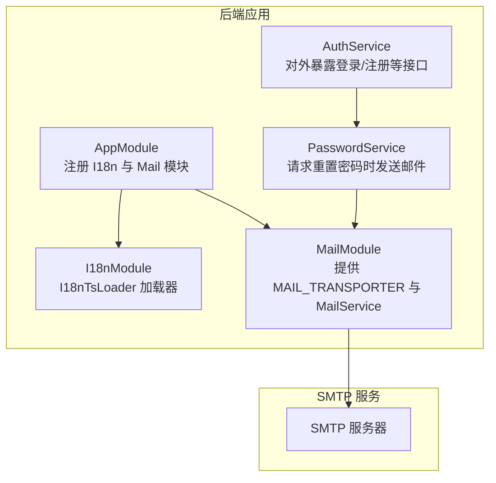
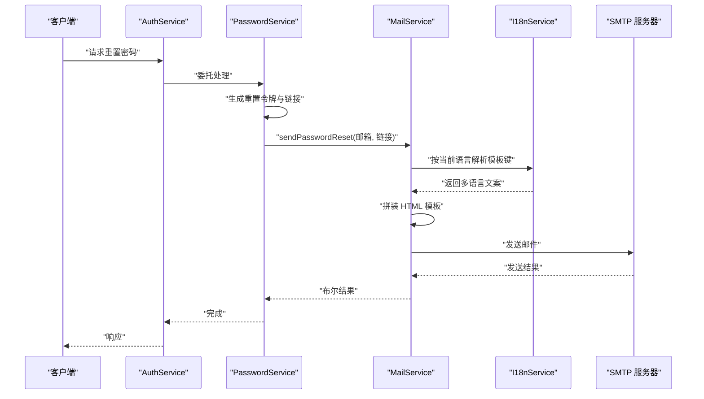
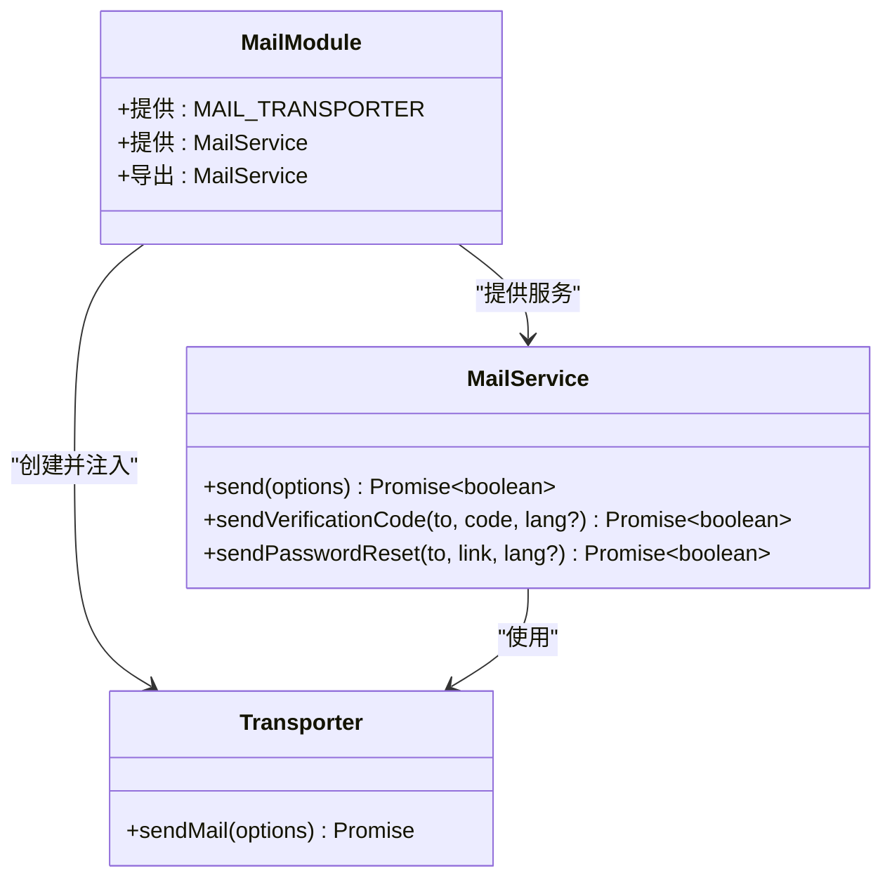
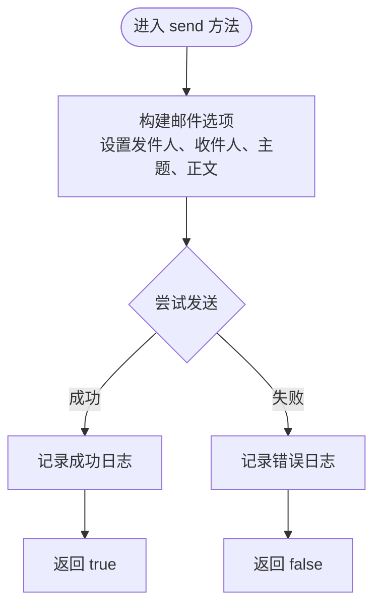
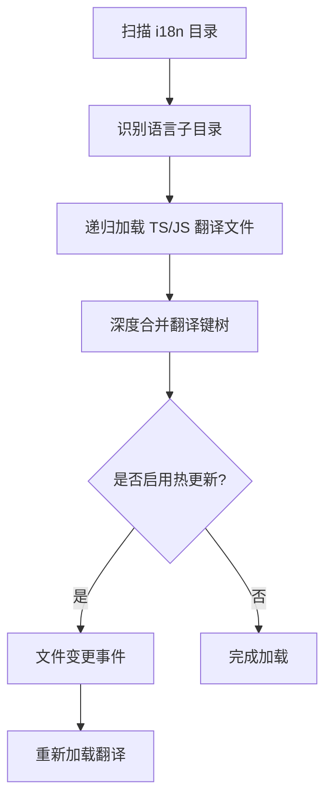
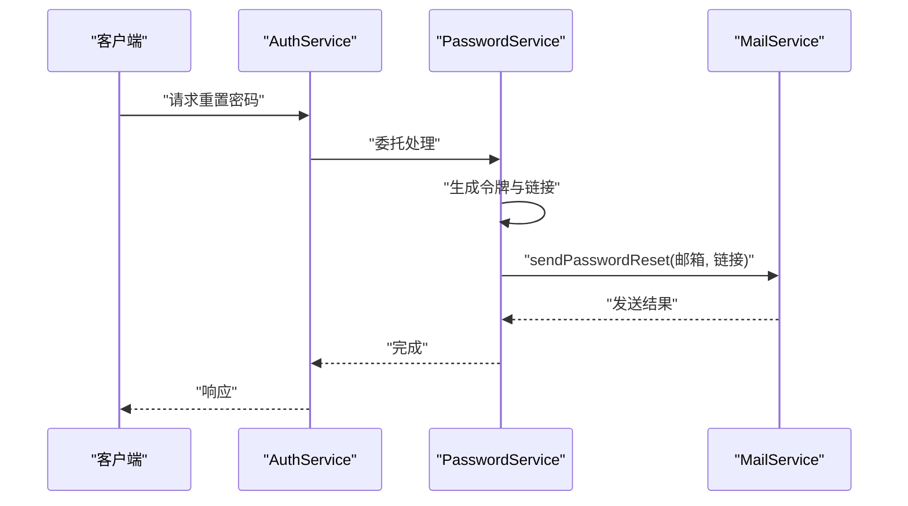
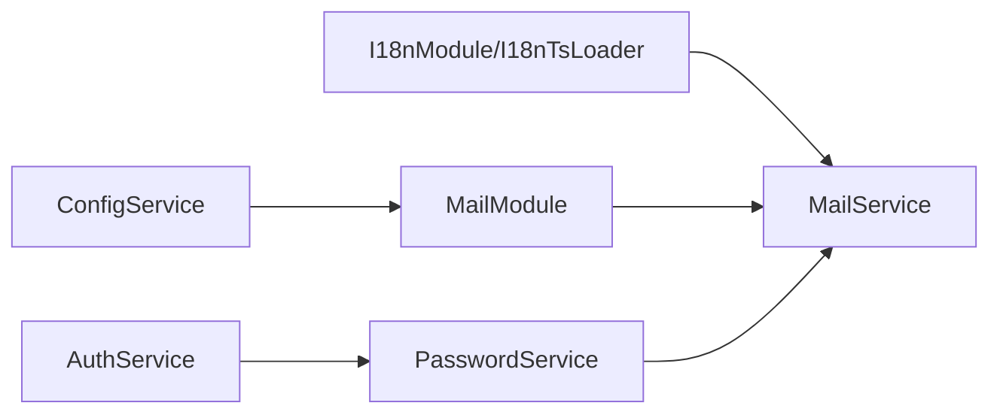

# 邮件模板管理

<cite>
**本文引用的文件**
- [apps/backend/src/mail/mail.module.ts](file://apps/backend/src/mail/mail.module.ts)
- [apps/backend/src/mail/mail.service.ts](file://apps/backend/src/mail/mail.service.ts)
- [apps/backend/src/mail/mail.constants.ts](file://apps/backend/src/mail/mail.constants.ts)
- [apps/backend/src/i18n/en-US/mail.ts](file://apps/backend/src/i18n/en-US/mail.ts)
- [apps/backend/src/i18n/zh-CN/mail.ts](file://apps/backend/src/i18n/zh-CN/mail.ts)
- [apps/backend/src/i18n/i18n-ts.loader.ts](file://apps/backend/src/i18n/i18n-ts.loader.ts)
- [apps/backend/src/app.module.ts](file://apps/backend/src/app.module.ts)
- [apps/backend/src/auth/password.service.ts](file://apps/backend/src/auth/password.service.ts)
- [apps/backend/src/auth/auth.service.ts](file://apps/backend/src/auth/auth.service.ts)
- [apps/backend/tests/mail/mail.module.spec.ts](file://apps/backend/tests/mail/mail.module.spec.ts)
- [apps/backend/tests/e2e/test-app.ts](file://apps/backend/tests/e2e/test-app.ts)
</cite>

## 目录
1. [简介](#简介)
2. [项目结构](#项目结构)
3. [核心组件](#核心组件)
4. [架构总览](#架构总览)
5. [详细组件分析](#详细组件分析)
6. [依赖关系分析](#依赖关系分析)
7. [性能考量](#性能考量)
8. [故障排查指南](#故障排查指南)
9. [结论](#结论)
10. [附录](#附录)

## 简介
本文件面向 Lumina Todo 的邮件模板管理系统，系统性阐述邮件模板的结构与组织方式、国际化邮件模板的实现机制、模板变量系统、模板渲染流程、动态内容与条件内容处理、多语言模板维护策略、模板创建与修改流程、版本管理建议以及测试与调试方法。读者无需深入技术背景即可理解并正确使用与扩展邮件模板体系。

## 项目结构
邮件模板管理由“邮件模块”“国际化模块”“业务服务调用链”三部分组成：
- 邮件模块负责 SMTP 连接与邮件发送能力，提供通用发送接口与两类常用模板（验证码、密码重置）。
- 国际化模块通过 TypeScript 文件加载翻译键值，支持运行时热更新，邮件模板通过 i18n 键获取多语言文案。
- 业务服务（如密码服务）在关键场景触发邮件发送，将动态参数注入模板并调用邮件服务。

图表来源
- [apps/backend/src/app.module.ts:124-133](file://apps/backend/src/app.module.ts#L124-L133)
- [apps/backend/src/mail/mail.module.ts:11-36](file://apps/backend/src/mail/mail.module.ts#L11-L36)
- [apps/backend/src/auth/password.service.ts:39-61](file://apps/backend/src/auth/password.service.ts#L39-L61)

章节来源
- [apps/backend/src/app.module.ts:124-133](file://apps/backend/src/app.module.ts#L124-L133)
- [apps/backend/src/mail/mail.module.ts:11-36](file://apps/backend/src/mail/mail.module.ts#L11-L36)
- [apps/backend/src/i18n/i18n-ts.loader.ts:126-144](file://apps/backend/src/i18n/i18n-ts.loader.ts#L126-L144)

## 核心组件
- 邮件模块（MailModule）
  - 通过配置项创建 SMTP 传输器，导出 MailService。
  - 关键配置项：MAIL_HOST、MAIL_PORT、MAIL_USER、MAIL_PASSWORD、MAIL_SECURE、MAIL_FROM。
- 邮件服务（MailService）
  - 提供通用发送接口 send(options)。
  - 提供两类模板方法：sendVerificationCode(code)、sendPasswordReset(resetLink)。
  - 模板文案通过 i18n 键获取，支持多语言。
- 国际化模块（I18nModule + I18nTsLoader）
  - 从 i18n 目录按语言子目录加载 TS/JS 翻译文件，支持热更新。
  - 默认语言为 en-US，可通过请求头或自定义头切换。
- 业务调用方
  - 密码服务在用户请求重置密码时生成链接并调用邮件服务发送模板邮件。
  - 认证服务对外暴露登录/注册等接口，内部可复用密码服务。

章节来源
- [apps/backend/src/mail/mail.module.ts:11-36](file://apps/backend/src/mail/mail.module.ts#L11-L36)
- [apps/backend/src/mail/mail.service.ts:18-117](file://apps/backend/src/mail/mail.service.ts#L18-L117)
- [apps/backend/src/i18n/i18n-ts.loader.ts:126-144](file://apps/backend/src/i18n/i18n-ts.loader.ts#L126-L144)
- [apps/backend/src/auth/password.service.ts:39-61](file://apps/backend/src/auth/password.service.ts#L39-L61)

## 架构总览
下图展示了从请求到邮件发送的关键交互路径，包括国际化文案解析与模板渲染。

图表来源
- [apps/backend/src/auth/auth.service.ts:106-112](file://apps/backend/src/auth/auth.service.ts#L106-L112)
- [apps/backend/src/auth/password.service.ts:39-61](file://apps/backend/src/auth/password.service.ts#L39-L61)
- [apps/backend/src/mail/mail.service.ts:91-115](file://apps/backend/src/mail/mail.service.ts#L91-L115)
- [apps/backend/src/i18n/i18n-ts.loader.ts:136-144](file://apps/backend/src/i18n/i18n-ts.loader.ts#L136-L144)

## 详细组件分析

### 组件一：邮件模块（MailModule）
- 职责
  - 创建并提供 SMTP 传输器实例（MAIL_TRANSPORTER）。
  - 注入并导出 MailService，供其他模块使用。
- 关键点
  - 传输器配置来源于环境变量，支持安全模式与认证。
  - 仅导出 MailService，不暴露底层传输器。
- 扩展建议
  - 如需模板引擎（如 Handlebars/EJS），可在 MailService 内部引入并封装模板渲染逻辑，保持对外接口稳定。

图表来源
- [apps/backend/src/mail/mail.module.ts:11-36](file://apps/backend/src/mail/mail.module.ts#L11-L36)
- [apps/backend/src/mail/mail.service.ts:18-117](file://apps/backend/src/mail/mail.service.ts#L18-L117)
- [apps/backend/src/mail/mail.constants.ts:1](file://apps/backend/src/mail/mail.constants.ts#L1)

章节来源
- [apps/backend/src/mail/mail.module.ts:11-36](file://apps/backend/src/mail/mail.module.ts#L11-L36)
- [apps/backend/src/mail/mail.constants.ts:1](file://apps/backend/src/mail/mail.constants.ts#L1)

### 组件二：邮件服务（MailService）
- 职责
  - 统一封装邮件发送逻辑，支持纯文本与 HTML。
  - 提供两类常用模板方法：验证码邮件与密码重置邮件。
- 模板变量系统
  - 验证码模板：接收验证码字符串，渲染为居中大号数字块。
  - 密码重置模板：接收重置链接，渲染为带按钮样式的 HTML。
- 国际化机制
  - 通过 I18nService 获取当前语言上下文，再按键名读取对应语言文案。
  - 若无法获取语言上下文，回退至默认语言（由 I18nModule 配置决定）。
- 错误处理
  - 成功发送返回 true；捕获异常并记录错误日志，返回 false。

图表来源
- [apps/backend/src/mail/mail.service.ts:43-60](file://apps/backend/src/mail/mail.service.ts#L43-L60)

章节来源
- [apps/backend/src/mail/mail.service.ts:18-117](file://apps/backend/src/mail/mail.service.ts#L18-L117)

### 组件三：国际化与模板键（I18nModule + i18n-ts.loader）
- 目录结构
  - 英文模板键：apps/backend/src/i18n/en-US/mail.ts
  - 中文模板键：apps/backend/src/i18n/zh-CN/mail.ts
- 加载机制
  - I18nModule 使用 I18nTsLoader 动态扫描 i18n 目录，按语言子目录合并翻译键树。
  - 支持热更新：当翻译文件变更时，I18nService 会重新加载。
- 键命名规范
  - 采用层级命名：common.mail.TEMPLATE_TYPE_KEY
  - 示例键：VERIFICATION_CODE_SUBJECT、PASSWORD_RESET_BUTTON 等
- 语言切换
  - 通过请求头或自定义头（如 x-lang）传递语言标识，I18nService 根据解析器选择对应语言。

图表来源
- [apps/backend/src/i18n/i18n-ts.loader.ts:163-183](file://apps/backend/src/i18n/i18n-ts.loader.ts#L163-L183)

章节来源
- [apps/backend/src/i18n/en-US/mail.ts:1-16](file://apps/backend/src/i18n/en-US/mail.ts#L1-L16)
- [apps/backend/src/i18n/zh-CN/mail.ts:1-15](file://apps/backend/src/i18n/zh-CN/mail.ts#L1-L15)
- [apps/backend/src/i18n/i18n-ts.loader.ts:126-144](file://apps/backend/src/i18n/i18n-ts.loader.ts#L126-L144)

### 组件四：业务调用链（AuthService → PasswordService → MailService）
- 密码重置流程
  - AuthService 对外暴露请求与重置接口。
  - PasswordService 生成令牌与链接，调用 MailService 发送模板邮件。
- 调用关系
  - MailService 依赖 I18nService 获取多语言文案，依赖 ConfigService 获取发件人信息与前端地址。

图表来源
- [apps/backend/src/auth/auth.service.ts:106-112](file://apps/backend/src/auth/auth.service.ts#L106-L112)
- [apps/backend/src/auth/password.service.ts:39-61](file://apps/backend/src/auth/password.service.ts#L39-L61)
- [apps/backend/src/mail/mail.service.ts:91-115](file://apps/backend/src/mail/mail.service.ts#L91-L115)

章节来源
- [apps/backend/src/auth/auth.service.ts:106-112](file://apps/backend/src/auth/auth.service.ts#L106-L112)
- [apps/backend/src/auth/password.service.ts:39-61](file://apps/backend/src/auth/password.service.ts#L39-L61)

## 依赖关系分析
- 模块耦合
  - MailModule 与 MailService 解耦良好：前者负责基础设施，后者负责业务发送。
  - I18nModule 与 MailService 解耦：MailService 仅依赖 I18nService 的键解析能力。
- 外部依赖
  - SMTP 服务器：由环境变量配置，传输器创建于 MailModule。
  - I18nTsLoader：动态扫描与合并翻译文件，支持热更新。
- 潜在循环依赖
  - 当前结构无循环依赖：MailService 不依赖业务模块，业务模块依赖 MailService。

图表来源
- [apps/backend/src/app.module.ts:124-133](file://apps/backend/src/app.module.ts#L124-L133)
- [apps/backend/src/mail/mail.module.ts:11-36](file://apps/backend/src/mail/mail.module.ts#L11-L36)
- [apps/backend/src/auth/password.service.ts:39-61](file://apps/backend/src/auth/password.service.ts#L39-L61)

章节来源
- [apps/backend/src/app.module.ts:124-133](file://apps/backend/src/app.module.ts#L124-L133)
- [apps/backend/src/mail/mail.module.ts:11-36](file://apps/backend/src/mail/mail.module.ts#L11-L36)

## 性能考量
- 模板渲染
  - 当前模板为简单 HTML 字符串拼接，开销极低；若引入模板引擎，需评估编译与渲染成本。
- 国际化加载
  - I18nTsLoader 支持热更新，开发阶段体验佳；生产环境建议关闭热更新以减少 IO 开销。
- 发送性能
  - SMTP 发送为阻塞 IO，建议结合队列（如 BullMQ）异步发送，降低请求延迟。
- 并发与限流
  - 结合全局限流策略，避免恶意请求导致邮件服务被滥用。

## 故障排查指南
- 常见问题
  - 发送失败：检查 SMTP 配置（主机、端口、认证、安全模式）、发件人地址、网络连通性。
  - 文案未生效：确认语言头是否正确传递、对应语言目录是否存在、翻译键是否完整。
  - 热更新无效：确认 I18nTsLoader 的 watch 选项已开启，文件变更是否触发事件。
- 调试技巧
  - 查看日志：MailService 在成功与失败时均记录日志，便于定位问题。
  - 单元测试：参考测试用例对 MailService 进行行为验证。
  - E2E 测试：通过模拟 MailService 替换真实发送，验证端到端流程。

章节来源
- [apps/backend/src/mail/mail.service.ts:43-60](file://apps/backend/src/mail/mail.service.ts#L43-L60)
- [apps/backend/tests/mail/mail.module.spec.ts:5](file://apps/backend/tests/mail/mail.module.spec.ts#L5)
- [apps/backend/tests/e2e/test-app.ts:441-494](file://apps/backend/tests/e2e/test-app.ts#L441-L494)

## 结论
Lumina Todo 的邮件模板管理以简洁清晰的方式实现了多语言邮件发送：通过 MailModule 提供稳定的 SMTP 能力，MailService 封装两类常用模板并通过 i18n 键实现多语言文案，I18nTsLoader 实现翻译文件的动态加载与热更新。整体架构解耦良好、易于扩展与维护。后续可在模板引擎、异步发送与版本管理方面进一步完善。

## 附录

### 模板命名规范与文件组织
- 命名规范
  - 采用层级命名：common.mail.TEMPLATE_TYPE_KEY
  - 示例：VERIFICATION_CODE_SUBJECT、PASSWORD_RESET_BUTTON
- 文件组织
  - 英文模板键：apps/backend/src/i18n/en-US/mail.ts
  - 中文模板键：apps/backend/src/i18n/zh-CN/mail.ts
- 版本管理建议
  - 为模板键增加注释说明用途与有效期，便于维护。
  - 引入键迁移脚本，避免删除或重命名导致的兼容问题。

章节来源
- [apps/backend/src/i18n/en-US/mail.ts:1-16](file://apps/backend/src/i18n/en-US/mail.ts#L1-L16)
- [apps/backend/src/i18n/zh-CN/mail.ts:1-15](file://apps/backend/src/i18n/zh-CN/mail.ts#L1-L15)

### 动态内容与条件内容处理
- 动态内容
  - 验证码模板：将验证码作为动态参数传入，渲染为醒目样式。
  - 密码重置模板：将重置链接作为动态参数传入，渲染为可点击按钮。
- 条件内容
  - 可在模板中加入条件判断（如过期时间提示），通过服务侧逻辑控制文案拼接。

章节来源
- [apps/backend/src/mail/mail.service.ts:65-86](file://apps/backend/src/mail/mail.service.ts#L65-L86)
- [apps/backend/src/mail/mail.service.ts:91-115](file://apps/backend/src/mail/mail.service.ts#L91-L115)

### 多语言模板维护策略
- 英文与中文模板
  - 各语言目录下维护独立的 mail.ts，确保键集合一致。
- 语言切换
  - 通过请求头或自定义头切换语言，I18nService 自动选择对应语言。
- 维护建议
  - 为每个键提供默认英文文案，中文文案作为补充。
  - 新增邮件类型时，同步在各语言目录下新增对应键。

章节来源
- [apps/backend/src/i18n/en-US/mail.ts:1-16](file://apps/backend/src/i18n/en-US/mail.ts#L1-L16)
- [apps/backend/src/i18n/zh-CN/mail.ts:1-15](file://apps/backend/src/i18n/zh-CN/mail.ts#L1-L15)
- [apps/backend/src/i18n/i18n-ts.loader.ts:126-144](file://apps/backend/src/i18n/i18n-ts.loader.ts#L126-L144)

### 模板创建与修改指导
- 添加新邮件类型
  - 在 i18n 目录下为各语言新增键，遵循命名规范。
  - 在 MailService 中新增对应模板方法，接收必要动态参数。
  - 在业务服务中调用新模板方法。
- 更新现有模板
  - 修改对应语言目录下的键值，I18nTsLoader 会自动热更新。
  - 如需调整模板结构，建议先在测试环境中验证。
- 版本管理
  - 为模板键增加版本注释，避免破坏性变更。
  - 旧键保留过渡期，逐步迁移至新键。

章节来源
- [apps/backend/src/mail/mail.service.ts:18-117](file://apps/backend/src/mail/mail.service.ts#L18-L117)
- [apps/backend/src/i18n/i18n-ts.loader.ts:136-144](file://apps/backend/src/i18n/i18n-ts.loader.ts#L136-L144)

### 模板测试方法与调试技巧
- 单元测试
  - 使用测试桩替换 MailService 的 send 方法，断言模板键与参数是否正确。
- E2E 测试
  - 通过自定义模块提供 MailService 的替身对象，验证端到端流程。
- 调试技巧
  - 打印当前语言与解析到的文案，确认 i18n 生效。
  - 使用最小化模板快速定位问题，逐步恢复复杂样式。

章节来源
- [apps/backend/tests/mail/mail.module.spec.ts:5](file://apps/backend/tests/mail/mail.module.spec.ts#L5)
- [apps/backend/tests/e2e/test-app.ts:441-494](file://apps/backend/tests/e2e/test-app.ts#L441-L494)