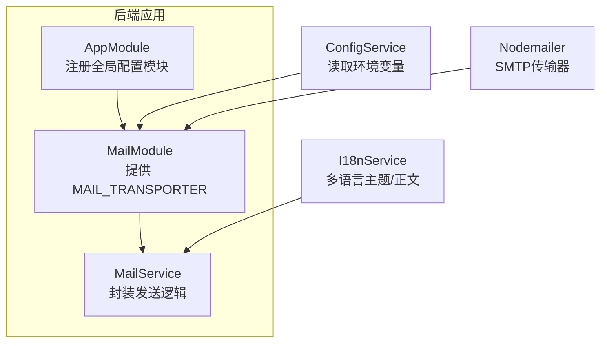
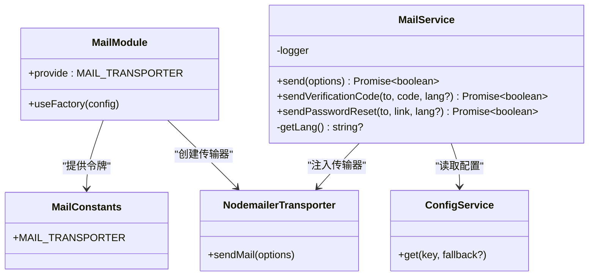
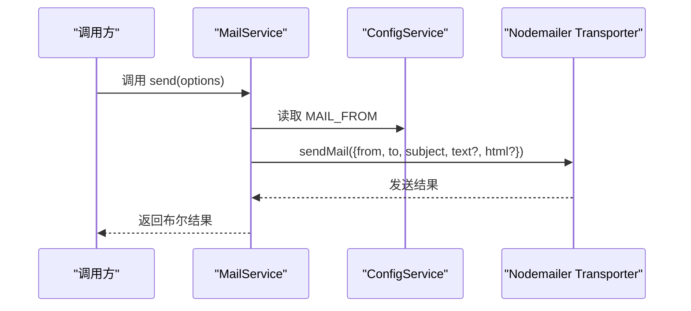
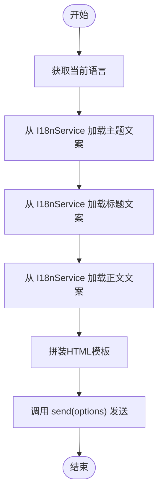
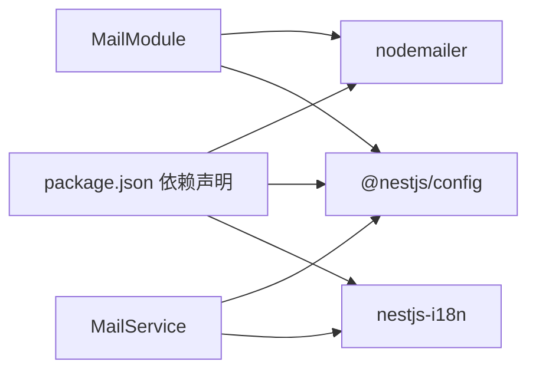

# 邮件配置与设置

<cite>
**本文引用的文件**
- [apps/backend/src/mail/mail.constants.ts](file://apps/backend/src/mail/mail.constants.ts)
- [apps/backend/src/mail/mail.module.ts](file://apps/backend/src/mail/mail.module.ts)
- [apps/backend/src/mail/mail.service.ts](file://apps/backend/src/mail/mail.service.ts)
- [apps/backend/src/app.module.ts](file://apps/backend/src/app.module.ts)
- [apps/backend/src/main.ts](file://apps/backend/src/main.ts)
- [apps/backend/src/i18n/en-US/mail.ts](file://apps/backend/src/i18n/en-US/mail.ts)
- [apps/backend/src/i18n/zh-CN/mail.ts](file://apps/backend/src/i18n/zh-CN/mail.ts)
- [apps/backend/package.json](file://apps/backend/package.json)
</cite>

## 目录
1. [简介](#简介)
2. [项目结构](#项目结构)
3. [核心组件](#核心组件)
4. [架构总览](#架构总览)
5. [详细组件分析](#详细组件分析)
6. [依赖关系分析](#依赖关系分析)
7. [性能考虑](#性能考虑)
8. [故障排查指南](#故障排查指南)
9. [结论](#结论)
10. [附录](#附录)

## 简介
本文件面向Lumina Todo后端的邮件配置系统，聚焦于邮件传输器（SMTP）的配置流程与最佳实践。内容涵盖：
- MAIL_TRANSPORTER常量的作用与注入方式
- SMTP主机、端口、安全连接与认证参数的设置
- 环境变量配置清单（MAIL_HOST、MAIL_PORT、MAIL_USER、MAIL_PASSWORD、MAIL_SECURE、MAIL_FROM等）
- 不同邮件服务商（Gmail、Outlook、自建SMTP）的配置要点
- 配置验证方法与常见错误排查

## 项目结构
邮件功能由独立模块提供，通过NestJS的ConfigService读取环境变量，使用nodemailer创建SMTP传输器，并在MailService中封装发送逻辑。

图表来源
- [apps/backend/src/app.module.ts:31-34](file://apps/backend/src/app.module.ts#L31-L34)
- [apps/backend/src/mail/mail.module.ts:11-36](file://apps/backend/src/mail/mail.module.ts#L11-L36)
- [apps/backend/src/mail/mail.service.ts:18-26](file://apps/backend/src/mail/mail.service.ts#L18-L26)

章节来源
- [apps/backend/src/app.module.ts:28-146](file://apps/backend/src/app.module.ts#L28-L146)
- [apps/backend/src/mail/mail.module.ts:1-37](file://apps/backend/src/mail/mail.module.ts#L1-L37)
- [apps/backend/src/mail/mail.service.ts:1-117](file://apps/backend/src/mail/mail.service.ts#L1-L117)

## 核心组件
- MAIL_TRANSPORTER常量：作为可注入令牌，标识SMTP传输器实例，便于在模块与服务间解耦传递。
- MailModule：负责创建并提供SMTP传输器实例；从ConfigService读取MAIL_HOST、MAIL_PORT、MAIL_USER、MAIL_PASSWORD、MAIL_SECURE等配置。
- MailService：封装邮件发送逻辑，支持纯文本与HTML；内置验证码与密码重置两类模板邮件的发送方法；通过I18nService实现多语言主题与正文。

章节来源
- [apps/backend/src/mail/mail.constants.ts:1-2](file://apps/backend/src/mail/mail.constants.ts#L1-L2)
- [apps/backend/src/mail/mail.module.ts:11-36](file://apps/backend/src/mail/mail.module.ts#L11-L36)
- [apps/backend/src/mail/mail.service.ts:18-117](file://apps/backend/src/mail/mail.service.ts#L18-L117)

## 架构总览
下图展示邮件模块的依赖关系与控制流：

图表来源
- [apps/backend/src/mail/mail.constants.ts:1-2](file://apps/backend/src/mail/mail.constants.ts#L1-L2)
- [apps/backend/src/mail/mail.module.ts:11-36](file://apps/backend/src/mail/mail.module.ts#L11-L36)
- [apps/backend/src/mail/mail.service.ts:18-26](file://apps/backend/src/mail/mail.service.ts#L18-L26)

## 详细组件分析

### 邮件传输器配置（MAIL_TRANSPORTER）
- 注入令牌：MAIL_TRANSPORTER作为Symbol，用于在模块中提供与在服务中注入传输器实例。
- 工厂函数：MailModule通过useFactory基于ConfigService动态构建SMTP传输器，关键参数来源如下：
  - 主机：MAIL_HOST（默认值来自模块中的回退配置）
  - 端口：MAIL_PORT（默认值来自模块中的回退配置）
  - 安全模式：MAIL_SECURE（字符串比较“true”决定是否启用TLS）
  - 认证：MAIL_USER、MAIL_PASSWORD（若均存在则启用认证）
- 返回类型：nodemailer.Transporter实例，供MailService直接调用sendMail。

章节来源
- [apps/backend/src/mail/mail.constants.ts:1-2](file://apps/backend/src/mail/mail.constants.ts#L1-L2)
- [apps/backend/src/mail/mail.module.ts:11-36](file://apps/backend/src/mail/mail.module.ts#L11-L36)

### 邮件服务（MailService）
- 发送通用邮件：接收收件人、主题、文本/HTML内容，拼装from地址（优先使用配置项），调用transporter.sendMail。
- 发送验证码邮件：根据当前语言或指定语言，从I18nService加载多语言文案，生成HTML模板并发送。
- 发送密码重置邮件：根据当前语言或指定语言，从I18nService加载多语言文案，生成HTML模板并发送。
- 错误处理：捕获异常并记录日志，返回布尔结果表示发送是否成功。

章节来源
- [apps/backend/src/mail/mail.service.ts:18-117](file://apps/backend/src/mail/mail.service.ts#L18-L117)
- [apps/backend/src/i18n/en-US/mail.ts:1-16](file://apps/backend/src/i18n/en-US/mail.ts#L1-L16)
- [apps/backend/src/i18n/zh-CN/mail.ts:1-15](file://apps/backend/src/i18n/zh-CN/mail.ts#L1-L15)

### 配置加载与模块装配
- 全局配置模块：AppModule通过ConfigModule.forRoot加载.env文件，使MAIL_*等环境变量生效。
- 环境变量解析：MailModule在useFactory中读取MAIL_HOST、MAIL_PORT、MAIL_USER、MAIL_PASSWORD、MAIL_SECURE；MailService在发送时读取MAIL_FROM。
- 传输器创建：使用nodemailer.createTransport构造SMTP传输器。

章节来源
- [apps/backend/src/app.module.ts:31-34](file://apps/backend/src/app.module.ts#L31-L34)
- [apps/backend/src/mail/mail.module.ts:16-29](file://apps/backend/src/mail/mail.module.ts#L16-L29)
- [apps/backend/src/mail/mail.service.ts:43-51](file://apps/backend/src/mail/mail.service.ts#L43-L51)

### 发送流程时序图

图表来源
- [apps/backend/src/mail/mail.service.ts:43-60](file://apps/backend/src/mail/mail.service.ts#L43-L60)
- [apps/backend/src/mail/mail.module.ts:16-29](file://apps/backend/src/mail/mail.module.ts#L16-L29)

### 验证码与密码重置发送流程

图表来源
- [apps/backend/src/mail/mail.service.ts:65-86](file://apps/backend/src/mail/mail.service.ts#L65-L86)
- [apps/backend/src/mail/mail.service.ts:91-115](file://apps/backend/src/mail/mail.service.ts#L91-L115)

## 依赖关系分析
- 外部依赖：nodemailer（SMTP传输器）、@nestjs/config（环境变量读取）、nestjs-i18n（多语言文案）。
- 内部依赖：MailModule向MailService注入MAIL_TRANSPORTER；MailService依赖ConfigService与I18nService。

图表来源
- [apps/backend/package.json:74](file://apps/backend/package.json#L74)
- [apps/backend/package.json:45](file://apps/backend/package.json#L45)
- [apps/backend/package.json:71](file://apps/backend/package.json#L71)
- [apps/backend/src/mail/mail.module.ts:3](file://apps/backend/src/mail/mail.module.ts#L3)
- [apps/backend/src/mail/mail.service.ts:2-5](file://apps/backend/src/mail/mail.service.ts#L2-L5)

章节来源
- [apps/backend/package.json:31-87](file://apps/backend/package.json#L31-L87)
- [apps/backend/src/mail/mail.module.ts:1-37](file://apps/backend/src/mail/mail.module.ts#L1-L37)
- [apps/backend/src/mail/mail.service.ts:1-117](file://apps/backend/src/mail/mail.service.ts#L1-L117)

## 性能考虑
- 连接复用：nodemailer传输器在工厂中一次性创建并注入，避免重复初始化开销。
- 异步发送：sendMail为异步操作，建议结合队列或后台任务处理高并发场景（当前代码未内置队列，可在业务层扩展）。
- 日志与可观测性：MailService对发送成功与失败进行日志记录，便于监控与排障。

## 故障排查指南
- 环境变量未生效
  - 确认.env文件位于应用根目录或被ConfigModule正确加载。
  - 章节来源
    - [apps/backend/src/app.module.ts:31-34](file://apps/backend/src/app.module.ts#L31-L34)
- 无法连接SMTP服务器
  - 校验MAIL_HOST与MAIL_PORT是否正确。
  - 若启用安全连接，确认MAIL_SECURE为“true”，并确保服务器支持对应端口（如465或587）。
  - 章节来源
    - [apps/backend/src/mail/mail.module.ts:19-27](file://apps/backend/src/mail/mail.module.ts#L19-L27)
- 认证失败
  - 确认MAIL_USER与MAIL_PASSWORD均已设置且有效。
  - 对于Gmail等服务商，需开启“允许不够安全的应用”或使用应用专用密码。
  - 章节来源
    - [apps/backend/src/mail/mail.module.ts:17-26](file://apps/backend/src/mail/mail.module.ts#L17-L26)
- 发送失败但无明确错误
  - 查看应用日志中“邮件发送失败”的错误堆栈。
  - 章节来源
    - [apps/backend/src/mail/mail.service.ts:55-59](file://apps/backend/src/mail/mail.service.ts#L55-L59)
- 发件人显示异常
  - 确认MAIL_FROM已按预期配置，否则将使用默认值。
  - 章节来源
    - [apps/backend/src/mail/mail.service.ts:46](file://apps/backend/src/mail/mail.service.ts#L46)

## 结论
Lumina Todo的邮件系统通过NestJS模块化设计与ConfigService解耦配置，使用nodemailer实现SMTP传输。MAIL_TRANSPORTER作为注入令牌，实现了传输器的集中管理与灵活替换。通过合理的环境变量配置与日志记录，系统具备良好的可维护性与可扩展性。

## 附录

### 环境变量配置清单
- 必填项
  - MAIL_HOST：SMTP服务器地址
  - MAIL_PORT：SMTP服务器端口（默认值见模块回退）
  - MAIL_USER：发件账号
  - MAIL_PASSWORD：发件账号密码
- 可选项
  - MAIL_SECURE：是否启用安全连接（字符串“true”视为启用）
  - MAIL_FROM：发件人地址（未设置时使用默认值）

章节来源
- [apps/backend/src/mail/mail.module.ts:17-27](file://apps/backend/src/mail/mail.module.ts#L17-L27)
- [apps/backend/src/mail/mail.service.ts:46](file://apps/backend/src/mail/mail.service.ts#L46)

### 不同邮件服务商配置要点
- Gmail
  - 开启“两步验证”并生成“应用专用密码”
  - 使用MAIL_USER为邮箱地址，MAIL_PASSWORD为应用专用密码
  - 建议MAIL_SECURE设为“true”，端口选择465或587
- Outlook/Office 365
  - 使用应用密码或OAuth（如需OAuth，需额外配置）
  - 端口通常为587或465，MAIL_SECURE设为“true”
- 自建SMTP服务器
  - 确认服务器支持的认证方式与加密模式
  - 正确设置MAIL_HOST、MAIL_PORT、MAIL_SECURE
  - 如需认证，设置MAIL_USER与MAIL_PASSWORD

### 配置验证步骤
- 启动应用后，尝试触发一次验证码或密码重置邮件发送，观察日志输出。
- 若发送失败，检查日志中的错误信息并对照上述故障排查项逐项核对。
- 可通过命令行工具（如openssl s_client）测试SMTP连通性与TLS握手。