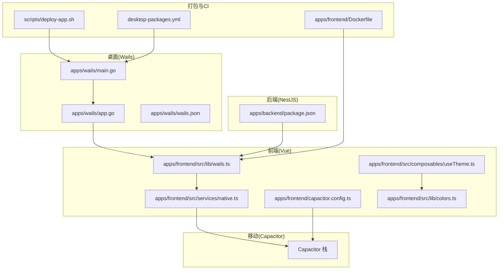
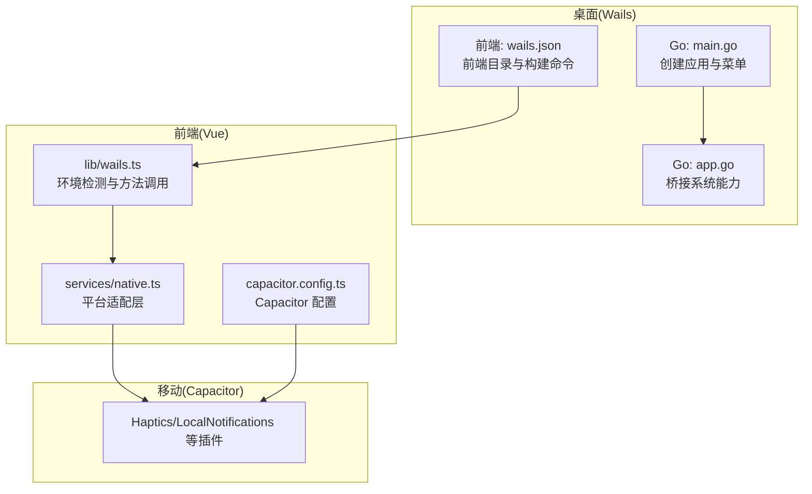
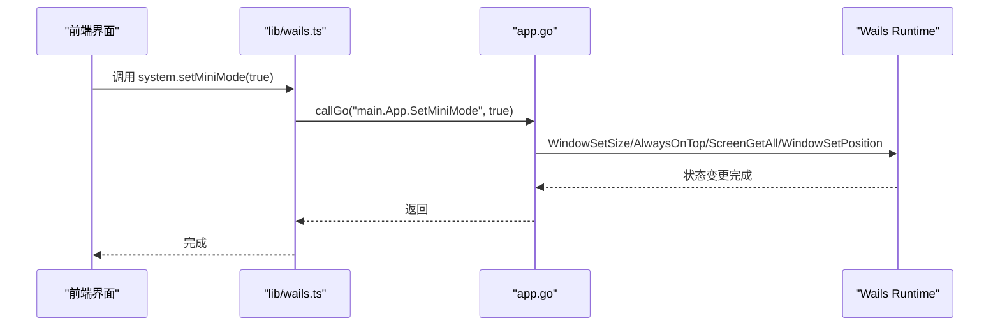
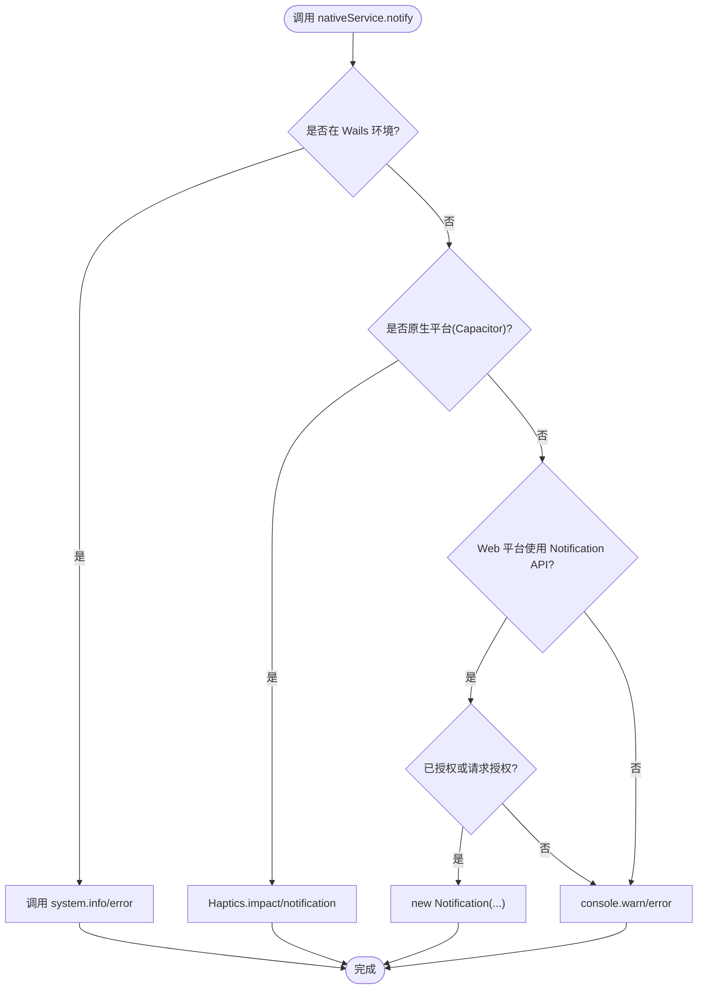
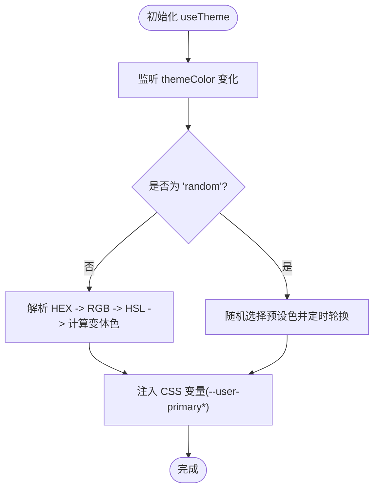
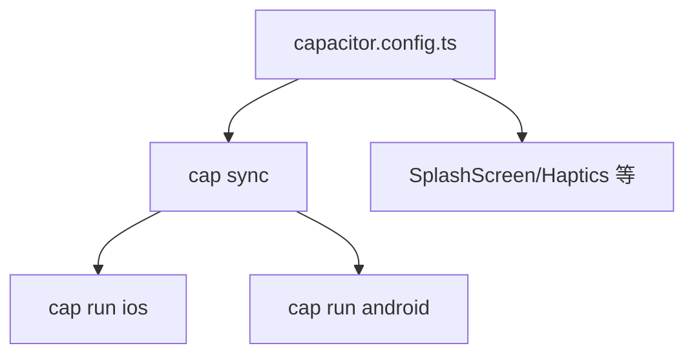
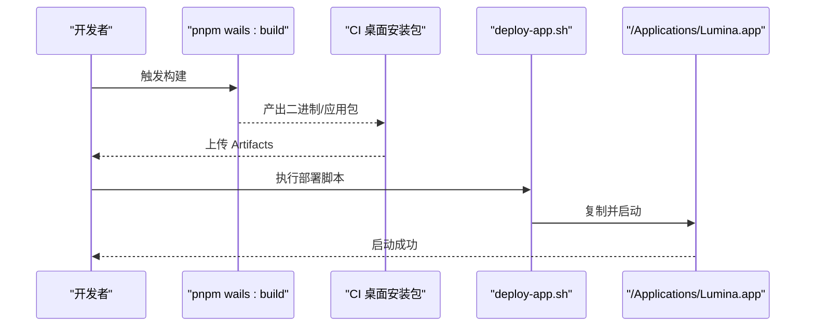
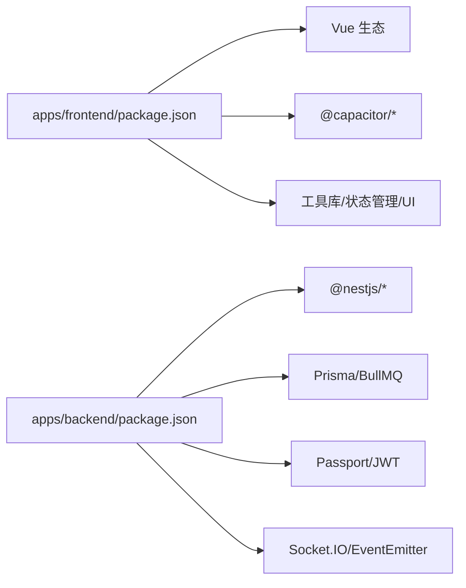

# 桌面应用

<cite>
**本文引用的文件**   
- [apps/wails/app.go](file://apps/wails/app.go)
- [apps/wails/main.go](file://apps/wails/main.go)
- [apps/wails/wails.json](file://apps/wails/wails.json)
- [apps/frontend/src/lib/wails.ts](file://apps/frontend/src/lib/wails.ts)
- [apps/frontend/src/services/native.ts](file://apps/frontend/src/services/native.ts)
- [apps/frontend/capacitor.config.ts](file://apps/frontend/capacitor.config.ts)
- [apps/frontend/src/composables/useTheme.ts](file://apps/frontend/src/composables/useTheme.ts)
- [apps/frontend/src/lib/colors.ts](file://apps/frontend/src/lib/colors.ts)
- [scripts/deploy-app.sh](file://scripts/deploy-app.sh)
- [.github/workflows/desktop-packages.yml](file://.github/workflows/desktop-packages.yml)
- [apps/frontend/Dockerfile](file://apps/frontend/Dockerfile)
- [apps/backend/package.json](file://apps/backend/package.json)
- [apps/frontend/package.json](file://apps/frontend/package.json)
- [package.json](file://package.json)
</cite>

## 目录
1. [简介](#简介)
2. [项目结构](#项目结构)
3. [核心组件](#核心组件)
4. [架构总览](#架构总览)
5. [详细组件分析](#详细组件分析)
6. [依赖分析](#依赖分析)
7. [性能考虑](#性能考虑)
8. [故障排查指南](#故障排查指南)
9. [结论](#结论)
10. [附录](#附录)

## 简介
本技术文档面向 Lumina 桌面应用，系统性阐述基于 Wails 框架的桌面集成方案、Go 后端与 Vue 前端的桥接机制、原生 API 调用方式；覆盖跨平台打包配置、Android/iOS 移动应用构建与 Capacitor 插件体系；解释桌面窗口管理、系统托盘集成、快捷键绑定、文件关联处理；介绍原生通知、剪贴板操作、系统主题适配、高 DPI 显示支持；说明应用签名、代码混淆、资源打包、自动更新机制；并包含平台特定优化、性能监控、崩溃报告收集等运维内容。

## 项目结构
Lumina 采用多包工作区组织，核心模块包括：
- apps/wails：Wails 桌面应用入口与桥接实现
- apps/frontend：Vue 3 + Vite 前端工程，同时作为 Capacitor 移动端 Web 层
- apps/backend：NestJS 后端服务（数据库、任务队列、认证等）
- scripts：自动化部署与运维脚本
- .github/workflows：CI/CD 流水线（含桌面安装包打包）

**图表来源**
- [apps/wails/main.go:20-94](file://apps/wails/main.go#L20-L94)
- [apps/wails/app.go:12-168](file://apps/wails/app.go#L12-L168)
- [apps/wails/wails.json:1-22](file://apps/wails/wails.json#L1-L22)
- [apps/frontend/src/lib/wails.ts:1-92](file://apps/frontend/src/lib/wails.ts#L1-L92)
- [apps/frontend/src/services/native.ts:1-116](file://apps/frontend/src/services/native.ts#L1-L116)
- [apps/frontend/capacitor.config.ts:1-23](file://apps/frontend/capacitor.config.ts#L1-L23)
- [apps/frontend/src/composables/useTheme.ts:1-248](file://apps/frontend/src/composables/useTheme.ts#L1-L248)
- [apps/frontend/src/lib/colors.ts:1-96](file://apps/frontend/src/lib/colors.ts#L1-L96)
- [scripts/deploy-app.sh:1-65](file://scripts/deploy-app.sh#L1-L65)
- [.github/workflows/desktop-packages.yml:1-262](file://.github/workflows/desktop-packages.yml#L1-L262)
- [apps/frontend/Dockerfile:1-45](file://apps/frontend/Dockerfile#L1-L45)

**章节来源**
- [apps/wails/main.go:20-94](file://apps/wails/main.go#L20-L94)
- [apps/wails/app.go:12-168](file://apps/wails/app.go#L12-L168)
- [apps/wails/wails.json:1-22](file://apps/wails/wails.json#L1-L22)
- [apps/frontend/src/lib/wails.ts:1-92](file://apps/frontend/src/lib/wails.ts#L1-L92)
- [apps/frontend/src/services/native.ts:1-116](file://apps/frontend/src/services/native.ts#L1-L116)
- [apps/frontend/capacitor.config.ts:1-23](file://apps/frontend/capacitor.config.ts#L1-L23)
- [apps/frontend/src/composables/useTheme.ts:1-248](file://apps/frontend/src/composables/useTheme.ts#L1-L248)
- [apps/frontend/src/lib/colors.ts:1-96](file://apps/frontend/src/lib/colors.ts#L1-L96)
- [scripts/deploy-app.sh:1-65](file://scripts/deploy-app.sh#L1-L65)
- [.github/workflows/desktop-packages.yml:1-262](file://.github/workflows/desktop-packages.yml#L1-L262)
- [apps/frontend/Dockerfile:1-45](file://apps/frontend/Dockerfile#L1-L45)

## 核心组件
- Wails 应用入口与选项配置：负责菜单、窗口尺寸、透明背景、平台特定外观与资源嵌入。
- Go 侧桥接方法：提供消息对话框、系统浏览器打开、窗口最小化/恢复、迷你模式、通知事件等。
- Vue 前端桥接库：统一检测运行环境并调用 Go 方法，提供类型安全的调用封装。
- 原生能力适配层：统一 Wails/Capacitor/Web 三端接口，抽象通知、触感反馈、浏览器打开、迷你模式等。
- 主题与颜色工具：提供 HSL/RGB 转换、随机主题色轮换、CSS 变量注入。
- 移动端 Capacitor 配置：SplashScreen、开发服务器、Android Scheme 等。
- 打包与部署：本地一键部署脚本、GitHub Actions 桌面安装包流水线、Docker 构建前端。

**章节来源**
- [apps/wails/main.go:32-89](file://apps/wails/main.go#L32-L89)
- [apps/wails/app.go:42-167](file://apps/wails/app.go#L42-L167)
- [apps/frontend/src/lib/wails.ts:22-91](file://apps/frontend/src/lib/wails.ts#L22-L91)
- [apps/frontend/src/services/native.ts:9-115](file://apps/frontend/src/services/native.ts#L9-L115)
- [apps/frontend/src/composables/useTheme.ts:188-247](file://apps/frontend/src/composables/useTheme.ts#L188-L247)
- [apps/frontend/src/lib/colors.ts:11-96](file://apps/frontend/src/lib/colors.ts#L11-L96)
- [apps/frontend/capacitor.config.ts:3-22](file://apps/frontend/capacitor.config.ts#L3-L22)
- [scripts/deploy-app.sh:32-65](file://scripts/deploy-app.sh#L32-L65)
- [.github/workflows/desktop-packages.yml:31-262](file://.github/workflows/desktop-packages.yml#L31-L262)
- [apps/frontend/Dockerfile:1-45](file://apps/frontend/Dockerfile#L1-L45)

## 架构总览
Wails 将 Go 后端与 Vue 前端组合为原生桌面应用，前端资源通过嵌入式文件系统提供；同时前端亦可作为 Capacitor 移动端 Web 层，配合原生插件实现触感反馈、启动器图标等移动端特性。

**图表来源**
- [apps/wails/main.go:20-94](file://apps/wails/main.go#L20-L94)
- [apps/wails/app.go:12-168](file://apps/wails/app.go#L12-L168)
- [apps/wails/wails.json:1-22](file://apps/wails/wails.json#L1-L22)
- [apps/frontend/src/lib/wails.ts:1-92](file://apps/frontend/src/lib/wails.ts#L1-L92)
- [apps/frontend/src/services/native.ts:1-116](file://apps/frontend/src/services/native.ts#L1-L116)
- [apps/frontend/capacitor.config.ts:1-23](file://apps/frontend/capacitor.config.ts#L1-L23)

## 详细组件分析

### Wails 桌面桥接与窗口管理
- 应用启动与菜单：在不同平台上添加标准菜单项，绑定快捷键（如切换窗口、退出）。
- 窗口控制：最小化/恢复、置顶、居中、设置尺寸与位置；支持根据主屏计算迷你模式位置。
- 对话框与通知：信息/错误对话框；通过事件发射通知给前端渲染层。
- 浏览器打开：校验 URL 合法性后交由系统默认浏览器打开。
- 透明与外观：Windows 使用 Mica 背景，macOS 隐藏标题栏并启用透明窗口。

**图表来源**
- [apps/frontend/src/lib/wails.ts:29-52](file://apps/frontend/src/lib/wails.ts#L29-L52)
- [apps/wails/app.go:113-140](file://apps/wails/app.go#L113-L140)

**章节来源**
- [apps/wails/main.go:32-89](file://apps/wails/main.go#L32-L89)
- [apps/wails/app.go:92-167](file://apps/wails/app.go#L92-L167)
- [apps/frontend/src/lib/wails.ts:57-91](file://apps/frontend/src/lib/wails.ts#L57-L91)

### 前端桥接与原生能力适配层
- 环境检测：判断是否在 Wails 环境中，避免在浏览器中误调用原生方法。
- 类型安全调用：按点分隔的方法路径解析，确保函数存在再调用。
- 平台适配：统一 notify/openBrowser/setMiniMode/quit/toggleMaximise 等接口，分别委派至 Wails/Capacitor/Web。
- 触感反馈：在原生平台使用 Haptics 插件，Web 平台降级输出日志。

**图表来源**
- [apps/frontend/src/services/native.ts:22-58](file://apps/frontend/src/services/native.ts#L22-L58)
- [apps/frontend/src/lib/wails.ts:22-52](file://apps/frontend/src/lib/wails.ts#L22-L52)

**章节来源**
- [apps/frontend/src/lib/wails.ts:19-91](file://apps/frontend/src/lib/wails.ts#L19-L91)
- [apps/frontend/src/services/native.ts:9-115](file://apps/frontend/src/services/native.ts#L9-L115)

### 主题与颜色系统
- 颜色工具：提供 CSS 变量读取、RGB/HSL 解析与转换、颜色混合等基础能力。
- 主题组合式函数：使用存储持久化主题色，支持随机模式与定时轮换，动态注入 CSS 变量，适配亮/暗模式。

**图表来源**
- [apps/frontend/src/composables/useTheme.ts:188-247](file://apps/frontend/src/composables/useTheme.ts#L188-L247)
- [apps/frontend/src/lib/colors.ts:11-96](file://apps/frontend/src/lib/colors.ts#L11-L96)

**章节来源**
- [apps/frontend/src/composables/useTheme.ts:188-247](file://apps/frontend/src/composables/useTheme.ts#L188-L247)
- [apps/frontend/src/lib/colors.ts:11-96](file://apps/frontend/src/lib/colors.ts#L11-L96)

### 移动端 Capacitor 集成
- 配置：应用 ID、名称、Web 目录、开发服务器与 Android Scheme。
- 插件：启动画面、触感反馈等。
- 运行：提供 CLI 命令同步与运行 iOS/Android。

**图表来源**
- [apps/frontend/capacitor.config.ts:3-22](file://apps/frontend/capacitor.config.ts#L3-L22)
- [apps/frontend/package.json:21-27](file://apps/frontend/package.json#L21-L27)

**章节来源**
- [apps/frontend/capacitor.config.ts:1-23](file://apps/frontend/capacitor.config.ts#L1-L23)
- [apps/frontend/package.json:21-27](file://apps/frontend/package.json#L21-L27)

### 跨平台打包与部署
- 本地部署：macOS 下将构建产物复制到 /Applications 并自动启动。
- CI 打包：GitHub Actions 支持 Windows/macOS/Linux，自动生成版本号与包名，归档产物，macOS DMG 可选签名。
- 前端 Docker 构建：多阶段构建，优先缓存依赖，最终产出静态资源供 Wails 嵌入。

**图表来源**
- [scripts/deploy-app.sh:32-65](file://scripts/deploy-app.sh#L32-L65)
- [.github/workflows/desktop-packages.yml:31-262](file://.github/workflows/desktop-packages.yml#L31-L262)
- [apps/frontend/Dockerfile:1-45](file://apps/frontend/Dockerfile#L1-L45)

**章节来源**
- [scripts/deploy-app.sh:1-65](file://scripts/deploy-app.sh#L1-L65)
- [.github/workflows/desktop-packages.yml:1-262](file://.github/workflows/desktop-packages.yml#L1-L262)
- [apps/frontend/Dockerfile:1-45](file://apps/frontend/Dockerfile#L1-L45)

## 依赖分析
- 前端依赖：Vue 3、Pinia、Vue Router、Tailwind、Capacitor 生态、第三方 UI 与工具库。
- 后端依赖：NestJS、Prisma、BullMQ、Passport/JWT、Socket.IO、i18n、Redis 缓存等。
- 工作区脚本：统一 dev/build/test/lint 等命令，Wails 专用脚本集成构建与部署。

**图表来源**
- [apps/frontend/package.json:30-70](file://apps/frontend/package.json#L30-L70)
- [apps/backend/package.json:30-86](file://apps/backend/package.json#L30-L86)
- [package.json:31-76](file://package.json#L31-L76)

**章节来源**
- [apps/frontend/package.json:1-104](file://apps/frontend/package.json#L1-L104)
- [apps/backend/package.json:1-108](file://apps/backend/package.json#L1-L108)
- [package.json:1-133](file://package.json#L1-L133)

## 性能考虑
- 前端构建：Vite + PWA 插件，生产构建开启压缩与最小化，Tailwind 按需裁剪样式。
- 资源嵌入：Wails 将前端 dist 嵌入 Go 程序，减少运行时网络开销。
- 动画与交互：GSAP、Canvas Confetti 等在桌面端可充分利用 GPU 加速，移动端注意能耗。
- 数据与网络：后端使用 BullMQ 异步任务、Redis 缓存、i18n 多语言，合理拆分职责降低耦合。
- 主题渲染：CSS 变量注入避免频繁 DOM 修改，颜色计算在内存中完成。

[本节为通用性能建议，不直接分析具体文件]

## 故障排查指南
- Wails 环境检测失败：确认前端在 Wails 环境中才调用 system.* 方法，避免在浏览器直接调用。
- 通知未显示：检查浏览器 Notification 权限与焦点状态；移动端确认 Capacitor 插件可用。
- 窗口迷你模式异常：确认屏幕枚举与主屏选择逻辑，确保坐标计算正确。
- 打包失败：检查 CI 中 Go 版本、pnpm 版本与依赖缓存；macOS DMG 签名密钥配置。
- Docker 构建问题：核对镜像层级与缓存策略，确保前端构建产物正确复制到 Wails 嵌入目录。

**章节来源**
- [apps/frontend/src/lib/wails.ts:22-52](file://apps/frontend/src/lib/wails.ts#L22-L52)
- [apps/frontend/src/services/native.ts:22-58](file://apps/frontend/src/services/native.ts#L22-L58)
- [apps/wails/app.go:92-140](file://apps/wails/app.go#L92-L140)
- [.github/workflows/desktop-packages.yml:64-106](file://.github/workflows/desktop-packages.yml#L64-L106)
- [apps/frontend/Dockerfile:29-45](file://apps/frontend/Dockerfile#L29-L45)

## 结论
Lumina 通过 Wails 将 Go 后端与 Vue 前端无缝整合为原生桌面应用，并以 Capacitor 为移动端扩展基础。桥接层统一了多端能力，主题系统与颜色工具提供了良好的视觉体验。CI/CD 与本地部署脚本保障了交付效率。后续可在自动更新、崩溃上报、性能监控等方面进一步完善。

[本节为总结性内容，不直接分析具体文件]

## 附录
- 快速命令
  - 开发：pnpm dev / pnpm dev:backend / pnpm dev:frontend
  - 构建：pnpm build / pnpm wails:build
  - 部署：pnpm wails:deploy
  - 测试：pnpm test / pnpm test:coverage
- 关键配置参考
  - Wails 配置：apps/wails/wails.json
  - 前端 Capacitor：apps/frontend/capacitor.config.ts
  - CI 打包：.github/workflows/desktop-packages.yml
  - 前端 Docker：apps/frontend/Dockerfile

[本节为概览性附录，不直接分析具体文件]