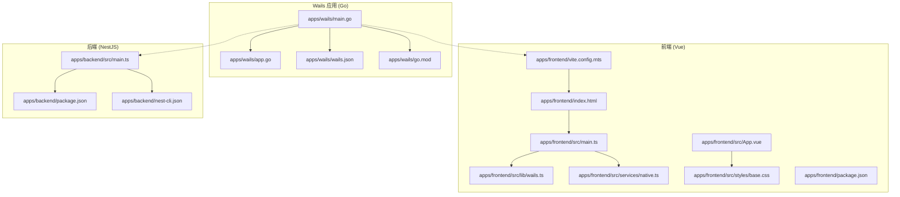
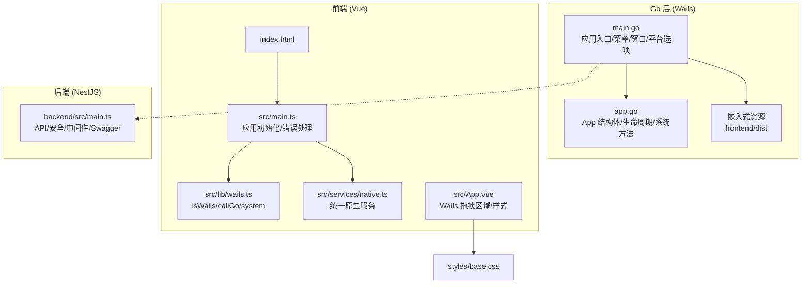
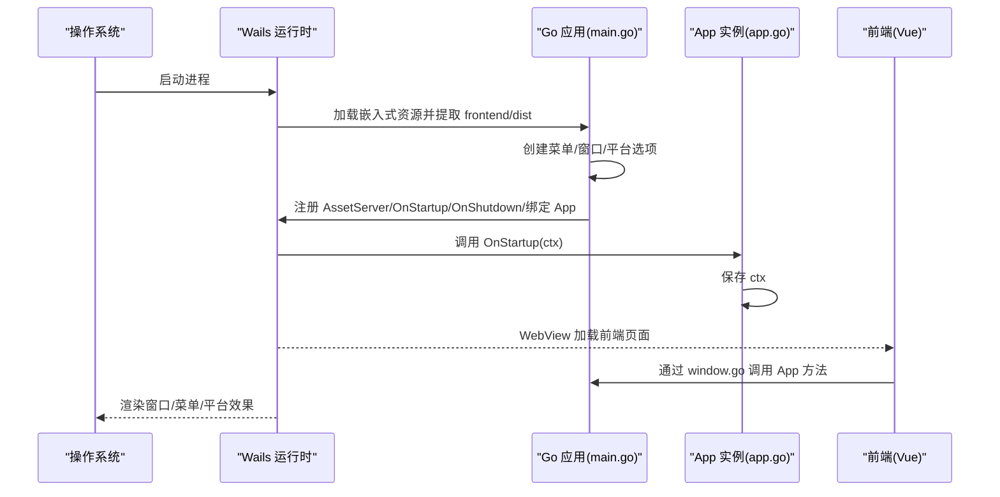
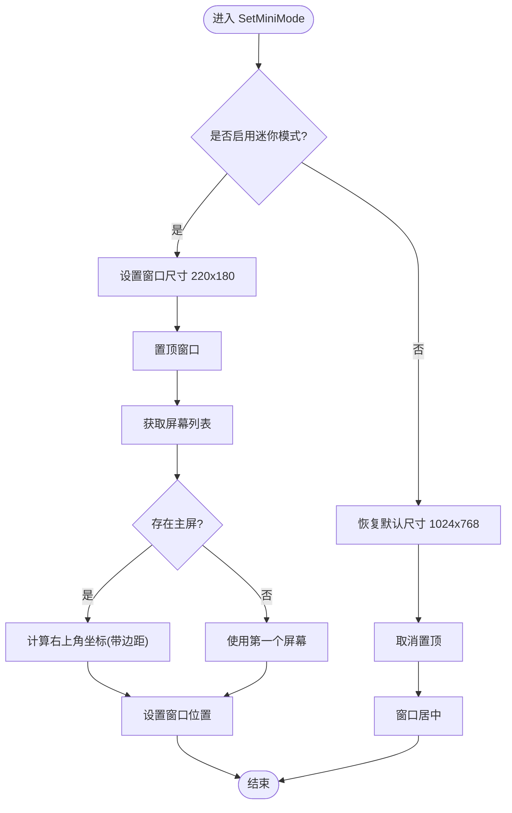
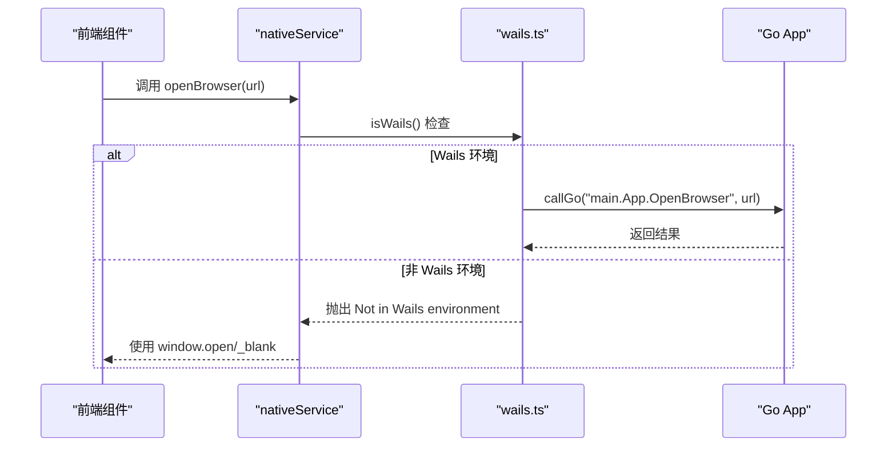
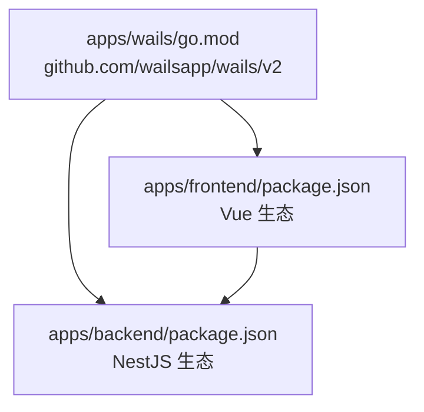

# Wails 框架基础

<cite>
**本文引用的文件**
- [apps/wails/main.go](file://apps/wails/main.go)
- [apps/wails/app.go](file://apps/wails/app.go)
- [apps/wails/wails.json](file://apps/wails/wails.json)
- [apps/wails/go.mod](file://apps/wails/go.mod)
- [apps/frontend/src/lib/wails.ts](file://apps/frontend/src/lib/wails.ts)
- [apps/frontend/src/services/native.ts](file://apps/frontend/src/services/native.ts)
- [apps/frontend/src/App.vue](file://apps/frontend/src/App.vue)
- [apps/frontend/src/styles/base.css](file://apps/frontend/src/styles/base.css)
- [apps/frontend/vite.config.mts](file://apps/frontend/vite.config.mts)
- [apps/frontend/index.html](file://apps/frontend/index.html)
- [apps/backend/src/main.ts](file://apps/backend/src/main.ts)
- [apps/backend/package.json](file://apps/backend/package.json)
- [apps/backend/nest-cli.json](file://apps/backend/nest-cli.json)
- [apps/frontend/package.json](file://apps/frontend/package.json)
</cite>

## 目录
1. [简介](#简介)
2. [项目结构](#项目结构)
3. [核心组件](#核心组件)
4. [架构总览](#架构总览)
5. [详细组件分析](#详细组件分析)
6. [依赖分析](#依赖分析)
7. [性能考虑](#性能考虑)
8. [故障排查指南](#故障排查指南)
9. [结论](#结论)
10. [附录](#附录)

## 简介
本文件面向希望基于 Wails 框架进行桌面应用开发的工程师与产品团队，系统讲解 Wails 混合开发模式（Go 后端 + Vue 前端）在本项目中的落地实践。内容涵盖应用初始化流程、菜单系统配置、窗口管理、嵌入式资源与资产服务器、跨平台兼容性（Windows Mica 与 macOS TitleBar）、应用生命周期钩子（OnStartup/OnShutdown）、Wails 配置项详解以及平台特定配置与常见配置模式。

## 项目结构
本仓库采用多包工作区组织，Wails 应用位于 apps/wails，前端位于 apps/frontend，后端位于 apps/backend。Wails 应用通过嵌入式资源将前端构建产物打包进可执行文件，实现“单文件”分发；前端通过 Vite 构建并在 Wails 模式下以相对路径访问资源；后端使用 NestJS 提供 API 服务并与前端通过代理联调。

图表来源
- [apps/wails/main.go:1-95](file://apps/wails/main.go#L1-L95)
- [apps/wails/app.go:1-168](file://apps/wails/app.go#L1-L168)
- [apps/wails/wails.json:1-22](file://apps/wails/wails.json#L1-L22)
- [apps/wails/go.mod:1-38](file://apps/wails/go.mod#L1-L38)
- [apps/frontend/src/main.ts:1-138](file://apps/frontend/src/main.ts#L1-L138)
- [apps/frontend/src/lib/wails.ts:1-92](file://apps/frontend/src/lib/wails.ts#L1-L92)
- [apps/frontend/src/services/native.ts:52-115](file://apps/frontend/src/services/native.ts#L52-L115)
- [apps/frontend/src/App.vue:25-76](file://apps/frontend/src/App.vue#L25-L76)
- [apps/frontend/src/styles/base.css:45-88](file://apps/frontend/src/styles/base.css#L45-L88)
- [apps/frontend/vite.config.mts:1-185](file://apps/frontend/vite.config.mts#L1-L185)
- [apps/frontend/index.html:1-39](file://apps/frontend/index.html#L1-L39)
- [apps/backend/src/main.ts:1-201](file://apps/backend/src/main.ts#L1-L201)
- [apps/backend/package.json:1-108](file://apps/backend/package.json#L1-L108)
- [apps/backend/nest-cli.json:1-11](file://apps/backend/nest-cli.json#L1-L11)

章节来源
- [apps/wails/main.go:1-95](file://apps/wails/main.go#L1-L95)
- [apps/frontend/vite.config.mts:1-185](file://apps/frontend/vite.config.mts#L1-L185)
- [apps/backend/src/main.ts:1-201](file://apps/backend/src/main.ts#L1-L201)

## 核心组件
- Wails 应用入口与配置
  - 应用入口负责创建 App 实例、准备菜单、配置窗口属性、启用资产服务器、绑定 Go 方法到前端、设置平台特定选项，并启动 Wails 运行时。
  - 关键点：嵌入式资源提取、菜单系统、窗口尺寸与透明度、平台特性（Windows Mica、macOS TitleBar 隐藏式）。
- Go 侧 App 结构体
  - 提供生命周期钩子（startup/shutdown）、系统交互方法（消息对话框、打开浏览器、退出应用、窗口最小化/显示、迷你模式、通知事件）。
- 前端 Wails 工具与原生服务
  - 提供 isWails 检测、callGo 方法调用封装、常用系统操作封装（system），以及前端统一原生服务（nativeService）适配不同平台（Wails/Capacitor/Web）。
- 嵌入式资源与资产服务器
  - 将前端构建产物打包进 Go 二进制，通过 AssetServer 在运行时提供静态资源，支持开发与生产两种模式。
- 后端 API 服务
  - NestJS 提供 REST API、Swagger 文档、安全中间件、CSRF/XSS/Gzip 等防护，以及优雅关闭钩子。

章节来源
- [apps/wails/main.go:20-94](file://apps/wails/main.go#L20-L94)
- [apps/wails/app.go:12-168](file://apps/wails/app.go#L12-L168)
- [apps/frontend/src/lib/wails.ts:19-92](file://apps/frontend/src/lib/wails.ts#L19-L92)
- [apps/frontend/src/services/native.ts:52-115](file://apps/frontend/src/services/native.ts#L52-L115)

## 架构总览
Wails 混合架构由三部分组成：Go 层负责系统级能力与窗口控制，Vue 前端负责用户界面与业务逻辑，NestJS 后端提供 API 与数据服务。Wails 将前端静态资源嵌入 Go 可执行文件并通过内置 WebView 渲染，前端通过 window.go 与 Go 方法桥接通信。

图表来源
- [apps/wails/main.go:20-94](file://apps/wails/main.go#L20-L94)
- [apps/wails/app.go:12-168](file://apps/wails/app.go#L12-L168)
- [apps/frontend/src/main.ts:1-138](file://apps/frontend/src/main.ts#L1-L138)
- [apps/frontend/src/lib/wails.ts:19-92](file://apps/frontend/src/lib/wails.ts#L19-L92)
- [apps/frontend/src/services/native.ts:52-115](file://apps/frontend/src/services/native.ts#L52-L115)
- [apps/frontend/src/App.vue:25-76](file://apps/frontend/src/App.vue#L25-L76)
- [apps/frontend/src/styles/base.css:45-88](file://apps/frontend/src/styles/base.css#L45-L88)
- [apps/backend/src/main.ts:1-201](file://apps/backend/src/main.ts#L1-L201)

## 详细组件分析

### 应用初始化流程（Wails）
- 资源嵌入与提取
  - 使用 go:embed 将前端构建目录打包进二进制，运行时通过 fs.Sub 提取 frontend/dist 子树作为资产源。
- 菜单系统
  - 条件添加 macOS 标准 Application 菜单与 Edit 菜单；自定义 File 菜单包含“切换窗口”“退出”等命令，并绑定回调。
- 窗口与外观
  - 设置标题、初始宽高、最小宽高、是否可调整大小、全屏、无边框、启动时隐藏、关闭时是否隐藏窗口、背景色（RGBA）。
- 资产服务器
  - 通过 AssetServer.Options 指定 Assets 为提取出的前端资源，使 WebView 可直接加载。
- 生命周期钩子
  - OnStartup：保存上下文以便后续调用 Wails Runtime API。
  - OnShutdown：清理上下文。
- 平台特定选项
  - Windows：Webview/窗口透明、Mica 背景、窗口图标。
  - macOS：隐藏式标题栏、Webview/窗口透明、About 信息。
- 绑定 Go 方法
  - 将 App 实例绑定到前端，使其可通过 window.go 访问。

图表来源
- [apps/wails/main.go:20-94](file://apps/wails/main.go#L20-L94)
- [apps/wails/app.go:22-34](file://apps/wails/app.go#L22-L34)

章节来源
- [apps/wails/main.go:20-94](file://apps/wails/main.go#L20-L94)
- [apps/wails/app.go:22-34](file://apps/wails/app.go#L22-L34)

### 菜单系统配置
- macOS 标准菜单：在 macOS 上自动追加 Application 菜单与 Edit 菜单，提升原生体验。
- 自定义 File 菜单：包含“切换窗口”“退出”，并绑定快捷键 CmdOrCtrl+K/Q。
- 菜单回调：通过回调函数调用 App.ToggleWindow()/App.Quit()，实现窗口可见性与退出控制。

章节来源
- [apps/wails/main.go:32-49](file://apps/wails/main.go#L32-L49)
- [apps/wails/app.go:84-90](file://apps/wails/app.go#L84-L90)

### 窗口管理与迷你模式
- 窗口尺寸与位置
  - 支持设置窗口初始宽高、最小宽高、是否可调整大小、全屏、无边框等。
  - 通过 runtime.WindowSetSize/WindowCenter/WindowSetPosition 等 API 控制窗口尺寸与位置。
- 迷你模式（Pomodoro 小组件）
  - 设置固定尺寸（如 220x180）、置顶、吸附到主屏幕右上角（带边距）。
  - 退出迷你模式时恢复默认尺寸、取消置顶并居中。
- 窗口可见性切换
  - 最小化/还原/显示/隐藏组合，配合置顶状态切换，实现“悬浮窗”效果。

图表来源
- [apps/wails/app.go:112-140](file://apps/wails/app.go#L112-L140)
- [apps/wails/app.go:92-104](file://apps/wails/app.go#L92-L104)
- [apps/wails/app.go:106-110](file://apps/wails/app.go#L106-L110)

章节来源
- [apps/wails/app.go:112-140](file://apps/wails/app.go#L112-L140)
- [apps/wails/app.go:142-156](file://apps/wails/app.go#L142-L156)

### 嵌入式资源管理与资产服务器
- 资源打包
  - go:embed 将 frontend/dist 整体打包进二进制，运行时通过 fs.Sub 提取子树。
- 资产服务器
  - 通过 AssetServer.Options.Assets 指定资源根，Wails 内置服务器提供静态资源。
- 前端构建与 Wails 模式
  - Vite 配置中识别 WAILS=true，使用相对路径 base，确保在嵌入式环境中正确加载资源。
- HTML 入口
  - index.html 中设置 viewport、主题色、预连接与图标，保证首屏与 PWA 行为一致。

章节来源
- [apps/wails/main.go:17-29](file://apps/wails/main.go#L17-L29)
- [apps/wails/main.go:64-66](file://apps/wails/main.go#L64-L66)
- [apps/frontend/vite.config.mts:12-21](file://apps/frontend/vite.config.mts#L12-L21)
- [apps/frontend/index.html:1-39](file://apps/frontend/index.html#L1-L39)

### 跨平台兼容性（Windows 与 macOS）
- Windows
  - Webview/窗口透明、Mica 背景、窗口图标开关。
- macOS
  - 隐藏式标题栏、Webview/窗口透明、About 信息。
- 前端拖拽区域
  - 在 macOS 隐藏式标题栏下，通过 Wails 拖拽区域实现窗口拖拽；同时提供样式类与 CSS 变量控制拖拽行为。

章节来源
- [apps/wails/main.go:72-88](file://apps/wails/main.go#L72-L88)
- [apps/frontend/src/App.vue:35-76](file://apps/frontend/src/App.vue#L35-L76)
- [apps/frontend/src/styles/base.css:45-70](file://apps/frontend/src/styles/base.css#L45-L70)

### 应用生命周期钩子（OnStartup/OnShutdown）
- OnStartup
  - 保存上下文，后续可调用 Wails Runtime API（消息对话框、打开浏览器、窗口操作、事件发射等）。
- OnShutdown
  - 清理上下文，释放资源。

章节来源
- [apps/wails/app.go:22-30](file://apps/wails/app.go#L22-L30)
- [apps/wails/main.go:67-68](file://apps/wails/main.go#L67-L68)

### Wails 配置选项详解
- 基础窗口属性
  - 标题、宽度、高度、最小宽高、禁用调整大小、全屏、无边框、启动时隐藏、关闭时隐藏窗口。
- 背景色
  - RGBA 背景色，支持透明背景。
- 资产服务器
  - 指定 Assets 为嵌入式资源子树。
- 生命周期
  - OnStartup、OnShutdown。
- 平台特定
  - Windows：WebviewIsTransparent、WindowIsTranslucent、BackdropType(Mica)、DisableWindowIcon。
  - macOS：TitleBar(隐藏式)、WebviewIsTransparent、WindowIsTranslucent、About。

章节来源
- [apps/wails/main.go:51-89](file://apps/wails/main.go#L51-L89)

### 前端与 Go 的桥接（Wails 运行时）
- 环境检测
  - isWails：判断是否存在 window.go，用于区分 Wails、Capacitor 与 Web 环境。
- 方法调用封装
  - callGo：按点号路径解析 window.go 对象链，最终调用对应函数，返回 Promise。
- 常用系统操作
  - system：封装信息/错误对话框、打开浏览器、退出应用、设置迷你模式、切换最大化。
- 原生服务抽象
  - nativeService：统一封装不同平台下的系统能力，Wails 下委托 system，Capacitor 下使用本地插件，Web 下回退到浏览器行为。

图表来源
- [apps/frontend/src/services/native.ts:81-86](file://apps/frontend/src/services/native.ts#L81-L86)
- [apps/frontend/src/lib/wails.ts:19-52](file://apps/frontend/src/lib/wails.ts#L19-L52)
- [apps/wails/app.go:65-82](file://apps/wails/app.go#L65-L82)

章节来源
- [apps/frontend/src/lib/wails.ts:19-92](file://apps/frontend/src/lib/wails.ts#L19-L92)
- [apps/frontend/src/services/native.ts:52-115](file://apps/frontend/src/services/native.ts#L52-L115)
- [apps/wails/app.go:65-82](file://apps/wails/app.go#L65-L82)

### 后端 API 服务与安全
- CORS 与安全头
  - 动态配置 CORS 源，支持本地开发与 Wails 环境；Helmet 提供 CSP、COEP 等安全头。
- CSRF/XSS/Gzip
  - 请求钩子校验 X-Requested-With，XSS 清理与 Gzip 压缩。
- Swagger 文档
  - 生成并暴露 API 文档，便于调试与联调。
- 优雅关闭
  - 启用关闭钩子，处理 SIGINT/SIGTERM。

章节来源
- [apps/backend/src/main.ts:48-121](file://apps/backend/src/main.ts#L48-L121)
- [apps/backend/src/main.ts:171-180](file://apps/backend/src/main.ts#L171-L180)
- [apps/backend/src/main.ts:182-195](file://apps/backend/src/main.ts#L182-L195)

## 依赖分析
- Wails 应用依赖
  - go.mod 指定 wailsapp/wails/v2 版本，提供菜单、选项、运行时 API。
- 前端依赖
  - Vue 3、Pinia、Vue Router、TanStack Vue Query、ECharts、TailwindCSS 等生态库。
- 后端依赖
  - NestJS、Fastify、Helmet、CSRF/XSS/Gzip、Swagger、Prisma 等。

图表来源
- [apps/wails/go.mod:7](file://apps/wails/go.mod#L7)
- [apps/frontend/package.json:30-69](file://apps/frontend/package.json#L30-L69)
- [apps/backend/package.json:30-85](file://apps/backend/package.json#L30-L85)

章节来源
- [apps/wails/go.mod:1-38](file://apps/wails/go.mod#L1-L38)
- [apps/frontend/package.json:1-104](file://apps/frontend/package.json#L1-L104)
- [apps/backend/package.json:1-108](file://apps/backend/package.json#L1-L108)

## 性能考虑
- 前端构建优化
  - Vite 启用 gzip 与 brotli 压缩，手动分包策略减少大依赖重复打包。
  - chunkSizeWarningLimit 调整阈值，避免过大模块影响加载。
- 资源加载
  - 嵌入式资源减少网络请求，降低冷启动延迟。
- 后端性能
  - Gzip 压缩与限流中间件，合理设置上传大小与文件数上限。
- Wails 窗口渲染
  - 透明/半透明窗口可能带来额外 GPU 开销，建议仅在必要场景启用。

章节来源
- [apps/frontend/vite.config.mts:80-184](file://apps/frontend/vite.config.mts#L80-L184)
- [apps/backend/src/main.ts:101-113](file://apps/backend/src/main.ts#L101-L113)

## 故障排查指南
- 前端资源 404（Wails 模式）
  - 确认 Vite base 使用相对路径（WAILS=true），且构建产物复制到 apps/wails/frontend/dist。
- 菜单无效或快捷键不生效
  - 检查菜单创建顺序与回调绑定，确认 macOS 条件分支已启用。
- 窗口尺寸/位置异常
  - 迷你模式计算依赖主屏信息，若无主屏则回退至首个屏幕；检查屏幕枚举与坐标计算。
- 无法调用 Go 方法
  - 确认 isWails 返回 true，且 window.go 对象存在；检查方法路径与参数类型。
- 后端接口不可达
  - 检查 CORS 配置与代理设置，确保 /api 与 WebSocket 路由代理到后端。

章节来源
- [apps/frontend/vite.config.mts:12-21](file://apps/frontend/vite.config.mts#L12-L21)
- [apps/wails/main.go:32-49](file://apps/wails/main.go#L32-L49)
- [apps/wails/app.go:92-140](file://apps/wails/app.go#L92-L140)
- [apps/frontend/src/lib/wails.ts:19-52](file://apps/frontend/src/lib/wails.ts#L19-L52)
- [apps/backend/src/main.ts:48-63](file://apps/backend/src/main.ts#L48-L63)

## 结论
本项目完整展示了 Wails 混合开发的工程化实践：Go 负责系统能力与窗口控制，Vue 负责界面与交互，NestJS 提供稳定 API 与安全防护。通过嵌入式资源与资产服务器实现“单文件”分发，结合平台特定配置（Windows Mica、macOS 隐藏式标题栏）与生命周期钩子，形成可维护、可扩展的桌面应用架构。建议在后续迭代中持续优化资源体积、完善测试与可观测性，并保持前后端接口契约稳定。

## 附录
- 常见配置模式
  - Wails 模式构建：在前端脚本中设置 WAILS=true 并复制 dist 到 apps/wails/frontend/dist。
  - 菜单与快捷键：遵循平台规范，macOS 添加标准菜单，Windows 使用 Ctrl/Cmd 组合。
  - 窗口透明与背景：按需开启透明/半透明，注意性能与视觉一致性。
  - 资产服务器：确保 AssetServer.Assets 指向正确的嵌入式资源子树。
- 平台差异提示
  - macOS 隐藏式标题栏需要额外的拖拽区域与样式控制。
  - Windows Mica 需要合适的背景色与透明度以获得最佳视觉效果。