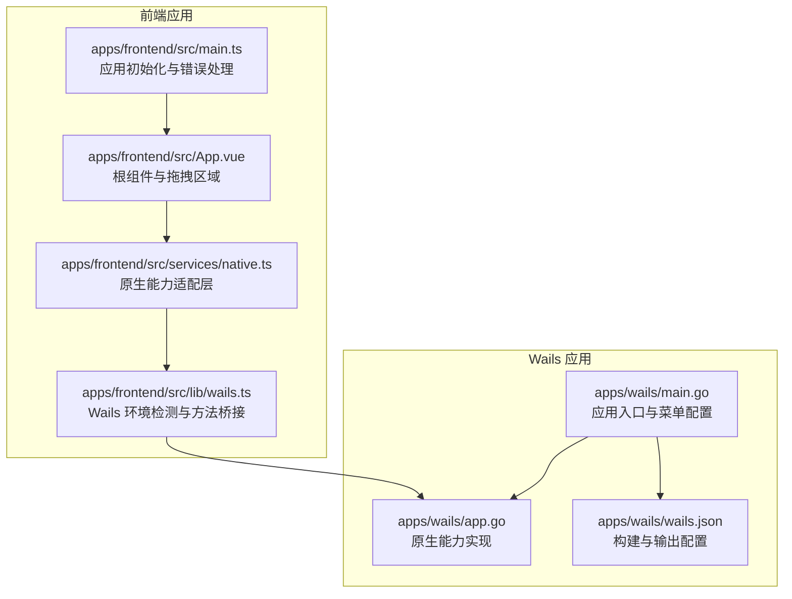
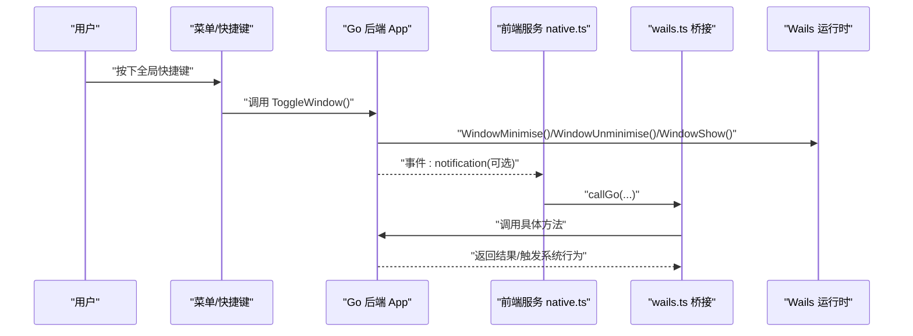
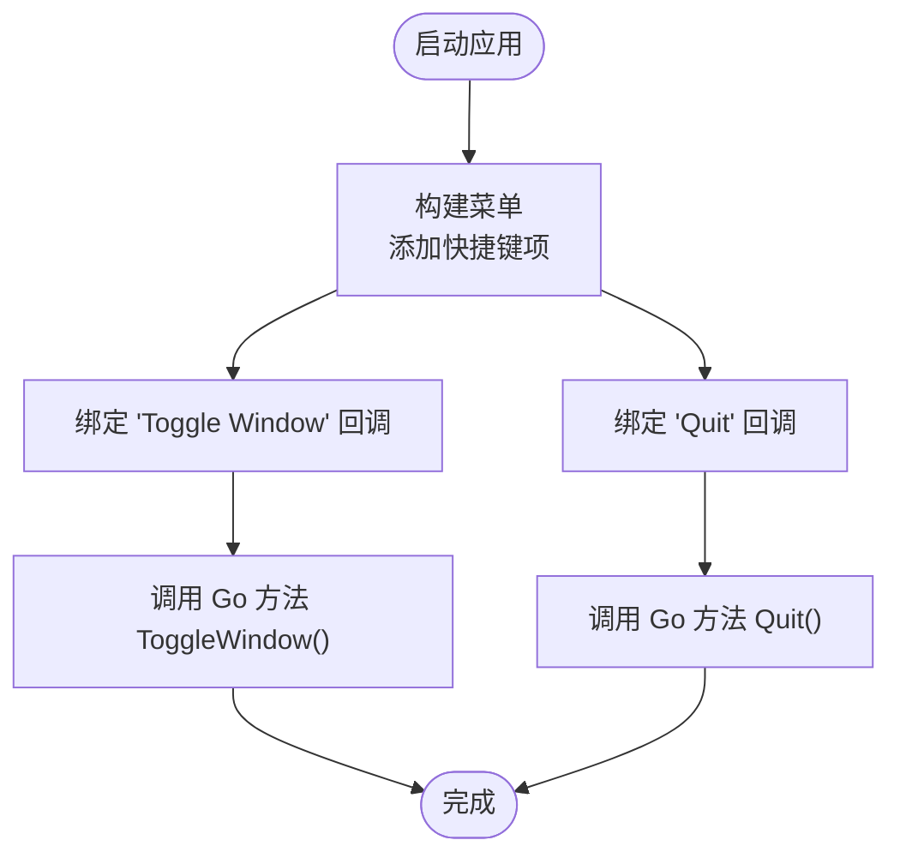
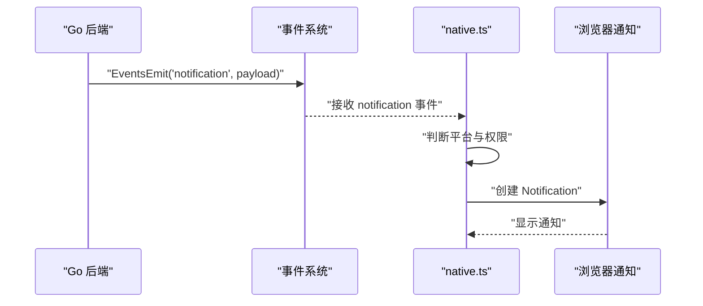
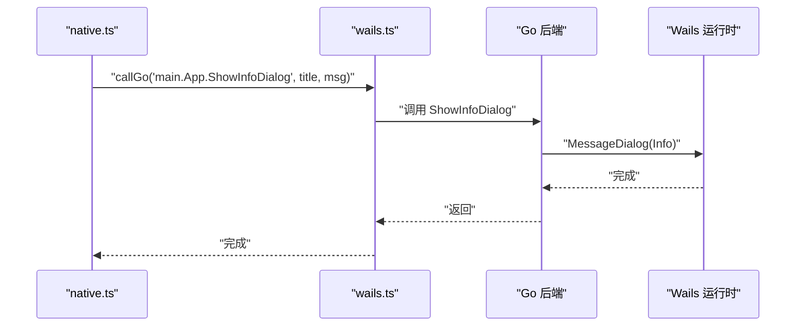
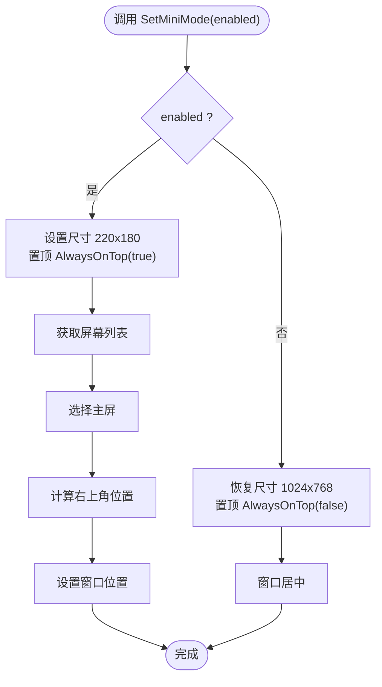
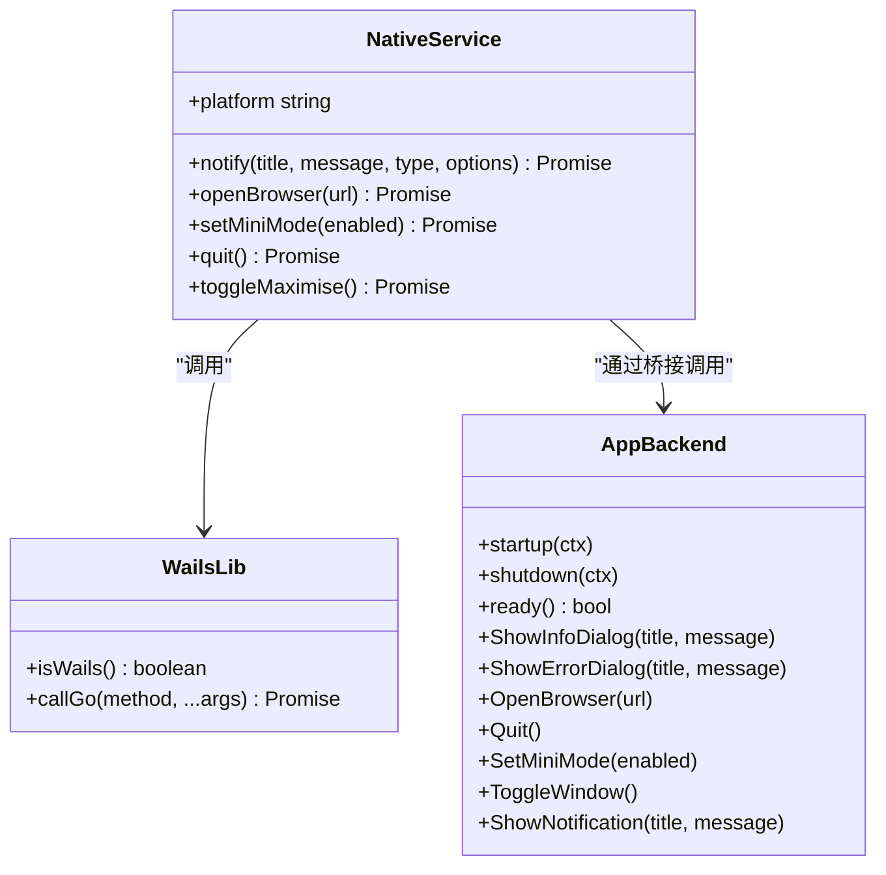
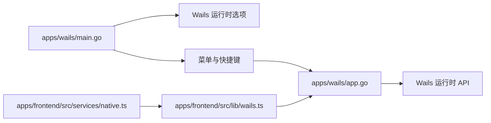

# 原生功能集成

<cite>
**本文档引用的文件**
- [apps/wails/app.go](file://apps/wails/app.go)
- [apps/wails/main.go](file://apps/wails/main.go)
- [apps/wails/wails.json](file://apps/wails/wails.json)
- [apps/frontend/src/lib/wails.ts](file://apps/frontend/src/lib/wails.ts)
- [apps/frontend/src/services/native.ts](file://apps/frontend/src/services/native.ts)
- [apps/frontend/src/App.vue](file://apps/frontend/src/App.vue)
- [apps/frontend/src/main.ts](file://apps/frontend/src/main.ts)
</cite>

## 目录
1. [简介](#简介)
2. [项目结构](#项目结构)
3. [核心组件](#核心组件)
4. [架构总览](#架构总览)
5. [详细组件分析](#详细组件分析)
6. [依赖分析](#依赖分析)
7. [性能考量](#性能考量)
8. [故障排查指南](#故障排查指南)
9. [结论](#结论)
10. [附录](#附录)

## 简介
本指南面向在 Wails 应用中集成原生功能的开发者，围绕以下目标展开：系统托盘、全局快捷键绑定、文件系统访问、剪贴板操作、系统通知、对话框、窗口控制（最小化、隐藏显示、全屏切换）、与前端 Vue.js 组件的通信桥接机制、权限管理与安全注意事项，以及跨平台差异与兼容性处理。本文以仓库现有实现为基础，结合架构图与流程图，帮助读者快速落地并扩展原生能力。

## 项目结构
本项目采用“后端 Go + 前端 Vue + 跨平台打包”的分层架构。Wails 后端负责系统级能力与窗口控制，前端通过统一的服务层进行调用，同时保留 Capacitor 能力以便未来扩展移动端或混合场景。

图表来源
- [apps/wails/main.go:20-95](file://apps/wails/main.go#L20-L95)
- [apps/wails/app.go:12-168](file://apps/wails/app.go#L12-L168)
- [apps/wails/wails.json:1-22](file://apps/wails/wails.json#L1-L22)
- [apps/frontend/src/main.ts:54-138](file://apps/frontend/src/main.ts#L54-L138)
- [apps/frontend/src/App.vue:16-28](file://apps/frontend/src/App.vue#L16-L28)
- [apps/frontend/src/lib/wails.ts:22-92](file://apps/frontend/src/lib/wails.ts#L22-L92)
- [apps/frontend/src/services/native.ts:9-116](file://apps/frontend/src/services/native.ts#L9-L116)

章节来源
- [apps/wails/main.go:20-95](file://apps/wails/main.go#L20-L95)
- [apps/frontend/src/main.ts:54-138](file://apps/frontend/src/main.ts#L54-L138)

## 核心组件
- Wails 后端服务（Go）：提供系统对话框、浏览器打开、窗口尺寸/位置/置顶、屏幕信息、事件发射等能力，并通过菜单绑定全局快捷键。
- 前端桥接层（TypeScript）：封装 Wails 环境检测、方法调用与参数传递；提供统一的原生能力适配层，支持 Wails、Capacitor 与 Web 三态。
- 架构特性：通过菜单系统实现全局快捷键；通过事件发射实现通知；通过窗口 API 实现窗口控制；通过浏览器打开实现外部链接。

章节来源
- [apps/wails/app.go:41-168](file://apps/wails/app.go#L41-L168)
- [apps/wails/main.go:32-89](file://apps/wails/main.go#L32-L89)
- [apps/frontend/src/lib/wails.ts:22-92](file://apps/frontend/src/lib/wails.ts#L22-L92)
- [apps/frontend/src/services/native.ts:9-116](file://apps/frontend/src/services/native.ts#L9-L116)

## 架构总览
Wails 应用通过菜单绑定全局快捷键，调用后端 Go 方法；前端通过统一服务层调用后端能力，实现对话框、通知、窗口控制等功能。事件发射用于通知展示，浏览器打开用于外部链接跳转。

图表来源
- [apps/wails/main.go:40-46](file://apps/wails/main.go#L40-L46)
- [apps/wails/app.go:142-156](file://apps/wails/app.go#L142-L156)
- [apps/frontend/src/services/native.ts:9-116](file://apps/frontend/src/services/native.ts#L9-L116)
- [apps/frontend/src/lib/wails.ts:29-52](file://apps/frontend/src/lib/wails.ts#L29-L52)

## 详细组件分析

### 系统托盘（System Tray）
- 当前实现：未发现系统托盘相关代码。
- 推荐做法：
  - 使用系统托盘库（如第三方 GUI 库）在桌面端实现托盘图标与菜单。
  - 通过事件发射向前端推送状态变更，前端据此更新 UI。
  - 注意跨平台差异：Windows、macOS、Linux 的托盘 API 与图标规范不同。
- 安全与权限：
  - 避免在托盘中放置敏感操作入口。
  - 对托盘菜单项进行权限校验，防止越权操作。

[本节为概念性建议，不直接分析具体文件，故不附加章节来源]

### 全局快捷键绑定（Global Shortcuts）
- 实现位置：应用菜单中定义快捷键与回调。
- 示例要点：
  - macOS 使用 CmdOrCtrl 组合键。
  - 绑定“切换窗口”“退出应用”等常用操作。
  - 回调直接调用后端 Go 方法，确保上下文可用。
- 可扩展点：
  - 将快捷键映射表集中管理，便于国际化与热键冲突检测。
  - 支持动态启用/禁用快捷键，避免与系统快捷键冲突。

图表来源
- [apps/wails/main.go:32-46](file://apps/wails/main.go#L32-L46)
- [apps/wails/app.go:142-156](file://apps/wails/app.go#L142-L156)

章节来源
- [apps/wails/main.go:32-46](file://apps/wails/main.go#L32-L46)
- [apps/wails/app.go:142-156](file://apps/wails/app.go#L142-L156)

### 文件系统访问（File System Access）
- 当前实现：未发现直接的文件系统读写或选择器调用。
- 推荐做法：
  - 使用系统文件对话框（如 Go 的系统对话框库）实现“打开/保存”。
  - 前端通过服务层发起请求，后端返回路径或内容。
  - 对路径进行白名单与沙箱策略，避免任意路径访问。
- 安全与权限：
  - 严格校验文件路径与 MIME 类型。
  - 对外部挂载点与网络路径进行限制。

[本节为概念性建议，不直接分析具体文件，故不附加章节来源]

### 剪贴板操作（Clipboard）
- 当前实现：未发现剪贴板相关代码。
- 推荐做法：
  - 在后端提供复制/粘贴方法，前端通过服务层调用。
  - 跨平台注意：不同系统对剪贴板格式的支持差异较大。
- 安全与权限：
  - 避免自动复制敏感信息。
  - 对粘贴内容进行二次校验与脱敏。

[本节为概念性建议，不直接分析具体文件，故不附加章节来源]

### 系统通知（System Notifications）
- 实现位置：后端通过事件发射通知；前端通过服务层统一处理。
- 流程要点：
  - 后端发射事件携带标题与消息。
  - 前端服务根据平台选择系统通知或浏览器通知。
  - Web 平台需处理权限申请与焦点判断。
- 可扩展点：
  - 支持本地通知（Capacitor LocalNotifications）与深色模式适配。

图表来源
- [apps/wails/app.go:158-168](file://apps/wails/app.go#L158-L168)
- [apps/frontend/src/services/native.ts:22-58](file://apps/frontend/src/services/native.ts#L22-L58)

章节来源
- [apps/wails/app.go:158-168](file://apps/wails/app.go#L158-L168)
- [apps/frontend/src/services/native.ts:22-58](file://apps/frontend/src/services/native.ts#L22-L58)

### 对话框（Dialogs）
- 实现位置：后端提供信息/错误对话框方法；前端通过服务层统一调用。
- 流程要点：
  - 后端使用运行时对话框 API。
  - 前端服务封装错误与信息两类对话框。
  - Web 平台降级为浏览器警告或日志输出。

图表来源
- [apps/frontend/src/services/native.ts:22-33](file://apps/frontend/src/services/native.ts#L22-L33)
- [apps/frontend/src/lib/wails.ts:29-52](file://apps/frontend/src/lib/wails.ts#L29-L52)
- [apps/wails/app.go:41-63](file://apps/wails/app.go#L41-L63)

章节来源
- [apps/frontend/src/services/native.ts:22-33](file://apps/frontend/src/services/native.ts#L22-L33)
- [apps/frontend/src/lib/wails.ts:29-52](file://apps/frontend/src/lib/wails.ts#L29-L52)
- [apps/wails/app.go:41-63](file://apps/wails/app.go#L41-L63)

### 窗口控制（最小化、隐藏显示、全屏切换）
- 实现位置：后端提供窗口控制方法；前端通过服务层统一调用。
- 功能要点：
  - 最小化/还原/显示/置顶/居中/尺寸调整。
  - 屏幕信息获取与主屏定位。
  - 双击拖拽区域实现最大化切换（macOS 隐藏标题栏模式）。
- 可扩展点：
  - 全屏切换与多显示器支持。
  - 窗口动画与过渡效果。

图表来源
- [apps/wails/app.go:112-140](file://apps/wails/app.go#L112-L140)
- [apps/frontend/src/App.vue:25-27](file://apps/frontend/src/App.vue#L25-L27)

章节来源
- [apps/wails/app.go:112-140](file://apps/wails/app.go#L112-L140)
- [apps/frontend/src/App.vue:25-27](file://apps/frontend/src/App.vue#L25-L27)

### 与前端 Vue.js 组件的通信桥接机制
- 环境检测：统一检测是否在 Wails 环境中，避免在 Web/Capacitor 环境误调用。
- 方法调用：通过 window.go 递归解析方法路径并调用，支持异步返回。
- 事件桥接：后端通过事件系统向前端发送通知，前端订阅并渲染。
- 平台适配：统一服务层根据平台返回不同实现（Wails/Capacitor/Web）。

图表来源
- [apps/frontend/src/lib/wails.ts:22-92](file://apps/frontend/src/lib/wails.ts#L22-L92)
- [apps/frontend/src/services/native.ts:9-116](file://apps/frontend/src/services/native.ts#L9-L116)
- [apps/wails/app.go:24-168](file://apps/wails/app.go#L24-L168)

章节来源
- [apps/frontend/src/lib/wails.ts:22-92](file://apps/frontend/src/lib/wails.ts#L22-L92)
- [apps/frontend/src/services/native.ts:9-116](file://apps/frontend/src/services/native.ts#L9-L116)
- [apps/wails/app.go:24-168](file://apps/wails/app.go#L24-L168)

### 权限管理与安全考虑
- 环境检测：在调用任何原生能力前，必须确认运行环境（Wails/Capacitor/Web）。
- 输入校验：对外部输入（URL、路径、消息）进行合法性与协议校验。
- 事件与对话框：仅在必要时弹出系统级提示，避免打扰用户体验。
- 资源访问：对文件系统与网络资源访问进行白名单与沙箱策略。
- 错误处理：统一捕获前端与全局错误，避免泄露内部细节。

章节来源
- [apps/frontend/src/lib/wails.ts:30-52](file://apps/frontend/src/lib/wails.ts#L30-L52)
- [apps/frontend/src/main.ts:82-113](file://apps/frontend/src/main.ts#L82-L113)
- [apps/wails/app.go:66-82](file://apps/wails/app.go#L66-L82)

### 不同操作系统下的原生功能差异与兼容性处理
- macOS：
  - 隐藏标题栏模式下，需要自定义拖拽区域。
  - 菜单栏与快捷键遵循系统规范。
  - 通知权限与外观适配。
- Windows：
  - 透明与半透明窗口效果受系统版本影响。
  - 快捷键与菜单行为与 macOS 差异较大。
- Linux：
  - 托盘与通知支持因桌面环境而异。
  - 建议提供降级方案与用户提示。

章节来源
- [apps/wails/main.go:72-88](file://apps/wails/main.go#L72-L88)
- [apps/frontend/src/App.vue:35-47](file://apps/frontend/src/App.vue#L35-L47)

## 依赖分析
- 应用入口依赖菜单与运行时选项，后端通过运行时 API 实现系统能力。
- 前端服务层依赖桥接层与运行时 API，实现跨平台适配。
- 事件系统用于后端到前端的通知通道。

图表来源
- [apps/wails/main.go:51-89](file://apps/wails/main.go#L51-L89)
- [apps/wails/app.go:41-168](file://apps/wails/app.go#L41-L168)
- [apps/frontend/src/services/native.ts:9-116](file://apps/frontend/src/services/native.ts#L9-L116)
- [apps/frontend/src/lib/wails.ts:22-92](file://apps/frontend/src/lib/wails.ts#L22-L92)

章节来源
- [apps/wails/main.go:51-89](file://apps/wails/main.go#L51-L89)
- [apps/wails/app.go:41-168](file://apps/wails/app.go#L41-L168)
- [apps/frontend/src/services/native.ts:9-116](file://apps/frontend/src/services/native.ts#L9-L116)
- [apps/frontend/src/lib/wails.ts:22-92](file://apps/frontend/src/lib/wails.ts#L22-L92)

## 性能考量
- 事件发射频率控制：避免高频通知导致 UI 卡顿。
- 窗口尺寸与置顶操作：批量操作时减少重复调用，合并为一次调用。
- 资源加载：前端按需加载模块，避免不必要的初始化。
- 错误处理：统一错误上报与降级策略，减少异常分支对主线程的影响。

[本节提供通用指导，不直接分析具体文件，故不附加章节来源]

## 故障排查指南
- 无法调用后端方法：
  - 检查是否在 Wails 环境中（isWails）。
  - 确认方法路径正确且已通过 Bind 暴露。
- 对话框不显示：
  - 检查运行时上下文是否已准备（ready）。
  - 确认传入的标题与消息非空。
- 通知未显示：
  - Web 平台需确认浏览器通知权限与焦点状态。
  - Wails 平台检查事件发射与前端订阅。
- 窗口控制无效：
  - 确认窗口未被系统策略限制（如 AlwaysOnTop）。
  - 检查屏幕信息获取与主屏选择逻辑。

章节来源
- [apps/frontend/src/lib/wails.ts:30-52](file://apps/frontend/src/lib/wails.ts#L30-L52)
- [apps/wails/app.go:42-90](file://apps/wails/app.go#L42-L90)
- [apps/frontend/src/services/native.ts:22-58](file://apps/frontend/src/services/native.ts#L22-L58)

## 结论
本项目已具备完善的菜单与快捷键、窗口控制、系统对话框与通知的基础能力。建议后续补充系统托盘、文件系统访问、剪贴板与浏览器打开等能力，并通过统一服务层实现跨平台一致性。在扩展过程中，务必重视权限与安全、错误处理与性能优化，并针对不同平台进行充分测试与适配。

## 附录
- 构建与输出配置参考：Wails 配置文件用于定义前端目录、安装命令、开发服务器地址与生成的 JS 目录。
- 前端入口：应用初始化、错误处理与全局插件注册，确保在不同平台下稳定运行。

章节来源
- [apps/wails/wails.json:1-22](file://apps/wails/wails.json#L1-L22)
- [apps/frontend/src/main.ts:54-138](file://apps/frontend/src/main.ts#L54-L138)