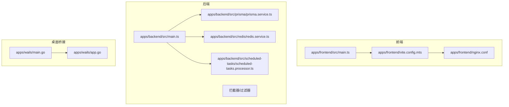
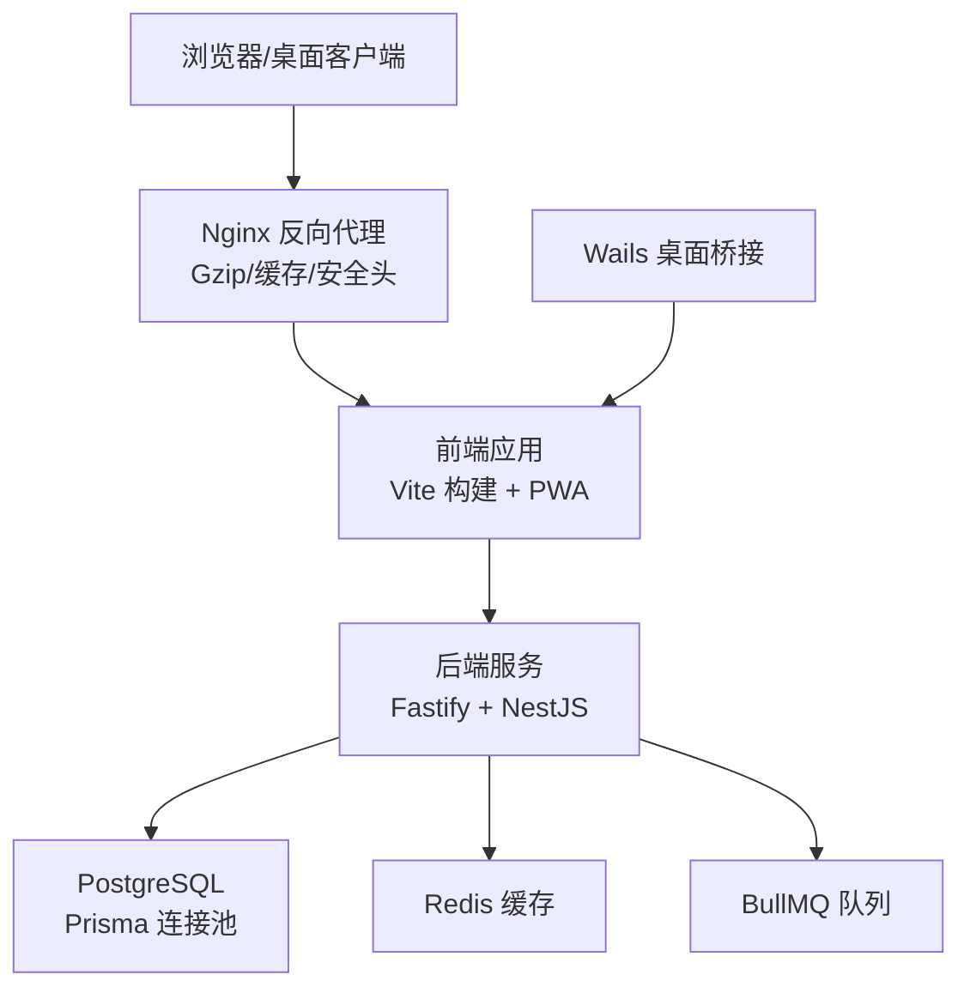
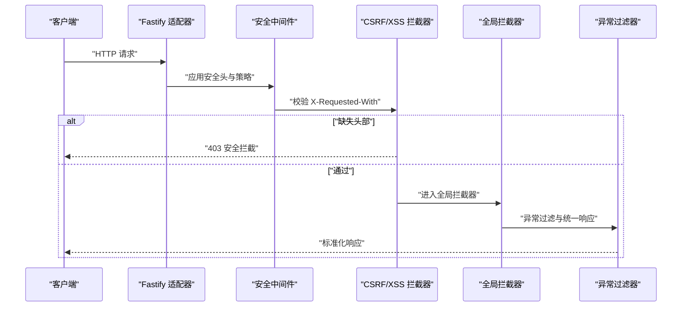
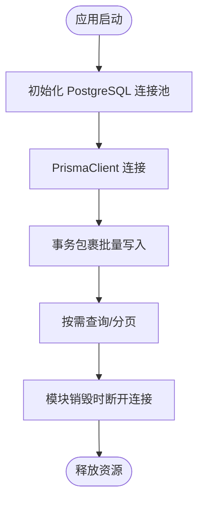
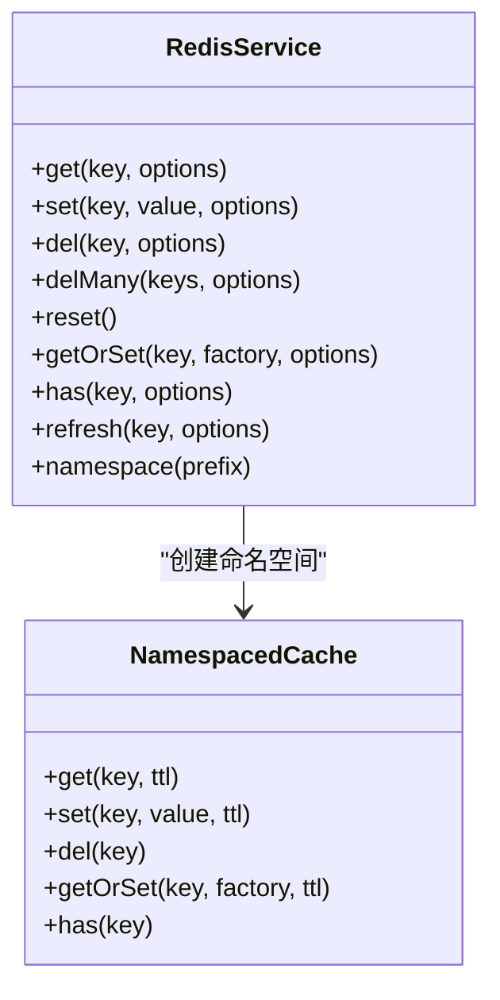
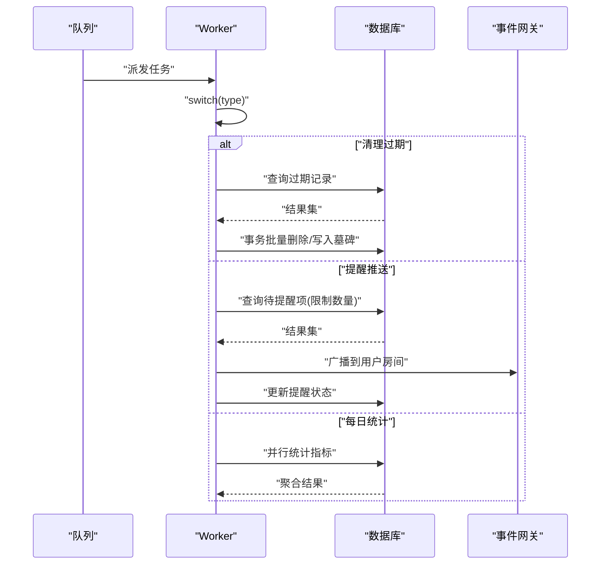
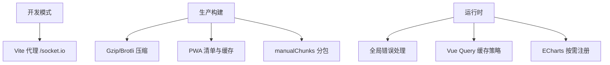
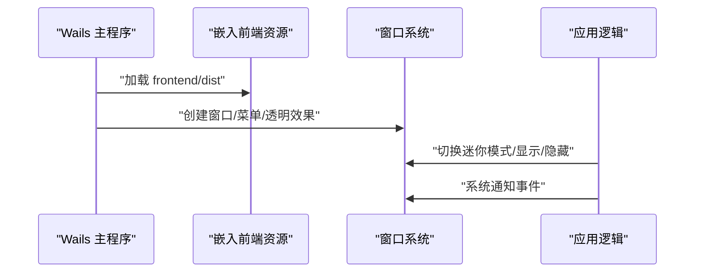
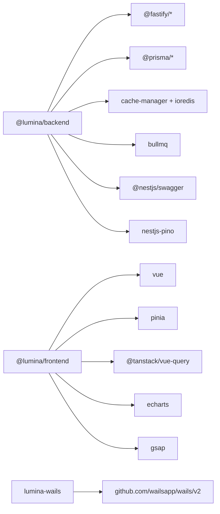

# 性能优化与资源管理

<cite>
**本文引用的文件**
- [apps/backend/src/main.ts](file://apps/backend/src/main.ts)
- [apps/backend/src/prisma/prisma.service.ts](file://apps/backend/src/prisma/prisma.service.ts)
- [apps/backend/src/redis/redis.service.ts](file://apps/backend/src/redis/redis.service.ts)
- [apps/backend/src/redis/cache.decorator.ts](file://apps/backend/src/redis/cache.decorator.ts)
- [apps/backend/src/scheduled-tasks/scheduled-tasks.processor.ts](file://apps/backend/src/scheduled-tasks/scheduled-tasks.processor.ts)
- [apps/backend/src/common/interceptors/transform.interceptor.ts](file://apps/backend/src/common/interceptors/transform.interceptor.ts)
- [apps/backend/src/common/interceptors/sanitize.interceptor.ts](file://apps/backend/src/common/interceptors/sanitize.interceptor.ts)
- [apps/backend/src/common/filters/all-exceptions.filter.ts](file://apps/backend/src/common/filters/all-exceptions.filter.ts)
- [apps/frontend/src/main.ts](file://apps/frontend/src/main.ts)
- [apps/frontend/vite.config.mts](file://apps/frontend/vite.config.mts)
- [apps/frontend/nginx.conf](file://apps/frontend/nginx.conf)
- [apps/wails/main.go](file://apps/wails/main.go)
- [apps/wails/app.go](file://apps/wails/app.go)
- [apps/backend/package.json](file://apps/backend/package.json)
- [apps/frontend/package.json](file://apps/frontend/package.json)
- [apps/wails/go.mod](file://apps/wails/go.mod)
</cite>

## 目录
1. [引言](#引言)
2. [项目结构](#项目结构)
3. [核心组件](#核心组件)
4. [架构总览](#架构总览)
5. [详细组件分析](#详细组件分析)
6. [依赖分析](#依赖分析)
7. [性能考量](#性能考量)
8. [故障排查指南](#故障排查指南)
9. [结论](#结论)
10. [附录](#附录)

## 引言
本指南面向桌面应用的性能优化与资源管理，结合仓库中的后端、前端与 Wails 桌面桥接层的实际实现，系统阐述以下主题：
- 内存管理、垃圾回收与资源泄漏预防
- 渲染性能优化（含 GPU/硬件加速启用建议）
- 网络请求优化与缓存策略
- 数据库连接池与查询优化
- 内存使用监控与性能分析工具使用
- 启动时间与运行时性能优化
- 大文件处理与流式传输最佳实践
- 多线程与并发处理
- 性能测试与基准测试方法
- 不同硬件配置下的调优建议

## 项目结构
该仓库采用多包工作区布局，包含后端 NestJS 服务、前端 Vue3 应用、Wails 桌面桥接层以及共享包。前端通过 Vite 构建并内置 PWA 与压缩插件；后端基于 Fastify 适配器，启用压缩、静态资源、安全中间件与全局拦截器/过滤器；Wails 层负责窗口、菜单与系统交互。

图表来源
- [apps/frontend/src/main.ts:1-138](file://apps/frontend/src/main.ts#L1-L138)
- [apps/frontend/vite.config.mts:1-185](file://apps/frontend/vite.config.mts#L1-L185)
- [apps/frontend/nginx.conf:1-125](file://apps/frontend/nginx.conf#L1-L125)
- [apps/backend/src/main.ts:1-201](file://apps/backend/src/main.ts#L1-L201)
- [apps/backend/src/prisma/prisma.service.ts:1-34](file://apps/backend/src/prisma/prisma.service.ts#L1-L34)
- [apps/backend/src/redis/redis.service.ts:1-233](file://apps/backend/src/redis/redis.service.ts#L1-L233)
- [apps/backend/src/scheduled-tasks/scheduled-tasks.processor.ts:1-290](file://apps/backend/src/scheduled-tasks/scheduled-tasks.processor.ts#L1-L290)
- [apps/wails/main.go:1-95](file://apps/wails/main.go#L1-L95)
- [apps/wails/app.go:1-168](file://apps/wails/app.go#L1-L168)

章节来源
- [apps/frontend/src/main.ts:1-138](file://apps/frontend/src/main.ts#L1-L138)
- [apps/frontend/vite.config.mts:1-185](file://apps/frontend/vite.config.mts#L1-L185)
- [apps/frontend/nginx.conf:1-125](file://apps/frontend/nginx.conf#L1-L125)
- [apps/backend/src/main.ts:1-201](file://apps/backend/src/main.ts#L1-L201)
- [apps/backend/src/prisma/prisma.service.ts:1-34](file://apps/backend/src/prisma/prisma.service.ts#L1-L34)
- [apps/backend/src/redis/redis.service.ts:1-233](file://apps/backend/src/redis/redis.service.ts#L1-L233)
- [apps/backend/src/scheduled-tasks/scheduled-tasks.processor.ts:1-290](file://apps/backend/src/scheduled-tasks/scheduled-tasks.processor.ts#L1-L290)
- [apps/wails/main.go:1-95](file://apps/wails/main.go#L1-L95)
- [apps/wails/app.go:1-168](file://apps/wails/app.go#L1-L168)

## 核心组件
- 后端启动与中间件：启用 Fastify、压缩、静态资源、安全头、CSRF/XSS 清理、全局拦截器与异常过滤器，统一 API 响应格式。
- 数据库连接池：基于 pg 的连接池与 Prisma 适配器，在模块生命周期中正确建立/关闭连接。
- 缓存系统：基于 cache-manager 与 Redis，提供命名空间、TTL、穿透保护、批量删除等能力。
- 定时任务：BullMQ Worker 处理健康检查、过期数据清理、提醒推送与每日统计，事务保证一致性。
- 前端构建与运行：Vite 多插件压缩、PWA、分包策略；全局错误处理与 Vue Query 缓存策略。
- Wails 桌面桥接：窗口、菜单、透明背景、平台特定外观与事件绑定。

章节来源
- [apps/backend/src/main.ts:34-195](file://apps/backend/src/main.ts#L34-L195)
- [apps/backend/src/prisma/prisma.service.ts:6-32](file://apps/backend/src/prisma/prisma.service.ts#L6-L32)
- [apps/backend/src/redis/redis.service.ts:52-202](file://apps/backend/src/redis/redis.service.ts#L52-L202)
- [apps/backend/src/scheduled-tasks/scheduled-tasks.processor.ts:36-289](file://apps/backend/src/scheduled-tasks/scheduled-tasks.processor.ts#L36-L289)
- [apps/frontend/src/main.ts:54-137](file://apps/frontend/src/main.ts#L54-L137)
- [apps/frontend/vite.config.mts:80-184](file://apps/frontend/vite.config.mts#L80-L184)
- [apps/wails/main.go:20-94](file://apps/wails/main.go#L20-L94)
- [apps/wails/app.go:12-168](file://apps/wails/app.go#L12-L168)

## 架构总览
后端以 Fastify 为核心，配合 Prisma/PostgreSQL 与 Redis 缓存；前端通过 Vite 构建并由 Nginx 提供静态资源与压缩；Wails 将前端资源嵌入桌面应用，提供原生窗口与系统交互。

图表来源
- [apps/frontend/nginx.conf:1-125](file://apps/frontend/nginx.conf#L1-L125)
- [apps/frontend/vite.config.mts:80-184](file://apps/frontend/vite.config.mts#L80-L184)
- [apps/backend/src/main.ts:34-195](file://apps/backend/src/main.ts#L34-L195)
- [apps/backend/src/prisma/prisma.service.ts:6-32](file://apps/backend/src/prisma/prisma.service.ts#L6-L32)
- [apps/backend/src/redis/redis.service.ts:52-202](file://apps/backend/src/redis/redis.service.ts#L52-L202)
- [apps/backend/src/scheduled-tasks/scheduled-tasks.processor.ts:36-289](file://apps/backend/src/scheduled-tasks/scheduled-tasks.processor.ts#L36-L289)
- [apps/wails/main.go:20-94](file://apps/wails/main.go#L20-L94)

## 详细组件分析

### 后端启动与中间件（性能与安全）
- 启用 Fastify 适配器，降低 HTTP 层开销；开启 Gzip 压缩与静态资源服务，减少带宽与延迟。
- 安全中间件：Helmet 内容安全策略、跨源策略；CSRF/XSS 清理拦截器；Cookie、Multipart 限制上传大小与数量。
- 全局拦截器与异常过滤器：统一响应格式、结构化错误输出，便于前端与监控系统解析。
- Swagger 文档自动生成，便于 API 性能与行为验证。

图表来源
- [apps/backend/src/main.ts:65-157](file://apps/backend/src/main.ts#L65-L157)
- [apps/backend/src/common/interceptors/sanitize.interceptor.ts:10-63](file://apps/backend/src/common/interceptors/sanitize.interceptor.ts#L10-L63)
- [apps/backend/src/common/interceptors/transform.interceptor.ts:18-29](file://apps/backend/src/common/interceptors/transform.interceptor.ts#L18-L29)
- [apps/backend/src/common/filters/all-exceptions.filter.ts:16-136](file://apps/backend/src/common/filters/all-exceptions.filter.ts#L16-L136)

章节来源
- [apps/backend/src/main.ts:34-195](file://apps/backend/src/main.ts#L34-L195)
- [apps/backend/src/common/interceptors/sanitize.interceptor.ts:1-64](file://apps/backend/src/common/interceptors/sanitize.interceptor.ts#L1-L64)
- [apps/backend/src/common/interceptors/transform.interceptor.ts:1-30](file://apps/backend/src/common/interceptors/transform.interceptor.ts#L1-L30)
- [apps/backend/src/common/filters/all-exceptions.filter.ts:1-137](file://apps/backend/src/common/filters/all-exceptions.filter.ts#L1-L137)

### 数据库连接池与查询优化
- 使用 pg.Pool 与 PrismaPg 适配器，集中管理连接；在模块销毁阶段显式结束连接池，避免资源泄漏。
- 查询层面建议：
  - 使用事务包裹批量写入，减少往返与锁竞争。
  - 对高频查询建立合适索引，避免全表扫描。
  - 控制一次性读取的数据量，必要时分页或流式读取。
  - 使用连接池最大并发与空闲超时参数平衡吞吐与资源占用。

图表来源
- [apps/backend/src/prisma/prisma.service.ts:6-32](file://apps/backend/src/prisma/prisma.service.ts#L6-L32)

章节来源
- [apps/backend/src/prisma/prisma.service.ts:1-34](file://apps/backend/src/prisma/prisma.service.ts#L1-L34)

### 缓存策略与装饰器
- RedisService 提供统一的缓存接口：命名空间、TTL、批量删除、穿透保护 getOrSet、刷新 TTL 等。
- CachePrefix 与 CacheTTL 常量规范键空间与过期时间，避免冲突与滥用。
- @CacheableTTL 装饰器提供方法级缓存 TTL 配置，结合 NoCache 装饰器禁用特定接口缓存。

图表来源
- [apps/backend/src/redis/redis.service.ts:52-202](file://apps/backend/src/redis/redis.service.ts#L52-L202)
- [apps/backend/src/redis/redis.service.ts:207-232](file://apps/backend/src/redis/redis.service.ts#L207-L232)

章节来源
- [apps/backend/src/redis/redis.service.ts:1-233](file://apps/backend/src/redis/redis.service.ts#L1-L233)
- [apps/backend/src/redis/cache.decorator.ts:53-87](file://apps/backend/src/redis/cache.decorator.ts#L53-L87)

### 定时任务与并发处理
- ScheduledTasksProcessor 使用 BullMQ Worker 处理多种周期性任务：健康检查、过期清理、提醒推送、每日统计。
- 事务保证数据一致性；Promise.all 并行统计提升效率；对长列表处理设置上限（如提醒任务取前若干条）避免阻塞。

图表来源
- [apps/backend/src/scheduled-tasks/scheduled-tasks.processor.ts:36-289](file://apps/backend/src/scheduled-tasks/scheduled-tasks.processor.ts#L36-L289)

章节来源
- [apps/backend/src/scheduled-tasks/scheduled-tasks.processor.ts:1-290](file://apps/backend/src/scheduled-tasks/scheduled-tasks.processor.ts#L1-L290)

### 前端构建与运行时性能
- Vite 配置：
  - Gzip/Brotli 压缩与 PWA 插件，提升首包与离线体验。
  - manualChunks 按依赖库分包，减少重复与缓存失效。
  - 开发代理与超时设置，保障 WebSocket 长连接稳定性。
- 运行时：
  - 全局错误处理与 Chunk 加载失败自动刷新策略，降低白屏风险。
  - Vue Query 默认 staleTime 与重试策略，平衡实时性与网络压力。
  - ECharts 注册必要渲染器与组件，避免不必要的渲染开销。

图表来源
- [apps/frontend/vite.config.mts:80-184](file://apps/frontend/vite.config.mts#L80-L184)
- [apps/frontend/src/main.ts:54-137](file://apps/frontend/src/main.ts#L54-L137)

章节来源
- [apps/frontend/vite.config.mts:1-185](file://apps/frontend/vite.config.mts#L1-L185)
- [apps/frontend/src/main.ts:1-138](file://apps/frontend/src/main.ts#L1-L138)

### Wails 桌面桥接与窗口性能
- main.go 将前端 dist 嵌入资源，配置透明窗口、平台外观与菜单；app.go 提供窗口尺寸、位置、通知等系统交互。
- 建议：
  - 启用硬件加速渲染（若使用 WebView2 或对应平台支持）。
  - 控制窗口最小化/最大化频率，避免频繁重绘。
  - 使用事件总线传递数据，减少跨进程通信开销。

图表来源
- [apps/wails/main.go:20-94](file://apps/wails/main.go#L20-L94)
- [apps/wails/app.go:12-168](file://apps/wails/app.go#L12-L168)

章节来源
- [apps/wails/main.go:1-95](file://apps/wails/main.go#L1-L95)
- [apps/wails/app.go:1-168](file://apps/wails/app.go#L1-L168)

## 依赖分析
- 后端依赖 Fastify、Prisma、Redis、BullMQ、Swagger、Pino 等，形成高性能、可观测、可扩展的服务层。
- 前端依赖 Vue3、Pinia、Vue Query、ECharts、GSAP 等，强调交互与可视化性能。
- Wails 依赖官方 SDK，提供跨平台桌面能力。

图表来源
- [apps/backend/package.json:30-86](file://apps/backend/package.json#L30-L86)
- [apps/frontend/package.json:30-69](file://apps/frontend/package.json#L30-L69)
- [apps/wails/go.mod:7-37](file://apps/wails/go.mod#L7-L37)

章节来源
- [apps/backend/package.json:1-108](file://apps/backend/package.json#L1-L108)
- [apps/frontend/package.json:1-104](file://apps/frontend/package.json#L1-L104)
- [apps/wails/go.mod:1-38](file://apps/wails/go.mod#L1-L38)

## 性能考量
- 内存管理与 GC
  - 后端：合理设置 NODE_OPTIONS 的堆大小，避免 OOM；在模块销毁阶段主动断开数据库与缓存连接。
  - 前端：避免大对象常驻内存，及时清理定时器与事件监听；利用分包与懒加载减少峰值内存。
  - Wails：控制 WebView 资源占用，避免频繁创建销毁窗口。
- 渲染性能
  - 启用 Gzip/Brotli 压缩与 PWA 缓存；前端按需注册 ECharts 组件，避免全量引入。
  - Wails 中尽量使用 CSS 动画与硬件加速图层，减少 JS 阻塞。
- 网络与缓存
  - 后端：全局压缩、静态资源缓存；Redis 缓存热点数据，结合命名空间与 TTL。
  - 前端：Vue Query 默认缓存策略与 staleTime；Vite 压缩与分包。
  - Nginx：Gzip、缓存头、CSP/权限策略，减少无效请求。
- 数据库与队列
  - 连接池参数与事务批处理；BullMQ 任务拆分与幂等设计。
- 监控与分析
  - 后端：Pino 日志、Swagger 文档、健康检查端点；Nginx 访问日志。
  - 前端：浏览器性能面板、Vue Devtools、网络面板。
  - Wails：系统资源监视器与日志输出。
- 启动与运行时
  - 后端：优雅关闭钩子、CORS/安全中间件前置；Fastify 适配器降低延迟。
  - 前端：预热关键模块、PWA 缓存、分包策略；Nginx 预压缩与静态资源。
  - Wails：窗口初始化顺序与资源加载顺序优化。
- 大文件与流式传输
  - 上传限制与分块策略；后端 multipart 限制；前端流式读取与进度反馈。
- 多线程与并发
  - 后端：BullMQ Worker 并发处理；Prisma 事务隔离；Redis 命令异步。
  - 前端：Web Workers（如适用）、避免主线程阻塞；Vue Query 并发去重。
- 测试与基准
  - 使用 Vitest 进行单元与集成测试；后端 Swagger 与 e2e；前端交互测试与性能回归。
- 硬件差异化
  - 低配设备：减少动画与特效、降低分包体积、启用更强缓存；高配设备：适度增加并发与缓存命中率。

## 故障排查指南
- 启动失败
  - 检查 DATABASE_URL 是否配置；确认 Prisma 连接池初始化与销毁流程。
  - 查看后端日志与 Nginx 错误日志，定位中间件或静态资源问题。
- 响应异常
  - 全局异常过滤器会输出结构化错误；检查 Zod 验证错误映射与国际化键。
- 缓存问题
  - RedisService 的 onModuleDestroy 会断开连接；检查缓存键前缀与 TTL。
- 定时任务卡顿
  - 检查任务耗时与事务范围；限制单次处理数量；观察 Worker 事件日志。
- 前端白屏/Chunk 加载失败
  - 观察全局错误处理与自动刷新逻辑；检查 Vite 构建产物与 Nginx 缓存头。
- Wails 窗口异常
  - 检查窗口尺寸/位置计算与屏幕检测；确认事件绑定与上下文状态。

章节来源
- [apps/backend/src/prisma/prisma.service.ts:23-32](file://apps/backend/src/prisma/prisma.service.ts#L23-L32)
- [apps/backend/src/redis/redis.service.ts:58-74](file://apps/backend/src/redis/redis.service.ts#L58-L74)
- [apps/backend/src/common/filters/all-exceptions.filter.ts:27-136](file://apps/backend/src/common/filters/all-exceptions.filter.ts#L27-L136)
- [apps/backend/src/scheduled-tasks/scheduled-tasks.processor.ts:280-289](file://apps/backend/src/scheduled-tasks/scheduled-tasks.processor.ts#L280-L289)
- [apps/frontend/src/main.ts:58-113](file://apps/frontend/src/main.ts#L58-L113)
- [apps/wails/app.go:112-168](file://apps/wails/app.go#L112-L168)

## 结论
本指南基于仓库现有实现，总结了从后端中间件、数据库连接池、缓存与定时任务，到前端构建与运行时、Wails 桌面桥接的性能优化要点。建议在实际部署中结合监控数据持续迭代：优化缓存命中率、缩短关键路径、控制并发与资源占用，并针对不同硬件配置制定差异化策略。

## 附录
- 关键配置参考
  - 后端 Fastify 压缩与静态资源：[apps/backend/src/main.ts:101-113](file://apps/backend/src/main.ts#L101-L113)
  - 前端 Vite 压缩与分包：[apps/frontend/vite.config.mts:88-103](file://apps/frontend/vite.config.mts#L88-L103)、[apps/frontend/vite.config.mts:175-182](file://apps/frontend/vite.config.mts#L175-L182)
  - Nginx Gzip 与 CSP：[apps/frontend/nginx.conf:11-96](file://apps/frontend/nginx.conf#L11-L96)
  - Wails 窗口与透明：[apps/wails/main.go:64-89](file://apps/wails/main.go#L64-L89)